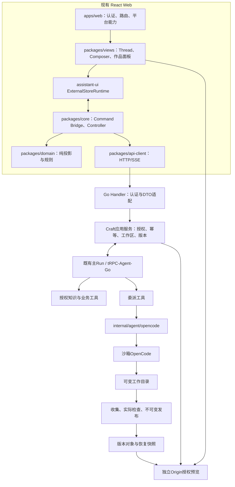

# WeKnora Craft 详细设计

**版本：1.0 · 设计日期：2026-09-18**  
**代码基线：`1123786563/WeKnora-fork01@0cba2f85f8998a28691d564690a1261dcc041643`**  
**适用：React/Vite + assistant-ui + WeKnora Go + tRPC-Agent-Go + OpenCode**  
**交付边界：设计与独立高保真原型；没有修改、构建或部署业务仓库。**

本设计承接上轮 `craft-architecture-review.md`，用本轮重新读取的主题令牌、Controller、Craft 领域契约及根构建脚本校准。`[现有]` 表示静态代码或上轮审阅有证据；`[目标]` 表示本轮设计；`[待执行验证]` 表示必须以集成测试确认。完整来源见 `06-来源与审阅边界.md`。

## 1. 产品目标与范围

Craft 是现有 WeKnora 工作台内的“知识驱动作品创作”功能，不是新登录系统、平级 Agent 平台或通用 IDE。用户的完整旅程是：描述目标 → 选择资料 → 生成 → 检查与预览 → 修改 → 历史版本 → 下载。

首个上线门槛是**网页 v1 → 修改 v2 → v1 内容及 hash 不变**。网页首版限定为受控静态网页、报告和前端小工具，不承诺任意后端部署。文档、表格、演示稿各自经过真实生成、验证、预览、修改与历史下载后启用。模板初期是版本化的目标提示与类型配置，不额外建设模板市场。

不在本轮范围：重做身份/计费平台、迁移 Next.js、任意公网部署、多人同时编辑同一工作目录、完整在线 Office 编辑器、原生移动端或微信小程序实现。响应式 HTML 仅表示 Web 窄屏体验。

### 1.1 成功标准

| 目标 | 可观察证据 | 不可替代的条件 |
|---|---|---|
| 接上现有主运行 | Run ID、ToolCall ID、OpenCode 消息关联与持久化事件一致 | 不是两个 Runtime 各维护一个“总任务” |
| 真正使用 assistant-ui | 依赖锁、实际 Provider/Thread、组件测试、浏览器测试 | 不能只保留相似 React DOM |
| 交付可信作品 | 文件 manifest、hash、实际检查结果、可重建来源 | 后缀正确或预览截图不等于文件有效 |
| 恢复不重复执行 | 提交响应丢失、断流、worker 重启测试 | 重连只恢复读取 |
| 原有品牌延续 | 令牌别名、桌面/窄屏截图、交互对比 | 不新增不相关的紫色/墨绿色主主题 |
| 安全与成本有界 | 权限、执行预算、隔离、撤权、终止路径 | 内部试用也不是无限 allow-all |

## 2. 设计决策

| 编号 | 决策 | 原因和影响 |
|---|---|---|
| ADR-C01 | 保留 React/Vite 和现有 workspace 包分层 | 不引入额外 BFF；减少宿主迁移风险 |
| ADR-C02 | assistant-ui 接外部 Store | 当前 Controller 与持久化事件已经拥有业务状态 [R04] |
| ADR-C03 | tRPC-Agent-Go 主运行，OpenCode 被工具委派 | 子任务结束不决定主 Run 终态；不新增第二套主 Run |
| ADR-C04 | 一件作品暂映射一个 Craft Session | 工作区、多轮修改、版本可沿用现有结构 [R03][R00] |
| ADR-C05 | 保留既有 REST + RunEvent SSE | AG-UI 将来只能在规范事实之后做投影，不重新决定状态 |
| ADR-C06 | 历史版本、编辑基线、工作区 revision 分离 | 查看不写入；恢复不自动发布新版本 |
| ADR-C07 | 蓝色品牌/导航，绿色创作主动作 | 来自仓库双轨令牌；避免误用 shadcn primary [R01][R02] |
| ADR-C08 | 原型使用透明 mock，生产按能力开关 | 页面有按钮不表示服务已注册或作品类型已通过验收 |

## 3. 架构与模块职责

### 3.1 代码分工与修改边界

| 位置 | 状态 | 负责 | 禁止 |
|---|---|---|---|
| `packages/design-tokens/src/tokens.ts` | 现有 | 继承色值、字体、圆角等基础值 | 在页面复制一份品牌颜色来源 |
| `packages/ui/src/theme.css` | 现有 | Tailwind/语义变量映射 | 把全局 primary 强制改成 Craft 色 |
| `packages/ui/src/` | 现有 | 基础按钮、输入、弹窗等 | 引入第三套交互组件系统 |
| `packages/views/src/craft/assistant-runtime.tsx` | 建议新增 | 适配既有状态到 assistant-ui | 自行创建服务器 Session 或 Run |
| `packages/views/src/craft/thread.tsx` | 建议新增 | 对话/工具卡呈现 | 解析 OpenCode 原始 SSE |
| `packages/views/src/craft/workbench.tsx` | 现有改造 | 工作台布局与面板组合 | 直接读租户密钥或写数据库 |
| `packages/core/src/craft/controller.ts` | 现有 | 快照、顺序事件、重连、取消订阅 | 因断流再次提交用户目标 |
| `packages/core/src/craft/command-bridge.ts` | 建议新增或收敛既有入口 | 附件、资料、基线、幂等与命令串联 | 只提交纯文本而丢掉附件 |
| `packages/domain/src/craft/` | 现有扩展 | 无副作用投影、权限能力计算 | 引入 React、浏览器存储、fetch |
| `apps/web/src/features/craft/routes.tsx` | 现有 | 宿主能力装配、路由切换 | 再复制一个 Controller |
| `internal/handler/session/craft*.go` | 现有 | 认证后路由、输入响应 | 信任 body 中 tenant/user |
| `internal/application/service/craft*.go` | 现有 | 应用规则、编排、授权、事务 | 替代主 Agent 实现新的循环 |
| `internal/craft/contracts.go` | 现有 | Scope、Workspace、Task、Version、Store、Executor | 承担 HTTP、数据库、图运行 |
| `internal/agent/opencode/` | 现有 | 固定版协议、核对、终止 | 与旧 `internal/craft/opencode` 双轨维护 |

新文件名只是建议落点；T001 必须先检查现有同职责实现，已有则补齐而非再造。后端仓库/迁移结构未全量复核，本设计不凭空新增同名表。

## 4. 页面与交互详细设计

### 4.1 P01 创作首页

主内容最大宽度 1120px。一级标题 36/44；创建器白底、12px 圆角、细描边。上部类型选择，中央多行目标，下部资料 chips 与操作。空目标不能开始；纯空白视为空。提示最大长度、上传限制等从服务能力取得，不在客户端自行编造商业上限。

创建按逻辑请求串联：创建 Session → 上传并确认输入 → 关联资料 → 提交主 Run → 导航到工作台。每个可重试命令有自己的幂等键，整个创建意图有 correlation ID。已创建会话而上传失败时，不重建会话；保留草稿并允许重试上传。作品类型下线后保留草稿，提示更换类型，不静默降级。

模板只是填充目标与类型；不自动执行、授权或选择用户未批准的知识库。最近作品仅列有读取权限的会话；生产不硬编码“6 件”。

### 4.2 P02 我的作品与 P03 模板

作品卡展示：标题、类型、最后交付版本、更新时间、主运行状态。正在运行与已存在旧版本可并存。搜索与类型过滤应用于授权后的分页列表，不泄露无权标题或数量。加载、空集合、无匹配、失败分别呈现；切过滤先取消旧请求，响应必须绑定 scope epoch。

模板显示结果类型、目标示例与能力要求。没有该类型能力时禁用并给原因；原型中的四类模板是设计态，不代表部署都已开放。公开分享、星标、删除不做无后端的可用按钮。

### 4.3 P04 双栏工作台

桌面导航 224px，顶栏 68px，对话列目标 388px，作品列取剩余宽度。对话和作品分别滚动，输入区固定在对话底部。1280px 保持双栏；760px 以下切“对话/作品/来源”。中间宽度可收窄导航，但不把画布压至不可用。

顶部展示标题与主状态；右侧来源、版本、导出。标题不是 Run 标识；Run/Task/Revision 等放在详情。作品面板展示预览/文件/检查，版本选择器始终指明当前查看版本。查看 v1 而编辑基线 v3 时，Composer 显式写“从 v3 继续修改”，提供恢复入口而不暗改基线。

对话里工具过程只显示用户可理解的执行摘要，不展示模型内部推理。空作品先显示目标和正在执行；没有版本时导出禁用。文件检查未通过不展示“全部通过”；新一轮失败时仍展示上次已发布版本。

### 4.4 P05 来源抽屉

宽 460px，手机全宽。头部明确“当前版本引用”和“下一次提交的资料”不是同一集合。版本引用使用稳定 citation ID 与来源定位；下一轮选择不修改旧版本 manifest。展开原文、再次检索、复制受限内容前重新检查 ACL。

撤权后保留允许暴露的引用占位，不继续显示缓存原文或泄露标题/片段。是否保留标题由原资源规则决定。上传状态细分为选择、上传、处理中、可用、失败；文件已上传不意味着知识已索引。原型仅展示本地文件名/大小，没有上传或解析。

### 4.5 P06 版本抽屉与恢复确认

版本列表：版本号、生成 Run、时间、摘要、检查状态、是否可恢复。`查看` 是只读操作；`从此版本继续` 要二次确认，并说明恢复源、影响的工作区以及不会覆盖旧版本。

恢复门槛同时满足：write、无活动工作槽、最新 revision 匹配、完整恢复源、运行环境可满足。服务器进行最终 CAS；按钮禁用不是安全边界。409 后拉取快照并让用户重新确认，不自动改到另一个基线。恢复成功更新工作区 revision/必要时 generation，然后更新编辑基线；没有新创作不得凭空发布版本。

### 4.6 P07 文件与检查

文件列表来源于明确版本 manifest，显示路径、媒体类型、大小与真实 hash。预览/下载只接受 manifest 中的路径，拒绝 `../`、编码绕过、软链接逃逸、密钥及隐藏凭据目录。界面不拼接存储私有 URL。

检查结果分 passed/failed/not_run，并列检查工具版本、输入版本与证据摘要。构建通过、内容策略通过、浏览器检查和权限检查是不同项。用量未知显示“待核对”，不显示 0；运行耗时与计费金额不混写。

### 4.7 P08 问题、审批与取消

问题用于澄清业务需求，不扩大权限。操作许可必须包含准确工具、命令/资源范围、请求 revision 或 payload hash、到期时间；“允许一次”优先，不默认给长期全权。

点击批准后：提交中 → 已记录 → 等待送达 → 已确认送达。网络失败保持不明/核对，而非重复批准。取消有确认，受理后显示取消中；仅 authoritative terminal 决定已取消。取消和批准并发时，由服务端 fence/请求状态拒绝过期决定。

## 5. 前端状态与 assistant-ui 适配

### 5.1 单一事实来源

服务端事实只有既有快照与 RunEvent。Controller 拥有同步生命周期。domain 拥有纯投影。assistant-ui 读取适配后的视图，不单独维护另一份已发送历史。局部 UI state 仅存标签页、抽屉、草稿、预览尺寸等。

独立维度：连接状态、主 Run 状态、子委派状态、作品可用性、查看版本、编辑基线、权限、输入就绪、审批送达。`isRunning` 不能同时代表这些维度。只读与仅禁发分别映射 SDK 能力；具体 ExternalStoreRuntime API 以锁定版本和 peerDependencies 实测为准 [U01][U02]。

### 5.2 投影规则

1. 消息 ID 来自稳定服务端 ID；工具卡按 tool_call_id 归并，不用每次随机 ID。
2. 流式片段按事件序号与消息偏移追加；重放不重复文本。
3. 包括非 Craft 事件在内的完整主 Run seq 进入游标推进，不能先过滤再判断缺号。
4. 序号重复丢弃；缺口、游标过期或新 generation 重新读取权威快照。
5. 每个异步 continuation 检查 scope epoch；切租户/用户/会话后旧事件不得写新画面。
6. 子任务 idle/finish 不把主消息标成 completed。只有主 Run 终态投影能完成主消息。
7. 附件 adapter 上传得到引用，再由命令桥绑定输入；不把大文件默认 base64 塞进消息状态。

### 5.3 统一命令桥

UI 调用 `submitDraft / cancelRun / answerQuestion / decidePermission / restoreVersion / refreshPreview` 等端口，签名见 `examples/command-bridge.types.ts`。它们是目标内部接口，不是已存在的 REST 协议。

发送前捕获不可变意图：文本、类型、已完成上传引用、知识范围、baseVersion、expectedRevision。生成一次 requestId；同意图响应丢失时重用，内容变更必须新建。上传重试不重复创建 Run。Controller 重连不得调用 submitDraft。权限与租户上下文由宿主认证通道取得，不把 UI 提供的 tenant_id 当成事实。

## 6. 后端执行链

### 6.1 主运行与委派

1. 应用服务授权会话、输入、模型/工具能力与有限预算。
2. 主 Run 通过既有入场机制取得工作槽；重复键返回原 run，payload 不同返回冲突。
3. 主 Agent 选择授权资料及任务目标，调用委派工具。OpenCode 不接收平台管理员密钥。
4. PrepareTask 在本地先持久化 Task、request hash、tool_call_id、prompt_message_id 和 fence。
5. 固定版 Adapter 提交并观察 OpenCode；关联到同一个 session/message，而非只信原始流结束。
6. 无法证明远端接受与否时进入核对，不因读超时盲目重复有副作用操作。
7. 子结果回到主 ToolCall。主 Agent 可以继续修复、解释或等待，不直接继承子任务终态。
8. 文件收集与验证通过后发布不可变版本；版本已发布与主回答完成是分别可观察的事实。

### 6.2 原子性、并发与恢复

使用既有数据库事务/Store；同一 scope+session 工作区只允许一个写入者。revision 用于 CAS，generation 区分重建工作区，fence 拒绝失效 worker。过期 worker 即使完成文件写入，也不能修改当前 binding 或发布到新 generation。

委派状态不明不是失败的同义词，不关闭待解决 ToolCall，不生成成功产物。观察读取失败应采用限时退避与可诊断状态；达到上限交人工核对或安全结束，不无限轮询。取消请求和截止时间贯穿 HTTP、执行器、命令与收集阶段。

### 6.3 持久化扩展策略

先复核现有模型：Scope、Workspace、Task、Version 已存在 [R03]。下面是**需要保存的信息**，不是要求新建相同名字的表：

| 聚合 | 必须信息 | 唯一性/一致性 |
|---|---|---|
| 提交意图 | scope、requestId、payload hash、主 run | scope+逻辑请求唯一；不同 payload 冲突 |
| 工作区 | sandbox、generation、runtime digest、revision、活动占用 | 单写者、CAS、fence |
| 委派 | tool call、远端 session/message、截止时间、接受证据 | 不丢关联；不明不得终结成成功 |
| 版本 | files/hash/checks、主 run、来源引用、恢复源引用 | 发布后不可改写；不能隐式回退最新 |
| 决策 | interaction、scope、revision/hash、决定、送达事实 | 一次决策、可核对、过期拒绝 |
| 计量 | 物理请求 ID、父子归属、资源维度、未知标志 | 重放去重，真实新调用另记 |

对象上传与数据库提交不是同一事务时，先 staging →校验→提交 manifest 指针；失败对象由保守 GC 清理。不会把半成品目录作为已发布版本返回。

## 7. 作品类型契约

| 类型 | 修改源 | 交付文件 | 预览 | 发布前验证 |
|---|---|---|---|---|
| 网页 | 受控 HTML/CSS/JS 或前端工程源 | manifest 文件；ZIP 需另立打包接口 | 独立 Origin、最小 sandbox | 真构建、资源完整、浏览器、路径/外连策略 |
| 文档 | Markdown/结构化源与生成脚本 | 同版本 Markdown/DOCX | 消毒渲染/预生成分页 | OOXML 实际可开、中文/表格/引用、版本一致 |
| 表格 | 数据、公式与生成源 | XLSX | 经验证的 JSON/只读网格 | 真实公式重算、缓存值一致、宏/外链策略 |
| 演示稿 | 可重建结构化内容与资产 | PPTX | 同版分页预览 | 真打开、页数、字体、溢出、图表、逐页截图 |

检查依赖进入固定镜像并记录 digest。字体授权是生产构建依赖管理事项；本包不分发字体。原型 Office 视图只是视觉示例，不包含真实 Office 生成器。只有类型验收过关才提升对应能力开关。

## 8. 预览与权限

生产继续复用既有 Preview Ticket 与 iframe 路径 [R00]。推荐独立注册域/Origin、不携带业务 Cookie、CSP、Referrer-Policy、资源白名单和最小 iframe sandbox。预览 origin 不是同一业务 origin 的“另一条路径”。

票据到期只更新预览授权，不创建 Run，不重建版本。多资源取票机制按现有协议，不能用错误的一次性 token 模型导致 CSS/JS 请求失效。撤销在线授权无法收回用户先前下载的副本，应明确产品边界。

知识文本是数据，不是提升命令/网络权限的指令。工具、路径、模型路由和预算由服务端确定。日志不包含原文敏感片段、会话 cookie、模型 key、预览票据。最终403/404策略遵从现有资源披露规则。

## 9. 预算、用量与发布

首条真实网页链路必须具备有限并发、截止时间、调用次数、沙箱资源及网络策略。预留预算与实际消耗用既有计费入口核对；Craft 不新增 Credits 真账本。

按物理模型调用记录，主/子运行只提供归属关系。不能把 OpenCode 汇总再和底层请求相加。未知用量保留未知，不置零；同请求日志重放去重，真实重试的另一请求记录实际成本。存储、沙箱和模型是不同维度。

发布三级门：Web 内部受控试用 → 网页生产 → 每种 Office 类型单独开放。开关回滚只阻止新任务，不删除已发布版本；活动任务按明确的排空/取消策略处理。上线前证据必须包含 commit、镜像 digest、fixtures、命令输出、关键 trace、截图及回滚记录。

## 10. 实施与验收的组织方式

见 `03-实施计划.md` 的 36 项任务，S00–S05 是评审与依赖分组，不表示所有阶段只能严格串行。前端可以依合同 fixture 并行，但不能把 mock 通过作为后端集成完成。协议、Controller、全局 token 与宿主 routes 等共享文件有明确锁与合并负责人。

真实完成定义：源码变更 + 指定反例测试 + 正常路径 + 证据位置 + reviewer 结论。原有代码已满足时任务产出是证据或最小接线，不重复实现。当前仓库 `test:shared` 的显式 glob 不包含 Craft 各目录，T001 必须补入覆盖并核对 typecheck 入口 [R05]。
