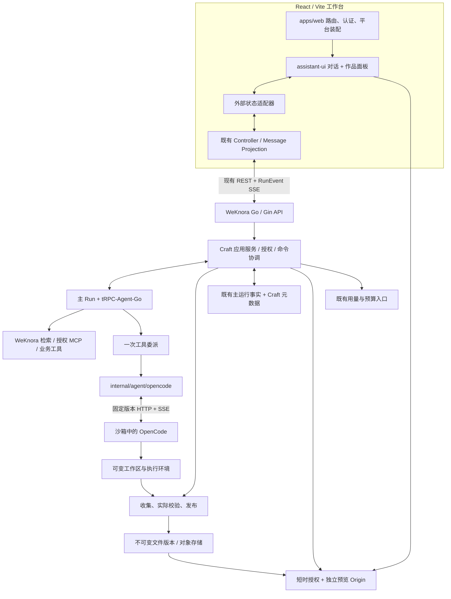

# WeKnora Craft 架构复核与交互设计

**设计日期：2026-09-18**  
**代码基线：`1123786563/WeKnora-fork01@0cba2f85f8998a28691d564690a1261dcc041643`**  
**目标技术：React + assistant-ui + tRPC-Agent-Go + OpenCode**  
**交付性质：源码静态复核、架构收敛建议、下一轮任务拆分、可点击线框。未修改或提交业务仓库。**

## 0. 结论与审阅边界

本次建议不是“再建设一套 Craft”，而是：**保留当前 WeKnora 的 Go 服务、React 共享分层、Craft 会话与工作区、OpenCode 适配器和持久化事件链路，把真正的 assistant-ui 接入现有外部状态，并用真实端到端证据完成产品收敛。**

通过 GitHub 连接读取了仓库结构、用户列出的八份文档的核心方案/任务契约，以及后端、React 装配和状态处理的关键源码段。当前执行环境未能完成本地完整 git clone，未编译业务仓库、未启动真实数据库/沙箱、未调用真实模型。下文的“已有”表示有对应源码依据，不等于线上已启用或验收通过。

用户提供的 `onyx-dot-app/onyxCraft` 仓库链接本轮通过 GitHub 连接访问返回 404，不能据此判断其删除、改名或私有化原因。因此，本次只能依据用户仓库的产品方案重建目标体验，不能声称完成对照仓库的完整源码比对、功能一致性验证或像素级复刻。

正文采用三种标记：**[事实]** 已读取源码或文档支持；**[建议]** 本次提出的目标决策；**[待验证]** 需要运行或继续追踪完整调用链才能确认。

## 1. 当前仓库：可复用的不是空壳

| 模块 | 当前证据 | 本次处理 |
|---|---|---|
| Go 主工程 | `go.mod` 声明 Go 1.26.0、Gin、GORM、tRPC-Agent-Go v1.10.0 | 保留 Go/Gin；依赖存在不能替代真实 Runtime 装配验收 |
| React 应用 | `apps/web/package.json` 为 `@weknora/web`，React/ReactDOM `^19.3.0`、Vite 构建，依赖多项 workspace 共享包 | 保留当前 React/Vite，不额外迁移 Next.js 或增加 Node BFF |
| Craft 路由装配 | `apps/web/src/features/craft/routes.tsx` 装配页面、API、controller、message log，解析 `/craft` 和 `/craft/:sessionId` | 持续承担宿主认证、路由与浏览器能力，不让共享视图反向依赖 app |
| Craft 对话 UI | `packages/views/src/craft/workbench.tsx` 明确说明目前用普通 React 实现外部状态语义，尚未实际安装并锁定 assistant-ui 接入 | **明确的优先改造点：真正挂载 assistant-ui** |
| 前端恢复控制 | `packages/core/src/craft/controller.ts` 已包含权威快照、RunEvent 序号、断流重连、游标恢复、作用域隔离 | 保留，不用 LocalRuntime 再造历史与重连状态 |
| 业务身份与协议 | `internal/craft/contracts.go` 定义 Scope、Workspace、Task、Version、Observation、Store、Executor | 继续作为边界，不再自建第二份主 Run/Checkpoint |
| OpenCode 执行 | `internal/agent/opencode` 已有 client、protocol、executor、normalizer、live_test 等源码 | 加固版本契约、恢复和取消，不复制一份到 `internal/craft/opencode` |
| Craft 业务入口 | `internal/application/service/craft_session.go` 依赖原 Session 权限、AgentRunService、VersionStore、上传、文件、模型服务 | 保持统一授权与提交入口；零值 Gate 为关闭 |
| Craft HTTP | `internal/handler/session/craft.go` 有会话、输入、Run、版本文件、预览授权、恢复、用量等路由装配 | 校准文档与 SDK；存在路由声明不等于部署已注册 |
| 预览组件 | `packages/views/src/craft/preview.tsx` 使用后端 ticket URL、`sandbox="allow-scripts"`，切版本重新创建 iframe | 保留既有隔离设计；补真实 CSP、撤权和跨域验收 |

依据：[S01]–[S09]。上述版本号是本次仓库文件内容，不是对这些软件“最新稳定版本”的推荐。

### 1.1 后端职责地图

```text
internal/handler/session/craft*.go
  └─ HTTP 入参、响应、复用认证路由组
internal/application/service/craft*.go
  ├─ Craft 会话/输入/主 Run 提交
  ├─ 授权、工作区占用、委派结果协调
  ├─ 产物收集、版本、预览、恢复
  └─ 知识、人工交互、用量/预算接缝
internal/application/repository/craft*.go
  └─ 元数据、幂等、事务、版本与 CAS
internal/craft/
  └─ 稳定领域契约与纯规则
internal/agent/runtime/
  └─ 既有主运行事实与执行控制边界
internal/agent/opencode/
  └─ 固定版本 HTTP/SSE、消息关联、观察核对、取消
```

此图是已读代码与总计划之间的职责归纳，不是对每个源码文件做过完整审计的声明。[S03][S05][S06][S07][S08][D08]

### 1.2 React 职责地图

```text
packages/contracts → packages/api-client
        ↓                   ↓
packages/domain  ←  packages/core
                            ↓
                   packages/views/craft
                            ↑
                   apps/web/features/craft
```

建议继续保持：contracts 定义 DTO；api-client 管理 HTTP/流；domain 负责纯投影规则；core 负责副作用和命令协调；views 负责 UI 与 assistant-ui React 适配；apps/web 负责当前宿主的路由、认证、上传和浏览器能力。业务事实不能分别在 React state、assistant-ui 内部和另一个 Zustand store 中独立演化。[D08][S02][S04]

## 2. 八份文档：哪些保留，哪些改写

| 文档 | 本轮理解 | 重梳建议 |
|---|---|---|
| `2026-09-10-onyx-craft-product-proposal.md` | 企业知识驱动创作、主子 Runtime、对话与作品并排 | 保留定位；将“正在 React 改造”的叙述更新为实际基线；增加当前能力/目标能力区分 |
| `2026-09-10-craft-01-runtime-workspace.md` | OpenCode 固定协议、工作区、委派和主 Run 协调 | 从从零开发清单改为源码入口+差距+真实协议/故障注入验收 |
| `2026-09-10-craft-02-web-workbench.md` | 不可变网页作品、隔离预览、会话 API、React 工作台 | 明确 assistant-ui 尚未真正挂载；优先做最小替换，不整体重写 |
| `2026-09-10-craft-03-knowledge-recovery.md` | 资料 ACL、来源、问答/权限、重连和恢复 | 保留强约束；细化恢复和继续修改按钮的状态与异常行为 |
| `2026-09-10-craft-04-artifact-types.md` | 文档、表格、演示稿分任务推进 | 每种类型独立开关、真实文件检查与修改链路，不能用扩展名证明支持 |
| `2026-09-10-craft-05-operations-release.md` | 物理模型调用用量、预算、运维和发布 | 安全与有限预算前置到首条链路；正式计费门禁保持独立 |
| `2026-09-10-craft-opencode-adapter.md` | 较早的 P1 Adapter 候选设计，模块位置及接口与后续总计划不同 | 加显著“已被总计划替代”标记，仅保留协议发现与风险记录，不并行执行 |
| `2026-09-10-craft-product-implementation.md` | 总控计划：R01–R07、W01–W06、C01–C06、D01–D03、O01–O05，共 27 项 | 作为旧任务追溯索引；新一轮以端到端场景和证据驱动，不将历史任务全部重新派发 |

**两个明确漂移点。** 总计划采用 `internal/agent/opencode`，旧 Adapter 计划采用 `internal/craft/opencode`，实际源码以此前者为落点；下载文件的计划表达与 handler 的 `files/*file_path` 路由形态不同，SDK 和文档必须对齐实际协议，而不是只改文档。[D07][D08][S06][S07]

原文未勾选或勾选任务不作为本次完成率。新的台账至少分为：计划、已有实现、局部测试证据、集成验收、发布开放；不能合并成一个“完成”。

## 3. 重新定义产品，而非扩大技术菜单

### 3.1 产品定位

**WeKnora Craft 是 AI 工作台中的“企业知识驱动作品创作”功能域，不是替换整个 WeKnora 的 IDE，也不是单独的 SaaS 身份平台。**

用户的主线为：目标 → 资料 → 生成 → 预览与校验 → 修改 → 版本 → 下载/复用。运行日志、终端、沙箱、模型等概念按需展开，不成为普通用户完成任务的前置知识。

### 3.2 首版范围

[建议] 以可交互的静态网页报告和受控前端小工具为第一条完整链路。允许在隔离环境生成、构建并预览前端输出，不默认承诺公网部署任意后端服务、数据库托管或无限外网访问。

文档、表格、演示稿随后按类型启用。多人同时修改同一目录、完整 Office 在线编辑器、任意代码托管平台同步、公开分享与生产部署需要独立产品/安全契约，不能因为安装 OpenCode 就默认支持。

### 3.3 作品与会话

[建议] 首版 UI 中的一件“作品”，映射到一个现有 Craft Session。该会话关联一个可恢复工作区、多个主 Run 和多个不可变交付版本。无需立刻新增另一套 Project/Conversation/Run 表。

将来确有“一项目多线程、多作品”需求时，再引入上层 Project 聚合；Project 不取代会话和 Run 的事实所有权。[S05][S07][S08]

## 4. 收敛后的整体架构



### 4.1 四个角色必须分清

| 角色 | 必须负责 | 不应拥有 |
|---|---|---|
| React + assistant-ui | 对话呈现、附件入口、工具卡片、问题/审批入口、用户操作 | 第二套后端会话事实、执行权限、模型与沙箱密钥 |
| WeKnora 应用服务 | 身份/ACL、主 Run 入场、幂等、工作区互斥、事实持久化、产物与恢复 | 另一套替代 tRPC-Agent-Go 的 Agent Loop |
| tRPC-Agent-Go | 用户目标的主循环、知识/工具、委派、评估结果、最终回答 | 以子任务结束直接宣布整个用户任务结束 |
| OpenCode | 委派内部的文件编辑、命令执行和修复循环 | WeKnora 用户/租户、主 Run 终态、商业账本、无限外部权限 |

这种分工与现有产品方案一致；tRPC-Agent-Go 的官方能力包括 Runner、工具、状态与协议适配，但具体集成要以本仓库锁定版本和装配测试为准。[D01][U03]

### 4.2 为什么不需要额外更换 HTTP 协议

当前 routes 的流地址是：

```text
GET /api/v1/sessions/{sessionId}/runs/{runId}/events?after={seq}
```

当前 Controller 已按后端快照和持久化序号恢复。建议首先继续使用这条传输；assistant-ui 接外部消息投影即可。tRPC-Agent-Go 支持 AG-UI，不意味着必须新增一个绕过 WeKnora 授权与持久化的 `/agui` 主入口。[S02][S04][U04]

[建议] 若未来确需 AG-UI，放在现有规范事件之后做协议投影；幂等、主 Run、授权和恢复仍沿用同一条事实链。不要同时让 OpenCode 原始流、AG-UI 流和业务 SSE 各自决定一个任务是否完成。

## 5. assistant-ui 应怎样实际接入

### 5.1 选择 ExternalStoreRuntime

官方将 ExternalStoreRuntime 用于已有消息状态、需要自主管理持久化/同步的应用，适配器提供消息和命令回调。这与当前 Craft 的 Controller + MessageLog 更匹配。[U01]

[建议] 不在本轮切换到会自动掌管另一份历史状态的接法，也不为套用示例新建 Node 聊天 API。实际依赖只在承担 React 适配的包中声明并锁定；必须检查 React peerDependencies、打包、严格模式和 monorepo 依赖去重，不随意填写“最新版”。

### 5.2 改动边界

```text
保留：packages/core/src/craft/controller.ts
保留：packages/views/src/craft/presentation.ts（业务消息投影部分）
保留：packages/views/src/craft/{preview,files,sources,...}.tsx
收敛：apps/web/src/features/craft/routes.tsx（副作用装配，不吞业务规则）
新增建议：packages/views/src/craft/assistant-runtime.tsx
新增建议：packages/views/src/craft/thread.tsx
改造：packages/views/src/craft/workbench.tsx
```

新增文件名是建议，不是现存源码声明。让适配器订阅既有消息投影，并将渲染消息转换成 assistant-ui 所需格式。一个服务端消息使用稳定 ID；重放或重连不能通过新的随机 ID 变成另一条消息。

| UI 能力 | 建议承接位置 | 约束 |
|---|---|---|
| 首次发送/继续修改 | 统一 command bridge → 既有 Craft Run API | 上传完成、关联输入、knowledge scope 与 base version 同一次逻辑请求提交 |
| 停止 | 原有主 Run 取消命令 → OpenCode abort/reconcile | HTTP 返回已受理不等于执行立即停止 |
| 流式文字/工具卡 | 同一 RunEvent 的消息投影 | 子结束事件不把主消息设为已完成 |
| 问题/权限 | 平台的持久化决策命令 | UI 本地 tool result 不是权限事实 |
| 编辑历史/重新生成 | 只有后端具有分支/基线语义时才启用 | 不因组件带按钮就开启不可兑现能力 |
| 线程列表 | 映射现有 Craft Session 列表和选中会话 | 不把本地默认列表当后端数据库 |

`controller` 当前公开接口中的 `submit(prompt)` 与 routes 中含附件的发送流程需要统一梳理。接入 assistant-ui 的 `onNew` 时不能只取纯文本，悄悄丢掉已选资料、附件或基线。该命令桥属于本次新增的收敛建议。[S02][S04][U01]

**注意三个状态维度：**线程能否操作由权限决定；能否发送由活动 Run、资料就绪和同步情况决定；是否显示运行由主 Run 投影决定。只读、等待用户、正在重连不是同一个布尔值。SDK 当前提供区分整体禁用与仅禁发的能力，但具体 API 必须按锁定版本验收。[U02]

## 6. 后端事实与 ID：不要发明第二套主状态

现有主要契约：[S05]

```text
Scope = tenant_id + user_id + session_id
Workspace = id + Scope + sandbox_id + generation
            + opencode_session_id + runtime_digest + revision
Task = id + tool_call_id + prompt_message_id + request_hash
       + Scope + main-run Fence + workspace_id + inputs + deadline
Version = id + workspace_id + run_id + kind + files + checks
```

tenant/user 必须由认证上下文生成。即使前端复用租户选择请求头，也不能让 body 或模型补写的 tenant_id 成为授权来源。[S07]

[建议] 继续区分以下身份，不做相互替换：用户会话、主 Run/attempt、委派 Task/ToolCall、OpenCode session/message、workspace generation/revision、artifact version。OpenCode message ID 用于远端关联，不足以单独证明 exactly-once；workspace revision 不是作品版本号。

### 6.1 一轮执行

1. 复用会话/空间/资料授权；记录逻辑请求幂等键和 payload 摘要。
2. 通过既有主 Run Submit 边界申请工作槽，重复请求返回原结果；活动 Run 冲突提示客户端附着原任务。
3. 主 Agent 检索材料并确定委派范围；沙箱地址、凭据、模型路由、租户与预算由服务端解析。
4. 先保存可核对的 Task 与远端消息标识，再发给 OpenCode。
5. 原始事件经过关联、过滤和投影；未知状态不制造成功。
6. 观察远端消息/状态并结合必要证据确定委派结果；主 Agent 可继续修复或完成回答。
7. 采集文件，检查路径/敏感文件/内容/hash/真实构建，发布不可变版本。
8. 主运行结束与作品可用性分别保存并展示。

上述为目标顺序，当前代码只提供部分路径的静态证据；真实事务边界和所有副作用的故障表现仍需验收。[S06][S07][S08]

### 6.2 一项需要优先验证的执行风险

`executor.go` 可见代码先执行 `snapshotObservation`；只有成功读到结果才设置 `alreadyAccepted`。如果预读失败，后续路径可能继续走 Prompt 提交。

这**不是已证明的重复执行漏洞**：本轮未完整验证 Store 与固定版 OpenCode 的所有去重语义。但不能单凭源码注释或稳定 message ID 就宣称最多执行一次。应增加“远端已接受、读端超时、worker 重启”故障测试；无法证明安全时进入核对/结果不明状态，不盲目重复外部写操作。[S06]

OpenCode 官方提供 HTTP 服务、OpenAPI 和事件接口；业务必须验证部署二进制及镜像与所测协议一致。不要把 `/doc` 的 OpenAPI 信息版本当运行二进制版本，也不在本轮顺带大版本升级。[D02][U05]

## 7. API：保留真实入口，明确建议增补

下表依据已读 handler 和 routes，前缀统一写 `/api/v1`。路由中的 `:id` 与 `:session_id` 在展示中统一为 `{sid}`，不意味着代码要任意重命名参数。[S02][S07]

| 操作 | 实际已见入口 | 设计约束 |
|---|---|---|
| 创建/列出作品会话 | `POST/GET /craft/sessions` | 创建请求幂等，列表按授权与游标 |
| 初始状态 | `GET /sessions/{sid}/craft` | 用权威快照装配页面 |
| 关联材料 | `POST /sessions/{sid}/craft/inputs` | 原有上传入口完成后再关联 |
| 新一轮修改 | `POST /sessions/{sid}/craft/runs` | 复用主 Run 入场与单工作槽 |
| 事件订阅 | `GET /sessions/{sid}/runs/{rid}/events?after=N` | 现有持久化 RunEvent 流 |
| 版本列表/详情 | `GET /sessions/{sid}/craft/versions[/{vid}]` | 明确版本，不隐式最新替代 |
| 版本文件 | `GET /sessions/{sid}/craft/versions/{vid}/files/*file_path` | manifest 路径白名单、授权、标准化，禁止越界 |
| 预览授权 | `POST /sessions/{sid}/craft/versions/{vid}/preview` | 后端签发独立预览地址 |
| 恢复列表/操作 | `GET .../craft/snapshots`、`POST .../craft/restore` | 幂等、写权限、活动任务校验、恢复快照 |
| 用量/诊断 | `GET /sessions/{sid}/craft/usage` | 未知不当零；不自建 Credits 真账本 |

部分入口按注册的服务条件挂载。service Gate 的零值关闭 Craft，类型通过白名单控制，因此“源码里有入口”不能解释为“部署已经开放”。[S07][S08]

取消和问题/权限操作继续通过已有主运行/交互服务；本轮未读取完整相关路由表，不在此伪造一套新的 REST 路径。公开分享、知识回存的一键 UI、在线编辑也不在上表冒充已验证 API。

## 8. 状态、重连与恢复

### 8.1 前端显示必须分层

| 状态域 | 示例 | UI 意义 |
|---|---|---|
| 连接 | 同步中、已连接、断开、游标过期 | 是否及时收到原任务进度；不能触发自动新 Run |
| 主 Run | 排队、运行、等待用户、恢复、完成、失败、取消 | 用户目标执行状态；沿用后端真实枚举 |
| 委派 | 提交、执行、等待权限、核对、结果不明、结束 | 某次 OpenCode 子任务状态 |
| 作品版本 | 未交付、已发布、检查失败、历史版本 | 是否存在可安全预览/下载的交付物 |
| 预览授权 | 申请中、有效、过期、无权限 | 只影响查看，不意味着生成失败 |
| 知识索引 | 待入库、索引中、可检索、失败 | 文件写入或上传不等于检索就绪 |

表中是产品显示概念，不要求用新状态机替换后端现有枚举。[建议]

### 8.2 重连

现有 controller 已做“快照后续订阅”、重复序号丢弃、缺口重新同步与退避。必须沿用完整主 Run 序列，即使某个事件不是 Craft 专属事件，也不能错误地认为丢号。更换租户/用户/会话或 workspace generation 后，旧订阅不能继续写新页面。[S04][D04]

重连只恢复读取。用户点击“发送修改”才创建新的业务请求；重连不会替用户再次审批，也不自动重放不明外部副作用。

### 8.3 版本查看、工作区恢复、继续修改

**查看历史**：只选择版本并签发其预览 ticket；不改 baseVersion，不重建工作区。

**从历史继续**：检查写权限、活动任务、恢复快照完整性和运行环境要求；恢复工作区并提升 revision/必要时更换 generation，然后把该版本设为编辑基线。

**提交修改**：按明确 base version 与工作区状态启动下一主 Run；成功交付后新增版本。

可下载的作品文件不必然是完整恢复快照，例如仅有构建产物而缺失源文件或环境信息时，应允许查看/下载，但禁用“从此版本继续”。不得伪装可恢复。

## 9. 四类作品的最小能力契约

| 类型 | 可继续修改的源 | 预览 | 交付 | 真实验收 |
|---|---|---|---|---|
| 网页 | HTML/CSS/JS 或受控前端工程源 | 隔离网页/构建输出 | 固定版本文件；打包下载需单独实现 | 入口、资源、构建/运行、交互、路径及外连策略 |
| 文档 | Markdown/结构化文档源 | 安全文本/Markdown | Markdown + 同版本 DOCX | 实际 OOXML 可打开、段落/表格/中文/引用一致 |
| 表格 | 结构化数据、生成脚本与工作簿 | 服务端验证后的 JSON/只读表格 | XLSX | 真正公式重算、预览与缓存值一致、外部链接/宏风险受控 |
| 演示稿 | 可重建的结构化内容与生成源 | 分页预览图/受控渲染 | PPTX 与同版预览 | 页数、图表、中文字体、溢出和版式逐页检查 |

网页、文档、表格的边界承接现有 W/D 计划。演示稿行是本次建议的验收规格，不据此断言 D03 已完整实现。[D03][D05]

文档转换工具或 Office 渲染依赖应进入锁定镜像，不在每次任务中临时安装最新版本。表格生成器仅写公式并不证明已经计算；检查记录必须区分 `passed`、`failed`、`not_run`。没有真实文件/浏览器证据就不开放对应作品类型。

## 10. 安全、权限与商业边界

### 10.1 首条链路就要具备的约束

[建议] 所有输入、会话、版本、预览票据、恢复快照都按相应业务 ACL 授权；共享知识按已有共享规则解析，不能粗暴用“同租户”替代资源权限。沙箱按用户任务范围隔离，禁止挂载宿主 Docker socket 或应用凭据目录。

允许访问的材料、模型和工具范围、截止时间、命令/网络限制由服务端配置。提示词中的“请安全执行”不替代权限检查。资料内容按不可信数据处理，不能让文档中的指令扩大工具权限。

### 10.2 预览不是可信业务页面

现有 React Preview 已采用独立授权 URL、只允许 scripts 的 iframe sandbox、切版本销毁旧 iframe。继续保留。[S09]

[建议] 后端与部署一起验证：独立 Origin、不可携带业务 Cookie、CSP、Referrer-Policy、资源白名单、路径标准化、禁止目录逃逸/软链接/秘密文件、访问撤权、票据泄漏后的影响范围。预览刷新不触发重新生成。多资源访问的票据换取与有效期机制应按 W02 实现验收，不能简单把同一个“一次性 token”耗尽后导致子资源全部失败。

### 10.3 人工决策

问题回答与操作许可分开。批准必须绑定请求标识、具体范围、revision/payload hash、主 Run 和当前 fence；过期、取消、范围变化应拒绝。UI 显示“已记录”和“已送达”两个阶段；如果网络超时无法确认，应等待核对，不能把结果显示为已批准执行。[D04]

### 10.4 用量与预算

计量按物理模型调用归属主/子运行，不把 OpenCode 汇总再当另一条模型费用。事件重放不新增消费，真实重试调用按事实记录；未知用量不可默认为零。模型调用、沙箱、存储是不同资源维度。Craft 接既有商业入口，不另造 Credits 账本。[D06]

[建议] 内部试用也要有有限调用数、截止时间、并发和资源限额。正式收费发布继续以既有 G4 商业契约为门槛；未接真预算接口时只能明确标为受控非商业试用，不能用无限 allow-all 假装接通。

## 11. 线框图：页面、组件、点击行为

主文件：`craft-wireframes.html`。独立单文件，无 CDN、远程脚本或字体依赖。所有业务状态和图表数据均为内置模拟，不连接 WeKnora 后端。

### 11.1 页面清单

| 编号 | 页面/面板 | 关键字段 | 交互 |
|---|---|---|---|
| WF01 | 创作首页 | 目标、作品类型、上传/知识来源、最近作品 | 选择类型、选择本地示例文件、套模板、开始创作 |
| WF02 | 我的作品 | 标题、类型、版本、状态 | 本地搜索、打开示例作品 |
| WF03 | 双栏工作台 | 主对话、执行卡、修改框、预览、版本 | 发送模拟修改、显式完成演示、选择作品视图 |
| WF04 | 来源抽屉 | 来源标识、文件/知识范围、访问状态、引用说明 | 查看来源说明、模拟撤权与拒绝访问 |
| WF05 | 版本抽屉 | 版本、摘要、检查、查看/恢复权限 | 查看历史、二次确认恢复，不覆盖旧版 |
| WF06 | 文件视图 | 路径、大小、hash/版本关系 | 打开说明、导出演示文件 |
| WF07 | 检查/详情 | 已运行检查、未运行项、关联 ID | 查看真实系统所需的证据格式 |
| WF08 | 等待授权/问题 | 操作范围或问题选项、请求状态 | 仅本次允许、拒绝、回答；演示送达确认 |
| WF09 | 异常状态 | 断线、本轮失败、预览过期、只读、取消 | 不重复执行、只刷新预览、保留旧交付物 |
| WF10 | 模板/能力/设计说明 | 目标引导、技术边界、交互约定 | 不对应新管理员后端 API，属于原型说明 |

### 11.2 主工作台结构

```text
┌──────────────┬───────────────────────────────────────────────────────┐
│ 现有应用导航 │ 作品名称 / 主状态        来源 · 版本记录 · 导出           │
│              ├──────────────────────┬────────────────────────────────┤
│ 创作首页     │ 对话                 │ 预览 | 文件 | 检查/详情   v3    │
│ 我的作品     │ 用户目标与材料       ├────────────────────────────────┤
│ 模板引导     │ 主 Agent 回复        │ 独立预览区                     │
│              │ 执行任务摘要         │ 选中版本，不等于可变工作区       │
│ 知识来源     │ 问题 / 权限请求      │                                │
│              │ 本轮交付卡           │ 异常提示保留已发布内容           │
│              ├──────────────────────┤                                │
│              │ 修改输入 / 附件      ├────────────────────────────────┤
│              │ 明确编辑基线 / 发送  │ 授权范围 / 工作区修订信息        │
└──────────────┴──────────────────────┴────────────────────────────────┘
```

[建议] 桌面工作台将主要空间留给作品，左侧对话约 360–420px；导航延续平台壳，而非独立登录应用。中屏导航可收窄；小于 760px 改成“对话 / 作品 / 来源”切换，不把双栏硬挤到手机上。本轮只是响应式 Web 线框，不代表已交付 Expo 或 Taro 客户端。

### 11.3 设计令牌（提案，不覆盖现有品牌）

| 令牌 | 值 | 用途 |
|---|---|---|
| background | `#F7F7F5` | 页面底色 |
| surface | `#FFFFFF` | 工作面板 |
| foreground | `#232729` | 正文与主操作 |
| muted | `#677174` | 次要说明 |
| border | `#DFE3E1` | 分区边界 |
| accent | `#235E50` | 选中、通过、当前上下文 |
| radius | 8 / 12 / 15px | 操作、面板、创作输入 |
| spacing | 4 / 8 / 12 / 16 / 24 / 32px | 推荐间距尺度 |
| typography | 系统中文字体栈 | 原型无外部字体请求 |

正式实现优先映射到现有 `@weknora/ui` 的语义令牌，不额外混用多个组件系统。本次没有导出或分发任何字体文件。

## 12. 下一轮任务：补差，而不是重做历史 27 项

所有任务先核对当前 HEAD 与本报告基线的差异。若能力已经存在，任务成果是补证据或修正集成，而不是新建同名模块。以下新编号 `CR-*` 是本轮建议编号，与原 R/W/C/D/O 任务建立映射，不替换历史追溯。

| 编号 | 工作 | 主要落点 | 依赖 | 完成证据 |
|---|---|---|---|---|
| CR-01 | 固定基线、文档漂移、功能装配审计 | 八份 docs、构建清单、Craft Gate | 无 | 实际 HEAD、依赖锁、路由/服务注册、类型开关与测试命令清单 |
| CR-02 | assistant-ui 兼容验证与外部状态适配 | views/craft/assistant-runtime.tsx、相关 package | CR-01 | 真依赖、真 Provider/Thread、构建与消息回放测试 |
| CR-03 | 统一发送/附件/基线/停止命令桥 | core/craft、api-client、routes | CR-01 | 一次逻辑请求完整保留上下文；重复提交不生成双 Run |
| CR-04 | 首页/工作台/来源/版本视图接线 | views/craft、apps/web/features/craft | CR-02/03 | 真实页面可创建、修改、预览、查看来源与历史 |
| CR-05 | OpenCode 协议及不明提交核对 | internal/agent/opencode、相关 service/store | CR-01 | 固定二进制/镜像真实 HTTP/SSE 测试；超时/重启不盲重发 |
| CR-06 | 网页纵向闭环 | session service、delegation、artifacts、preview、Web | CR-04/05 | 输入→主 Agent→OpenCode→v1→修改v2，v1 hash/下载不变 |
| CR-07 | 断流/恢复/旧 worker 隔离 | controller、recovery、snapshot、Run service | CR-06 | 浏览器断线无新 Run；worker重启/过期fence/工作区代际测试 |
| CR-08 | 问题/权限和取消完整交互 | interaction、decision delivery、Web cards | CR-03/05 | 同意/拒绝/过期/取消竞态/已记录未送达均可复现 |
| CR-09 | 文档类型收敛 | document service、views、生成镜像/skill | CR-06 | 实际 DOCX 和源文档可改、可读、版本一致 |
| CR-10 | 表格类型收敛 | spreadsheet service、views、生成镜像/skill | CR-06 | 公式真正重算；预览一致；外部链接/宏防护 |
| CR-11 | 演示稿类型收敛 | slides service、views、生成镜像/skill | CR-06 | 可重建PPTX、逐页预览、布局检查与迭代修改 |
| CR-12 | 预算/计量/生命周期/发布门禁 | budget/usage/lifecycle/release 与宿主集成 | CR-01起并行，CR-06后集成 | 无重复计量、有限预算、清理不删引用版本、故障定位与回滚 |

### 12.1 可以并行的工作

CR-01 完成后，前端适配/命令桥、OpenCode 协议加固、预算/运维验证可分轨推进。CR-06 通过后，三种 Office 类型可以分轨，但共享 manifest、版本、预览鉴权与基础 UI 的修改必须由单一负责人合并。

### 12.2 文件锁建议

| 锁键 | 默认所有者/任务 | 原因 |
|---|---|---|
| `craft-contracts` | CR-01/03 协议负责人 | DTO 变化影响全栈 |
| `craft-web-assembly` | CR-04 | routes.tsx 共享装配文件避免多人同时改 |
| `craft-controller` | CR-03，CR-07顺序接棒 | 命令与恢复必须统一状态所有权 |
| `craft-opencode` | CR-05 | 消息关联/恢复不能并行维护两套实现 |
| `craft-version-preview` | CR-06 | 类型任务以扩展接口接入，不各自复制底座 |
| `craft-office-image` | CR-09–11 共用负责人 | 工具/字体/转换器版本统一锁定 |
| `craft-release-gates` | CR-12 | 类型启用与发布证据集中管理 |

### 12.3 最小验收脚本（业务行为，不是伪造已跑命令）

**主路径：**新建网页作品 → 上传 CSV → 选知识 → 生成 v1 → 检查引用 → 修改为 v2 → 下载 v1/v2并比 hash → 关闭页面 → 再次打开 → 查看原会话与版本。

**关键反例：**其他租户访问版本；共享知识撤权；提交响应丢失；SSE 重复/缺口；OpenCode已接收而客户端超时；权限批准送达不明；取消时远端仍运行；旧 worker 发布结果；票据过期；已删源文件导致恢复不完整；生成失败但上一交付版仍可用。

**类型验收：**至少每种类型具有“生成、检查、修改、查看历史、真实下载”一组案例。发布记录保存 commit、镜像digest、fixture、命令输出、日志和必要截图，而不是只记录手工勾选。

## 13. 本次交付与尚未验证事项

本次交付：架构复核文档、交互 HTML、浏览器截图、原型验收脚本/结果、设计令牌。HTML 中的“完成生成”“允许一次”“恢复基线”“导出”都清楚标注为模拟；不接真实执行和计费。

本次没有完成：完整仓库克隆、业务仓库编译、Go测试/React真实依赖测试、模型调用、真实沙箱生成与恢复、Office文件生成、生产部署或PR提交。原型测试通过只代表独立设计文件的交互检查通过，不能挪用为 WeKnora 的集成验证。

**建议下一步的核心交付只有一个：让当前 Craft 默认页面真正使用 assistant-ui，并通过“网页 v1 → 修改 v2 → 历史 v1 不变”的真实闭环。** 其余功能围绕这条链路扩展，而不是继续增加平行架构。

## 14. 来源索引

### 仓库源码（固定提交）

以下均对应 `https://github.com/1123786563/WeKnora-fork01/blob/0cba2f85f8998a28691d564690a1261dcc041643/` 下的路径。括号中的行范围为本轮重点读取范围，不代表全文件审计。

- [S01] `go.mod`（1–100）；`apps/web/package.json`。
- [S02] `apps/web/src/features/craft/routes.tsx`（1–160）。
- [S03] `packages/views/src/craft/workbench.tsx`（1–160）。
- [S04] `packages/core/src/craft/controller.ts`（1–170）。
- [S05] `internal/craft/contracts.go`。
- [S06] `internal/agent/opencode/executor.go`（1–190）；该目录文件列表。
- [S07] `internal/handler/session/craft.go`（1–175）；session handler 目录列表。
- [S08] `internal/application/service/craft_session.go`（1–130）。
- [S09] `packages/views/src/craft/preview.tsx`（1–155）。

### 用户指定文档

- [D01] `docs/superpowers/specs/2026-09-10-onyx-craft-product-proposal.md`。
- [D02] `docs/superpowers/plans/2026-09-10-craft-01-runtime-workspace.md`。
- [D03] `docs/superpowers/plans/2026-09-10-craft-02-web-workbench.md`。
- [D04] `docs/superpowers/plans/2026-09-10-craft-03-knowledge-recovery.md`。
- [D05] `docs/superpowers/plans/2026-09-10-craft-04-artifact-types.md`。
- [D06] `docs/superpowers/plans/2026-09-10-craft-05-operations-release.md`。
- [D07] `docs/superpowers/plans/2026-09-10-craft-opencode-adapter.md`。
- [D08] `docs/superpowers/plans/2026-09-10-craft-product-implementation.md`。

### 官方技术资料（2026-09-18 查询；用于方向核对，不替代锁定版本测试）

- [U01] assistant-ui ExternalStoreRuntime： https://www.assistant-ui.com/docs/runtimes/custom/external-store
- [U02] assistant-ui External Store API： https://www.assistant-ui.com/docs/api-reference/external-store/runtime
- [U03] tRPC-Agent-Go 官方仓库： https://github.com/trpc-group/trpc-agent-go
- [U04] tRPC-Agent-Go AG-UI 官方说明： https://github.com/trpc-group/trpc-agent-go/blob/main/docs/mkdocs/en/blog/agui.md
- [U05] OpenCode Server 官方文档： https://opencode.ai/docs/server/
