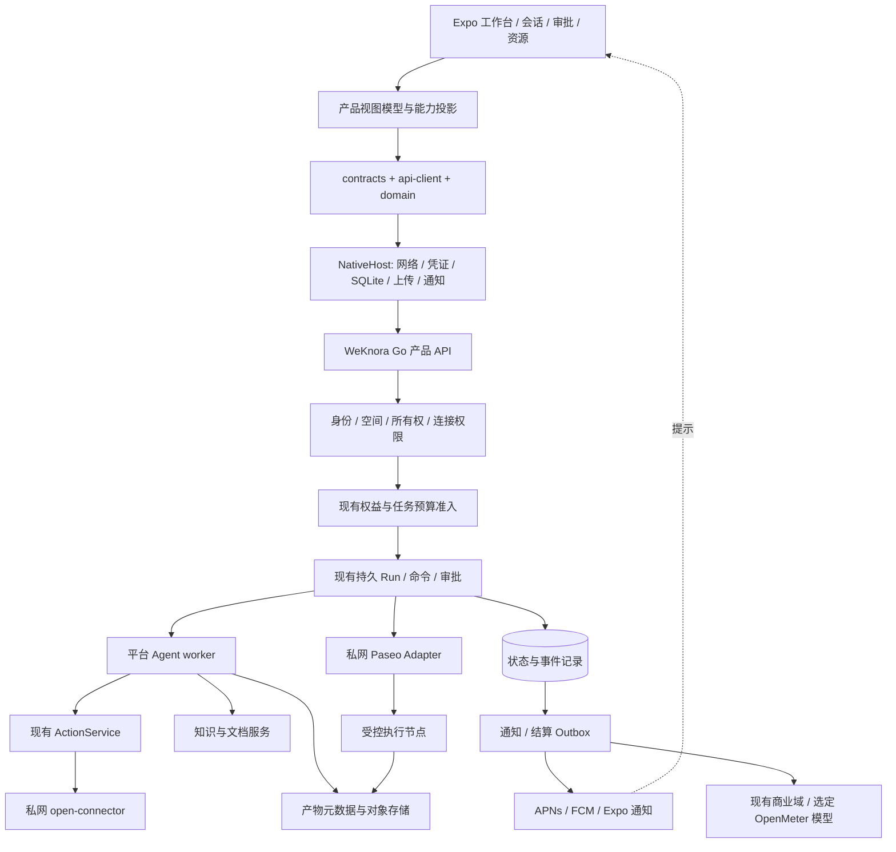

# WeKnora Expo 移动 AI SaaS 工作台技术方案

版本：2026-09-17 / 设计补充稿 v1.0  
代码基线：`1123786563/WeKnora-fork01@12737238aa7b9d6891e76b2397f6941024f45668`  
对象：iOS / Android 原生应用；延续现有 `apps/mobile`；不是重新建设 Web 或小程序。  
关联：2026-09-12 移动架构、W01–W37、open-connector T01–T18。旧计划不被本稿覆盖，完成状态不被本稿修改。

> **结论：直接把现有 Expo / Happy 移动工程产品化。复用 WeKnora 的 Go 后端、共享 TypeScript 契约和领域逻辑；通过原生适配层与视图模型保留 Happy 的移动交互。不要再建一个 Expo 空工程，不要用 WebView 包住整个 React Web，也不要另起 Happy SaaS 后端。**

## 1. 阅读范围与证据边界

本稿通过 GitHub 连接器读取了固定提交的仓库结构、后端路由与关键 handler、React Web 入口与共享包、现有 Expo 会话/认证/流式/存储实现，以及用户列出的 15 份文档的相关章节。原始计划以 `700ef410...` 为基线，不能代替当前源码事实。[S01–S26](sources.md)

容器内完整 `git clone` 因 GitHub 域名解析失败未完成；本稿不是“全仓 clone 后构建通过”的报告。未运行该项目的 Go 测试、数据库迁移、Expo 构建、真实登录/推送/模型/付款。HTML 是交互设计原型，模拟数据与状态不表示服务已接通。代码证据、既有台账声称的验收、本文建议分别标注，避免把三者混为一谈。

## 2. 产品定义与范围

手机上的核心动作是：**提出任务 → 跟踪执行 → 处理审批 → 查看成果 → 继续协作**。知识库是一种可选资源，不是创建所有会话的前提；远程 Coding Agent 是一种执行能力，不是整个产品。[S03](sources.md#s03)

| 范围 | 第一阶段交付目标 | 后续按能力开放 |
| --- | --- | --- |
| 身份与空间 | 产品登录、空间选择、切换与权限提示 | 企业 OIDC、设备管理、原生单点登录完善 |
| 工作台 | 我的执行、待处理交互、最近成果、新建任务 | 团队任务视图、计划任务、工作流编辑 |
| 会话 | 通用/专业 Agent、文本、引用、执行时间线 | 完整 Happy 高级交互、远程文件/Diff |
| 审批 | 工具操作、问题回复、权限与预算分开处理 | 预授权管理和复杂多级审批 |
| 资源 | Agent、知识、连接器、成果的移动消费与轻管理 | 深度知识配置、完整应用配置、复杂治理 |
| 原生能力 | 文件选择/拍照、推送提示、分享、前后台恢复 | 实时语音、个人节点、Live Activity 等 |
| 商业 | 当前空间权益、预算上限、消耗与结算状态 | 商店购买/续费/充值单独规格与审核 |

首版不承诺移动本机长驻 Agent worker、完整 Web 管理后台、平台无法解密的 E2EE、所有 Provider 写操作、任意原生插件执行。阶段性隐藏某项能力，不等于原 Happy 交互保留要求已完成。

默认四个底部入口：**工作台 / 会话 / 资源 / 我的**。通知位于顶部，Agent 从工作台快捷入口和资源页进入；新建任务是工作台主按钮。移动端不照搬桌面左侧管理菜单。

## 3. 现有代码结构与职责

以下为已经读取的关键路径，不是完整目录树。

```text
WeKnora-fork01/
├── go.mod                         Go 1.26.0 / Gin / GORM / tRPC-Agent-Go
├── internal/
│   ├── router/routes_workbench.go  Run 查询、快照、SSE、启动、命令、交互
│   ├── handler/session/           工作台 API 与已有会话入口
│   ├── agent/runtime/             Run / worker / 事件等既有运行域
│   ├── application/               service / repository，沿现有层次增量接入
│   └── workbench/                 产品执行与交互契约
├── apps/
│   ├── web/                       React + Vite Web 应用
│   ├── mobile/                    已有 Expo / React Native / Happy 工程
│   │   └── sources/
│   │       ├── app/               Expo Router 路由
│   │       ├── components/        已有 Happy 移动组件
│   │       ├── -session/          原 SessionView
│   │       ├── sync/              Happy 历史协议/同步路径
│   │       └── weknora/           产品认证、平台端口、会话 VM 等
│   ├── miniprogram/               当前另有小程序工程
│   ├── desktop/
│   └── embed/
├── packages/
│   ├── contracts/                 可复用的 wire DTO 与校验
│   ├── api-client/                请求、认证、API、nativeFile 接缝
│   ├── domain/                    scope、状态投影、业务规则
│   ├── views/                     Web 视图；只抽取纯逻辑复用
│   └── i18n/                      共享文案与国际化
└── docs/superpowers/              既有架构、分册、DAG、任务与证据引用
```

源码中的 Go 模块仍为 `github.com/Tencent/WeKnora`。React Web 已存在，并非只有 legacy `frontend`；`apps/web/src/App.tsx` 同时使用共享领域函数与 `window`、URL、localStorage，因此不应整个导入原生端。[S02](sources.md#s02)[S04](sources.md#s04)[S06](sources.md#s06)[S07](sources.md#s07)

### 3.1 已存在不代表已经闭环

统一执行 API 与 SDK、原生 OIDC SDK 方法、scope 控制、SSE parser、SQLite 存储端口已经有代码；W 台账仍保留最初的 pending。这说明首先需要做“当前实现—接口—测试证据—任务状态”对账，而不是将 W01–W37 全部重写。[S08–S16][S24](sources.md#s24)

关键缺口详见 `02-source-review-and-gap.md`。优先级最高的是 SSE envelope、审批命令类型、服务端能力映射、请求重试身份、SQLite 真正实现签名、原生依赖一致性与服务端真实接线。

## 4. 技术栈建议

| 层 | 选择 | 原因与边界 |
| --- | --- | --- |
| 工程 | 现有 pnpm workspace + `apps/mobile` | 保留源码来源、组件与现有投入；以根包管理器和锁文件为基准 |
| 原生框架 | 先校准 Expo 55 / RN 0.83 / React 19.2.0 基线 | 当前工程已在此 SDK/RN 系列；React 版本漂移先解决，再单独升级 |
| 升级目标 | 独立评估 Expo 57 / RN 0.86 / React 19.2.3 | 官方当前矩阵如此；不是本稿声称仓库已兼容或必须立刻切换 |
| 路由 | Expo Router，保留当前路由根 | 只薄封装 screen，不在路由文件实现 API 和业务规则 |
| UI | React Native + 现有 Happy 可解耦组件 + Unistyles | 复用输入、键盘、列表、文件展示和手势；不引入第二套大型样式框架 |
| 列表与动效 | 现有 FlashList / Reanimated / Gesture Handler | 优先沿用并做长消息与新架构兼容验证 |
| 服务端状态 | TanStack Query | 列表、详情、权限、配额缓存；query key 带 origin/user/tenant |
| 本地 UI 状态 | Zustand 或已有局部状态 | 草稿、选项、弹层；不得成为服务端执行状态权威 |
| 业务共享 | contracts / api-client / domain / i18n | 只依赖平台端口；禁止原生代码直接引用 Web 页面 |
| 流式网络 | 显式注入 `expo/fetch` 的 bytes transport | 对接已有 parser，先修复 wire 契约；真机验证不可被 Web 测试替代 |
| 凭证 | Expo SecureStore | 只存产品登录凭证和本地加密密钥；Provider 密钥留服务端 |
| 离线缓存 | Expo SQLite + 受控事务 + AEAD payload | 缓存投影、游标、草稿和提交记录；可丢失/可重建，不是第二业务库 |
| 文件与语音 | Expo 文件/选择器/相机/音频/分享端口 | 当前多数依赖已声明；声明不证明权限与真实链路可用 |
| 通知 | Expo Notifications，后端 APNs/FCM/Expo Provider 端口 | 事务 Outbox、回执和重试；推送仅提示，不承担业务真相 |
| 后端 | 当前 Go / Gin / GORM / Run 域 | 不为移动端重建一套任务服务或计费服务 |
| 远程执行 | WeKnora → 薄 Paseo Adapter → 授权节点 | 不允许客户端直接操作 daemon 的任意 RPC |
| 集成工具 | WeKnora ActionService → 私网 open-connector | 保留审批/预算/审计唯一入口，不把 OC 管理 Token 发给手机 |
| 验证 | 纯 TS / Go / 原生组件 / iOS 与 Android 开发构建 | 分层记录；开发构建启动不等于完整执行链通过 |

当前 manifest 声明 React `19.3.0`、renderer `19.0.0`，而旧计划和官方 SDK55 矩阵是 React `19.2.0`；先审查锁文件、依赖解析、renderer、原生模块，不直接执行全仓升级。SDK55 已是 New Architecture，不能用关闭新架构逃避原生库兼容问题。[S04](sources.md#s04)[O01](sources.md#o01)[O02](sources.md#o02)

SDK56 官方另有 Hermes/worklets/reanimated 回归提示并建议57；因此不建议以“比55新”为理由盲目过渡到56。升级单独分支验证源码来源补丁、libsodium、音视频、MMKV、Unistyles、动画、键盘和原生 SDK。保留55仅用于复现与修复当前基线，不替代上线时的安全和商店要求核对。[O03](sources.md#o03)

## 5. 复用边界：共用业务，不强行共用 DOM

| 对象 | 处理 | 具体动作 |
| --- | --- | --- |
| DTO / parser / 枚举 / 错误码 | 高优先复用 | 统一 schema_version；跨 Go/TS fixture；非类型断言代替校验 |
| API 方法 / 请求组装 / refresh | 复用并注入宿主端口 | 原生 fetch、SecureStore、上传、浏览器跳转分别适配 |
| scope / query-key / reducer / 业务校验 | 优先复用 | 禁止引用 window/document/localStorage/React DOM/Happy 全局 token |
| Web 页面内纯函数 | 逐项下沉 | 如筛选、分组、表单验证、结果展示模型；先加契约测试 |
| `packages/views` 的 `.tsx` 页面 | 不直接复用原生渲染 | `<div>`、DOM 弹窗、浏览器 Markdown、iframe 等保留 Web 实现 |
| Happy 原生输入、键盘、消息、文件、Diff | 拆出受 props/port 驱动组件 | 产品路由不能必须存在 Happy sync/store 才显示数据 |
| 样式 | 共享语义 tokens，分别映射 | Web CSS 与 RN StyleSheet/Unistyles 不强行共享 className |
| i18n | 共享业务文案键 | 增加 native accessibility 文案、状态说明和复数规则 |
| Web 高级管理功能 | 按移动价值逐步实现 | 首版不把全体后台配置缩到小屏 |

不承诺“复用90%”一类未经统计的比例。验收应看哪些能力共用同一契约和同一测试，而不是代码行数。若团队继续维护 Taro，小程序与 Expo 可继续共用同一纯 TS 包；原生组件与 Taro 组件仍分别实现。[S05–S07][S14](sources.md#s14)

### 5.1 建议内部结构（新目录为建议，不表示均存在）

```text
apps/mobile/sources/weknora/
├── platform/            既有 scope/transport/storage；补齐 NativeHost 真实装配
├── auth/                既有产品认证；补 bootstrap / OIDC / 失效处理
├── conversations/       既有 VM；拆 ProductConversation 与 LegacyHappySession
├── workbench/           [建议] 总览、执行列表、新建任务编排
├── interactions/        [建议] 类型化审批 / 问题 / 预算 / 权限
├── resources/           文件、知识引用、产物能力，按当前文件核对增量
├── notifications/       注册、收件箱、深链与恢复
└── screens/             [建议] 无直接底层 fetch 的页面组件

packages/domain/src/mobile/   无宿主副作用的请求状态机/事件投影
packages/api-client/src/mobile/   与服务器路由保持精确一致的 SDK
packages/contracts/src/mobile/   原始 DTO 与运行时校验
```

新增路线前先检查当前文件，不能只因这棵建议树就大规模搬迁。当前 `SessionView` 仍执行 Happy hooks，应先做产品/历史两条渲染边界，再复用其纯组件，而不是继续堆“有 VM 时判断一下”。

## 6. 总体架构与唯一权威



用户、空间、成员、连接归属、会话、Run、审批和预算由 WeKnora 持有；外部进程实际是否存活由节点观察并注明新鲜度；商业最终消费遵守既有商业域/OpenMeter 决策；本地缓存与推送均不是权威。[S03](sources.md#s03)[S17](sources.md#s17)[S25](sources.md#s25)

不增加第二张权威 `mobile_tasks` 表，不把消息列表误作执行账本，不让手机直接签发远程进程权限，不让通知消费改变审批结果。

## 7. 身份、空间与权限

### 7.1 客户端作用域

使用 `origin + user_id + tenant_id` 作为缓存和请求隔离主键，附加 `generation` 处理作用域切换后的迟到结果。`workspace_ref` 仅指执行文件工作区；不能把它当 SaaS tenant。产品中的“空间”一律表示 Tenant，知识共享组织等视图维度另行命名。[S03](sources.md#s03)[S10](sources.md#s10)[S12](sources.md#s12)

建议冷启动过程：加载受信 origin → 读凭证 → 服务端校验/刷新 → 读取用户和 memberships → 恢复仍授权的 tenant → 建 scoped SDK / QueryClient / SQLite namespace → 加载页面。仅恢复 token 不代表 user/tenant 已初始化；SSO 替换凭证后同样执行 bootstrap。

切空间时先禁用 mutation，推进 generation、abort 旧请求、关闭旧流/语音、清空旧页可见状态，再建立新 scope。服务端任务保持执行。用户退出后清凭证、撤销设备绑定、关闭订阅，敏感缓存按策略清除；设备令牌的迟到更新不得复活旧账户绑定。

### 7.2 登录与 SSO

复用现有产品密码登录和 `startNative/exchangeNative` SDK。SSO 用系统浏览器、PKCE S256、一次性 code、state 和严格 redirect 绑定，不将 bearer token 放到 deep link 或 fragment。服务端交换完成后才读取当前空间权益。生产默认固定 SaaS origin；私有部署服务器选择放高级设置，拒绝以恶意外链任意替换已信任服务器。[S11](sources.md#s11)[S13](sources.md#s13)[O04](sources.md#o04)

认证状态与资源权限不同：401 单飞刷新一次，403 不用刷新掩盖拒绝。移动端按钮隐藏只是体验，服务端始终校验具体 actor 对资源/操作的当前授权。

## 8. 执行生命周期与断线恢复

### 8.1 三类状态必须独立

| 字段 | 用户含义 | 示例 |
| --- | --- | --- |
| `run_status` | 产品任务进度 | 排队、执行中、待用户、核实中、完成、失败、已取消 |
| `execution_status` | 底层执行/进程观察 | 运行、停止已确认、停止待确认、未知；以真实契约枚举为准 |
| `settlement_status` | 费用处理进度 | 预占/待结算/已结算/待对账；以真实契约枚举为准 |

VM 必须保留原字段，不再仅用 `execution_status` 映射一个 status。页面将“已申请取消，正在确认进程停止”与“停止已确认”区分；最终费用仍可能稍后结算。这里中文是显示模型，不是擅自向现有服务端新增枚举。[S09](sources.md#s09)[S12](sources.md#s12)

### 8.2 提交幂等与请求对账

一次用户提交分配一次 `request_id`，在网络前持久保存提交记录和输入摘要。收到 ack 绑定 run_id，再加载快照与事件流。超时不立即使用新 ID 重发；先查已有 `/requests/{request_id}`。admitted/dispatching 绑定旧 Run，pending 显示排队，unknown 显示“正在核实，请勿重复提交”；只有明确安全可重试才以原 ID 重试，变更输入则是用户确认的新任务。[S09](sources.md#s09)

持久提交记录建议字段：scope、request_id、canonical_input_hash、创建时间、状态、run_id、最后对账时间。首版不自动发送用户在离线时输入的命令；离线只保存草稿，恢复在线后需用户确认。UI 单飞不等于跨网络/杀进程幂等。

### 8.3 SSE 契约修正

当前读取到的后端将 `event.Payload` 写到 SSE data，移动端 `parseExecutionEvent(data)` 却要求完整 envelope。必须先跨语言修复这个真实接缝，再做流式 UI。[S08](sources.md#s08)[S15](sources.md#s15)

建议统一产品流 data 为 `ExecutionEvent` 完整对象：

```text
id: 42
event: text.delta
data: {"schema_version":1,"run_id":"run-demo","attempt_id":"attempt-demo","seq":42,"type":"text.delta","occurred_at":"2026-09-17T14:52:00Z","payload":{"message_id":"message-demo","text":"已完成检索"}}
```

上例是目标 wire fixture，不是当前 API 已发送的结果。旧调用方存在时使用显式协商参数或新版本通道过渡，不能直接破坏旧聊天 SSE。新参数必须在实现时写入路由测试与 SDK，不在 UI 私自拼接未实现参数。

SSE transport error/cursor_expired 是控制帧，不是业务事件，不能套完整 parser 后报通用 JSON 错误，也不能推进业务 cursor。DTO `seq`、SSE `id`、event type 一致性均需测试。过期游标：拉一致快照 → 以 watermark 原子替换本地投影/游标 → 重放更大 seq。

### 8.4 原生读流、存储与恢复

显式注入 `expo/fetch`，使用 UTF-8 增量解码，测试中文拆字节、CRLF 跨 chunk、重复/乱序、心跳、长流、控制帧、EOF、409、取消和弱网。官方 SDK55 已有此 fetch 读流 API；是否与当前应用全部原生模块一起可用仍需真机证明。[O05](sources.md#o05)

本地持久化：同一个受控 SQLite 事务提交事件、必要投影和 cursor；磁盘写失败则不推进 cursor。当前 SQLite port 假定 `withTransactionAsync<T>` 返回 T，与 Expo 官方返回 `Promise<void>` 不同，需真实适配而非 fixture 冒充。原生串行写队列加独占事务、txn 对象执行语句；返回值由 wrapper 显式捕获。控制层处理 database locked 和磁盘满。AEAD key 初始化要 single-flight，避免并发生成不同密钥；keyVersion、nonce、AAD 校验与密钥丢失后的清缓存/重拉要有行为测试。[S16](sources.md#s16)[O06](sources.md#o06)

前台 AppState 激活后：刷新身份 → 校验 scope → 对账未确认提交 → 拉当前 run 快照/已保存 cursor → 打开事件流。后台断开流不取消服务端工作。终态判断应在 drain 到已观察的终态 watermark 后关闭，避免终态已写入而最后事件尚未发给客户端。通知只促使重新拉取，不充当断线期间完整事件缓存。

## 9. 审批、预算与连接授权

一个 PendingInteraction 必须携带服务端类型、状态、revision、具体目标、有效期以及安全展示字段。UI 不以一句“是否继续”掩盖真实作用：工具审批展示动作/账号/资源/参数摘要/不可逆影响，预算审批展示当前上限与申请增加额，连接授权展示 Provider scopes，问题回复显示可编辑内容。

复用 `/workbench/executions/{run_id}/interactions` 与 `/workbench/executions/interactions/{id}/decisions` 路由，按服务端已有具体 DTO 扩展共享 SDK；本轮未将某个具体 decision 请求字段宣称为已实现。改进建议由 `04-api-contract-proposal.md` 明确标为新增。[S08](sources.md#s08)

批准/拒绝必须重新取当前详情，带 optimistic revision 和幂等标识；服务端再次检查 actor、tenant、目标/参数摘要、连接权限与预算。409 显示“已被其他设备处理，刷新后查看”；403 显示权限变化；过期不得沿用旧同意。对已开始的外部写入，不通过自动再次批准/重试制造第二次副作用。

手机不得直接访问 OC 管理 API、原始凭据、运行日志管理端或任意 Provider Proxy。ActionService 已有商业入口，移动端/远程桥不能再套一层消费相同审批、预占和结算。OC T18 的 passed 行同时记录写入、计费 blocked-env 和发布门禁拒绝，因此首版连接器“真实外写可用”必须由部署能力及证据控制，不能写死 true。[S25](sources.md#s25)[S26](sources.md#s26)

## 10. 文件、知识与成果

临时会话附件与知识库入库是不同意图。新任务输入默认“仅本次任务使用”，用户显式选择才进入知识库。复用原有 session attachment 流程；文件名、大小、mime、uri 是 native port 输入，`file://`/`content://` 不能当后端可读文件地址。共享 SDK 的 `nativeFile` 与 `multipartFields` 保持最新接缝，RN transport 负责安全上传。[S01](sources.md#s01)[S22](sources.md#s22)

服务端执行真实大小、类型、摘要、归属和扫描检查；扫描前不得交给 Agent。压缩图片需保留原图/缩略图关联，上传取消不丢文字草稿，切空间使迟到结果不可见。对象存储签名链接只在授权后短时签发。

产物引用包含 artifact_id、version、mime、大小、来源 Run 与创建时间。远程文件要先显式导入成为不可变版本，不能把用户手机或远程任意绝对路径作为公开附件。列表、预览、下载和分享分别授权；外部共享链接属于额外权限动作。

文本/Markdown/图片/表格优先原生或安全解析渲染；复杂 HTML/图表可使用独立无登录态 WebView，关闭不必要 JS/桥接、限制导航/网络/本地文件访问。对不可信可执行 HTML 优先服务端转静态预览，不声称 WebView 本身自动提供足够隔离。来源文档和引用使用共享 reference model，点开证据时再次授权。[S22](sources.md#s22)

## 11. 可靠通知、收件箱与深链

业务状态提交与 notification intent 写入同一事务，worker 以环境、用户、设备版本、event_id、模板版本去重投递；回执失败按类型重试或撤销 token。只发送最小提示和资源 ID，不在锁屏 payload 包含 Prompt、附件内容、Provider 密钥或审批正文。[S20](sources.md#s20)

点通知：识别受信 origin → 登录 → 确认所属空间 → 获取资源 → 校验权限 → 打开详情。跨空间跳转显示确认；撤权/删除后展示不可访问，不泄漏资源标题。收件箱与 badge 从产品 API 重建，通知拒权不阻止任务使用。

Development Build 用于原生推送与认证回跳测试，Expo Go 不能代替这些验收。后端继续执行，不依赖系统保证移动 JS 长驻、后台 SSE 常开或推送必达。[O04](sources.md#o04)[O07](sources.md#o07)

## 12. Paseo、语音与高级能力

### Paseo

先交付一个受控托管目标。移动端只选服务端返回的 target/workspace 引用与可用能力，不输入任意 daemon URL/工作目录来获得权限。Go 固定执行映射，薄 TS Bridge 隔离公开 SDK，节点登记/撤销、租约/fence、工作目录锁、事件去重和用量对账按 W17–W24 执行。客户端不直接持有 OC Token 或远程 shell 万能令牌。[S21](sources.md#s21)

未收到启动回执不等于启动失败；未查到已可靠停止不显示“已停止”。个人节点/E2EE/完整终端是独立能力，不阻塞核心平台链，但未验收就不能以降级提示声称完整 Happy parity。

### 语音

先“录音 → 转写 → 用户编辑确认 → 普通文本提交”，继续沿用任务预算和幂等链。实时语音再单独加入，媒体会话使用短期令牌，服务端授权/限额/结算；区分停止播报、结束语音、取消任务。语音不能绕过需要明确内容确认的危险操作审批。[S22](sources.md#s22)

### 高级交互

保留旧 Happy interaction matrix。fork、side chat、goal、rewind、duplicate、terminal 各自映射真实能力；不支持时返回原因，不用提示词模拟成功。archive 不等于 cancel，rewind 不撤销外部业务写入，子任务共用预算树而非复制可用余额。[S23](sources.md#s23)

## 13. 页面与设计系统

`wireframes.html` 提供 18 个可导航页面：登录、空间选择、工作台、会话列表、新建任务、Agent、对话、执行详情、审批、收件箱、资源、知识详情、连接详情、产物、远程目标、语音、我的、空间用量。页面 ID、数据来源、按钮事件和异常规则见 `03-pages-and-implementation.md`。

原型采用灰度线框风格；这不是上游 Happy UI 的逐像素复刻。工程实现保留已有 Happy 的交互追踪约束，新的产品页面以本稿信息结构为准。设计 tokens 是建议值，不是对仓库现有样式的描述：

- 页面基准 390×844；内容左右边距20，主要触控区48，紧凑图标按钮至少44。
- 字号12/14/16/20/28；正文16、行高约1.5；业务状态同时有文字，不仅靠颜色。
- spacing 4/8/12/16/20/24/32；卡片圆角16，控件12；强主按钮、轻次按钮。
- 遵循系统 Safe Area、键盘 inset、返回手势；大字体/横屏/平板分别验收。
- 长消息虚拟列表、稳定 message id、分段更新；用户上滑查看历史时不强制滚到底。

不能通过缩小文字解决拥挤；“更多详情”分屏，而不是将预算、权限、执行信息全部塞进一张聊天卡片。

## 14. 安全、观测与发布

最小安全线包括：跨空间负向测试、所有权查询、服务端当前授权、scope 失效、无默认允许能力、输入摘要与版本化审批、短期文件访问、脱敏日志、单一计费入口、远程事件来源身份和运行绑定校验。

特别审查当前 `source-events` 路由与普通 Viewer/API-key 分组、ingest 前后的绑定校验。设计目标是 worker/Bridge 服务身份授权的入口，在写入前完成 tenant/run/binding 一致性检查；不能把“写入后发现 run 不一致返回404”当成无副作用的授权拒绝。本稿是静态风险提示，并未进行漏洞利用或完整中间件证明。[S08](sources.md#s08)

日志关联 origin标识/tenant_id/user_id/session_id/run_id/request_id/trace_id；敏感字段用不可逆或受控引用。指标分开观测启动ack延迟、快照延迟、流重连、游标修复、审批409、通知投递结果、外部unknown、结算待对账；不要把 token吞吐量当任务可靠性。

发布按 core / oidc / remote / personal_node / resources / voice / full_happy 能力 profile；任一能力必须具备对应真实证据才对客户端声明 supported。正式测试用 Development Build；分开 dev/staging/prod 的 app id、认证回调、设备环境、数据库和对象前缀。

EAS Build 或本地原生构建二选一；不强制购买某种托管服务。EAS Update 使用与原生运行时匹配的 runtimeVersion（可评估 fingerprint 策略），只向兼容 build 发布，先小范围验证再推广；新增原生模块不能当纯 JS 更新下发。[O08](sources.md#o08)

当前 mobile 的 prebuild 脚本包含删除 android/ios，不能在未确认工程目录归属时直接运行。数据库迁移号必须按现有 PG/SQLite 两条序列重新分配，不能照搬旧计划保留号；OC 分支已经使用过部分旧预留号。[S04](sources.md#s04)[S25](sources.md#s25)

## 15. 交付顺序与验收

第一步不是画完所有页面再接 API，而是用一条真实链校准端到端：登录/空间 → 选择 Agent → 幂等提交 → 快照/事件 → 审批 → 结果 → 杀进程恢复。可以同时做无业务副作用的线框与原生组件，但最终集成必须消费同一契约。

保留 W01–W37 编号和原 DAG，增加 UX 补充任务及阻塞修复映射，详见实施分册。每个任务只填写本轮实际测试层级，不将 static/unit/native/live 混记。

| 层级 | 必须证明 | 不足以替代它的材料 |
| --- | --- | --- |
| 契约 | Go 输出 fixture 可被真实 TS parser 读入；错误/新事件兼容 | 各自单元测试分别绿 |
| 服务端 | 当前 DI/路由/数据库/worker 真接线、越权/并发拒绝 | 文件存在、注释说 fail-closed |
| 原生组件 | 挂载实际产品页面，按钮/消息/审批正确消费 VM | 仅测试一个纯函数 |
| 原生端到端 | iOS、Android 登录发任务、前后台、杀进程、附件/通知 | Expo Web 页面或静态 export |
| 外部能力 | 指定受控服务与授权目标的真实证据 | mock Provider、被 skip 的环境测试 |
| 发布 | 启用 profile 全部子门禁通过，旧运行可继续清理和结算 | 单个任务行显示 passed |

本文不把上述目标标为已通过。浏览器原型的检查结果另见 `verification/prototype-report.json`，其结果只证明 HTML 设计原型的交互与布局检查。

## 16. 最终架构裁决

采用“现有 Expo/Happy 底座 + WeKnora 唯一产品控制面 + 共享纯 TS 包 + 原生端口 + 受控扩展驱动”。优先修正实际跨层契约，不拆重后端，不重复运行域与商业域，不把知识库当所有 Agent 的前置，也不把桌面页面直接塞进原生端。

产品最先交付的是可靠的手机工作台：能发起、能看见、能审批、能恢复、能拿到成果；远程、实时语音和完整高级交互在此基础上按证据开放。
