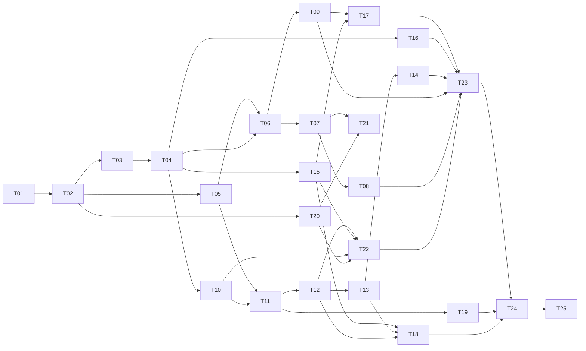

# WeKnora React 多端改造实施计划

> **For agentic workers:** REQUIRED SUB-SKILL: Use superpowers:subagent-driven-development (recommended) or superpowers:executing-plans to implement this plan task-by-task. Steps use checkbox (`- [ ]`) syntax for tracking.

**Goal:** 将现有 WeKnora Vue 前端迁为 React，实现 Web/桌面共享页面，三端共享 API、DTO 与纯业务规则，完整保留现有产品语义。

**Architecture:** 建议采用 React/Vite SPA、Wails React renderer、Expo 原生移动端；Go 后端保持不变。以 contracts/api-client/domain 为无框架底座，core/ui/views 为 Web/桌面共享层，平台桥与移动 UI 独立。

**Tech Stack:** React、TypeScript strict、Vite、React Router、TanStack Query、Zustand、Zod、pnpm/Turbo、Wails、Expo/React Native。

**Spec:** [设计草案](../specs/2026-09-10-react-multiclient-design.md)。本计划基于建议方案 B，尚未批准实施；不是已经完成的代码或测试报告。

## Global Constraints

详细执行入口：[Happy 总计划与七个子计划](2026-09-10-happy-agent-mobile.md)。

2026-09-10 移动任务增补：按用户确认采用 [Happy 统一 Agent 客户端规格](../specs/2026-09-10-happy-agent-mobile-design.md)。T20–T23 保留 Happy 交互并接入共享层，覆盖知识问答、通用和专业 Agent。旧人日和总工期需在完整 Happy 交互盘点后重估；移动增补不改变其他任务的实际验收状态。

- 保留 WeKnora Go/Gin API、数据库、鉴权和 RAG/Agent 语义；不改为 Multica 业务模型。
- 三端共享 contracts/api-client/domain；移动不依赖 DOM ui/views/Web core。
- Web/桌面共用业务页面，平台 API 只在 app 适配层。
- Bearer、Embed 凭证隔离；所有租户缓存包含 origin/user/tenant 上下文。
- 桌面保留 Lite 本地服务和数据；默认不迁 Electron。
- Swagger 当前为 2.0；文档覆盖不等于实现覆盖，生成前必须对照 handler。
- 不承诺离线写同步、移动本地 RAG 或缺少后端证据的 SSE 重放。
- 新主版本工具链的精确版本由 T01 兼容验证锁定，移动 React 版本服从 Expo。
- 保留旧 URL、六种现有语言、Embed 独立入口、Docker/Lite/Wails 发布路径。
- 直接复制 Multica 源码需记录适用来源许可；不把相邻路径作为 workspace dependency。

## 1. 交付结构与执行方式

这是架构级改造任务包。每个 Txx 是可单独验收的功能切片，实施者读取对应源文件和本任务后即可推进；任务内部按“明确失败场景→测试→实现→验收→范围内提交”执行。不在此生成数万行未经验证的应用实现代码。

文档附件：

1. [设计草案](../specs/2026-09-10-react-multiclient-design.md)：方案选择、共享边界、契约与迁移规则。
2. [现有库存](2026-09-10-react-migration-inventory.md)：199 个 Vue 组件、33 个 API TS 文件、361 个 Swagger 操作的逐项清单及证据状态。
3. 本文：任务图、具体文件、交互/验收、发布和估算。

实际实施时新增 `docs/superpowers/plans/react-migration-progress.md`，每个任务记录 source SHA、实现提交、测试命令/退出码、真实运行证据、未通过项；状态仅使用 pending / implementing / review / accepted / blocked。静态通过不能写 accepted，涉及端运行的任务需对应运行证据。只提交各任务相关文件，不自动推送或创建 Issue。

## 2. 功能覆盖矩阵

“移动核心”可先发；“移动补齐”是后续明确任务，不等于删除功能。桌面 Lite 的不支持功能依后端能力隐藏，不人为扩展服务器能力。

| 功能族 | Web/桌面 | 移动核心 | 移动补齐 | 任务 |
|---|---|---|---|---|
| 登录/邀请/OIDC/无空间引导 | 等价 | 完整 | — | T03/T20 |
| 空间/组织/成员/角色/审计 | 等价（遵循 Lite 能力） | 切换与只读身份 | 管理与审计 | T04/T16/T23 |
| 知识库/文件/文件夹/标签 | 等价 | 浏览、检索、上传、详情 | 完整批量管理 | T06/T07/T21/T23 |
| FAQ/Wiki/版本/图谱/数据源 | 等价 | 阅读与引用跳转 | 编辑、同步配置、复杂图谱交互 | T08/T09/T23 |
| 聊天/历史/模型选择/建议问题 | 等价 | 完整 | — | T10/T11/T22 |
| Agent/工具/审批/MCP OAuth/steer | 等价 | 对话与审批/OAuth | Agent 配置管理 | T12/T13/T15/T22/T23 |
| 引用/附件/产物/文档预览 | 等价 | 阅读/保存/分享 | 复杂预览能力补齐 | T07/T13/T21/T22 |
| 沙箱终端/文件 | 等价 | 文件/产物访问 | 受控终端视图 | T14/T23 |
| 模型/检索/存储/解析/MCP/Skill/Memory | 等价 | 使用已配置资源 | 管理界面 | T15/T17/T23 |
| 系统管理员/API Key/队列/集成 | 等价 | 不设常驻入口 | 有权限者专属管理入口 | T16/T18/T23 |
| Embed/IM/插件/CLI 接入 | 管理与外部契约等价 | 可分享已有入口 | 不在原生 App 嵌入管理 iframe | T18/T24 |
| Lite 初始化/本地数据/更新/端口 | 桌面专项等价 | 连接可达服务器 | 不在手机启动 Go 服务 | T19 |

若某移动管理功能决定不交付，需用户从最终范围中明确移除，并在矩阵写出理由；不能用“待完善”使整项迁移隐性缺失。

## 3. 任务依赖与里程碑



- M0：T01 契约/版本/范围冻结，确认方案 B 或调整后的 A/C。
- M1：T02–T06 第一条登录→选空间→知识库列表纵向闭环，Web 和桌面均可运行。
- M2：T07–T18 Web 主业务和后台功能矩阵通过。
- M3：T19 桌面 Lite 发布及升级回归通过；T20–T22 移动核心通过。
- M4：T23 移动补齐、T24 全端发布灰度通过，T25 才退役 Vue。

## 4. 共享接口约定

以下是拟新增接口，避免任务间各自定义。具体 DTO 取自 T01 审核后的 wire schema。

```ts
// packages/api-client/src/ports.ts
export interface RequestScope {
  origin: string;
  userId: string | null;
  tenantId: string | null;
  generation: number;
}
export type Credential =
  | { kind: 'bearer'; accessToken: string; refreshToken?: string }
  | { kind: 'embed'; token: string; sessionSig?: string; visitorId?: string }
  | { kind: 'anonymous' };
export interface CredentialAdapter {
  read(): Promise<Credential>;
  write(value: Credential): Promise<void>;
  clear(): Promise<void>;
}
export interface PreferenceStorage {
  get(key: string): Promise<string | null>;
  set(key: string, value: string): Promise<void>;
  remove(key: string): Promise<void>;
}
export interface NavigationAdapter {
  push(path: string): void;
  replace(path: string): void;
  back(): void;
}
// transport 以平台支持的 body/response 封装为界，不默认 RN 有 Blob/ReadableStream。
export interface HttpRequest {
  method: string;
  url: string;
  headers: Record<string, string>;
  body?: unknown;
  signal?: AbortSignal;
}
export interface HttpResult {
  status: number;
  headers: Record<string, string>;
  body: unknown;
}
export interface HttpTransport {
  send(request: HttpRequest): Promise<HttpResult>;
}
```

`unknown body` 只限传输边界；端点 SDK 必须校验 DTO 后返回类型，页面不能 `as T` 强转。上传的文件源为 Web File 或原生 URI，经平台 transport 转 multipart；JSON transport 不负责转换文件源。

Query key 统一入口：`scopedKey(scope, resource, params)` 返回 `['weknora', origin, userId, tenantId, resource, params]`；generation 用于取消/拒绝旧响应，不作为长期持久化 key。T02 定义 SDK factory `createWeKnoraClient`，T03 扩展认证，T06 起逐域加入方法；按域文件拆分，不产生 Multica 那样单个数千行端点 client。

## 5. 任务清单

### T01 基线、契约和复用来源冻结

**依赖：** 无；这是首个实施任务。**预计：** 3–5 人日。

**输入：** 本计划/设计、库存；`frontend/src/router/index.ts`、`frontend/src/api/`、`internal/router/routes_*.go`、`internal/handler/`、`internal/types/`、`docs/swagger.*`；Multica manifest/适配器/LICENSE。

**产出文件：** `docs/migrations/react/route-parity.csv`、`api-contract-matrix.csv`、`reuse-manifest.csv`、`version-matrix.md`；必要修正 `docs/swagger.yaml`、`docs/swagger.json`、`docs/docs.go` 及对应 handler 注解。不手工只改生成文档。

- [ ] 每个 Vue 入口/设置 section 映射角色、租户、能力、交互、目标任务；每个库存组件标记 migrate/merge/test-only，不按文件数量推算功能数。
- [ ] 每个客户端操作对照 Go 路由、请求/响应 JSON、状态码、权限、分页、文件和 SSE；对文档独有/实现独有/客户端未使用接口分类，额外登记 `/files`、终端 WS、Embed 特殊路由。
- [ ] 对知识库列表+创建与登录验证 Swagger2 生成路线；记录各工具固定版本及原生依赖兼容矩阵。
- [ ] 逐项分类 WeKnora 纯函数和 Multica 可借鉴/可搬运资产，记录哈希和许可来源；授权不明则采用独立实现路线。
- [ ] 建立当前版本运行基线：六种语言、桌面数据路径、旧 URL、核心截图、真实后端 smoke；失败项单列，不假装都是迁移回归。

**验收：** route/API 矩阵无未分配行；scope/DTO 差异有明确修正任务；生成 fixture 可解析，源行为与目标行为一致；用户选择容器方案后才能进入相关实现。

### T02 无框架 SDK 与第一条真实 API 链路

**依赖：** T01。**预计：** 4–6 人日。

**新增：** 根 `package.json`、`pnpm-workspace.yaml`、`turbo.json`；`packages/contracts/src/generated/`、`schemas/`；`packages/api-client/src/{ports,client,errors}.ts`、`transport/json.ts`；`packages/domain/src/query-key.ts`；`apps/web/src/main.tsx`、`apps/web/vite.config.ts`。

**接口：** 使用第 4 节端口；产出 `createWeKnoraClient` 与 `scopedKey`。**测试：** `packages/api-client/src/client.test.ts`、`packages/contracts/test/generated-fixtures.test.ts`、`packages/domain/src/query-key.test.ts`。

- [ ] 建 workspace，仅纳入新应用/包，保留旧 frontend/npm 和 DSH 的发布行为；包 imports 通过 exports，禁止 ../../跨包。
- [ ] 先写 transport fixture：200 JSON、204、非 JSON 500、结构化业务错误、413、超时、取消、带子路径 baseURL。
- [ ] 实现注入式 SDK 和知识库列表 wire 解析；Web 一个调试纵向页面使用真实后端读取列表，认证通过 T03 接入。
- [ ] 加边界静态规则：contracts/api-client/domain 无 React/DOM/Node API；core 无 DOM UI；ui 无 core；views 无路由框架。

**验收：** mock transport 的取消/错误场景通过；共享包能由无浏览器 Node 测试入口导入；旧 frontend 构建输入未被替换；生成资产可重复。

### T03 登录、刷新、OIDC 与凭证隔离

**依赖：** T02。**预计：** 4–6 人日。

**参考：** `frontend/src/api/auth/index.ts`、`utils/authRefresh.ts`、`stores/auth.ts`、`App.vue`、`views/auth/Login.vue`。**新增：** `api-client/src/auth/{endpoints,refresh-coordinator}.ts`、`core/src/auth/`、`views/src/auth/login.tsx`、`apps/web/src/platform/credentials.ts`。

**接口：** SDK auth login/me/refresh/logout 方法以 T01 schema 为准；共享 `CredentialAdapter`。**测试：** `api-client/src/auth/refresh-coordinator.test.ts`、`apps/web/e2e/auth.spec.ts`。

- [ ] 验证登录/退出、邀请注册、过期邀请、无空间用户、OIDC hash 消费顺序；回调前路由守卫不能先清掉结果。
- [ ] 20 个并发 401 仅刷新一次，原请求受 generation 约束；403 保持错误；登出期间刷新返回不得复活会话。
- [ ] 设计一次性读取旧 `weknora_*` 凭证/偏好的兼容导入，保留可回退记录；Embed profile 不触发主账号 refresh。

**验收：** 新老登录存储/回调 URL 兼容；敏感字段不进入日志；注册失败不显示成功；后端权限未被前端判定替代。

### T04 空间上下文、路由和能力守卫

**依赖：** T03。**预计：** 3–5 人日。

**参考：** `router/index.ts`、`utils/tenantSwitch.ts`、`stores/versionedRequest.ts`、`config/deploymentCapabilities.ts`。**新增：** `domain/src/access/`、`core/src/scope/`、`apps/web/src/routes.tsx`、`views/src/layout/guard.tsx`、`views/src/auth/workspace-onboarding.tsx`。

- [ ] 保留 `/platform/*`、`/knowledgeBase`、`/join`、settings compatibility redirects 的参数/跳转语义，旧 `creatChat` 拼写 URL 继续可用。
- [ ] 选空间请求始终发正确 `X-Tenant-ID`；切换取消旧请求/流，清理用户与空间相关临时状态；初期可保留 hard navigation，别同时引入跨空间多标签系统。
- [ ] 以 origin/user/tenant 隔离 Query；A 空间迟到响应不得进入 B，登出、权限撤销、无空间引导都有用例。
- [ ] 保留 capability 缺失时现有默认行为；Docker 能力只有明确 true 才可用，Lite organization 关闭。

**测试：** `core/src/scope/switch.test.ts`、`apps/web/e2e/routes.spec.ts`。**验收：** URL 深链刷新、回退、系统管理员门禁与 capability 对照全部通过。

### T05 UI 基础、平台注入和国际化

**依赖：** T02。**预计：** 3–5 人日。

**参考：** WeKnora `assets/`、`i18n/locales/`、`composables/useTheme.ts`；Multica `packages/ui/components/ui/`、`packages/views/navigation/`。**新增：** `design-tokens/src/tokens.ts`、`ui/src/{button,dialog,menu,input,table}.tsx`、`views/src/platform/`、`i18n/src/`。

- [ ] 明确采用现有 WeKnora 品牌和交互基础，组件技术更新不等于重做产品视觉。
- [ ] 实现主题、字体、焦点、键盘、弹层、加载/空/错误/禁用态；原子组件无业务状态。
- [ ] 六种语言迁出 Vue runtime，校验 key/插值；只共享翻译数据，移动拥有自己的 provider。
- [ ] 导航、外链、剪贴板/保存通过平台注入；DOM 组件测试键盘操作和对话框焦点恢复。

**测试：** `ui/test/interaction.test.tsx`、`i18n/test/keys.test.ts`、`views/test/platform.test.tsx`。**验收：** 无复制 Multica 品牌资产；键盘/缩放/暗色/长文案可用。

### T06 知识库列表与创建编辑闭环

**依赖：** T04/T05。**预计：** 3–4 人日。

**参考：** `views/knowledge/KnowledgeBaseList.vue`、`KnowledgeBaseEditorModal.vue`、`kbListMerge.ts`、`api/knowledge-base/index.ts`。**新增：** `api-client/src/knowledge/bases.ts`、`domain/src/knowledge/list.ts`、`core/src/knowledge/{queries,mutations}.ts`、`views/src/knowledge/{list,editor}.tsx`。

- [ ] 复用列表合并/归属/分享纯规则；SDK 暴露列表/创建/更新/删除，DTO 来自 contracts。
- [ ] 覆盖文档库与 FAQ 库、空状态、分页搜索、共享来源、收藏与权限；成功后才关闭创建框/导航。
- [ ] 新建后列表/详情 Query 一致失效；403、重复提交、删除占用结果有明确反馈。

**测试：** `views/src/knowledge/list.test.tsx`、`apps/web/e2e/knowledge-base.spec.ts`。**验收：** 登录→选空间→创建库→编辑→进入详情真实后端闭环；桌面 renderer 在 T19 前先运行同一视图 smoke。

### T07 文档上传、列表、目录标签与预览

**依赖：** T06。**预计：** 5–8 人日。

**参考：** `views/knowledge/KnowledgeBase.vue`、`components/Document*.vue`、`folderTree.ts`、`components/document-preview.vue`、`utils/protectedFileAccess.ts`、`utils/knowledgeProcessingStatus.ts`。**新增：** `api-client/src/knowledge/{documents,folders,tags,uploads}.ts`、`domain/src/knowledge/{folders,processing}.ts`、`views/src/knowledge/documents/`、`views/src/preview/`。

- [ ] 上传 File/multipart、URL/manual 来源、确认策略、进度、取消、413、重试、重复文件行为逐项对照。
- [ ] 保留 pending/processing/finalizing/completed/failed/deleting/cancelled 语义；不是“可检索”就显示处理全部完成。
- [ ] 文件夹树/移动/批量标签/批量删除、切页保留选择规则、受保护下载文件名全部覆盖。
- [ ] PDF/图片/Markdown/文本/CSV/XLSX/DOCX/PPTX 按库存实际支持类型逐项验收；PPTX 去 Vue wrapper 独立验证，失败则此项不得通过。

**测试：** `domain/src/knowledge/processing.test.ts`、`views/src/preview/preview.test.tsx`、`apps/web/e2e/documents.spec.ts`。**验收：** 实际上传→处理→检索→查看引用/下载闭环，权限失效和链接过期可恢复。

### T08 FAQ 与 Wiki 编辑/版本

**依赖：** T07。**预计：** 4–6 人日。

**参考：** `views/knowledge/components/FAQEntryManager.vue`、`views/knowledge/wiki/`、`api/wiki/index.ts`、`utils/wikiLineDiff.ts`、`wikiRevisionDiff.ts`。**新增：** `api-client/src/knowledge/{faq,wiki}.ts`、`domain/src/wiki/`、`views/src/knowledge/{faq,wiki}/`。

- [ ] FAQ 创建/编辑/导入导出/标签/批量操作与原端一致。
- [ ] Wiki 目录、页面、版本差异、编辑保存、已有修复/生成操作全部映射；冲突不覆盖用户草稿。
- [ ] 保留现有 diff 纯算法测试，以前后相同 fixture 输出对照。

**测试：** `domain/src/wiki/diff.test.ts`、`apps/web/e2e/faq-wiki.spec.ts`。**验收：** 版本与正文真实接口一致，空目录/不存在页/权限受限均可处理。

### T09 知识库高级配置与数据源

**依赖：** T06。**预计：** 4–6 人日。

**参考：** `views/knowledge/settings/`、`api/datasource/index.ts`、`api/chunker/index.ts`、`api/retrieval.ts`。**新增：** `api-client/src/knowledge/{settings,datasources}.ts`、`views/src/knowledge/settings/`。

- [ ] 解析器、切块调试、索引策略、模型、存储、向量库、图谱、共享与活动记录逐 section 迁移。
- [ ] 数据源创建/编辑/凭证/连接测试/同步触发/日志；保存失败保留表单，连接正常不等于同步完成。

**测试：** `apps/web/e2e/knowledge-settings.spec.ts`。**验收：** 每 section 有实际 endpoint 和正反用例；没有用通用 JSON 编辑框替代原功能。

### T10 聊天协议、状态机与恢复底座

**依赖：** T04。**预计：** 5–8 人日。

**参考：** `api/chat/streame.ts`、`composables/useChatStreamHandler.ts`、`utils/rag-pipeline-state.ts`、`internal/router/routes_chat.go`、`internal/handler/session/`。**新增：** `contracts/src/chat/events.ts`、`api-client/src/chat/{stream,restore}.ts`、`domain/src/chat/{reducer,state}.ts`。

- [ ] 固定所有 envelope、payload、message/session ID 与事件语义，录制脱敏 fixture；拆网络传输、纯状态转换、渲染订阅。
- [ ] 覆盖分块 UTF-8、半帧、空行、未知事件、错误、complete 后迟到事件、多轮并存、旧 generation 回包。
- [ ] 验证 continue-stream 的真实恢复语义，与历史消息去重；无事件序号保证时不得虚构可靠重放或盲目内容去重。
- [ ] 建立握手刷新/中途断流/停止/取消的差异；断线重连不能重新 POST 开始生成。

**测试：** `api-client/src/chat/stream.test.ts`、`domain/src/chat/reducer.test.ts`。**验收：** 同一服务端事件 fixture 驱动旧逻辑与新 reducer，最终正文/工具/状态相同；主动终止无悬挂订阅。

### T11 会话、消息和问答主界面

**依赖：** T05/T10。**预计：** 4–6 人日。

**参考：** `views/chat/index.vue`、`views/creatChat/creatChat.vue`、`components/Input-field.vue`、`components/session*.ts`、`api/message-suggestion.ts`。**新增：** `core/src/chat/`、`views/src/chat/{page,composer,message-list,session-sidebar}.tsx`、`api-client/src/chat/sessions.ts`。

- [ ] 新会话、标题、置顶、来源筛选、分组、删除、清空、历史分页、消息建议、提及知识/模型选择全部迁移。
- [ ] pending 消息显式显示发送中与失败重试；滚动跟随只在接近底部时启用；历史阅读不被强制拉到底。
- [ ] 区分草稿与已落盘消息，草稿按 origin/user/tenant/session 隔离。

**测试：** `views/src/chat/composer.test.tsx`、`apps/web/e2e/chat.spec.ts`。**验收：** 真实 RAG 与 Agent 两条链路，刷新可继续查看同一轮，引用、建议和消息列表不重复。

### T12 工具审批、MCP OAuth 与运行中追加

**依赖：** T11。**预计：** 3–5 人日。

**参考：** `ToolApprovalCard.vue`、`McpOAuthCard.vue`、`api/chat/steer.ts`、`utils/steerStreamFork.ts`。**新增：** `api-client/src/chat/{approvals,steer}.ts`、`views/src/chat/{tool-approval,mcp-oauth,steer-queue}.tsx`。

- [ ] 审批等待、批准、拒绝、已解决、失效；不能把协议错误变成默认批准。
- [ ] OAuth 外部浏览器完成/取消/超时，重新拉取状态，不重复提交凭证。
- [ ] steer 排队、删除、提升注入、运行结束竞态和 fallback 正常发送，保证一次用户动作不产生两条消息。

**测试：** `apps/web/e2e/chat-actions.spec.ts`、`domain/src/chat/steer.test.ts`。**验收：** 各卡片状态与服务端一致，刷新后不会重新审批已结束请求。

### T13 Markdown、引用、工具结果与产物

**依赖：** T07/T12。**预计：** 4–7 人日。

**参考：** `views/chat/components/tool-results/`、`utils/referenceSources.ts`、`chatMarkdownRenderer.ts`、`sandboxArtifactRefs.ts`、`components/ChatReferencesDrawer.vue`。**新增：** `domain/src/chat/{references,artifacts,tool-results}.ts`、`views/src/chat/renderers/`。

- [ ] 每个 tool-result Vue 渲染器映射一个明确 React renderer 或合并规则；未知工具可读降级，不吞正文。
- [ ] 引用、Mermaid、KaTeX、代码、表格、CJK、未闭合 fence 流式内容和 XSS fixture 全覆盖；DOMPurify 仅在 DOM 层。
- [ ] artifact metadata→鉴权下载→预览/保存，保留 resource handle、版本和过期处理；不能拼出内部存储地址。

**测试：** `domain/src/chat/references.test.ts`、`views/src/chat/renderers/security.test.tsx`、`apps/web/e2e/artifacts.spec.ts`。**验收：** 恶意 Markdown 不执行脚本；关键工具与引用点击真实可用，长消息渲染性能有对照数据。

### T14 沙箱终端与文件面板

**依赖：** T13。**预计：** 3–5 人日。

**参考：** `composables/useSandboxTerminal.ts`、`useChatSandboxPanel.ts`、`SandboxTerminal.vue`、`utils/pty*.ts`。**新增：** `api-client/src/sandbox/`、`domain/src/sandbox/`、`views/src/sandbox/terminal.tsx`。

- [ ] ticket 获取、WS 握手、尺寸变化、断线、结束、无沙箱/暂停/无权限分别呈现。
- [ ] 继续保留创建/唤醒需要用户操作的行为；卸载关闭 WS、清掉监听/定时器，终端不重复挂载。
- [ ] API/WS 代理路径与跨空间切换验证，保留纯 PTY 算法测试。

**测试：** `views/src/sandbox/terminal.test.tsx`、`apps/web/e2e/sandbox.spec.ts`。**验收：** 真实 shell 输入输出与 resize，JWT 不进 query string；切空间后旧终端不能继续接收。

### T15 Agent、模型、MCP 与 Skill 配置

**依赖：** T04/T05。**预计：** 5–8 人日。

**参考：** `views/agent/`、`views/settings/{ModelSettings,McpSettings,SkillSettings}.vue`、`components/SandboxConfigEditorDrawer.vue`、相关 api 模块。**新增：** `api-client/src/{agents,models,mcp,skills}/`、`core/src/configuration/`、`views/src/{agents,settings}/`。

- [ ] Agent 编辑/共享/选择，模型用途与删除占用、密钥脱敏更新、MCP 测试/OAuth/工具列表、Skill 安装进度与文件面板逐项迁移。
- [ ] 保留模型就绪判断、sandbox 能力边界、安装取消/失败；展示配置存在不代表服务健康。

**测试：** `apps/web/e2e/agent-config.spec.ts`、`apps/web/e2e/model-mcp-skill.spec.ts`。**验收：** 配置后实际发起一次工具/模型调用；未变更密钥不被空串覆盖。

### T16 空间与组织管理、系统后台

**依赖：** T04/T05。**预计：** 4–7 人日。

**参考：** `views/organization/`、`views/system/`、`views/settings/TenantMembers.vue`、`api/tenant/`、`api/organization/`、`api/system/`。**新增：** `api-client/src/{identity,administration}/`、`views/src/{organization,administration}/`。

- [ ] 邀请/成员角色/组织共享/退出/删除/审计/系统配置/管理员操作/API Key scope/队列分页逐项映射。
- [ ] 后端返回 403/409 显式处理；删除/退出等待服务端确认再清上下文；权限撤销刷新可见功能。

**测试：** `apps/web/e2e/access-matrix.spec.ts`。**验收：** 普通成员、viewer、owner、system admin 和跨租户负例均通过；Lite 不错误显示组织能力。

### T17 其余设置、Memory 与运行配置

**依赖：** T09/T15。**预计：** 3–5 人日。

**参考：** `views/settings/` 剩余 General/Tenant/UserProfile/Ollama/Parser/Retrieval/Memory/EnvVar/Storage/VectorStore/WebSearch/SystemInfo/WeKnoraCloud；`config/settingsRoute.ts`。**新增：** `api-client/src/settings/`、`views/src/settings/` 对应 section 文件。

- [ ] section registry 与旧配置逐项相等；主题、语言、历史、Memory、个人凭证和共享配置权限分清。
- [ ] 查询/保存/重置/测试连接/不可用情况分别记录；API 报错不会覆盖已保存值。

**测试：** `views/src/settings/registry.test.ts`、`apps/web/e2e/settings.spec.ts`。**验收：** 设置 section 全覆盖，没有仅有导航入口的空页。

### T18 Embed、IM 与外部集成入口

**依赖：** T12/T13/T15。**预计：** 4–6 人日。

**参考：** `embed-main.ts`、`views/embed/`、`composables/useEmbedBridge.ts`、`utils/embedAllowedOrigins.ts`、`views/integrations/`、`AgentEmbedChannelPanel.vue`、`IMChannelPanel.vue`。**新增：** `apps/embed/src/`、`views/src/integrations/`、`api-client/src/embed/`。

- [ ] 独立 embed 构建，token exchange→访客会话→聊天→引用/附件；不加载主用户凭证，不被主路由重定向登录。
- [ ] postMessage origin、大小/语言/主题桥接严格按原契约；允许与拒绝 origin 都验证。
- [ ] Embed/IM 渠道管理、API playground SSE、CLI/浏览器插件/DSH 引导链接保持可用。

**测试：** `apps/embed/e2e/embed.spec.ts`、`apps/web/e2e/integrations.spec.ts`。**验收：** 匿名第三方 iframe 在真实代理环境工作；bundle 检查不提前载入重型设置/终端代码。

### T19 Wails React renderer 与 Lite 发布

**依赖：** T06 先做技术接入，最终验收依赖 T07–T18 全部适用功能。**预计：** 5–8 人日。

**修改：** `cmd/desktop/wails.json`、`cmd/desktop/main.go` 必要桥接、`Makefile`、`.github/workflows/release-lite.yml`。**新增：** `apps/desktop/{package.json,vite.config.ts,src/main.tsx}`、`src/platform/{navigation,credentials,files,wails}.ts`。

- [ ] 共享 views renderer 与 Wails bridge 接通，保留本地 Go 启停/代理、动态端口、数据目录迁移、更新检查与 LAN 设置。
- [ ] 去掉对 `.t-*` 等 TDesign class 的拖动假设，用明确拖动/不拖动区域；输入、外链、快捷键、reload 事件验证。
- [ ] 确认 renderer build→静态资源→Wails 打包路径，自动绑定输出只进平台目录。
- [ ] 旧安装升级后知识库/登录/偏好可读；回退不破坏本地数据；测试窗口关闭后进程/端口状态。

**测试：** `apps/desktop/src/platform/wails.test.ts`、真实 Wails 安装包 smoke（macOS/Windows/Linux 按发布目标）。**验收：** 不是仅浏览器预览通过；至少每个支持 OS 有实际打包/启动证据，缺失平台标记未验收。

### T20 Expo 基础、原生登录和网络生命周期

**增补：Happy 基础与平台接入。** 以 Happy `ac64b9b4677870f7b7a9eacfd0780959229717f1` 为交互基线，先记录完整路由/控件/手势、来源依赖及许可证，再引入 `apps/mobile`。保留原生交互组织，替换数据依赖；下文 Multica 仅作平台边界参考，不再作为移动源码底座。逐项执行增补规格第 5/7 节；语音、通知、远程机器等服务依赖必须列入库存，不能以未接入为由删除。

**依赖：** T02/T03/T04。**预计：** 4–6 人日。

**参考：** Multica `apps/mobile/data/{api,auth-store,query-client}.ts`、`app.config.ts`、`metro.config.js`。**新增：** `apps/mobile/{package.json,app.config.ts,metro.config.js,app/_layout.tsx}`、`src/platform/{transport,credentials,stream,files}.ts`、`src/data/query-client.ts`。

- [ ] SDK/schema/domain 从共享包导入；移动独立 React/QueryClient/Provider，SecureStore 凭证与异步端口接通。
- [ ] 原生登录、邀请、OIDC 浏览器回调、服务器地址设置与空间切换；校验回调 state/目标地址的现有契约。
- [ ] 真机验证 SSE header/POST/取消/增量读取；标准 fetch 不满足则在平台层选择兼容 native transport，不把 browser fetch-event-source 直接假定能运行。
- [ ] AppState/NetInfo、超时/取消串联；后台未结束请求不阻塞前台刷新；不把手机 localhost 当桌面服务器地址。

**测试：** `apps/mobile/src/platform/transport.test.ts`、`auth.test.ts`，iOS/Android 网络恢复 smoke。**验收：** 两端开发构建真机或模拟器完成登录/列表/流式试点，业务 JS 无第二份端点定义。

### T21 原生知识库、检索与文件

**增补：** 知识资源属于统一 Agent 客户端的一类能力；不要求选择知识库才能创建会话，不能让本任务全部页面成为非知识库 Agent 聊天的前置。

**依赖：** T07/T20。**预计：** 4–6 人日。

**新增：** `apps/mobile/app/(app)/knowledge/`、`src/features/knowledge/`、`src/features/preview/`。

- [ ] 原生知识库/文件列表、目录/标签筛选、检索、引用详情；用共享 selector，分页/状态/权限与 Web 同义。
- [ ] 文档选择/上传、前后台恢复、文件下载/原生分享；超大文件/取消/无权限可处理。
- [ ] 列表用原生虚拟化，详情考虑 safe-area/键盘/大字体；不把整张 DOM 页面套 WebView 当原生列表。

**测试：** `apps/mobile/src/features/knowledge/parity.test.ts`、原生上传/分享 smoke。**验收：** 同一账号同一数据的计数/状态和 Web 一致；文件 URI 不泄露到共享 DTO。

### T22 原生聊天与工具交互

**依赖：** T20、T10，以及 T11/T12/T15 的共享 API 契约；无需等待其全部 Web 页面。附件、引用和产物验收依赖 T07/T13/T21 对应能力。**预计：** 原 5–8 人日失效，Happy 完整交互盘点后重估。

**增补：统一 Agent 会话。** 按增补规格复用 Happy 输入、会话、工具和审批交互，适配产品数据；验证知识问答和无知识库 custom Agent 两条链。每轮 Agent 标识保持历史归属，专业 Agent 的表单/结果通过扩展注册适配，不复制整套聊天。不得用仅适用于 IM 的 Agent 会话过滤接口表示全部会话。

**新增：** `apps/mobile/app/(app)/chat/`、`src/features/chat/`、`src/features/artifacts/`。

- [ ] 会话列表/历史/发送/停止/恢复/附件/提及/建议、pending/retry，共享 T10 reducer。
- [ ] 工具审批、OAuth 外跳返回、steer、引用与产物以原生交互呈现；同一 fixture 三端正文与状态一致。
- [ ] Markdown 原生渲染与复杂内容受控预览分开，补字体/代码横滚/键盘/长列表/后台断线用例。

**测试：** `apps/mobile/src/features/chat/parity.test.ts`、iOS/Android 真实 SSE smoke。**验收：** 后台后重回不会重复生成或丢失工具审批状态，错误不留无限 spinner。

### T23 移动管理补齐与能力差异验收

**增补：** 除原有管理功能，还须关闭 Happy 交互矩阵中的语音、通知、文件/Diff、目标操作、旁支会话、远程机器等缺口；依赖服务分切片设计与验收。范围未完成即保持未验收，不能用隐藏入口结项。移动 Craft 的专属实现仍遵循其独立规格，不将扩展位置视为已实现。原预计 8–15 人日仅为旧范围估算，不适用于增补后的范围。

**依赖：** T08/T09/T14/T16/T17/T22。**预计：** 8–15 人日。

**新增：** `apps/mobile/src/features/{administration,configuration,wiki,faq,sandbox}/` 和对应 Expo routes。

- [ ] 按第 2 节移动补齐列逐项实现原生管理页；沿用共享 SDK/schema/权限规则，复杂表单拆为分步屏幕。
- [ ] FAQ/Wiki 编辑、数据源配置、Agent/Model/MCP/Skill、组织/空间/审计/API Key/队列等每项记录实际支持范围。
- [ ] 若使用终端/复杂图谱/Office 的受控 WebView，独立路径与最小凭证交换，测试桥接白名单；不能直接透传长期 token 给任意 URL。
- [ ] 原生 UI 差异不改变字段、权限、计数、状态转换；无离线写队列，失败操作由用户明确重试。

**测试：** `apps/mobile/src/features/administration/parity.test.ts` 和逐功能原生 smoke。**验收：** 能力矩阵没有未处理行；必须删减的功能由范围决策明确移除后才能验收。

### T24 构建、回归矩阵与灰度发布

**依赖：** T07–T23 所有适用任务 accepted。**预计：** 5–8 人日。

**修改：** `frontend/Dockerfile` 或新 `apps/web/Dockerfile`、现有 Nginx 配置、`Makefile`、`scripts/build_images.sh`、`.github/workflows/{frontend,docker-image,release-lite}.yml`；**新增：** `scripts/check-react-boundaries.mjs`、`docs/migrations/react/release-runbook.md`、移动 CI workflow。

- [ ] Docker build context 变为含共享包的根目录；同步 `.dockerignore`、缓存 lockfile、COPY 路径，不能继续只给 frontend/ context。
- [ ] `/api`、`/files`、WS upgrade、SSE 禁缓冲、子路径部署、SPA deep link、`/embed/:channelId` 独立 fallback 全验证。
- [ ] Lite `web/` 发布 artifact 包含正确 Web/Embed 静态资源；各端版本/commit 可辨别。
- [ ] CI 显式执行移动 typecheck/test，避免照搬 Multica 根脚本 `--filter=!@multica/mobile` 后漏验移动。
- [ ] 在相同 fixture/backend 版本下对照 Vue/React；运行角色×空间×部署版型×语言×浏览器/OS 矩阵，记录未覆盖单元。
- [ ] 发布兼容策略：已安装客户端与目标服务器版本至少完成当前/前一受支持客户端 smoke；破坏性 API 不随 UI 发布。
- [ ] 测量旧/新首屏、首 token、长消息渲染、内存、包体积；T01 定基线，本阶段要求关键旅程无功能回归，p95 交互耗时建议不恶化超过 10%，超过需定位并评审。
- [ ] 先内部灰度，再小范围，再全量；401、流失败、上传失败、白屏任一显著超基线立即停止扩大范围，保留旧 artifact 一键回退。

**验收：** Docker/Lite/Wails/移动真实产物运行证据齐全，按 runbook 演练回退成功；前一版本客户端可连接；基线失败不计入“全部通过”。

### T25 Vue 退役与维护交接

**依赖：** T24，灰度稳定且范围矩阵全部接受。**预计：** 2–4 人日。

**修改：** 删除已替代 `frontend/src`/Vue 构建链，迁走仍使用的静态资源/许可证/测试 fixture，清理根构建引用；更新 `README_CN.md`、开发/发布文档、架构图。

- [ ] 扫描 Vue/Pinia/TDesign/vue-i18n/wailsjs 旧位置依赖，逐项说明保留的非产品范围（如独立站点）是否合理。
- [ ] 旧 URL 重定向与受支持客户端兼容继续保留；旧部署 artifact 由发布系统保留，不依赖旧源码目录存在。
- [ ] 全量构建和核心旅程回归在删除后再跑一次；迁移测试不再绑定已删 Vue 模板字符串。

**验收：** 产品发布图中没有 Vue runtime，六语言/Embed/本地数据不丢失；新开发者可按文档分别启动三端；进度账本每行有 accepted 证据。

## 6. 测试与验证命令约定

下面为计划创建的脚本契约，当前仓库尚不存在，不能现在宣称运行成功：

```sh
pnpm typecheck
pnpm lint
pnpm test
pnpm check:boundaries
pnpm --filter @weknora/web build
pnpm --filter @weknora/embed build
pnpm --filter @weknora/desktop build
pnpm --filter @weknora/mobile typecheck
pnpm --filter @weknora/mobile test
pnpm exec playwright test
```

T02 定义根 scripts，T20 建移动脚本；T24 给每个命令指定 CI job 与 artifact。后端仅执行变更关联的契约/权限测试以及迁移关键链路；不因 React 迁移无条件重跑所有耗时系统测试。必须分别报告静态测试、mock 行为、真实后端 E2E、原生构建/运行四层证据。

最低回归场景：并发刷新；A→B 空间切换迟到包；共享知识权限撤销；Lite 自动初始化；登录回调；中文/多语言文案；文档 finalizing；上传 413；审批/拒绝；OAuth 取消；steer 竞态；流断线恢复；XSS；artifact 鉴权；Embed origin 拒绝；终端 ticket；旧 URL 深链；旧桌面数据升级；手机后台恢复；前一客户端兼容。

## 7. 工期、人员与风险

以上各任务加总约 **101–163 人日**（含移动管理补齐，未包含范围扩张或重新做产品视觉）。这是基于静态库存的规划估算，不是交付承诺；T01 完成后重估。按 2 名前端/跨端工程师 + 后端与测试部分投入，建议预留 **12–20 周**，受原生平台经验、重叠工作和验收资源影响。单人可按同样任务图串行，不能用简单日历除法忽略集成。

优先级：先完成共享底座和 Web/桌面知识库纵向切片，再解聊天状态机；移动 transport 试点尽早跟进，原生页面在契约稳定后扩展。工期超出时可先发布 T20–T22 移动核心版本，但项目总目标不因此算完成。

| 风险 | 早期验证 | 处置 |
|---|---|---|
| Swagger 与真实 API 不一致 | T01 小域生成+对照 | 修正文档/注解，异常事件单独 schema |
| 聊天链路隐式状态多 | T10 旧/新 fixture 对照 | 先 reducer 后 UI；不给恢复能力做超额承诺 |
| Wails 换 React 后行为变化 | T06/T19 renderer smoke | 平台桥集中、保留 Go 生命周期 |
| Expo 网络/文件与 DOM 不兼容 | T20 真机 SSE/上传试点 | transport 适配，纯共享包不依赖浏览器 |
| UI 搬用受到源许可限制 | T01 来源清单 | 借鉴结构并独立实现，或确认适用授权后移植 |
| 租户与认证迁移串数据 | T03/T04 并发/取消用例 | scope 隔离、generation 守卫、错误可见 |
| 发布路径只支持原 frontend | T02/T24 发布图 | 根 context、资源路径、独立 Embed/Lite 验证 |
| 移动功能被悄悄缩减 | T23 矩阵逐行签收 | 未完成列明，变更范围需明确决定 |

## 8. 评审结论需要确认的选择

推荐作为后续实施起点：**方案 B（Vite + Wails + Expo）、保留 Go/数据/API、Web/桌面等价迁移、移动先核心再管理补齐**。如果需要完全采用 Multica 的 Next.js/Electron，先调整 T19 与发布设计，不直接开始旧壳退役。

本轮已完成：源码静态盘点、设计草案、任务与库存文档。所有 T01–T25 均未执行；没有安装依赖、修改应用实现、运行构建或测试。
