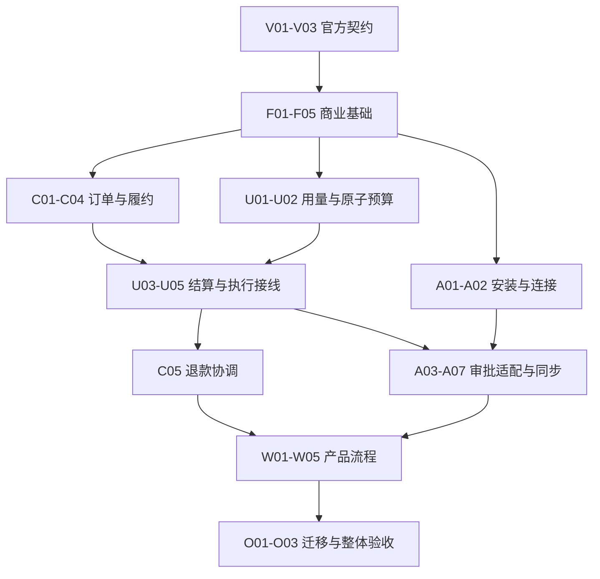

# SaaS 商业能力与 App/Connector 总实施计划 Implementation Plan

> **For agentic workers:** REQUIRED SUB-SKILL: Use superpowers:subagent-driven-development (recommended) or superpowers:executing-plans to implement this plan task-by-task. Steps use checkbox (`- [ ]`) syntax for tracking.

**Goal:** 按依赖执行 7 个子计划、33 个独立任务，交付空间商业能力与首批 Connector，并保留真实验收门槛。

**Architecture:** 商业订单、最终额度和在途预算分权威处理；现有 Go/Gin 与 React 共享契约增量接入。先验证官方接口，再按垂直切片实现，任务间以明确定义的类型和签名交接。

**Tech Stack:** 当前仓库 Go 1.26、Gin、GORM、PostgreSQL／SQLite 版本化迁移；React 19、TypeScript 6、pnpm 10.28.2；官方 OpenMeter 固定版本；优先复用现有依赖。

**Spec:** [完整规格](../specs/2026-09-10-saas-billing-connectors-design.md)；[接口验证清单](../specs/2026-09-10-saas-billing-connectors-interface-verification.md)。执行者必须同时阅读本计划引用的规格章节与上下游契约。

## Global Constraints

- 每个空间始终独立购买、付款并承担费用；共享组织不改变归属，不共享余额或套餐。
- 费用预算批准和外部写入批准是独立条件，两者都满足才能执行。
- 首期不包含：跨空间合并付款或余额池、自动扣款、独立席位与存储加购包、嵌入式第三方 Web 应用、公开开发者上架与交易分成。
- 固定候选基线：`v1.0.0-beta.232`，提交 `887e0cac903ccd06e74d61ed23c651651d10c7a9`。
- 未在验证清单取得真实通过证据的外部能力，不得标记为生产可用；不使用旧本地 OpenMeter fork 接口。
- 保留已有 React、Craft、移动端和其他任务的工作；仅提交本任务明确拥有的文件，不使用 `git add .`。
- 下列内部接口是计划新增契约，不声称当前已存在；外部请求字段以 P00 的已验证契约为准。
- 时区、精度与分段报价采用完整规格的推荐默认值；外部模型无法无损表达时在 P00 停止依赖任务并修正规格，不能自行换商业语义。

---

## 1. 当前范围与计划状态

计划编写日期：2026-09-11。用户已逐项确认业务规则并请求使用 writing-plans；本次只产出实施计划，未运行实现测试、未提交代码、未创建 GitHub Issue、未执行付款或外部写操作。

仓库检查位置为 `/Users/wuyongjun/trea/WeKnora-fork01`。已检查：Go/Gin/dig入口、现有版本化PG/SQLite迁移、TenantMember角色、MCP OAuth refresh租约、approval Gate、DataSource Connector/stream checkpoint、React共享contracts/api-client/Web壳。未把并行Craft/mobile计划当作已实现代码，也未迁移其他仓库规则。

当前新规格的时间、精度、报价公式属于已标明的技术细化；V03负责与实际接口收敛。具体价格、退款资格和保留期限保持版本化上线配置，不允许执行者自行猜值。

## 2. 子计划目录

| 子计划 | 独立产出 | 任务 |
| --- | --- | --- |
| [接口验证](2026-09-11-saas-00-contract-verification.md) | 固定版本盘点与可复现的唯一商业模型实验 | V01～V03 |
| [商业基础](2026-09-11-saas-01-foundation.md) | 空间权限、目录、报价、月度权益和资源准入 | F01～F05 |
| [支付履约](2026-09-11-saas-02-payments.md) | 双渠道验证、订单Outbox、到账和退款 | C01～C05 |
| [预算计量](2026-09-11-saas-03-budget-metering.md) | 真实调用用量、原子预算和消费交接 | U01～U05 |
| [Connector](2026-09-11-saas-04-connectors.md) | 安装/连接/持久审批、同步、飞书与Notion写操作 | A01～A07 |
| [产品流程](2026-09-11-saas-05-product-flows.md) | 共享契约、购买/退款/应用/审批/预算页面 | W01～W05 |
| [迁移验收](2026-09-11-saas-06-rollout-acceptance.md) | 恢复开关、影子迁移和分层验收门槛 | O01～O03 |

每个子计划先定义文件职责，再列出任务的输入／输出接口、RED测试、实现算法、GREEN命令和精确提交范围。所有代码片段是实施输入；本次没有声称它们在当前仓库可编译或已通过测试。

## 3. 精确依赖图与执行顺序

V03只验证外部契约并确定协调策略；OM-10的生产并发证明在U02/U03，不能让V03等待尚未实现的U02而形成环。C05消费U02/U03，不能以P02整本完成作为P03前置。W03与W04共享App.tsx，必须串行集成该文件或由同一执行者协调，不允许并行覆盖。

| 任务 | 前置任务 | 交付 |
| --- | --- | --- |
| [V01](2026-09-11-saas-00-contract-verification.md) | 无 | 固定版本接口盘点与只读健康探测 |
| [V02](2026-09-11-saas-00-contract-verification.md) | V01 | 可重复执行的业务契约实验驱动器 |
| [V03](2026-09-11-saas-00-contract-verification.md) | V02 | 执行两套官方模型实验并冻结唯一接入契约 |
| [F01](2026-09-11-saas-01-foundation.md) | V03 | 金额、Credits 和月周期原语 |
| [F02](2026-09-11-saas-01-foundation.md) | V03 | 空间商业权限与唯一 Customer 映射 |
| [F03](2026-09-11-saas-01-foundation.md) | F01, F02 | 不可变套餐目录与分段升级报价 |
| [F04](2026-09-11-saas-01-foundation.md) | F03 | 周期发放与到期降级投影 |
| [F05](2026-09-11-saas-01-foundation.md) | F02, F03 | 原子资源配额与商业路由权限 |
| [C01](2026-09-11-saas-02-payments.md) | F03, F05 | 订单、支付尝试与持久化 Outbox |
| [C02](2026-09-11-saas-02-payments.md) | C01 | 支付适配接口与微信验签链路 |
| [C03](2026-09-11-saas-02-payments.md) | C02 | 支付宝独立支付与退款适配 |
| [C04](2026-09-11-saas-02-payments.md) | C01, F04, V03 | 付款到权益的幂等履约工作进程 |
| [C05](2026-09-11-saas-02-payments.md) | C02, C03, C04, U02, U03 | 退款锁定、渠道出款与精确撤权 |
| [U01](2026-09-11-saas-03-budget-metering.md) | F01, F03 | 实际调用身份、资金来源与用量去重 |
| [U02](2026-09-11-saas-03-budget-metering.md) | U01, V03 | 跨进程任务预算与额度原子预占 |
| [U03](2026-09-11-saas-03-budget-metering.md) | U02, C04 | 最终消费与外部确认水位交接 |
| [U04](2026-09-11-saas-03-budget-metering.md) | U03, F02, F04 | 取消、到期、追加与恢复租约 |
| [U05](2026-09-11-saas-03-budget-metering.md) | U01, U02, U03, U04 | 主子 Runtime、模型与平台服务的收费准入接线 |
| [A01](2026-09-11-saas-04-connectors.md) | F02 | 空间安装、版本与两类连接 |
| [A02](2026-09-11-saas-04-connectors.md) | A01 | OAuth绑定、凭据引用和撤销接线 |
| [A03](2026-09-11-saas-04-connectors.md) | A02, U05 | 持久化Action审批与未知结果状态 |
| [A04](2026-09-11-saas-04-connectors.md) | A03 | MCP和受控HTTP统一执行适配 |
| [A05](2026-09-11-saas-04-connectors.md) | A04 | 飞书发送消息的审批和结果核对 |
| [A06](2026-09-11-saas-04-connectors.md) | A04 | Notion页面创建与部分完成恢复 |
| [A07](2026-09-11-saas-04-connectors.md) | A02, U05 | 飞书和Notion同步迁移、游标与暂停 |
| [W01](2026-09-11-saas-05-product-flows.md) | C01, C05, F05 | 共享商业契约与API client |
| [W02](2026-09-11-saas-05-product-flows.md) | W01 | 空间购买、充值与订单结果页面 |
| [W03](2026-09-11-saas-05-product-flows.md) | W01, C05 | 账单授权、退款申请和平台审核页面 |
| [W04](2026-09-11-saas-05-product-flows.md) | A01, A02, A07 | 应用目录、连接与同步页面及API |
| [W05](2026-09-11-saas-05-product-flows.md) | A03, U04, W04 | 任务预算与具体写操作审批交互 |
| [O01](2026-09-11-saas-06-rollout-acceptance.md) | C04, C05, U03, A03 | 运营恢复队列、审计与收费开关 |
| [O02](2026-09-11-saas-06-rollout-acceptance.md) | F02, F04, U01, A07, O01 | 旧空间与数据源迁移、影子计量和注销保留 |
| [O03](2026-09-11-saas-06-rollout-acceptance.md) | W02, W03, W04, W05, O01, O02, C02, C03, A05, A06, U05 | 按证据收口全部接口与产品联验 |

一个可行的拓扑执行顺序：`V01 → V02 → V03 → F01 → F02 → F03 → A01 → F04 → F05 → U01 → A02 → C01 → U02 → C02 → C04 → C03 → U03 → C05 → U04 → U05 → W01 → A03 → A07 → W02 → W03 → A04 → W04 → O01 → A05 → A06 → W05 → O02 → O03`。独立任务是否并行由执行方式决定；共享数据库迁移、router/container、App.tsx和台账的改动始终串行合并。

## 4. 共享接口所有权

| 类型／接口 | 唯一定义任务 | 主要消费者 |
| --- | --- | --- |
| Credits、CNYFen、MonthBoundary | F01 | F03/F04/C01/U01/U02 |
| AccountStore、商业权限 | F02 | F03/F05/C01/A01 |
| PlanVersion、Quote、Prorate | F03 | F04/C01/C04 |
| PaymentFact、Order、ConfirmPayment | C01 | C02/C03/C04 |
| Provider、支付和退款请求／结果类型 | C02 | C03/C05 |
| CommercialGateway、BenefitRequest/Receipt | C04 | U03扩展结算，C05扩展撤回；所有实现及fake在扩展任务同步更新 |
| UsageFact、UsageStore | U01 | U03/U05 |
| BudgetRequest、Reservation、BudgetStore | U02 | U03/U04/U05/C05 |
| Settlement/Receipt | U03 | 官方适配与恢复 |
| ExecutionGate | U05 | A03/A04/A07、实际Runtime调用入口 |
| Installation、Connection | A01 | A02/A03/A07/W04 |
| OAuthBinding、CredentialResolver | A02 | A03/A04 |
| Action、ActionService | A03 | A04/A05/A06/W05 |
| Adapter、ActionResult | A04 | A05/A06 |
| OrderView、CommercialSummary、商业client | W01 | W02/W03 |
| ConnectionView、应用client | W04 | W05 |

新增跨任务方法必须更新定义任务的接口文件和全部已有实现，不能在消费方引入另一个同名不兼容接口。业务ID使用string，tenant后端使用uint64，金额与Credits wire使用十进制字符串。

## 5. 数据库与文件协调

PG迁移000110～000119和SQLite000030～000039按F02、F03、F04、C01、C05、U01、U02、A01、A03、A07归属；每个表仅一个创建任务。编号开始前重新查占用，若并行任务已占用，整体换一段可用编号并同步路径与提交命令，不覆盖任何既有迁移。

现有仓库支持PG与SQLite，计划对商业表同时提供约束与迁移；并发正确性必须有实际PG证据，SQLite单进程测试不能代替。MySQL仅见初始化脚本，本计划不擅自宣布新的MySQL商业支持；若运行配置实际支持MySQL，需要独立兼容验证后才能启用。

## 6. 规格覆盖自查

| 规格章节 | 实施任务 |
| --- | --- |
| 1～3 范围、决定、权威 | V01～V03、F02、C04、U02/U03 |
| 4 记录、时间、精度 | F01～F04、C01、U01/U02、A01/A03 |
| 5 权限 | F02/F05、A01/A02/A03、W03 |
| 6 套餐配额 | F03/F04/F05、C04、U04 |
| 7 支付与退款 | C01～C05、U02/U03 |
| 8 预算与计量 | U01～U05 |
| 9 安装与连接 | A01/A02/A04、W04 |
| 10 Action与审批 | A03～A06、W05 |
| 11 Sync | A07、W04 |
| 12 产品API | F05、C01/C05、W01/W04/W05 |
| 13 用户管理端 | W01～W05 |
| 14 恢复审计 | O01/O02 |
| 15 迁移 | O02、A07、U05 |
| 16 端到端 | O03 + 各任务定向验收 |
| 17 上线门槛 | V03、O01/O03 |
| 18 来源 | V01/V03与接口证据目录 |

## 7. 接口检查归属

下表保证66个检查均有落地任务；O03只收口证据，不代替实现任务。

| 检查 | 实现／验证任务 |
| --- | --- |
| OM-01 | V01/V03 |
| OM-02 | V03 |
| OM-03 | V03/F02/F03 |
| OM-04 | V03/C04 |
| OM-05 | V03/F04 |
| OM-06 | V03/F01/F04 |
| OM-07 | V03/F03/F04 |
| OM-08 | V03/C05 |
| OM-09 | V03/C04 |
| OM-10 | U02/U03 |
| COM-01 | F02/F05 |
| COM-02 | F03 |
| COM-03 | C01 |
| COM-04 | C04 |
| COM-05 | C05 |
| COM-06 | C05 |
| COM-07 | F03/F04/F05 |
| WX-01 | C02 |
| WX-02 | C02 |
| WX-03 | C02 |
| WX-04 | C02 |
| WX-05 | C02 |
| ALI-01 | C03 |
| ALI-02 | C03 |
| ALI-03 | C03 |
| ALI-04 | C03 |
| ALI-05 | C03 |
| BUD-01 | U02 |
| BUD-02 | U02/U05 |
| BUD-03 | U02/U04 |
| BUD-04 | U04 |
| BUD-05 | U03 |
| BUD-06 | U04/C05 |
| BUD-07 | U03/O01 |
| BUD-08 | U05 |
| USE-01 | U01/U05 |
| USE-02 | U01/U05 |
| USE-03 | U01/U03 |
| USE-04 | U01/U03 |
| USE-05 | F01/U01 |
| USE-06 | U04/U05 |
| CON-01 | A01 |
| CON-02 | A01 |
| CON-03 | A02 |
| CON-04 | A02 |
| CON-05 | A03 |
| CON-06 | A03 |
| CON-07 | A04 |
| CON-08 | A04 |
| FS-01 | A05 |
| FS-02 | A05 |
| FS-03 | A05 |
| FS-04 | A05 |
| NO-01 | A06 |
| NO-02 | A06 |
| NO-03 | A06 |
| NO-04 | A06 |
| SYNC-01 | A07 |
| SYNC-02 | A07 |
| SYNC-03 | A07 |
| SYNC-04 | A07 |
| SYNC-05 | A07 |
| OPS-01 | O01 |
| OPS-02 | O02 |
| OPS-03 | O01/O02 |
| OPS-04 | W02/W03/W04/W05 |

## 8. 文档审查与执行交接

- [x] 已核对完整规格18节与33任务的覆盖关系。
- [x] 已给66个接口检查分配任务，区分外部契约实验与生产实现验证。
- [x] 已避免V03与U02、C05与U03之间的循环依赖。
- [x] 已列每项任务具体文件、接口、失败测试、核心算法、验证命令和提交范围。
- [x] 已保留真实商户、外部目标和Runtime落地等条件门槛，没有用mock替代通过。
- [ ] 执行开始后每个任务依次更新[进度台账](saas-billing-connectors-progress.md)，不能一次性勾选未完成任务。

执行方式可选 Subagent-Driven：每任务一个新实现子代理，规格与质量两阶段review；或 executing-plans：在当前会话按任务分批执行并检查。当前仅交付计划，不自行开始实现。
