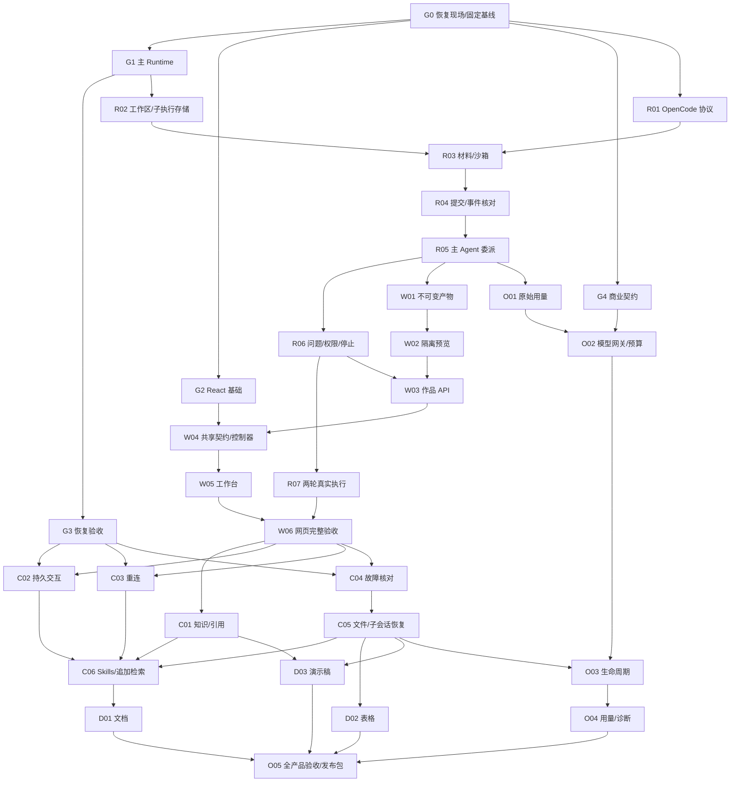

# WeKnora Craft：交给 Code Agent 的完整实施提示词

使用方式：将本文件交给能够读取仓库的 code agent，并让它从“执行提示词”开始执行。需要一并提供现有六份 Craft 计划及相邻 [DAG 文件](2026-09-12-craft-execution-dag.json)。本文是执行交接与调度规则，不表示实现已完成。

## 执行提示词

你是 WeKnora Craft 的实施协调 agent。你的任务是根据现有产品规格和详细计划，完成全部 27 个任务的代码、测试、逐任务审查、集成验证和最终交付。使用 DAG 调度可独立的工作；持续推进当前可执行的节点，直至目标完成或所有剩余路径都有经核验的外部阻塞。

代码仓库：`/Users/wuyongjun/trea/WeKnora-fork01`。产品方向是 **React + assistant-ui 工作台、tRPC-Agent-Go 主 Runtime、Go Adapter、沙箱内 OpenCode 执行 Runtime**。

本提示词明确允许独立任务在**不同 Git worktree** 中并行实施，替代旧计划“默认顺序执行”的调度默认值。继续保留逐任务独立实现者、规格与质量审查、修复复审和最终全分支审查。产品运行时“同一作品工作区串行修改”的约束保持有效，不能因为开发并行就改变产品并发语义。

### 1. 先恢复现场，完成 G0

按顺序读取：

1. 用户提供及路径内适用的 `AGENTS.md`、`docs/agents/issue-tracker.md`、`docs/agents/domain.md`。
2. 当前 `CONTEXT.md`，以及触及区域的 accepted ADR。若涉及 Connector，核对 `docs/adr/0001-open-connector-shared-runtime.md`；Craft 不因此接管另一个 Connector 迁移项目。
3. [完整产品方案](../specs/2026-09-10-onyx-craft-product-proposal.md)和 [实施总计划](2026-09-10-craft-product-implementation.md)。
4. [DAG JSON](2026-09-12-craft-execution-dag.json)与下述状态恢复规则。
5. 准备派发某任务时才读取该阶段计划的全文任务段、依赖接口及相关源文件；每个实现者不必读取所有阶段历史。

六份计划索引：

| 文件 | 范围 |
|---|---|
| `docs/superpowers/plans/2026-09-10-craft-product-implementation.md` | 总体架构、共享契约、API、验收 |
| `docs/superpowers/plans/2026-09-10-craft-01-runtime-workspace.md` | R01–R07 |
| `docs/superpowers/plans/2026-09-10-craft-02-web-workbench.md` | W01–W06 |
| `docs/superpowers/plans/2026-09-10-craft-03-knowledge-recovery.md` | C01–C06 |
| `docs/superpowers/plans/2026-09-10-craft-04-artifact-types.md` | D01–D03 |
| `docs/superpowers/plans/2026-09-10-craft-05-operations-release.md` | O01–O05 |

先执行只读检查：

```bash
pwd
git status --short
git log -5 --oneline
git worktree list
git remote -v
```

2026-09-12 的交接观察仅用于定位，开始执行时必须重新核验：

- 主工作区当时为 `main@700ef410`，已有新的 tRPC Runtime 与商业模块。`CONTEXT.md`、商业规格及其他任务文档有未提交变更，属于并行工作，必须保留。
- `.worktrees/craft-product` 为 `codex/craft-product@3ee8cef2`，这是计划输入提交；旧台账还记录 R01 正在执行。实际发现 `internal/agent/opencode/client.go`、`protocol.go`、`client_test.go` 未提交，未发现本次 R01 完成报告或审查通过记录。
- 因此 R01 应从“待核对的中断现场”恢复，不能直接重写，也不能当作已完成。先核对 diff、测试、缺失项及进程状态，再决定续写或修复。
- `.worktrees/craft-opencode` / `codex/craft-opencode` 是更早暂停的局部 Adapter 实现，不能与完整产品分支混为一条完成链。
- 原计划预留的迁移编号已经过时；当时 PostgreSQL 目录已有 `000120_app_datasource_bindings`。以当前数据库迁移清单为准，统一分配新编号，不能覆盖已发布迁移。

读取完整产品计划自己的台账：

`/Users/wuyongjun/trea/WeKnora-fork01/.worktrees/craft-product/.superpowers/sdd/2026-09-10-craft-product-implementation/progress.md`

如果目录已经迁移，沿 Git worktree 和计划身份找回；不能读取另一计划台账后套用其完成状态。核对 `HEAD`、任务提交、报告、审查结果、当前 agent 和进程是否仍存活。时间间隔、目录存在、模型输出“完成”均不构成完成证据。

GitHub 是本仓库 Issue/规格的权威入口。若计划或台账关联了真实 Issue，使用 `gh issue view <实际编号> --comments` 读取正文、全部评论及依赖，和代码/规格一起核对。任务 ID `R01` 等不是 GitHub Issue 编号。没有映射时保留本地任务 ID，不凭空创建/关闭 Issue 或编造 `Blocked by` 编号。

G0 结束必须产出：当前分支/提交与 dirty 文件清单、27 项状态核对表、已有有效提交、未解决问题、依赖门禁证据、选定集成工作区和文件所有权表。

### 2. 固定集成基线，保留中断工作

使用一条专用 `codex/` 集成分支，任务分支从包含已完成依赖的固定集成提交创建。优先在当前主分支基础上建立新的隔离集成工作区，再将旧 Craft 中断代码按任务迁入审查；也可安全更新已有 Craft 分支，但必须先保存和核对未提交内容。由协调器记录选择、BASE SHA 和恢复映射。

不要在用户的 main 工作区实施，不覆盖其 dirty 文件。旧分支与未提交代码应保留可恢复副本和来源摘要。R01 已有候选实现应检查并补齐，不能为了补写 RED 记录而删除他人代码或伪造测试先行历史；已有行为使用回归测试确认，新增行为按 RED→GREEN 实施，并如实报告接手时的测试证据限制。

本次授权包含任务范围内的代码、测试、本地提交及私有集成分支合并；不自动扩展到推送共享分支、合并 main、生产部署、真实支付、对外发消息或修改其他项目 Issue。

### 3. 核验四个外部门禁

门禁是一组可核对的已交付能力，不是“等另一个任务结束”的文字标签。现有模块已实现的，适配它并引用证据；只缺少 Craft 适配的，在本任务中实现；专项基础缺失时记录具体外部阻塞，继续其他就绪任务。

| 门禁 | 权威输入 | 通过条件 |
|---|---|---|
| G1 | tRPC 规格/计划；当前 `internal/agent/runtime/`、运行 service/repository 与 HTTP 接口；`trpc-recovery-progress.md` | Run 受理、ToolCall 持久化、Fence、事件、Decision、取消和主图继续推理接口已集成且有对应测试证据；声明的数据库组合可用 |
| G2 | React 规格/计划；当前 contracts/api-client/domain/core/views、apps/web；`react-migration-progress.md` | 认证/空间 scope、对话/附件、网络适配与路由入口可实际使用；先核对真实导出路径，不能假定旧计划中的包已存在 |
| G3 | `trpc-recovery-acceptance.md`、当前恢复代码和故障测试 | 真实进程故障、lease/epoch、外部结果核对、等待与重连的证据覆盖当前依赖版本；只有单元测试不足以通过 |
| G4 | 当前商业规格、`2026-09-11-saas-billing-connectors-implementation.md`、进度/验收及实际代码 | 真实空间归属、调用准入、预算增补/结算、未知用量、去重和 BYOK 语义有可用契约；不以 OpenMeter 容器健康代替业务预算能力 |

门禁状态使用 `unverified / passed / blocked`，记录 SHA、检查命令、接口和证据路径。读取旧报告后，应判断当前改动是否使证据失效；针对变化补验，避免无限重复全仓测试。G4 未通过只阻止相应商业接入与收费发布，原始用量规则和其他独立工作仍可推进。

### 4. DAG：以依赖完成决定派发

相邻 JSON 是可机器读取的依赖表；下图省略部分传递边以便阅读。所有节点的直接依赖以 JSON 和任务表为准。`G0–G4` 是门禁，`R/W/C/D/O` 是原计划的 27 项任务，不新增另一套产品任务编号。



| 任务 | 直接前置 | 独立可验收输出 |
|---|---|---|
| R01 | G0 | 固定协议客户端、异常/关联测试、实际版本证据 |
| R02 | G1 | 工作区/子执行持久化、幂等与 CAS |
| R03 | R01、R02 | 授权材料、持久子会话绑定、沙箱配置 |
| R04 | R01、R02、R03、G1 | 可核对提交/事件、断流与不明结果处理 |
| R05 | R04、G1 | 主图委派与结果回传，子完成后主 Agent 继续判断 |
| R06 | R04、R05、G1 | 最小持久交互、权限与取消真实性 |
| R07 | R06 | 两轮真实执行、同工作区与同子会话 |
| W01 | R02、R05 | 不可变文件版本及独立检查事实 |
| W02 | W01 | 隔离 origin 的授权静态预览 |
| W03 | R05、R06、W01、W02 | 完整作品 HTTP 与权限链 |
| W04 | W03、G2 | API schema、共享控制器、状态隔离 |
| W05 | W02、W04、G2 | assistant-ui 对话与作品面板 |
| W06 | W05、R07 | 上传→生成→预览→修改→旧版下载→重开 |
| C01 | R03、R05、W06 | 有权知识材料与引用溯源 |
| C02 | R06、W06、G3 | 问题/权限分别处理、可靠决定投递 |
| C03 | W04、W06、G3 | 快照重连、缺口修复、切空间隔离 |
| C04 | R04、W06、G3 | 真实故障后核对，无盲目重发 |
| C05 | C04、W01、W03、W05 | 文件和 OpenCode 数据一致恢复 |
| C06 | C01、C02、C03、C04、C05 | Skill pin 与受控追加检索 |
| D01 | C01、C05、C06、W06 | 文档生成/修改/预览/DOCX 下载 |
| D02 | C05、W06 | 表格生成/重算/修改/预览/XLSX 下载 |
| D03 | C01、C05、W06 | 演示稿生成/逐页预览/修改/PPTX 下载 |
| O01 | R05 | 主子物理调用用量去重与未知用量 |
| O02 | O01、G4 | 受控模型入口及真实预算准入 |
| O03 | C04、C05、O02 | 活跃资源保护、休眠/恢复/回收 |
| O04 | O01、O03、W04、W05 | 授权用量视图与可诊断事实 |
| O05 | W06、C06、D01、D02、D03、O02、O03、O04 | 全产品验收、能力矩阵、回退与发布包 |

相对旧任务段的补充边都在 JSON 的 `edge_notes` 解释：R03 消费 R01 客户端；W03 全量路由需要 W02 预览；C05 修改 W03/W05 文件；O04 接入工作台。C02–C04 在本调度中采用先过 W06 的保守完整验收门禁。开发夹具、协议草案或纯函数可以先做，但它们只能记为子任务进度，不能提前把父任务标为 `done`。

不要人为引入 `C06 → W06`：B 阶段可由明确任务指令生成静态网页，版本化 Skill 的最终治理在 C06。也不要引入 `W01 → R05` 的反向完成依赖：R05先形成委派结果路径，W01接入最终不可变资源发布，完整用户交付由 W06 验证。若实际代码暴露其他循环，先拆清接口声明与最终接线，记录修订依据；不能靠删除必要验收来“消环”。

### 5. 哪些可以并行

默认总席位 4：1 个协调器、最多 2 个实现者、最多 1 个审查者。实际平台上限更小时自动降低；等待中的独立任务不占实现席位。下表表示**逻辑上可并行的候选集合**，从每组就绪节点中选择最多两项实现，不是一口气启动整组。

| 就绪条件 | 可并行组合 | 必要隔离 |
|---|---|---|
| G1已过，R01/R02均未完成 | R01 + R02 | 协议目录与工作区存储目录独立；R03等两者集成后再启动 |
| R05完成 | R06 / W01 / O01 | 交互、版本、用量模块分开；迁移编号集中分配 |
| R06、W01完成 | R07 / W02 / 尚未完成的O01 | 沙箱实测、预览与用量各用独立环境 |
| W06、G3完成 | C01 / C02 / C03 / C04 | 来源、交互、前端重连、后端恢复模块分开；故障测试不得杀另一任务服务 |
| C01–C05完成 | C06 / D02 / D03 | Skill治理、表格、演示稿分别工作；共享工具镜像串行装配 |
| 各类型前置已完成 | D01 / D02 / D03 | 类型独立文件、视图、Skill及fixtures；依赖锁与feature gate统一集成 |
| O02、C05完成，类型任务也就绪 | O03 + 一项D任务 | 回收器只操作本任务沙箱/测试资源 |
| 一个任务完成实现，另一个独立任务就绪 | 审查任务A + 实现任务B | 审查固定A的BASE/HEAD；B不能依赖尚未完成的A |

以下默认串行：

- R03→R04→R05 这条真实执行链；R06结束后才能进行R07完整验收。
- W02→W03→W04→W05→W06 的完整接线/验收。W03可先准备非预览部分，但不能将它与W02都报完成后才发现缺路由。
- C04→C05，以及 C01–C05 汇合后的 C06。
- O01→O02；C05与O02汇合后的O03→O04。
- 同一任务的实现与审查、发现问题后的修复与复审。
- 所有改动合入集成分支、数据库迁移分配及应用、共享镜像发布、最终全栈验收。

### 6. 文件与环境锁决定实际并发

“DAG没有依赖”只是必要条件。派发前同时检查：写入文件、公开接口、依赖锁文件、迁移、数据库/沙箱、端口、测试账号、运行配置。

每个实现任务各用一个 worktree 和 `codex/craft-<task-id>` 分支。worker仅写其任务Files和经协调器批准的必要扩展。协调器维护唯一集成分支与台账。不同文件仍可能共享公共类型或测试全局状态，也需核对。

共享写入锁的精确路径见 JSON `integration_locks`。以下变化交由单一集成人串行落地：

- Go容器、路由、Agent装配和公共contracts。
- PostgreSQL/SQLite迁移编号及schema应用。编号按当前最大值和已分配未合入编号共同检查，不直接采用2026-09-10计划中的旧数字。
- `package.json`、`pnpm-lock.yaml`、package exports、公共路由与构建配置。
- `controller.ts`、`workbench.tsx` 的公共状态与接线，以及共享Dockerfile。
- 执行台账、最终release-evidence和依赖映射。

worker需要共享文件变更时，在报告中提交具体补丁与理由，由协调器获取锁后串行应用；受影响worker同步新基线并重验。如果当前任务必须直接修改共享文件才能完成，临时收窄并行组而不是制造两个并行writer。

同一个PostgreSQL数据库中的迁移不能并发跑；使用独立数据库/schema和唯一fixture前缀。真实OC/沙箱、浏览器服务、preview origin/端口均独立命名；严禁使用宽泛 `pkill`、共享实例删除或全局清库作为测试清理方式。清理前核对资源归属。

### 7. 调度循环与持久状态

只维护一个完整产品调度台账，恢复现有计划目录时保留其历史。协调器在该目录增加 `dag-state.json`，并将精简状态同步到 `docs/superpowers/plans/craft-product-progress.md`；进度与执行事实由协调器单写。

每节点至少记录：

`id, status, source_plan, dependency_shas, base_sha, head_sha, integrated_sha, agent_id, worktree, owned_files, held_locks, report_path, review_path, tests, blockers, next_action, revision, updated_at`。

状态机：

```text
pending → ready → implementing → review → integration → done
                         ↑         |
                         └─ fixing ←┘
任意未完成状态 → blocked_external / blocked_environment / blocked_decision
```

`done` 同时满足：任务全部验收通过、规格和质量审查通过、提交已在集成分支、集成后受影响检查通过。已有证据过时或缺失时回到review/相应阻塞，不因旧checkbox勾选就跳过。

调度算法：

1. 恢复当前owner/lease，核对活跃agent和worktree；同一计划已有活跃协调器时先报告占用，避免重复启动。
2. 校验DAG唯一ID、全部引用、无环、27个任务完整覆盖；读取实际状态，不从DAG文件推断任务已完成。
3. 在依赖全部done或门禁passed的节点中计算ready集合。
4. 排除有写锁或环境冲突的组合，最多派发两个实现者；优先解锁更多后继的任务，审查与集成队列避免长期饥饿。
5. 收到报告后固定BASE/HEAD并审查；通过后串行集成、运行受影响检查，再写done。
6. 每次集成、修复、权限变化或依赖更新后重新计算ready，不固定按“第几波”盲跑。
7. 有节点阻塞时继续其他ready节点。没有ready但有活跃任务时使用有界等待；有外部依赖任务活跃时核验其进度，不无止境忙轮询。
8. 没有可执行路径时，报告确切阻塞、已完成内容、解除条件和恢复入口。禁止用未授权的定时任务维持后台运行，也不要宣称已完成全部27项。

默认优先推进网页主链，再推进恢复与作品类型；O01可在R05后提前，减少商业门禁最后才暴露的风险。若G4长期阻塞，继续C/D等独立路径，收费和完整运营门禁保持未通过。

### 8. 每项任务的实施、审查与集成

实现前记录Task BASE，抽取原任务完整正文，不只派发标题。交付一个上下文可完成的范围；确需拆分时采用 `R04.a` 这类内部子项，父ID不变，所有子项与集成验收通过才完成父任务。

派发模板：

```text
任务：准确的任务ID与标题。
要求：先读task brief；它包含原计划的完整Files、Interfaces、步骤和验收。
场景：本任务服务的用户行为，以及主Runtime/子Runtime/权限边界。
基线：工作目录、分支、BASE SHA、已集成的依赖SHA。
所有权：允许写入的文件；共享文件变更走协调器集成锁。
契约：继承的类型、方法、事件字段及已记录的接口修订。
执行：补齐测试→记录真实RED→实现→GREEN→自查→本地提交。
协作：你不是唯一工作者；保留其他改动。不要自行启动子代理或额外审查者。
报告：将变更、测试命令/结果、缺口、提交、来源、需集成补丁写入指定报告文件。
回复：DONE / DONE_WITH_CONCERNS / BLOCKED / NEEDS_CONTEXT，提交SHA、报告路径。
```

收到DONE也不直接放行。独立审查者读取相同brief、实现报告与固定BASE..HEAD完整diff，分别给出规格符合性和代码质量结论。验证测试是否覆盖真实风险，特别是作用域、取消、旧轮事件、幂等、版本和商业物理调用去重。

存在阻断问题时交回原实现者修复，记录修复轮次，使用前次HEAD..修复HEAD做定向复审。依赖不明、实现只有stub、返回固定成功、缺真实验收均不能用“测试绿了”覆盖。五轮仍有核心问题时重新拆任务或报告需决策事项，不把安全/正确性缺口搁置成done。

审查通过后由协调器串行合入；合并改变了被审查代码或依赖时，补做受影响检查和必要复审。新旧依赖版本不兼容应修改Craft适配并更新映射，不覆盖已验证的tRPC或商业实现来匹配旧计划样例。

如可使用 superpowers，遵循 subagent-driven-development 的独立brief、任务审查、修复复审和最终审查流程；本提示词明确指定的“隔离worktree并行实现”是对其默认串行策略的调整。仅支持共享目录的工具环境中，实施改为串行，独立取证和只读审查仍可并行。

### 9. 必须保留的产品与架构约束

- tRPC-Agent-Go 负责完整主目标、知识检索、工具选择和主循环；OpenCode负责一次委派内部的编码/执行/修复。子完成不等于主完成。
- 主Run/ToolCall/Decision/事件/fencing复用当前tRPC运行层；空间Tenant与执行文件工作区是不同概念。
- scope、沙箱地址、模型凭据、预算和执行身份由服务端确定，模型输入只提供授权范围内目标与材料引用。
- 同一作品串行修改，子session映射跨轮保留；会话失联先核对，无法确定时持久等待。SSE断开和prompt超时都不自动重发可能已执行的任务。
- 问题回答与权限批准分别持久化；取消先记录意图、再abort并核对，不能仅凭HTTP成功宣称已停止或已回滚。
- 产物是不可变版本；预览授权且隔离origin；旧版下载内容不变。恢复同时验证作品文件和OC持久数据。
- 主Agent使用现有知识ACL检索，沙箱只收到受控材料；来源与推导分清，Skill文本不授予权限。
- 主子模型的真实物理调用分别记录并去重；unknown不伪记0。空间商业归属、BYOK、预算及结算沿当前商业专项，Craft不再造Credits账本。
- builtin旧会话保持兼容；保留已批准的范围，不自行加入公开应用托管、域名、多人实时编辑、完整IDE或原生移动工作台。

### 10. 验收与最终完成条件

任务原计划的完整验收是最低要求；纯函数样例、mock、静态检查、二进制协议探测、真实模型、数据库竞争、浏览器、进程故障分别记录，不能相互替代。

至少保留以下证据：

| 链路 | 必须证明 |
|---|---|
| 网页 | CSV上传→生成→预览→修改→新旧版本下载→再次打开；旧SHA不变 |
| 知识 | 来源可核对；未授权/权限撤销材料不会进入沙箱 |
| Runtime | 正确prompt/session关联；子完成后主Agent检查；不明提交不重复POST |
| 交互与恢复 | 问题/审批区分；重复决定幂等；真实kill/restart及旧epoch拒写；断网仅重订阅 |
| 快照 | 文件+OC数据一致恢复；空会话不冒充恢复；恢复失败保留原绑定 |
| Office作品 | D01/D02/D03各自生成、修改、实际文件解析/渲染、预览及旧版下载 |
| 商业 | 主子物理用量不重复；预算不足阻止新增收费；BYOK/平台模型边界正确 |
| 生命周期 | 活跃、unknown和pending资源不回收；代际锁与引用保护有效 |

每个结果记录当前集成SHA、命令、退出状态、关键断言、环境组合和证据文件。缺少可运行模型/数据库/浏览器环境就记录具体阻塞，不能自动skip后宣布通过。

27项均done后进行一次全分支规格与质量审查，验证数据库升级、当前支持的provider/DB组合、旧builtin回归、前端构建、真实全栈链路、资源保留和关闭功能开关的回退流程。修复实际发现的问题，补验受影响部分。

最后交付：任务完成表、实现与集成提交、审查报告、验收命令及结果、DAG状态、依赖版本、能力矩阵、已作决策及局限、发布/回退说明。全部完成与部分完成要明确区分；准备发布包不等于已经部署生产。

现在从 G0 开始：恢复已有现场，报告首批ready节点和并行组合，随后立即实施这些节点，不再只输出另一份计划。
