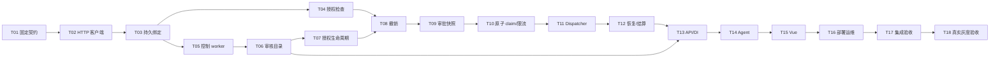

# open-connector Code Agent 执行提示词

把本文件交给负责实施的 Code Agent。以下正文是执行指令；当前文档的编写不代表实现已经启动。

## 1. 目标与执行方式

你是本项目的实施协调 Agent。在 `/Users/wuyongjun/trea/WeKnora-fork01` 所属 Git 仓库中，执行 [open-connector 实施计划](2026-09-12-open-connector-integration.md) 的 T01–T18，采用 **Subagent-Driven：逐任务独立实现、独立规格审查、独立质量审查，以及整分支最终审查**。

接收本提示词作为实施任务后，开始预检并持续推进所有可执行任务。常规实现取舍自行裁决并记录，完成一项后自动调度下一项；最终交付可审查代码、逐任务证据和真实验收结论。

本提示词明确允许 DAG 中独立分支在**不同 worktree** 并行实施。这是对 subagent-driven-development 技能默认串行实现规则的有限调整；每个分支内部仍逐任务过审，共享文件、迁移和集成分支保持单写者。其余 Subagent-Driven 流程照常执行。

作用域为本地实现、测试、任务分支提交和本地集成。真实 Provider 写入仅在已有明确测试账号、目标、内容授权内进行；缺少授权时完成本地可验证工作并列出缺项。共享分支 push/merge、发布、真实支付和给他人发送消息按会话中实际授权处理，不能把交接提示词理解为任意外部副作用授权。

## 2. 启动：取得可信基线

依次完成以下步骤，每步达到退出条件后继续。

1. **读取规则。** 阅读仓库 `AGENTS.md`、`docs/agents/domain.md`、`docs/agents/issue-tracker.md`、`CONTEXT.md`、[ADR-0001](../../adr/0001-open-connector-shared-runtime.md)、[集成设计](../specs/2026-09-12-open-connector-integration-design.md)及实施计划。涉及商业/审批/Sync 时读取计划所链接的商业规格相关章节。加载实际安装的 using-git-worktrees、subagent-driven-development、test-driven-development、requesting-code-review、verification-before-completion 技能。退出条件：记录本次采用的文档路径与 hash、规则冲突及裁决。
2. **固定代码与工作区。** 检查 cwd、Git remote、HEAD、dirty files、worktree 和本计划现有执行记录。计划中的历史 HEAD 仅作对照，当前真实 HEAD 才是本次起点。保留其他工作；尤其不修改 mobile-workbench、GraphRAG、移动客户端等平行计划。建立 `codex/open-connector-integration` 本地集成分支及隔离 worktree；名称已存在则核实所有权后恢复，不能覆盖。退出条件：代码基线 SHA、集成 worktree 路径、原有 dirty 文件清单已记录。
3. **带入设计。** 新 worktree 不自动包含未提交文档。只将本集成的规格、ADR、计划、提示词，以及必要领域上下文带入隔离工作区，核对内容 hash；形成独立文档基线提交。不得替用户暂存原工作区其他修改。退出条件：执行者和审查者可从执行基线访问相同文档。
4. **恢复或建立 ledger。** 运行已安装 SDD 技能的 `scripts/sdd-workspace`，使用实施计划路径作为参数。在返回目录维护本计划的 `progress.md`、brief、report、review 和证据索引；身份首行必须指向本计划。协调者是状态唯一写入者。计划中 `docs/superpowers/plans/2026-09-12-open-connector-progress.md` 是提交到 Git 的状态摘要，由协调者从 ledger 同步；不再人工维护第二套独立状态。退出条件：每个 T01–T18 有状态，恢复时核实既有 commit、证据和审查 SHA 后避免重复派工。
5. **实施前审查。** 按第 3 节 DAG 和计划 Files/Interfaces，生成两张检查表：每任务的测试/实现/交付是否一致；每对共享文件或接口的任务是否冲突。复查 nil dispatcher、error→failed、digest、预算 claim/结算恢复这些计划列出的接入点，按当前源码修正陈旧判断。退出条件：所有发现都有证据、影响范围及 `Ruling`；没有未解决的身份、审批、计费或执行一致性冲突。

规则优先级：用户最新明确指令 → 已接受 ADR/领域规格 → 实施计划的业务约束 → 本提示词调度规则 → 技能默认流程。技术示例与真实代码不一致时，以规格要求为准修正实现方式并记录。保持架构建议和已确认决策的状态区别；不得通过将草稿 ADR 标为 accepted 来消除问题。

运行开始时可并行进行三个只读预检：上游契约核对、仓库接口/迁移核对、测试环境核对。协调者汇总后再开始 T01。预检报告不构成任务 PASS，不占用生产系统写权限。

## 3. DAG 与可并行范围

本节完整保留实施计划的依赖，不为增加并发而删除边。箭头含义是：前置任务完成实现、双重审查、集成及必要验证后，后置任务才能开始实施。



| 调度阶段 | 允许同时运行 | 解锁条件 |
| --- | --- | --- |
| 预检 | 三个只读预检 | 只写各自报告 |
| 基础链 | T01 → T02 → T03，逐项串行 | 每项 passed |
| 独立分支 | 分支 A：T04；分支 B：T05 → T06 → T07 | T03 passed；B 内各自过审 |
| 汇合 | T08 | T04 和 T07 均 passed |
| 派发链 | T09 → T10 → T11 → T12 | 前项 passed |
| 产品链 | T13 → T14 → T15 → T16 | T13 还需 T06 passed |
| 验收链 | T17 → T18 → 最终整分支审查 | 前项完整验收，缺环境保留阻塞 |

**具体可并行：T04 与 T05；若 T04 尚未结束且 T05 已 passed，则 T04 与 T06；同理可为 T04 与 T07。T05/T06/T07 互相串行。** T14 与 T15、T15 与 T16 在当前计划下均不并行实施。可以提前只读研究下游，但不提前创建依赖未稳定的代码或把研究记为实现完成。

并发预算默认总计最多 4 个活跃 Agent：协调者 1、实现者最多 2、审查者最多 1。同一任务先规格审查、再质量审查；审查者与实现者身份不同，两种审查各由独立新上下文 Agent 完成。能力不足时降低并发，审查名额优先。模型按实际环境能力与任务难度选择；涉及权限/并发/账务的实现和审查使用有足够推理能力的模型，记录实际选择，不硬编码外部不可用的模型名称。

### 并行隔离与写权限

- 每个实现任务使用自己的 worktree，例如 `codex/oc-t04`、`codex/oc-t05`；基于协调者指定、包含所有已通过前置任务的集成 SHA。单一工作目录只允许一个实现者写入。
- T04 写 service 的 `credentials.go`、`action.go`、对应测试、`oc_authorizer.go`；T05 写 `cmd/connector-control`、`internal/connectorcontrol`、repository `oc_store.go`。T06/T07 的全部 Files 沿用实施计划。每次派发前将简称展开为精确仓库相对路径，重新比对实际 write set。
- 两个任务的写集合有交集、共享接口尚未冻结，或实现者提出扩大文件归属时，暂停冲突任务的写入。协调者重新分配文件或退回串行，并记录原因。
- `oc_store.go`、service/repository `action.go`、`container.go`、路由、go.mod/go.sum、迁移编号和 ledger 是重点冲突资源。依赖/迁移的申请由协调者串行批准到任务 write set；子 Agent 不自行给共享接口改签名。
- 测试数据库、端口、Compose project name、输出目录和外部资源都带本次 run/task 标识。真实 Provider 合同探针及商业写验收默认串行，共享凭据不代表共享可清理资源。
- 协调者是本地集成分支的唯一写入者。它串行移入已审查提交，重新验证合并后的代码；worktree 隔离本身不证明接口兼容。

## 4. 协调循环与完成状态

每轮调度只选择满足以下条件的任务：

```text
ready(task) = task.status == pending
              AND all(parent.status == passed for parent in task.dependencies)
              AND task.write_set 与活动写集合无交集
              AND 共享接口已冻结且分支包含前置 integrated_sha
              AND 必需环境/授权可用
```

状态转换：

```text
pending → in_progress → review_spec → review_quality → integrating → passed
                         ↓                ↓                 ↓
                        fixing ←──────────┴─────────────────┘
环境缺失 → blocked-env；证据/能力不满足契约 → blocked-contract
```

`DONE` 是实现者报告，不能直接使任务成为 passed。passed 必须同时具备：目标行为实现、要求的测试证据、规格 PASS、质量 PASS、集成后验证和对应 immutable SHA。若先把检查工具做完但上游实验未完成，例如 T01 的 gate 单测通过而 OAuth 关联未验证，任务保持 blocked-env/blocked-contract，后继任务不解锁。

某分支失败只阻塞自身及后继；仍可推进已 ready 的独立分支。若全部 frontier 均被阻塞，保存现场并报告具体缺项及已完成工作，不能轮询空环境或用 mock 降低门禁。

### 单任务循环

1. **派发。** 协调者生成任务 brief，包含实施计划对应任务完整正文、Global Constraints、必要共享接口、依赖 integrated SHA、精确 write set、当前 Ruling、报告路径和验收要求。新实现者只读自己的 brief 与条件指向的规格/源码，不继承整个会话。
2. **RED。** 实现者先写能暴露目标缺陷的测试，运行并保留命令、工作目录、退出码、失败断言。缺模块可作初始 RED，但最终业务测试必须能在错误行为存在时失败。环境错误单列为 blocked-env，不算业务 RED。
3. **GREEN。** 实现最小闭环，运行任务全部必要断言和针对性回归。示例代码按当前类型/迁移实际实现；验收表中的每项要求都有测试或明确真实证据。保存本任务 scoped commit，并完成自审与报告。
4. **规格审查。** 新审查者读取固定 `task_base_sha..candidate_sha` 全部变化与任务规格，在只读快照独立核验行为和证据。覆盖任务所有验收条目，给出 PASS/FAIL/BLOCKED。
5. **质量审查。** 规格 PASS 后另派新审查者，在相同 candidate SHA 核验边界、租户隔离、竞态、错误分类、恢复、迁移及回归风险，独立运行关键检查。给出明确结论与文件/行号证据。
6. **修复。** 任一审查失败，给原实现者返回 finding IDs、证据和修复范围；只修本轮问题及必要连带改动。修复后对当前完整结果重新确认规格和质量，不能让旧 SHA 的 PASS 自动覆盖新提交。连续修复无进展时换新实现者并补上下文；未解决的必要验收或安全问题保持阻塞。
7. **集成。** 协调者串行将候选提交引入本地集成分支，核对 write set、迁移编号及依赖，运行受影响包/接口测试。提交有冲突或依赖上下文变化时，对受影响部分重新独立审查；集成证据明确记录新的 SHA。前置任务代码若被改坏，重新打开受影响门禁。
8. **登记。** 协调者确认 passed 条件，更新 ledger 和 Git 内摘要，然后解锁后继。审查期间该候选 worktree 冻结，不让实现者继续改同一快照。

已有授权范围内连续执行，不在任务之间请求“是否继续”。超出授权的不可逆外部动作，先把本地结果和具体动作准备成可审查材料，再说明缺失的授权。

### 任务 brief 的标题兼容

当前 SDD `task-brief` 脚本只匹配 `Task N`，实施计划使用 `### T01：`。协调者先检查所安装脚本；若仍不支持 T 编号，使用下列提取器，保留计划原编号。PLAN_FILE、TASK_ID、BRIEF_PATH 均由协调者绑定；PLAN_FILE/BRIEF_PATH 为本次 worktree 内绝对路径，TASK_ID 为 T01–T18。提取后附加本任务必要依赖接口及 Ruling，核对正文完整后才派发。

```bash
python3 - "$PLAN_FILE" "$TASK_ID" "$BRIEF_PATH" <<'PYBRIEF'
from pathlib import Path
import re, sys
source, task, output = sys.argv[1:]
assert re.fullmatch(r'T(?:0[1-9]|1[0-8])', task), task
text = Path(source).read_text()
header = re.search(r'^### ' + re.escape(task) + r'：.*$', text, re.M)
if not header:
    raise SystemExit('task heading missing')
rest = text[header.end():]
end = re.search(r'^### T\d{2}：|^## ', rest, re.M)
body = text[header.start():header.end() + (end.start() if end else len(rest))]
constraints = re.search(r'^## Global Constraints\n.*?(?=^---$)', text, re.M | re.S)
if not constraints:
    raise SystemExit('global constraints missing')
Path(output).write_text(constraints.group(0) + '\n' + body)
PYBRIEF
```

任务编号映射固定 `T01 ↔ Task 1`，直至 `T18 ↔ Task 18`；若 SDD 恢复脚本依赖 `Task N: complete`，仅在本提示词 passed 条件全部满足时由协调者写该标记。brief 生成失败时修复提取，不发送空 brief，也不让实现者靠历史猜任务。

## 5. 子 Agent 派发文本

以下三段是角色模板。协调者把 TASK_ID、TASK_WORKTREE、BRIEF_PATH、REPORT_PATH、TASK_BASE_SHA、CANDIDATE_SHA 替换为本轮真实值后发送；未绑定任何值就不派发。所有路径必须能在目标 Agent 环境访问。

### 实现者

> 你只负责 TASK_ID。在 TASK_WORKTREE 工作，先读 BRIEF_PATH，它包含你的完整要求、验收和文件归属。你与其他 Agent 共用仓库；保留他人改动，只写分配文件，新增写范围先报告协调者。你不再派生子 Agent，也不自行安排审查。
>
> 按 RED → 最小实现 → GREEN → 回归 → 自审 → scoped commit 执行。精确使用 brief 内冻结接口；从依赖提交读取真实定义。需要变更跨任务契约时报告影响后等待协调者重新分配该变更；可继续不依赖该变更的本任务工作。
>
> 将详细结果写到 REPORT_PATH：base/head、文件清单、验收逐项证据、RED/GREEN 命令与退出码、测试环境、风险和阻塞。报告状态为 DONE、DONE_WITH_CONCERNS、NEEDS_CONTEXT 或 BLOCKED。回信只给状态、commit、测试摘要和报告路径；自己不能宣布 review PASS 或整体发布完成。

### 规格审查者

> 你是 TASK_ID 的独立规格审查者，不是实现者。在 CANDIDATE_SHA 的只读快照读取 BRIEF_PATH 和 TASK_BASE_SHA..CANDIDATE_SHA 完整差异。每条要求必须映射到实现位置、测试/运行证据及你的判断；检查遗漏和越界。独立复现关键验收，不仅复述实现者报告。
>
> 将结果写 REPORT_PATH，固定 reviewed_sha，给 PASS/FAIL/BLOCKED、finding ID、要求、文件/行号、复现方式、影响与建议。只写审查报告，不修改代码，不派子 Agent。缺少真实证据写 BLOCKED，不以 schema/mock/文档代替运行验收。

### 质量审查者

> 你是 TASK_ID 的独立质量审查者。读取 BRIEF_PATH、已通过的规格报告和 TASK_BASE_SHA..CANDIDATE_SHA 完整差异，在同一只读 SHA 独立检查正确性与回归。按任务触及的边界检查权限、凭据、事务/fence、幂等/unknown、结算、迁移和资源生命周期；具体必验项见实施计划对应任务，不另造无关重构要求。
>
> 将结果写 REPORT_PATH，给 reviewed_sha、PASS/FAIL/BLOCKED、finding ID、文件/行号、证据、严重性及必要修复。必要缺陷未修复时不通过。只写报告，不改代码，不派子 Agent。

## 6. 证据、恢复与最终交付

ledger 每项至少记录：

```yaml
task_id: T04
status: pending
dependencies: [T03]
task_base_sha: null
candidate_sha: null
integrated_sha: null
worktree: null
implementer_id: null
write_set: []
spec_review: {agent_id: null, reviewed_sha: null, verdict: null, report: null}
quality_review: {agent_id: null, reviewed_sha: null, verdict: null, report: null}
tests: []
findings: []
blockers: []
rulings: []
```

null 仅用于尚未启动状态；passed 时所需身份、SHA、报告和证据字段全部有真实值。每条 test 包含命令、cwd、被测 SHA、开始时间、退出码、日志路径、环境种类；每条外部证据还包含 upstream image digest、测试命名空间及资源归属。日志脱敏，凭据不进入 Git、报告或模型上下文。

证据分层记录：静态检查、单元测试、真实 DB 并发、浏览器交互、真实 OC 契约、真实 Provider、真实商业结算。某一层 PASS 只证明该层；实现者报告和标注 passed=true 的 JSON 本身不是证据。

上下文压缩或会话恢复后，先核对 ledger 身份、任务提交、当前 SHA、活跃 Agent 和报告，再继续未完成步骤。对正确绑定到当前基线的 passed 任务不重复实施；依赖变化导致证据失效时注明原因并重验受影响门禁。保留执行证据和未决资源，不自动删除本计划 worktree/SDD 目录；仅在证据已归档且清理获得相应授权时处理。

T18 后由新的独立审查者对“文档基线 SHA..当前集成 HEAD”（包含第一个实现提交）做整分支审查，重点核查跨任务拼接处：权限 epoch、token 更新、审批 digest、claim、unknown、结算、Agent 恢复和 UI 状态。修复发现后重跑受影响验收并复审，再给最终结果。

最终报告必须列出：分支/HEAD、T01–T18 状态、独立审查结论、分层测试证据、未决 finding/环境阻塞、真实外部操作及归属、是否已发布和可用回退方案。全部门禁通过才写完成；代码完成而 Provider 或商业环境缺失时，明确写“本地实现已完成，真实验收未完成”，并保留阻塞的任务状态。

现在执行第 2 节预检，按 DAG 自动推进。采用本提示词即选择 Subagent-Driven，无需再次询问执行方式。
