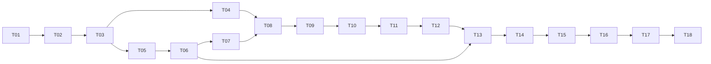

# open-connector 多租户 SaaS 集成 Implementation Plan

> **For agentic workers:** REQUIRED SUB-SKILL: Use superpowers:subagent-driven-development (recommended) or superpowers:executing-plans to implement this plan task-by-task. Steps use checkbox (`- [ ]`) syntax for tracking.

**Goal:** 在现有 WeKnora AppConnector 中交付可按空间隔离、授权、审批、审计和计费的 open-connector 服务集成，首先完成受限连接与 HTTP Action 闭环。

**Architecture:** WeKnora 是身份、连接归属、审批及商业准入的控制面；共享私网 open-connector 保存其连接凭据并执行 Provider 操作。扩展现有 ActionService 和仓储，使用持久化绑定、不可变执行快照及 outbox 处理跨系统故障，不增加第二套审批和 Credits 账本。原生连接、MCP 和 DataSource Sync 保持原路径。

**Tech Stack:** 当前仓库 Go 1.26.0、Gin、GORM、PostgreSQL、现有 SQLite 测试基础设施；Vue 3、TypeScript、Vite、tsx/node:test；独立 Node open-connector 运行时与独立 PostgreSQL 数据库。Node 版本和构建命令由 T01 根据固定上游提交锁定，不猜测镜像标签。

**Spec:** [集成设计](../specs/2026-09-12-open-connector-integration-design.md)、[ADR-0001](../../adr/0001-open-connector-shared-runtime.md)、[商业与 Connector 规格](../specs/2026-09-10-saas-billing-connectors-design.md)、[CONTEXT](../../../CONTEXT.md)。执行者必须同时阅读规格与计划。

## Global Constraints

以下约束直接沿用规格；任务不能局部放宽：

- “私网共享 open-connector，WeKnora 负责空间、成员与连接归属校验，调用使用按连接限制的 Token；保留独立实例选项。”
- “每个连接只有一个凭据与刷新管理方。”
- “无连接或无允许动作时不签发 Token，绝不以空清单模拟拒绝全部。”
- “撤销最后一个授权时删除 Token，不写入 allowedConnections=[]”。
- “首期关闭 Provider Proxy；MCP、管理 API、控制台和运行日志不直接对租户开放。”
- “ActionService 已有预算入口，不再嵌套 GatedAdapter 消费第二次审批或重复预占/计费。”
- “收到成功但本地保存/计费失败时，补偿持久化与结算，不重复外部写入。”
- “无可靠 Provider 查询时保留 unknown，不制造失败、不自动重发。”
- “现有 Sync 首期保留”。文件/临时 URL 动作首期不发布。
- 只有共享隔离方向已确认；用户本轮授权编写详细计划，不等于已经授权部署、真实 Provider 写入或接受所有技术建议。

---

## 0. 执行边界、证据与依赖

本计划是一条依赖紧密的集成链，不拆成互相独立的计费、工作流或 Sync 重建项目。未来 Sync 适配、独立实例自动编排和文件代理应另写规格及计划。本次各任务都能独立运行自己的测试，但对租户开放必须通过 T17、T18。

静态基线：当前 checkout HEAD `700ef41033a7d1b371abbc8cbac22ade25135ee0`。编写时已有未提交设计文件，执行时不得 reset、清理或覆盖它们。实现阶段按 using-git-worktrees 创建隔离工作区，确保上述设计和本计划进入执行工作区；不要假定新 worktree 会自动包含未提交文档。

发现的实际接入问题：

1. `internal/container/container.go` 给 ActionService 注入 nil dispatcher/unknown；`ActionService.Execute` 目前直接调用 dispatcher，并未在服务内检查 nil。容器注释不能作为“已经安全拒绝”的证据。
2. `settleOutcome` 当前将所有 Go error 判为 failed；外部副作用不明必须改为 unknown。
3. `ActionDigest` 当前未包含 Risk、上游绑定和 Action ID；审批表以 digest 为主键。需防止两个相同参数操作共享审批，也防止 schema/风险/账号变化继续使用旧审批。
4. handler 当前接收客户端 Risk、AppVersion 和 Content；OC 路径必须由本地发布定义确定风险和版本。
5. A02Guard 当前返回原始凭据、只有 connectionID/authVersion；新的授权接口必须显式带空间和 actor。
6. 当前 Execute 的预算 Begin 在 dispatch claim 之前，Finish 在结果写入之后；竞争、崩溃与结算重试需要专门验证。ResolveUnknown 目前不补做结算。
7. 当前前端为 Vue；本计划不假定 React 迁移已实施。

依赖：



| ID | 可审查交付物 | 主要依赖 |
| --- | --- | --- |
| T01 | 固定版本契约探针与证据门禁 | 无 |
| T02 | 有界 HTTP 客户端和执行凭据限制 | T01 |
| T03 | 绑定模型、迁移和租户作用域仓储 | T02 |
| T04 | 不读取 OC 原始凭据的授权检查 | T03 |
| T05 | 管理凭据隔离与连接协调进程 | T03 |
| T06 | 经审核的动作目录与安装版本 | T05 |
| T07 | 可关联的 OAuth/API key 连接生命周期 | T06 |
| T08 | 持久撤销、权限版本和远端清理 | T04、T07 |
| T09 | 完整审批快照与可信 Prepare | T08 |
| T10 | 原子派发 claim、限流、幂等键 | T09 |
| T11 | HTTP dispatcher 与结果分类 | T10 |
| T12 | unknown/崩溃/结算恢复 | T11 |
| T13 | 产品 HTTP API 与容器注入 | T06、T12 |
| T14 | Agent 与单一 Action 生命周期接入 | T13 |
| T15 | Vue 目录、连接和审批界面 | T14 |
| T16 | 私网部署、观测、备份与升级 | T15 |
| T17 | 多空间集成和故障注入验收 | T16 |
| T18 | 真实 Provider 与商业灰度验收 | T17 |

执行状态记录到 `docs/superpowers/plans/2026-09-12-open-connector-progress.md`，由 T01 创建。每项记录 `pending / in_progress / review / passed / blocked-env`、commit、RED/GREEN 命令及退出码、证据路径、规格审查和质量审查结果。实现者陈述不能代替审查；一个任务未过审不能启动依赖任务。缺真实账号不阻止独立纯单元任务，但不得将 T01 外部契约、T17 PostgreSQL/浏览器或 T18 实测标为通过。

## 1. 文件结构与共享契约

### 文件职责

| 文件/目录 | 职责 |
| --- | --- |
| `internal/appconnector/openconnector/types.go` | 运行时 wire 请求/响应；不引入 service/repository 依赖 |
| `internal/appconnector/openconnector/client.go` | 受限执行 HTTP；无管理 Token |
| `internal/appconnector/openconnector/grants.go` | 非空连接/动作清单与危险通配符拒绝 |
| `internal/appconnector/oc_binding.go` | 空间绑定、发布定义、授权尝试、审批执行绑定领域类型 |
| `internal/application/repository/appconnector/oc_store.go` | 绑定、尝试、目录的租户查询与事务 |
| `internal/application/repository/appconnector/oc_dispatch.go` | claim、outbox、fence、恢复记录 |
| `internal/application/service/appconnector/oc_authorizer.go` | 本地成员、安装、连接及 grant 检查 |
| `internal/application/service/appconnector/oc_catalog.go` | 候选目录审核、schema 固定和安装授权 |
| `internal/application/service/appconnector/oc_connections.go` | 连接授权尝试、激活和撤销协调 |
| `internal/application/service/appconnector/oc_dispatcher.go` | 已审批快照到 HTTP 的唯一映射 |
| `internal/application/service/appconnector/oc_recovery.go` | unknown、结果持久化与结算恢复 |
| `internal/application/service/appconnector/oc_limiter.go` | 分布式并发 lease 与重试时间 |
| `internal/connectorcontrol/` | 持有管理凭据的独立进程内部模块 |
| `cmd/connector-control/main.go` | 私网协调 worker 入口，不加载 Agent |
| `internal/handler/app_connector_oc.go` | 新产品 API 的安全 DTO 和本地授权 |
| `internal/agent/tools/app_connector.go` | Agent 工具与本地 Action 的关联 |
| `frontend/src/api/appConnectors.ts` | 现有认证 HTTP 客户端的产品 API 封装 |
| `frontend/src/views/apps/` | 目录、连接、授权等待、动作审批与结果页面 |
| `docker/compose.open-connector.yaml` | OC、控制 worker、网络和 secrets 配置 |
| `scripts/open-connector/` | 契约与验收工具；只操作本次明确拥有的资源 |

新增测试与实现放同目录，Go 使用 `_test.go`，前端纯状态使用 `.test.ts`。不把全部功能塞进已有 action.go，也不趁机重构其他模块。

### 共享类型（由 T03 建立，后续任务按原名引用）

```go
// internal/appconnector/oc_binding.go; package appconnector
// imports: context, encoding/json, time
// 所有字段为本地领域数据；不直接作为用户响应序列化。
type OCBinding struct {
    TenantID uint64
    ConnectionID, RuntimeID, Provider, ExternalID, Alias string
    AuthVersion, BindingVersion int64
    State string
}
type OCDefinition struct {
    AppID, AppVersion, ActionID, Provider, SchemaDigest, Risk string
    InputSchema json.RawMessage
    RequiredScopes []string
    Published bool
}
type OCExecutionBinding struct {
    RuntimeID, Provider, ExternalID, Alias, ActionID, SchemaDigest string
    BindingVersion int64
}
type OCSubject struct { TenantID uint64; ActorID string }
type OCAuthorizationAttempt struct {
    ID string
    Subject OCSubject
    ConnectionID, RuntimeID, Provider, Alias, State string
    AuthVersion int64
    ExpiresAt time.Time
}
type OCDispatchRecord struct {
    TenantID uint64
    ActionID, RuntimeID, Key, ExecutionID, State, ReservationID string
    FirstSentAt, ReplayUntil time.Time
    Fence int64
}
type OCBindingStore interface {
    GetBinding(context.Context, uint64, string) (OCBinding, error)
}
type OCAuthorizer interface {
    Check(context.Context, OCSubject, string, int64) (OCBinding, error)
}
```

`OCSubject` 只由认证 handler/受控后台任务构造；模型参数不能覆盖。数据库查找主键不能因为 UUID 难猜而省掉 tenant 条件。后台全局扫描是单独内部方法，每条任务携带所属空间并重新授权。

HTTP 执行客户端契约（T02 建立）：

```go
// package openconnector; imports: context, encoding/json, net/http
// Client 构造时绑定一个内部运行时地址，不接收用户 URL。
type Call struct { ActionID, Alias, Key string; Input json.RawMessage }
type Result struct {
    HTTPStatus int
    Success bool
    Code, ExecutionID string
    Data json.RawMessage
    AuditPersisted *bool
}
type Executor interface {
    Execute(context.Context, string, Call) (Result, error) // string 为受限运行 Token
}
// NewClient(baseURL string, httpClient *http.Client) (*Client, error)
// NewGrant(externalID string, actionIDs []string) (Grant, error)
```

这些是本计划拟新增接口，不宣称已经存在。上游响应字段映射以 T01 的固定 fixture 为准，不能将本地 Result 直接当作上游 JSON 结构。

## 2. 任务

### T01：固定上游契约与失败关闭的证据门禁

**Files:** Create `scripts/open-connector/contract_gate.py`、`scripts/open-connector/test_contract_gate.py`、`scripts/open-connector/contract-cases.json`、`docs/superpowers/plans/2026-09-12-open-connector-progress.md`；Create `docs/integrations/open-connector-contract.md`。

**Interfaces:** 输入为固定 SHA 的运行结果 JSON；产出 `validate(report: dict) -> list[str]` 和退出码 0=通过、2=缺证据。后续任务消费通过的 wire fixtures 与版本摘要，不消费 README 推断。

- [ ] 写失败测试：

```python
import unittest
from contract_gate import validate
class GateTest(unittest.TestCase):
    def test_documentation_is_not_runtime_evidence(self):
        errors = validate({"sha": "33dd4ad6ee22f9ce5158a1516a11d8b8566b5c8a",
                           "cases": [{"id": "cross_connection", "kind": "doc", "passed": True}]})
        self.assertTrue(errors)
    def test_missing_cases_fail(self):
        self.assertTrue(validate({"cases": []}))
```

- [ ] 运行 `python3 -m unittest discover -s scripts/open-connector -p 'test_*.py' -v`，预期缺 validate 导致失败。
- [ ] 建立门禁核心，CLI 从命令行文件读取 JSON、输出错误并按是否为空退出；schema 字段缺失必须拒绝：

```python
REQUIRED = {"cross_connection", "empty_grant", "default_alias", "no_auth",
            "admin_denied", "proxy_denied", "oauth_correlation", "key_replay",
            "key_conflict", "in_progress", "expired_key", "audit_failure"}
def validate(report):
    errors = []
    if report.get("sha") != "33dd4ad6ee22f9ce5158a1516a11d8b8566b5c8a":
        errors.append("unreviewed upstream SHA")
    if not report.get("image_digest", "").startswith("sha256:"):
        errors.append("missing immutable image")
    cases = {c.get("id"): c for c in report.get("cases", [])}
    for name in sorted(REQUIRED):
        c = cases.get(name, {})
        if c.get("kind") != "runtime" or c.get("passed") is not True or not c.get("artifact"):
            errors.append(name + ": missing runtime proof")
    return errors
```

- [ ] 在隔离目录检出研究提交；记录 package.json engines、lockfile、真实 build/start 命令、LICENSE 与镜像 digest 到 contract 文档。核对 `/api/runtime-tokens`、连接查找/删除、OAuth 发起/回调关联、`/v1/actions/{id}` 的真实字段及状态码，保存脱敏 fixtures。不可编造 OAuth endpoint。
- [ ] 对 contract-cases.json 中每个场景记录 setup、request、expected、cleanup ownership。空连接清单应证明 upstream 放行，但本地 NewGrant 必须拒绝；跨连接/default/proxy/admin 均证明受限 token 无权。24 小时测试用固定上游可控时钟或隔离数据库时间 fixture，不在生产改时间。OAuth 缺关联则记录 `blocked-contract`，禁止靠最近连接猜测。
- [ ] 重跑 Python 测试；增加缺 digest、仅部分 case、全部实际结果齐全时的测试。实际环境缺失时 gate 必须退出 2，不把门禁单测 PASS 当作上游 PASS。
- [ ] 提交本任务指定文件：`git add scripts/open-connector docs/integrations/open-connector-contract.md docs/superpowers/plans/2026-09-12-open-connector-progress.md`；`git commit -m "test(connectors): add pinned runtime contract gate"`。审查脱敏与清理归属。

### T02：只持受限 Token 的 HTTP 执行客户端

**Files:** Create `internal/appconnector/openconnector/{types,client,grants}.go` 和 `client_test.go`、`grants_test.go`。

**Interfaces:** 产出第 1 节 Executor、Call、Result、NewClient、NewGrant。Grant 的 JSON 字段为 `allowedConnections/allowedActions/allowedProxies/blockedActions`；禁止省略连接清单。

- [ ] 写拒绝越权输入测试：

```go
func TestGrantRejectsEmptyAndWildcard(t *testing.T) {
    for _, tc := range []struct{ id string; actions []string }{
        {"", []string{"github.get_current_user"}}, {"c1", nil}, {"c1", []string{"*"}},
    } {
        if _, err := NewGrant(tc.id, tc.actions); err == nil { t.Fatal("unsafe grant accepted") }
    }
}
func TestClientRejectsAliasOmissionBeforeNetwork(t *testing.T) {
    calls := 0
    srv := httptest.NewServer(http.HandlerFunc(func(w http.ResponseWriter, r *http.Request) { calls++ }))
    defer srv.Close()
    c, err := NewClient(srv.URL, srv.Client()); if err != nil { t.Fatal(err) }
    _, err = c.Execute(context.Background(), "scoped", Call{ActionID:"github.get_current_user", Key:"k", Input:json.RawMessage(`{}`)})
    if err == nil || calls != 0 { t.Fatalf("err=%v calls=%d", err, calls) }
}
```

- [ ] 运行 `go test ./internal/appconnector/openconnector -run 'TestGrant|TestClient' -count=1`，预期缺类型/实现失败。
- [ ] 实现 Grant，并让客户端只接受无 userinfo/query/fragment 的 http(s) 内部根地址，禁止 redirect；action ID 限制为 `[A-Za-z0-9_.-]+`，拒绝空 alias/key、大于 255 bytes key 和无效 JSON：

```go
type Grant struct {
    AllowedConnections []string `json:"allowedConnections"`
    AllowedActions []string `json:"allowedActions"`
    AllowedProxies []string `json:"allowedProxies"`
    BlockedActions []string `json:"blockedActions"`
}
func NewGrant(id string, actions []string) (Grant, error) {
    if strings.TrimSpace(id) == "" || len(actions) == 0 { return Grant{}, errors.New("empty grant") }
    for _, a := range actions {
        if a == "" || strings.ContainsAny(a, "*?/") { return Grant{}, errors.New("invalid action grant") }
    }
    return Grant{[]string{id}, append([]string(nil), actions...), []string{}, []string{}}, nil
}
```

- [ ] 实现一次 POST，不加 HTTP 自动重试。body 用 `json.Marshal(struct{Input json.RawMessage ...})` 生成 `{input:...}`；设置 Authorization、Idempotency-Key、x-oo-connector-alias。响应读取上限 2 MiB、默认超时 30 秒；超限返回 error，结果分类留给 T11。日志不得输出 token、原始输入或响应内容。
- [ ] 加 httptest：捕获真实 method/path/body/headers；302 不跟随、2 MiB+1 拒绝、成功 envelope 解码、畸形 JSON、success=false、context cancel；依 T01 fixtures 对齐 meta。运行 `go test -race ./internal/appconnector/openconnector -count=1`，预期全部 PASS。
- [ ] `git add internal/appconnector/openconnector`；`git commit -m "feat(connectors): add scoped open-connector HTTP client"`。

### T03：持久绑定、版本与租户作用域仓储

**Files:** Create `internal/appconnector/oc_binding.go`、`internal/application/repository/appconnector/oc_store.go`、`oc_store_test.go`；Create `migrations/versioned/000121_open_connector_bindings.up.sql`、对应 `.down.sql`。

**Interfaces:** 建立第 1 节全部 OC 领域类型。`NewOCStore(db *gorm.DB) *OCStore`、`SaveBinding(ctx context.Context, b appconnector.OCBinding) error`、`GetBinding(ctx context.Context, tenant uint64, connection string) (appconnector.OCBinding,error)`。迁移编号 121 是本 checkout 的下一个编号，执行时若已被占用，先统一重新编号并更新计划，不覆盖他人迁移。

- [ ] 使用现有 sqlite/GORM 测试模式建库，写实际仓储隔离测试；fixture 先建真实 Installation/Connection 父行，不绕过外键：

```go
func TestOCBindingRejectsZeroTenant(t *testing.T) {
    // 本测试不需要数据库；输入必须在访问数据库前拒绝。
    s := NewOCStore(nil)
    if _, err := s.GetBinding(context.Background(), 0, "c1"); err == nil { t.Fatal("unscoped lookup") }
}
```

- [ ] 运行 `go test ./internal/application/repository/appconnector -run TestOCBinding -count=1`，预期失败。
- [ ] 定义 Runtime、Binding、Definition、Attempt、Outbox 的行类型与迁移；凭据列只允许 secret reference。关键约束 SQL：

```sql
CREATE TABLE connector_connection_bindings (
 tenant_id BIGINT NOT NULL, connection_id TEXT NOT NULL,
 runtime_id TEXT NOT NULL, provider TEXT NOT NULL,
 external_id TEXT NOT NULL, alias TEXT NOT NULL,
 auth_version BIGINT NOT NULL CHECK(auth_version > 0),
 binding_version BIGINT NOT NULL CHECK(binding_version > 0),
 state TEXT NOT NULL CHECK(state IN ('pending','active','revoked','error')),
 PRIMARY KEY(tenant_id, connection_id),
 UNIQUE(runtime_id, external_id), UNIQUE(runtime_id, provider, alias),
 FOREIGN KEY(tenant_id, connection_id) REFERENCES connections(tenant_id, id)
);
```

- [ ] 查明现有 connections 的 composite unique/PK 后添加兼容外键；全量定义 Runtime 的 ID/地址/启停/版本/digest/secret refs，Definition 的 AppID/AppVersion/ActionID/schema/scope/risk/Published，Attempt 的唯一 ID/空间/actor/连接/alias/过期/状态/authVersion，Outbox 的唯一 operation ID/空间/资源/版本/类型/attempts/next_at/lease/fence。以显式列迁移，不用生产 AutoMigrate。已有原生连接不自动写入 OC binding。
- [ ] GetBinding 实现 `Where("tenant_id = ? AND connection_id = ?", tenant, connection)`；新增测试 tenant B 查 tenant A 返回 not found，同一 external ID 二次绑定失败，alias 永不复用，AuthVersion 乐观锁只增。PostgreSQL 用独立测试库实际执行 up/down/up；down 遇非空有效绑定拒绝，运维回滚采用停用功能而非删除审计。
- [ ] 运行仓储单测和独立 PostgreSQL 测试，分别记录结果；`git add internal/appconnector/oc_binding.go internal/application/repository/appconnector/oc_store* migrations/versioned/000121_open_connector_bindings.*.sql`；`git commit -m "feat(connectors): persist tenant scoped runtime bindings"`。

### T04：授权与原始凭据解耦

**Files:** Create `internal/application/service/appconnector/oc_authorizer.go`、`oc_authorizer_test.go`；Modify `credentials.go`、`action.go`、`credentials_test.go`、`action_test.go`。

**Interfaces:** 建立 `Check(ctx, subject, connectionID, expectedVersion)`，实现 OCAuthorizer。将 A02Guard 改为 `Check(ctx context.Context, subject appconn.OCSubject, connectionID string, expectedVersion int64) error`；原生 CredentialResolver.Resolve 保留供其 adapter 使用。所有 stubGuard 与 DI 一次更新。

- [ ] 新建表驱动测试，覆盖 A 空间个人连接由 B actor/其他空间使用、成员离开、安装禁用、显式空间 grant 缺失、AuthVersion 变化；每项断言失败且 secret store 调用计数为 0。核心权限断言直接复用已有领域函数：

```go
func TestPersonalConnectionCannotCrossActor(t *testing.T) {
    c := appconn.Connection{ID:"c", TenantID:1, Kind:appconn.ConnectionKindPersonal,
        OwnerID:"alice", State:appconn.ConnectionActive}
    if appconn.CanUseConnection(c, 1, "bob", false) { t.Fatal("personal connection shared") }
}
```

- [ ] 常量使用 ConnectionKindPersonal，CanUseConnection 参数次序为 connection/tenant/actor/spaceGrant；运行 `go test ./internal/application/service/appconnector -run 'TestOCAuth|TestPersonalConnection' -count=1`。测试应因未接入新 Check 而失败；如果上述既有领域测试已通过，补上服务层数据库 fixture 作为 RED，不能以既有 PASS 伪造 RED。
- [ ] Check 查询 subject 的 live membership、安装 active、本地连接和显式 grant，再查询 binding；严格比对 tenant、状态、AuthVersion。OC 分支不调用 LoadCredential；原生分支检查权限后由原生执行器解析凭据。代码中的拒绝次序：

```go
if subject.TenantID == 0 || subject.ActorID == "" { return errors.New("missing subject") }
if conn.TenantID != subject.TenantID || conn.AuthVersion != expectedVersion {
    return ErrConnectionVersionStale
}
if !appconn.CanUseConnection(conn, subject.TenantID, subject.ActorID, spaceGrant) {
    return errors.New("connection forbidden")
}
```

- [ ] 将 ActionService Execute/恢复调用改传持久行内 tenant/actor；handler 操作者权限另查，不能只查 Action 原 actor。后台任务也不得用全局 admin 身份绕过成员撤销。
- [ ] 跑 `go test -race ./internal/application/service/appconnector ./internal/appconnector -count=1`；保留 native refresh lease 回归。
- [ ] 仅提交 Files 清单：`git commit -m "fix(connectors): separate authorization from credential loading"`。

### T05：隔离管理凭据的控制 worker

**Files:** Create `cmd/connector-control/main.go`、`internal/connectorcontrol/client.go`、`worker.go`、`worker_test.go`；Modify `internal/application/repository/appconnector/oc_store.go`。

**Interfaces:** `ControlOperation {ID string; TenantID uint64; ConnectionID, Kind string; AuthVersion int64; Payload json.RawMessage}`；`ValidateControlOperation(op ControlOperation) error`；`ControlWorker.RunOnce(ctx context.Context) error`。类型置于 `internal/connectorcontrol/worker.go`；普通 API 只写本地 outbox，不导入管理客户端。

- [ ] 写 worker double-claim 测试：同 operation 两个 worker 只允许一个执行；过期 lease 被新 fence 接管后旧 worker 的 Complete 更新 0 行；停用连接不能被旧 create operation 激活。测试使用 T03 outbox 的真实事务，不用纯 map 假装锁。
- [ ] 新增执行前拒绝测试，保证缺空间身份时不会触碰管理 API：

```go
func TestWorkerRejectsUnscopedOperation(t *testing.T) {
    op := ControlOperation{ID:"op1", ConnectionID:"c", Kind:"delete_token", AuthVersion:1}
    if err := ValidateControlOperation(op); err == nil { t.Fatal("global operation accepted") }
}
```

- [ ] 运行 `go test ./internal/connectorcontrol -run TestWorker -count=1`，预期包/worker 未实现失败。
- [ ] 实现控制操作校验，worker 在 HTTP 前调用；禁止通用 HTTP operation kind：

```go
func ValidateControlOperation(op ControlOperation) error {
    if op.ID == "" || op.TenantID == 0 || op.ConnectionID == "" || op.AuthVersion < 1 {
        return errors.New("invalid control operation")
    }
    switch op.Kind {
    case "authorize", "create_token", "delete_token", "delete_connection", "confirm":
        return nil
    default:
        return errors.New("unsupported control operation")
    }
}
```

- [ ] 实现管理 HTTP 客户端，endpoint/body 完全依据 T01 fixture；只允许内部静态 runtime 地址，禁 redirect。Token 新建调用 T02 NewGrant，空 actions/connection 拒绝，撤销使用 DELETE 而非清空 allowlist。worker 从专属挂载文件取 admin secret；API/Agent 容器没有该挂载。
- [ ] 实现 claim 核心 SQL 和 fence 检查，lease 30 秒、每 10 秒续约、指数退避上限 5 分钟加 jitter：

```sql
SELECT id FROM connector_operations_outbox
WHERE next_at <= CURRENT_TIMESTAMP AND (lease_until IS NULL OR lease_until < CURRENT_TIMESTAMP)
ORDER BY next_at, id FOR UPDATE SKIP LOCKED LIMIT 1;
-- 同一事务更新 lease_owner、lease_until、fence=fence+1 后提交。
-- Complete 必须 WHERE id=? AND lease_owner=? AND fence=?。
```

- [ ] 运行真实 PostgreSQL 两 worker 竞争测试。证明 API 进程环境不含 admin token，错误日志不含 secret，授权操作结果只返回安全外部 ID 和 secret ref。普通受限 token 加密存储/存 secret store，落库只存引用。
- [ ] `git add cmd/connector-control internal/connectorcontrol internal/application/repository/appconnector/oc_store.go`；`git commit -m "feat(connectors): isolate runtime administration in control worker"`。

### T06：审核目录与版本固定

**Files:** Create `internal/application/service/appconnector/oc_catalog.go`、`oc_catalog_test.go`；Modify `internal/application/repository/appconnector/oc_store.go`、`install.go`。

**Interfaces:** `ValidateOCDefinition(d appconn.OCDefinition) error`、`PublishOCDefinition(ctx context.Context, d appconn.OCDefinition) error`、`GetOCDefinition(ctx context.Context, tenant uint64, connectionID, actionID string) (appconn.OCDefinition,error)`。目录发布只走平台控制入口/管理 CLI，不开放给空间用户。

- [ ] 写测试：未 published 的定义、安装版本不符、scope 扩张、文件 URL schema 均拒绝；同版本 schema 摘要变化不得覆盖。

```go
func TestCatalogRejectsUnknownRisk(t *testing.T) {
    err := ValidateOCDefinition(appconn.OCDefinition{ActionID:"a.read", Risk:"arbitrary", Published:true})
    if err == nil { t.Fatal("unreviewed risk") }
}
```

- [ ] 运行 `go test ./internal/application/service/appconnector -run TestCatalog -count=1`，预期失败。
- [ ] 固定 schema bytes 及 SHA256，校验 AppID/版本/action/provider 非空、schema 为对象、risk 属 read/write/send/delete。执行风险来自发布记录；未知类别拒绝。使用已有 `github.com/google/jsonschema-go` 版本核对其 API 后编译输入 schema，不能只检查 JSON 合法。
- [ ] no_auth 动作仍需本地安装、显式动作授权、预算与限流；首期发布目录默认排除 no_auth，若首批确需则建立本地受控逻辑连接并由 T01 验证虚拟连接规则，不能把虚拟 ID 误当普通凭据 ID 签发无限权限 Token。
- [ ] 安装升级继续调用现有 ApplyInstallation/CAS 与 scopeExpanded 检查；动作定义不可原地修改，新增版本才能变更 scope/schema/risk。同步 Token grants 时先停派发、更新 AuthVersion 再由控制 worker 换 Token，防止旧 token 扩权。
- [ ] 添加同 action ID 不同发布版本、降权、空动作集合、scope 升级、禁用安装的仓储测试；运行 service 与 repository appconnector 测试。
- [ ] 提交本任务文件：`git commit -m "feat(connectors): publish reviewed action definitions"`。

### T07：可关联的 OAuth 与 API key 授权

**Files:** Create `internal/application/service/appconnector/oc_connections.go`、`oc_connections_test.go`；Modify `internal/connectorcontrol/worker.go`、`internal/application/repository/appconnector/oc_store.go`。

**Interfaces:** `NewOCAttempt(subject appconn.OCSubject, connection, runtime, provider string, authVersion int64, now time.Time) (appconn.OCAuthorizationAttempt,error)`；`CanCompleteOCAttempt(a appconn.OCAuthorizationAttempt, subject appconn.OCSubject, externalAlias string, authVersion int64, now time.Time) bool`。`OCConnectionService.Begin(ctx context.Context, subject appconn.OCSubject, connectionID string) (attemptID string,error)`、`Confirm(ctx context.Context, attemptID string) error`；Confirm 的 subject 来自持久尝试，不信浏览器输入。

- [ ] 写过期及伪造关联测试：

```go
func TestOAuthCompletionRejectsWrongAliasAndExpiry(t *testing.T) {
    now := time.Unix(100, 0)
    sub := appconn.OCSubject{TenantID:1, ActorID:"alice"}
    a, err := NewOCAttempt(sub, "c", "r", "github", 1, now)
    if err != nil { t.Fatal(err) }
    a.State = "verifying"
    if CanCompleteOCAttempt(a, sub, "someone-else", 1, now) { t.Fatal("alias substitution") }
    if CanCompleteOCAttempt(a, sub, a.Alias, 1, a.ExpiresAt) { t.Fatal("expired callback") }
}
```

- [ ] 运行 `go test ./internal/application/service/appconnector -run TestOAuthCompletion -count=1`，预期缺实现失败。
- [ ] 实现 UUID 尝试、UUID alias、15 分钟期限；provider 只取安装目录，外部回跳 URL 固定配置。状态转换 pending → authorizing → verifying → active；failed/expired/revoked 均不能复活。一次消费靠 DB 条件更新：

```go
func CanCompleteOCAttempt(a appconn.OCAuthorizationAttempt, s appconn.OCSubject,
    alias string, version int64, now time.Time) bool {
    return a.State == "verifying" && a.Subject == s && a.Alias == alias &&
        a.AuthVersion == version && now.Before(a.ExpiresAt)
}
```

- [ ] 控制 worker 使用 T01 验证的确切 attempt/alias 关联查外部连接，校验 provider、账号 ID、scope，持久外部 ID 后重查本地安装/成员/版本，原子激活并记录 token reference。token 发放失败时不激活。浏览器 `success=true` 不得执行激活更新。
- [ ] API key 经受认证产品 API 输入后立即加密进 outbox，专用 worker 解密交给 OC；审计不存 payload。成功删除临时密文，失败最长保留 15 分钟后清理。WeKnora 不长期维护该 Provider API key；过渡密文与运行 Token 分开密钥用途。
- [ ] 添加真实仓储测试：重复 callback 只激活一次、租户伪造失败、取消后晚回调失败、远端成功/本地失败后按本次 alias 对账、原生 OAuth 路由仍可用。清理同时匹配 attempt、alias、external ID；不得删除“最新连接”。
- [ ] 跑 `go test -race ./internal/application/service/appconnector ./internal/connectorcontrol -count=1`。真实 OAuth 缺账号记录 blocked-env；仅 add 本任务 Files，`git commit -m "feat(connectors): correlate authorization attempts with tenant bindings"`。

### T08：撤销、权限变化和远端清理

**Files:** Create `internal/application/repository/appconnector/oc_revoke.go`、`oc_revoke_test.go`、`internal/application/service/appconnector/oc_revoke_test.go`；Modify `oc_connections.go`、`oc_authorizer.go`、`internal/connectorcontrol/worker.go`。

**Interfaces:** OCStore 新增方法 `RevokeOCConnection(ctx context.Context, subject appconn.OCSubject, connectionID string, expectedVersion int64) error`。事务同时更新 connections/binding 的状态、AuthVersion 和 outbox；重复撤销幂等，不按重复请求无限提升版本。

- [ ] 在真实 DB fixture 中激活连接，调用 Revoke 后断言 revoked、版本+1、一条删除 token outbox；worker 不可用时 Check 仍拒绝新请求。核心并发条件更新必须测行数：

```go
func TestOCRevokeVersionGuard(t *testing.T) {
    db := openActionDB(t, memDSN(t))
    if err := db.AutoMigrate(&repoappconn.ConnectionRow{}); err != nil { t.Fatal(err) }
    row := repoappconn.ConnectionRow{ID:"c", TenantID:1, State:"active", AuthVersion:2}
    if err := db.Create(&row).Error; err != nil { t.Fatal(err) }
    res := db.Model(&row).Where("auth_version = ?", 1).Update("state", "revoked")
    if res.Error != nil || res.RowsAffected != 0 { t.Fatal("stale revoke changed connection") }
}
```

- [ ] 上述基础 SQL 测试位于 service 测试包以复用 openActionDB；业务 RED 另调用新 RevokeOCConnection 并验证同事务 outbox。运行 `go test ./internal/application/service/appconnector ./internal/application/repository/appconnector -run TestOCRevoke -count=1`。
- [ ] 实现事务更新，与 T10 claim 使用相同连接锁；参数全部绑定：

```sql
SELECT auth_version, state FROM connections
WHERE tenant_id = $1 AND id = $2 FOR UPDATE;
UPDATE connections SET state='revoked', auth_version=auth_version+1
WHERE tenant_id=$1 AND id=$2 AND auth_version=$3 AND state<>'revoked';
UPDATE connector_connection_bindings SET state='revoked', auth_version=$4
WHERE tenant_id=$1 AND connection_id=$2;
-- 同事务插入 outbox，唯一键=连接+新版本+操作类型。
```

- [ ] 安装禁用、scope 变化、成员移除使权限 epoch 失效：首期直接查权威版本，不缓存正向授权。已有 claim 允许完成并审计；撤销不承诺取消已送出操作，claim 前请求全部阻断。
- [ ] 测试 revoke/claim 两事务交错、远端删除失败、旧 fence 回写、token 删除后丢响应、重新授权用新 alias/审批。Provider revoke 不支持时只展示“本地已断开”。运行 PostgreSQL 并发测试。
- [ ] 仅提交本任务文件：`git commit -m "feat(connectors): revoke bindings with durable remote cleanup"`。

### T09：可信 Prepare 与完整审批快照

**Files:** Modify `internal/appconnector/action.go`、`action_test.go`、service/repository 的 `appconnector/action.go` 及 service `action_test.go`；Create `internal/application/service/appconnector/oc_prepare.go`、`oc_prepare_test.go`；Create `migrations/versioned/000122_open_connector_actions.up.sql` 和 `.down.sql`。

**Interfaces:** 给 `appconn.Action`、`ActionSnapshot` 增加 `OC *appconn.OCExecutionBinding`、`DigestVersion int`，行使用 `oc_binding_json`；Snapshot 补 `AuthVersion int64`。`PrepareOC(ctx context.Context, subject appconn.OCSubject, connectionID, actionID string, args json.RawMessage) (string,error)`。

- [ ] 写完整绑定与审批隔离测试：

```go
func TestDigestBindsRiskAndLogicalAction(t *testing.T) {
    a := Action{ID:"a1", TenantID:1, ActorID:"u", ConnectionID:"c", Version:"v1",
        AuthVersion:1, Target:"page", Risk:RiskWrite, Args:json.RawMessage(`{"x":1}`), DigestVersion:2}
    d1, err := ActionDigest(a); if err != nil { t.Fatal(err) }
    a.ID = "a2"; d2, _ := ActionDigest(a)
    if d1 == d2 { t.Fatal("approval shared across actions") }
    a.ID = "a1"; a.Risk = RiskDelete; d3, _ := ActionDigest(a)
    if d1 == d3 { t.Fatal("risk omitted") }
}
```

- [ ] 运行 `go test ./internal/appconnector -run TestDigestBinds -count=1`，预期失败。
- [ ] 用结构化 JSON 编码审批材料，不再用可含换行的文本拼接；包括 Action ID、tenant/actor、connection/AuthVersion、风险、目标、App version、OC 全字段和规范化 Args。NormalizeArgs 第二次 Decode 必须为 io.EOF，拒绝尾随第二个 JSON，保留数字精度：

```go
material := struct {
    Version int
    ID string
    Tenant uint64
    Actor, Connection string
    AuthVersion int64
    AppVersion, Target, Risk string
    OC *OCExecutionBinding
    Args json.RawMessage
}{2, a.ID, a.TenantID, a.ActorID, a.ConnectionID, a.AuthVersion,
  a.Version, a.Target, a.Risk, a.OC, norm}
b, err := json.Marshal(material)
if err != nil { return "", err }
sum := sha256.Sum256(b)
return hex.EncodeToString(sum[:]), nil
```

- [ ] PrepareOC 从启用安装取定义、校验 input schema、从 binding 填 OC 字段；客户端传 risk/version/runtime/alias 一律拒绝。目标从审核定义对应输入字段推导，无目标的读取使用固定 action ID。
- [ ] 部署时旧 pending/authorized v1 action 要求重新 Prepare，不能自动升级旧审批；终态/unknown 保留旧 digest 与恢复语义。迁移版本默认 1、新写入 2。OC binding JSON、Args 和 digest 同事务持久化。
- [ ] 测试 schema/risk/alias/runtime/externalID/bindingVersion 任一变化不能继续旧审批，相同参数不同 Action ID 独立审批，原生动作不要求 OC 字段。运行 appconnector/service/repository 回归。
- [ ] 提交本任务文件：`git commit -m "fix(connectors): bind approvals to immutable execution identity"`。

### T10：原子 claim、全局幂等键与分布式限流

**Files:** Create `internal/application/repository/appconnector/oc_dispatch.go`、`oc_dispatch_test.go`、`internal/application/service/appconnector/oc_limiter.go`、`oc_limiter_test.go`；Modify service/repository `action.go`；Create `migrations/versioned/000123_open_connector_dispatch.up.sql`、`.down.sql`。

**Interfaces:** OCStore 新增方法 `ClaimOCDispatch(ctx context.Context, subject appconn.OCSubject, actionID, reservationID string) (appconn.OCDispatchRecord,error)`；`NewOCKey() string`；`AcquireOCSlots(ctx context.Context, tenant uint64, connection, provider, actionID string, until time.Time) (release func(context.Context) error, err error)`。Key 与既有 ProviderKey 分开，不能用 ConnectionID 当幂等键。

- [ ] 写并发测试：同 action 两请求只有一个 claim，Remaining 只减 1，两者共享 reservation/run key；相同连接两个 action Key 不同，撤销先拿锁时 claim 失败：

```go
func TestOCKeyIsOperationScoped(t *testing.T) {
    a, b := NewOCKey(), NewOCKey()
    if a == b || len(a) > 255 || !strings.HasPrefix(a, "wk-oc-") { t.Fatal("invalid keys") }
}
```

- [ ] 运行 repository/service 对应 `TestOCClaim|TestOCKey|TestOCSlots`，预期失败。
- [ ] 实现 `NewOCKey` 为 `"wk-oc-" + uuid.NewString()`；唯一 `(tenant_id,action_id)` 的记录只生成一次 Key。事务锁 action、connection、installation/grant 版本，再扣审批、记录 reservation/key/fence 和 dispatched。统一锁顺序 action → connection → installation，撤销路径不反向取 action 锁。
- [ ] 新迁移定义 dispatch_records 和并发 lease；主键 tenant/action，unique(runtime_id,key)；结果更新 WHERE tenant/action/fence/state。数据库时间写 FirstSentAt，ReplayUntil=FirstSentAt+23h50m，给上游 24h 留余量；时间不随重试更新。
- [ ] 预算 Begin 使用 Action ID 稳定 key；claim 失败时读取胜者 reservation，不能取消其共享 reservation。确定无胜者且未派发的孤立预占走既有恢复释放。slot 在 Begin 前获取，失败不消耗审批。使用数据库 lease，不用单进程 semaphore 代替多副本限流。
- [ ] 首期配置默认 tenant=4、connection=1、provider=16、global=32，必须>0；队列按空间轮询。Provider 429 保存 Retry-After，但 dispatcher 不重发可能已有副作用的请求。DB claim 核心：

```sql
UPDATE app_action_approvals SET remaining=remaining-1
WHERE action_id=$1 AND args_digest=$2 AND remaining>0 AND expiry>CURRENT_TIMESTAMP;
-- 要求恰好 1 行；dispatch record 与 app_actions 状态更新在同事务提交。
```

- [ ] PostgreSQL 20 并发 claim、两个副本/空间验证 CAS 与公平性；崩溃 lease 释放不自动重发 dispatched。测试 PASS 后提交 `feat(connectors): claim bounded dispatch with durable idempotency`。

### T11：HTTP dispatcher 与保守结果分类

**Files:** Create `internal/application/service/appconnector/oc_dispatcher.go`、`oc_dispatcher_test.go`；Modify `action.go`、`action_test.go`。

**Interfaces:** 实现既有 ActionDispatcher；构造 `NewOCDispatcher(exec openconnector.Executor, bindings appconn.OCBindingStore, tokens OCTokenSource, records OCDispatchSource) *OCDispatcher`。本文件定义 `OCTokenSource.Token(ctx context.Context, tenant uint64, connectionID string, authVersion int64) (string,error)`、`OCDispatchSource.GetOCDispatch(ctx context.Context, tenant uint64, actionID string) (appconn.OCDispatchRecord,error)`。

- [ ] 先给 settleOutcome 写真实行为 RED：

```go
func TestDispatchTimeoutRemainsUnknown(t *testing.T) {
    got := settleOutcome(DispatchOutcome{}, context.DeadlineExceeded)
    if got.Status != appconn.ActionUnknown { t.Fatalf("got %s", got.Status) }
}
```

- [ ] 运行 `go test ./internal/application/service/appconnector -run TestDispatchTimeout -count=1`，预期当前 failed 导致失败。
- [ ] 引入 `ErrDispatchNotStarted`，仅用于证明未开始网络调用的拒绝；调整分类：

```go
func settleOutcome(out DispatchOutcome, err error) DispatchOutcome {
    if err != nil {
        if errors.Is(err, ErrDispatchNotStarted) {
            return DispatchOutcome{Status:appconn.ActionFailed, ProviderResult:"dispatch rejected before send"}
        }
        return DispatchOutcome{Status:appconn.ActionUnknown, ProviderResult:"provider outcome unavailable"}
    }
    switch out.Status {
    case appconn.ActionSucceeded, appconn.ActionFailed, appconn.ActionUnknown:
        return out
    default:
        return DispatchOutcome{Status:appconn.ActionUnknown, ProviderResult:"invalid provider outcome"}
    }
}
```

- [ ] Execute 在 Begin/claim 前检查 nil dispatcher 并拒绝，不消耗资源。Dispatcher 比对持久 snapshot 与绑定、读取按版本受限 token 和持久 key，只发送批准的 args。403/400 仅在 T01 证明执行前拒绝时可 failed；5xx、断连、畸形结果、无法证明无副作用的 success=false 为 unknown。
- [ ] httptest 收到 body 后断连：断言 unknown、只 POST 一次。200 success=true 缺必要 Provider ID 也 unknown。结果 validator 按审核动作固定；GitHub get_current_user 校验 id/login，写入动作须 T18 确認其标识字段才发布。auditPersisted=false 保留成功、本地审计报警。
- [ ] 运行 `go test -race ./internal/application/service/appconnector ./internal/appconnector/openconnector -count=1`；提交 `fix(connectors): dispatch frozen actions and preserve unknown outcomes`。

### T12：崩溃、unknown 与结算恢复

**Files:** Create `internal/application/service/appconnector/oc_recovery.go`、`oc_recovery_test.go`；Modify repository `oc_dispatch.go`、service `action.go`。

**Interfaces:** `ReplayAllowed(record appconn.OCDispatchRecord, now time.Time) bool`；`OCRecovery.RunOnce(ctx context.Context) error`；UnknownResolver 默认只读查询。unknown 不重新进入 Execute；首期不自动 POST 回放，扩大为主动 replay 必须另行评审。

- [ ] 写时间边界测试：

```go
func TestReplayDoesNotExtendOriginalDeadline(t *testing.T) {
    start := time.Unix(100, 0)
    r := appconn.OCDispatchRecord{Key:"k", RuntimeID:"r", FirstSentAt:start,
        ReplayUntil:start.Add(23*time.Hour+50*time.Minute)}
    if ReplayAllowed(r, r.ReplayUntil) { t.Fatal("replay beyond deadline") }
    if ReplayAllowed(r, start.Add(-time.Second)) { t.Fatal("clock moved backwards") }
}
```

- [ ] 运行 `go test ./internal/application/service/appconnector -run 'TestReplay|TestOCRecovery' -count=1`，预期失败。
- [ ] 实现保守时限函数，它不自动发 POST：

```go
func ReplayAllowed(r appconn.OCDispatchRecord, now time.Time) bool {
    return r.Key != "" && r.RuntimeID != "" && !r.FirstSentAt.IsZero() &&
        !now.Before(r.FirstSentAt) && now.Before(r.ReplayUntil) &&
        !r.ReplayUntil.After(r.FirstSentAt.Add(24*time.Hour))
}
```

- [ ] stale dispatched → unknown 用 fence CAS：30 秒客户端 deadline，90 秒无心跳后判 stale。终态结果和 settlement outbox 同事务写入，稳定 Action ID/UsageFact revision=1；Finish 失败仅重试结算。unknown 查询转终态同样创建 settlement outbox。
- [ ] 成功结果本地事务失败可有界重试保存原结果；进程崩溃后按 unknown 处理，不重复写外部。runtime executionId 查询必须关联同一 action/key/account，无可靠查询则保留 unknown。人工核对必须附 Provider 证据，不能“标失败再重试”绕开未决操作。
- [ ] 注入 Begin 后崩溃、claim 后发送前崩溃、Provider 成功后 DB 失败、Finish 重复投递、ResolveUnknown 后结算失败、409、窗口过期、runtime 迁移、恢复时撤销。断言最多一次副作用，unknown 不视为零费用；预占沿已有商业恢复处理，不新增账本。
- [ ] `go test -race ./internal/application/service/appconnector ./internal/application/repository/appconnector -count=1`；提交 `feat(connectors): recover dispatch and settlement without duplicate effects`。

### T13：产品 API、租户 DTO 与容器注入

**Files:** Create `internal/handler/app_connector_oc.go`、`app_connector_oc_test.go`、`internal/container/open_connector.go`、`open_connector_test.go`；Modify `internal/router/routes_app_connectors.go`、`internal/handler/app_connector_action.go`、`internal/container/container.go`。

**Interfaces:** `OCPrepareInput {ConnectionID string; ActionID string; Input json.RawMessage}`，JSON 为 connection_id/action_id/input；`DecodeOCPrepare(r io.Reader) (OCPrepareInput,error)`。handler 只接受本地 service，不接受 admin client。

- [ ] 写客户端伪造字段拒绝测试：

```go
func TestOCPrepareRejectsRuntimeAndRisk(t *testing.T) {
    _, err := DecodeOCPrepare(strings.NewReader(`{"connection_id":"c","action_id":"a","input":{},"risk":"read","runtime_id":"evil"}`))
    if err == nil { t.Fatal("client supplied trusted fields") }
}
```

- [ ] `go test ./internal/handler -run TestOCPrepare -count=1`，预期失败。
- [ ] 严格解码，请求使用 http.MaxBytesReader 限制 1 MiB；解码后只允许 EOF：

```go
func DecodeOCPrepare(r io.Reader) (OCPrepareInput, error) {
    var in OCPrepareInput
    dec := json.NewDecoder(r)
    dec.DisallowUnknownFields()
    if err := dec.Decode(&in); err != nil { return in, err }
    var extra any
    if err := dec.Decode(&extra); err != io.EOF { return in, errors.New("trailing input") }
    if in.ConnectionID == "" || in.ActionID == "" || !json.Valid(in.Input) {
        return in, errors.New("invalid prepare")
    }
    return in, nil
}
```

- [ ] 注册以下本地产品路由，全部在现有认证 `/api/v1` 内：

| Method/path | 请求与响应 | 权限 |
| --- | --- | --- |
| GET `/apps/catalog` | 已发布定义与安全 schema | 当前空间成员，过滤不可用动作 |
| POST `/apps/connections/:id/authorization-attempts` | attempt_id/status | 现有管理角色，个人仅 owner |
| GET `/apps/authorization-attempts/:id` | 状态和受限 auth URL | tenant+actor，不回显 state/token |
| POST `/apps/oc/actions/prepare` | connection_id/action_id/input → action_id/digest/state | 现有动作门禁+连接使用权 |
| POST `/apps/actions/:id/approve` | 复用 digest/expectedVersion | 当前操作者+完整快照 |
| POST `/apps/actions/:id/execute` | 复用既有入口 | 当前操作者与原 actor 都校验 |
| GET `/apps/actions/:id` | 安全执行记录 | tenant+连接访问权 |
| POST `/apps/connections/:id/revoke` | 本地撤销/远端清理状态 | 现有连接管理门禁 |

API key 初次授权使用 authorization-attempts 请求的 credential 字段，只进入 T07 加密交接，GET 永不回显。错误：不存在/跨空间=404，权限不足=403，参数=400，版本/状态=409，排队限制=429，未配置=503。禁止返回 upstream 敏感错误。

- [ ] DI 未开启时注入明确拒绝的 dispatcher；开启而配置缺失时启动失败，不 fallback 到默认连接。API 不持 admin secret。graceful shutdown 先停新 claim、等 30 秒在途，剩余交给恢复。
- [ ] Gin httptest 验证 A/B 空间列表/查询/Prepare/Approve/Execute，X-API-Key 对新 routes 默认拒绝，Owner/Admin 门禁不扩大。未配置请求预算/approval/HTTP 调用计数均为 0。
- [ ] `go test ./internal/handler ./internal/router ./internal/container -count=1`；提交 Files，`git commit -m "feat(connectors): expose tenant scoped app integration APIs"`。

### T14：Agent 共用 Action 生命周期

**Files:** Create `internal/agent/tools/app_connector.go`、`app_connector_test.go`、`internal/application/service/agent_connector_test.go`；Modify `internal/application/service/agent_capabilities.go`、`internal/application/service/agent_service.go`；Modify `internal/agent/tools/registry.go`、`internal/agent/runtime/tool_executor.go`、`tool_recovery.go`；Create `internal/application/service/appconnector/oc_tool_binding.go`、`oc_tool_binding_test.go`；Create `migrations/versioned/000124_open_connector_tool_bindings.up.sql`、`.down.sql`。

**Interfaces:** `NewAppConnectorTool(actions OCActionFacade) *AppConnectorTool` 实现 types.Tool。定义 `OCActionFacade.PrepareForTool(ctx context.Context, subject appconn.OCSubject, sessionID, toolCallID, connectionID, actionID string, input json.RawMessage) (id string,error)`、`StatusForTool(ctx context.Context, subject appconn.OCSubject, actionID string) (state string,error)`。工具只能请求准备/查询，模型不能批准。

- [ ] 写相同 tenant/session/toolCall 返回同 Action、参数改变冲突、跨空间不可见的测试；无 exec metadata 在 facade 前拒绝：

```go
func TestAppConnectorRejectsMissingExecIdentity(t *testing.T) {
    tool := NewAppConnectorTool(nil)
    _, err := tool.Execute(context.Background(), json.RawMessage(`{"connection_id":"c","action_id":"a","input":{}}`))
    if err == nil { t.Fatal("anonymous tool execution") }
}
```

- [ ] `go test ./internal/agent/tools -run TestAppConnector -count=1`，预期失败。
- [ ] 使用 BaseTool，schema 只允许 connection_id/action_id/input；身份来自 context：

```go
meta, ok := ToolExecFromContext(ctx)
if !ok || meta.UserID == "" || meta.SessionID == "" || meta.ToolCallID == "" {
    return nil, errors.New("missing tool execution identity")
}
tenant, ok := types.TenantIDFromContext(ctx)
if !ok || tenant == 0 { return nil, errors.New("missing tenant") }
```

- [ ] tool binding 表唯一 `(tenant_id,session_id,tool_call_id)`，持久参数 digest/Action ID；PrepareForTool 同事务创建 Action/binding，竞争读回唯一胜者。注册走 ToolRegistry.RegisterTool，在 `internal/application/service/agent_capabilities.go` 构造 registry 并在 `agent_service.go` 的认证会话装配路径注入 facade，按安装可见性装配；必须从真实会话创建路径验证工具已挂入，不把 registry 单测当 wiring 完成。
- [ ] 等待审批映射已有 durable waiting_user，但新增 OC 专属错误，不伪装成 MCP OAuth。approved 恢复同 Action，unknown 对应等待/只读核对，不能声明无限期 idempotent。工具层不再调用 GatedAdapter 或第二次预算 Begin。
- [ ] `go test -race ./internal/agent/tools ./internal/agent/runtime ./internal/application/service/appconnector -count=1`；真实 ToolRegistry → facade → ActionService 捕获一次 POST，参数变化/撤销/恢复均不重复写。提交 `feat(agent): bind connector tools to persisted app actions`。

### T15：Vue 目录、连接和审批界面

**Files:** Create `frontend/src/api/appConnectors.ts`、`frontend/src/views/apps/{AppsView,ConnectionsView,AuthorizationView,ActionView}.vue`、`frontend/src/views/apps/actionState.ts`、`actionState.test.ts`；Modify `frontend/src/router/index.ts` 、`frontend/src/i18n/locales/zh-CN.ts`、`frontend/src/i18n/locales/en-US.ts`。

**Interfaces:** `ActionViewModel {id:string; state:string; digest:string; canApprove:boolean; canExecute:boolean}`；`actionControls(a:ActionViewModel): {approve:boolean; execute:boolean; retry:boolean}`。API 使用 `@/utils/request` 的 get/post。

- [ ] 写 node:test 状态测试，不新增 Vitest：

```ts
import test from 'node:test'
import assert from 'node:assert/strict'
import { actionControls } from './actionState'
test('unknown never offers resend', () => {
  assert.deepEqual(actionControls({id:'a', state:'unknown', digest:'d', canApprove:true, canExecute:true}),
    {approve:false, execute:false, retry:false})
})
test('permission and lifecycle both required', () => {
  assert.equal(actionControls({id:'a', state:'authorized', digest:'d', canApprove:false, canExecute:false}).execute, false)
})
```

- [ ] `cd frontend && npm test -- src/views/apps/actionState.test.ts`，预期失败。
- [ ] 实现状态映射：

```ts
export interface ActionViewModel {
  id: string; state: string; digest: string; canApprove: boolean; canExecute: boolean
}
export function actionControls(a: ActionViewModel) {
  return {
    approve: a.state === 'awaiting_approval' && a.canApprove,
    execute: a.state === 'authorized' && a.canExecute,
    retry: false,
  }
}
```

- [ ] 实现 `/platform/apps`、`/platform/apps/connections`、`/platform/apps/authorization/:id`、`/platform/apps/actions/:id`：目录显示发布动作/权限，连接区分个人/空间及账号，授权完成轮询本地 attempt，审批显示冻结账号/目标/风险/参数。unknown 显示“结果待核对”，无重发。界面不展示 runtime 地址/secret ref/内部 alias。
- [ ] 使用 Vue/TDesign/i18n，审批模板：

```vue
<t-button v-if="controls.approve" @click="approve">{{ t('apps.actions.approve') }}</t-button>
<t-button v-if="controls.execute" :loading="submitting" @click="execute">{{ t('apps.actions.execute') }}</t-button>
<p v-if="action.state === 'unknown'">{{ t('apps.actions.unknown') }}</p>
```

脚本声明 action/submitting/controls，approve/execute 调用服务器后重读状态，不乐观标成功。断开连接区分本地成功/远端清理中；切换空间取消旧请求、清空列表，晚到响应按空间 epoch 丢弃。

- [ ] 跑前端测试、`npm run type-check`、`npm run build`、`npm run check-i18n`。浏览器两空间验证连接/审批/撤销/unknown、键盘可达与脱敏；截图不代替 Provider 证据。
- [ ] 提交本任务 Files，`git commit -m "feat(web): add tenant app connections and action approval views"`。

### T16：私网部署、观测、备份与升级

**Files:** Create `docker/compose.open-connector.yaml`、`docker/open-connector.Dockerfile`、`docs/integrations/open-connector-operations.md`、`scripts/open-connector/check_deployment.py`、`test_deployment.py`；Modify `internal/config/config.go`、`config/config.yaml`、`internal/container/open_connector.go`。

**Interfaces:** `validate_compose(config: dict) -> list[str]` 检查 docker compose config JSON；配置 `open_connector.enabled` 默认 false，runtime 地址来自内部 ID 映射。

- [ ] 写部署反例测试：

```python
import unittest
from check_deployment import validate_compose
class DeploymentTest(unittest.TestCase):
    def test_public_runtime_port_rejected(self):
        self.assertTrue(validate_compose({"services":{"open-connector":{"ports":["3000:3000"]}}}))
```

- [ ] `python3 -m unittest discover -s scripts/open-connector -p 'test_deployment.py' -v`，预期失败。
- [ ] 私网不发布 OC/DB/control ports；OC 通过受控出口访问 Provider，不能只加 internal:true 导致 OAuth 断网。仅 callback ingress 开放 T01 核实的回调路径，deny 管理 API、/v1、/mcp、控制台和日志。检查核心：

```python
def validate_compose(config):
    errors = []
    services = config.get("services", {})
    for name in ("open-connector", "connector-db", "connector-control"):
        svc = services.get(name)
        if not svc:
            errors.append("missing service: " + name)
        elif svc.get("ports"):
            errors.append("published private service: " + name)
    return errors
```

- [ ] compose 固定 T01 镜像摘要，不使用 latest；admin/encryption key/DB 密码用 secrets 挂载。API 无 admin secret，control 有管理密钥；Provider proxy 全禁、管理认证强制开启。check_deployment 再验证镜像 digest、secret mount 范围、只读根文件系统、非 root 用户和健康检查。Dockerfile 严格按固定上游 package/lock 构建；不在计划中猜测 npm start 命令。
- [ ] 指标包含排队、claim 冲突、unknown 数/年龄、outbox 重试、撤销延迟、429、结算积压；label 用有限 provider/status，不把 tenant/action ID/secret 放高基数 label。审计用 tenant/action/execution ID 关联，Provider 数据按白名单脱敏。
- [ ] 演练同时备份 OC DB、加密密钥版本、WeKnora bindings/dispatch/outbox；恢复先停新派发、对账未决 key，不切新 runtime 重发。升级先停授权/claim、排空或冻结在途、备份、回归后灰度；回滚先关 feature flag，不删除审计表。默认告警建议 unknown 最老>5分钟、撤销清理>5分钟、结算 outbox 最老>10分钟；上线前用 T17 负载验证调整。
- [ ] `docker compose -f docker/compose.open-connector.yaml config --format json` 保存隔离临时文件供检查，不打印解析出的 secrets；外网探测私有路径必须拒绝，执行 worker/API 断网与退出信号演练。提交 `ops(connectors): deploy private runtime with recovery controls`。

### T17：多空间与故障注入集成验收

**Files:** Create `internal/application/service/appconnector/oc_integration_test.go`、`scripts/open-connector/acceptance-cases.json`、`docs/integrations/open-connector-acceptance.md`。

**Interfaces:** `OC_TEST_DATABASE_URL` 指向专用 PostgreSQL；缺失时集成命令失败并标 blocked-env，不能 Skip 后声称通过。测试文件加 `//go:build integration`，普通单测不要求 DB。

- [ ] 写环境门禁，业务场景分别建立 TestOCIntegration 子测试：

```go
func TestOCIntegrationEnvironment(t *testing.T) {
    dsn := os.Getenv("OC_TEST_DATABASE_URL")
    if dsn == "" { t.Fatal("blocked-env: OC_TEST_DATABASE_URL required") }
    db, err := gorm.Open(postgres.Open(dsn), &gorm.Config{})
    if err != nil { t.Fatal(err) }
    sqlDB, err := db.DB(); if err != nil { t.Fatal(err) }
    if err := sqlDB.PingContext(context.Background()); err != nil { t.Fatal(err) }
}
```

- [ ] `go test -tags=integration ./internal/application/service/appconnector -run TestOCIntegration -count=1`；无环境失败，有环境先写跨空间/故障断言产生业务 RED。
- [ ] 建两个空间，每空间 Owner+Member，一个成员跨空间，同 Provider 两账号。HTTP fake Provider 保存操作计数；真实 OC 负责 grants/OAuth/幂等契约，不能用 fake OC 替代全部外部证据。

| 场景 | 操作 | 必须观测 |
| --- | --- | --- |
| 跨空间 | B 使用 A connection/action/attempt ID | 授权拒绝；Provider 请求数不变 |
| 个人连接 | 同空间非 owner 使用 | 列表隐藏、执行拒绝 |
| 空间连接 | 无显式 grant 成员调用 | 拒绝，账单管理员也不例外 |
| 换账号 | 同 Provider 换 alias/externalID | 旧审批拒绝、无默认回退 |
| 撤销竞争 | revoke 先于 claim | 零发送；反序仅原在途完成 |
| 审批篡改 | 改 risk/schema/args/version | 拒绝或重新 Prepare |
| 并发重复 | 20 请求同 Action | 一次 claim/副作用/用量 |
| 不确定结果 | Provider 写后断响应 | unknown，无重发按钮/后台 POST |
| 本地失败 | DB 或计费失败 | 恢复原结果/结算，无第二次写 |
| 崩溃 | claim 后杀进程重启 | stale → unknown，key 不替换 |
| 期限 | 隔离时钟推进到截止 | 禁止自动回放，保留原 runtime |
| 凭据 | Agent/tool/API/日志扫描 | 无 admin token/secret ref/原始凭据 |
| 多副本 | 两 API worker 并发 | 总限额生效、两空间均可调度 |
| 回归 | native OAuth/MCP/Sync/商业 | 原回归与针对性集成通过 |

- [ ] 各场景记录请求 ID、Action ID、前后 DB 状态、Provider counter、runtime 版本、命令/退出码。cleanup 只删 fixture manifest 捕获的本次资源；unknown/未结算时保留环境并标清理阻塞。
- [ ] 跑 integration/race 与 T15 浏览器路径；审查 raw evidence，不能只看 summary。提交 `test(connectors): verify tenant isolation and crash recovery`。

### T18：真实 Provider、商业链路和灰度门禁

**Files:** Create `scripts/open-connector/release_gate.py`、`test_release_gate.py`、`docs/integrations/open-connector-release.md`；Update acceptance、operations、progress。

**Interfaces:** `release_errors(report: dict) -> list[str]`；需要 contract/integration/browser/provider_read/provider_write/billing/recovery 七类证据，缺任一项不发布。

- [ ] 写门禁测试：

```python
import unittest
from release_gate import release_errors
class ReleaseGateTest(unittest.TestCase):
    def test_mock_write_never_qualifies(self):
        self.assertTrue(release_errors({"provider_write":{"kind":"mock", "passed":True}}))
```

- [ ] Python unittest 运行，预期缺实现失败。
- [ ] 实现核心门禁，CLI 还须验证 artifact 文件存在、摘要匹配、同一 commit/image/test namespace；不能只信 passed=true：

```python
def release_errors(report):
    errors = []
    for name in ("contract", "integration", "browser", "provider_read", "provider_write", "billing", "recovery"):
        entry = report.get(name, {})
        if entry.get("kind") != "runtime" or entry.get("passed") is not True or not entry.get("artifact"):
            errors.append(name + ": runtime evidence required")
    if report.get("open_unknown_count", -1) != 0:
        errors.append("unresolved executions in release test namespace")
    return errors
```

- [ ] 候选首批 GitHub get_current_user、Notion 创建页面、一个消息发送动作。写动作必须 T01 导入真实 Action ID/schema 后确定。缺账号、目标、内容授权时继续只读验证，写验收标 blocked-env，不向真实联系人发测试消息。
- [ ] 对授权专用测试空间执行 Prepare → 审批 → Execute → Provider 查询确认 ID → 预算结算查询；重复 Execute/恢复不产生第二条 Provider 记录或用量。余额、预占、使用、结算分别留真实商业 API 证据，不用本地 DB 行代替 OpenMeter 接收证据。
- [ ] release 文档记录镜像、开关、允许空间/动作版本和回退命令。先只启用测试空间，成功后灰度；串空间/凭据泄漏立即停新派发，unknown/结算积压超过 T16 阈值暂停扩大范围。实际扩大空间名单按当时用户的发布授权执行。
- [ ] 全部门禁通过才更新验收结论；环境不足列缺项，不写“生产可用”。提交 `test(connectors): gate provider and billing rollout on live evidence`。

## 3. 规格覆盖与自审

| 规格章节 | 任务 | 验收边界 |
| --- | --- | --- |
| 1 决策/版本 | T01、T18 | 研究 SHA 不等于验证镜像 |
| 2 权威 | T04、T05、T12、T14 | 单凭据 Owner、单审批、单商业事实 |
| 3 十项隔离 | T02–T05、T08、T10、T13、T16、T17 | 私网不替代租户授权 |
| 4 六类数据 | T03、T09、T10、T14 | 外键/版本/唯一性/恢复持久化 |
| 5 代码接入 | T04、T09、T11、T13、T14 | nil/unknown/现有权限都验证 |
| 6 OAuth/撤销 | T05、T07、T08 | 不信浏览器、不猜最新连接 |
| 7 Action/幂等 | T09–T12、T17 | 完整冻结、窗口内也不盲目重发 |
| 8 目录/Sync/计费 | T06、T12、T17、T18 | Sync 保留、文件动作不发布 |
| 9 阶段验收 | T01–T18 | 单元/DB/浏览器/Provider 分开 |
| 10 技术建议 | 状态说明、T01/T18 | 计划不是整体批准证明 |
| 11 来源 | T01 | 固定原始契约与探针 |

代码片段给出任务的关键实现及测试锚点。每项表列验收均需可执行断言；不能只照抄一个纯函数测试就标整任务通过。测试里的 package/import 使用对应目录现有模式，新增依赖必须解释必要性。

接口名固定为 OCBindingStore.GetBinding、OCAuthorizer.Check、Executor.Execute、ActionDispatcher.Dispatch、UnknownResolver.QueryProvider；身份字段 T03/T09 定义并持久化。unknown 首期只读核对，ReplayAllowed 不赋予自动重试权限。

本计划未修改业务代码、未执行功能测试、未启动容器或创建 GitHub Issues。checkbox 均未完成。

## 4. 执行交接

交给 Code Agent 执行时，读取 [Subagent-Driven 执行提示词](2026-09-12-open-connector-code-agent-prompt.md)，其中定义与本计划一致的 DAG、并行 worktree 规则、独立审查和恢复门禁；任务要求仍以本文为准。

执行者先读 Spec、Global Constraints、共享接口和本任务依赖；无需完整历史。每项按 RED → 最小实现 → GREEN → 针对性回归/真实依赖验证 → 规格审查 → 质量审查 → 修复 → scoped commit → ledger。审查失败不启动依赖项，禁止 `git add .` 混入他人修改。

推荐 Subagent-Driven：每项独立实现者，随后规格与质量审查；子任务只拥有本任务 Files，不回滚他人修改。另一方式是本会话按 executing-plans 分批实施，保留相同门禁。开始实现前检查 worktree、设计基线、迁移编号；不能批量粘贴片段后跳过 RED。

来源：[固定上游 Runtime API](https://github.com/oomol-lab/open-connector/blob/33dd4ad6ee22f9ce5158a1516a11d8b8566b5c8a/docs/runtime-api.md)、[Credentials](https://github.com/oomol-lab/open-connector/blob/33dd4ad6ee22f9ce5158a1516a11d8b8566b5c8a/docs/credentials.md)。文档只支持契约研究，生产验收以 T01/T18 运行证据为准。
