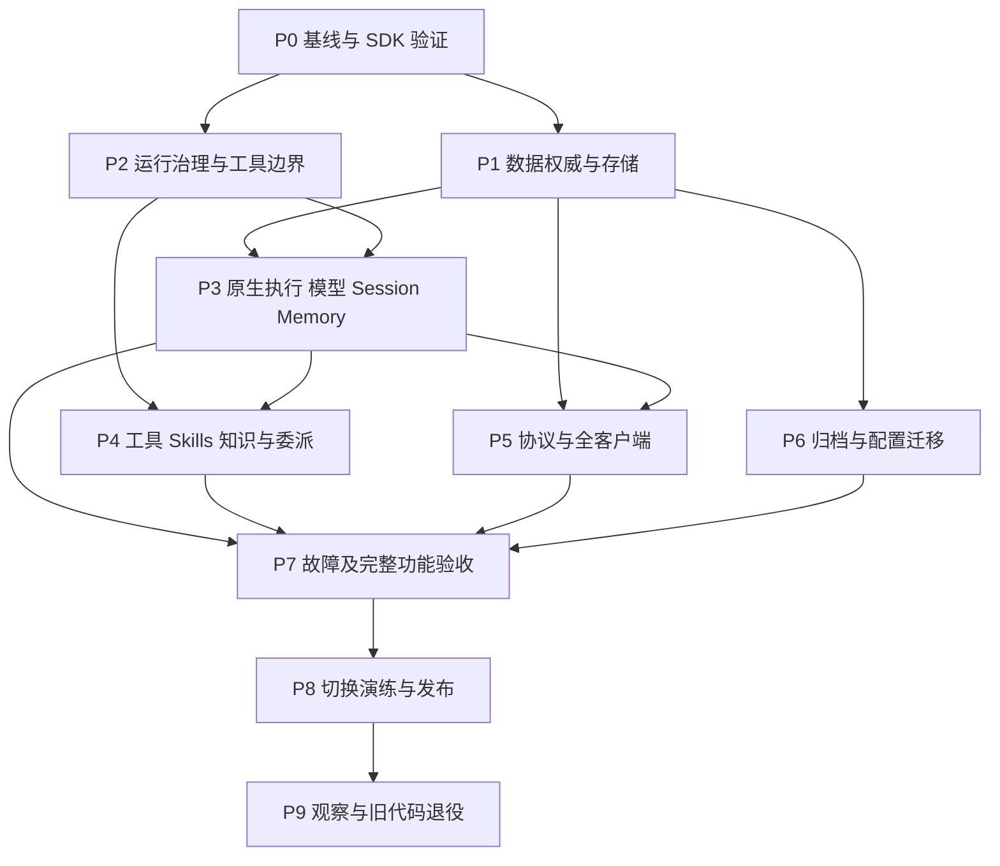

# tRPC Native Agent Migration Implementation Plan

> **For agentic workers:** REQUIRED SUB-SKILL: Use superpowers:subagent-driven-development (recommended) or superpowers:executing-plans to implement this plan task-by-task. Steps use checkbox (`- [ ]`) syntax for tracking.

**Goal:** 全面采用 tRPC 原生 Agent 能力，完整保留业务功能，在旧数据只读归档后一次切换。

**Architecture:** 同仓库建设隔离的新 Agent 子系统；框架执行、模型、会话和记忆采用 tRPC，权限、审批、商业规则和外部副作用治理留在 WeKnora。各数据域有唯一权威，客户端消费版本化业务事件。

**Tech Stack:** Go 1.26.0；当前 trpc-agent-go v1.10.0，目标版本由 P0 验证确定；现有数据库、React/TypeScript 客户端及原生平台。

**Spec:** [已确认规格](../specs/2026-09-19-trpc-native-agent-migration-design.md)，2026-09-19 用户已确认书面版本。

## Global Constraints

- “首版保留现有全部业务功能；验收后通过维护窗口一次切换。”
- “旧会话不恢复执行，也不隐式导入新上下文。”
- “归档不等于删除；未批准任何历史数据、附件或审计记录的清除。”
- “适配器只处理业务边界或原生组件缺失能力，每个适配器记录原因、覆盖测试和可删除条件。”
- “缺少凭据、服务或设备的项目标记 `blocked-env`，不得计为通过；必需项存在阻塞或失败时不得上线。”
- 不执行真实有副作用工具的双引擎对照；不将过期 Worker、回放或模型重试产生的重复动作当作正常行为。
- 所有 React 工作遵守 `frontend.md`，保留现有设计与功能；Mobile 保留原生交互。
- 实施前使用 using-git-worktrees 技能建立隔离工作区，不能覆盖当前 ResourceSettingsPanel、providerLogos 和 assets 改动。
- 本地规格与计划有效；fork 当前禁用 Issues，不再向上游提交迁移记录，不擅自开启仓库功能。

## Review Focus

1. 审批通过后权限被撤销：执行前再次检查；P2 的撤权测试覆盖。
2. 相同用户/会话 ID 出现在不同空间：Session、Memory、归档和事件都不得串读；P1/P3/P6 的冲突身份测试覆盖。
3. 工具成功而进程在结果提交前退出：查询/幂等恢复或 waiting_user；P2/P7 的故障注入覆盖。
4. 流式重放叠加新的模型 attempt：不重复文本、工具操作或计费；P4/P5/P7 覆盖。
5. 停机期间旧客户端重试和新任务开放后的回退：拒绝旧协议、保留副作用与账务记录；P6/P8 覆盖。

## 1. 计划结构与授权边界

迁移包含多个需要独立验收的子系统。本文件是完整依赖、覆盖和交付边界；[P0 可执行计划](2026-09-19-trpc-native-agent-p0.md)给出当前可据代码编写的逐任务步骤。P1–P9 是后续执行计划的工作包定义，不冒充已经确定 SDK 方法与存储实现的可执行代码计划。

SDK 版本、恢复组合和 Session/Memory 存储能力未通过 P0 验证前，不编造其方法签名。P0 交付包括用真实验证结果展开 P1/P2 的逐任务计划；其余工作包在前置接口固定后同样展开并审阅。展开属于本迁移项目，不改变已确认目标；若必须减少功能或改变职责边界，先修订规格。

当前仅写计划；用户审阅本计划并选择执行方式后开始 P0。生产切换不是当前“确认规格”的授权内容，P8 完成可审阅的演练结果后再提交具体发布操作。

## 2. 文件职责地图

下列新增目录是本计划的设计，不是声称仓库已存在。最终任务必须列出精确文件，不用目录通配符代替所有权。

| 范围 | 职责与候选文件 |
| --- | --- |
| `internal/agent/native/`（新增） | `runner.go` 装配、`model.go` Provider 工厂、`tool.go` 受控工具、`session.go` / `memory.go` 范围隔离；禁止复刻旧推理循环 |
| `internal/agent/runtime/`（现有） | `contracts.go`、`tool_executor.go`、`tool_recovery.go`：复用可证明正确的业务契约，修复或拆出必要治理 |
| `internal/application/repository/` | `agent_run*.go` 与新增 native 存储适配，身份、租约、日志与事件可靠性 |
| `internal/application/service/` | `agent_capabilities.go` 业务装配；`agent_run*.go` 准入和恢复；新旧路由只在发布边界切换 |
| `internal/container/agent_runtime.go` | 新执行依赖装配；保持唯一修改者 |
| `internal/handler/session/` | `agent_run.go`、`agent_stream_handler.go` 及新增新协议入口与归档查询 |
| `packages/contracts/src/chat/` | 版本化运行、事件、审批和归档契约 |
| `packages/api-client/src/chat/` | 请求与 SSE 游标、取消、错误处理 |
| `packages/domain/src/chat/` | 框架无关的事件去重、状态转换与 attempt 替换 |
| `apps/web/src/chat/`、其他客户端 | 仅通过共享契约与平台层接入；按 P0 盘点确认实际消费者 |
| `migrations/versioned/` 与其他活跃方言 | 新执行命名空间和归档迁移；迁移编号在执行时从当前最大值分配，避免并行冲突 |
| `docs/superpowers/plans/trpc-native/` | 基线、能力矩阵、接口契约、证据和切换记录 |

## 3. 依赖图与并行条件

- P1/P2 在身份、错误与日志契约审查通过后可并行；契约本身串行修改。
- P4/P5/P6 在各自前置完成后可并行；集成逐个合入，不能在多个工作区同时修改同一入口。
- 共享文件队列：`go.mod/go.sum`、`runtime/contracts.go`、容器装配、路由、共享 TS 导出、迁移编号、CI 配置各有唯一集成人。
- 若选择 Subagent-driven，每个细任务由 scoped implementer 完成，经规格审查与质量审查后集成；审查发现修复后复核，再解锁依赖。工作者获知他人改动存在，不回退他人的工作。
- 并行不是默认无限派发；同一接口未固定时停止下游实现。各任务用独立 worktree/commit，串行集成后跑交叉测试。

## 4. 工作包定义

### P0 — 功能基线、SDK 能力与精确接口

输入：规格、当前代码、当前固定 SDK；输出：功能清单、可复现探针、候选版本结论、缺口与扩展决定、P1/P2 详细计划。执行步骤见独立 P0 计划。没有功能盘点和恢复组合证据时不进入产品替换。

### P1 — 数据权威、隔离与可靠投影

输入：P0 确定的 SDK Service 接口与数据库覆盖表。产物：新执行数据命名空间、范围隔离存储、Session/业务日志协调及可重建 UI 投影。

- [ ] 拆任务：身份编码与冲突测试 → 新表和所有活跃方言 → Session 持久化 → Memory 持久化 → 事件日志和投影修复。
- [ ] 明确每个表的唯一键、空间/用户/会话关联、授权查询条件、生命周期和删除行为；秘密仅保存引用。
- [ ] RED 场景：两个空间相同用户/会话字符串；事件重复写入；检查点已存但 Session 未更新；权限撤销；内存缓存跨请求复用。
- [ ] GREEN 必须支持重启后读取、去重、修复投影，并验证数据库故障时不伪造完成。
- [ ] 验证包：`internal/application/repository`，原生 Service 适配测试；SQLite/PostgreSQL 分别执行，其他活跃方言依 P0 结果加入。
- [ ] 审查：业务历史、Session、检查点和审计各有唯一权威，无双写失配的无处理窗口。

### P2 — Run、审批、预算、工具副作用

输入：固定的身份和存储接口。产物：受控原生工具执行路径与恢复协调契约。

- [ ] 拆任务：准入与幂等 → 租约/fencing → 工具计划与结果日志 → 审批/OAuth 等待 → 预算与用量 → 取消/steer/子任务。
- [ ] RED 场景：审批通过后撤权；过期 Worker 提交；相同请求携带不同工具参数；成功调用后结果写失败；重复决策；预算耗尽后子任务发起调用。
- [ ] 所有工具入口包括原生 MCP 和 Skills 执行均必须经过同一治理边界；以真实调用计数验证拒绝时为零。
- [ ] 为不可查询、非幂等工具保留 waiting_user；恢复不得默认重新执行。取消和断线分离。
- [ ] 用量按 attempt 和外部调用身份去重；平台模型/BYOK 和任务预算沿用业务规则。
- [ ] 验证：`go test -race ./internal/agent/runtime ./internal/application/repository ./internal/application/service -count=1`，并提供真实外部幂等核对证据。

### P3 — 原生 Runner、模型、Session 与 Memory

输入：P1/P2 通过接口；输出：一条完整新会话执行链，不接入生产默认路径。

- [ ] 拆任务：Provider 工厂 → 原生 Runner → 可恢复 Agent 组合 → 上下文压缩 → Memory 开关/删除/召回 → 引导与收尾。
- [ ] 模型工厂复用配置与凭据解析，取消旧 Chat 双向消息转换；保留提供商特殊字段所需扩展并写证明。
- [ ] RED 场景：模型只关闭 channel 未给合法终态；工具调用分片；图片输入；超时；同一 attempt 重放；压缩后工具结果失配；Memory 禁用但后台仍写入。
- [ ] 原生 LLMAgent 能否进入可恢复组合以 P0 报告为准；不允许因选择它而关闭恢复。
- [ ] 验证所有现有 Provider 的配置矩阵和真实调用；确定性 fake 仅证明映射与状态机，不证明提供商兼容。
- [ ] 审查：新链不依赖旧自研推理循环，新消息和 Memory 不读取旧归档。

### P4 — 工具、MCP、Skills、知识与专业委派

输入：新 Runner 和治理接口；输出：P0 全部工具/能力项的新实现映射。

- [ ] 按工具族拆可独立审查任务：知识检索与引用；MCP 发现/调用/OAuth；Skills 加载/授权；Sandbox 文件与长任务；Connector；已有专业 Agent/远程执行器；多 Agent 委派。
- [ ] 每族先写允许、拒绝、失败、取消和恢复测试，再迁移接口与业务装配；不得丢弃旧工具 schema、输出截断、名称碰撞或延迟发现语义。
- [ ] RED 场景：动态工具发现后越权；Skills 版本变化；Sandbox 成功但客户端断线；子任务扩大权限；父任务取消但远端仍运行；检索引用属于其他空间。
- [ ] 真正调用必要服务验证返回结果及副作用，记录授权测试资源。无环境则阻塞该族验收。
- [ ] 审查：每项旧能力有对应新入口；外部执行器不被无故重写为框架内部 Agent。

### P5 — 业务事件与所有现有客户端

输入：版本化事件及命令契约；输出：服务端和各客户端一致的生命周期行为。

- [ ] 串行固定 Go/TS 共享契约：运行、消息、工具、审批、引用、用量、错误、游标失效、attempt 替换、归档只读。
- [ ] 分任务：服务端可靠事件投影 → API client → domain reducer → Web → Desktop/Embed → 实际移动端 → CLI/小程序等 P0 确认消费者。
- [ ] RED 场景：重复序号；旧 attempt 晚到；租户切换时仍收到旧流；权限失效；审批重复点击；游标过期；旧客户端访问新接口。
- [ ] UI 不暴露 SDK 内部事件；服务端先可靠落库再对外发布可恢复事件。不能沿用当前吞掉 AppendEvent 错误的行为宣称可靠性。
- [ ] 校验真实存在脚本：`pnpm typecheck:web`、`pnpm test:web`、`pnpm build:web`、`pnpm typecheck:desktop`、`pnpm test:desktop`、`pnpm test:embed`；移动端按 P0 的实际 package 脚本执行。
- [ ] 桌面 renderer build 不等于 Wails 运行；移动 typecheck/export/native compile/device launch 分别记证据。

### P6 — 只读归档与业务配置迁移

输入：新存储和归档契约；输出：可重入迁移工具、校验报告和受权归档查询。

- [ ] 拆任务：归档清单与附件保护 → 只读 API → 配置迁移 → 前后数量/关系/权限校验 → 断点与重复执行 → 恢复演练。
- [ ] RED 场景：同 ID 新旧冲突；归档成员资格撤销；附件失效；迁移中断；重复执行重复配置；密钥泄漏到报告；删除旧表导致文件清理。
- [ ] 迁移只能针对用户指定或隔离测试数据库，带 dry-run；报告记录总量、关联、错误与校验摘要，敏感值脱敏。
- [ ] 归档旧 Memory 和检查点但不转入新执行；已有业务删除/保留规则继续生效。
- [ ] 审查：迁移不删除商业与知识业务数据；恢复步骤经过实际执行验证。

### P7 — 全链路与故障验收

输入：P3–P6 已集成；输出：逐项证据清单和零未解释功能缺口。

- [ ] 重用现有 `internal/agent/recoverytest/` 的故障框架，适配新路径；模型请求、工具执行前后、日志/检查点/Session 提交间隙全部插入崩溃点。
- [ ] SQLite/PostgreSQL 进程级 SIGKILL；租约争抢、重复决策、真实 Provider、Sandbox 与 Connector 外部状态核对。
- [ ] 运行审查重点五类场景及跨模块测试：重连时撤权、父子任务预算、SDK 升级后旧新快照拒绝策略。
- [ ] CI 必需外部能力缺失时显式阻断发布；现有 recovery workflow 会报告 provider 缺失并跳过，需新增发布验收门禁，不能把该 workflow 的绿色视为全链通过。
- [ ] 每个客户端保存真实操作证据；性能采集首 token、完成时间、流式吞吐、恢复耗时和数据库压力，与固定基线比较，阈值在负载测试前审定。
- [ ] 全分支独立审查通过后方可进入切换演练。

### P8 — 切换演练与具体发布

输入：全部必需验收通过；输出：演练报告、明确发布清单、回退条件和执行记录。

- [ ] 在隔离生产等价环境执行停止准入 → 排空/取消 → 未知结果核对 → 备份 → 归档与配置迁移 → 新版本部署 → 冒烟 → 开放任务。
- [ ] 测试旧客户端重试不会建立旧运行；数据库恢复不掩盖外部副作用及收费。
- [ ] 演练两种回退：开放新任务前直接恢复；开放后先冻结、核对新任务与副作用，再修复或回退。
- [ ] 发布包固定版本、目标环境、维护时段、备份标识、验收结果、观察时长和回退阈值，交用户批准实际生产动作。
- [ ] 有 blocked-env、未解外部结果或不兼容客户端未处理时不发布。

### P9 — 观察与旧代码退役

输入：P8 发布通过并达到事先固定的观察指标；输出：新原生链唯一执行入口，旧历史仍可查询。

- [ ] 按消费者依赖清单删除旧执行循环、旧 runtime 分支和无消费者的适配器；共享非 Agent 模型代码仅在消费者全部迁移后删除。
- [ ] 删除前后跑功能、恢复和客户端回归，扫描生产 wiring 无旧回退入口；禁止只查字符串证明删除正确。
- [ ] 保留归档读取、权限与附件访问，以及备份和审计材料。
- [ ] 更新运维文档、架构决策与台账；记录残留适配器的理由和删除条件，执行最后全分支审查。

## 5. 通用任务闭环与证据

每个展开后的代码任务必须包含：精确文件所有权、已固定接口签名、完整的最小失败测试、RED 命令与失败原因、最小实现步骤、GREEN 与相关回归、规格与质量审查、修复复核、限定文件 commit、证据记录。文档盘点任务用内容与覆盖审查，不制造伪 RED 测试。

台账路径：`docs/superpowers/plans/trpc-native/progress.md`。每行字段：阶段/任务、依赖、owner、commit、实现状态、规格审查、质量审查、验证层级、命令、日志路径、环境、缺口。状态使用 pending / running / review / passed / blocked-env / blocked-design；没有审查与证据不能填 passed。

提交仅 stage 自己负责文件。不使用 `git add .`，不回退用户工作。临时探针数据库和凭据不提交。

## 6. 规格覆盖与自审结论

| 规格章节 | 交付位置 |
| --- | --- |
| 1–3 目标、证据、职责 | P0、全局约束、文件地图 |
| 4 模块替换 | P3/P4/P5 |
| 5 数据权威与执行流程 | P1/P2/P3 |
| 6 失败与业务治理 | P2/P5/P7 |
| 7 SDK 能力门槛 | P0 |
| 8 归档切换 | P6/P8/P9 |
| 9 功能与验收 | P0 清单、P7 全链证据 |
| 10 交付与下一步 | 依赖图、阶段展开与审查 |

自审：所有规格章节有责任工作包；版本相关代码仅在 P0 计划中使用当前核对过的 API；没有声称后续精确实现计划已完成。项目执行方式尚待用户选择，当前没有迁移实现或运行验收结果。
