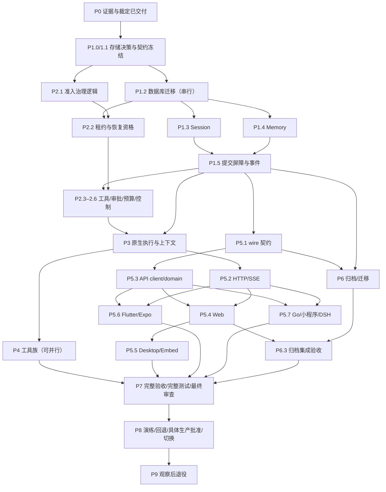
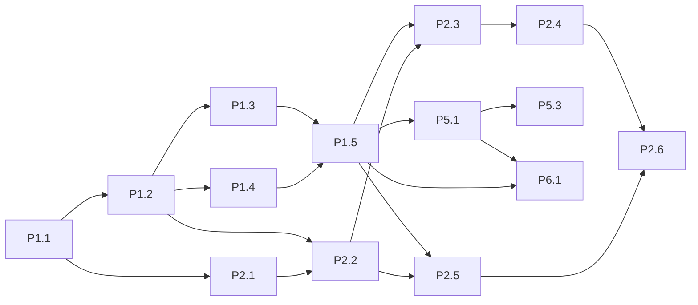

# tRPC Native Agent P1–P9 Detailed Implementation Plan

> **For agentic workers:** REQUIRED SUB-SKILL: Use superpowers:subagent-driven-development (recommended) or superpowers:executing-plans to implement this plan task-by-task. Steps use checkbox (`- [ ]`) syntax for tracking.

**Goal:** 将已确认迁移规格展开为 P1–P9 共 40 个可审查任务，给出依赖 DAG、并行 Track、文件归属和完整验收顺序。

**Architecture:** 同仓库隔离建设原生 Agent 执行链，框架负责推理与 Agent 组合，WeKnora 保留身份、审批、预算、外部副作用与商业治理。先完成存储/接口门槛，再按稳定契约并行开发，主代理串行集成并执行完整测试。

**Tech Stack:** Go 1.26.0；当前根 trpc-agent-go v1.11.0 候选；SQLite/PostgreSQL 与经确认的其他活跃数据库；React/TypeScript/pnpm、Flutter、Expo、Wails、Taro、Go client/CLI 与 DSH。

**Spec:** [迁移规格](../specs/2026-09-19-trpc-native-agent-migration-design.md)、[总计划](2026-09-19-trpc-native-agent-migration.md)、[P0 计划](2026-09-19-trpc-native-agent-p0.md)。三者定义目标，本计划细化后续任务，不削减其要求。

## Global Constraints

- “首版保留现有全部业务功能；验收后通过维护窗口一次切换。”
- “旧会话不恢复执行，也不隐式导入新上下文。”
- “归档不等于删除；未批准任何历史数据、附件或审计记录的清除。”
- “适配器只处理业务边界或原生组件缺失能力，每个适配器记录原因、覆盖测试和可删除条件。”
- “缺少凭据、服务或设备的项目标记 `blocked-env`，不得计为通过；必需项存在阻塞或失败时不得上线。”
- 不拆分独立 Agent 服务；不双执行真实副作用。身份与权限来自服务端；秘密仅保存引用。
- P0 NO-GO 仍有效。此文件是受前置门槛约束的详细实施方案，不是已选定数据库/SDK 组合的声明；门槛未关闭时只执行证据、契约和隔离探针任务。
- 每项代码任务按 RED → GREEN → 回归 → 需求/质量审查 → 修复复核 → 限定文件提交；不得将计划内代码示例当作已执行证据。
- 并行执行最多 4 Track；一 Track 一 branch/worktree，一 worktree 最多一 implementer；同一文件不得由两个 agent 修改。
- 详细依赖、共享文件队列、完整测试、证据格式见 [总索引与 DAG](2026-09-19-trpc-native-agent-p1-p9-detailed.md)。

## Review Focus

1. 同名跨空间及撤权：P1.1/P1.3/P1.4、P2.4、P5.2、P6.1。
2. 工具成功后丢失结果提交：P1.5、P2.3、P3.3、P7.1，未知非幂等动作不得重放。
3. Session/事件写失败而任务继续：P1.5、P3.2、P5.2、P7.1，成功必须经过 durable barrier。
4. 新 attempt 与断线重放叠加：P2.5、P5.1/P5.3、P7.1，文本、工具、用量各自去重。
5. 迁移/回退期间旧客户端与外部副作用：P6.2/P6.3、P8.1/P8.2，恢复数据库不能撤销外部动作。

---

## 1. 状态、证据与本轮范围

本轮由主代理直接编写与自审，不使用子代理编写；没有修改产品代码、运行迁移、执行计划中的验收或切换生产。

当前仓库已存在 P0/P1 探针和证据。其 [P0 裁定](trpc-native/p0-decision.md)仍是 **NO-GO**：当前 v1.11.0 通过 bounded repeated race slice，不等于完整产品组合通过；Session 稳定 ID/hash、Memory 删除后旧抽取复活、持久化协调与直接消费者失败仍需解决。已合入探针不是产品 P1 完成。后续执行须重新验证当前 SHA，不能直接复用历史 worktree 报告。

原 P0 文档禁止在 backend 尚未选择时编造可执行存储 API。本次按用户要求展开全部阶段，但保持条件化：P1.0 先完成真实版本/存储/事务决策；涉及尚未选择 SDK 构造器、DDL 的任务，在决策落定后将精确源码签名/迁移 SQL 补入其实现审查材料，再执行。这里没有把草案接口或命令示例当成当前已存在的 API。已固定的业务类型完整来源为 [interfaces.md](trpc-native/interfaces.md)。

门槛拆成三层，不能互相替代：

| 门槛 | 允许工作 | 仍禁止的动作 |
| --- | --- | --- |
| 当前 NO-GO | 文档、现有问题修复、独立 SDK/数据库探针、接口核对 | 产品代码构造/dispatch native Runner，包括 feature flag 后面 |
| 存储/契约批准 | 已批准范围内的 P1/P2 存储/治理实现与隔离验证 | 未满足原 P0 产品运行条件时接线 Runner |
| 产品执行组合批准 | 隔离产品集成、P3–P7 实测 | 未完成全链验收/演练/具体生产批准时切换线上 |

**避免循环依赖：** P0 产品运行要求的行为证据先在独立 probe/harness 中建立，然后独立审查更新 gate；不能写成“先开产品 Runner 才能证明可以开”。P7 是最终 integrated SHA 的全量复验，不是解除 P1.0 的唯一办法。如果某要求只能通过改变规格满足，保持 blocked-design 并提交明确差异，不降级恢复或权限。

## 2. 九份子计划

| 阶段 | 详细计划 | 任务数 | 可交付结果 |
| --- | --- | --- | --- |
| P1 | [数据权威、存储与可靠投影](2026-09-19-trpc-native-agent-p1-detailed.md) | 6 | 建立范围隔离的新 Session/Memory 存储和六间隙提交屏障。 |
| P2 | [运行治理、审批、预算与副作用](2026-09-19-trpc-native-agent-p2-detailed.md) | 6 | 使原生执行每次模型/工具/子任务调用遵循原有业务治理。 |
| P3 | [原生 Runner、模型、上下文与恢复](2026-09-19-trpc-native-agent-p3-detailed.md) | 4 | 建立保留业务能力且可恢复的原生执行链。 |
| P4 | [工具、MCP、Skills、知识与委派](2026-09-19-trpc-native-agent-p4-detailed.md) | 6 | 迁移现有全部工具族并保持统一治理边界。 |
| P5 | [版本化协议与全部客户端](2026-09-19-trpc-native-agent-p5-detailed.md) | 7 | 使所有现有端使用同一可靠业务协议。 |
| P6 | [历史只读归档与业务配置迁移](2026-09-19-trpc-native-agent-p6-detailed.md) | 3 | 保留全部历史查询和业务配置，使新执行数据从零开始。 |
| P7 | [故障、全功能、性能与集成验收](2026-09-19-trpc-native-agent-p7-detailed.md) | 3 | 提供逐功能、逐环境可核对的完整验收证据。 |
| P8 | [切换演练、回退与具体发布](2026-09-19-trpc-native-agent-p8-detailed.md) | 3 | 交付演练过的一次切换流程及经批准的生产执行记录。 |
| P9 | [观察与旧执行代码退役](2026-09-19-trpc-native-agent-p9-detailed.md) | 2 | 在观察门槛通过后保留唯一原生执行入口与完整历史查询。 |

每个任务包含文件、输入/输出契约、具体 RED 场景、最小规则/SQL/操作、GREEN 命令、审查与限定提交。大型平台任务 P5.6/P5.7 内再按明确文件集合拆 Track；它们全部完成才算父任务完成。代码样例是实现约束，不声称已编译；真实 API 和测试 fixture 必须在自己的任务中实现并经编译/行为测试证明。

## 3. 阶段 DAG

此图比原阶段图更细：P5.1/P5.3 可在 P3 完成前准备契约和纯领域逻辑，但不宣称全客户端已验收；P6 的后台部分无需等待 P3，集成验收等待 Web。不存在 P4/P5/P6 全阶段无条件同时启动的授权。

## 4. 任务级 DAG（调度权威）

机器可读版本：[dag.json](trpc-native/p1-p9-dag.json)。下面每个前置节点全部 passed/reviewed/integrated 后才 ready；唯一外部前置 P0 指“证据与裁定已交付并审阅”，不要求其产品结论已经 GO，所以当前可以启动 P1.0 的门槛关闭工作。产品执行门槛规则仍同时生效，不能只拓扑排序就解锁运行。

| Task | 直接依赖 | 并行条件 |
| --- | --- | --- |
| P1.0 | P0 | 前置完成、无文件冲突、持有自己的 worktree；共享入口排队 |
| P1.1 | P1.0 | 前置完成、无文件冲突、持有自己的 worktree；共享入口排队 |
| P1.2 | P1.1 | 前置完成、无文件冲突、持有自己的 worktree；共享入口排队 |
| P1.3 | P1.2 | 前置完成、无文件冲突、持有自己的 worktree；共享入口排队 |
| P1.4 | P1.2 | 前置完成、无文件冲突、持有自己的 worktree；共享入口排队 |
| P1.5 | P1.3, P1.4 | 前置完成、无文件冲突、持有自己的 worktree；共享入口排队 |
| P2.1 | P1.1 | 前置完成、无文件冲突、持有自己的 worktree；共享入口排队 |
| P2.2 | P2.1, P1.2 | 前置完成、无文件冲突、持有自己的 worktree；共享入口排队 |
| P2.3 | P2.2, P1.5 | 前置完成、无文件冲突、持有自己的 worktree；共享入口排队 |
| P2.4 | P2.3 | 前置完成、无文件冲突、持有自己的 worktree；共享入口排队 |
| P2.5 | P2.2, P1.5 | 前置完成、无文件冲突、持有自己的 worktree；共享入口排队 |
| P2.6 | P2.4, P2.5 | 前置完成、无文件冲突、持有自己的 worktree；共享入口排队 |
| P3.1 | P1.5, P2.5 | 前置完成、无文件冲突、持有自己的 worktree；共享入口排队 |
| P3.2 | P3.1, P2.6 | 前置完成、无文件冲突、持有自己的 worktree；共享入口排队 |
| P3.3 | P3.2 | 前置完成、无文件冲突、持有自己的 worktree；共享入口排队 |
| P3.4 | P3.3, P1.4 | 前置完成、无文件冲突、持有自己的 worktree；共享入口排队 |
| P4.1 | P3.4, P2.3 | 前置完成、无文件冲突、持有自己的 worktree；共享入口排队 |
| P4.2 | P3.4, P2.4 | 前置完成、无文件冲突、持有自己的 worktree；共享入口排队 |
| P4.3 | P3.4, P2.3 | 前置完成、无文件冲突、持有自己的 worktree；共享入口排队 |
| P4.4 | P3.4, P2.4 | 前置完成、无文件冲突、持有自己的 worktree；共享入口排队 |
| P4.5 | P3.4, P2.6 | 前置完成、无文件冲突、持有自己的 worktree；共享入口排队 |
| P4.6 | P4.1, P4.2, P4.3, P4.4, P4.5 | 前置完成、无文件冲突、持有自己的 worktree；共享入口排队 |
| P5.1 | P1.1, P1.5 | 前置完成、无文件冲突、持有自己的 worktree；共享入口排队 |
| P5.2 | P5.1, P3.4, P2.6 | 前置完成、无文件冲突、持有自己的 worktree；共享入口排队 |
| P5.3 | P5.1 | 前置完成、无文件冲突、持有自己的 worktree；共享入口排队 |
| P5.4 | P5.2, P5.3 | 前置完成、无文件冲突、持有自己的 worktree；共享入口排队 |
| P5.5 | P5.4 | 前置完成、无文件冲突、持有自己的 worktree；共享入口排队 |
| P5.6 | P5.2, P5.3 | 前置完成、无文件冲突、持有自己的 worktree；共享入口排队 |
| P5.7 | P5.2, P5.3 | 前置完成、无文件冲突、持有自己的 worktree；共享入口排队 |
| P6.1 | P1.5, P5.1 | 前置完成、无文件冲突、持有自己的 worktree；共享入口排队 |
| P6.2 | P6.1 | 前置完成、无文件冲突、持有自己的 worktree；共享入口排队 |
| P6.3 | P6.2, P5.4 | 前置完成、无文件冲突、持有自己的 worktree；共享入口排队 |
| P7.1 | P3.4, P4.6, P5.7, P5.6, P5.5, P6.3 | 前置完成、无文件冲突、持有自己的 worktree；共享入口排队 |
| P7.2 | P7.1 | 前置完成、无文件冲突、持有自己的 worktree；共享入口排队 |
| P7.3 | P7.2 | 前置完成、无文件冲突、持有自己的 worktree；共享入口排队 |
| P8.1 | P7.3 | 前置完成、无文件冲突、持有自己的 worktree；共享入口排队 |
| P8.2 | P8.1 | 前置完成、无文件冲突、持有自己的 worktree；共享入口排队 |
| P8.3 | P8.2 | 前置完成、无文件冲突、持有自己的 worktree；共享入口排队 |
| P9.1 | P8.3 | 前置完成、无文件冲突、持有自己的 worktree；共享入口排队 |
| P9.2 | P9.1 | 前置完成、无文件冲突、持有自己的 worktree；共享入口排队 |

任务级关键并行段：

P4.1/P4.2/P4.3/P4.4/P4.5 前置满足后可并行，但上限 4：先派 4 个，第一个完成且释放槽位后再派第 5 个；P4.6 必须最后串行注册。P5.5 等待 Web 完成，因为 Desktop 复用 Web。P5.6F/P5.6E 与 P5.7G/P5.7M/P5.7D 可按剩余槽位并行，禁止任意修改共享 wire/reducer。

## 5. Track、分支与文件所有权

执行时使用 using-git-worktrees，从最新已审查集成点创建新工作区，不重用历史探针 worktree 作为未经核对的产品分支。分支前缀 `codex/`；路径示例为 `$CODEX_HOME/worktrees/trpc-native-<track>/WeKnora-fork01`。不要修改 CODEX_HOME 值。每个 Track 启动记录真实路径、branch、base SHA、dirty 状态和测试范围。

| Track | Branch | 所有权 | 不能改 |
| --- | --- | --- | --- |
| contract/schema | codex/trpc-native-contract | P1.0–P1.2 精确文件、nativecontract、迁移 manifest | 工具族/客户端实现 |
| session | codex/trpc-native-session | P1.3 的四个文件 | Memory、共享契约/迁移 |
| memory | codex/trpc-native-memory | P1.4 的四个文件 | Session、共享契约/迁移 |
| commit-events | codex/trpc-native-commit-events | P1.5 文件 | container、routes |
| governance | codex/trpc-native-governance | P2 新 service/repository 文件及 native/tool.go | P1 文件和旧 runtime/contracts.go |
| core | codex/trpc-native-core | P3 明列文件 | 工具族/容器共享文件 |
| knowledge / mcp / skills-sandbox / connector-specialist / delegate | codex/trpc-native-tools-各族名 | P4.1–P4.5 各自文件 | registry/container/native_tool_registry |
| wire-domain | codex/trpc-native-wire | P5.1/P5.3 文件与自身 package exports | 各端页面 |
| server-protocol | codex/trpc-native-protocol | P5.2 新 handler/routes 文件 | router 总入口/归档路由 |
| web | codex/trpc-native-web | P5.4 | Desktop/Embed/mobile |
| desktop-embed | codex/trpc-native-desktop-embed | P5.5 | Web 页面 |
| flutter / expo | codex/trpc-native-flutter、codex/trpc-native-expo | P5.6F/P5.6E 各自 app | 另一移动端与共享包 |
| go-client / miniprogram / dsh | codex/trpc-native-go-client、codex/trpc-native-miniprogram、codex/trpc-native-dsh | P5.7G/M/D 各自目录内明列文件 | 公共协议/reducer |
| archive | codex/trpc-native-archive | P6 明列文件 | Native Session、商业/知识原表 |
| acceptance / operations / retirement | codex/trpc-native-acceptance、codex/trpc-native-operations、codex/trpc-native-retirement | P7/P8/P9；阶段之间串行 | 未审定的产品实现或数据删除 |

“拥有目录”不授权任意改动。每次派发必须复制子计划 Files 的精确集合；发现需要改额外文件，先在 manifest 调整所有权、停止冲突写者，再派发。新增构造器/测试 fixture 放到 owner 独占文件，不能让各 Track 共同维护一个 test helper。

共享文件队列由主代理管理，具体变更只交一个 integration implementer：

- `go.mod/go.sum`、各客户端 lockfile：同一依赖文件只允许一个 owner；工具族不自行升级 SDK。
- `internal/agent/nativecontract/contracts.go`、旧 `runtime/contracts.go`：契约冻结后修改必须先重新审查并通知全部消费者。
- `internal/container/agent_runtime.go`、router 注册总入口：P4.6、P5 接线与 P9 按顺序占用。
- 数据库 migration 编号与 runner 清单：串行分配，不能并行建有依赖 migration。
- root `package.json` 与共享导出、i18n 公共文件、CI：唯一 owner；客户端提交修改请求而非同时编辑。
- 功能清单与 progress 台账：各 Track 交独立证据文件，主代理汇总，避免多人改同一表。

主代理负责拆分、派发、收集、审查调度、串行集成和完整测试，不直接代替未来实现 Track。用户本轮明确要求不使用子代理编写计划，所以本轮文档由主代理完成，不触发未来实现派发。

## 6. 并行执行与集成规程

1. 先审阅本计划。当前只交付计划，不自动开始产品实施或创建实施 worktree。
2. 执行时按用户既定 using-git-worktrees → dispatching-parallel-agents 方式；每 Track 独立 branch/worktree/context/test scope，最大并行 4。
3. 按 AGENTS.md 读取角色配置：实现/修复 sdd_implementer；任务审查 sdd_task_reviewer；最终审查 sdd_final_reviewer。记录请求 model、effort、agent ID；不可观察的实际模型写“未验证”。实现/审查代理不得再派子代理。
4. 每任务 RED/GREEN/相关回归后独立需求/质量审查；一个 reviewer 可审同任务两轴，但必须分别给结论。修复由原 owner，复核通过后才允许集成。
5. 主代理先核对 diff 文件集合、测试证据与基础 SHA，再按拓扑顺序串行 cherry-pick/merge；禁止以“无冲突”代替兼容性测试。
6. 每轮集成做交叉模块测试；所有 Track 合入后执行完整测试和全分支最终审查。测试/审查未完成时不得标项目完成。
7. 环境缺失继续独立工作，但对应必需项保持 blocked-env；基线失败不自动豁免发布门禁。
8. 提交只包含自己的文件，不 stage 用户/其他任务改动。本轮发现的其他 Flutter 认证文件属于并行工作，不属于本计划。

## 7. 完整测试矩阵

所有命令均在执行阶段运行并记录 cwd。根 `go test ./...` 不包括独立 Go module；root mobile pnpm script 不代表 Flutter。命令不存在/无测试时必须纠正测试入口，不能记 pass。

| cwd | 必需命令/验证 |
| --- | --- |
| 根 | P7.3 中完整 Go tests + race；shared/web/desktop/embed 的 test/typecheck/build；原生 recovery JSON 检查 |
| tools/trpc-native-p1/sessionprobe | `GOWORK=off go test ./... -count=1`、`go test -race ./... -count=20`、`go vet ./...`；隔离 PG DSN；opt-in contract 不得跳过 |
| tools/trpc-native-p1/memoryprobe | 同上；`P1_REQUIRE_CONTRACT=1` 运行 stale extraction 契约；原生 backend 的已知 RED 仍记 incompatible，不能篡改探针；选定受控适配器必须通过对应 GREEN 契约 |
| tools/trpc-native-p1/identityprobe | 单元、race、vet |
| client | `GOWORK=off go test ./... -count=1` |
| cli | `GOWORK=off go test ./... -count=1`，独立 module |
| apps/mobile | `flutter analyze`、`flutter test`；随后 iOS/Android 编译与设备操作 |
| apps/mobile-next | `npm run typecheck`、`npm test -- --runInBand`、`npm run check:isolation`；iOS/Android 原生编译、设备 |
| apps/miniprogram | `pnpm test`、`pnpm typecheck`、`pnpm build:weapp`；开发者工具和实际设备 |
| packages/dsh-weknora | `npm test`（含 build）；真实 harness |
| 数据库 | SQLite/PostgreSQL 与 P1.0 确认的全部其他活跃方言：迁移、重开、并发、故障恢复 |
| 外部服务 | 每个 Provider、MCP/OAuth、Sandbox、Connector、专业执行器、商业账户的真实授权测试 |
| 客户端 | Web 浏览器、Wails 运行、Embed 宿主、Flutter/Expo 设备、Go CLI、小程序、DSH；聊天/工具/审批/取消/重连 |
| 发布 | 全流程演练、开放前后回退、备份恢复；具体生产动作单独批准 |

每条记录 commit、命令、exit code、执行/skip 数、环境与脱敏日志。证据不得包含 token/密钥或用户消息原文。P7 acceptance 校验同时核对命令成功、场景实际运行和证据 SHA，文件存在性本身不够。

## 8. 规格覆盖与自审

| 规格要求 | 责任任务 |
| --- | --- |
| §1 全功能保留、一次切换、新状态从零 | P4.6/P5 全端、P6、P8 |
| §2 静态/真实证据区分 | P1.0、P7.1–P7.3 |
| §3 框架/业务边界、无独立 Agent 服务 | P2、P3、P4.6、P9.2 |
| §4 模型、上下文、工具、MCP、Skills、知识、Sandbox、专业/多 Agent、客户端 | P3.1–P3.4、P4.1–P4.6、P5.1–P5.7 |
| §5 唯一权威与六间隙 | P1.2–P1.5、P2.3/P2.5、P3.3、P7.1 |
| §6 fence/决策/未知结果/cancel/attempt/cursor/预算/retry | P2 全部、P3.1–P3.3、P5.2/P5.3 |
| §7 SDK 固定版本与能力门槛 | P1.0，保留 P0 原裁定 |
| §8 归档/配置/权限/附件/回退 | P6 全部、P8 全部、P9.2 |
| §9 全功能/全端/真实环境/证据层级 | P7.1–P7.3 |
| §10 依赖、并行与交接 | 本索引、机器 DAG、子计划、台账 |

自审重点：门槛不循环；所有任务 ID 唯一且前置可解析；Session/Memory 不建立双重权威；业务接口以 interfaces.md 为单一源；schema 数字/SDK 构造器不凭空固定；Review Focus 有任务负责；后续真实环境/发布结果没有写成已通过。未确定的 backend 和发布环境属于明确前置任务产物，不能靠默认值跳过。

## 9. 交接

审阅顺序：本索引 → P1/P2（存储与治理边界）→ P3/P4 → P5/P6 → P7/P8/P9。确认计划后沿用用户已指定的 worktree、并行 Track、任务测试/审查、主代理集成、完整测试流程。生产切换仍由 P8.3 提交具体发布包后取得批准。
