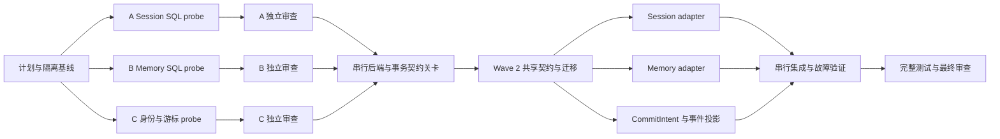

# tRPC Native P1 Storage — Parallel Tracks Implementation Plan

> **For agentic workers:** REQUIRED SUB-SKILL: Use superpowers:subagent-driven-development (recommended) or superpowers:executing-plans to implement this plan task-by-task. Steps use checkbox (`- [ ]`) syntax for tracking.

**Goal:** 为新 Agent 建立经过验证的身份隔离、Session/Memory 持久化与可修复投影边界；先完成阻塞 P1 的真实 SQL 后端证据，再允许产品存储实现。

**Architecture:** 当前第一波是三个独立、无产品接线的验证 Track。Session 和 Memory 使用精确 v1.11.0 root/submodule 组合，在隔离 SQLite 文件与 PostgreSQL schema 中实测；身份 Track 独立验证 P0 的编码契约。只有这些证据经过 Track review 和串行集成，才冻结产品事务、迁移与适配接口；所有未通过项保持阻塞，不能把探针视为 P1 产品交付。

**Tech Stack:** Go、tRPC-Agent-Go v1.11.0、database/sql、SQLite、PostgreSQL、现有 Go testing/testify；三个嵌套 Go module 不改根依赖。

**Spec:** `docs/superpowers/specs/2026-09-19-trpc-native-agent-migration-design.md`；父计划 `docs/superpowers/plans/2026-09-19-trpc-native-agent-migration.md` §P1；P0 `docs/superpowers/plans/trpc-native/interfaces.md` §§2/5/7。

## Global Constraints

- “新会话执行历史 | Session Service；面向 UI 的读模型是可重建投影，不独立维护第二份可写历史”
- “新长期记忆 | Memory Service；不承担审计或任务恢复”
- “旧数据归档查询；新会话、执行状态、长期记忆与检查点从零开始。”
- “Session 历史与事件投影通过稳定事件身份去重并可修复。”
- “缺少凭据、服务或设备的项目标记 `blocked-env`，不得计为通过；必需项存在阻塞或失败时不得上线。”
- 本计划以 repair HEAD `c4882bca3972f130b72e4fc22d2d4e15483ef7da` 为执行基线。其 v1.11.0 in-memory race GREEN 不是 SQL backend approval。
- 不修改旧执行、生产容器、root go.mod/go.sum、现有迁移及 P0 权威文件。生产 Runner 仍 NO-GO。
- 用户已明确要求先计划后并行执行；不重复询问执行方式。相互依赖的工作只能在串行关卡通过后派发。
- 每个 Track 一个独立 `codex/` branch/worktree，同时最多一个 implementer；文件所有权不重叠；最多四个并行 Track。
- 所有实现/修复使用 sdd_implementer（gpt-5.6-terra/medium），任务审查使用 sdd_task_reviewer（gpt-5.6-sol/medium），整体审查使用 sdd_final_reviewer（gpt-5.6-sol/high）。派发前核对角色配置，实际模型不可观察时写“未验证”。

## Review Focus

1. 两空间使用相同 owner/session/subject：数据库 create/get/list/delete/reopen 不串读；A/B/C 均有冲突身份测试。
2. 同 event ID 重放但内容改变：同内容不新增，异内容不得返回幂等成功；A 必须分别验证持久记录与当前 Session 内存对象。
3. Append 返回时数据库仍未持久或写失败：必须明确返回错误；A 用关闭连接/取消 context 检测，不能将内存 Events 增长视为成功。
4. Memory clear/disable 之后旧 extraction job 回写：必须由 generation/tombstone 阻止；B 记录原生服务是否提供此能力，缺少即 extension-required，不能靠先检查开关代替提交时 CAS。
5. SDK Close 关闭共享连接、分页选项忽略、主库方言误判：A/B 测试连接所有权/分页，集成只认可实际支持的 PostgreSQL/SQLite；MySQL retrieval 不当作主库支持。

---

## 0. P0 gate 与执行波次

P0 decision 当前明确禁止在后端未选择时直接开始产品 P1/P2。用户本次授权规划和并行执行，并未取消“必须以真实接口和证据决策”的规格要求。因此先实施 **Wave 1 prerequisite tracks**。这是为解除门禁开展的可执行验证，不把 draft nativecontract 复制成产品接口。

Wave 1 之后必须产生判定：
- `PASS`：该具体测试行为通过；不外推其他行为。
- `incompatible`：精确固定原生组合不能满足契约，附实际失败和最小扩展要求。
- `blocked-env`：数据库/授权测试资源缺失。
- `source-only`：尚无实际行为测试。

出现真实的存储屏障/隔离/幂等缺口时，Wave 2 不能凭猜测继续。控制器保存完整缺口与下一轮设计输入；最终报告 P1 未完成。允许记录不兼容行为的 characterization 测试，但必须与 contract acceptance 测试分开，不能将“证明不兼容的测试绿”列为契约通过。

### DAG



Wave 2 的三个模块仅在 G/S 通过且方法签名/表结构审查冻结后可并行；本文件的后续交付表是验收分解，不冒充尚未经验证的 SDK 实现代码步骤。

## 1. 文件职责与所有权

| Owner | 仅允许修改 | 职责 |
| --- | --- | --- |
| Controller | 本计划、`docs/superpowers/plans/trpc-native/p1-progress.md` | 依赖、派发、关卡、集成与证据，不实现 Track 代码 |
| A | `tools/trpc-native-p1/sessionprobe/`、`docs/superpowers/plans/trpc-native/p1-session-evidence.md` | 独立 module，Session SQLite/PostgreSQL 探针 |
| B | `tools/trpc-native-p1/memoryprobe/`、`docs/superpowers/plans/trpc-native/p1-memory-evidence.md` | 独立 module，Memory SQLite/PostgreSQL 探针 |
| C | `tools/trpc-native-p1/identityprobe/`、`docs/superpowers/plans/trpc-native/p1-identity-evidence.md` | 无数据库授权声称的身份/游标协议测试 |

各 module 包含 `go.mod`、`go.sum`、`README.md`、实际 `*_test.go`；可拆小测试文件，但不触碰其他目录。module 路径分别为 `github.com/Tencent/WeKnora/tools/trpc-native-p1/sessionprobe`、`.../memoryprobe`、`.../identityprobe`。默认 `GOWORK=off`，禁止本地绝对 replace。证据逐条含 command、exit code、actual behavior、acceptance classification、SDK/config、环境和限制。

## Track A / Task 1 — Session SQL backend verification

**Files:** Create `tools/trpc-native-p1/sessionprobe/{go.mod,go.sum,README.md,session_test.go}`; Create `docs/superpowers/plans/trpc-native/p1-session-evidence.md`。

**Interfaces:**
- Consumes: `session.Service` from root v1.11.0; SQLite `NewService(*sql.DB, ...ServiceOpt) (*Service,error)`; PostgreSQL `NewService(...ServiceOpt) (*Service,error)`。
- Produces: evidence only; neither `session.Service` nor any probe helper is wired into application container.
- Session methods under test: `CreateSession(ctx,key,state,...Option)`、`GetSession(ctx,key,...Option)`、`ListSessions(ctx,userKey,...Option)`、`AppendEvent(ctx,*Session,*event.Event,...Option)`、`UpdateSessionState`、`DeleteSession`、`Close`。
- DB fixture signature: `openBackend(t *testing.T, backend string) (session.Service, func() session.Service)`；second function closes/reopens **same durable database**. All fixture identifiers generated per test.

- [ ] **Step 1 — Pin standalone test module.** Require root、session/sqlite、session/postgres exactly `v1.11.0` and use source-confirmed options. Record `go list -m all` and `go mod download -json` sums; resolve only test dependencies in this module.
- [ ] **Step 2 — Write scope/restart failure assertions.** Test body:
```go
ctx := context.Background()
a := session.Key{AppName: "weknora/native-v1/tenant/1", UserID: "owner/dQ", SessionID: "session/cw"}
b := a
b.AppName = "weknora/native-v1/tenant/2"
_, err := svc.CreateSession(ctx, a, session.StateMap{"scope": []byte("a")})
require.NoError(t, err)
_, err = svc.CreateSession(ctx, b, session.StateMap{"scope": []byte("b")})
require.NoError(t, err)
svc = reopen()
got, err := svc.GetSession(ctx, b)
require.NoError(t, err)
require.Equal(t, []byte("b"), got.State["scope"])
require.NoError(t, svc.DeleteSession(ctx, a))
got, err = svc.GetSession(ctx, b)
require.NoError(t, err)
require.NotNil(t, got)
```
The test runs inside a table-driven test with `svc, reopen := openBackend(t, backend)`, backend values `sqlite` and `postgres`.

- [ ] **Step 3 — Run baseline expectations.** `GOWORK=off go test -run TestSession -count=1 -v ./...`; missing acceptance guarantees must fail visibly before any test-adapter repair. Never edit SDK cache.
- [ ] **Step 4 — Add replay/failure acceptance assertions.** Use `event.New("inv-1","assistant")`, set stable ID `event-1` and a valid non-partial `model.Response`; append twice, reopen, require exactly one occurrence. Copy same event, alter content but preserve ID/timestamp, require conflict/error or report incompatible if backend silently accepts. Count in-memory events separately. Cancel append context or close owned DB, require non-nil persistence error. Use sync persistence explicitly. Test GetSession event paging, ListSessions page bounds/state prefixes and Close ownership; document any unsupported SDK option rather than silently ignore it.
- [ ] **Step 5 — Test exact composition.** Run `GOWORK=off go test -race -count=20 -timeout=5m ./...` on the SQL probes. PostgreSQL requires `P1_SESSION_PG_DSN`; missing DSN is explicit `blocked-env`, never contract PASS. For known incompatibilities, keep an explicit opt-in `P1_REQUIRE_CONTRACT=1` failing acceptance suite plus normal characterization coverage recording actual behavior.
- [ ] **Step 6 — Commit and review.**
```sh
git add tools/trpc-native-p1/sessionprobe docs/superpowers/plans/trpc-native/p1-session-evidence.md
git commit -m "test(agent): verify native P1 SQL session composition"
```
Reviewer checks hashes, namespace, replay conflict, actual durability vs in-memory state, failure evidence and classifications.

## Track B / Task 2 — Memory SQL backend verification

**Files:** Create `tools/trpc-native-p1/memoryprobe/{go.mod,go.sum,README.md,memory_test.go}`; Create `docs/superpowers/plans/trpc-native/p1-memory-evidence.md`。

**Interfaces:**
- Consumes: root `memory.Service`; SQLite `NewService(*sql.DB,...ServiceOpt)`; PostgreSQL `NewService(...ServiceOpt)`, exact v1.11.0.
- Produces: backend capability/evidence matrix, no application service.
- Fixture: `openMemoryBackend(t *testing.T, backend string) (memory.Service, func() memory.Service)` reopens same database; tests independently owned temp file/schema.
- Actual methods: `AddMemory(ctx,UserKey,string,[]string,...AddOption) error`; `ReadMemories(ctx,UserKey,int)([]*Entry,error)`; `SearchMemories(ctx,UserKey,string,...SearchOption)`; `UpdateMemory(ctx,Key,string,[]string,...UpdateOption)`; `DeleteMemory`; `ClearMemories`; `Tools`; `EnqueueAutoMemoryJob`; `Close`。

- [ ] **Step 1 — Pin standalone module and source-verify constructors.** Require root、memory/sqlite、memory/postgres exactly v1.11.0; record full module graph and sums. Do not turn off missing generation checks and call that an accepted implementation.
- [ ] **Step 2 — Write restart/isolation test.**
```go
ctx := context.Background()
a := memory.UserKey{AppName: "weknora/native-v1/tenant/1", UserID: "subject/dQ"}
b := a
b.AppName = "weknora/native-v1/tenant/2"
require.NoError(t, svc.AddMemory(ctx, a, "prefers tea", []string{"drink"}))
require.NoError(t, svc.AddMemory(ctx, b, "prefers coffee", []string{"drink"}))
svc = reopen()
require.NoError(t, svc.ClearMemories(ctx, a))
got, err := svc.ReadMemories(ctx, b, 10)
require.NoError(t, err)
require.Len(t, got, 1)
require.Equal(t, "prefers coffee", got[0].Memory.Memory)
```
Embed in per-backend test using `svc,reopen := openMemoryBackend(t,backend)`.

- [ ] **Step 3 — Run RED/characterization separately.** `GOWORK=off go test -run TestMemory -count=1 -v ./...`; preserve failing contract evidence without asserting raw persistence satisfies governance.
- [ ] **Step 4 — Add idempotency, metadata, deletion and ownership tests.** Re-add identical memory twice, reopen and require one active entry. Verify topics plus `memory.WithMetadata(&memory.Metadata{Kind: memory.KindFact, Participants: []string{"u"}, Location:"test"})` round-trip. Delete the returned scoped entry, then simulate stale extraction by re-adding the old content: acceptance requires stale result rejected/no resurrection; if raw service has no generation parameter, characterize resurrection and mark extension-required. Inspect actual auto-memory queue callback path, record whether final write can recheck generation/authorization. Inventory existing WeKnora MemoryItem/settings metadata not represented in SDK; retain as required extension inputs.
- [ ] **Step 5 — Run both databases and concurrent operations.** `GOWORK=off go test -race -count=20 -timeout=5m ./...`; `P1_MEMORY_PG_DSN` selects isolated PostgreSQL. Use explicit `P1_REQUIRE_CONTRACT=1` for unmet generation acceptance; fixture isolation errors are ordinary failures, not accepted incompatibilities.
- [ ] **Step 6 — Commit and review.**
```sh
git add tools/trpc-native-p1/memoryprobe docs/superpowers/plans/trpc-native/p1-memory-evidence.md
git commit -m "test(agent): verify native P1 SQL memory composition"
```

## Track C / Task 3 — Identity / replay cursor executable specification

**Files:** Create `tools/trpc-native-p1/identityprobe/{go.mod,go.sum,README.md,identity.go,identity_test.go}`; Create `docs/superpowers/plans/trpc-native/p1-identity-evidence.md`。

**Interfaces:** Independent executable specification, not a trusted ScopeResolver implementation.
```go
type Identity struct {
    TenantID uint64
    OwnerID, SubjectID, SessionID string
}
func SessionKey(in Identity) (session.Key, error)
func MemoryKey(in Identity) (memory.UserKey, error)
func CheckpointNamespace(tenant uint64, runID, graphVersion string) (string, error)
func EncodeCursor(runID string, sequence int64) (string, error)
func DecodeCursor(cursor, expectedRunID string) (int64, error)
```

- [ ] **Step 1 — Write encoding conflict test.**
```go
func TestIdentityTenantSeparation(t *testing.T) {
    a := Identity{TenantID: 1, OwnerID: "u:/你好", SubjectID: "visitor:x", SessionID: "s/a"}
    b := a
    b.TenantID = 2
    ka, err := SessionKey(a)
    require.NoError(t, err)
    kb, err := SessionKey(b)
    require.NoError(t, err)
    require.NotEqual(t, ka.AppName, kb.AppName)
    require.Equal(t, ka.UserID, kb.UserID)
    require.Equal(t, "owner/"+base64.RawURLEncoding.EncodeToString([]byte(a.OwnerID)), ka.UserID)
}
```
- [ ] **Step 2 — Confirm RED.** `GOWORK=off go test ./... -run TestIdentity -count=1`; expect missing Identity/SessionKey until implemented.
- [ ] **Step 3 — Implement explicit encoding.** Nonzero tenant, nonempty valid UTF-8 opaque IDs; reject blank-only input without trimming valid IDs into collisions. Namespace and key rules:
```go
app := "weknora/native-v1/tenant/" + strconv.FormatUint(in.TenantID, 10)
key := session.Key{
    AppName: app,
    UserID: "owner/" + base64.RawURLEncoding.EncodeToString([]byte(in.OwnerID)),
    SessionID: "session/" + base64.RawURLEncoding.EncodeToString([]byte(in.SessionID)),
}
```
Memory uses `subject/` and SubjectID independently. Checkpoint uses `native-v1/tenant/<decimal>/run/<b64(run)>/graph/<b64(graph)>`. Cursor is `v1:<b64(run)>:<decimal sequence>`, nonnegative int64, exact version/part count/canonical encoding, matched expectedRunID; malformed/overflow/foreign run returns error. Cursor grants no permission.
- [ ] **Step 4 — Cover boundaries.** Table tests for zero tenant, empty/blank/invalid UTF-8, punctuation and Unicode, uint64 max tenant, int64 max cursor, wrong version/run, malformed base64, negative/overflow sequence, colliding delimiter strings and owner≠subject. Tests must not claim encoded keys prove authorization or database isolation.
- [ ] **Step 5 — GREEN, commit, review.**
```sh
GOWORK=off go test -race -count=20 ./...
git add tools/trpc-native-p1/identityprobe docs/superpowers/plans/trpc-native/p1-identity-evidence.md
git commit -m "test(agent): specify native P1 scoped identities"
```

## 2. 串行关卡与剩余 P1 交付

本表约束后续计划展开，所有状态初始化为 pending；未满足输入不能派发产品实现。

| Wave 2 task | 输入 / 冻结事项 | 独立产物 / acceptance | 文件责任（关卡后才能创建） |
| --- | --- | --- | --- |
| S 共享契约/迁移 | A/B 后端选择、C identity、完整 SDK module/checksum 集合；明确各后端 Close/async/TTL；审查稳定事件 ID+hash、memory generation 原子边界 | SQLite/Postgres 新表 up/down、索引唯一性、重启及回滚测试；新 namespace 禁止旧 fallback；协调事务失败全回滚 | 单一串行 owner：`internal/agent/nativecontract/`，`internal/application/repository/native_schema*`，迁移编号按集成 HEAD 重新分配 |
| D Session 持久化 | S + A；实际 SDK `session.Service` 全方法与分页/state/summary 语义 | 同 ID/同 hash 幂等，异 hash 冲突；SDK对象并发与重启；权限撤销；摘要不删历史；凭据不得落库；Session唯一权威 | `internal/agent/nativesession/`，不改 S/Memory/Coordinator 文件 |
| E Memory 持久化 | S + B；明确 generation/tombstone 的提交时 CAS 与当前授权检查 | clear/disable/delete 后旧 job 无法复活；enqueue/read/extract/commit 均检查；Tools 走受控服务；现有 Memory业务元数据完整保留 | `internal/agent/nativememory/`，不改 S/Session/Coordinator 文件 |
| F CommitIntent / event / UI projection | S；P0 §5 六间隙协议及 P2 fence verifier 输入 | 未应用 checkpoint 不可恢复推进；stable append 确认后原子发布事件/终态；重复/双worker reconcile；过期租约拒绝；可重建读模型；watermark 外 resync | `internal/application/repository/native_commit*`、`native_event*`、`native_projection*` |
| I 整体 storage 集成 | D/E/F 各自测试与审查 PASS | 两数据库故障矩阵；宕机在每个 intent/session/ack/publish 间隙；权限撤销、两worker及旧数据隔离；新事件不重复 | 单一集成 implementer 的专用 integration test files；controller 集成提交 |

必须显式定义的持久域：Session/events/app-user state/summary；Memory/metadata/settings/generation/tombstone/jobs；commit intents/append receipts/checkpoint envelope+pending writes；business events/sequence+retention watermark/projection cursor。每个域包含 tenant 与 owner/subject/run 复合唯一约束。业务 Run/ToolCall/ToolAttempt/UserDecision、计费记录属于已有/后续治理权威，不另建可写副本；intent 保存引用与待提交指令。

P1 完成判据不是“这些目录存在”：需要 S/D/E/F/I 全部测试和审查通过；全部 active database 的行为证据；身份/当前授权/唯一权威/修复屏障；无自动清除历史。P3 负责 Runner 下一 dispatch 前的不可清除失败 latch 与执行屏障；P1 不以 SDK NotifyCompletion 代替它。P2 budget-notification 既有失败与真实 Provider/P7 验收仍单独保留。

## 3. Worktree / test / review / integration 操作

- [ ] Controller 保存本计划并自审；在 `codex/trpc-native-p1-integration` 上提交文档基线。
- [ ] using-git-worktrees native tool 从同一计划 commit 分别创建 A/B/C workspace；在各目录建立 `codex/trpc-native-p1-session`、`codex/trpc-native-p1-memory`、`codex/trpc-native-p1-identity`。
- [ ] Controller 在各 Track baseline 执行 `git status --short`、`git rev-parse HEAD`；根 Go suite 的相同基线结果记录一次，避免四次重复。
- [ ] dispatching-parallel-agents 同轮派发三个 fresh sdd_implementer，明确 exclusive paths、worktree、测试、停止边界和禁止再派子代理。
- [ ] 每个 Track commit 后 fresh reviewer 审查 spec+quality。发现问题交回该 Track implementer，不能控制器直接修改实现。
- [ ] Review PASS 的 Track commit 才可 cherry-pick 到 integration branch；按 A→B→C 串行集成。有实质合同 incompatibility 的 probe 可作为证据交付集成，但产品关卡保持 blocked。
- [ ] 根与三个嵌套 module 全部执行：
```sh
GOWORK=off go test ./... -count=1 -timeout=180s
(cd tools/trpc-native-p1/sessionprobe && GOWORK=off go test ./... -count=1 -timeout=5m)
(cd tools/trpc-native-p1/memoryprobe && GOWORK=off go test ./... -count=1 -timeout=5m)
(cd tools/trpc-native-p1/identityprobe && GOWORK=off go test ./... -count=1)
git diff --check
```
根 `go test ./...` 不会遍历 nested modules，因此后三条不可省略。root baseline 已知预算通知失败需要对照，不得改测试隐藏。SQL integration 使用独立临时 PostgreSQL 容器或明确隔离 schema，绝不操作用户生产库。
- [ ] 收集 opt-in contract gate 的失败/成功及 skip 分类；整体 review 检查跨 Track 证据、模块版本、未完成项与 P0 gate。
- [ ] 最终报告列各 branch/worktree/commit/test/review/集成状态以及 P1 剩余 blockers；不自动合并主分支、推送或发布。

## 4. 自审记录

- Spec coverage：§5/6/7 的 prerequisites 对应 A/B/C；产品持久化、业务协调、projection、权限、metadata 对应 S/D/E/F/I，明确未执行，不作假完成。
- Placeholder scan：可执行 Wave 1 已给出真实调用、fixture 签名、断言、命令、文件/版本和不兼容输出规则；Wave 2 仅是门禁后的工作包，没有假称可直接照写的方法实现。
- Type consistency：身份探针只消费 SDK key；Session/Memory helpers 为各 module 测试内定义；没有共享 Go 文件、没有跨 Track import。
- Review Focus：五类风险各自落到 A/B/C 与串行关卡；P1 未把原生方法成功当业务授权。
- User execution method：保持 parallel Superpowers + per-track review + controller integration + full tests。
