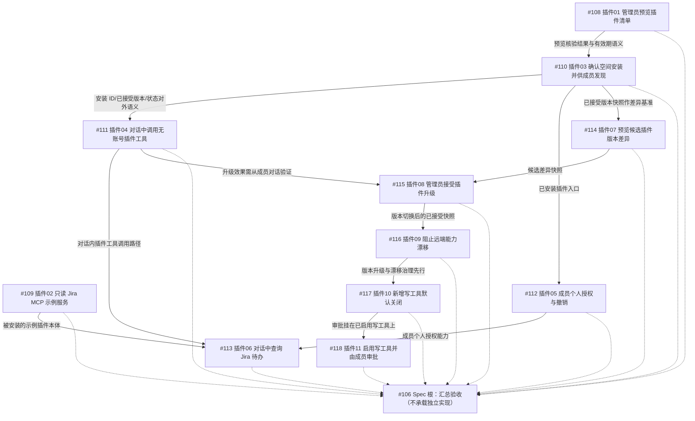

# Issue #106 实施范围裁决与依赖 DAG

日期：2026-09-23。裁决角色：范围裁决员（子代理，会话模型 GLM-5.3）。
Worktree：`.worktrees/issue106`，分支 `codex/issue-106-self-hosted-plugins`（HEAD `a9abdca24`，相对 `main` 仅 2 个 docs 提交，工作树干净——本次会话内 `git log main..HEAD --oneline` 与 `git status --porcelain` 核验）。

输入材料（均已通读）：

- `docs/plans/issue-106-issues-scope.md`（层级事实，commit `b07fa08c6`）
- `docs/plans/issue-106-code-baseline.md`（代码基线勘察，commit `a9abdca24`）
- `docs/specs/2026-09-23-self-hosted-plugins-spec.md`（已批准 Spec，与 #106 GitHub 正文逐字节一致）
- `docs/specs/2026-09-23-self-hosted-plugins-design.md`（设计文档，协议字段/迁移/实施方案待实施计划细化）
- Issue 侦察员返回的 12 节点 JSON（#106 + #108–#118）

本次会话实际运行的核实命令（区别于引用材料）：

1. `git merge-base --is-ancestor <c> HEAD`（c ∈ {c10405a06, 144ecb8b0, 00aeceef6, b50ee126a, 638d3eb60}）→ 全部 `in-baseline(HEAD)`：open-connector 关键成果确在本分支基线。
2. Kahn 拓扑排序脚本（python3，边集见第 5 节）→ `nodes: 12`、`topo: [108, 109, 110, 111, 112, 114, 113, 115, 116, 117, 118, 106]`、`acyclic: True`。
3. `gh api repos/1123786563/WeKnora-fork01/issues/115` / `.../issues/116`（只读）→ #115=`插件 08｜管理员接受插件升级`（open，`issues/115`）、#116=`插件 09｜阻止已接受版本的远端能力漂移`（open，`issues/116`）。
4. `git log main..HEAD --oneline` → 仅 `a9abdca24`、`b07fa08c6` 两个 docs 提交。

---

## 1. 完整层级树

来源：`docs/plans/issue-106-issues-scope.md`（原生 sub_issues 端点 + 时间线 `sub_issue_added`/`blocked_by_added` 事件逐一核对），本次裁决未改动。

```text
#106 Spec: 自行托管插件与清单安装 (open) —— 根，汇总验收节点
├── #108 插件 01｜管理员预览插件清单 (open)
├── #109 插件 02｜提供只读 Jira MCP 示例服务 (open)
├── #110 插件 03｜确认空间安装并供成员发现 (open)        [blocked_by #108]
├── #111 插件 04｜在对话中调用无账号插件工具 (open)       [blocked_by #110]
├── #112 插件 05｜成员个人授权与撤销 (open)               [blocked_by #110]
├── #113 插件 06｜在 WeKnora 对话中查询 Jira 待办 (open)  [blocked_by #109,#111,#112]
├── #114 插件 07｜预览候选插件版本差异 (open)             [blocked_by #110]
├── #115 插件 08｜管理员接受插件升级 (open)               [blocked_by #111,#114]
├── #116 插件 09｜阻止已接受版本的远端能力漂移 (open)     [blocked_by #115]
├── #117 插件 10｜新增写工具默认关闭 (open)               [blocked_by #116]
└── #118 插件 11｜启用写工具并由成员审批 (open)           [blocked_by #117]
```

树深度 2，无第三层；排除项 #107（Craft 网页作品）及其子树经层级文档反查不引用本树。

## 2. Issue 清单总表

| # | URL | 标题 | 父 | 状态 | 需求依据（一句话） | 验收摘要 | 实现现状 | 依赖 | 决定 |
| --- | --- | --- | --- | --- | --- | --- | --- | --- | --- |
| 106 | https://github.com/1123786563/WeKnora-fork01/issues/106 | Spec: 自行托管插件与清单安装 | —（根） | open | 开发者自托管远程 MCP 服务并发布版本化清单，管理员粘贴地址审阅后安装确定版本，成员个人授权后 Agent 仅调用已接受版本中已启用的工具；总体 Spec | 应用边界集成测试 seam（受控远程 MCP 服务 + 两名成员）：预览/确认/不一致/停用/Jira 查询/未授权引导/凭据隔离/撤销过期/旧版可用/差异/接受升级/候选不可达/漂移/写工具默认关闭/逐项启用/批准拒绝超时零写入/无账号能力/可见性/跨空间隔离/手工兼容 | 全仓库无插件实现（`plugin_manifest\|PluginInstallation\|插件清单` 零命中）；可复用基础 mcp_service/mcp_metadata/mcp_tool_approval/mcp_oauth 及前端 api 层 | 全部 11 个子 Issue（汇总验收） | **implement**（Ruling R2：汇总验收语义） |
| 108 | https://github.com/1123786563/WeKnora-fork01/issues/108 | 插件 01｜管理员预览插件清单 | #106 | open | 管理员粘贴清单地址，不创建安装前提下审阅版本、端点、实际工具、读写分类与授权要求 | 预览经清单+远端核验、有有效期、不创建安装；成员无权预览；受限地址/无效清单/不可达/声明不符明确拒绝；受控服务验证 | 无实现；`mcp_metadata.go` 元数据快照可复用为核验基础 | 无（可立即开始） | **implement** |
| 109 | https://github.com/1123786563/WeKnora-fork01/issues/109 | 插件 02｜提供只读 Jira MCP 示例服务 | #106 | open | 交付可独立部署的远程 MCP 示例服务，提供"查询本人本周 Jira 待办"工具 | schema 固定，不接受模型传令牌/用户 ID/JQL/URL；按成员授权映射账号；返回标识/标题/状态/截止日期/来源链接，空结果为空；Jira 替身验证隔离/403/超时/失效/空结果 | 无实现；`mcp-server/` 是反方向（对外提供工具），不得误用 | 无（可立即开始） | **implement** |
| 110 | https://github.com/1123786563/WeKnora-fork01/issues/110 | 插件 03｜确认空间安装并供成员发现 | #106 | open | 管理员从经核验预览确认确定版本安装；成员可发现；管理员可停用 | 确认时重核预览身份与版本，已变/过期拒绝、幂等；成员可见、跨空间不可见；停用可观察；手工 MCP 兼容；**固定安装 ID/已接受版本/空间归属/状态对外语义** | 无实现（插件维度）；App/Installation 领域模型与 mcp_service 在位可复用 | #108：确认消费预览核验结果 | **implement** |
| 111 | https://github.com/1123786563/WeKnora-fork01/issues/111 | 插件 04｜在对话中调用无账号插件工具 | #106 | open | 成员对话中调用已安装版本的无账号只读 MCP 工具，获得带来源标识结果 | Agent 只发现已安装/已启用/已接受版本工具；未安装/停用/跨空间拒绝；成功/空/错误如实呈现；手工 MCP 兼容；对话入口贯通测试 | 无实现；Agent 工具调用与 MCP 注册设施（routes_agent.go、mcp_tool.go）为可复用基础 | #110：需空间安装与工具目录 | **implement** |
| 112 | https://github.com/1123786563/WeKnora-fork01/issues/112 | 插件 05｜成员个人授权与撤销 | #106 | open | 成员从已安装插件入口查看本人状态，完成个人 OAuth 授权，可撤销/重授权 | 两成员凭据不混用、跨空间不可读；未授权/过期不可用；撤销不影响他人；受控服务验证 | 无实现（插件维度）；mcp_oauth token 已按 principal 隔离，缺插件安装视图关联 | #110：授权入口挂在已安装插件上 | **implement** |
| 113 | https://github.com/1123786563/WeKnora-fork01/issues/113 | 插件 06｜在 WeKnora 对话中查询 Jira 待办 | #106 | open | Jira 示例插件接入空间安装与成员个人连接，对话查本人本周待办（首个纵向案例） | 未授权先引导授权；授权后返回本人事项+来源链接；两成员数据隔离；空/403/超时不虚构；应用边界+受控 Jira API+受控 MCP 验证 | 无实现；依赖 #109/#111/#112 均不存在 | #109+#111+#112（三重汇合） | **implement** |
| 114 | https://github.com/1123786563/WeKnora-fork01/issues/114 | 插件 07｜预览候选插件版本差异 | #106 | open | 管理员预览候选版本相对已接受版本的能力变化，不立即切换 | 工具新增/移除/schema/scope/读写分类/端点差异；候选不可达或声明不符报错、旧版可用；两空间可停留不同版本；预览不改已接受版本 | 无实现；mcp_metadata 快照与 AppConnector OC digest pin 先例可复用 | #110：差异对照已接受版本快照 | **implement** |
| 115 | https://github.com/1123786563/WeKnora-fork01/issues/115 | 插件 08｜管理员接受插件升级 | #106 | open | 管理员接受候选版本后，已接受版本与 Agent 后续调用一起切换；未接受空间继续旧版 | 仅管理员可接受、接受前重核候选快照、幂等；失败/不可达保旧版；两空间不同版本；**从成员对话验证新旧版调用** | 无实现；mcp_services 保存可变 URL，无版本切换语义 | #111+#114：升级效果需对话验证 + 候选差异快照 | **implement** |
| 116 | https://github.com/1123786563/WeKnora-fork01/issues/116 | 插件 09｜阻止已接受版本的远端能力漂移 | #106 | open | 远端在已接受端点改变工具目录或 schema 时，Agent 拒绝未经审阅的能力 | 新增/移除/schema 变更形成明确漂移状态，调用被阻止并提示复审；从成员对话观察拒绝；其他空间不受影响；手工 MCP 兼容不静默施加版本治理 | 无实现；mcp_exposure.go 已有单服务防漂移行为，无跨版本管理员确认流程 | #115：核验基准为已接受版本快照（Ruling R6） | **implement** |
| 117 | https://github.com/1123786563/WeKnora-fork01/issues/117 | 插件 10｜新增写工具默认关闭 | #106 | open | 管理员接受带新写工具的版本后，写工具仍关闭直到逐项启用 | 安装/升级后新写工具默认不可调用，授权或 Agent 选择不能绕过；管理员可见关闭原因并逐项启用；只读按原策略；**外部写入计数为零**；不改变手工默认语义 | 无实现；MCPToolApproval 缺行默认启用（types/mcp.go:149-152）与 Spec 直接冲突，须显式迁移策略 | #116：策略基于版本升级与漂移治理之后 | **implement** |
| 118 | https://github.com/1123786563/WeKnora-fork01/issues/118 | 插件 11｜启用写工具并由成员审批 | #106 | open | 管理员可要求已启用写工具调用前由成员审阅确定目标和输入，批准才派发 | 批准/拒绝/超时/停用分别明确结果；拒绝/超时/撤销后不派发；审批展示确定目标与参数；批准后仅一次派发；对话入口全链一致 | 无实现（插件写工具维度）；mcp_tool_approval_service.go 与 approval.Gate 可复用，缺默认关闭+成员审批闭环组合语义 | #117：审批挂在已启用写工具上 | **implement** |

## 3. 覆盖矩阵（#106 验收边界 × 子 Issue）

基准为任务书确认的 #106 十条验收边界（其内容与 Spec Solution/Implementation Decisions/Testing Decisions 一致，已对照 spec.md 第 9-74 行核实）。

| #106 验收边界 | 承接子 Issue | 承接点 | 覆盖判定 |
| --- | --- | --- | --- |
| 1) 清单交付 + 管理员安装前预览核验（清单、版本端点、实际工具目录、schema、scope、读写分类、授权需求） | #108、#109 | #108：核验后预览+有效期+不创建安装+拒绝路径；#109：示范一份合规自托管清单与远程服务（开发者侧参考） | ✅ 完全覆盖（产品行为面）；清单协议本身的定义属工程前置（GAP-1） |
| 2) 安装固定版本；差异展示+手动接受；升级失败不破坏旧版 | #110、#114、#115 | #110 验收1/4（固定已接受版本、已变/过期拒绝、幂等）；#114 验收1（差异维度全列）；#115 验收1/2（仅管理员、重核快照、幂等、失败保旧版） | ✅ 完全覆盖 |
| 3) 运行时以已接受快照为核验基准，阻止未接受的工具扩张/漂移 | #116（+#110 验收4 的快照对外语义） | #116 验收1/2：漂移状态+调用阻止+提示复审+从对话观察；#110 固定快照语义供消费 | ✅ 完全覆盖（检测与阻断）；漂移后的处置闭环见 GAP-6 |
| 4) 成员发现已安装插件；个人授权按空间/成员/插件连接隔离 | #110、#112 | #110 验收2（成员可见、跨空间不可见）；#112 验收1/2（两成员隔离、撤销不影响他人、跨空间不可读） | ✅ 完全覆盖 |
| 5) 新写工具默认关闭；逐项启用+成员审批；拒绝/超时不派发 | #117、#118 | #117 验收1/3（默认不可调用、不能绕过、写入计数为零）；#118 验收1/2（批准/拒绝/超时/停用、不派发、仅一次派发） | ✅ 完全覆盖 |
| 6) 停用、撤销、过期、候选不可达等状态正确行为 | #110、#112、#113、#114、#115 | #110 验收3（停用可观察）；#112 验收2（撤销/过期/重授权）；#114 验收2（候选不可达报错+旧版可用）；#115 验收2（升级失败保旧版）；#113 验收2（授权失效不虚构） | ✅ 完全覆盖 |
| 7) Jira 纵向案例：本人本周待办、来源链接、不接受模型令牌/任意 URL、服务端限定时间范围 | #109、#113 | #109 验收1/2（schema 固定、拒绝令牌/用户 ID/JQL/URL、按授权映射账号、返回字段+来源链接、空结果为空；"本周"由服务端工具语义固定）；#113 验收1/2/3（端到端+未授权引导+隔离+不虚构） | ✅ 完全覆盖（Ruling R10） |
| 8) 无账号工具独立使用，仍受空间启停与工具策略约束 | #111（+#109、#110） | #111 验收1（停用/未安装拒绝）；#109 交付无账号能力示范；#110 空间启停 | ✅ 完全覆盖 |
| 9) 手工 MCP 路径兼容；旧工具不因迁移被自动视为已批准插件版本 | #110、#111、#114、#115、#116、#117 | 六个子 Issue 验收各含"手工 MCP 兼容"条目；#117 验收3"不改变手工 MCP 服务的既有默认语义" | ⚠️ 部分覆盖：兼容性 6 处承接；**"旧工具不能因迁移被自动视为已批准插件版本"无子 Issue 直接验收**，迁移方案本体无承接（GAP-3） |
| 10) 清单抓取/发现/执行遵守既有网络、租户、凭据边界；open-connector 遵守 ADR-0001 | #108、#109（横切约束） | #108 验收2（受限网络地址明确拒绝）；#109 验收3（不依赖真实凭据）；网络/租户/凭据边界为全树横切约束（勘察风险 8 的 Mimosa 约束） | ⚠️ 部分覆盖：运行时拒绝行为有承接；系统性抓取限制规范未显式承接（GAP-2）；插件远程调用挂 approval.Gate 还是 ADR-0013 ToolDispatchPreflight 的运行时裁决无子 Issue 承接（GAP-5） |
| 前置 F1) 清单协议固化 | — | Spec Implementation Decisions 明示"具体 JSON 字段由实施计划确定，不在本 Spec 中固定"（spec.md:50） | ❌ 缺口（GAP-1） |
| 前置 F2) 网络抓取限制 | #108（单点） | 仅"受限网络地址拒绝"运行时行为 | ⚠️ 部分（GAP-2） |
| 前置 F3) 版本漂移处置 | #116 | 阻断+提示复审有承接；复审后解除/接受漂移的操作路径无验收 | ⚠️ 部分（GAP-6） |
| 前置 F4) OAuth 身份映射 | #112（行为面） | 成员隔离行为有承接；principal↔插件身份↔既有 `mcp_oauth` (tenant, principal, service) 三元组及 000118 安装绑定表的映射方案无显式验收 | ⚠️ 部分（GAP-4） |
| 前置 F5) 数据迁移与回退方案 | — | 无任何子 Issue 承接 | ❌ 缺口（GAP-3） |

Out of Scope 核对：公开插件市场、平台托管第三方代码、本机 stdio 插件执行、空间共用 Jira 账号、首案例写工单——子 Issue 需求与验收均未越界（#118 明确"不增加 Jira 写操作，使用受控测试服务"；#109 只读）。

## 4. Mermaid DAG

箭头方向：前置 → 后续。虚线为子 Issue → 根 #106 的汇总验收汇聚边（非实现依赖）。



环路检查：本次会话以 Kahn 算法对 23 条边（12 条业务 + 11 条汇总）验证，`nodes: 12` 全部出队，`acyclic: True`，无需提取公共前置。

## 5. 依赖表（边明细）

依赖类型：**业务**=后续 Issue 的验收标准消费前置 Issue 的交付物/接口；**调度**=共享改动面冲突约束，非业务阻塞。全部 11 条业务边来源为各 Issue 正文 `## Blocked by` 段并与 GitHub 时间线 `blocked_by_added` 事件核对一致（层级文档 33-42 行），确定性高；推断性说明单独标注。

| 前置 | 后续 | 类型 | 原因 / 接口 / 交付物 | 确定性 |
| --- | --- | --- | --- | --- |
| #108 | #110 | 业务 | #110 验收1"确认时重新核对预览身份和版本；预览内容已变或过期则拒绝"直接消费 #108 交付的**核验后预览（含有效期与身份指纹）**；无预览则确认语义无从核验 | 高（正文声明+验收交叉） |
| #110 | #111 | 业务 | #111 验收1"Agent 只发现已安装、已启用且属于已接受版本的工具"消费 #110 验收4 固定的**安装 ID / 已接受版本 / 空间归属 / 状态对外语义** | 高 |
| #110 | #112 | 业务 | #112 需求"成员**从已安装插件入口**查看本人状态"——授权入口挂在 #110 交付的成员可见安装目录上 | 高 |
| #110 | #114 | 业务 | #114 验收1/3"相对**已接受版本**的差异""预览不更改任何空间已接受版本"以 #110 的版本快照为对照基准 | 高 |
| #109 | #113 | 业务 | #113 是"把 **Jira 示例插件**接入……"，被安装被调用的本体即 #109 交付的独立部署示例服务 | 高 |
| #111 | #113 | 业务 | #113 验收以**对话入口**验证查询，需 #111 打通的对话内插件工具调用路径 | 高 |
| #112 | #113 | 业务 | #113 验收1"未授权成员先获得个人授权入口；授权后……"需 #112 的成员个人授权/撤销能力 | 高 |
| #111 | #115 | 业务 | #115 验收3"**从成员对话**验证升级前调用旧版、升级后调用新版"需 #111 的对话调用路径作为验证 seam | 高 |
| #114 | #115 | 业务 | #115 验收1"接受前再次核对**候选快照**"消费 #114 交付的候选差异快照 | 高 |
| #115 | #116 | 业务 | #116 核验基准是"**已接受版本**"快照；接口上最小前置实为 #110 的快照语义，#115 交付版本切换后才是漂移的典型验证场景（升级后远端改目录）——见 Ruling R6 | 中（正文声明依赖；接口最小前置可争论，保持声明边） |
| #116 | #117 | 业务 | #117"管理员**接受带新写工具的版本后**，写工具仍关闭"：默认关闭策略建立在版本升级与漂移治理交付的版本/快照状态机之上；且 #117 须证明不把治理静默施加旧服务 | 高 |
| #117 | #118 | 业务 | #118 审收"**已启用**写工具在每次调用前由成员审阅"——审批对象是 #117 逐项启用后的写工具 | 高 |
| （调度）#108/#110/#112/#114/#115/#117/#118 | 相互间 | 调度 | 前端共享改动面：`apps/web/src/settings`（McpSettingsPanel 挂载区）与 `apps/web/src/integrations`（成员发现入口候选）；同波并行须分工或串行，见 Ruling R8 | 约束（勘察 6.1/6.2） |
| （调度）#110/#114/#115/#116 | 相互间 | 调度 | 后端共享改动面：插件安装/版本/快照新模块与 `mcp_services` 迁移（迁移头当前 000188）；表结构与快照哈希语义（对齐 MCPConfigFingerprint / mcpToolRef / OCSchemaDigest）须一次定型避免返工 | 约束（勘察风险 2） |

## 6. 拓扑顺序与执行波次

Kahn 线性化结果（本次会话运行验证）：

```
#108 → #109 → #110 → #111 → #112 → #114 → #113 → #115 → #116 → #117 → #118 → #106
```

（#113 与 #115 之间无依赖，相对顺序可互换；上表为脚本输出序。）

按入度分波（波内节点业务上可并行，受第 5 节调度约束修正）：

| 波次 | 节点 | 说明 |
| --- | --- | --- |
| W0 | #108、#109 | 正文自述 "can start immediately"；一个后端预览/一个独立示例服务，改动面不重叠，可并行 |
| W1 | #110 | 安装与成员目录（后端模型定型关键节点：安装 ID/版本/状态语义在此固定） |
| W2 | #111、#112、#114 | 分别为 Agent 调用链 / 个人授权 / 差异预览；#111+#114 后端可并行，#112 前端与 #114 前端注意共享面板冲突 |
| W3 | #113、#115 | 纵向案例汇合 + 升级接受；互不依赖可并行（#113 偏集成测试、#115 偏版本切换） |
| W4 | #116 | 漂移阻断 |
| W5 | #117 | 写工具默认关闭（含 MCPToolApproval 默认值迁移策略） |
| W6 | #118 | 写工具成员审批闭环 |
| W7 | #106 | 根 Issue 汇总验收：Spec 十条边界核销 + 覆盖矩阵复核，不承载独立实现（Ruling R2） |

## 7. 可执行节点与阻塞节点

- **当前可执行（入度 0）**：#108、#109。
- **阻塞中（按首个前置列出）**：#110（等 #108）；#111/#112/#114（等 #110）；#113（等 #109+#111+#112）；#115（等 #111+#114）；#116（等 #115）；#117（等 #116）；#118（等 #117）；#106（等全部子 Issue）。
- **无 verify-closed 节点**：全树 12 节点均 open，且代码勘察确认插件维度零实现，不存在"已实现待核实"节点。
- **无 out-of-scope 节点**：11 个子 Issue 需求与验收均在 Spec 边界内（第 3 节 Out of Scope 核对）。
- **无因外部依赖 blocked 的节点**：见第 8 节。

## 8. 外部依赖核实（是否已进 main 基线）

| 外部项 | 核实方式 | 结论 |
| --- | --- | --- |
| open-connector / AppConnector 成果（c10405a06 merge、144ecb8b0 scoped client、00aeceef6 模块迁移、b50ee126a/638d3eb60 pass-a merges） | **本次会话** `git merge-base --is-ancestor <c> HEAD` 逐个运行，5/5 `in-baseline(HEAD)`；勘察文档第 5 节亦双向核验 | 已入基线，**不构成 blocked**；AppConnector Installation/Connection/OC digest pin 可直接复用 |
| `.worktrees/tdm-int`（feat/tdesign-react-migration，68 commits 未合入） | 勘察第 5 节 `git log main..<branch>` 核验 | 未入 main；与插件功能无重叠，但深耕 `apps/web/src/settings`/`integrations` 同一前端冲突面 → 调度风险（Ruling R8），非业务依赖 |
| backend-mod-wave01 / bm-t10 / bm-t5 / issue30-sweep / issue72-lago / passb-* | 勘察第 5 节逐一核验 | 未入 main，与 MCP/插件/连接器无功能重叠，不构成 blocked |
| `/private/tmp/weknora-head`（83ce05bd2）、`~/.codex/worktrees/craft-107-*` | 勘察第 5 节 | 均已含于 main，无未集成内容 |
| 环境约束：node ≥26（PATH 为 v22.22.3，须经 `pnpm gates` 自动 re-exec）；应用边界集成测试需真实 PG（`OC_TEST_DATABASE_URL`，缺失 Fatal 不 Skip） | 勘察 4.1/4.3（本次未重跑全量） | 实施环境前置，非代码依赖，移交实施计划 |

## 9. 全部 Ruling

- **R1（模型路由，任务书要求原样记录）**：任务书要求按 gpt-5.6-sol/terra/luna 分级派发，但本 host 仅配置 GLM-5.3 系列模型，动态工作流亦不支持按子代理选模型。实际全部子代理运行在会话模型 GLM-5.3（最高推理档）上。此为记录的替代方案，不声称使用了不可用模型。
- **R2（#106 的 implement 语义）**：#106 为根 Spec Issue，decision=implement 指其在全部子 Issue 完成后的**汇总验收**（Spec 十条边界核销、覆盖矩阵复核、应用边界集成 seam 整体走查），不承载独立实现工作；拓扑序排最后（W7）；父节点汇总与子节点实现不得重复计算。
- **R3（#115 URL 字段修正）**：侦察员 JSON 中 #115 节点 `url` 字段误写为 `issues/116`，与 `number:115`/`id:...#115` 不一致。本次会话以只读 `gh api .../issues/115` 与 `.../issues/116` 核对：#115=插件 08（issues/115）、#116=插件 09（issues/116）。按 number 修正采用 `https://github.com/1123786563/WeKnora-fork01/issues/115`。
- **R4（决定汇总）**：12 节点全部 open、全部属 Spec 范围、外部依赖已核实入基线 → 全部 **implement**；无 closed（故无 verify-closed）、无 out-of-scope（#107 Craft 树不引用本树）、无 blocked。
- **R5（边来源与无环）**：11 条业务依赖边全部来自 Issue 正文 `blocked_by` 声明并与时间线事件核对一致，属高确定性业务依赖；本次会话 Kahn 验证 23 条边（含汇总边）无环，无需提取最小公共前置。
- **R6（#115→#116 边的不确定性）**：#116 的接口最小前置是 #110 验收4 固定的"已接受版本快照"语义；Issue 正文声明 blocked_by #115，解读为：版本切换（升级）交付后，"远端在已接受端点改变目录"的漂移场景才有完整验证路径（升级前后对照）。保持声明边不变更，记录此推断依据。
- **R7（传递依赖不建边）**：#114 复用 #108 的清单抓取+远端工具发现 seam，但经 #110 传递可达（#108→#110→#114），不新增直接边，避免 DAG 冗余。
- **R8（文件冲突调度约束）**：前端 `apps/web/src/settings`/`apps/web/src/integrations` 为 #108/#110/#112/#114/#115/#117/#118 共享改动面，后端插件安装/版本/快照模块为 #110/#114/#115/#116 共享面——同波并行须按第 6 节波次并考虑分工/串行；`packages/views/src/settings/registry.ts:41` 的 `mcp: ported:false` 与实际面板不一致（勘察 6.1），改注册表须核实。tdm-int 68 commits 未合入属未来 rebase 冲突面，不是本 DAG 的边。
- **R9（覆盖缺口处置）**：GAP-1…GAP-6 全部属于 Spec Further Notes（spec.md:81）定位的"正式实施前需固定"工程前置项，Spec 明示其不改变已确认用户行为。裁决为：**不由现有子 Issue 摊派或改写验收**（避免破坏纵向切片），统一移交实施计划作为第 0 波（W0 前置）任务承接，不留占位；如实施计划阶段判定工作量需要独立跟踪，再建议增补工程前置 Issue（本裁决无权在 GitHub 建 Issue）。
- **R10（边界 7 的"时间范围由服务端限定"归属）**：该句由 #109 承接——工具即"查询本人**本周**待办"且 schema 固定、不接受任意 JQL/URL（#109 验收1），时间范围由服务端工具语义锁定；#113 从对话端到端复核。比对 spec.md:56 确认一致。

## 10. 覆盖缺口汇总（#106 验收标准对子 Issue 的覆盖缺口）

| 编号 | 缺口 | 依据 | 处置建议 |
| --- | --- | --- | --- |
| GAP-1 | 清单协议固化（manifest 字段、版本化与稳定端点语义、内容摘要与既有 MCPConfigFingerprint / mcpToolRef / OCSchemaDigest 哈希语义对齐）未被任何子 Issue 验收承接 | spec.md:50"具体 JSON 字段由实施计划确定"；层级文档根级缺口段 | 实施计划 W0 前置任务 |
| GAP-2 | 网络抓取限制系统性规范（SSRF host 校验/白名单策略、凭据仅环境变量或密钥服务）仅 #108 以"受限网络地址拒绝"单点承接 | 勘察风险 8；#108 验收2 | 实施计划横切规范（复用 `internal/utils/security.go` 既有 SSRF 设施） |
| GAP-3 | 数据迁移与回退方案零承接；#106 边界 9"旧工具不能因迁移被自动视为已批准的插件版本"无子 Issue 直接验收（#117 仅"不改变手工默认语义"间接涉及） | spec.md:55、81；勘察风险 1（MCPToolApproval 缺行默认启用冲突） | 实施计划 W0 前置任务，须含显式迁移策略与回退 |
| GAP-4 | OAuth 身份映射方案（成员 principal ↔ 插件身份 ↔ 既有 `mcp_oauth` (tenant, principal, service) 三元组及 000118 安装绑定表的关系）无显式验收；#112 仅承接行为面 | 勘察 1.4 与风险 3；设计文档差距表"授权与具体插件版本/服务关联" | 实施计划 W0/W1 前置设计 |
| GAP-5 | 插件远程调用的授权链裁决（挂既有 approval.Gate 还是 ADR-0013 ToolDispatchPreflight；`ToolIdentity` 已有 InstallationID/SchemaHash 字段无消费者）无子 Issue 承接 | 勘察 2.2/2.3 与风险 3 | 实施计划必须在 #111 开工前裁决（W0） |
| GAP-6 | 版本漂移的处置闭环（管理员复审后的解除/接受操作路径）——#116 仅覆盖"阻止+提示复审" | #116 验收1；spec.md:52 | 实施计划在 #116 任务书内补验收细节或计划任务 |

以上缺口不阻塞 #108/#109 立即开工（二者验收自足），但 GAP-5 应在 #111（W2）开工前裁决，GAP-1/2/3 应在 #110（W1，涉及建表与迁移）开工前固定。
