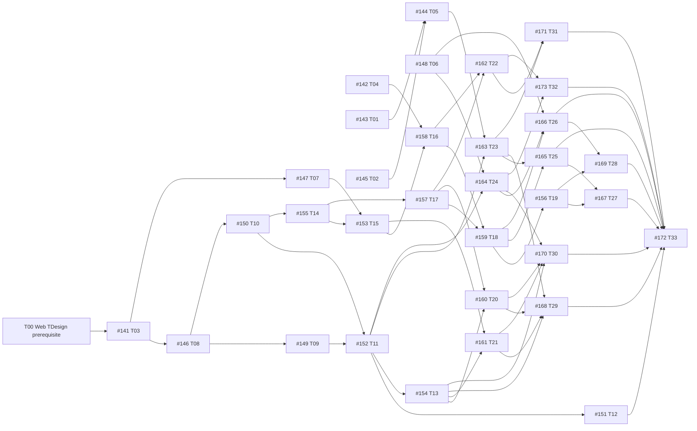

# Issue #140 递归摄取与执行 DAG

- 根 Issue: https://github.com/1123786563/WeKnora-fork01/issues/140
- 读取时间: 2026-09-24 Asia/Shanghai；来源: 认证 GitHub REST API（gh api，含分页）、Issue 正文与评论。
- 起始 BASE: f7753fa160927195e388c65e1dbbdff7e288506c（.worktrees/issue30-sweep 的 codex/issue30-mobile-office 已提交 HEAD）。
- 集成工作区: /Users/wuyongjun/.codex/worktrees/issue-140-integration/WeKnora-fork01；分支 codex/issue-140-integration。
- 事实源: docs/specs/2026-09-23-weknora-job-search-design.md、CONTEXT.md、ADR 0015–0018、GitHub #140 与正式子 Issue。

## 完整性与边界

正式子 Issue 共 33 个，根与子节点共 34 个；所有子节点 open。递归查询未发现更深层正式子 Issue。contains 边 33 条，均为 #140 → 子 Issue。#140 负责聚合验收；#30、#72、#106 均在实施范围外。
GitHub dependency/detail endpoints 返回 404；依赖身份以各子 Issue 正文 `Blocked by` 段为证据，未将 metadata 的计数猜成边。若未来 API 可用，复核正式关系。草案 Ticket 仅作细节参考，GitHub Issue 为当前验收来源。

## Mermaid DAG

## 拓扑波次与并发条件

| 波次 | Issue | 调度 |
| --- | --- | --- |
| G0 | T00（#140 Web 前置）、#141 T03, #142 T04, #143 T01, #145 T02, #148 T06 | T00 是 Web 交互子任务的技术前置，#141 后端可与之并行；其余仅在接口冻结、独立 Worktree、文件及数据库/端口/构建状态隔离后并发。 |
| G1 | #144 T05, #146 T08, #147 T07 | 仅在接口冻结、独立 Worktree、文件及数据库/端口/构建状态隔离后并发；否则串行。 |
| G2 | #149 T09, #150 T10 | 仅在接口冻结、独立 Worktree、文件及数据库/端口/构建状态隔离后并发；否则串行。 |
| G3 | #152 T11, #155 T14 | 仅在接口冻结、独立 Worktree、文件及数据库/端口/构建状态隔离后并发；否则串行。 |
| G4 | #151 T12, #153 T15, #154 T13, #157 T17, #163 T23, #164 T24 | 仅在接口冻结、独立 Worktree、文件及数据库/端口/构建状态隔离后并发；否则串行。 |
| G5 | #158 T16, #160 T20, #161 T21 | 仅在接口冻结、独立 Worktree、文件及数据库/端口/构建状态隔离后并发；否则串行。 |
| G6 | #159 T18, #162 T22, #168 T29, #170 T30 | 仅在接口冻结、独立 Worktree、文件及数据库/端口/构建状态隔离后并发；否则串行。 |
| G7 | #156 T19, #165 T25, #166 T26, #171 T31, #173 T32 | 仅在接口冻结、独立 Worktree、文件及数据库/端口/构建状态隔离后并发；否则串行。 |
| G8 | #167 T27, #169 T28 | 仅在接口冻结、独立 Worktree、文件及数据库/端口/构建状态隔离后并发；否则串行。 |
| G9 | #172 T33 | 仅在接口冻结、独立 Worktree、文件及数据库/端口/构建状态隔离后并发；否则串行。 |

G0 中 #143 与 #145 可能同时触及 Mobile Runtime，冻结其公共合同并约定 #143 只写鸿蒙试验目录；否则二者串行。#141 拥有 Career 合同与迁移，#142 拥有 Artifact 授权；#148 仅用既有小程序接口。下游节点只有前置提交经 Review 且集成后才由 pending 进入 ready。

## 节点、依赖与验收映射

状态语义：pending、ready、running、blocked、verified。各节点状态以本表逐项列示；#143 的真实原生环境验收 blocked，不将研究结论等同设备通过。

| id / source_issues | acceptance | depends_on | owner_role / validator_role | owned_files | interfaces | verification | status |
| --- | --- | --- | --- | --- | --- | --- | --- |
| T00 / #140 Spec §6、ADR-0018 | Web 使用既有 TDesign React 浅色主题及 #07c05f 品牌色，保留 #30 Mobile 和 #140 Mini 依赖 | 无 | mechanical_worker / frontend_validator | apps/web/；apps/embed/；packages/views/；packages/design-tokens/；根工作区依赖 | 消费已批准的 TDesign 来源提交 d35583fa3；交付可构建的 Web/Embed TDesign 工作区 | 冻结安装、Web 2306/2306 测试、类型检查/构建、Embed 构建、独立 Spec/质量复审；集成提交 197d93eeb | verified |
| T01 / #143 | 明确区分鸿蒙原生应用与运行 Android 兼容包，记录目标系统版本、工具链、Expo SDK、RN 与原生模块兼容矩阵；若有可维护的 Expo 鸿蒙路径，构建可运行包，在鸿蒙设备读取受保护 Task 并验证登录、空间失效、文件、分享、通知和存储；若无可维护路径，给出最小复现、失败证据、受影响 Ticket 和可选技术裁定；不得把 Android 包、WebView 或概念演示记为鸿蒙原生验收通过；UI 只映射 TDesign Mobile React 视觉规范到原生组件，不直接导入移动 Web 组件；不改 Career 业务合同；共享 Mobile Runtime 改动先经契约验证再与 iOS／Android 分支集成 | 无 | frontend_implementer / frontend_validator | apps/mobile/harmony/（原生适配试验与证据） | 消费接口：现有 Expo App、Mobile Runtime、Task 公共读取与认证。；交付接口：鸿蒙原生可运行路径及能力矩阵，或带复现证据的阻塞裁定。 | 记录构建命令、系统和 SDK 版本、设备、受保护 Task 的真实读取及越权拒绝；失败亦附原始日志位置。；产出鸿蒙 native、Android 兼容包和 WebView 的可辨别证据，避免将后两者冒充前者。 | blocked |
| T02 / #145 | iOS、Android 开发构建均在真实模拟器或设备打开受保护 Task；使用现有 Expo 工程及 Mobile Runtime；未登录和跨 Tenant 读取被拒绝，切换空间后旧 Task 数据和迟到响应不可见；两端验证导航、文件选择／下载、系统分享、通知与安全存储；缺口有明确 Adapter 记录；UI 使用原生 React Native 组件映射 TDesign Mobile React 的视觉 token 和交互规范，不直接导入移动 Web 组件；记录构建命令、SDK／依赖版本、模拟器或设备及行为证据 | 无 | frontend_implementer / frontend_validator | apps/mobile/src/；packages/mobile-core/src/ | 消费接口：现有 WeKnora 认证、Tenant 范围与 Task 公共读取。；交付接口：可复用的 Expo 原生页面边界、双目标端能力矩阵与受认证 Task 读取示例。 | iOS、Android 各提供实际构建、登录与受保护 Task 读取记录。；未登录、跨 Tenant、空间切换和端能力探针结果可复现。 | running |
| T03 / #141 | 首次进入遵循现有 Tenant 开通策略，不能绕过数量与授权限制；未确认字段可保存为提案，但评估视图不得视为已确认；另一用户或 Tenant 不能读取档案，切换空间后旧读取结果不回填；一次重复确认不产生两条事实，冲突返回当前修订 | T00（Web 子任务） | backend_implementer + frontend_implementer / backend_validator + frontend_validator | internal/modules/career/；internal/handler/；apps/web/src/ | 消费接口：现有身份与 Tenant 开通策略、认证后的用户与空间作用域、已集成 TDesign Web 工作区。；交付接口：Career 最小公开意图与视图、确认事实回执、修订冲突合同。 | Career Office 合同测试覆盖授权、确认、重复请求和修订冲突；SQLite 本地启动与 HTTP 授权检查；Web 浏览器登录、提案、确认、刷新、退出；集成 `pnpm test:web` 2309/2309 通过；服务端与 Web 独立 Spec/质量审查通过。详见 `task-3-integrated-backend-validation.md`、`task-3-live-http-validation.md`、`task-3-web-browser-validation.md`、`task-3-web-runner-validation.md`。 | verified |
| T04 / #142 | 授权绑定 Tenant、所有者、资源及确定版本；下载时重新检查授权和撤销状态，不仅在签发时检查；跨 Tenant、过期、篡改签名和已删除版本被拒绝；现有 Task 产物下载继续可用 | 无 | backend_implementer / backend_validator | internal/modules/workbench/；internal/handler/session/workbench_artifacts.go | 消费接口：现有 Workbench Artifact 授权与存储权威。；交付接口：确定版本的短时下载授权、撤销后下载拒绝合同。 | Workbench 公共接口测试检查成功、越权、过期、撤销；隔离 Lite 服务通过 Web API 下载真实存储对象并比对 SHA-256；独立验证 PASS。详见 `task-4-integrated-validation.md`、`task-4-live-http-validation.md`、`task-4-final-validation.md`。 | verified |
| T05 / #144 | Expo 移动运行面替换占位首页，提供可用 Task 入口；刷新或重启后不创建新 Task，只恢复原 Task；活动空间切换时旧 Task 数据和迟到响应不显示；离线显示受控缓存或明确不可用状态，不暗示任务成功 | #143, #145 | frontend_implementer / frontend_validator | apps/mobile/src/；packages/career-core/src/ | 消费接口：Mobile Runtime 的活动空间租约与 Task 公共视图。；交付接口：Expo 移动 Task 进入、恢复与 scope 失效呈现。 | Mobile Runtime/Task Office 公共 seam 测试覆盖恢复和 scope 失效。；iOS、Android 开发构建与鸿蒙可用构建各演示一条现有 Task；鸿蒙不支持时按 #143 判定阻塞。 | pending |
| T06 / #148 | Taro 4 小程序中的文件入口与可见控件使用 TDesign Miniprogram，通过页面 usingComponents 接入并验证组件注册、样式 token、事件回调、构建产物和真机交互；该实现仅承诺微信小程序目标；产物列表只显示当前用户与空间可访问项；短时授权过期时可重新取得，越权时不可下载；PDF 和 DOCX 均可打开或保存，失败给出可操作提示；不在微信小程序（Taro 4 + TDesign Miniprogram）持久缓存明文敏感文件 | 无 | frontend_implementer / frontend_validator | apps/miniprogram/src/subpackages/execution/artifact/；apps/miniprogram/src/services/ | 消费接口：现有 Task 产物列表与短时授权。；交付接口：微信小程序（Taro 4 + TDesign Miniprogram）文件获取 Adapter 和过期恢复。 | 微信小程序（Taro 4 + TDesign Miniprogram）真机或官方开发环境下载两种文件并检查内容。；服务合同测试过期、撤销和越权。 ；Wave2 D1/D2/D3 修复后真实 DevTools 全链路复验、产物断言 62/62（build:weapp 后）、typecheck 仅 13 个基线预存在错误——见 task-6-live-validation.md、wave-report-T06修复.md | verified |
| T07 / #147 | 教育、经历、项目、技能、成果数字与证书均有来源和确认状态；拒绝或未确认的提案不能用于评估或材料生成；上传失败不覆盖已确认档案，修改保留版本和来源；送模型前遮蔽与当前目的无关的证件号码等字段 | #141 | backend_implementer + frontend_implementer / backend_validator + frontend_validator | internal/modules/career/；packages/career-core/src/；apps/web/src/ | 消费接口：个人求职空间、事实确认意图。；交付接口：带来源的事实提案与确认版本。 | Career Office 测试改变提案确认状态并观察后续可用事实。；Web 用含缺失与冲突事实的样例简历完成审阅。 | verified |
| T08 / #146 | 原文与抽取字段分开保存，缺字段标为未知；同一请求 ID 重放返回同一机会或回执；岗位原文中的指令不能获得 Agent 工具权限；页面可从对话结果进入岗位证据详情 | #141 | backend_implementer + frontend_implementer / backend_validator + frontend_validator | internal/modules/career/；packages/career-core/src/；apps/web/src/ | 消费接口：Career 最小意图与对话入口。；交付接口：岗位机会、来源观察和不可改写的 JD 快照。 | Career Office 合同测试覆盖原文快照、重复提交和恶意 JD。；Web E2E 证明粘贴到再次打开内容一致。 | verified |
| T09 / #149 | 只接入经核验允许读取的来源，不绕过登录或反爬限制；保留原链接、取得时间、完整性及失败原因；摘要不足以推断届别、学历等硬条件；用户补充 JD 后产生新的固定快照，原始来源仍可追溯 | #146 | backend_implementer + frontend_implementer / backend_validator + frontend_validator | internal/modules/career/；packages/career-core/src/；apps/web/src/ | 消费接口：岗位快照与导入意图。；交付接口：来源完整性分类、原链接保留和 JD 回退。 | 固定来源响应契约覆盖完整、登录阻断、摘要、不存在和超时。；Web 演示链接失败后粘贴 JD 成功。 ；集成门 go 6 包全绿、node26 全量 test:web 2363/2363、Web jsdom 50/50——见 wave-report-T09后端.md、wave-report-T09-Web.md | verified |
| T10 / #150 | 2026 届对仅限 2027 届为不符合，缺毕业日期为待确认；每项资格指向岗位快照与已确认档案版本；总分不表述为录用概率，不符合不能被其他高分掩盖；用户改档案后可生成新评估，旧评估仍可读取 | #146 | backend_implementer + frontend_implementer / backend_validator + frontend_validator | internal/modules/career/；packages/career-core/src/；apps/web/src/ | 消费接口：已确认档案版本与岗位快照。；交付接口：三值资格判断与证据化匹配评估。 | Career Office 三值、回放、版本、授权与竞态测试；Web 2356/2356、类型检查与构建；独立复审；临时 SQLite + 真实浏览器验证 2026 不符合、2027 符合、旧评估不变、390px 无横向溢出和退出保护。见 `task-10-live-browser-validation.md` 与 T10 各任务报告。低风险侧栏拖拽/断点边界记录于浏览器报告。 | verified |
| T11 / #152 | 找岗默认一次性 Task，指令不自动创建持续规则；首批来源明确实际可用方式与城市覆盖，不宣称全国完整；结果列出检查时间、资格状态、原始链接及不确定性；执行失败、未知回执和额度拒绝均可恢复，不复制搜索 Task | #149, #150 | backend_implementer + frontend_implementer / backend_validator + frontend_validator | internal/modules/career/；packages/career-core/src/；apps/web/src/ | 消费接口：岗位来源 Adapter、评估视图、Workbench Task 准入。；交付接口：一次性找岗回执和 C 对话结果视图。 | 固定来源与真实允许来源各跑一次合同场景。；Web E2E 从指令到岗位详情再到恢复历史结果。 ；后端（Wave3）与 Web 恢复流（Wave4）均集成评审通过，集成门 go 6 包、node26 全量 test:web 2389/2389——见 wave-report-T11后端.md、wave-report-T11-Web.md | verified |
| T12 / #151 | 仅有充分岗位编号、企业、地点与批次证据时合并；不确定重复并列，所有原始链接和检查时间保留；过期、下架和要求变化显式标注，旧申请仍展示旧快照；可查看已接入来源和实际覆盖城市 | #152 | backend_implementer + frontend_implementer / backend_validator + frontend_validator | internal/modules/career/；packages/career-core/src/；apps/web/src/ | 消费接口：来源观察与找岗结果。；交付接口：谨慎去重、更新差异与来源覆盖视图。 | Career Office 合同测试覆盖同岗双来源、同名不同批次和 JD 更新。；Web 展示变化前后差异且历史可访问。 | pending |
| T13 / #154 | 未开启不后台运行，暂停后下一次触发被取消或不再入队；启用前展示条件、频率与预计消耗；同一新岗位只产生一个发现待办；重复触发和结果未知经同一请求身份对账 | #152 | backend_implementer + frontend_implementer / backend_validator + frontend_validator | internal/modules/career/；packages/career-core/src/；apps/web/src/ | 消费接口：一次性找岗能力与 Workbench admission。；交付接口：可暂停的规则与幂等触发回执。 | Career Office 定时触发测试覆盖开关、重复与未知状态。；Web E2E 修改规则后显示下次运行计划。 | pending |
| T14 / #155 | 申请固定所用岗位快照、档案版本与资格评估；硬条件不符可显式继续，但警示常驻且不计合格申请指标；跨模块 Task 建立未知时保留 linking 状态并用原请求 ID 对账；同岗不同批次可分别申请，重复请求不创建第二个 Task | #150 | backend_implementer + frontend_implementer / backend_validator + frontend_validator | internal/modules/career/；packages/career-core/src/；apps/web/src/ | 消费接口：岗位快照、资格评估与 Workbench Task 创建。；交付接口：求职申请、Task 关联及未知结果对账。 | Career Office 公共 seam 测试覆盖正常、超时、重复、跨批次和警示。；Web E2E 从岗位卡打开独立申请。 ；后端子任务1+2 与 Web 申请流（浏览器 E2E 12 相位经评审核验为真实渲染）均集成，集成门 go 6 包全绿、node26 全量 test:web 2378/2378——见 wave-report-T14子任务2.md、wave-report-T14-Web.md | verified |
| T15 / #153 | 生成前冻结岗位与档案版本，主张链接到确认事实；缺失实习、证书、数字不得由模型补造，审阅指出风险；用户确认正文后形成新不可变版本，旧版本可比较；三端共同编辑的是结构化正文，修改后不得覆盖旧投递版 | #147, #155 | backend_implementer + frontend_implementer / backend_validator + frontend_validator | internal/modules/career/；packages/career-core/src/；apps/web/src/ | 消费接口：已确认档案、岗位快照与独立申请。；交付接口：结构化材料草稿、主张引用和不可变正文版本。 | Career Office 公共 seam 测试覆盖未确认事实、伪造成果、版本冲突。；Web E2E 修改正文并比较 V1/V2。 ；后端（Wave4）与 Web 编辑/比较流（Wave5 第2轮复审通过）均集成，集成门 go 6 包、node26 全量 test:web 2401/2401——见 wave-report-T15后端.md、wave-report-T15-Web.md | verified |
| T16 / #158 | 两种文件绑定同一正文摘要与材料版本；PDF 校验可提取文本与页面版面，DOCX 校验完整与可编辑性；两种验证均通过后版本才可标记可用于投递；旧版本保持可下载，删除或撤销后旧授权立即失效 | #142, #153 | backend_implementer + frontend_implementer / backend_validator + frontend_validator | internal/modules/career/；packages/career-core/src/；apps/web/src/ | 消费接口：已确认材料版本与固定 Artifact 授权。；交付接口：同摘要 PDF/DOCX 及验证通过状态。 | 真实渲染器验收检查 PDF 文本与页面、DOCX 内容与编辑。；Workbench 授权测试和 Web 下载 E2E。 | running |
| T17 / #157 | 事件追加保存，纠错追加更正事件而非覆盖原记录；当前阶段由已确认事件投影，重新打开结果一致；同一请求重放不出现第二个事件；事件来源和确认者可追溯，跨申请记录不串联 | #155 | backend_implementer + frontend_implementer / backend_validator + frontend_validator | internal/modules/career/；packages/career-core/src/；apps/web/src/ | 消费接口：求职申请与修订回执。；交付接口：追加进展事件与当前阶段投影。 | Career Office 合同测试覆盖事件顺序、更正、幂等、阶段投影。；Web E2E 录入面试后筛选并查看历史。 ；后端（Wave5）与 Web 时间线（Wave6）均集成评审通过，集成门 go 6 包、node26 全量 test:web 2412/2412——见 wave-report-T17后端.md、wave-report-T17-Web.md | verified |
| T18 / #159 | 系统不点击外部提交或自动发信；实际版本可选择已验证版，未知时明确记录未确认；投递事件绑定渠道、时间、版本或未知标记；重复确认不生成第二次投递记录，后续准备不引用错误版本 | #157, #158 | backend_implementer + frontend_implementer / backend_validator + frontend_validator | internal/modules/career/；packages/career-core/src/；apps/web/src/ | 消费接口：验证通过的材料版本与申请进展事件。；交付接口：本人投递事件及实际版本绑定。 | Career Office seam 测试已知/未知版本与重复回执。；Web E2E 记录投递并回看版本及时间线。 | pending |
| T19 / #156 | 求职信与回答只引用已确认事实和岗位快照；面试准备优先固定实际投递版本，版本未知必须提示；生成结果可审阅、修订且有来源；不自动发送或替用户承诺事实 | #159 | backend_implementer + frontend_implementer / backend_validator + frontend_validator | internal/modules/career/；packages/career-core/src/；apps/web/src/ | 消费接口：确认事实、岗位快照与实际投递版。；交付接口：可审阅求职信及面试准备草稿。 | Career Office 测试证明 V2 已投递时引用 V2、未知时不猜 V3。；Web E2E 查看来源并修订草稿。 | pending |
| T20 / #160 | 同一机会和事件只产生一条待办；站内记录是权威，推送只提醒重新同步；通知正文无公司、岗位、面试细节；取消订阅后不再发送，已存在待办仍可读取 | #154, #157 | backend_implementer + frontend_implementer / backend_validator + frontend_validator | internal/modules/career/；packages/career-core/src/；apps/web/src/ | 消费接口：持续规则发现结果与申请进展事件。；交付接口：去重站内待办和最小内容通知事实。 | Inbox/通知契约测试去重、隐私文案和取消订阅。；Web E2E 从待办进入权威申请。 | pending |
| T21 / #161 | 执行前展示将消耗的额度与触发条件；超额阻止新的收费 Run 而非删除既有档案或申请；重复请求不会重复预占或收费；付费状态不改变岗位排序或资格判定 | #153, #154 | backend_implementer + frontend_implementer / backend_validator + frontend_validator | internal/modules/career/；packages/career-core/src/；apps/web/src/ | 消费接口：持续找岗、材料生成与 Workbench admission。；交付接口：预估用量、额度拒绝与只读保留行为。 | admission 合同测试额度边界、重复请求和只读访问。；Web E2E 模拟超额后仍能打开旧申请。 | pending |
| T22 / #162 | 导出包含档案、原岗位快照、申请事件和材料版本；删除前说明空间内与外部平台资料的边界；删除使旧 Task、Artifact 授权和客户端缓存不可再访问；若保留策略要求延迟或例外，显示范围与状态 | #157, #158 | backend_implementer + frontend_implementer / backend_validator + frontend_validator | internal/modules/career/；packages/career-core/src/；apps/web/src/ | 消费接口：求职档案、快照、申请、材料及授权。；交付接口：完整导出包、删除回执与授权撤销。 | Career Office/Identity/Workbench 联合合同测试导出完整性和旧链接失效。；Web E2E 导出后发起删除并检查不可读取。 | pending |
| T23 / #163 | 复用同一 WeKnora 身份与 Tenant，不建本地权威副本；可上传已有简历或逐步建档，并逐项确认抽取事实；系统分享进入的链接/JD 可核对后导入；窄屏持续展示硬条件、依据、来源和待核实项；跨端修改档案后读到同一确认版本 | #144, #152 | frontend_implementer / frontend_validator | apps/mobile/src/；packages/career-core/src/ | 消费接口：Career Desk 的档案、导入、搜索和评估合同。；交付接口：原生 C 页面与系统分享适配。 | Career Desk 合同测试 scope 切换与跨端版本。；iOS、Android、鸿蒙各跑分享导入到岗位评估的设备流程。 | pending |
| T24 / #164 | 可见小程序控件使用 TDesign Miniprogram 或记录明确的原生能力例外；实际开发工具与真机验证；微信身份只作为关联方式，不生成第二份求职档案；可上传已有简历或逐步建档，并逐项确认抽取事实；分享导入先展示可核对内容再提交；资格冲突、来源和待核实项在窄屏可见；同一用户 Web 的档案变更可在微信小程序（Taro 4 + TDesign Miniprogram）同步看到 | #148, #152 | frontend_implementer / frontend_validator | apps/miniprogram/src/；packages/career-core/src/ | 消费接口：Career Desk 合同与微信身份绑定。；交付接口：微信小程序（Taro 4 + TDesign Miniprogram）C 页面与分享适配。 | Career Desk 合同测试身份绑定与版本变化。；微信小程序（Taro 4 + TDesign Miniprogram）真机或官方环境跑完整找岗流程。 ；Wave4 集成后 Wave5 修复轮三项 medium（F1/F2/F3）经独立复核真实修复（单测 90/90、DevTools 复验 14/14、6 截图 6 哈希），集成门 miniprogram 90/90（build:weapp 重建后）——见 wave-report-T24小程序.md、wave-report-T24修复.md | verified |
| T25 / #165 | 同岗不同批次申请分别展示；材料修改产生新版本且两种导出可下载；记录实际投递版或未知，警示硬条件冲突；离线草稿不在重联网后静默确认投递 | #159, #163 | frontend_implementer / frontend_validator | apps/mobile/src/；packages/career-core/src/ | 消费接口：申请、材料、导出、投递合同与原生 C 页面。；交付接口：原生申请到本人投递完整路径。 | Career Desk 跨端版本与未知回执测试。；iOS、Android、鸿蒙各完成岗位到投递确认设备流程。 | pending |
| T26 / #166 | 可见小程序控件使用 TDesign Miniprogram 或记录明确的原生能力例外；实际开发工具与真机验证；与 Web、移动 App 使用同一申请和结构化正文版本；PDF/DOCX 实际下载且内容对应确定版本；硬条件不符时警示常驻，用户显式继续；投递确认不触发招聘平台自动提交 | #148, #159, #164 | frontend_implementer / frontend_validator | apps/miniprogram/src/；packages/career-core/src/ | 消费接口：申请、材料、导出、投递合同与微信小程序（Taro 4 + TDesign Miniprogram）C 页面。；交付接口：微信小程序（Taro 4 + TDesign Miniprogram）申请到本人投递完整路径。 | Career Desk 版本冲突测试。；微信小程序（Taro 4 + TDesign Miniprogram）真实环境完成岗位到文件下载和投递确认。 | pending |
| T27 / #167 | 事件历史不可覆盖，阶段与 Web 同源；跨端新增事件后 Expo 移动端重新同步显示新阶段；面试准备显示所引用的实际投递版；未知版本不推断招聘方看到最新材料 | #156, #165 | frontend_implementer / frontend_validator | apps/mobile/src/；packages/career-core/src/ | 消费接口：进展事件、阶段投影、面试准备和原生申请页。；交付接口：原生时间线、纠错及按需准备。 | Career Desk 事件投影与版本引用测试。；iOS、Android、鸿蒙各演示投递后面试与更正。 | pending |
| T28 / #169 | 可见小程序控件使用 TDesign Miniprogram 或记录明确的原生能力例外；实际开发工具与真机验证；事件列表与其他端共享权威顺序；跨端更正后旧事件仍可追溯；准备内容引用确定投递版，未知时提示；微信小程序（Taro 4 + TDesign Miniprogram）切换账号不显示前一用户缓存 | #156, #166 | frontend_implementer / frontend_validator | apps/miniprogram/src/；packages/career-core/src/ | 消费接口：进展事件、阶段投影、面试准备和微信小程序（Taro 4 + TDesign Miniprogram）申请页。；交付接口：微信小程序（Taro 4 + TDesign Miniprogram）时间线、纠错及按需准备。 | Career Desk 事件与 scope 测试。；微信小程序（Taro 4 + TDesign Miniprogram）真实环境录入、修改并查看面试准备。 | pending |
| T29 / #168 | 规则暂停后不再产生新搜索运行；收费执行前显示额度与预估，超额仍可读历史；系统推送不暴露公司、岗位或面试详情；空间切换和登出清理受控缓存 | #154, #160, #161, #163 | frontend_implementer / frontend_validator | apps/mobile/src/；packages/career-core/src/ | 消费接口：持续规则、额度、站内待办与 Mobile Runtime。；交付接口：原生规则、用量、推送选择与缓存失效。 | Career Desk 规则与额度测试。；iOS、Android、鸿蒙各验证暂停、超额、通知权限和锁屏文案。 | pending |
| T30 / #170 | 可见小程序控件使用 TDesign Miniprogram 或记录明确的原生能力例外；实际开发工具与真机验证；规则与 Web、移动 App读写同一版本；超额不阻断历史访问；订阅消息只提醒同步，不携带敏感岗位详情；拒绝订阅后站内待办仍可用 | #154, #160, #161, #164 | frontend_implementer / frontend_validator | apps/miniprogram/src/；packages/career-core/src/ | 消费接口：持续规则、额度、站内待办与微信订阅能力。；交付接口：微信小程序（Taro 4 + TDesign Miniprogram）规则、用量与订阅消息选择。 | Career Desk 规则冲突测试。；微信小程序（Taro 4 + TDesign Miniprogram）真实环境检查订阅授权、提醒与隐私文案。 | pending |
| T31 / #171 | 导出包包含档案、岗位快照、申请事件和材料；删除说明外部平台内容不受影响；完成删除后缓存不可读，旧材料下载授权失效；权限或保留策略阻断时显示确切状态 | #162, #163 | frontend_implementer / frontend_validator | apps/mobile/src/；packages/career-core/src/ | 消费接口：完整导出与删除合同、原生空间作用域。；交付接口：原生数据迁出与删除后的本地清理。 | Career Desk scope/删除测试。；iOS、Android、鸿蒙各演示导出、删除和旧链接拒绝。 | pending |
| T32 / #173 | 可见小程序控件使用 TDesign Miniprogram 或记录明确的原生能力例外；实际开发工具与真机验证；导出内容与其他端一致；删除说明保留规则和外部平台边界；删除后微信账号重进不恢复旧私有资料；旧材料链接和本地缓存不可访问 | #162, #164 | frontend_implementer / frontend_validator | apps/miniprogram/src/；packages/career-core/src/ | 消费接口：完整导出与删除合同、微信身份作用域。；交付接口：微信小程序（Taro 4 + TDesign Miniprogram）数据迁出与删除后的本地清理。 | Career Desk 删除与重新登录测试。；微信小程序（Taro 4 + TDesign Miniprogram）真实环境检查导出、删除、重进和旧授权。 | pending |
| T33 / #172 | 五个实际环境均跑完整链路和失败恢复；分享导入、PDF/DOCX 下载、通知权限、跨端同步与越权检查有可复现记录；公布真实岗位来源、覆盖城市、使用条件与数据处理说明；来源、模型、微信能力、个人信息和收费流程的运营核验完成 | #151, #165, #166, #167, #168, #169, #170, #171, #173 | implementer / backend_validator + frontend_validator | docs/plans/issue-140/verification/；跨端验收配置 | 消费接口：全部已审查并集成的纵向切片。；交付接口：五环境验收证据和发布阻塞清单。 | 保存各端操作记录、服务端合同结果与产物检查摘要。；最终差异审查与父规格 43 条故事覆盖核对。 | pending |

## 父级聚合验收覆盖

#140 的用户故事与实施决策由上述 33 个子 Issue 覆盖，另由 T33/#172 负责五环境闭环、真实设备与来源/合规发布门槛。具体映射：身份/空间/档案 #141/#147；来源/JD/搜索 #146/#149/#152/#151/#154；资格与证据 #150；申请/Task/材料/投递 #155/#153/#158/#159；进展/提醒 #157/#156/#160；额度/删除 #161/#162；移动与小程序 #143/#145/#144/#148/#163–#173。Web 基础路径分别在对应纵向业务 Ticket 内验收。

## #140 用户故事逐项验收映射

下表按根 Issue 正文的 1–43 条用户故事逐项映射；T33 复核所有跨端结果和真实环境门槛。

| 用户故事 | 对应执行节点 | 验收重点 |
| --- | --- | --- |
| 1 | T03,T23,T24 | 同一身份跨端 |
| 2 | T03 | 单成员空间 |
| 3 | T07 | 上传/访谈 |
| 4 | T07 | 逐事实来源与确认 |
| 5 | T03,T07 | 求职偏好与毕业信息 |
| 6 | T07,T11 | 档案不完整仍可搜索 |
| 7 | T09 | 链接导入 |
| 8 | T08 | 完整 JD |
| 9 | T23,T24 | 分享导入 |
| 10 | T11 | 一次性自然语言搜索 |
| 11 | T13 | 规则显式启停 |
| 12 | T21 | 频次/费用预览 |
| 13 | T09,T12 | 来源及检查时间 |
| 14 | T09 | 不完整来源请求 JD |
| 15 | T12 | 仅强证据去重 |
| 16 | T12 | 过期/下架/变更 |
| 17 | T10 | 硬条件三值 |
| 18 | T10 | 冲突持续可见 |
| 19 | T10 | 证据及缺口分离 |
| 20 | T10 | 推断/来源/确认事实分离 |
| 21 | T10 | 覆盖建议保留原评估 |
| 22 | T14 | 岗位批次唯一申请/Task |
| 23 | T14 | 不可变 JD 快照 |
| 24 | T15 | 确认事实生成草稿 |
| 25 | T15 | 不支持声明警示 |
| 26 | T15,T23,T24 | 三端结构化正文 |
| 27 | T15 | 不可变版本 |
| 28 | T16 | 同版 PDF/DOCX |
| 29 | T16 | 真实文件质量 |
| 30 | T19 | 求职信/面试准备 |
| 31 | T18 | 用户本人投递 |
| 32 | T18 | 渠道时间版本 |
| 33 | T18 | 未知版保持未知 |
| 34 | T17 | 追加进展和更正 |
| 35 | T17 | 阶段投影 |
| 36 | T20,T29,T30 | 站内与端提醒 |
| 37 | T20 | 锁屏隐私 |
| 38 | T21 | 费用与额度准入 |
| 39 | T21 | 额度耗尽可读 |
| 40 | T22,T31,T32 | 导出/删除和撤销 |
| 41 | T03,T14,T16,T17 | 未知结果幂等恢复 |
| 42 | T03,T23,T24 | 空间切换旧响应/缓存 |
| 43 | T10,T15,T17 | 来源时间可审计 |

## 自检

- 33 个唯一子 Issue、33 个 contains 边；所有依赖引用均在当前节点集，0 自环。
- Kahn 拓扑排序覆盖 33/33 节点，0 循环，0 遗漏；10 个波次。
- contains 只记录归属，不作为执行依赖。显式依赖边来自 Issue `Blocked by`；并发文件冲突属于调度限制，不伪造依赖边。
- 所有节点均有验收、角色、文件、接口、验证和状态；详细路径、签名和测试步骤在实施计划中冻结。
