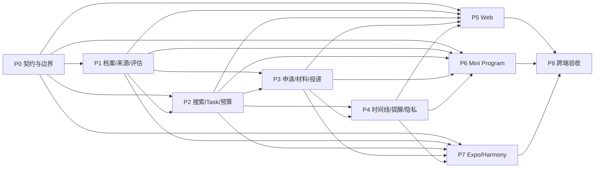

# #140 移植任务 DAG

- 根 Issue：<https://github.com/1123786563/WeKnora-fork01/issues/140>
- 树读取：2026-09-28（Asia/Shanghai），认证 GitHub REST API，递归读取 `sub_issues` 与 Issue 正文/评论，全量分页。
- 完整性：34 个唯一节点（#140 + 33 个正式直接子 Issue），33 条 contains 边；无嵌套子 Issue、重复或不可读节点；所有 Issue 为 open、`ready-for-agent`；评论均为空。最新 Issue 更新早于 2026-09-24 快照。
- 起始 BASE：`db234c5eb171f2dde7427d382b55b503a038f879`，`.worktrees/issue30-sweep` 的 `codex/issue30-mobile-office` 已提交 HEAD。工作区 5 个未跟踪文件不纳入、不复制、不清理。
- GitHub 正式依赖 API 当前无可用 dependency detail；depends_on 以每个 Issue 正文 `Blocked by` 为据。普通引用不构成依赖。根正文的 43 条故事由下方票据验收映射覆盖。
- 来源记录：认证 API 递归审计报告由 `issue140_issue_audit` 于 2026-09-28 返回；内容与 `2026-09-24-issue-140-dag.md` 相符。
- 执行计划：[`../../superpowers/plans/2026-09-28-issue-140-main-port.md`](../../superpowers/plans/2026-09-28-issue-140-main-port.md)

## DAG 节点与执行波次

这些是“将已批准 #140 能力移植到该起始基线架构”的实施任务，不继承旧集成分支的 verified 状态。每个源 Issue 的验收由映射列指向；代码验证与 Review 必须在本执行基线上重新完成。

| 节点 | source_issues | acceptance | depends_on | owner_role / validator_role | owned_files（主要范围） | interfaces | verification | status |
|---|---|---|---|---|---|---|---|---|
| P0 边界、契约、执行基线 | #140, #144 | 模块所有权、wire 版本、权限/回执约束、客户端 API 形状固定；保存基线和任务 Ledger | — | architect + implementer / reviewer | `docs/architecture/moves/career.yaml`, `docs/architecture/backend-modules.yaml`, `packages/contracts/src/career/`, `packages/api-client/src/career/` | 客户端以 `createCareerApi(request)` 调用版本化 Career endpoints；服务端从认证上下文取 actor/tenant | 契约 fixture round-trip、契约/API-client 定向测试、architectureguard | pending |
| P1 Career 档案与来源证据 | #141, #142, #146, #147, #149, #150 | 单成员空间；待确认档案事实；JD/来源 observation、完整性与 immutable snapshot；三值硬条件与证据；链接导入不绕登录 | P0 | backend_implementer / backend_validator | `internal/modules/career/profile`, `source`, `opportunity`, `evaluation`, 对应迁移与测试 | Profile confirmation、source observation、opportunity snapshot、eligibility DTO；actor/tenant owner 由服务端推导 | Go 模块、迁移双方言、owner/tenant isolation、三值评估和不可用来源测试 | pending |
| P2 搜索、WorkBench Task 与预算准入 | #143, #144, #145, #148, #151, #152, #154, #155, #161 | 单次搜索与显式持续规则；准入使用既有预算/Workbench；每申请一 Task；未知创建结果用同 request ID 恢复；额度耗尽可读历史 | P0, P1 | backend_implementer / backend_validator | `internal/modules/career/search`, `rule`, `admission`, `internal/modules/workbench` adapter、集中容器/路由接线 | `AdmissionCoordinator.Start` 与 Workbench TaskBudget port；Career API request receipt 保存原请求 ID | 幂等重放、额度拒绝不影响读取、Task 一对一和 owner scope 测试 | pending |
| P3 申请、材料版本与本人投递 | #153, #155, #158, #159 | 固定岗位快照；从确认事实生成结构化草稿；真实 PDF/DOCX 成对验证后发布不可变版本；投递由本人完成且绑定渠道/时间/版本或 unknown | P1, P2 | backend_implementer / backend_validator | `internal/modules/career/application`, `material`, `submission`; `packages/contracts/src/career` additions if needed | `Application` binds one opportunity snapshot and one Workbench Task; material version has body digest and export artifact refs | version immutability、digest、PDF/DOCX inspection、未知版本和重复投递回执测试 | pending |
| P4 申请时间线、提醒、规则与隐私生命周期 | #156, #157, #160, #162 | 追加事件及可追溯更正；事件投影阶段；站内 todo 去重；通知最小化；完整导出及删除撤销旧访问 | P2, P3 | backend_implementer / backend_validator | `internal/modules/career/timeline`, `reminder`, `privacy`, migrations/tests | request ID + expected revision；Artifact/Task revoke ports；旧事件不可覆盖 | 并发 revision、幂等、导出内容、旧授权撤销与删除后访问测试 | pending |
| P5 Web 移植 | #141–#142, #146–#162 | 使用当前 Web 路由、TDesign、i18n/data seams 实现档案、搜索/评估、申请/材料/时间线、规则/隐私；所有冲突/unknown/recovery 状态可见 | P0–P4 | frontend_implementer / frontend_validator | `apps/web/src/career/`, route/shell registries, Career i18n resources, focused tests | canonical `CareerApi` DTO/client；不直接调用 raw HTTP 或复用旧 UI | Career Web tests + `pnpm test:web` + `pnpm typecheck:web` + production build | pending |
| P6 Mini Program 移植 | #144, #148, #164, #166, #169, #170, #173 | 当前 feature/subpackage 和 Taro platform adapters；TDesign Miniprogram 可见控件或经记录的原生例外；作用域缓存清理、文件下载、恢复安全 | P0–P4 | frontend_implementer / frontend_validator | `apps/miniprogram/src/features/career/`, `src/subpackages/career`, app routes/config, platform adapters, focused tests | canonical CareerApi；Taro scope/transport/files/notification seams | package tests、typecheck、token check、weapp build；DevTools/真机验收单独记录 | pending |
| P7 Expo / Harmony client 与原生门 | #143, #145, #163, #165, #167, #168, #171, #172 | 同一身份、Task、材料/事件/规则/隐私事实；平台能力经 adapters；iOS/Android/Harmony 全链路有真实证据，缺环境显式 blocked | P0–P4 | frontend_implementer / frontend_validator | `apps/mobile/src/career/`, composition/API adapters/screens/native integration tests | canonical CareerApi + `packages/mobile-core` scope/task/material/vault ports | mobile type/test/build gates；iOS/Android/Harmony native build/device gates separate | pending |
| P8 跨端验收与发布闸 | #140, #172 | 43 条故事覆盖；Web、Expo iOS/Android、Harmony 原生、小程序一致性及恢复；发布/来源/隐私运营门槛如实列明 | P0–P7 | implementer / backend_validator + frontend_validator | `docs/plans/issue-140/verification/`, final reports | 已审查并集成的 API/客户端成果 | 仓库级测试、设备矩阵、独立 reviewer、OCR 完整范围报告 | pending |

### 依赖 DAG



P5/P6/P7 仅在其实际 API 依赖已 verified 并集成后启动对应领域页面。表中的 P0–P4 写入范围彼此有 Go API/module/migration/contract 共享状态，先串行完成；客户分层是稳定后可独立的三个工作树。

## GitHub 业务依赖（contains 与 depends_on 分开）

`contains`: #140 → 每个 #141–#173；除此之外没有正式子关系。`depends_on` 来自 Issue 正文 `Blocked by`：

```text
#144 <- #143,#145; #146 <- #141; #147 <- #141; #149 <- #146; #150 <- #146
#151 <- #152; #152 <- #149,#150; #153 <- #147,#155; #154 <- #152; #155 <- #150
#156 <- #159; #157 <- #155; #158 <- #142,#153; #159 <- #158,#157; #160 <- #154,#157
#161 <- #154,#153; #162 <- #158,#157; #163 <- #144,#152; #164 <- #148,#152
#165 <- #159,#163; #166 <- #148,#159,#164; #167 <- #156,#165
#168 <- #154,#160,#161,#163; #169 <- #156,#166
#170 <- #154,#160,#161,#164; #171 <- #162,#163
#172 <- #151,#165,#166,#167,#169,#168,#170,#171,#173; #173 <- #162,#164
```

拓扑波次：G0 #141,#142,#143,#145,#148；G1 #144,#146,#147；G2 #149,#150；G3 #152,#155；G4 #151,#153,#154,#157,#163,#164；G5 #158,#160,#161；G6 #159,#162,#168,#170；G7 #156,#165,#166,#171,#173；G8 #167,#169；G9 #172。G0 中的不同票据只有在代码文件、接口和共享测试资源隔离后才能并发。

## #140 根验收映射

| 根故事 | 来源票据 | 根故事 | 来源票据 | 根故事 | 来源票据 |
|---|---|---|---|---|---|
| 1–6 身份、空间、档案、确认事实 | #141,#147,#163,#164 | 7–9 JD/分享导入 | #146,#149,#163,#164 | 10–16 搜索、来源、快照 | #149,#151,#152 |
| 17–21 硬条件、证据与覆盖决策 | #150 | 22–23 申请与不可变 JD | #155 | 24–29 材料、版本、双格式 | #153,#158,#165,#166 |
| 30 准备草稿 | #156 | 31–33 本人投递及未知版本 | #159 | 34–35 进展事件与阶段 | #157,#167,#169 |
| 36–37 提醒与隐私 | #160 | 38–39 额度准入与只读历史 | #161,#168,#170 | 40 导出删除和授权撤销 | #162,#171,#173 |
| 41 未知操作恢复 | #141,#155,#157,#159 | 42 scope/cache/迟到响应 | #163–#173 | 43 来源与时间审计 | #149,#151,#157 |

## 自检

- 唯一性：34 个 Issue 与 33 条 contains；P0–P8 9 个移植节点。depends_on 引用都指向已有子 Issue；无自环。
- 无循环：GitHub 正式依赖拓扑覆盖 33 个子节点、0 循环；移植节点图按 P0→P1/P2→P3→P4→clients→P8 拓扑覆盖。
- 范围外：#30、#72、#106 不纳入开发；只依赖所选已提交 BASE 中实际存在的架构能力。
- 未继承旧实施状态：旧集成分支、旧 DAG、旧 OCR 报告均是行为/来源证据，不能替代该移植的 Review、验证或设备验收。
