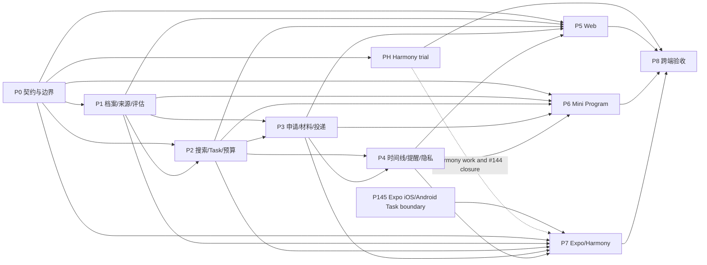

# #140 移植任务 DAG

- 根 Issue：<https://github.com/1123786563/WeKnora-fork01/issues/140>
- 树读取：2026-09-28（Asia/Shanghai），认证 GitHub REST API，递归读取 `sub_issues` 与 Issue 正文/评论，全量分页。
- 完整性：34 个唯一节点（#140 + 33 个正式直接子 Issue），33 条 contains 边；无嵌套子 Issue、重复或不可读节点；所有 Issue 为 open、`ready-for-agent`；评论均为空。最新 Issue 更新早于 2026-09-24 快照。
- 起始 BASE：`db234c5eb171f2dde7427d382b55b503a038f879`，`.worktrees/issue30-sweep` 的 `codex/issue30-mobile-office` 已提交 HEAD。工作区 5 个未跟踪文件不纳入、不复制、不清理。
- GitHub 正式依赖 API 当前无可用 dependency detail；depends_on 以每个 Issue 正文 `Blocked by` 为据。普通引用不构成依赖。根正文的 43 条故事由下方票据验收映射覆盖。
- 来源记录：认证 API 递归审计报告由 `issue140_issue_audit` 于 2026-09-28 返回；内容与 `2026-09-24-issue-140-dag.md` 相符。
- 执行计划：[`../../superpowers/plans/2026-09-28-issue-140-main-port.md`](../../superpowers/plans/2026-09-28-issue-140-main-port.md)

## DAG 节点与执行波次

这些是“将已批准 #140 能力移植到该起始基线架构”的实施任务，不继承旧集成分支的 verified 状态。每个源 Issue 的验收由映射列指向；代码验证与 Review 必须在本执行基线上重新完成。

| 节点 | source_issues | acceptance | depends_on | owner_role / validator_role | owned_files（主要范围） | interfaces | verification | status |
|---|---|---|---|---|---|---|---|---|
| P145 Expo iOS/Android authenticated Task boundary | #145 | Issue #145 has no blockers and is independent of PH/#143, Career API and P0–P4. Open one authorized existing Task in iOS/Android; reject unauthenticated/cross-Tenant reads; verify scope revocation/late response, navigation, file, share, notification and secure-storage adapter probes; record real target evidence | — | frontend_implementer / frontend_validator | `packages/mobile-core/src/task-office/**`, `apps/mobile/src/task-office/native-boundary/**`, focused tests/evidence | Existing Expo app + Mobile Runtime scope lease + authorized Task public read; no Career API | `MobileTaskOffice_PublicSeam_RejectsCrossTenantAndRestoresSameTask`; iOS and Android real build/device probe matrix; independent review/integration before Task 9 | pending |
| PH Harmony 原生可行性先行闸口 | #143 | HarmonyOS/toolchain/Expo SDK/RN/模块兼容矩阵；真实原生适配、构建、认证 Task 和能力探针，或最小复现/日志/影响票据/技术裁定；明确区别 Android 兼容与 WebView | P0 文档基线；Harmony-inclusive 下游前置 | frontend_implementer / frontend_validator | `docs/plans/issue-140/verification/harmony-feasibility.md` + 专属原生试验产物 | Expo/Mobile Runtime + authenticated Workbench Task read；不改 Career 业务合同 | exact commands/versions/device/logs; login/scope/file/share/notification/storage; independent ruling | pending |
| P0 边界、契约、执行基线与共享 Career Desk | #140 | 模块所有权、wire 版本、权限/回执约束、客户端 API 形状固定；新增平台无关 `@weknora/career-core`；保存基线和任务 Ledger | — | architect + implementer / reviewer | `docs/architecture/moves/career.yaml`, `docs/architecture/backend-modules.yaml`, `packages/contracts/src/career/`, `packages/api-client/src/career/`, `packages/career-core/**` | `packages/contracts` owns decoded DTOs；`packages/api-client` owns HTTP；Career Desk owns open/list/act/observe、revisions、durable pending-intent reconciliation、scope invalidation；ADR 0019；Web 不依赖 `mobile-core`，Mobile 可适配 scope lease | Career-core tests freeze seam before clients: persist original ID before write, unknown same-ID reconciliation, explicit conflict rebase, scope invalidation/late response rejection; DTO/API fixtures and architectureguard | pending |
| P1 Career 档案、来源证据与 Artifact grant | #141, #142, #146, #147, #149, #150 | 单成员空间；待确认档案事实；JD/来源 observation、完整性与 immutable snapshot；三值硬条件与证据；链接导入不绕登录；固定 tenant/owner/resource/version 的短时 Artifact grant，下载时重检权限/撤销 | P0 | backend_implementer / backend_validator | `internal/modules/career/profile`, `source`, `opportunity`, `evaluation`; Workbench Artifact authority/adapter、对应迁移与测试 | Profile confirmation、source observation、opportunity snapshot、eligibility DTO；Artifact grant binds exact immutable version；actor/tenant owner 由服务端推导 | Artifact API tests: valid download; cross-tenant/expired/tampered/revoked/deleted rejection; download-time auth recheck; existing Task artifact download regression; Go/migration/owner tests | pending |
| P2 搜索、Workbench Task、预算与来源 reconciliation | #148, #151, #152, #154, #155, #161 | 搜索/持续规则/预算准入/每申请一 Task/同 key 恢复；#151 强证据去重、JD 变化与覆盖；为 Expo #144 提供已授权 existing Task 公共读取/API 依赖（#144 产品 slice 不归属后端 P2） | P0, P1 | backend_implementer / backend_validator | `internal/modules/career/search`, source reconciliation, `rule`, `admission`, Workbench adapter/接线 | `AdmissionCoordinator.Start` / `TaskBudgetPort`; #144 只消费这里提供的 Task read/auth seam；source reconciliation/change/coverage view model | `TestSearch_ReconcilesOnlyStronglySupportedDuplicateBatches`; `TestSearch_KeepsUncertainDuplicatesSeparate`; `TestSource_PreservesURLsAndCheckTimes`; `TestSource_AnnotatesChangedExpiredAndRemovedJDsWithoutChangingApplicationSnapshot`; `TestSearch_ReportsConnectedSourcesAndCityCoverage`; `TestSourceFailure_PreservesLastSuccessAndStaleTime`; existing #144 Task auth/read API contract; 幂等/额度/Task 关联测试 | pending |
| P3 申请、材料版本与本人投递 | #153, #155, #158, #159 | 固定岗位快照；从确认事实生成结构化草稿；真实 PDF/DOCX 成对验证后发布不可变版本；投递由本人完成且绑定渠道/时间/版本或 unknown | P1, P2 | backend_implementer / backend_validator | `internal/modules/career/application`, `material`, `submission`; `packages/contracts/src/career` additions if needed | `Application` binds one opportunity snapshot and one Workbench Task; material version has body digest and export artifact refs | version immutability、digest、PDF/DOCX inspection、未知版本和重复投递回执测试 | pending |
| P4 申请准备、时间线、提醒、规则与隐私生命周期 | #156, #157, #160, #162 | Task 6 owns `internal/modules/career/preparation/**` and `CareerPreparationService/API` after Task 5 submission; confirmed facts + immutable job snapshot, actual submitted version/explicit unknown, editable sources, failure recovery/no send; plus append-only timeline, reminders, export/delete | P2, P3 | backend_implementer / backend_validator | `internal/modules/career/preparation`, `timeline`, `reminder`, `privacy`, migrations/tests | Task 5 submission record is the input; Task 6 is sole preparation owner | `TestPreparation_UsesConfirmedFactsAndImmutableJobSnapshot`; `TestPreparation_UsesActualSubmittedV2NotLatestV3`; `TestPreparation_UnknownSubmittedVersionRemainsUnknown`; `TestPreparation_SourcesAreVisibleAndEditable`; `TestPreparation_ModelFailureRetainsRequestForRecovery`; lifecycle tests | pending |
| P5 Web 移植 | #141, #146, #147, #149–#162 | Web consumes shared Career Desk for open/list/act/observe/reconcilePending, revision and scope invalidation; Web supplies ports/presentation; includes #156 preparation and #151 source evidence | P0–P4 | frontend_implementer / frontend_validator | `apps/web/src/career/`, route/shell registries, Career i18n resources, tests | decoded CareerApi DTO/HTTP plus `@weknora/career-core`; no copied Desk logic or `mobile-core` dependency | `WebCareerDesk_Assembly_ScopeSwitchReconcilesUnknownAndDropsLateReplies`; preparation and source E2E; Web tests/typecheck/build | pending |
| P6 Mini Program 移植 | #148, #164, #166, #169, #170, #173 | Career Desk consumer; Taro supplies scope/intent-store/platform adapters only. #169 explicitly owns shared-order timeline, traceable corrections, interview/cover-letter preparation tied to actual submitted version or unknown prompt, account-switch cache invalidation and real WeChat verification. Sequence #166 application/material/submission before #169 timeline/preparation | P0–P4; #156 from P4 and #166 slice before #169 within P6 | frontend_implementer / frontend_validator | `apps/miniprogram/src/features/career/`, `src/subpackages/career`, app routes/config, Taro adapters/tests | CareerApi decoded DTO/HTTP + shared Career Desk `open/list/act/observe/reconcilePending` and scope invalidation; Taro adapters map scope, persist intent, expose platform capabilities | `MiniCareerDesk_Assembly_ScopeSwitchInvalidatesPendingIntentsAndDropsLateReplies`; `MiniTimeline_ShowsCrossClientOrderAndCorrectionHistory`; `MiniPreparation_UsesSubmittedVersionOrPromptsWhenUnknown`; `MiniCareer169_AccountSwitchClearsPriorTimelineAndPreparationCache`; `Mini169_WeChatDevToolsAndDevice_TimelineCorrectionAndPreparationKnownUnknown`; Mini build/DevTools/device evidence | pending |
| P7 Expo Career / #144 Task Office 与 Harmony 条件分支 | #144, #163, #165, #167, #168, #171, #172 | #144 consumes verified P145/#145 boundary and PH/#143 ruling; add authorized existing Task entry, same Task restart without creation, scope/late-response invalidation and governed offline cache/unavailable. iOS/Android work may proceed after P145 without PH; #144 cannot close until both P145 and PH; Harmony-specific implementation/evidence waits for PH | P0–P4, P145; PH is conditional gate for Harmony work and #144 closure | frontend_implementer / frontend_validator | `apps/mobile/src/career/`, `apps/mobile/src/task-office/career-entry/**`, native tests | shared Career Desk + verified P145 `packages/mobile-core` TaskOffice/runtime seam; Mobile scope lease and platform ports | #144 named Expo TaskOffice entry/restart/scope/offline tests; actual iOS/Android behavior; Harmony native claims separately gated | pending |
| P8 跨端验收与发布闸 | #140, #172 | 43 条故事覆盖；Web、Expo iOS/Android、Harmony 原生、小程序一致性及恢复；发布/来源/隐私门槛如实列明 | P0–P7；PH/#143 必须有 ruling；P145 evidence 通过 P7 集成 | implementer / backend_validator + frontend_validator | `docs/plans/issue-140/verification/`, final reports | 已审查并集成成果 | 仓库级测试、设备矩阵、独立 reviewer、OCR 完整范围报告 | pending |

### 依赖 DAG



P5/P6/P7 仅在其实际 API 依赖已 verified 并集成后启动对应领域页面。表中的 P0–P4 写入范围彼此有 Go API/module/migration/contract 共享状态，先串行完成；客户分层是稳定后可独立的三个工作树。

## GitHub 业务依赖（contains 与 depends_on 分开）

`contains`: #140 → 每个 #141–#173；除此之外没有正式子关系。`depends_on` 来自 Issue 正文 `Blocked by`：

```text
#144 <- #143,#145; #146 <- #141; #147 <- #141; #149 <- #146; #150 <- #146
#151 <- #152; #152 <- #149,#150; #153 <- #147,#155; #154 <- #152; #155 <- #150
#156 <- #159; #157 <- #155; #158 <- #142,#153; #159 <- #158,#157; #160 <- #154,#157
#161 <- #154,#153; #162 <- #158,#157; #163 <- #144,#152; #164 <- #148,#152
#165 <- #159,#163; #166 <- #148,#159,#164; #167 <- #156,#165
#168 <- #154,#160,#161,#163; #169 <- #156,#166
#170 <- #154,#160,#161,#164; #171 <- #162,#163
#172 <- #151,#165,#166,#167,#169,#168,#170,#171,#173; #173 <- #162,#164
```

拓扑波次：G0 #141,#142,#143,#145,#148；G1 #144,#146,#147；G2 #149,#150；G3 #152,#155；G4 #151,#153,#154,#157,#163,#164；G5 #158,#160,#161；G6 #159,#162,#168,#170；G7 #156,#165,#166,#171,#173；G8 #167,#169；G9 #172。G0 中的不同票据只有在代码文件、接口和共享测试资源隔离后才能并发。

## #140 根验收映射

| 验收范围 | 精确任务 / 验证证据 |
|---|---|
| #145 Expo iOS/Android authenticated Task boundary; no blockers | P145 independent early task; does not depend on PH/#143 or P0–P4; real iOS/Android build/device evidence and `MobileTaskOffice_PublicSeam_RejectsCrossTenantAndRestoresSameTask` |
| #144 Expo Task Office entry/recovery: authorized existing Task, same-Task restart, scope/late-response rejection and governed offline state | P7/Task 9 consumes verified P145 plus PH/#143 ruling; named Expo entry/restart/scope/offline tests; issue closes only after both blockers are resolved |
| #169 Mini timeline and preparation: shared event order, traceable correction, actual submitted version or unknown prompt, account-switch cache isolation, WeChat DevTools + device evidence | P6/Task 8 after #156 service and #166 mini application/material slice; named MiniTimeline/MiniPreparation/AccountSwitch tests and `Mini169_WeChatDevToolsAndDevice_TimelineCorrectionAndPreparationKnownUnknown` |
| #142 固定版本 Artifact grant：tenant/owner/resource/version 绑定；下载重验授权/撤销；拒绝跨 tenant、过期、篡改、撤销/删除；现有 Task 下载继续工作 | P1 Workbench Artifact authority/adapter；公共接口测试覆盖上述拒绝和成功路径，并校验现有 Task 下载回归及真实 Web 下载摘要 |
| #143 Harmony 原生兼容性：原生/Android 兼容/WebView 区分、系统/SDK/toolchain matrix；真实构建和认证 Task/端能力探针，或最小复现+失败证据+受影响票据/ruling | PH `docs/plans/issue-140/verification/harmony-feasibility.md`；先行试验并由独立 validator 核验；Harmony 下游仅依据试验 ruling 放行/阻塞 |
| #151 多来源 reconciliation：强 job/employer/location/batch 才合并；不确定重复分列；保存每 URL/check time；JD 变更/过期/下架且历史 snapshot 不变；显示 source/city coverage；失败保留 last success/stale time | P2: `TestSearch_ReconcilesOnlyStronglySupportedDuplicateBatches`, `TestSearch_KeepsUncertainDuplicatesSeparate`, `TestSource_PreservesURLsAndCheckTimes`, `TestSource_AnnotatesChangedExpiredAndRemovedJDsWithoutChangingApplicationSnapshot`, `TestSearch_ReportsConnectedSourcesAndCityCoverage`, `TestSourceFailure_PreservesLastSuccessAndStaleTime`; P5: `SourceEvidencePage_E2E_ShowsChangeDiffCoverageAndStaleTime` |
| #156 求职信/面试准备：只引用 confirmed facts + immutable job snapshot；采用实际投递版本且未知显式；来源可见/可编辑；模型失败可恢复；不发送、不代替用户承诺 | Task 6/P4: `TestPreparation_UsesConfirmedFactsAndImmutableJobSnapshot`, `TestPreparation_UsesActualSubmittedV2NotLatestV3`, `TestPreparation_UnknownSubmittedVersionRemainsUnknown`, `TestPreparation_SourcesAreVisibleAndEditable`, `TestPreparation_ModelFailureRetainsRequestForRecovery`; P5: `PreparationPage_E2E_ShowsSourcesAndAllowsDraftRevision`, `PreparationPage_E2E_ModelFailureOffersRecovery` |
| 1–6 身份、空间、档案、确认事实 | #141,#147,#163,#164 → P1/P5/P7；服务端 owner/tenant 测试和 scope tests |
| 7–9 JD/分享导入 | #146,#149,#163,#164 → P1/P5/P6/P7 |
| 10–16 搜索、来源、快照 | #149,#151,#152 → P1/P2/P5 source evidence tests |
| 17–21 硬条件、证据与覆盖决策 | #150 → P1 tri-state/hard-conflict tests |
| 22–23 申请与不可变 JD | #155 → P2/P3 snapshot binding tests |
| 24–29 材料、版本、双格式 | #153,#158,#165,#166 → P3 + client version/digest tests |
| 30 准备草稿 | #156 → Task 6/P4 service/API, P5 Web E2E, P6 #169 Mini preparation known/unknown tests |
| 31–33 本人投递及未知版本 | #159 → P3 submission tests |
| 34–35 进展事件与阶段 | #157,#167 → P4/P7；#169 → P6 Mini timeline/order/correction tests |
| 36–37 提醒与隐私 | #160 → P4 reminder/privacy tests |
| 38–39 额度准入与只读历史 | #161,#168,#170 → P2/P4 budget/read tests |
| 40 导出删除和授权撤销 | #162,#171,#173 → P4 export/revocation tests |
| 41 未知操作恢复 | #141,#155,#157,#159 → Career Desk + service receipt tests |
| 42 scope/cache/迟到响应 | #163–#173 → Career Desk scope/epoch tests and client adapter tests |
| 43 来源与时间审计 | #149,#151,#157 → source URL/check-time/history tests |

## 自检

- 唯一性：34 个 Issue 与 33 条 contains；P0–P8 共 9 个业务节点，加上独立 PH (#143) 与 P145 (#145) 共 11 个移植节点。depends_on 引用都指向已有子 Issue；无自环。
- 无循环：GitHub 正式依赖拓扑覆盖 33 个子节点、0 循环；移植节点图按 P0→P1/P2→P3→P4→clients→P8；P145 无前置且独立于 PH 与 P0–P4；P145 验证后才进入 P7 的 #144，PH 仅门控 Harmony 工作及 #144 闭合；任务图无循环。
- 范围外：#30、#72、#106 不纳入开发；只依赖所选已提交 BASE 中实际存在的架构能力。
- 未继承旧实施状态：旧集成分支、旧 DAG、旧 OCR 报告均是行为/来源证据，不能替代该移植的 Review、验证或设备验收。
