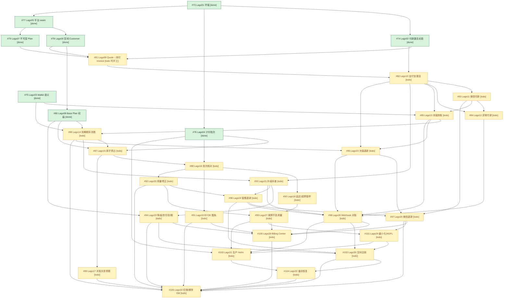

# Issue #72 子 Issue 依赖 DAG（Lago 计费迁移）

> 修订：2026-09-23 第三次修订（#74 实施完成改判 done；T02 裁决②与 75-a2 裁决 B 落地，9 票 blocked 全部转 todo，**阻塞清零、就绪节点=#81**）｜ 分支：`codex/issue-72-lago` ｜ 配套清单：`issue-72-issues-inventory.md`
> 构建规则：父 Issue #72 只提供总体目标与验收，不计入节点；33 个子 Issue 每票一节点（id=`issue-<编号>`）。父子层级=范围归属（33 票均为 #72 直接子票，无嵌套），依赖边=必须先完成的交付，二者不混淆。**只采信 Issue 正文显式声明/调查高置信度的业务与接口边，共 74 条**；medium 边（81→85、81→93：接口推断、票面未声明）因经 82 传递覆盖而未直连——少加不会错杀并行，多加假依赖会。无循环（本轮 Kahn 复验通过），未触发"提取最小公共前置"规则。
> 本次修订三组变化：① **#74 由 todo 改判 done**——上版定稿于 #74 开工前（最终报告 §2.4 已记为可追溯性缺口）；其剩余交付（重跑 `run_lab.py` 收 AC1-AC3 运行时证据）已由本轮实施完成：run11 `5d06a277` 九阶段全 pass → merge `175de8b4f` → 流程验证 run `3dc51207` 21/21 断言 PASS（`docs/plans/issue-72-flow-evidence-74/VERIFY-SUMMARY.txt`，本会话读取核验），OCR 1-3 轮 16 项 findings 清偿；残留仅 GitHub 关票与 OCR-4 治理项（4 medium+1 low）。② **用户裁决落地**：T02 三选一→**选项②（受支持 Provider）**，#81/#82 裁决型阻塞解除；75-a2→**选项 B（协调层承载批次状态机）**（ADR-0012 修订 `552d98d12`），#85 裁决型阻塞解除。③ **派生解锁**：#87/#88/#94/#97/#100/#103 原 blocked 理由仅为"前置 OPEN"（已编码为依赖边）+ 已解除的 #74/#75-a2/T02 悬置，一并转 todo。
> 状态口径：`done`=已有完成证据不重新实施；`todo`=待实施（前置未齐属正常排期）；`blocked`=需外部输入。**本轮 blocked=0**——外部输入已全部闭合（Stripe 密钥已提供并被消费、T02/75-a2 已裁决）。

## 1. Mermaid DAG



未采信边说明：`81→85`、`81→93`（medium 置信接口推断，票面未声明，经 82 传递覆盖）；`73→75`（#75 调查仅声明父 #72，实验栈属平行交付非票面依赖）；`92→102`（waves DAG 行 46 有记录但无 timeline 佐证，经 92→96→102 传递覆盖）。
补记边说明（上版恢复，均为票面显式声明且传递冗余，不改变并行分组）：`80→94`、`94→105`、`97→105`、`102→105`。

## 2. 依赖表（74 条边）

| # | 前置 → 后续 | 原因（业务/接口约束） | 前置须交付 | 证据 |
|---|---|---|---|---|
| 1 | 73→74 | 实验栈直接复用 pinned v1.53.0 compose/镜像锁/健康分类 | 固定版本 Lago 栈+运维命令链 | #74 正文 Blocked by #73；deploy/lago-lab/payment-activation/README.md:4-14 |
| 2 | 73→76 | 四条验收全部需真实 pinned 栈（weknora-lago-76） | 同上 | #76 正文 Blocked by #73 |
| 3 | 73→77 | readiness 快照须打真实 Lago 栈验证 | 同上+operator key 流程 | #77 requirementSummary「被 #73 阻塞」；t05-run.txt |
| 4 | 74→81 | incomplete Subscription 激活机制由 #74 证据+T02 裁决定型（已裁决选项②受支持 Provider） | 付款激活路径运行时证据+裁决结论 | #81 正文 Blocked by #74；t02 DECISION.md（已按裁决②更新）；flow evidence run 3dc51207 |
| 5 | 74→82 | 可信 Payment 录入通道（写 Lago Payment）由 #74 裁决决定（选项②） | 受支持 Payment Provider 激活通道实证 | #82 正文 Blocked by #74；DECISION.md §5；VERIFY-SUMMARY 21/21 |
| 6 | 75→85 | 充值批次 12 个月到期模型由 a2 裁决定稿（已裁决选项 B：协调层承载） | a2 裁决结论+verdict 义务清单 | #85 正文 Blocked by #75；t03 verdict a2 BLOCKED；ADR-0012 修订 552d98d12 |
| 7 | 75→86 | 充值/套餐混合消费顺序以 #75 实测钱包语义为直接输入（到期秩须协调层编码进 priority） | T03 verdict：到期/顺序/撤回语义+协调义务清单 | #86 正文 Blocked by #75；verdict.md 判定 b PASS-WITH-COORDINATION |
| 8 | 76→87 | T04 移交的契约修正（422 读回比对、transaction_id 三元组作用域）是预占幂等对接 Lago usage 的直接输入 | 实测契约修正+subscription-per-task 结论 | #87 正文 Blocked by #76；t04-pricing-group/README.md:79-91 |
| 9 | 76→88 | 事件投递/幂等/批次核对直接采用 T04 结论 | T04 证据与 4 处 v1.53.0 契约修正 | #88 正文 Blocked by #76；waves 文档 L127 |
| 10 | 76→103 | p95≤60s 所测 event-to-reconcilable-batch 负载形态由 T04 定义 | 延迟测量方法学（measure.py） | #103 正文 Blocked by #76；deploy/lago-lab/pricing-group/measure.py:15 |
| 11 | 77→78 | ensure_customer 命令与 account 快照只能定义在 #77 冻结 seam 上（ADR-0014 加法规则） | 冻结 CommercialPlatform seam+双适配器+契约表 | #78 正文 Blocked by #77；platform.go:35/84 |
| 12 | 77→79 | 发布链路走 #77 冻结的 SubmitCommand（新增 kind 常量+类型化载荷） | 冻结 seam+SubmitCommand 通道 | #79 正文 Blocked by #77；lago.go:305 submitPublishPlanVersion |
| 13 | 78→80 | 订阅链复用 #78 的 ensure_customer 与 ExternalCustomerID 身份（seed→account→subscription） | 确定性 Customer 身份+account 懒链 | #80 requirementSummary「#78 ensure_customer → 本票 ensure_subscription」；benefits.go 懒链 |
| 14 | 78→81 | 创建 Subscription 前提是 Customer 已存在 | ensure_customer+身份派生 | #81 正文 Blocked by #78（已满足） |
| 15 | 79→81 | Quote 固定 Plan Version 依赖不可变发布成果 | publish_plan_version+确定性 plan code | #81 正文 Blocked by #79（已满足） |
| 16 | 80→86 | 月度不结转批次建于 #80 的 grant_included_credits 月度短 TTL 钱包 | (tenant,period) 月度钱包+credit batch 注册表 | #86 正文 Blocked by #80 |
| 17 | 80→87 | 空间保守余额基线由 #80 权益/额度投影构成 | benefits 投影+hard_limit 配额 | #87 正文 Blocked by #80 |
| 18 | 80→94 | 生命周期转换复用 #80 确立的同一 ExternalSubscriptionID 订阅连续性与 base 阶梯零价从句 | Base Plan 订阅链+零价语义 | #80 调查记录 #94 正文显式列其为 blocker（传递冗余边，经 86→93→94 覆盖） |
| 19 | 81→82 | 激活前置对象（待付款 Invoice+incomplete Subscription）由 #81 交付 | gating Invoice+incomplete Subscription 创建命令 | #82 正文 Blocked by #81；spec L124 |
| 20 | 82→83 | 微信复用 #82 建成的 Payment Fact→Lago activation→active 链路 | 恰好一次激活编排+三态状态机 | #83 正文 Blocked by #82 |
| 21 | 82→84 | 错金额/多收款判定叠加在 #82 付款→Lago Payment→激活链路上 | Lago Payment 幂等写入路径 | #84 正文 Blocked by #82 |
| 22 | 82→85 | 充值到账复用 #82 渠道付款确认→Lago Payment 记录链路 | 付款确认→Lago 链路 | #85 正文 Blocked by #82 |
| 23 | 82→93 | 新 Entitlement 的付款后 activation 门复用 #82 通道 | Lago activation 通道 | #93 正文 Blocked by #82 |
| 24 | 82→95 | 渠道退款以订单成功支付 Attempt 为出款依据 | 成功支付链路 | #95 正文 Blocked by #82；service refund.go succeededAttempt |
| 25 | 83→84 | 双渠道统一入口须微信链路（#83）先行 | 微信 ConfirmPayment 接入 | #84 正文 Blocked by #83 |
| 26 | 83→85 | 微信充值以 #83 微信付款交付为前提 | 微信付款接入 | #85 正文 Blocked by #83 |
| 27 | 83→97 | 微信退款复用 #83 的微信付款/回调验签链路 | 微信付款事实链路 | #97 正文 Blocked by #83 |
| 28 | 84→98 | Payment/Entitlement 投影收敛目标由 #84 异常付款语义定型 | 异常付款语义 | #98 正文 Blocked by #84 |
| 29 | 85→86 | 充值 12 个月到期与混合消费须先有 #85 充值批次发放对象 | top-up wallet+priority class | #86 正文 Blocked by #85；lago.go:1010 top-up 仅 future 预期 |
| 30 | 85→95 | 撤回的是 #85 已到账的充值 Credits（无到账即无可撤） | 充值到账对象 | #95 正文 Blocked by #85；waves 关键路径 85→86→95 |
| 31 | 85→98 | Wallet 投影权威语义由 #85 定义 | 充值到账语义 | #98 正文 Blocked by #85 |
| 32 | 86→87 | 空间保守余额须 Lago Wallet 权威投影（#86 到期顺序语义先行） | Lago Wallet 权威余额投影 | #87 正文 Blocked by #86（75-a2 悬置已随裁决 B 解除，本边为剩余实质前置） |
| 33 | 86→93 | 补发差额进入 #86 的到期顺序额度池 | wallet 到期顺序语义 | #93 正文 Blocked by #86 |
| 34 | 86→95 | 批准前重核算消费与到期须先有确定消费顺序语义 | 到期顺序消费语义 | #95 正文 Blocked by #86 |
| 35 | 86→105 | 行为矩阵 8 Credits ordering gate 须全绿才能切换 | gate 通过证据 | #105 正文 Blocked by #86 |
| 36 | 87→88 | 结算/释放差额以 #87 已预占调用为对象（无预占则无从结算） | Lago 价格版本上界投影+原子预占 | #88 正文 Blocked by #87 |
| 37 | 87→89 | 并发/委派不变量在 #87 的 Lago 语境预占上验证 | 原子预占+watermark/version 门 | #89 正文 Blocked by #87 |
| 38 | 88→90 | 5 分钟门槛计时与超上界比较依赖 #88 的批次确定金额与 events.errors | current usage 核对+Lago 事件状态 | #90 正文 Blocked by #88 |
| 39 | 88→91 | BYOK 维度过滤须 #88 的 usage→Lago 链路才可观察（LagoAdapter 无 Settle） | Usage Event→Lago→Settlement Batch 链路 | #91 正文 Blocked by #88 |
| 40 | 88→92 | 补偿事件须挂在 #88 的 Settlement Batch/Pricing Group 核对链路上 | 批次核对链路 | #92 正文 Blocked by #88 |
| 41 | 89→105 | 行为矩阵 12 Concurrent admission gate | gate 通过证据 | #105 正文 Blocked by #89 |
| 42 | 90→99 | 堆积时等待/告警（非假成功）依赖 #90 延迟暂停/告警机制 | 5/15 分钟暂停告警 | #99 正文 Blocked by #90 |
| 43 | 91→100 | BYOK 豁免口径决定 Billing Center 费用/余额展示 | BYOK 豁免口径 | #100 正文 Blocked by #91 |
| 44 | 91→105 | 行为矩阵 15 BYOK gate | gate 通过证据 | #105 正文 Blocked by #91 |
| 45 | 92→96 | 退款资格须 #92 的 finalized 前后用量修正权威口径 | 用量修正不改写历史口径 | #96 正文 Blocked by #92；spec L149 |
| 46 | 92→99 | 崩溃恢复不重复计费依赖 #92 修正身份语义（共用 SettlementKey） | 修正身份语义 | #99 正文 Blocked by #92；spec L142/L149 |
| 47 | 92→105 | 行为矩阵 16 Correction gate | gate 通过证据 | #105 正文 Blocked by #92 |
| 48 | 93→94 | 降级/到期切换与升级共用同一订阅链切换协调器（同 ExternalSubscriptionID） | Lago 侧切换协调器 | #94 正文 Blocked by #93；subscription_command.go:44-49 |
| 49 | 93→96 | 套餐退款按 #93 补发后剩余可退权益口径计算 | 升级差额补发口径 | #96 正文 Blocked by #93 |
| 50 | 93→98 | Subscription 投影状态/版本语义由 #93 定义 | 升级切换状态语义 | #98 正文 Blocked by #93 |
| 51 | 94→100 | Billing Center 套餐状态集合含 #94 降级/年付/到期语义 | 生命周期状态语义 | #100 正文 Blocked by #94 |
| 52 | 94→102 | Subscription 终态语义（到期回 Base）由 #94 交付 | 订阅终态语义 | #102 正文 Blocked by #94 |
| 53 | 94→105 | 行为矩阵 17 Plan lifecycle gate | gate 通过证据 | #105 正文 Blocked by #94（传递冗余边，经 100 覆盖） |
| 54 | 95→97 | 复用 #95 的资格核算（P03）与 Refund Lock 模型 | P03 eligibility+三段式退款 | #97 正文 Blocked by #95；refund.go:33-39 默认拒绝 |
| 55 | 95→98 | Payment/Refund Lock 投影状态机由 #95 定义 | 三段式退款状态机 | #98 正文 Blocked by #95 |
| 56 | 96→97 | 复用 #96 的 Credit Note 与撤权恢复模型 | Credit Note+撤权模型 | #97 正文 Blocked by #96 |
| 57 | 96→98 | Credit Note 对象与撤回路径由 #96 交付（五类投影收敛对象之一） | Credit Note 对象 | #98 正文 Blocked by #96 |
| 58 | 96→102 | Credit Note 合规查询对象由 #96 引入 | Credit Note 对象 | #102 正文 Blocked by #96 |
| 59 | 97→100 | 统一退款状态须 #97 微信/支付宝语义对等 | 微信退款状态机 | #100 正文 Blocked by #97 |
| 60 | 97→101 | 端到端审计须覆盖 #97 微信退款链路 | 微信退款完整链路 | #101 正文 Blocked by #97 |
| 61 | 97→105 | 行为矩阵 18 Refund gate（微信/支付宝对等） | gate 通过证据 | #105 正文 Blocked by #97（传递冗余边，经 100 覆盖） |
| 62 | 98→100 | 『等待同步』状态须 #98 对账收敛机制存在才真实可展示 | Webhook+对账收敛 | #100 正文 Blocked by #98 |
| 63 | 98→102 | 注销终态须经 #98 对账收敛证明 | 对账收敛机制 | #102 正文 Blocked by #98（Reconcile 现冻结） |
| 64 | 98→103 | Webhook 指标与告警以 #98 对账语义为输入 | 对账语义 | #103 正文 Blocked by #98 |
| 65 | 99→100 | 预占分区可靠性前提是 #99 故障安全（不提前释放） | 故障安全语义 | #100 正文 Blocked by #99 |
| 66 | 99→101 | AC2 验证须 #99 的可靠 usage→Lago 链路 | usage→Lago 链路 | #101 正文 Blocked by #99 |
| 67 | 99→103 | 告警阈值与恢复配置由 #99 故障语义决定 | 故障语义 | #103 正文 Blocked by #99 |
| 68 | 100→105 | 行为矩阵 21/UI 稳定状态 seam：切换后用户可见状态须已收敛 | Billing Center 收敛 | #105 正文 Blocked by #100；spec:210 |
| 69 | 101→102 | 去标识化范围须 #101 数据最小化决定 | 最小化/保留决定 | #102 正文 Blocked by #101 |
| 70 | 101→103 | AGPL 上线门槛是生产部署法律前置门 | AGPL 批准记录 | #103 正文 Blocked by #101；spec L179-180 |
| 71 | 102→104 | 恢复对象集与对账断言须 #102 注销语义完整 | 注销对象语义 | #104 正文 Blocked by #102 |
| 72 | 102→105 | 空间注销行为 gate（spec:178 lifecycle） | gate 通过证据 | #105 正文 Blocked by #102（传递冗余边，经 104 覆盖） |
| 73 | 103→104 | 恢复演练须 #103 生产级拓扑（staging 演练前置） | 生产 Helm 拓扑 | #104 正文 Blocked by #103 |
| 74 | 104→105 | 行为矩阵 23 restore gate 直接对应切换验收 | staging 恢复演练证据 | #105 正文 Blocked by #104；waves L50 blockers 列表含 104 |

## 3. 拓扑顺序（业务波次对齐，非编号序）

```
issue-73, issue-75, issue-74, issue-76, issue-77, issue-78, issue-79, issue-80,
issue-81, issue-82, issue-83, issue-84, issue-85, issue-86,
issue-87, issue-88, issue-89, issue-90, issue-91, issue-92, issue-93,
issue-94, issue-95, issue-96, issue-99, issue-97, issue-98,
issue-100, issue-101, issue-102, issue-103, issue-104, issue-105
```

排序原则：已完成的基座（#73/#75/#74/#76-#80，T01-T08+#74 实施轮）居首；再按购买主链（81→82→83→84/85→86）→ 准入与计价链（87→88→89/90/91/92）→ 生命周期与退款（93→94→95/96→97/98/99）→ 展示与合规（100/101）→ 部署收尾（102/103→104→105）。校验：本轮 python3 Kahn 复验无环 + 本序 74 条边**零违例**（见 §7）。**#81 为当前唯一可立即开工节点**（前置 #74/#78/#79 全 done，T02 已裁决②）。

## 4. 可并行分组（就绪波次）与文件改动范围

> 分组 = 同一波次内节点两两无依赖边，且全部前置在 prior 波次末完成（done 节点 collapsed 为基座）。执行按边驱动：节点在前置全完成的任意时刻即可开工，不要求波次同步对齐；同波次节点保证互不依赖，可安全并行（文件冲突评估见各行）。**当前就绪：W1 的 #81（唯一）**。

| 波次 | 节点 | 预期文件改动范围（供并行冲突评估） |
|---|---|---|
| 基座（done，8 票） | 73,74,75,76,77,78,79,80 | 无需改动（#74 证据/账本已在集成分支） |
| W1 | **81**（todo，**可立即开工**：T02 裁决②+三前置全 done） | `internal/modules/commercial/platform.go`(加法命令)+新 invoice 命令文件、`commercialplatform/{lago.go,fake.go,contract_test.go}`、`service/commercial/{order.go,quote.go}`、`internal/handler/commercial.go`、`internal/router/routes_commercial.go`、`packages/contracts/src/commercial.ts`、`apps/web/src/commercial/CheckoutPage.tsx`、`migrations/{versioned,sqlite}` |
| W2 | **82** | `internal/modules/commercial/{fulfillment.go,order.go}`、`service/commercial/{order.go,fulfillment.go}`、`repository/commercial/{order.go,outbox.go}`、`handler/payment_callbacks.go`、`commercialplatform/lago.go`(RecordPayment/activation_rules)、`packages/contracts/src/commercial.ts`(三态)、`apps/web/src/commercial/order-state.ts`、支付宝沙箱证据目录 |
| W3 | **83** | `payment/wechat.go`(+Create/Query/Close/Refund 单测)、`service/commercial/order.go`(关单恢复接线)、`handler/payment_callbacks.go`(+HTTP 测试)、`deploy/lago-lab/` 新微信实验栈 |
| W4 | **84**, **85** | 84: `handler/payment_callbacks.go`、`service/commercial/order.go`、`repository/commercial/order.go`、`contracts/commercial.ts`、`order-state.ts`、over_payment 处置。85: `commercialplatform/lago.go`(top-up wallet，按裁决 B 到账时刻幂等创建)、`subscription_command.go`/新 topup 命令、`service/commercial/{fulfillment.go,order.go}`、`CheckoutPage/BillingPage.tsx`、`contracts/commercial.ts`、migrations。⚠️ 冲突：`service/commercial/order.go`+`contracts/commercial.ts` 双方都改，需按区块划分或串行合并 |
| W5 | **86** | `commercialplatform/lago.go`(priority 到期秩)、`service/commercial/benefits.go`、`internal/handler/commercial.go`(余额分解端点)、`packages/{contracts,api-client}/src/commercial.ts`、`apps/web/src/commercial/BillingPage.tsx`（月度维度不依赖 #85，可与 W4 尾部重叠开工） |
| W6 | **87**, **93**, **95** | 87: `platform.go`(价格投影快照)、`commercialplatform/lago.go`、`service/commercial/execution.go`、`repository/commercial/budget_reservation.go`、`internal/application/service/{semantic_model_budget.go,remote_usage.go}`(fail-closed 修正)、`TaskBudget/BillingPage.tsx`、contracts、`budget_pg_test.go` fixture。93: `commercialplatform/lago.go`(plan 切换)、`subscription_command.go`、`service/commercial/{order.go,fulfillment.go}`、plans/change 路由/前端入口。95: `refund.go` 系、`commercialplatform/lago.go`(void/wallet_transactions)、`handler/commercial.go`(接线非 nil)、`RefundPage.tsx`。⚠️ 冲突：三者共改 `lago.go` 与 `platform.go` 命令族（加法 kind），建议命令常量分文件或按序合并 |
| W7 | **88**, **89**, **94** | 88: `platform.go`(usage 命令)、`commercialplatform/lago.go`(events/current_usage)、`service/commercial/settlement.go`、`repository/commercial/{usage.go,outbox.go}`、`internal/container/container.go`(settlement worker)。89: `repository/commercial/{budget_reservation.go,budget_task.go}`、`service/commercial/execution.go`、`appconnector/adapter.go`、workbench。94: `service/commercial/lifecycle.go`、`container.go`(tick worker 装配)、`service/commercial/benefits.go`(年付月发)、`subscription_command.go`。⚠️ 冲突：88/89 可能同碰 `execution.go`/settlement 接口；94 独立性最好；88/94 均动 `container.go` 装配段 |
| W8 | **90**, **91**, **92** | 90: `service/commercial/settlement.go`(delta>upper)、新暂停状态机/轮询、告警、contracts(waiting-for-billing-sync)、apps/web。91: `commercial/usage.go`、`repository/commercial/usage.go`、`semantic_model_{budget,policy}.go`、`craft_model_gateway.go`(复核收紧)。92: `commercialplatform/lago.go`(补偿事件/Credit Note)、`platform.go`(新命令)、人工核对队列(新迁移+API)。⚠️ 冲突：90/92 同碰 settlement/usage 家族 |
| W9 | **96**, **99** | 96: `refund.go` 系、`commercialplatform/lago.go`(Credit Note)、contracts。99: `deploy/lago-lab/` 新故障注入栈、`service/commercial/settlement.go`、`recovery.go`、readiness 联动闸门。低冲突（99 以 deploy/测试为主） |
| W10 | **97**, **98** | 97: `payment/wechat.go`(REFUND.* 通知+退款测试)、`service/commercial/refund.go`(微信映射)、微信退款场景证据。98: 新 inbox/游标/审计迁移、`platform.go` Reconcile 实现、`commercialplatform/{lago.go,fake.go,contract_test.go}`、对账 worker、`internal/handler`(webhook 路由)、`deploy/lago`(webhook 配置)。低冲突（领域不同；98 体量大） |
| W11 | **100**, **101** | 100: `apps/web/src/commercial/*`(Billing Center)、`packages/{contracts,api-client}`、`internal/handler/commercial.go`(余额四分区端点)。101: `docs/`(AGPL 法务/Community-Premium 清单)、端到端审计脚本/证据、`deploy/lago/README.md`。低冲突 |
| W12 | **102**, **103** | 102: `internal/handler/tenant.go`(DeleteTenant 集成)、`platform.go`(close/terminate 命令)、`commercialplatform/{lago.go,fake.go}`、新迁移(终态/去标识)、router 守卫。103: `helm/`(Lago chart)、监控告警配置、容量/备份。低冲突（后端 vs 部署） |
| W13 | **104** | `deploy/lago/lago.sh`(backup/restore)、演练脚本+`docs/migrations/lago/` 证据、对账校验 |
| W14 | **105** | 删 `internal/modules/commercial/openmeter/`、`internal/container/container.go`、`internal/modules/commercial/config.go`、删 `deploy/openmeter/`、docs deprecated 标记、24 项 gate 证据归档 |

热点文件并行预警：`commercialplatform/lago.go`（81/82/85/86/87/88/92/93/95/96/98/102 都可能改动）、`service/commercial/order.go`（81/82/84/85/93）、`packages/contracts/src/commercial.ts`（81/82/84/85/86/90/93/96/100）、`platform.go`（81/87/88/92/98/102，均为 ADR-0014 冻结 seam 的加法扩展）、`internal/handler/commercial.go`（81/84/86/95/100）。同波次并行分支建议：seam 命令常量/载荷各自独立文件提交，`lago.go` 按方法分块，合并顺序按波次编号串行合入主干。

## 5. 阻塞节点与外部输入

**本轮 blocked 节点：0 个。** 上版 9 个 blocked 节点全部转 todo，解锁轨迹如下（每票的原始 blocked 原因与解除依据）：

| 节点 | 原 blocked 原因（上版保留） | 解除依据（本轮） |
|---|---|---|
| issue-81 | T02 三选项裁决未定，incomplete Subscription 创建机制无法定型 | **T02 已裁决选项②**（受支持 Provider）；#74 证据 done，三前置全满足 → todo，**当前唯一可开工** |
| issue-82 | 录入通道未裁决+无可激活实体 | T02 已裁决②；剩余前置 #81（依赖边）→ todo |
| issue-85 | #82/#83 OPEN 且 #75-a2 设计决策未决 | **75-a2 已裁决选项 B**（协调层承载批次状态机，ADR-0012 修订 552d98d12）；剩余前置 #82/#83（依赖边）→ todo |
| issue-87 | #86 OPEN 且 86→87→88 链被 75-a2 悬置 | 75-a2 裁决 B 落地，悬置解除；剩余前置 #86（依赖边）→ todo |
| issue-88 | #87 OPEN；整链传递依赖 #74 与 #75-a2 两项用户输入 | #74 done+T02/75-a2 裁决落地（调查自述"依赖解锁后即可按 todo 实施"）；剩余前置 #87（依赖边）→ todo |
| issue-94 | #93 OPEN（共用订阅链切换协调器）；上游停在 #74/#75-a2 硬阻塞点 | 硬阻塞点全部解除；剩余前置 #93（依赖边）→ todo |
| issue-97 | #83/#95/#96 OPEN（P03/Credit Note 未落地） | 三前置均为依赖边排队（P03 属 #95、Credit Note 属 #96 交付物）→ todo |
| issue-100 | #91/#94/#97/#98/#99 全 OPEN | 五前置均为依赖边排队（等待同步须 #98、预占可靠性须 #99 均为其交付物）→ todo |
| issue-103 | #98/#99/#101 OPEN；AGPL 上线门槛为法律前置门 | AGPL 门槛即 #101 的交付物（依赖边），无独立外部输入 → todo |

**传递依赖结论（本轮脚本实算口径）**：25 张 todo 票全部传递依赖 #81（经购买主链），其中 21 票传递依赖 #85（经 85/86 两条支路的充值/准入链）。**#81 是全局唯一关键路径入口**——其交付直接决定后续所有波次的可开工时间。

**外部输入清单（非节点，已全部闭合）**：① Stripe TEST 密钥——已提供（`~/.zcode/issue72-stripe.env`，本会话 `ls -la` 核实）**且已被 #74 实施轮消费**（run 3dc51207）；② T02 三选项——已裁决**选项②**（解锁 #81/#82 主链）；③ #75-a2 批次到期归属——已裁决**选项 B**（解锁 #85 起 21 票）；④ #30 移动 AI Office——与 Lago 迁移无代码耦合，仅记录核查结论，不入图。

**遗留治理项（非 DAG 节点、不阻塞任何边）**：① #74 GitHub 关票（本会话 `gh issue view 74` 实测仍 OPEN，建议编排侧随下轮执行）；② OCR 第 4 轮 4 项 medium+1 项 low findings（最终报告 §9.2 定级记录，建议并入后续治理轮或相关票）。

## 6. 状态表

| id | issue | status | deps |
|---|---|---|---|
| issue-73 | #73 | done | — |
| issue-74 | #74 | done | issue-73 |
| issue-75 | #75 | done | — |
| issue-76 | #76 | done | issue-73 |
| issue-77 | #77 | done | issue-73 |
| issue-78 | #78 | done | issue-77 |
| issue-79 | #79 | done | issue-77 |
| issue-80 | #80 | done | issue-78 |
| issue-81 | #81 | todo | issue-74, issue-78, issue-79 |
| issue-82 | #82 | todo | issue-74, issue-81 |
| issue-83 | #83 | todo | issue-82 |
| issue-84 | #84 | todo | issue-82, issue-83 |
| issue-85 | #85 | todo | issue-75, issue-82, issue-83 |
| issue-86 | #86 | todo | issue-75, issue-80, issue-85 |
| issue-87 | #87 | todo | issue-76, issue-80, issue-86 |
| issue-88 | #88 | todo | issue-76, issue-87 |
| issue-89 | #89 | todo | issue-87 |
| issue-90 | #90 | todo | issue-88 |
| issue-91 | #91 | todo | issue-88 |
| issue-92 | #92 | todo | issue-88 |
| issue-93 | #93 | todo | issue-82, issue-86 |
| issue-94 | #94 | todo | issue-80, issue-93 |
| issue-95 | #95 | todo | issue-82, issue-85, issue-86 |
| issue-96 | #96 | todo | issue-92, issue-93 |
| issue-97 | #97 | todo | issue-83, issue-95, issue-96 |
| issue-98 | #98 | todo | issue-84, issue-85, issue-93, issue-95, issue-96 |
| issue-99 | #99 | todo | issue-90, issue-92 |
| issue-100 | #100 | todo | issue-91, issue-94, issue-97, issue-98, issue-99 |
| issue-101 | #101 | todo | issue-97, issue-99 |
| issue-102 | #102 | todo | issue-94, issue-96, issue-98, issue-101 |
| issue-103 | #103 | todo | issue-76, issue-98, issue-99, issue-101 |
| issue-104 | #104 | todo | issue-102, issue-103 |
| issue-105 | #105 | todo | issue-86, issue-89, issue-91, issue-92, issue-94, issue-97, issue-100, issue-102, issue-104 |

## 7. 校验记录（本次修订会话实跑）

- `python3 /tmp/dag-check-72.py`（本修订会话临时脚本，跑后删除）：33 节点、**74 条边、0 重复边**；**Kahn 排序完成=无环**；§3 拓扑序对 74 条边**零违例**；就绪集模拟（done={73,74,75,76,77,78,79,80}）→ **ready={81}**；最长路径分层 L0{81}/L1{82}/L2{83}/L3{84,85}/L4{86}/L5{87,93,95}/L6{88,89,94}/L7{90,91,92}/L8{96,99}/L9{97,98}/L10{100,101}/L11{102,103}/L12{104}/L13{105} 与 §4 波次表 W1-W14 一一对应；传递依赖实算：25 票传递依赖 #81、21 票传递依赖 #85。
- `gh issue list -R 1123786563/WeKnora-fork01 --state all --limit 200`（本会话实跑，过滤 72-105）：#72 OPEN；#73/75/76/77/78/79/80=CLOSED；**#74 及 #81-#105=OPEN**——与状态表一致（#74 GitHub 未关票为已知残留，见 §5 治理项）。
- `gh issue view 74 --json state,closedAt`（本会话实跑）：state=OPEN、closedAt=null、最后评论仍为 2026-09-20 基线评论——#74 的 done 依据是仓库内证据而非 GitHub 关票。
- **#74 证据核验（本会话实查）**：`git log` 提交链 9ff29b7ec→812bb241d→0aa976c64→5ccdc7f3a→merge 175de8b4f→905ba19b7 在案；`docs/plans/issue-72-flow-evidence-74/VERIFY-SUMMARY.txt` 读取：run_id 3dc51207、九阶段全 pass、逐 AC 断言 21/21 PASS、secrets scan 16 文件 0 命中；t02-{activation,duplicates}.json 读取：status=pass；`issue-72-final-report.md` §1/§2.1 将 #74 记为本轮唯一实施完成票。
- `ls -la ~/.zcode/issue72-stripe.env`（本会话实跑）：存在（126 字节，mode 600）——#74 实施轮的密钥来源（仅测试凭据）。
- 上版遗留已修复：上版 DAG/清单停留在 #74=todo（定稿于 #74 开工前，最终报告 §2.4 记为可追溯性缺口），本版按仓库证据收口为 done，两文档与提交 JSON 的 deps/状态一致（74 边不变）。
