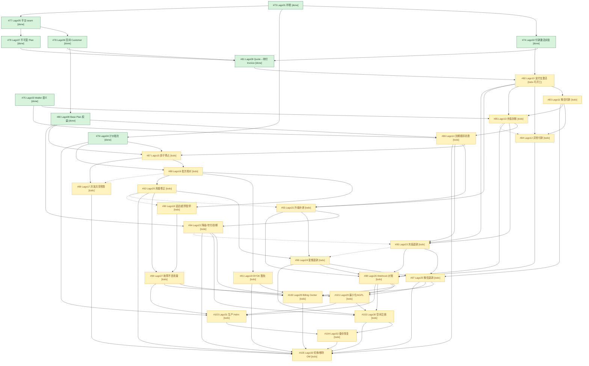

# Issue #72 子 Issue 依赖 DAG（Lago 计费迁移）

> 修订：2026-09-26 第六次修订（批次 2 执行结果 + R-4 裁决落地）；同日**第七次修订**（编排侧重发架构师指令后的重放复验：独立复跑全部校验与证据核查，结论与第六次一致，状态口径不变，见 §7 末块）｜ 分支：`codex/issue-72-lago` ｜ 配套清单：`issue-72-issues-inventory.md`
> **第六次修订要点**：① **#81 todo → done**——批次 2 已实施并验证（12 个 TDD 提交 `1079a11ad`→`f7c3b3532` + 审查修复 F1/F2/F8 → merge `e26a90d61`；三通道流程验证 9 组断言全过〔Playwright 无头真实浏览器 + 真实 API + Lago DB 直查〕；增量 OCR 两轮 r2=0 findings passed-r2；编排器结果 JSON「已完成」）。② **#82 历史就绪判定由 #81 移交 #82**——第一轮实现 merge `8cfc91975` 后真实流程验证 3 轮未过（t10 契约探针证伪其 D2 结算触发链），按裁定 revert `e0364d196`（实现保留分支 `codex/issue-72-lago-82`）；**用户裁决 R-4（2026-09-26，`issue-72-user-rulings.md`）已解除 T02 §5 重议：激活链改用选项 α 双轨道（渠道收款 + WeKnora 收到渠道回调后驱动 Stripe Provider gated 结算，复用 #74 实证 gated flow→finalize→active 链路），并附带授权 #82 重做**（吸收集成分支 flowfix 三缺陷修复与终审 OCR findings 修复范围）。#82 保持 todo，成为**当时唯一可立即开工节点**（前置 #74/#81 全 done）。③ **本次编排下发指令与仓库事实的一处冲突及裁决**：指令仍载「#74 判 todo，剩余交付=重跑 run_lab.py 收集 AC1-AC3 运行时证据」——该前提源自 2026-09-23 调查快照（当时 7 阶段 blocked-env），已被集成分支证据推翻（第三次修订记录的 run11 `5d06a277` 九阶段全 pass、独立流程验证 run `3dc51207` 21/21 断言、F1 主 Agent 裁决接受、t02 证据晋升；本会话复验 `docs/migrations/lago/t02-payment-activation/t02-{gating,activation,retries}.json` root status=**pass**，见 §7）。按构建规则「已有完成证据的节点 status=done，不重新实施」，**维持 #74=done**，不在本 DAG 判 todo。④ 边集不变（75 业务 + 6 调度），仅刷新状态与波次。
> 构建规则：父 Issue #72 只提供总体目标与验收，不计入节点；33 个子 Issue 每票一节点（id=`issue-<编号>`）。父子层级=范围归属（33 票均为 #72 直接子票，无嵌套），依赖边=必须先完成的交付，二者不混淆。**业务依赖边 75 条**（Issue 正文显式声明/调查高置信度）+ **调度约束边 6 条**（merge 冲突串行化，**非业务依赖**，见 §2.5）= **81 条**。medium 边（81→85、81→93：接口推断、票面未声明）因经 82 传递覆盖而未直连——少加不会错杀并行，多加假依赖会。无循环（本会话 Kahn 复验通过，见 §7），未触发"提取最小公共前置"规则。
> 状态口径：`done`=已有完成证据不重新实施；`todo`=待实施（前置未齐属正常排期）；`blocked`=需外部输入。**blocked=0**——外部输入已全部闭合且留痕（Stripe 密钥已提供并被消费、T02 裁决②/R-2/R-3/R-4 已入库 `issue-72-user-rulings.md`）。

> **状态更正（2026-09-28）**：以上 #82-only readiness 是历史快照，已被 `issue-72-execution-ledger.md` 的当前证据 overlay supersede；目前没有任何实现节点已验证为 ready。

## 1. Mermaid DAG

实线=业务依赖边（75 条）；**虚线 `-.->` =调度约束边（6 条，非业务依赖，仅为 merge 冲突串行化，§2.5）**。



未采信边说明：`81→85`、`81→93`（medium 置信接口推断，票面未声明，经 82 传递覆盖）；`73→75`（#75 调查仅声明父 #72，实验栈属平行交付非票面依赖）；`92→102`（waves DAG 行 46 有记录但无 timeline 佐证，经 92→96→102 传递覆盖）。
补记边说明（第二次修订恢复，均为票面显式声明且传递冗余，不改变并行分组）：`80→94`、`94→105`、`97→105`、`102→105`。第四次修订补业务边：`98→101`（票面需求明示 Webhook 审计项）。

## 2. 依赖表（业务边 75 条）

> 本版边集与第五次修订一致（无新增/删除）；仅边 19 证据列补记 #81 已交付。

| # | 前置 → 后续 | 原因（业务/接口约束） | 前置须交付 | 证据 |
|---|---|---|---|---|
| 1 | 73→74 | 实验栈直接复用 pinned v1.53.0 compose/镜像锁/健康分类 | 固定版本 Lago 栈+运维命令链 | #74 正文 Blocked by #73；deploy/lago-lab/payment-activation/README.md:4-14 |
| 2 | 73→76 | 四条验收全部需真实 pinned 栈（weknora-lago-76） | 同上 | #76 正文 Blocked by #73 |
| 3 | 73→77 | readiness 快照须打真实 Lago 栈验证 | 同上+operator key 流程 | #77 requirementSummary「被 #73 阻塞」；t05-run.txt |
| 4 | 74→81 | incomplete Subscription 激活机制由 #74 证据+T02 裁决定型（已裁决选项②受支持 Provider） | 付款激活路径运行时证据+裁决结论 | #81 正文 Blocked by #74；DECISION.md §5 末「裁决记录」（T02 裁决②）；flow evidence run 3dc51207（21/21 断言） |
| 5 | 74→82 | 可信 Payment 录入通道（写 Lago Payment）由 #74 裁决决定（选项②；R-4 细化为双轨道） | 受支持 Payment Provider 激活通道实证 | #82 正文 Blocked by #74；DECISION.md §5+裁决记录；R-4（issue-72-user-rulings.md） |
| 6 | 75→85 | 充值批次 12 个月到期模型由 a2 裁决定稿（已裁决选项 B：协调层承载） | a2 裁决结论+verdict 义务清单 | #85 正文 Blocked by #75；t03 verdict a2 BLOCKED；ADR-0012 修订 `552d98d12`+「出处注记」 |
| 7 | 75→86 | 充值/套餐混合消费顺序以 #75 实测钱包语义为直接输入（到期秩须协调层编码进 priority） | T03 verdict：到期/顺序/撤回语义+协调义务清单 | #86 正文 Blocked by #75；verdict.md 判定 b PASS-WITH-COORDINATION |
| 8 | 76→87 | T04 移交的契约修正（422 读回比对、transaction_id 三元组作用域）是预占幂等对接 Lago usage 的直接输入 | 实测契约修正+subscription-per-task 结论 | #87 正文 Blocked by #76；t04-pricing-group/README.md:79-91 |
| 9 | 76→88 | 事件投递/幂等/批次核对直接采用 T04 结论 | T04 证据与 4 处 v1.53.0 契约修正 | #88 正文 Blocked by #76；waves 文档 L127 |
| 10 | 76→103 | p95≤60s 所测 event-to-reconcilable-batch 负载形态由 T04 定义 | 延迟测量方法学（measure.py） | #103 正文 Blocked by #76；deploy/lago-lab/pricing-group/measure.py:15 |
| 11 | 77→78 | ensure_customer 命令与 account 快照只能定义在 #77 冻结 seam 上（ADR-0014 加法规则） | 冻结 CommercialPlatform seam+双适配器+契约表 | #78 正文 Blocked by #77；platform.go:35/84 |
| 12 | 77→79 | 发布链路走 #77 冻结的 SubmitCommand（新增 kind 常量+类型化载荷） | 冻结 seam+SubmitCommand 通道 | #79 正文 Blocked by #77；lago.go:305 submitPublishPlanVersion |
| 13 | 78→80 | 订阅链复用 #78 的 ensure_customer 与 ExternalCustomerID 身份（seed→account→subscription） | 确定性 Customer 身份+account 懒链 | #80 requirementSummary「#78 ensure_customer → 本票 ensure_subscription」；benefits.go 懒链 |
| 14 | 78→81 | 创建 Subscription 前提是 Customer 已存在（已满足） | ensure_customer+身份派生 | #81 正文 Blocked by #78 |
| 15 | 79→81 | Quote 固定 Plan Version 依赖不可变发布成果（已满足） | publish_plan_version+确定性 plan code | #81 正文 Blocked by #79 |
| 16 | 80→86 | 月度不结转批次建于 #80 的 grant_included_credits 月度短 TTL 钱包 | (tenant,period) 月度钱包+credit batch 注册表 | #86 正文 Blocked by #80 |
| 17 | 80→87 | 空间保守余额基线由 #80 权益/额度投影构成 | benefits 投影+hard_limit 配额 | #87 正文 Blocked by #80 |
| 18 | 80→94 | Base/paid 生命周期转换由 #80 提供基座，需协调两个独立订阅身份及各自价格；其他 Base 生命周期身份规则未决 | Base Plan 订阅链+零价语义 | #80 调查记录 #94 正文显式列其为 blocker（传递冗余边，经 86→93→94 覆盖） |
| 19 | 81→82 | 激活前置对象（待付款 Invoice+incomplete Subscription）由 #81 交付——**已交付**（merge `e26a90d61`；`CommandKindCreatePurchaseSubscription` 在 fake.go:644/lago.go:170，service purchase.go 在 HEAD） | gating Invoice+incomplete Subscription 创建命令（PurchaseSnapshot.InvoiceFees 为 #82/#84 显式接口，R-3 强制条件③） | #82 正文 Blocked by #81；spec L124；issue-72-flow-evidence-81（9 组断言全 ✅） |
| 20 | 82→83 | 微信复用 #82 建成的 Payment Fact→Lago activation→active 链路 | 恰好一次激活编排+三态状态机 | #83 正文 Blocked by #82 |
| 21 | 82→84 | 错金额/多收款判定叠加在 #82 付款→Lago Payment→激活链路上 | Lago Payment 幂等写入路径 | #84 正文 Blocked by #82 |
| 22 | 82→85 | 充值到账复用 #82 渠道付款确认→Lago Payment 记录链路 | 付款确认→Lago 链路 | #85 正文 Blocked by #82 |
| 23 | 82→93 | 新 Entitlement 的付款后 activation 门复用 #82 通道 | Lago activation 通道 | #93 正文 Blocked by #82 |
| 24 | 82→95 | 渠道退款以订单成功支付 Attempt 为出款依据 | 成功支付链路 | #95 正文 Blocked by #82；service refund.go succeededAttempt |
| 25 | 83→84 | 双渠道统一入口须微信链路（#83）先行 | 微信 ConfirmPayment 接入 | #84 正文 Blocked by #83 |
| 26 | 83→85 | 微信充值以 #83 微信付款交付为前提 | 微信付款接入 | #85 正文 Blocked by #83 |
| 27 | 83→97 | 微信退款复用 #83 的微信付款/回调验签链路 | 微信付款事实链路 | #97 正文 Blocked by #83 |
| 28 | 84→98 | Payment/Entitlement 投影收敛目标由 #84 异常付款语义定型 | 异常付款语义 | #98 正文 Blocked by #84 |
| 29 | 85→86 | 充值 12 个月到期与混合消费须先有 #85 充值批次发放对象 | top-up wallet+priority class | #86 正文 Blocked by #85；lago.go:1010 top-up 仅 future 预期 |
| 30 | 85→95 | 撤回的是 #85 已到账的充值 Credits（无到账即无可撤） | 充值到账对象 | #95 正文 Blocked by #85；waves 关键路径 85→86→95 |
| 31 | 85→98 | Wallet 投影权威语义由 #85 定义 | 充值到账语义 | #98 正文 Blocked by #85 |
| 32 | 86→87 | 空间保守余额须 Lago Wallet 权威投影（#86 到期顺序语义先行） | Lago Wallet 权威余额投影 | #87 正文 Blocked by #86（75-a2 悬置已随裁决 B 解除，本边为剩余实质前置） |
| 33 | 86→93 | 补发差额进入 #86 的到期顺序额度池 | wallet 到期顺序语义 | #93 正文 Blocked by #86 |
| 34 | 86→95 | 批准前重核算消费与到期须先有确定消费顺序语义 | 到期顺序消费语义 | #95 正文 Blocked by #86 |
| 35 | 86→105 | 行为矩阵 8 Credits ordering gate 须全绿才能切换 | gate 通过证据 | #105 正文 Blocked by #86 |
| 36 | 87→88 | 结算/释放差额以 #87 已预占调用为对象（无预占则无从结算） | Lago 价格版本上界投影+原子预占 | #88 正文 Blocked by #87 |
| 37 | 87→89 | 并发/委派不变量在 #87 的 Lago 语境预占上验证 | 原子预占+watermark/version 门 | #89 正文 Blocked by #87 |
| 38 | 88→90 | 5 分钟门槛计时与超上界比较依赖 #88 的批次确定金额与 events.errors | current usage 核对+Lago 事件状态 | #90 正文 Blocked by #88 |
| 39 | 88→91 | BYOK 维度过滤须 #88 的 usage→Lago 链路才可观察（LagoAdapter 无 Settle） | Usage Event→Lago→Settlement Batch 链路 | #91 正文 Blocked by #88 |
| 40 | 88→92 | 补偿事件须挂在 #88 的 Settlement Batch/Pricing Group 核对链路上 | 批次核对链路 | #92 正文 Blocked by #88 |
| 41 | 89→105 | 行为矩阵 12 Concurrent admission gate | gate 通过证据 | #105 正文 Blocked by #89 |
| 42 | 90→99 | 堆积时等待/告警（非假成功）依赖 #90 延迟暂停/告警机制 | 5/15 分钟暂停告警 | #99 正文 Blocked by #90 |
| 43 | 91→100 | BYOK 豁免口径决定 Billing Center 费用/余额展示 | BYOK 豁免口径 | #100 正文 Blocked by #91 |
| 44 | 91→105 | 行为矩阵 15 BYOK gate | gate 通过证据 | #105 正文 Blocked by #91 |
| 45 | 92→96 | 退款资格须 #92 的 finalized 前后用量修正权威口径 | 用量修正不改写历史口径 | #96 正文 Blocked by #92；spec L149 |
| 46 | 92→99 | 崩溃恢复不重复计费依赖 #92 修正身份语义（共用 SettlementKey） | 修正身份语义 | #99 正文 Blocked by #92；spec L142/L149 |
| 47 | 92→105 | 行为矩阵 16 Correction gate | gate 通过证据 | #105 正文 Blocked by #92 |
| 48 | 93→94 | 降级/到期与升级协调两个具有独立身份和价格的 Base/paid 订阅切换 | Lago 侧切换协调器 | #94 正文 Blocked by #93；subscription_command.go:44-49 |
| 49 | 93→96 | 套餐退款按 #93 补发后剩余可退权益口径计算 | 升级差额补发口径 | #96 正文 Blocked by #93 |
| 50 | 93→98 | Subscription 投影状态/版本语义由 #93 定义 | 升级切换状态语义 | #98 正文 Blocked by #93 |
| 51 | 94→100 | Billing Center 套餐状态集合含 #94 降级/年付/到期语义 | 生命周期状态语义 | #100 正文 Blocked by #94 |
| 52 | 94→102 | Subscription 终态语义（到期回 Base）由 #94 交付 | 订阅终态语义 | #102 正文 Blocked by #94 |
| 53 | 94→105 | 行为矩阵 17 Plan lifecycle gate | gate 通过证据 | #105 正文 Blocked by #94（传递冗余边，经 100 覆盖） |
| 54 | 95→97 | 复用 #95 的资格核算（P03）与 Refund Lock 模型 | P03 eligibility+三段式退款 | #97 正文 Blocked by #95；refund.go:120-138（P03 默认拒绝块） |
| 55 | 95→98 | Payment/Refund Lock 投影状态机由 #95 定义 | 三段式退款状态机 | #98 正文 Blocked by #95 |
| 56 | 96→97 | 复用 #96 的 Credit Note 与撤权恢复模型 | Credit Note+撤权模型 | #97 正文 Blocked by #96 |
| 57 | 96→98 | Credit Note 对象与撤回路径由 #96 交付（五类投影收敛对象之一） | Credit Note 对象 | #98 正文 Blocked by #96 |
| 58 | 96→102 | Credit Note 合规查询对象由 #96 引入 | Credit Note 对象 | #102 正文 Blocked by #96 |
| 59 | 97→100 | 统一退款状态须 #97 微信/支付宝语义对等 | 微信退款状态机 | #100 正文 Blocked by #97 |
| 60 | 97→101 | 端到端审计须覆盖 #97 微信退款链路 | 微信退款完整链路 | #101 正文 Blocked by #97 |
| 61 | 97→105 | 行为矩阵 18 Refund gate（微信/支付宝对等） | gate 通过证据 | #105 正文 Blocked by #97（传递冗余边，经 100 覆盖） |
| 62 | 98→100 | 『等待同步』状态须 #98 对账收敛机制存在才真实可展示 | Webhook+对账收敛 | #100 正文 Blocked by #98 |
| 63 | 98→102 | 注销终态须经 #98 对账收敛证明 | 对账收敛机制 | #102 正文 Blocked by #98（Reconcile 现冻结） |
| 64 | 98→103 | Webhook 指标与告警以 #98 对账语义为输入 | 对账语义 | #103 正文 Blocked by #98 |
| 65 | 99→100 | 预占分区可靠性前提是 #99 故障安全（不提前释放） | 故障安全语义 | #100 正文 Blocked by #99 |
| 66 | 99→101 | AC2 验证须 #99 的可靠 usage→Lago 链路 | usage→Lago 链路 | #101 正文 Blocked by #99 |
| 67 | 98→101 | #101 票面要求『从购买、用量、**Webhook**、退款和日志端到端验证』，Webhook 消费端/路由/去重由 #98 交付，且 #101 传递祖先此前不含 #98 | Webhook 消费端+签名/unique key 验证+inbox 去重 | #101 requirementSummary（Webhook 审计项）；#98 缺口清单（webhook 消费端零）；与既有 98→103 边同口径（第四次修订补） |
| 68 | 99→103 | 告警阈值与恢复配置由 #99 故障语义决定 | 故障语义 | #103 正文 Blocked by #99 |
| 69 | 100→105 | 行为矩阵 21/UI 稳定状态 seam：切换后用户可见状态须已收敛 | Billing Center 收敛 | #105 正文 Blocked by #100；spec:210 |
| 70 | 101→102 | 去标识化范围须 #101 数据最小化决定 | 最小化/保留决定 | #102 正文 Blocked by #101 |
| 71 | 101→103 | AGPL 上线门槛是生产部署法律前置门 | AGPL 批准记录 | #103 正文 Blocked by #101；spec L179-180 |
| 72 | 102→104 | 恢复对象集与对账断言须 #102 注销语义完整 | 注销对象语义 | #104 正文 Blocked by #102 |
| 73 | 102→105 | 空间注销行为 gate（spec:178 lifecycle） | gate 通过证据 | #105 正文 Blocked by #102（传递冗余边，经 104 覆盖） |
| 74 | 103→104 | 恢复演练须 #103 生产级拓扑（staging 演练前置） | 生产 Helm 拓扑 | #104 正文 Blocked by #103 |
| 75 | 104→105 | 行为矩阵 23 restore gate 直接对应切换验收 | staging 恢复演练证据 | #105 正文 Blocked by #104；waves L50 blockers 列表含 104 |

## 2.5 调度约束边（6 条，**非业务依赖**）

> 性质：这些边**不表达任何业务/接口前置**，仅将"同波并行会在集中式 switch/热点小文件的相邻位置插入代码、git 无法自动合并"的节点串行化（DAG 审查 2026-09-23 medium finding）。若后续将 `SubmitCommand`/`ReadSnapshot` 的集中式 switch 分发改造为按域分文件（属生产代码重构，超出本 DAG 范围），可删除这些边恢复并行。冲突证据：`lago.go`（1100+ 行）`SubmitCommand`/`ReadSnapshot` 集中式 switch（第四/五次修订会话 grep/wc 实测；#81 落地后 `lago_purchase.go` 分担购买域，但 switch 分发结构未变）、`platform.go` 常量集中区、`service/commercial/order.go`、`packages/contracts/src/commercial.ts`。

| # | 边（前置→后续） | 冲突文件（实测证据） | 方向理由 |
|---|---|---|---|
| S1 | 85→84 | `service/commercial/order.go`（订单状态机核心区）+`packages/contracts/src/commercial.ts` 双改 | #85 在关键路径（下游闭包 21 票）且对两文件改动面大（充值命令+到账状态），先行落地；#84 的 attention/异常落库改动叠加其上 |
| S2 | 88→89 | `service/commercial/execution.go`/settlement 接口同碰 | #88 交付 usage 命令与 settlement 链路本体，#89 在其上验证并发/委派不变量 |
| S3 | 92→90 | `service/commercial/settlement.go`+usage 家族同碰 | #92 的补偿事件/Credit Note 命令改动面大先行；#90 的 5/15 分钟门槛与 delta>upper 检查叠加其上 |
| S4 | 92→93 | `lago.go` 集中式 switch+`platform.go` 常量区（新增 CommandKind 相邻插入） | seam 命令区确定合并顺序：#88（usage）→#92（补偿/Credit Note）→#93（升级）→#95（void）→#96（Credit Note 读取） |
| S5 | 94→95 | `platform.go`/`lago.go` 命令区（#94 切换命令 kind 与 #95 void 命令 kind 相邻插入）+订阅/退款域衔接 | #94 切换命令较聚焦先行清障；#95 关键路径更深（下游 97/98）紧随 |
| S6 | 95→96 | `internal/modules/commercial/refund.go` 系+`lago.go` 命令区双改 | #95 充值退款三段式是 #96 套餐退款的模型基础（同一 Refund Lock/资格核算复用），先行落地减少 refund 域合并冲突 |

调度边影响：#84 推迟一波（与 #86 同波）、seam 命令区票（88→92→93→94→95→96）形成确定合并顺序、#89/#90 各推迟至 #88/#92 之后。**残余轻度冲突（未加边，仅在波次表标注）**：W4 的 84/86 同改 `contracts/commercial.ts`、W7 的 91/92 可能同碰 `repository/commercial/usage.go`、W8 的 90/93 同改 `contracts/commercial.ts`——均为小文件单点重叠，按区块划分即可，不值得牺牲并行。

## 3. 拓扑顺序（业务波次对齐，非编号序）

```
issue-73, issue-75, issue-74, issue-76, issue-77, issue-78, issue-79, issue-80,
issue-81, issue-82, issue-83, issue-85, issue-84, issue-86, issue-87,
issue-88, issue-89, issue-91, issue-92, issue-90, issue-93,
issue-94, issue-95, issue-99, issue-96, issue-97, issue-98,
issue-100, issue-101, issue-102, issue-103, issue-104, issue-105
```

排序原则：已完成的基座（#73/#75/#74/#76-#81）居首；再按购买主链（82→83→85→84/86）→ 准入与计价链（87→88→89/91/92→90/93）→ 生命周期与退款（94→95→96→97/98，99 穿插）→ 展示与合规（100/101）→ 部署收尾（102/103→104→105）。校验：本会话 python3 Kahn 复验（81 条边）无环 + 本序**零违例**（见 §7）。**按本节历史快照，#82 曾是唯一可立即开工节点；当前状态见上方更正及 §8 overlay**（前置 #74/#81 全 done；R-4 已给出激活链设计与重做授权）。

## 4. 可并行分组（就绪波次）与文件改动范围

> 分组 = 同一波次内节点两两无依赖边（含调度边），且全部前置在 prior 波次末完成（done 节点 collapsed 为基座）。执行按边驱动：节点在前置全完成的任意时刻即可开工，不要求波次同步对齐（如 W10 的 #95 可与 W9 的 #99 时间重叠——两者无任何边）。调度边（§2.5）已并入分层，串行化原因见该节。**当前就绪：W1 的 #82（唯一）**。

| 波次 | 节点 | 预期文件改动范围（供并行冲突评估） |
|---|---|---|
| 基座（done，9 票） | 73,74,75,76,77,78,79,80,81 | 无需改动（#74 证据/账本/裁决留痕、#81 实现/流程验证/OCR 证据均已在集成分支） |
| W1 | **82**（todo，**可立即开工**：R-4 双轨道裁决+附带授权重做；前置 #74/#81 全 done） | **重做范围（R-4）**：激活链改双轨道——渠道收款（支付宝/微信）+ WeKnora 收到渠道回调后驱动 Stripe Provider gated 结算扣款（复用 #74 实证 gated flow→finalize→active；t10 已证伪 retry_payment 路径）。落地：`internal/modules/commercial/`（结算触发命令，可回收分支 `codex/issue-72-lago-82` 的 `purchase_settlement_command.go` 资产）、`commercialplatform/{lago.go,lago_purchase.go,fake.go,contract_test.go}`、`service/commercial/{order.go,fulfillment.go}`（三态映射+恰好一次激活编排）、`repository/commercial/{order.go,outbox.go}`、`handler/payment_callbacks.go`、`packages/contracts/src/commercial.ts`（payment 三态）、`apps/web/src/commercial/order-state.ts`；吸收 flowfix 三缺陷修复（回调白名单/Provider.MerchantID()/客户绑定 upsert）与终审 OCR 6 项开放 findings（final report §9.4）；证据目录 `docs/migrations/lago/`+`docs/plans/issue-72-flow-evidence-82/`。**已披露边界（R-4）**：支付宝渠道证据为本地 RSA stub，真实沙箱钱包付款证据未取得（无 ALIPAY_* 凭据），不得伪造 |
| W2 | **83** | `payment/wechat.go`(+Create/Query/Close/Refund 单测)、`service/commercial/order.go`(关单恢复接线)、`handler/payment_callbacks.go`(+HTTP 测试)、`deploy/lago-lab/` 新微信实验栈 |
| W3 | **85**（调度边 S1 使 #84 让位） | `commercialplatform/lago.go`(top-up wallet，按裁决 B 到账时刻幂等创建)、`subscription_command.go`/新 topup 命令、`service/commercial/{fulfillment.go,order.go}`、`CheckoutPage/BillingPage.tsx`、`contracts/commercial.ts`、migrations |
| W4 | **84**, **86**（⚠️ 轻度：同改 `contracts/commercial.ts`——84 加 attention 状态、86 加余额字段，按区块划分） | 84: `handler/payment_callbacks.go`、`service/commercial/order.go`、`repository/commercial/order.go`、`contracts/commercial.ts`、`order-state.ts`、over_payment 处置。86: `commercialplatform/lago.go`(priority 到期秩)、`service/commercial/benefits.go`、`internal/handler/commercial.go`(余额分解端点)、`packages/{contracts,api-client}/src/commercial.ts`、`apps/web/src/commercial/BillingPage.tsx` |
| W5 | **87** | `platform.go`(价格投影快照 kind)、`commercialplatform/lago.go`、`service/commercial/execution.go`、`repository/commercial/budget_reservation.go`、`internal/application/service/{semantic_model_budget.go,remote_usage.go}`(fail-closed 修正)、`TaskBudget/BillingPage.tsx`、contracts、`budget_pg_test.go` fixture |
| W6 | **88** | `platform.go`(usage 命令)、`commercialplatform/lago.go`(events/current_usage)、`service/commercial/settlement.go`、`repository/commercial/{usage.go,outbox.go}`、`internal/container/container.go`(settlement worker) |
| W7 | **89**, **91**, **92**（⚠️ 轻度：91/92 可能同碰 `repository/commercial/usage.go`——91 事件侧过滤、92 补偿事件，按区块划分） | 89: `repository/commercial/{budget_reservation.go,budget_task.go}`、`service/commercial/execution.go`、`appconnector/adapter.go`、workbench。91: `commercial/usage.go`、`repository/commercial/usage.go`、`semantic_model_{budget,policy}.go`、`craft_model_gateway.go`(复核收紧)。92: `commercialplatform/lago.go`(补偿事件/Credit Note)、`platform.go`(新命令)、人工核对队列(新迁移+API) |
| W8 | **90**, **93**（⚠️ 轻度：同改 `contracts/commercial.ts`——90 加 waiting-for-billing-sync、93 加升级入口契约，按区块划分） | 90: `service/commercial/settlement.go`(delta>upper)、新暂停状态机/轮询、告警、contracts、apps/web。93: `commercialplatform/lago.go`(plan 切换)、`subscription_command.go`、`service/commercial/{order.go,fulfillment.go}`、plans/change 路由/前端入口 |
| W9 | **94**, **99**（不相交：lifecycle 后端 vs 故障注入栈） | 94: `service/commercial/lifecycle.go`、`container.go`(tick worker 装配)、`service/commercial/benefits.go`(年付月发)、`subscription_command.go`(+切换命令 kind)。99: `deploy/lago-lab/` 新故障注入栈、`service/commercial/settlement.go`(Dispatch 生产 worker)、`recovery.go`、readiness 联动闸门 |
| W10 | **95**（可与 W9 的 #99 时间重叠） | `refund.go` 系(P03 eligibility 实现)、`commercialplatform/lago.go`(void/wallet_transactions)、`handler/commercial.go`(接线非 nil)、`RefundPage.tsx` |
| W11 | **96** | `refund.go` 系、`commercialplatform/lago.go`(Credit Note)、contracts |
| W12 | **97**, **98**（低冲突：领域不同；98 体量大） | 97: `payment/wechat.go`(REFUND.* 通知+退款测试)、`service/commercial/refund.go`(微信映射)、微信退款场景证据。98: 新 inbox/游标/审计迁移、`platform.go` Reconcile 实现、`commercialplatform/{lago.go,fake.go,contract_test.go}`、对账 worker、`internal/handler`(webhook 路由)、`deploy/lago`(webhook 配置) |
| W13 | **100**, **101**（低冲突） | 100: `apps/web/src/commercial/*`(Billing Center)、`packages/{contracts,api-client}`、`internal/handler/commercial.go`(余额四分区端点)。101: `docs/`(AGPL 法务/Community-Premium 清单)、端到端审计脚本/证据、`deploy/lago/README.md` |
| W14 | **102**, **103**（低冲突：后端 vs 部署） | 102: `internal/handler/tenant.go`(DeleteTenant 集成)、`platform.go`(close/terminate 命令)、`commercialplatform/{lago.go,fake.go}`、新迁移(终态/去标识)、router 守卫。103: `helm/`(Lago chart)、监控告警配置、容量/备份 |
| W15 | **104** | `deploy/lago/lago.sh`(backup/restore)、演练脚本+`docs/migrations/lago/` 证据、对账校验 |
| W16 | **105** | 删 `internal/modules/commercial/openmeter/`、`internal/container/container.go`、`internal/modules/commercial/config.go`、删 `deploy/openmeter/`、docs deprecated 标记、24 项 gate 证据归档（目录建议 `docs/migrations/lago/gates/`，final report §3） |

热点文件并行预警（调度边已覆盖主要冲突，以下为跨波次时间重叠时的提醒）：`commercialplatform/lago.go`（82/85/86/87/88/92/93/95/96/98/102 都可能改动，已由业务链+调度边 S4/S5/S6 形成确定合并顺序）、`packages/contracts/src/commercial.ts`（82/84/85/86/90/93/96/100，W4/W8 残余轻度重叠已标注）、`internal/handler/commercial.go`（84/86/95/100）。同波次分支建议：seam 命令常量/载荷各自独立文件提交（沿 #81 先例 `lago_purchase.go`/`purchase_command.go` 分域），`lago.go` 按方法分块，合并顺序按波次编号串行合入主干。

**关键路径（未完成部分，13 节点）**：`82 → 83 → 85 → 86 → 87 → 88 → 92 → 96 → 98 → 101 → 102 → 104 → 105`。#82 的交付时间直接决定整条主链的开工时间（传递依赖 #82 的为 23 票——除 #82 外全部 todo 票）。

## 5. 阻塞节点与外部输入

**本轮 blocked 节点：0 个。** 就绪移交轨迹（本版更新）：

| 节点 | 变化 | 依据 |
|---|---|---|
| issue-81 | **todo → done（第六次修订）** | 批次 2 实施：merge `e26a90d61`（12 TDD 提交+审查修复 F1/F2/F8）；三通道流程验证 9 组断言全 ✅（`issue-72-flow-evidence-81/`，20 个 git 跟踪文件）；增量 OCR r2=0 findings passed-r2（`900041bb0`）；编排器结果 JSON「已完成」（final report §13）。残留为 GitHub 关票（编排侧，§5 治理项）与终审 OCR 6 项开放 findings 中 #81 相关收尾面（并入 #82 重做范围，R-4） |
| issue-82 | **保持 todo，就绪节点由 #81 移交 #82** | 第一轮实现（merge `8cfc91975`）经真实流程验证 3 轮未过：t10 契约探针（run `6f45ed2f`）证伪其 D2 结算触发链（P1 FAIL：stuck 3DS 收款使 gating invoice 转 INVISIBLE、payments 查询 200 空列表；P2d FAIL：`retry_payment` 对隐藏发票 404）→ 按裁定 revert `e0364d196`（34 文件 −3724 行，实现保留分支 `codex/issue-72-lago-82`）。**R-4（2026-09-26）解除 T02 §5 重议**：激活链=选项 α 双轨道（渠道收款 + WeKnora 驱动 Stripe Provider gated 结算，复用 #74 实证链路），附带授权 #82 重做（吸收 flowfix 三缺陷修复+终审 OCR findings 修复范围）；支付宝沙箱凭据缺失作为已披露边界（owner 知悉，stub 证据+披露，不得伪造）。前置 #74/#81 全 done → **当前唯一可开工** |

历史解锁记录（第三次修订，9 票 blocked→todo）见 git 历史（`f6969fc008` 版 §5），此处不重复；要点：#74 done（F1 裁决接受+流程验证）、T02 裁决②、75-a2 裁决 B 三项外部输入闭合后，#81/#82/#85/#87/#88/#94/#97/#100/#103 全部转 todo，此后无新增外部阻塞。

**本次下发指令与仓库事实的冲突裁决（必须留痕）**：编排指令载「#74 判 todo，剩余交付=用真实密钥重跑 run_lab.py 收集 AC1-AC3 运行时证据」——该前提对应 2026-09-23 调查快照（7 阶段 blocked-env）。集成分支证据（第三次修订已记录，本会话复验）证明该交付**已完成**：run11 `5d06a277` 九阶段全 pass（25/25 GREEN AC 断言）、独立流程验证 run `3dc51207` 21/21+DB-WATCH PASS、F1 主 Agent 裁决接受（`ec14bbf94`，ledger-74「审查第 3 轮与主 Agent 裁决」节）、证据晋升 `docs/migrations/lago/t02-payment-activation/`（本会话实查 t02-gating/activation/retries.json root status=pass）、revert `e0364d196` 未触及 #74 的实验工具契约修复（52e22b366/4aa74ce34/0aa976c64 在案）。按构建规则「已有完成证据的节点 status=done，不重新实施」，维持 **#74=done**；若编排侧仍要求重跑，属证据新鲜度复核而非实施，应另立验证任务而非改判本票。

**传递依赖结论（上版实算口径，本版 #81 转入基座后更新）**：传递依赖 #82 的为 **23 票**（除 #82 外全部 todo 票）；传递依赖 #85 的为 21 票（调度边 85→84 使 #84 亦入闭包）。**#82 是全局唯一关键路径入口**。

**外部输入清单（非节点）**：① Stripe TEST 密钥——已提供（`~/.zcode/issue72-stripe.env`，本会话 `ls -la` 复核存在，126 字节 mode 600）且已被 #74 实施轮消费；R-4 双轨道将再次消费（Stripe Provider gated 结算轨道）。② T02 裁决——选项②（R-1）+ 激活链重议选项 α 双轨道（R-4），均入库 `issue-72-user-rulings.md`。③ 75-a2 裁决 B（R-2，ADR-0012 修订 552d98d12）。④ #81 spec L121 偏差（R-3，选项 A：付款前权威订阅面硬校验+付款时 InvoiceFees 完整复核——`PurchaseSnapshot.InvoiceFees` 已为 #82/#84 显式接口）。⑤ **支付宝沙箱凭据——仍未提供**（R-4 已披露边界：stub 证据+披露，#82 AC4 带残余；#83 微信真实受控环境凭据同理待实施时安排）。⑥ AGPL 法务结论——仍缺（=**#101 票内交付物**，非独立外部输入；#103 的法律前置门经 101→103 依赖边表达）。⑦ #30 移动 AI Office——与 Lago 迁移无代码耦合，仅记录核查结论，不入图（见清单 §3）。

**遗留治理项（非 DAG 节点、不阻塞任何边）**：① #74/#81 GitHub 关票（本会话 `gh issue list` 复测均仍 OPEN，建议编排侧随下轮执行；#82 保持 OPEN）；② 终审 OCR 6 项开放 findings（final report §9.4 对账：4 全量+2 部分残留）——R-4 已划入 #82 重做范围；③ 批次 1 轮 4 遗留（4 medium+1 low，final report §9.5）与批次 2 轮 4 low（§9.6）——建议并入相关票或治理轮；④ 分支 `codex/issue-72-lago-82` 去留（final report D7，建议保留至 #82 重做复用后由用户决定）。

## 6. 状态表

| id | issue | status | deps（业务；调度边见 §2.5） | 全量 deps（业务+调度，供调度器） |
|---|---|---|---|---|
| issue-73 | #73 | done | — | — |
| issue-74 | #74 | done | issue-73 | issue-73 |
| issue-75 | #75 | done | — | — |
| issue-76 | #76 | done | issue-73 | issue-73 |
| issue-77 | #77 | done | issue-73 | issue-73 |
| issue-78 | #78 | done | issue-77 | issue-77 |
| issue-79 | #79 | done | issue-77 | issue-77 |
| issue-80 | #80 | done | issue-78 | issue-78 |
| issue-81 | #81 | **done**（第六次修订） | issue-74, issue-78, issue-79 | issue-74, issue-78, issue-79 |
| issue-82 | #82 | todo（**可开工**） | issue-74, issue-81 | issue-74, issue-81 |
| issue-83 | #83 | todo | issue-82 | issue-82 |
| issue-84 | #84 | todo | issue-82, issue-83 | issue-82, issue-83, **issue-85**(S1) |
| issue-85 | #85 | todo | issue-75, issue-82, issue-83 | issue-75, issue-82, issue-83 |
| issue-86 | #86 | todo | issue-75, issue-80, issue-85 | issue-75, issue-80, issue-85 |
| issue-87 | #87 | todo | issue-76, issue-80, issue-86 | issue-76, issue-80, issue-86 |
| issue-88 | #88 | todo | issue-76, issue-87 | issue-76, issue-87 |
| issue-89 | #89 | todo | issue-87 | issue-87, **issue-88**(S2) |
| issue-90 | #90 | todo | issue-88 | issue-88, **issue-92**(S3) |
| issue-91 | #91 | todo | issue-88 | issue-88 |
| issue-92 | #92 | todo | issue-88 | issue-88 |
| issue-93 | #93 | todo | issue-82, issue-86 | issue-82, issue-86, **issue-92**(S4) |
| issue-94 | #94 | todo | issue-80, issue-93 | issue-80, issue-93 |
| issue-95 | #95 | todo | issue-82, issue-85, issue-86 | issue-82, issue-85, issue-86, **issue-94**(S5) |
| issue-96 | #96 | todo | issue-92, issue-93 | issue-92, issue-93, **issue-95**(S6) |
| issue-97 | #97 | todo | issue-83, issue-95, issue-96 | issue-83, issue-95, issue-96 |
| issue-98 | #98 | todo | issue-84, issue-85, issue-93, issue-95, issue-96 | issue-84, issue-85, issue-93, issue-95, issue-96 |
| issue-99 | #99 | todo | issue-90, issue-92 | issue-90, issue-92 |
| issue-100 | #100 | todo | issue-91, issue-94, issue-97, issue-98, issue-99 | issue-91, issue-94, issue-97, issue-98, issue-99 |
| issue-101 | #101 | todo | issue-97, issue-98, issue-99 | issue-97, issue-98, issue-99 |
| issue-102 | #102 | todo | issue-94, issue-96, issue-98, issue-101 | issue-94, issue-96, issue-98, issue-101 |
| issue-103 | #103 | todo | issue-76, issue-98, issue-99, issue-101 | issue-76, issue-98, issue-99, issue-101 |
| issue-104 | #104 | todo | issue-102, issue-103 | issue-102, issue-103 |
| issue-105 | #105 | todo | issue-86, issue-89, issue-91, issue-92, issue-94, issue-97, issue-100, issue-102, issue-104 | issue-86, issue-89, issue-91, issue-92, issue-94, issue-97, issue-100, issue-102, issue-104 |

统计：done 9 ｜ blocked 0 ｜ todo 24（合计 33）。

## 7. 校验记录（本次修订会话实跑）

- `python3` Kahn 校验（本会话脚本 `/tmp/dag-check-72-r6.py`，跑后删除）：33 节点、**81 条边（75 业务+6 调度）、0 重复边、0 自环**；Kahn 完整解析=**无环**；§3 拓扑序对 81 条边**零违例**；就绪集模拟（done={73,74,75,76,77,78,79,80,81}）→ **ready={82}**；波次分层与 §4 表 W1-W16 一一对应；传递闭包实算：**传递依赖 #82=23 票**。
- **#74 证据复验（本会话实跑）**：`python3` 读取 `docs/migrations/lago/t02-payment-activation/t02-{gating,activation,retries}.json` → root status=**pass**×3；`grep -n "AC3\|AC4" docs/plans/issue-72-ledger-74.md` → AC1-AC4 全 pass（run 5d06a277 + 流程验证 3dc51207）；revert 范围核查 `git show e0364d196 --stat` → 34 文件全部为 #82 资产（payment-trigger lab/t10 证据/plan+ledger-82/settle 命令族），**未触及** #74 的契约修复与 t02 晋升证据。
- **#81 交付复验（本会话实跑）**：`ls internal/modules/commercial/service/commercial/ | grep purchase` → `purchase.go`/`purchase_test.go` 在 HEAD；`grep -rn "CommandKindCreatePurchaseSubscription" internal/` → `fake.go:644`、`lago.go:170` 等命中（购买命令已接线双适配器）。
- **#82 revert 复验（本会话实跑）**：`grep -rn "settle_purchase_payment" internal/ --include='*.go'` → **0 命中**（settle 命令已移出 HEAD）；`git branch --list 'codex/issue-72-lago*'` → 集成分支 + `-74`/`-81`/`-82` 三条 per-issue 分支在本地（实现保留于 `-82`）。
- **R-4 裁决核验（本会话实读）**：`docs/plans/issue-72-user-rulings.md` R-1/R-2/R-3/R-4 四条在案（R-4=2026-09-26 双轨道+重做授权+沙箱凭据披露）。
- `gh issue list -R 1123786563/WeKnora-fork01 --state all --limit 200`（本会话实跑，过滤 72-105，34/34）：#72 OPEN；#73/75/76/77/78/79/80=CLOSED（7 票）；#74 及 #81-#105=OPEN（27 票）——GitHub 关票滞后于集成分支完成状态（#74/#81），为已知残留（§5 治理项①）。
- `ls -la ~/.zcode/issue72-stripe.env`（本会话实跑）：存在（126 字节，mode 600，2026-09-23）——#74 实施轮密钥来源，R-4 双轨道结算轨道将复用（仅测试凭据）。
- **第七次修订复验块（2026-09-26 重放会话，全部本会话实跑）**：编排侧重发架构师指令，其快照口径仍为「#74 判 todo、#81/#82/#85 解锁改 todo、6 票保留 blocked」——与第六次修订记录的下发冲突相同，证据裁决（§5）继续适用。本会话不重写结论，独立复验：① Kahn/拓扑/就绪集脚本（33 节点、81 边含 6 调度边）→ **无环、§3 序零违例、ready={82}、传递依赖 #82=23 票**（83-105 全部，与 §4 关键路径结论一致）；② `python3` 复读 `docs/migrations/lago/t02-payment-activation/t02-{gating,activation,retries}.json` → root status=**pass×3**；③ #81 在 HEAD：`ls internal/modules/commercial/service/commercial/ | grep purchase` → `purchase.go`/`purchase_test.go`；`grep -rn CommandKindCreatePurchaseSubscription internal/` → `fake.go:644`、`lago.go:170`、`purchase_command_test.go:53`、`lago_purchase_integration_test.go:127`；④ #82 revert：`grep -rn settle_purchase_payment internal/` → **0 命中**；`git branch --list 'codex/issue-72-lago*'` → 集成分支 + `-74`/`-81`/`-82` 三条 per-issue 分支在本地；⑤ `gh issue list --state all --limit 250`（过滤 72-105，34/34）→ **CLOSED={73,75,76,77,78,79,80}（7 票），#72/#74 及 #81-#105 OPEN（27 票）**——与第五/六次修订一致，#74/#81 关票滞后维持已知残留；⑥ `ls -la ~/.zcode/issue72-stripe.env` 复核存在。**结论：维持第六次修订状态（done 9 / todo 24 / blocked 0，#82 唯一可开工）。对下发指令「#74 判 todo」的冲突裁决继续有效——若需重跑 run_lab.py 属证据新鲜度复核（验证任务），不构成改判本票与重新实施的依据。**

## 8. Recovery overlay — 2026-09-28 (supersedes stale readiness snapshot above)

This overlay is the current execution-state source; sections 1–7 are historical snapshots and must not be used as today's ready set. See [`issue-72-execution-ledger.md`](issue-72-execution-ledger.md) and the latest worktree/Git status before dispatch.

- GitHub native containment was independently refetched recursively: #72 has exactly #73–#105 as direct children, no nested descendants. Dependency APIs were fetched for every node; no missing dependency targets or cycles were reported. Full endpoint evidence: `/tmp/issue72-analysis.md`.
- Current GitHub state snapshot: #73 and #75–#80 closed; #74 and #81–#105 open. Do not alter remote Issue state. Local evidence shows implementation progress for open #81–#86; review/acceptance must be adjudicated from current artifacts, not remote state alone.
- Integration checkout at this overlay: `codex/issue-72-lago` HEAD `84d17f128ab343435bf2382c3999007580602b91`. It contains uncommitted #86 OCR-R1 updates in `issue-72-flow-evidence-86/concurrent_consumption_86.py` and `consume_86.py`; these are not yet verified/reviewed at their current content hash.
- Dedicated #84 and #86 worktrees exist and were clean at the latest recorded check. #85 worktree branch is carrying #83 OCR commits; establish ownership before dispatch.
- **Current ready set: no implementation task is verified-ready.** #86 checkpoint review/verification is the active gate. A readonly review of #87 plan may proceed concurrently because it does not change files; #87 implementation consumes #86 wallet/lot semantics and stays locked until #86 is verified and its reviewed checkpoint is in the integration worktree.
- After #86 passes, #87 plan rewrite/review remains required: independent review found critical/high pricing, projection freshness, production wiring and wallet-fold gaps in the current prewrite plan. Only after that plan passes can #87 implementation start; #88 follows verified #87. A later parallel implementation wave may be proposed only after checking actual file sets, interfaces, separate worktrees and non-shared test/runtime resources. SDD's required one-implementer-at-a-time rule currently bounds implementation dispatch; maximize parallelism through independent readonly audits/reviews until then.

### Recovery overlay addendum — #82 ancestry correction and current #84/#87 frontier (2026-09-28)

- A read-only #82 readiness audit `/tmp/issue72-82-readiness-audit-20260928.md` initially inferred #82 was not integrated because no #82 worktree was checked out. Parent verification corrected that inference: `git merge-base --is-ancestor codex/issue-72-lago-82 HEAD` exits 0; #82 tip `00ff79aec025023b7db536d8879de66826d06145` is an ancestor of integration HEAD `84d17f128ab343435bf2382c3999007580602b91`, through merge commit `7d614752ce4f134a321d0538e92f06480cdb8713`. Therefore do not reimplement #82 branch changes. This establishes integration only; it does not itself certify #82 acceptance.
- The #82 ledger still discloses a dedicated T9 integration rerun gap (shared-stack test selected a previously finalized PaymentIntent; dedicated `lab.env` is missing) and AC4 real Alipay sandbox evidence unavailable. Existing four-leg live stack/browser evidence is recorded as equivalent coverage, but the parent must preserve this qualification; no GitHub status change is made.
- #84 attempt-identity repair has a reviewed R4 plan and one active SDD implementation/fix stream in `.worktrees-issue72/issue-84`; its initial checkpoint review passed Spec Compliance and reported one valid low test-harness issue, currently in fix round 1. It remains unverified until scoped re-review.
- #87 pricing owner analysis `/tmp/issue72-87-owner-rule-options-20260928.md` recommends active paid subscription ownership only for dimensions its exact immutable published version declares, with Base owning other dimensions; pending/canceled boundaries and overlapping declarations require user policy. A clarification has been sent asking whether to use that default (single owner; ambiguous duplicate paid ownership fails closed). R-3 still does not authorize charge-bearing paid purchase.

### Recovery overlay addendum — verified #84 repair checkpoint / current #87 contract gate (2026-09-28)

- #84 narrow payment-attempt identity repair was independently task-reviewed and committed locally as `ae8f57c8cb33b15f7ec78cab3758ae00d3bd3cbe` in `codex/issue-72-lago-84`. Scoped task review R2 passes Spec Compliance and Code Quality; final whole-branch review is pending. Required repo/service/PostgreSQL tests passed as recorded in `issue-72-ledger-84.md` and its SDD report. This verifies only the narrow immutable-first-transaction repair, not whole #84 acceptance or inherited OCR residuals.
- #87 R6 in the isolated T15 worktree is independently validated as a distinct result (`53a02242…`); it confirms 5-cent granted top-up and current-usage/wallet projection shape only. Wallet balances did not move as current usage rose; event internal IDs remained null. It does not verify debit, invoice settlement, balance exhaustion, negative balance or refusal. Task 0 remains open. A read-only v1.53 wallet contract research and minimal next-probe recommendation is underway.
# T9 fixture repair checkpoint — 2026-09-30

- Task 1 implemented in test harness only: synthetic webhook is bound to unique pre-settle invoice-linked unsettled PI identity; historical or newly appeared PI cannot be selected. Production code unchanged.
- RED reproduced: assertion selected `pi_old` over expected `pi_expected`, and accepted a newly appearing linked ID. GREEN: focused tagged regression, package suite, tagged compile-only, and `git diff --check` passed.
- Live T9 and real Alipay AC4 remain open and unverified; this task did not access external services.
