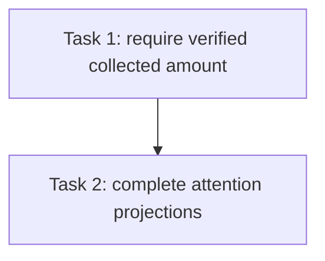

# Issue #72 / #84 Full-Review Findings Repair Plan R1

> **For agentic workers:** REQUIRED SUB-SKILL: Use superpowers:subagent-driven-development. Implement only the assigned Task Brief; do not dispatch additional agents.

**Goal:** Close the two verified findings from the complete #84 review: do not confirm a successful provider query without a verified positive collected amount, and expose unresolved payment anomalies consistently in order list and duplicate-checkout projections.

**Architecture:** Keep the provider's observed collection face authoritative. A succeeded query with a missing, malformed, or nonpositive amount must not be converted into the registered attempt face or confirmed; keep the order pending and return a retryable, non-sensitive error. If a currency mismatch is independently observable, retain it as an anomaly with amount `0` denoting unknown. For order projections, retain fail-open decoration semantics but use one tenant-scoped batch query for list results; single-order payable projection may use the existing `withAttention` helper.

**Tech Stack:** Go, GORM, SQLite service/repository tests, existing commercial HTTP handlers and payment-provider adapters.

**Spec:** `docs/specs/2026-09-20-lago-billing-migration-design.md` (payment collection and operator attention requirements); `docs/adr/0012-lago-as-commercial-billing-authority.md`; `docs/adr/0014-commercial-platform-single-deep-seam.md`; `CONTEXT.md`; Issue #84 approved plan and the independent full-range review finding package. The review facts and root-cause evidence are preserved in `docs/plans/issue-72-execution-ledger.md` and the #84 F1/F2 root-cause reports referenced there.

## Global Constraints

- Never manufacture a provider-collected amount from the attempt's expected amount.
- `ConfirmPayment` is allowed only after a positive actual amount and currency have been verified against the registered attempt face.
- Preserve pending/retry behavior for unknown payment outcomes; never reveal raw provider data in HTTP responses.
- A known wrong currency remains operator-visible even when amount is unknown; store `ActualAmountFen=0` as the unknown sentinel.
- Payment anomaly attention means an unresolved anomaly exists. Resolved anomalies must not set `PaymentAttention`.
- Tenant order listing remains tenant-scoped and must not issue one anomaly query per order.
- Keep Task 1 and Task 2 serial: both modify `internal/modules/commercial/service/commercial/order.go` and its tests.
- Do not modify unrelated worktrees or shared Docker/PostgreSQL resources. Preserve all pre-existing user changes in the integration worktree.

## Review Focus

1. Alipay malformed/missing/nonpositive `total_amount` and WeChat missing amount or currency never confirm; both remain pending through Recover and Close query paths.
2. Known currency mismatch plus unknown amount persists currency anomaly with actual amount zero; no expected face is fabricated.
3. Positive exact amount with verified currency continues to confirm; a known currency mismatch is retained, while unknown currency remains retryable and unconfirmed.
4. `ListOrders` marks only orders with unresolved anomalies using one tenant-scoped set query with no unbounded ID bind list; no N+1 query and no cross-tenant results.
5. Duplicate checkout conflict returns `PaymentAttention` for unresolved anomaly and clears it after resolution.

## Task DAG

## Task 1 — Require a verified positive collection face

**Dependencies:** #84 merged code is already an ancestor of integration HEAD `8329b85d4dfff301d03f94406dfc829d87cb5b26`; review finding F1 and root-cause evidence are recorded in the execution Ledger. **Owner:** `backend_implementer`; **Validator:** `backend_validator`; **Review:** independent `reviewer`.

**Files:**
- Modify: `internal/modules/commercial/payment/alipay.go`
- Test: `internal/modules/commercial/payment/alipay_test.go`
- Modify: `internal/modules/commercial/payment/wechat.go`
- Test: `internal/modules/commercial/payment/wechat_test.go`
- Modify: `internal/modules/commercial/service/commercial/order.go`
- Test: `internal/modules/commercial/service/commercial/order_test.go`
- Test: `internal/modules/commercial/service/commercial/order_close_test.go`
- Modify: `internal/handler/commercial.go` for a mandatory closed retryable response mapping on both order recovery and channel-switch purchase paths.
- Test: `internal/handler/commercial_purchase_test.go` for both GET recovery and channel-switch POST closed response shape and absence of provider text.

**Consumes:** `payment.AttemptResult{State, ProviderID, AmountFen, AmountCurrency}`, `OrderService.RecoverOrderStatus`, `OrderService.CloseChannelOrder`, `recoverMismatchedCollection`, and `OrderStore.RecordPaymentAnomaly`.

**Produces:** A successful query is confirmable only when both the positive collected amount and the collected currency are verified against the registered attempt. Adapters return an error for malformed reported amounts rather than a succeeded result with a fabricated/default amount. Alipay has no separate currency field; its pinned provider contract fixes the transaction currency to CNY, and the adapter must state that contract currency explicitly. For WeChat, a succeeded query with a missing/blank currency remains unverified even when its amount is positive. The service boundary independently rejects `AmountFen <= 0` or blank currency in both recovery and close-race paths. If amount is unknown but currency is observably wrong, it records `currency_mismatch` with actual amount zero and the observed currency; if currency is unknown it leaves the order pending and returns a typed retryable error. `recoverMismatchedCollection` preserves zero as unknown and never substitutes the expected attempt face. Provider query/parse failures on these recovery paths are wrapped as the same typed retryable observation error, keeping raw provider text internal.

### Steps

- **RED:** Add adapter tests for Alipay missing/malformed/nonpositive total amount and fixed CNY contract currency, and WeChat missing/nonpositive amount plus missing/blank currency despite a positive amount. Add service tests for succeeded query with zero amount or missing currency through Recover and Close, asserting no `ConfirmPayment`, order remains pending, and typed retryable error. Add currency-known/amount-unknown case asserting one currency anomaly with `ActualAmountFen=0`. Verify exact-positive amount and verified currency still confirm. Add handler tests in `internal/handler/commercial_purchase_test.go` for both GET recovery and channel-switch POST returning exactly the closed retryable 503 shape without raw provider detail.
- **GREEN:** Make adapter parsing reject malformed amount data as a query error; preserve missing amount as unavailable rather than mapping it to the attempt face. Add a typed service error for unverified collected amount and enforce it before confirmation in both query paths. Keep known currency anomaly recording independent of amount availability.
- **REFACTOR:** Consolidate identical collection-face validation only if it clarifies the service invariant without changing the public provider interface.
- **Verify:** Run focused Alipay/WeChat query tests, commercial service recovery/close tests, then affected payment and commercial service packages; run `gofmt` and `git diff --check`. Expected result: malformed/unknown/nonpositive amount never settles; valid exact collection behavior remains passing.
- **Report:** Save commands, results, changed-file hashes, and review package in `.superpowers/sdd/issue-72-plan-84-full-review-fix-r1/`.

## Task 2 — Project anomaly attention on list and duplicate checkout

**Dependencies:** Task 1 is integrated and independently reviewed. **Owner:** `backend_implementer`; **Validator:** `backend_validator`; **Review:** independent `reviewer`.

**Files:**
- Modify: `internal/modules/commercial/repository/commercial/payment_anomaly.go`
- Test: `internal/modules/commercial/repository/commercial/order_test.go`
- Modify: `internal/modules/commercial/service/commercial/order.go`
- Test: `internal/modules/commercial/service/commercial/order_test.go`
- Test: the existing commercial order handler test file covering duplicate checkout conflict.

**Consumes:** `PaymentAnomalyRow`, `PaymentAnomalyStateAwaiting`, `OrderStore.ListOrdersByTenant`, `OrderService.withAttention`, and `CurrentPayablePendingOrderView`.

**Produces:** A repository method returns the set of all order IDs with awaiting anomalies for one tenant using a tenant-scoped set query; it takes no caller-provided order-ID slice. `ListOrders` intersects that set with the already tenant-scoped order rows and decorates matching rows with `PaymentAttention=true`, without N+1 reads or an unbounded `IN` bind list. Query count remains one regardless of the number of returned orders; query failure follows the established fail-open order-projection policy. `CurrentPayablePendingOrderView` uses `withAttention`, so duplicate checkout conflict carries the same unresolved attention signal as GetOrder. Resolved anomalies do not signal attention.

### Steps

- **RED:** Add repository tests for tenant scoping, awaiting versus resolved state, and set-query behavior without an order-ID bind slice. Add a many-order fixture asserting bounded query count and complete decoration. Add service tests for list projection and single payable projection before and after anomaly resolution. Add HTTP conflict replay test asserting the returned current order retains attention while unresolved.
- **GREEN:** Implement one tenant-scoped set query over unresolved anomaly rows with no caller-sized order-ID `IN` list; service code intersects the resulting IDs with the already tenant-scoped order rows. Keep query count at one regardless of order count, decorate list views from that intersection, and call `withAttention` for the current payable view. Preserve fail-open list readability if anomaly decoration fails.
- **REFACTOR:** Keep query shape bounded and the single-order helper as the shared semantics source where practical.
- **Verify:** Run targeted repository, order-service and handler tests; run affected package tests, `gofmt`, and `git diff --check`. Expected result: list attention uses one anomaly query, tenant isolation holds, unresolved conflict replay is flagged, resolution clears it.
- **Report:** Save commands, results, changed-file hashes, and review package in the plan workspace.

## Acceptance Mapping

| Review finding / requirement | Task | Evidence |
|---|---|---|
| F1: Unknown/malformed/nonpositive actual amount cannot confirm using expected amount | 1 | Adapter and Recover/Close service tests assert pending and zero confirmations |
| F1: Independently known currency mismatch is retained without inventing amount | 1 | Persisted currency anomaly has `ActualAmountFen=0` |
| F2: List order attention has no N+1 queries and is tenant-scoped | 2 | Batch repository test and list projection test |
| F2: Duplicate checkout conflict returns unresolved attention and resolved state clears it | 2 | Service and HTTP replay tests before/after resolution |

## Rulings

- **Ruling:** `ActualAmountFen=0` represents unknown collected amount when a currency mismatch is independently known. **Cost if wrong:** Operations cannot infer the amount from this anomaly row alone; preserving a false expected amount would corrupt the audit fact, so provider re-query remains necessary.
- **Ruling:** Unknown amount with no independent currency contradiction returns a retryable error and leaves the order pending without creating an amount-mismatch anomaly. **Cost if wrong:** A genuinely collected payment may require retry/provider reconciliation before settlement; this is safer than fabricating evidence and granting benefits.
- **Ruling:** List anomaly lookup failure does not fail the primary order list, matching `withAttention`'s documented fail-open decoration policy. **Cost if wrong:** Attention can be temporarily omitted during storage failure; anomaly data remains queryable and a later read can restore the flag.
- **Ruling:** Do not mutate an existing same-key payment anomaly from unknown amount to a later amount in this repair. The current unique-key insert is immutable and no approved safe enrichment/transaction boundary exists; retain zero as unknown and require a separate operator reconciliation flow to enrich it. **Cost if wrong:** the anomaly may remain amount-unknown until reconciled, but auto-overwriting payment facts could silently alter an already-disposed audit record.

## Accepted low-priority follow-up

The independent review identified that a later positive provider query cannot enrich an existing same-key `ActualAmountFen=0` anomaly because the anomaly insert is immutable. This plan deliberately does not alter that durable payment fact: no safe enrichment transaction/state contract is approved, and a retry must not overwrite known or resolved audit data. Record operator re-query/reconciliation as a separate follow-up; it does not authorize auto-confirmation and does not change F1/F2 acceptance.

## Plan Self-Review

- Review F1 and F2 map to independent, ordered tasks and concrete behavioral tests.
- Shared order service/test ownership is serial, so no overlapping implementation agents are dispatched.
- The named adapter and handler test files are present in the current tree; retryable response mapping is mandatory on both order recovery and channel-switch paths and must use a closed product error shape.
- No schema migration or API contract change is planned. The existing HTTP surface uses safe 503 responses for retryable platform states; the new provider observation error must use a closed, non-sensitive 503 shape and be tested on both routes.
