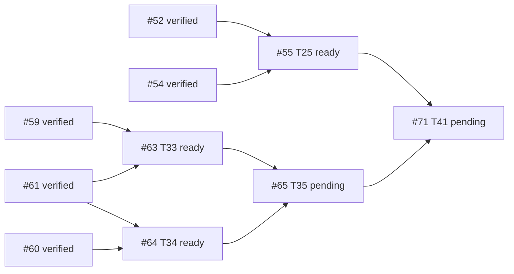

# B6 execution ledger — Issue #30 descendants #55 / #63 / #64

- GitHub read time: 2026-09-28 UTC, authenticated `gh` REST API.
- Repository: `1123786563/WeKnora-fork01` (origin remote).
- Root #30: open, approved specification; zero comments; native `sub_issues` endpoint returned an empty page. Its paginated timeline contains 41 distinct descendant issue references (#31–#71) and unrelated #174. All 41 descendant snapshots declare `Parent #30`; see `issues/index.md` and individual issue snapshots. No number-based filtering used.
- Existing implementation integration branch: `codex/issue30-mobile-office`, starting HEAD `db234c5eb171f2dde7427d382b55b503a038f879`.
- Current planning branch: `codex/issue30-b6-coordination`; baseline `db234c5eb`; planning-source checkpoint `df726bcaa55f1284e211b60c446de5fc4b37c1f3`.
- PR #174 is the existing local-delivery / #140 baseline PR. It is not modified here.

## Descendant readiness and B6 dependency edges

- #55 T25 is open; blocked by #52 and #54, both verified integrated in B5. It is ready.
- #63 T33 is open; blocked by #59 and #61, both verified integrated in B5. It is ready.
- #64 T34 is open; blocked by #60 and #61, both verified integrated in B5. It is ready.
- #65 T35 is downstream of #63 and #64 and stays pending.
- #71 T41 is downstream of #55 and #65 (among its other prerequisites); it stays pending. #51's exclusion-set TOCTOU repair `1c6779c7c` is integrated and has a mutation-test proof in `plans/plan-t51.md-report.md` §R5; prior final report's “not independently reviewed” statement is superseded by that report, but full historical final review/OCR limitations remain as written.

## Execution worktrees and scheduling

| Stream | Worktree | Branch | Base | Status | Owned files / conflict note |
|---|---|---|---|---|---|
| Coordination | `.worktrees/issue30-b6-coordination` | `codex/issue30-b6-coordination` | `db234c5eb` | running | Plans, issue snapshots, DAG, ledger, rulings and final evidence only |
| #55 | `.worktrees/issue30-b6-t55` | `codex/issue30-t55` | `df726bcaa` after plan transfer | ready | Delivery/codedelivery and mobile recovery; no Marketplace production files. Task 1's `delivery_collaboration_http_test.go` is outside #63/#64 ownership. |
| #63 | `.worktrees/issue30-b6-t63` | `codex/issue30-t63` | `df726bcaa` after plan transfer | ready | Marketplace lifecycle files. Shares migration/model/repository/service/router/admission seams with #64. |
| #64 | `.worktrees/issue30-b6-t64` | `codex/issue30-t64` | `df726bcaa` after plan transfer | ready | Security revocation files. Shares migration/model/adoption/upgrade/router/container/workbench/session seams with #63. Migration numbers moved to sqlite 000125/versioned 000204 to avoid #63's 000124/000203. |

### Preflight file/interface overlap matrix

| Plan/task pair | Shared files or interfaces | Finding / ruling |
|---|---|---|
| #63 T1 ↔ #64 T1 | migration tracks, adoption/marketplace persistence entities, repository test area | Real overlap. Serialize both Task 1s; #63 first owns sqlite 000124/versioned 000203; #64 uses sqlite 000125/versioned 000204. Merge/rebase and rerun migration uniqueness before downstream work. |
| #63 T2 ↔ #64 T2 | adoption and marketplace repository interfaces/types | Real interface overlap. #63 first; #64 adapts only after the lifecycle interface is stable and reviewed. |
| #63 T3 ↔ #64 T4/T6 | agent_adoption.go and agent_upgrade.go service guards | Real shared service files; serialize, lifecycle rejects Deprecated and security gate rejects revoked/blocklisted. Preserve separate predicates and deterministic error precedence; write compatibility tests. |
| #63 T4 ↔ #64 T7 | router params/route registration, container wiring | Real wiring overlap. Serialize #63 first, then #64 rebase onto reviewed lifecycle wiring. |
| #63 T5 ↔ #64 T8 | AdmissionCoordinator, workbench_start.go, container/workbench.go | Real seam overlap. #64 also adds session AgentQA gate. Implement one gate API with independently composable predicates; serialize seam edits and prove both behavior sets. |
| #63 T6 ↔ #64 T9 | test fixture/HTTP router suites | Same test architecture but distinct new files; can proceed independently after production APIs are stable, using non-overlapping files. |
| #55 Tasks 1–8 ↔ #63/#64 | no declared Marketplace production files; #55 owns delivery APIs, mobile composition and delivery test files | Parallel streams permitted in separate worktrees. Recheck changed-file lists before merging. |

## Task state / review / checkpoints

| Node | Status | Checkpoint / review |
|---|---|---|
| #55 T25 | ready | Plan `plans/plan-t55.md`; no execution checkpoint |
| #63 T33 | ready | Plan `plans/plan-t63.md`; no execution checkpoint |
| #64 T34 | ready | Plan `plans/plan-t64.md`; migration IDs amended in this planning branch; no execution checkpoint |

## Rulings

1. **Ruling:** use `timeline.cross-referenced` + each descendant's explicit `## Parent #30` statement as the scope evidence because the native `sub_issues` REST endpoint returns no children and its absence conflicts with 41 real descendant references; do not infer “no descendants.” Cost if wrong: a descendant omitted from timeline/Parent evidence would need a scope correction and implementation before #30 can close.
2. **Ruling:** serialize #63/#64 tasks that touch shared Marketplace types, migration tracks, service guard seams, route/container wiring and admission seams; parallelize #55 with isolated ownership and parallelize disjoint #63/#64 tasks only after stable reviewed interfaces. Cost if wrong: serialization costs time; premature parallel edits can produce incompatible lifecycle/security checks or duplicate migrations.
3. **Ruling:** move #64 migration IDs to sqlite 000125/versioned 000204; #63 keeps 000124/000203. Cost if wrong: migration IDs can be renumbered before merge; persisted environments must never see duplicate versions.
4. **Ruling:** treat #51 TOCTOU as verified repaired by `1c6779c7c` and the recorded mutation test, while preserving separate historical review/OCR caveats. Cost if wrong: #71 could accept a broken Action Plan exclusion invariant; its dedicated proof and final B6 review must recheck the behavior.
