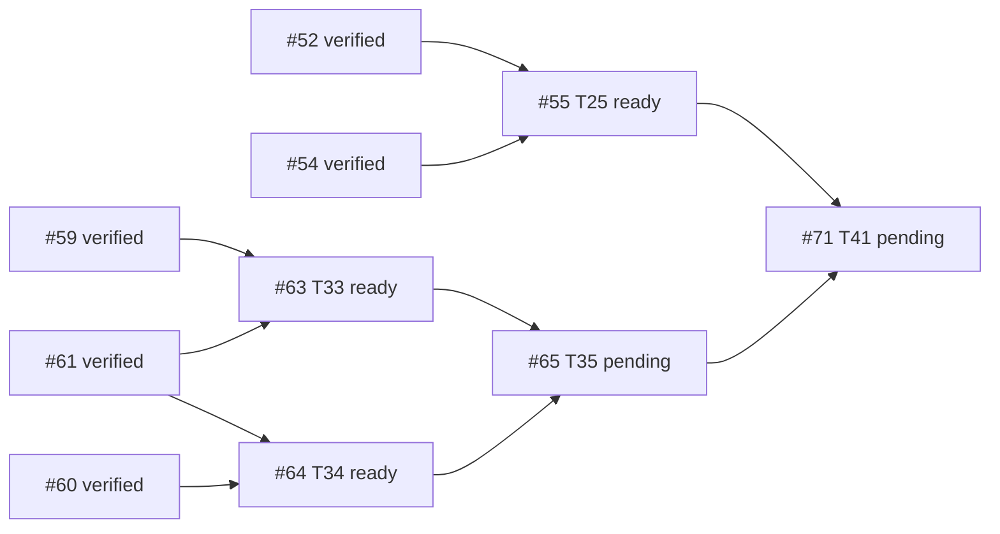

# B6 execution ledger — Issue #30 descendants #55 / #63 / #64

- GitHub read time: 2026-09-28 UTC, authenticated `gh` REST API.
- Repository: `1123786563/WeKnora-fork01` (origin remote).
- Root #30: open, approved specification; zero comments; native `sub_issues` endpoint returned an empty page. Its paginated timeline contains 41 distinct descendant issue references (#31–#71) and unrelated #174. All 41 descendant snapshots declare `Parent #30`; see `issues/index.md` and individual issue snapshots. No number-based filtering used.
- Existing implementation integration branch: `codex/issue30-mobile-office`, starting HEAD `db234c5eb171f2dde7427d382b55b503a038f879`.
- Current planning branch: `codex/issue30-b6-coordination`; baseline `db234c5eb`; planning-source checkpoint `df726bcaa55f1284e211b60c446de5fc4b37c1f3`.
- PR #174 is the existing local-delivery / #140 baseline PR. It is not modified here.

## Descendant readiness and B6 dependency edges

- #55 T25 is open; blocked by #52 and #54, both verified integrated in B5. It is ready.
- #63 T33 is open; blocked by #59 and #61, both verified integrated in B5. It is ready.
- #64 T34 is open; blocked by #60 and #61, both verified integrated in B5. It is ready.
- #65 T35 is downstream of #63 and #64 and stays pending.
- #71 T41 is downstream of #55 and #65 (among its other prerequisites); it stays pending. #51's exclusion-set TOCTOU repair `1c6779c7c` is integrated and has a mutation-test proof in `plans/plan-t51.md-report.md` §R5; prior final report's “not independently reviewed” statement is superseded by that report, but full historical final review/OCR limitations remain as written.

## Execution worktrees and scheduling

| Stream | Worktree | Branch | Base | Status | Owned files / conflict note |
|---|---|---|---|---|---|
| Coordination | `.worktrees/issue30-b6-coordination` | `codex/issue30-b6-coordination` | `db234c5eb` | running | Plans, issue snapshots, DAG, ledger, rulings and final evidence only |
| #55 | `.worktrees/issue30-b6-t55` | `codex/issue30-t55` | `df726bcaa` after plan transfer | ready | Delivery/codedelivery and mobile recovery; no Marketplace production files. Task 1's `delivery_collaboration_http_test.go` is outside #63/#64 ownership. |
| #63 | `.worktrees/issue30-b6-t63` | `codex/issue30-t63` | `df726bcaa` after plan transfer | ready | Marketplace lifecycle files. Shares migration/model/repository/service/router/admission seams with #64. |
| #64 | `.worktrees/issue30-b6-t64` | `codex/issue30-t64` | `df726bcaa` after plan transfer | ready | Security revocation files. Shares migration/model/adoption/upgrade/router/container/workbench/session seams with #63. Migration numbers moved to sqlite 000125/versioned 000204 to avoid #63's 000124/000203. |

### Preflight file/interface overlap matrix

| Plan/task pair | Shared files or interfaces | Finding / ruling |
|---|---|---|
| #63 T1 ↔ #64 T1 | migration tracks, adoption/marketplace persistence entities, repository test area | Real overlap. Serialize both Task 1s; #63 first owns sqlite 000124/versioned 000203; #64 uses sqlite 000125/versioned 000204. Merge/rebase and rerun migration uniqueness before downstream work. |
| #63 T2 ↔ #64 T2 | adoption and marketplace repository interfaces/types | Real interface overlap. #63 first; #64 adapts only after the lifecycle interface is stable and reviewed. |
| #63 T3 ↔ #64 T4/T6 | agent_adoption.go and agent_upgrade.go service guards | Real shared service files; serialize, lifecycle rejects Deprecated and security gate rejects revoked/blocklisted. Preserve separate predicates and deterministic error precedence; write compatibility tests. |
| #63 T4 ↔ #64 T7 | router params/route registration, container wiring | Real wiring overlap. Serialize #63 first, then #64 rebase onto reviewed lifecycle wiring. |
| #63 T5 ↔ #64 T8 | AdmissionCoordinator, workbench_start.go, container/workbench.go | Real seam overlap. #64 also adds session AgentQA gate. Implement one gate API with independently composable predicates; serialize seam edits and prove both behavior sets. |
| #63 T6 ↔ #64 T9 | test fixture/HTTP router suites | Same test architecture but distinct new files; can proceed independently after production APIs are stable, using non-overlapping files. |
| #55 Tasks 1–8 ↔ #63/#64 | no declared Marketplace production files; #55 owns delivery APIs, mobile composition and delivery test files | Parallel streams permitted in separate worktrees. Recheck changed-file lists before merging. |

## Task state / review / checkpoints

| Node | Status | Checkpoint / review |
|---|---|---|
| #55 T25 | verified | All implementation tasks T1–T8 integrated and task-reviewed/validated. T6 R3 and T8 R3 PASS; mobile suite/typecheck pass as recorded below. T7's live-provider leg remains blocked-env for lack of provider credentials; local opt-in path and tests pass. |
| #63 T33 | verified | T1–T6 integrated; concurrency repair and admission work reviewed/validated. Task6 chain integrated as `b687f539e`, `25bbaf6bf`, `85af2df6c`, `761093da8`, `1838eefdd`; history and production-composition reviews/validation pass. SQLite FK prevented one attempted RED mutation from reaching the assertion; duplicate `-lc++` warnings only. |
| #64 T34 | verified, integration evidence retained | Tasks 1–5 and Task6 R2 are verified. R2 source commit `22571cd3203a2cb76d2cb90532b0091189a7d055` was independently reviewed PASS and validated: focused tests ×3, build, diff check pass. The independent full repository suite attempt was interrupted after 133s; same-revision implementer report records repository+service package suites pass. PostgreSQL runtime remains untested. Coordination integration commits are `6f8f091d4` (Task6 initial service guard), `ed6968dd8` (Task6 R1), `cde067062` (Task6 R2). #65 plan may now be finalized; implementation starts only on a worktree based on integrated HEAD. |

### Completed task review rulings

- #55 Task 1 `3a0a7467b90036c0384a6fd149d8b491253422f6`: independent Spec/Quality review approved; no findings.
- #63 Task 1 `4385f6d6787e2094a46fc0b83f71c9167e62544c`: independent Spec/Quality review passed. One minor gap: migration alignment test checks SQLite column names but not null/default/type, versioned application, or rollback. Reviewer found SQL itself matches the plan. Defer this coverage strengthening to final review; no production correctness issue was reported.
- #55 Task 2 initial `82505197e150074b89447452a692252c3b3fd93c`: first run passed (no RED); initial Review found lost-PR-ack, remote-read/write evidence, route/auth claim and credential-surface gaps. Round1 repair `d83ff539b` was reviewed and found incomplete: unknown→resolve→dispatch lacked PR-only write proof, write counters covered only known paths, and credential response state checks could be vacuous. Round2 repair `cecd8d5a9d2b9d5515049290604857ea1a007b40` was independently PASS for spec and quality; full ingress write trace, resolve no-write, PR-only subsequent dispatch and response-state gating are now covered. Production router/auth remains explicitly outside this repository test fixture.
- #55 Task 3 `90580a2fa`: Review found in-place map mutation invalidated the whitelist assertion; repair `a2f7675a213589b8b1694b26063cc63dda155076` independently PASS.
- #55 Task 4 `a625ab30812268723092fbfc6749c01854021dcd`: independent Spec/Quality PASS; note 409 test models `body.code`, not separately top-level ApiError code; no production conversion exists and Task5 handles both.
- #55 Task 5 `a07ac18da9c8432b6cd202c344c52a49f5ca1823`: Review found revoked lease followed by rejected read/write exposed stale backend/conflict errors. Round2 repair `45c8531ffe73c507aacbd9da67a272e1fb778255` independently PASS; deterministic tests cover read rejection and write 409 after revoke.
- #55 Task 7 `4c1ce1b81`: Review found draft not asserted, unchanged SHA insufficient for zero writes, and README-only fixture could delete other baseline files. Repair `d4e6d6d2d` independently PASS; test is fail-closed on README-only tree, checks draft state twice and transport write counters. Real GitHub invocation is blocked-env and is not counted as live verification.
- #63 Task 2 `a4ab413a3e40f3f2bee4309cebc9d6c33f7f8ac1`: independent Review FAIL with one HIGH concurrency flaw. Do not integrate or unblock T64 Task2/#65 until repair and review pass.
- #64 Task 1 `6db98f0f1544dd4978e1657f98f5f692694365f1`: independent Spec/Quality PASS, low coverage gap only (SQLite column existence, no null/default/type, PostgreSQL execution or down test).

### Review-fix wave checkpoints

- T55 review-fix round 1 plan: `plans/plan-t55-task2-review-fix.md`, ruling `T55-review-fix-ruling.md`. Task2/Task3/Task7 had disjoint file ownership and separate worktrees.
- T55 review-fix round 2 plan: `plans/plan-t55-review-fix-round2.md`. Task2 commit `cecd8d5a9d2b9d5515049290604857ea1a007b40` and Task5 lease-fencing commit `45c8531ffe73c507aacbd9da67a272e1fb778255` each received independent Spec/Quality PASS. Task2 repair report is `.superpowers/sdd/plan-t55-review-fix-round2/task-1-report.md`; Task5 report is `.superpowers/sdd/plan-t55-review-fix-round2/task-2-report.md`.
- Task3 env whitelist repair `a2f7675a213589b8b1694b26063cc63dda155076` independently PASS; report `.superpowers/sdd/plan-t55-review-fix/task-2-report.md`.
- Task7 opt-in provider repair `d4e6d6d2d` independently PASS; no live GitHub credential/write opt-in available, so its actual provider leg remains blocked-env. Report `.superpowers/sdd/plan-t55-review-fix/task-3-report.md` in the Task7 worktree.
- T55 Task6 mobile UI/composition is running on an isolated worktree based on verified T55 Task5 fix `45c8531ffe73c507aacbd9da67a272e1fb778255`; T8 depends on its exported `activeDeliveryRecovery` checkpoint.
- T63 Task2 HIGH finding repair plan: `plans/plan-t63-task2-race-fix.md`. Architecture ruling: both repository writers must begin their transaction with the same tenant/id/state-guarded parent no-op UPDATE; SQLite's first write obtains writer reservation while PostgreSQL row updates serialize. Deterministic tests must use file-backed SQLite, separate connections and channel/callback barriers; no sleeps. Repair is active in `codex/issue30-t63` at `a4ab413a3e40f3f2bee4309cebc9d6c33f7f8ac1`.
- T64 Task2 read-only preflight confirmed its code files (`agent_security.go` and `agent_security_test.go`) are disjoint from the T63 race repair, but its release/variant reads consume the lifecycle schema and CreateVariant state contract. T64 Task2 stays unstarted until the T63 race repair is reviewed and integrated; its `ReleaseFacts` must include both local and tenant-introduced releases, deduplicating by ID with local rows winning.
- T55 Task6 review-fix plan: `plans/plan-t55-task6-review-fix.md`, active in the same isolated Task6 worktree. Review found stale task-route state/in-flight results and missing action invocation evidence; Task8 is blocked pending the repair's independent pass.

### Parallel execution checkpoints

- T55 independent streams use isolated worktrees: Task3 original and repair branches; Task4/T5 separately based on reviewed predecessor commits; Task7 original and repair branch; Task2 HTTP fixture remains in primary T55 worktree. No active streams share code files.
- #63 Task2 review-fix owns adoption lifecycle repository/service and focused tests in the existing T63 worktree. T64 Task2 is paused because of shared adoption interface/state semantics.
- #64 Task1 migration/entity/audit file set is disjoint from #63 Task2 lifecycle repository/service repair.

## Rulings

1. **Ruling:** use `timeline.cross-referenced` + each descendant's explicit `## Parent #30` statement as the scope evidence because the native `sub_issues` REST endpoint returns no children and its absence conflicts with 41 real descendant references; do not infer “no descendants.” Cost if wrong: a descendant omitted from timeline/Parent evidence would need a scope correction and implementation before #30 can close.
2. **Ruling:** serialize #63/#64 tasks that touch shared Marketplace types, migration tracks, service guard seams, route/container wiring and admission seams; parallelize #55 with isolated ownership and parallelize disjoint #63/#64 tasks only after stable reviewed interfaces. Cost if wrong: serialization costs time; premature parallel edits can produce incompatible lifecycle/security checks or duplicate migrations.
3. **Ruling:** move #64 migration IDs to sqlite 000125/versioned 000204; #63 keeps 000124/000203. Cost if wrong: migration IDs can be renumbered before merge; persisted environments must never see duplicate versions.
4. **Ruling:** treat #51 TOCTOU as verified repaired by `1c6779c7c` and the recorded mutation test, while preserving separate historical review/OCR caveats. Cost if wrong: #71 could accept a broken Action Plan exclusion invariant; its dedicated proof and final B6 review must recheck the behavior.

### T55 Task6 review-fix round 2

- Round 1 checkpoint `da2ce4911ae90c9af1686b1ee6736e88ee377ad5` fixed A→B route leakage, actual rendered-button behavior evidence, and bounded terminal scan scope; independent review then identified a remaining MEDIUM: A→B→A re-entry reuses the same taskId/runId, allowing an earlier A async completion to mutate the later A visit.
- Narrow repair plan: `plans/plan-t55-task6-review-fix-round2.md`; SDD brief `.superpowers/sdd/plan-t55-task6-review-fix-round2/task-1-brief.md`.
- Task6 remains unverified until this generation-fence repair is implemented, independently reviewed and validated. T55 Task8 remains blocked.

### T55 Task6 review-fix round 2

- Round 1 checkpoint `da2ce4911ae90c9af1686b1ee6736e88ee377ad5` fixed A→B route leakage, actual rendered-button behavior evidence, and bounded terminal scan scope; independent review then identified a remaining MEDIUM: A→B→A re-entry reuses the same taskId/runId, allowing an earlier A async completion to mutate the later A visit.
- Narrow repair plan: `plans/plan-t55-task6-review-fix-round2.md`; SDD brief `.superpowers/sdd/plan-t55-task6-review-fix-round2/task-1-brief.md`.
- Task6 remains unverified until this generation-fence repair is implemented, independently reviewed and validated. T55 Task8 remains blocked.

### Latest parallel execution update (2026-09-28)

- T63 Task2 race repair `512ff27cb5a29863ab26ed8b4d3e8d7aec12efd5` independently reviewed: Spec PASS; quality PASS. Reviewer accepts the guarded first transactional UPDATE and stale-state mappings. Record LOW evidence limitation: GORM callback ordering does not directly observe entry into SQLite driver lock wait; PostgreSQL schedule unavailable (`TRPC_TEST_POSTGRES_DSN` absent). This is disclosed in the task report and is not a blocker.
- T64 Task2 worktree now contains T64 Task1 plus T63 Task2 original interface commit and reviewed race repair, cherry-picked as `7c5afd541` and `2fc2feaca`. T64 Task2 dispatched to `backend_implementer` on exactly `agent_security.go` and `agent_security_test.go`; no migration/service/router ownership overlap.
- T55 Task6 repair round1 `da2ce4911` independently reviewed; A→B, button behavior and bounded terminal-scan fixes pass, but a new MEDIUM A→B→A stale-completion race was found. Narrow round2 plan `plans/plan-t55-task6-review-fix-round2.md` is committed (`701e1f879`); ledger finding record `6127253bb`. Same isolated Task6 implementer has been assigned route-entry generation fencing; Task8 stays blocked.
- Read-only readiness scan found no other safe implementation task at this point. Existing independent execution remains T55 T6 round2 and T64 T2, with T63 review complete.

- After T63 Task2 independent PASS and integration to the coordination line (`65156cd4b` T1, `8e997cd96` Task2 interface, `156f070e0` race repair), T63 Task3 is now unblocked. It is dispatched on the existing T63 worktree with service-only ownership while T64 Task2 owns the repository security files and T55 Task6 round2 owns mobile UI files; these three streams are file-disjoint. T63 Task4/5 and overlapping T64 service/wiring/admission tasks remain serialized.

- T55 Task6 round2 implementation checkpoint `c338e2f0b71113bc23a4a5b18431f2e7880bdaa2` completed on the Task6 worktree, adding per-route-entry generation fencing and deferred A→B→A old read/success/failure cases. Implementer reports focused 72/72, mobile 280 pass / 14 opt-in skipped / 0 fail, typecheck, API-client terminal-surface check and diff check pass. Independent reviewer and frontend validator are now running in parallel; Task8 remains blocked until both pass and checkpoint integration.
- T64 Task2 has confirmed expected RED (store/types undefined), added prescribed tests and implementation, and is running focused GREEN. T63 Task3 has started RED-first work on disjoint service files.
- T55 Task6 round2 review provisional finding: MEDIUM still open. `TaskDetailRouteLifecycle` advances generation only when its retained component instance receives different task/run props; Expo Router Stack `push` may preserve A while B is pushed, and returning to A may restore the same A instance/props. Current deferred test mutates the generation seam manually rather than proving actual focus/return lifecycle. Independent reviewer requested route focus/entry-key binding and an actual lifecycle test. Task8 remains blocked pending final review and a further focused repair; read-only navigation lifecycle research is active.
- T55 Task6 round2 frontend validator finished: focused 72/72, full mobile 280 pass / 14 opt-in skipped / 0 fail, typecheck, API terminal-surface test and diff check passed at `c338e2f0`. Validator confirms tests simulate route-entry generation through handler seam rather than mounted Expo Router navigation; this matches the independent review’s open MEDIUM lifecycle gap, so validation evidence does not close it.

### T55 Task6 route-focus repair round 3

- Round2 independent review FAIL: checkpoint `c338e2f0` only advances generation on prop changes; Expo Router Stack may retain A while B is pushed and restore the same A component/props, so old A work can still complete after refocus. Round2 validator also confirms its generation test manually simulated entries rather than exercising the production route lifecycle.
- Read-only research confirmed `_layout.tsx` uses Stack with no unmount/focus handling, `tasks.tsx` uses `router.push`, and `TaskDetailRouteLifecycle` has no focus/blur subscription. Research recommends the existing Expo Router `useFocusEffect` public hook, fresh epoch on focus and synchronous invalidation on blur.
- Narrow round3 plan: `plans/plan-t55-task6-review-fix-round3.md`; SDD brief `.superpowers/sdd/plan-t55-task6-review-fix-round3/task-1-brief.md`. Next dispatch must own the same two mobile files and exercise the mounted lifecycle component's focus/blur callback seam with A retained and unchanged IDs. Task8 remains blocked.
- Integrated reviewed T64 Task1 checkpoint `6db98f0f1` into the coordination line as `660792d5f`; its migration IDs remain SQLite `000125` / versioned `000204` alongside T63 `000124` / `000203`.
- T64 Task2 commit `da8a26181e4735b3611864704e66aa590a9bb617` is complete on its isolated worktree. Focused `TestAgentSecurity` suite and diff check passed; PostgreSQL unavailable. Independent reviewer and backend validator are now checking it in parallel; do not release T64 downstream tasks until review passes.
- T63 Task3 implementation has RED/GREEN and broader service regression evidence reported; agent is finalizing its owned-file check and local commit. Its five-file service/interface scope is disjoint from T64 Task2's repository scope and T55 Task6 mobile scope.
- T64 Task2 independent Review: Spec PASS, code quality PASS; one LOW test gap where the map conversion could hide duplicate Release IDs. Backend validator independently passed focused `TestAgentSecurity`, migration-number uniqueness, and diff checks at `da8a26181`; no PG DSN. A narrow test-only plan `plans/plan-t64-task2-review-fix.md` and brief are ready; T64 Task3 remains blocked pending its review.
- T64 Task2 LOW repair `a924b4952f233266afc5873066a8ae2775473f9b` independently reviewed PASS. T64 Task2 implementation + repair are integrated into coordination branch as `475a34500` and `b59a35bcb`; its original checkpoint validation passed focused repository tests, migration uniqueness and diff check. PostgreSQL remains unverified without DSN.
- T55 Task6 round3 review PASS (Spec/Quality PASS); LOW integration-evidence boundary only: the Node test drives the production component's registered focus callback but not a real native navigator or production reader on refocus. Frontend validation is still running. Route-focus implementation commit `17fde2a5` is not yet integrated pending validator result.
- T55 Task6 round3 checkpoint `17fde2a5cfd50f1577ed6bf2ff3f6d5e0fe64ba0` passed independent Spec/Quality review and frontend validation. Validator: focused app/purity 2/2, full mobile 281 pass / 14 optional skipped / 0 fail, typecheck, API terminal-surface 1/1 and diff check pass. Review/validation limitations: Node harness invokes registered focus callback but does not mount native navigator; deferred reader rejection not separately exercised. Neither blocks the state-fencing fix.
- T55 Task8 is now ready and dispatched in a separate worktree based on `17fde2a5c`; exact owned files are `delivery-integration-smoke.ts` and its test. It runs parallel with T63 Task3 review-fix and has no Marketplace overlap.

### T63 Task3 review repair

- Task3 implementation `c28e783bb3010d748e79779391b65ade097ed4d9` independently validated (focused and adjacent service filters + diff check passed) but review failed: HIGH ended-Adoption reactivation/mutation; MEDIUM A↔B successor cycle; MEDIUM deprecated-release check/write race; no active-Adoption AcceptUpgradeProposal deprecated-target test.
- Read-only architecture ruling groups findings into two serial waves because both touch the same repository state seams: Task1 makes Adoption terminal across direct Adopt and public IntroduceRelease paths; Task2 serializes release deprecation and repository-level use gates, then adds direct Accept behavior test. Detailed plan `plans/plan-t63-task3-review-fix.md`; Task1 brief is prepared. T63 Task4/5 remain blocked.

### T64 Task2 and T55 Task8

- T64 Task2 LOW cardinality repair `a924b4952f233266afc5873066a8ae2775473f9b` review PASS; exact focused test passed in implementer run. Task2 original checkpoint validation independently passed `TestAgentSecurity`, migration uniqueness and diff checks; PG DSN absent. Integrated implementations in coordinator line are `475a34500` and `b59a35bcb`.
- T55 Task8 worktree creation via managed tool could not resolve a commit held only in the isolated T55 clone; fallback `git worktree add` inside the T55 Task6 clone created an isolated worktree at its exact reviewed base `17fde2a5c`. The worker could not see coordinator-local ignored brief, so the full formal brief was sent directly in its task message; plan Task8 is in the worktree.
- T55 Task8 implementation `3cf6b7be01d1f9d44a6b6889c79ed1dd2ab98dde` completed on isolated `codex/issue30-t55-t8` based on reviewed Task6 route-focus checkpoint. Implementer reports focused 3/3, full mobile 282 pass / 14 opt-in skipped / 0 fail, typecheck and diff check. Independent reviewer + frontend validator are running; no live deployment/credentials used.
- T64 Task3 is now unblocked after T64 Task2 implementation, LOW finding fix, review and validation all passed. It owns only two new agent-run security repository files and runs parallel with T63 Task3 terminality repair and T55 Task8 reviews; downstream Task4 waits for review/validation.
- T55 Task8 independent review and validator rejected checkpoint `3cf6b7be`: two MEDIUMs (already-delivered recovery mislabeled as recovered/first row stops later candidates; no execution behavior tests for recovery evidence branches) and one LOW comment claiming whole flow is read-only despite opt-in dispatch. Narrow review-fix plan saved at `plans/plan-t55-task8-review-fix.md`; keep Task8 unverified and do not integrate until fixed/reviewed/validated. Live deployment remains intentionally unrun.
- T64 Task3 implementer confirmed expected RED (`CancelRunsByAgents` undefined), added method and targeted tests including lease/revision, malformed snapshot fail-quiet, and empty no-op; focused plus adjacent regression checks are in progress.
- T64 Task3 `CancelRunsByAgents` committed `762ca4e40593beb86800a9b61914b4358ea209ba`, only the two planned new repository files. Implementer reports expected RED, focused+existing cancellation regressions PASS (6.120s), and diff check PASS. Independent reviewer/backend validator are running in parallel.
- T63 Task3 review-fix Task1 RED confirmed on prior implementation for same-release re-Adopt and public IntroduceRelease after ended state. Implementer has transactional scope no-op guard + active-only reconcile and service conflict mapping; focused repository/public-introduction tests are running. Task2 remains blocked until this slice is reviewed and validated.

### B6 recovery update — T55 Task8 R1 and T64 Task3 R1

- T55 Task8 review-fix R1 committed `cf99b43b4a2d5c2e1e47aa2c9d7fee09e9b71e2b` in isolated T55 Task8 worktree. It adds an executable recovery evidence segment, scans past delivered/ineligible rows, reports attempted run/delivery IDs, distinguishes recovered/not-needed/failed and corrects opt-in dispatch documentation. Implementer reports focused 11/11, mobile typecheck, full suite 290 pass / 14 optional skip / 0 fail, diff-check; live service intentionally untouched. Independent reviewer and frontend validator dispatched; Task8 remains running/unverified until both finish.
- T64 Task3 original checkpoint `762ca4e40593beb86800a9b61914b4358ea209ba` was independently rejected for HIGH PostgreSQL `wait_reason VARCHAR(64)` overflow risk and MEDIUM SQLite read-to-write busy race. Narrow repair plan `plans/plan-t64-task3-review-fix.md` committed as `6ef546e4c`; implementation assigned to the existing T64 backend implementer on the disjoint two-file repository-cancel seam. Full brief supplied inline because `.superpowers` is ignored. Independent review/validation follow.
- Parallel boundary remains: T55 smoke source/tests; T63 adoption/public-release lifecycle repository/service seam; T64 agent-run cancellation repository source/tests. No owned files overlap. T63 Task2 remains serialized behind Task1 verification; T64 later service/wiring/admission tasks remain gated by shared interfaces.
- T55 Task8 R1 validation passed its local scope at `cf99b43b4a2d5c2e1e47aa2c9d7fee09e9b71e2b` (11 focused, typecheck, full mobile 290 pass / 14 optional skip, diff check). Independent reviewer found two new MEDIUM evidence-attribution defects: output receipt fields came from first delivered row instead of later attempted row, and read failure after conflict inherited previous attempt IDs. T55 R2 narrow plan is `plans/plan-t55-task8-r1-review-fix.md`; same implementer is doing RED→GREEN, with expected RED 8 pass/4 fail reported. Keep Task8 unverified pending R2 independent review/validation.
- T63 Task3 Task1 repair has expected RED for service mapping (removing mapping causes missing conflict error); two-connection file-backed callback schedule test now passes. Implementer notes this proves controlled callback ordering, not direct driver busy-wait observation. Implementation and broader checks still in progress; T63 Task2 wave remains blocked.
- T63 Task3 review-fix Task1 implementation committed `151ee5eddd61df4b377f39bd6754f70defc03493` (5 owned files) after RED for ended same/different Release, public IntroduceRelease rollback, and service error mapping; targeted repo/service tests and diff check passed. Two-connection callback schedule confirms controlled ordering/final state but not direct SQLite driver busy-wait. Backend validation passed targets with concerns: validator checkout lacked plan pointers and PG-specific evidence. Independent reviewer is still pending; do not launch Task2 or integrate until review ruling and plan linkage are recorded.
- T55 Task8 R2 validation passed at `05d21d4fa81cf6f4427c5b1e492a7c51e983440d` (12 focused, typecheck, 291 mobile pass / 14 optional skips, diff check), but reviewer found two MEDIUM findings (successful recovery omitted returned external receipt; retained preattempt row on later read failure lacked source IDs). Narrow R3 plan `plans/plan-t55-task8-r2-review-fix.md` dispatched. R3 implementation committed `36450d0d5a3646c003c8c8b76bd676edc804c960` (only two smoke files): retains and validates DeliveryReceiptView IDs, uses returned receipt and explicit row IDs distinct from failureRunId. Implementer reports RED 8 pass/5 fail, focused 13/13, typecheck/full suite 292 pass/14 optional skips, diff check. Independent R3 reviewer and validator running; Task8 still unverified.
- T64 Task3 review-fix R1 committed `cddffc455f5f8d886a814cd24ad2a9db74518a3f` (only cancellation repo/test files): bounded wait_reason code while full reason stays in event; tenant no-op UPDATE obtains SQLite writer reservation before candidate scan; two-connection channel barrier test has no sleeps. Original defects were RED; repair focused/adjacent tests and diff-check passed per implementer. PostgreSQL DSN remains absent. Independent T64 review and validator are running; Task3 remains unverified.
- T55 Task8 R3 `36450d0d5a3646c003c8c8b76bd676edc804c960` received independent reviewer Spec PASS / Quality PASS and validator PASS (13 focused, typecheck, full mobile 292 pass/14 optional skips, diff-check). The reviewer noted the dedicated R3 plan file was not visible in its checkout, but independently checked the intended seam and findings; no blockers remain in Task8 local code. Live deployment evidence remains unavailable/prohibited by the task brief; record as environment limitation and do not claim that leg executed.
- T63 Task3 review-fix Task1 `151ee5eddd61df4b377f39bd6754f70defc03493` reviewer found F1 MEDIUM: public AdoptPublicListing lacks mapping and returns 500 for ended transition; F2 MEDIUM: IntroduceRelease does introduction DB access before scoped guard; F3 LOW missing ended winner unique-loser test. R2 plan `plans/plan-t63-task3-review-fix-r2.md` dispatched to same backend implementer; downstream remains blocked.
- T64 Task3 review-fix R1 `cddffc455f5f8d886a814cd24ad2a9db74518a3f` reviewer verdict Spec PASS / Quality PASS, one LOW gap: race test exercises only one run and not multi-run batch atomicity. Full reason remains in event; bounded reason fits PostgreSQL VARCHAR(64); SQLite writer is reserved before scan. Backend validator is running, PG runtime unavailable. Task3 stays unverified until validator result is recorded.
- T64 Task3 R1 verification completed at `cddffc455f5f8d886a814cd24ad2a9db74518a3f`: independent targeted cancellation/security store tests and diff-check passed; only two owned files changed. Independent review Spec/Quality PASS; LOW multi-run atomicity evidence gap and PostgreSQL runtime unavailable are recorded. Integrated original Task3 `762ca4e4` and R1 `cddffc45` into coordination branch as `2f06b5416` and `3a79713c5`; no source conflicts after including the original add-file checkpoint first.
- T55 Task6 + Task8 verified integration: researcher read-only ancestry audit showed the correct T55 chain from common base `b5698d690`: Task6 tip `17fde2a5c`, Task8 R3 tip `36450d0d5`; earlier cherry-picking interior `da2ce` was correctly aborted after conflicts because Task4/5, terminal-purity fixture, and earlier Task6 commits were omitted. Full Task6 tip merged cleanly (merge commit below), then full Task8 tip merged cleanly, preserving verified lineage. Task6 R3 review and frontend validation PASS; Task8 R3 review Spec/Quality PASS and validation PASS (13 focused, full mobile 292 pass/14 skips, typecheck, diff-check). Live deployment checks remain environment-gated. The authoritative T55 state in the coordination branch is the merged full chain.
- T63 Task3 R2 repair implementation committed `b34a4702dee2186004de4848396005c16fe31aeb` on Task1 R1 `151ee5e`; public conflict maps to 409, introduction guard precedes existing/new ledger read/write, rollback and ended unique-loser branch added. Implementer targeted handler/repository/service tests and diff check pass. SQLite winner injection uses same-transaction callback; independent transaction/PG concurrency not claimed. Independent review and backend validation dispatched; do not integrate or release Task2 until both pass.
- T63 Task3 R2 independent review: Spec PASS, Quality PASS with LOW test gap only (callback tests do not model separate transaction/PG interleaving). Independent validator targeted handler/repository/service filters and diff-check all PASS; no implementation report was visible in ignored path, so review/validation conclusions rely on committed source/tests and validator reruns, not implementer report claims. Integrated T63 Task3 original/R1/R2 sequentially into coordination branch as `0287def2e`, `90a1e05ac`, `562d4d0d3`.
- With T63 Task3 verified/integrated and file boundaries confirmed disjoint, T63 Task4 (handler/routes/router/container) and T64 Task4 (new security interfaces/service/test files) dispatched concurrently in separate existing worktrees. T63 Task5/admission and T64 Task6/8 remain serialized due shared service/admission seams.
- T64 Task4 implementation commit `0f0239eb0` review found MEDIUM structurally invalid persisted dependency locks (`null`, `{}`, missing/null dependencies) can decode as empty and yield `ok`; validator was paused before validating that checkpoint. Narrow repair plan `plans/plan-t64-task4-review-fix.md` dispatched to original backend implementer; Task4 stays unverified.
- T63 Task4 implementation `750e27771` targeted tests/build/diff validation passed, but independent review found HIGH DI failure: concrete lifecycle service is provided while handler requires interface, so production Dig router cannot resolve. Validator's initial PASS predates this review and does not cover DI graph; it cannot release Task4. Narrow plan `plans/plan-t63-task4-review-fix.md` is active on the same T63 worktree; add a real DI resolution test and explicit interface binding, then re-review/re-validate.
- T64 Task4 original `0f0239eb0` is unverified due MEDIUM malformed-structure lock finding. R1 repair `83a173fc1` adds structural validation while allowing a valid empty array and adds boundary tests. Independent reviewer now passes Spec/Quality for repair scope and finds prior LOW test gaps resolved. Independent validator is rerunning final commit; Task4 remains unverified until that evidence arrives.
- T63 Task4 DI repair commit `70e2dc784` (final report HEAD `f85562edb`) explicitly provides `interfaces.AgentMarketplaceLifecycleService` through production container wiring and adds a RED/GREEN container resolution test. Implementer reports router/container filters, build, diff-check pass. Independent reviewer and validator re-running this repaired range; Task4 remains unverified until both reports.
- T64 Task4 R1 `83a173fc1` independent reviewer passes and closes the MEDIUM structural lock finding and LOW case/precedence test gaps. Final validator has been explicitly restarted against `83a173f`; do not release Task5 before verification.
- T63 Task4 DI repair R1 final validation passed at `f85562edb`: container/router tests, `go build ./...`, diff-check; review Spec/Quality PASS and HIGH closed. Integrated T63 Task4 implementation and DI repair/report commits as `4ecad56fb`, `57c1f63b5`; retained evidence report commits as well.
- T64 Task4 R1 final validation passed at `83a173fc1`: malformed/valid-empty/boundary tests, related service filter, build, diff-check; review Spec/Quality PASS and earlier findings closed. Integrated T64 Task4 original+repair as `eb358d4a4`, `204dc3460`. PG and unrelated admission/wiring checks remain outside scope.
- T63 Task4 repair final review Spec/Quality PASS and validator PASS at f85562ed (container + lifecycle router, `go build ./...`, diff check). T64 Task4 repair final independent review Spec/Quality PASS and validator PASS at `83a173fc1` (new structural-lock tests, related service filter, full build, diff check). T63 code+fix and report commits (`4ecad56fb`,`57c1f63b5`, `ce888558b`,`113bc85b8`), and T64 Task4+repair (`eb358d4a4`,`204dc3460`) are integrated.
- T63 Task5 retired-agent admission gate and T64 Task5 security revocation operations are now dispatched concurrently in their isolated streams. Owned file sets are disjoint: T63 admission/workbench handler/container vs T64 `agent_security.go` service. T63 Task6 and T64 Task6/7/8 remain dependency-gated until these verified interfaces are integrated.
- T64 Task5 was stopped before any edits because the approved plan requires atomic ledger+audit persistence but Task2 AgentSecurityStore had no transaction seam. Read-only architect confirmed `NewAuditLogRepository(tx)` can operate inside the store-owned GORM transaction. Supplement `plans/plan-t64-task5-transaction-seam.md` now adjusts ownership to typed methods in `repository/agent_security.go` plus Task5 service/tests; run cancellation stays post-commit. Original backend implementer resumed with explicit expanded ownership and rollback test requirements. T63 Task5 continues independently on disjoint workbench/admission files.
- T63 Task5 implementation committed `cded1932c8fc8ffc8401d5ab883052f33c0d102b` on verified Task4 repair branch. Admission gate executes before `CreatePending`; denial leaves no row; repo errors fail closed; handler maps to 409; tests include live/empty Agent and gate clear. Implementer reports focused admission/session/container tests, build and diff-check pass. Independent reviewer/validator active. T64 Task5 resumed with explicit store-owned atomic audit seam supplement; no source edits reported yet.
- T63 Task5 checkpoint `cded1932c` reviewer found HIGH race between retirement and final run insertion, MEDIUM idempotent replay blocked by early gate, MEDIUM queue_next returns 500. Initial validator was paused; it had run tests/build but issued no PASS. Read-only architecture ruling makes `AgentRunStore.Admit` authoritative: row write-lock/state read after idempotency lookup, explicit AgentID in Admission, early gate retained; race denial rejects pending intent/releases unstarted budget, no Run/session slot; queue_next maps 409. Supplement `plans/plan-t63-task5-review-fix.md` dispatched to same backend implementer. T64 Task5's separate audit transaction seam stays in a disjoint repository/service path.
- T64 Task5 implementation committed `fd046e8dfe26ff76eedd4cf607ced657b4c4956e`; includes typed repository atomic ledger+audit methods, release/dependency revoke and reinstate operations, tenant history/scope, post-commit cancellation, allow mode/count update. Implementer reports rollback and success coverage, focused service/repo/regressions, build, diff-check pass. Independent review and backend validation dispatched. Report is ignored/untracked in T64 worktree; no source loss.
- T64 Task5 review/validation found MEDIUM canceled-count split-commit issue (cancel transaction commits before count write); low gaps are dependency cancel behavior and dependency audit rollback. Validator also noted audit ActorUserID should represent the revoker; current implementation sets that from actorID and stores revoked_by on ledger row, which should be asserted explicitly. Repair plan `plans/plan-t64-task5-review-fix.md` now makes count update atomic with cancellation transaction and adds dependency cancel/rollback tests; same backend implementer resumed.
- T64 Task5 R1 repair committed `53d6349184dcda14b8aa2453358053a65545c28d`: run cancellation and canceled_run_count now share the AgentRunStore transaction with tenant/kind/ID reference; added count-update failure rollback, dependency exact-lock/foreign tenant cancel, dependency audit rollback and actor identity assertions. Implementer reports focused/related service+repo tests, build and diff-check pass. Independent review/validator active; Task5 remains unverified.
- T63 Task5 R1 fix committed `b4ac07f318d7111ba2f427460e3be81f7ddbf41d`: authoritative transaction gate inside AgentRunStore.Admit after idempotency and before slot/run; explicit AgentID; same-hash admitted replay before fast gate; pending denied/rejected and reservation released; queue_next maps 409. Implementer reports file-backed SQLite race/replay tests repeated, workbench/session/container tests, build and diff-check pass. Independent review/validator active. T64 Task5 R1 review passes with LOW mismatch-isolation test gap (version and digest changed together); validator active.
- T63 Task5 R1 reviewer confirmed original race, replay and queue_next defects closed, but found MEDIUM recovery gap: a pre-existing pending request with held reservation is denied by early gate before request reconciliation, so it remains pending/reserved indefinitely after retirement. R1 validator's focused tests had passed but build was still running when paused; its no-gap claim predates this finding and does not verify the recovery branch. Supplement `plans/plan-t63-task5-r1-review-fix.md` requires pending→rejected CAS and exactly-once reservation release on denied retry; same implementer resumed.
- T64 Task5 R1 independent review Spec PASS / Quality PASS with LOW gap (version and digest mismatch are combined in one negative test; separate controls not covered). Validator PASS at `53d6349184dcda14b8aa2453358053a65545c28d`: cancellation/count rollback + dependency/audit rollback behavior, broader service/repository tests, build, diff-check. PostgreSQL not run; cancellation failures leave already committed revocation+audit by design/plan. Integrated Task5 original+repair as `fd046e8d` and `53d6349` (new coordination hashes below).
- T63 Task5 R2 commit `7e3a9534...` fixed pending request settlement on confirmed retirement, but re-review found MEDIUM R2-F1: helper settles on any gate error, so transient lookup failure rejects pending/releases reservation and can race a concurrently admitted Run. R2 validation paused (new repeated workbench tests had passed; repository command incomplete, no final report). R3 plan `plans/plan-t63-task5-r2-review-fix.md` requires settlement only for `errors.Is(err, ErrAgentUseDenied)`; generic errors must leave pending retryable. Same implementer resumed.
- T64 Task6 (#64 governance predicates on Adoption/Upgrade services) is dependency-ready after verified/integrated T63 Task3 and T64 Task4/5. It shares the existing `agent_adoption.go`/`agent_upgrade.go` service files with completed T63 Task3, so its implementation must start from the current coordination HEAD (includes verified lifecycle predicates), not the older T64 Task5 checkout. A fresh managed worktree is being created at coordination base `522a73e7b`; concurrent T63 Task5 R3 owns only workbench admission/request files and does not overlap.
- T63 Task5 R3 commit `1186048286c6fdddd2fef76e4e0c93699ba85910` closes R2 finding by settling pending intents only for wrapped/unwrapped `ErrAgentUseDenied`; generic gate errors leave pending/reservation retryable. Adds transient error→wrapped denial case; implementer reports focused/adjacent tests, build and diff-check pass. Independent review Spec/Quality PASS with no new findings; final validator dispatched. T64 Task6 started in fresh managed worktree `~/.codex/worktrees/issue30-t64-t6/WeKnora-fork01` at verified coordination base `522a73e7b`; task6 service gate files are disjoint from T63 admission repair.
- T63 Task5 R3 final verified at `1186048286c6fdddd2fef76e4e0c93699ba85910`: Spec/Quality review PASS; validator repeated race/replay/transient settlement, adjacent workbench/repository/session/container, build and diff-check all PASS. SQLite only; PostgreSQL runtime remains untested. Integrated Task5 original + R1/R2/R3 sequentially as `cded1932c`, `b4ac07f31`, `7e3a9534`, `1186048286` (coordination cherry-pick commits immediately above). R1/R2 findings and resolutions are preserved in dedicated plans/reports.
- T64 Task6 implementation committed `cfb422f9f` on fresh coordinator-based worktree (HEAD based on `522a73e7b`), modifies only Adoption/Upgrade service guards and new service tests. Implementer reports nil compatibility, blocked-release checks, deprecated guard preservation, focused/regression tests/build/diff-check passing; independent review/validator active. Since R3 T63 Task5 only changes admission, T63 Task6 acceptance E2E tests (`routes_agent_marketplace_lifecycle_test.go` only) now run concurrently; the files are disjoint.
- T64 Task6 initial commit `cfb422f9f` review found two MEDIUM issues: Adopt/CreateVariant security gate precedes explicit release-listing membership validation (can misclassify unknown Release or disclose cross-listing revocation reason); all four service gate checks are separate from downstream writes, so a revocation can commit after gate and before use. Final validation paused. Read-only architecture ruling requested for transaction-level serialization/interface boundaries; repair must preserve existing deprecation rules and avoid process mutex.

### Parallel review-fix wave — T63 Task6 evidence + T64 Task6 atomic gate

- Collected live child-agent state before dispatch: T63 Task6 implementer completed at `0d99b972eaedfaf6aa23a776e798d81d85206e57`; its independent review completed with two MEDIUM evidence findings; no validator has started. T64 Task6 original implementation is `cfb422f9f61ec7e6d351c4581dd8c492d2d29303`, review completed with two MEDIUM findings, and its validator report is HOLD (not passed). Read-only architecture agent completed with a shared tenant-row serialization recommendation. T55 Task6/8 and T63 Task5 validator/reviewer work had terminal PASS as recorded above. No source changes were made by reviewers/validators.
- Preflight conflict scan: T63 R1 owns only `internal/router/routes_agent_marketplace_lifecycle_test.go`; T64 R1 owns Adoption/Upgrade service and repository security/admission transaction files plus their tests. There is no shared source path. Separate worktrees are clean: T63 `codex/issue30-t63` at `0d99b97`; T64 Task6 detached worktree at `cfb422f`. Interface dependency is stable: both consume the already integrated Task3 lifecycle predicates and T64 security store APIs. Shared container/router production files are excluded from T64 R1; T63 R1 exercises the production container provider without editing it.
- Task self-consistency scan: T63 plan maps #63 AC1 to seeded-record identity/link checks, AC2 retains existing unlisted/deprecated matrix, and AC3 uses production coordinator composition plus 202→retire→409/no-write assertions. Its plan modifies tests only and each assertion is scoped to `routes_agent_marketplace_lifecycle_test.go`. T64 plan maps the listing authorization boundary and post-revocation commit invariant to service validation order and guarded repository writes. The same tenant guard must wrap admission decisive writes and existing typed ledger+audit transactions; no lock spans service/external calls. Publish’s final CAS and upgrade proposal acceptance transition are explicitly the serialized boundaries.
- Plans: `plans/plan-t63-task6-review-fix.md` and `plans/plan-t64-task6-review-fix.md`. Each has its own SDD workspace/ledger under `.superpowers/sdd/plan-t63-task6-review-fix/` and `.superpowers/sdd/plan-t64-task6-review-fix/`; generated Task 1 briefs are stored there. Repair implementation is authorized and dispatched concurrently because files and worktrees are disjoint; review and validation will remain independent.
- T63 R1 plan correction: implementer `t63_t6_review_fix` could not import `internal/container` from the router test due the verified `router → container → router` cycle. F2 exact identity/link assertions were committed as `707b0f803dfd3c7cf31271de1b1acdda5dab1fe7`; focused router/container/service/workbench tests and diff check passed, but Task 6 remains unverified. Ruling: review/validate F2 as its own narrow repair and cover F1 in `plans/plan-t63-task6-production-wiring.md`, a new `package container` production-provider HTTP test. Cost if wrong: production DI omission may escape AC3 despite the router test's manually installed gate. No production source changed.
- T65 preflight: read Issue #65 and approved Spec/CONTEXT/ADR. The expected `plans/plan-t65.md` is absent from the coordination worktree and all `.worktrees`; no stable Task ownership/interface plan exists. Current Issue snapshot says #65 is blocked by #60/#63/#64 and blocks #71. Do not dispatch implementation from inferred boundaries. Reconstruct the approved plan once #63/#64 interfaces are verified; exact scope remains Evaluation, privacy-preserving Metrics and Publisher Custody. Read-only researcher report found marketplace core seam locations but no T65-specific Evaluation/Custody/Metrics API. The initial researcher inspected main HEAD `14d2d066` rather than coordination HEAD; revalidate all code findings against coordination after plan recovery. Migration numbering must be rechecked: researcher observed versioned max `000193` and missing `000192`, which requires an explicit migration-history audit.
- T63 R1 review/validation result: reviewer `t63_t6_r1_review` found MEDIUM F2-R1-1 (exact Adoption row and Variant pinned ReleaseID not asserted). Validator at `707b0f803` passed the scoped router tests and diff check but reported a coverage concern: brief text said lineage, while fixture had only original Releases and did not link the seeded registry License through manifest lineage. Ruling: do not synthesize a Fork by mutating immutable release data. Clarify that #63 AC1's lineage in this fixture is Adoption→accepted Release, Variant→pinned Release, Release→Submission→Version and Release manifest→license registry; add exact assertions for those links. The fixture's non-Fork `ForkSource*` empties remain out of scope; dedicated #62 tests cover actual fork lineage. Cost if wrong: a lifecycle operation might repoint the Adoption/Variant source or detach manifest license while counts stay constant.
- T63 Task6 R1 plan `plans/plan-t63-task6-history-r1.md` records this narrow fix at base `707b0f803dfd3c7cf31271de1b1acdda5dab1fe7`. Same implementer is resumed for the first task review-fix round; validator evidence is stale after any code change and will be rerun on the new HEAD. AC3 production wiring remains a separately planned task, gated on F2 verification.

### T63/T64 Task6 current review-fix wave

- T63 history R1 checkpoint `e033c95eaebbcfce2e257ae75a4e33510c75fb37` validator PASS: the three planned router lifecycle tests passed and `git diff --check BASE..HEAD` passed. Independent review found MEDIUM F2-R2-1: Release and Submission version IDs were related to each other after exits but not each pinned to its own pre-exit value. Validation alone does not close the finding.
- R2 plan `plans/plan-t63-task6-history-r2.md` and SDD brief `.superpowers/sdd/plan-t63-task6-history-r2/task-1-brief.md` now require pre-exit snapshots and exact per-row post-exit comparisons. Fresh backend implementer `t63_history_r2_impl` is working in the T63 worktree, only on `internal/router/routes_agent_marketplace_lifecycle_test.go`. F1 production-composition HTTP test remains gated on the final F2 R2 review and validation.
- T64 Task6 repair preflight found `time.After(100ms)` in an existing deterministic race test and test fixture files outside the initial Owned files. The R1 plan now explicitly owns `internal/application/repository/agent_marketplace_lifecycle_test.go`, `internal/application/service/agent_adoption_test.go`, `internal/application/service/agent_upgrade_test.go`, and `internal/application/service/public_marketplace_test.go` in addition to its planned repository/service files. The last file must seed tenant 2 identity while preserving no local Listing/Release rows, as required for the existing cross-tenant Adoption scenario. Minimal tenant rows are an explicit prerequisite for guarded repository transactions. The implementer reports the timing wait was replaced by a callback/channel barrier and that the contested test passed ten runs; the broad service run caught the additional stale fixture. It remains on hold until that fixture is repaired and repository+service suites, review and validation complete.
- T63 history R2 implementation commit `5f121c96df241724428adb2187b9984caf333fb5` captures each Release and Submission version ID separately and compares each post-exit row with its own pre-exit snapshot. Independent reviewer reports Spec PASS / Code Quality PASS with no findings; validator ran all three planned router lifecycle tests and diff check successfully at the same BASE `e033c95eaebbcfce2e257ae75a4e33510c75fb37` → HEAD `5f121c96df241724428adb2187b9984caf333fb5`. The attempted RED mutation was blocked by SQLite FK before reaching assertions; this limitation is recorded. The T63 Task6 AC3 production-provider HTTP test is now unblocked; it owns only new `internal/container/workbench_agent_lifecycle_test.go`, disjoint from T64 repository/service repairs, and has been dispatched to run concurrently.
- T65 migration audit (read-only, coordination HEAD `c203b44f7ea3698bb761364a8d4492340fc79c43`): PostgreSQL/versioned next is `000205`; SQLite next is `000126`; gaps are historical and migration uniqueness tests do not require contiguous numbering. Both streams have paired up/down basenames. Do not backfill gaps. Relevant tests: SQLite full schema/upgrade `internal/database/migration_sqlite_versioned_schema_test.go`; PostgreSQL semantic integration `internal/database/semantic_migration_pg_test.go` needs `semantic_integration` + `TRPC_TEST_POSTGRES_DSN` and hardcodes obsolete version 180 although current tail is 204. New dual-dialect T65 tables should use those independent next IDs and update applicable schema assertions; carry the PG test-head staleness into T65 plan/ledger rather than claiming PG run coverage.
- T64 R1 review and validation at `236e2c2429f8872cebb80aea14b1632a86a98df8`: reviewer found two MEDIUM gaps despite full repository/service PASS, focused repeat tests, build and diff-check PASS. Finding T64-6-R1-1: public no-audit `AppendReleaseRevocation` and `AppendDependencyRevocation` still bypass tenant guard; a caller could commit revocation outside admission serialization. Finding T64-6-R1-2: the revocation-first branch was sequential, so it did not prove in-flight ordering. Both findings are valid against the R1 plan invariant. PostgreSQL runtime remains unavailable; old separate-check race-suite RED was not captured.
- Narrow R2 plan `plans/plan-t64-task6-review-fix-r2.md` now covers both direct Append guards and deterministic concurrent revocation-first barriers across all four decisive write families, plus exact-dependency Append concurrency. T64 R1 validation has passed; fresh backend implementer `t64_atomic_r2_impl` is now working in the managed T64 source worktree, owns only the two repository files named in the plan, and runs concurrently with T63 Task6 integration evidence preservation. T64 Task6 stays unverified and #65 blocked.
- T63 production wiring Task1 commit `11f6da40b1b77fd061207636cf9f6a45f512e852` passed independent Spec/Quality review and backend validation against base `5f121c96df241724428adb2187b9984caf333fb5`: production provider + real Start HTTP test returns 409 and creates no matching request/Run; sensitivity probe removing the provider gate failed as expected and source SHA was restored. Scoped test/build/diff checks pass, duplicate `-lc++` linker warnings only. Integrated the complete Task6 source chain as `b687f539e`, `25bbaf6bf`, `85af2df6c`, `761093da8`, `1838eefdd`; both owned test file Git blobs exactly match the reviewed/validated source checkpoint. Copied the implementation/review/validation reports and review packages into `evidence/t63-task6/` before worktree cleanup.

### T64 Task6 R2 verification and T65 readiness update — 2026-09-28

- T64 Task6 R2 source commit `22571cd3203a2cb76d2cb90532b0091189a7d055` was independently reviewed PASS for Spec compliance and code quality. It closes both R1 MEDIUM findings: direct no-audit revocation appends now share the tenant guard, and the revocation-first schedules are concurrent barriers for the release write families plus exact-dependency revocation.
- Independent validation observed the exact source HEAD and clean two-file delta. Targeted admission/revocation/audit rollback tests passed with `-count=3`; `go build ./...` and `git diff --check` passed. The independent full repository test attempt was interrupted after 133.242 seconds and is explicitly not counted as a pass; same-HEAD implementer evidence reports repository and service package suites passed. PostgreSQL runtime was not run. Implementation, independent review, validation and full source review diff are retained in `evidence/t64-task6-r2/`.
- Source commit integration required its dependency chain: T64 Task6 initial service gate `cfb422f9f` → R1 `236e2c242` → R2 `22571cd32`. These were cherry-picked in order into coordination as `6f8f091d4`, `ed6968dd8`, `cde067062`; no conflict remains. The R2 owned source files match the reviewed change. A focused acceptance rerun on the coordination tree at HEAD `cde067062fc751b8b33daf04e15ceb8f1a087000` passed (`go test ./internal/application/repository -run '^(TestTenantSecurityGuardSerializesDecisiveWriteFamilies|TestAppendDependencyRevocationSerializesAgainstAdmission|TestAgentSecurityStoreAppendReleaseAndAuditRollsBackTogether|TestAgentSecurityStoreAppendDependencyAndAuditRollsBackTogether)$' -count=1 -timeout=180s`, 7.208s).
- T65 plan `plans/plan-t65.md` is prepared against the verified Spec and current source. Read-only architecture preflight found public catalog listings are independent copies of tenant listings; catalog visibility and new introductions must also check the source tenant listing and Publisher registry, not only the public copy. The plan therefore serializes source unlist / Publisher revoke with IntroduceRelease using ordered tenant-row guards, preserves the publisher provenance and adopter package, and keeps #64 release/dependency security checks as the stronger override.
- Plan split and dispatch: Task1 Evaluation persistence and Task2 Custody/admission were dispatched in independent managed worktrees at common BASE 93706830b78205de0c7d433097e89f33d9726513; their owned files do not overlap. Both implementation commits are now present in their source worktrees and enter independent review/validation. A read-only architecture audit confirmed Task3 Metrics reads only existing tenant-introduction, Adoption and Upgrade Proposal schemas and does not consume Evaluation rows, so the original T1→T3 edge was a documentation-only dependency and has been removed. Task3 is ready for a third independent worktree; Task4 remains serial after T1–T3 verification because it composes their contracts and shares public catalog repository/service files with Task2. Separate worktrees and isolated DB fixtures are required.
- T65 privacy ruling: fixed rolling 30-day window, minimum 5 distinct adopters, output buckets 5–9/10–19/20+, no exact count/drilldown/filter fields; Evaluation authority is platform reviewer. Read-only research found no safe adopter-level error-category source: agent_runs lacks immutable Release/Adoption attribution and contains content-bearing material. Do not infer errors from Evaluation outcomes, run status, or raw diagnostics; expose not_collected and mark #65/#30 incomplete against Spec §12 until a separate provenance/event design exists. Research and architecture evidence is in evidence/t65-preflight/.
- T65 migration candidates remain versioned `000205` and SQLite `000126`, to be rechecked against the integrated tree immediately before implementation. PostgreSQL migration runtime requires `TRPC_TEST_POSTGRES_DSN`; it is not presently evidenced.

### T65 error-category metric scope ruling — 2026-09-28

- Read-only researcher inspected Adoption/Upgrade rows, Agent Runs, tool attempts, and existing structured error fields. No existing source supports safe distinct-adopter error-category metrics. Runs have tenant/task material but no persisted adoption, variant, Release, or local-version attribution; unrelated error-code tables refer to ingestion/outbox/scheduled-task subsystems.
- Read-only architect checked the runtime path: AgentRunService.Submit → AgentRunStore.Admit → fenced AgentRunStore.SetStatus. Admission and persisted Run rows do not carry local adopted Release provenance; terminal reason may be raw error text. A worker-only error hook would miss cancellation/deadline terminal paths. A safe future source requires an immutable server-derived local-Version→Variant→Adoption→Release link at run admission and an allowlisted idempotent event written with the fenced terminal transition; that is a separate architectural task spanning run admission, persistence/migrations, terminal lifecycle, and private aggregate reads.
- Ruling: continue T65 Evaluation, Adoption/Upgrade Metrics, Custody, and HTTP acceptance work. Publish error-category availability as not_collected, never fabricated zero counts; never query raw Task/Run/tool/knowledge contents. The Issue AC only forbids inference/leakage, but approved Spec §12 includes error-category metrics. Therefore #65 and #30 cannot be declared complete until a separately designed and reviewed provenance/event source supplies them or a formal Spec decision changes scope.
- Evidence: evidence/t65-preflight/error-source-research.md and evidence/t65-preflight/error-event-architecture.md. This is a load-bearing known limitation, not an implementation pass.

### T65 Task2 independent review and repair — 2026-09-28

- Task2 source `5688cfffd70edb0d268c0d85445a4efa5bb4dac0` received independent backend validation PASS: deterministic revocation/source-unlist serialization x10, related repository/service tests, and diff check passed at the exact HEAD. Validation report: `.superpowers/sdd/plan-t65/task-2-validation-report.md`.
- Independent Spec/Quality review returned FAIL with Medium T2-R1-2 (eligibility SQL is duplicated across detail, catalog, and IntroduceRelease despite the plan’s single-predicate requirement) and Low T2-R1-3 (custody preservation tests do not fully assert Adoption active/accepted-release and source-unlist provenance). Both accepted; narrow fix plan is `plans/plan-t65-task2-review-fix-r1.md` and owns only public_marketplace.go plus public_marketplace_test.go.
- **Ruling T2-R1-1:** review hypothesized a concurrent writer changing public Marketplace Listing state. Repository search found no supported writer: the only lifecycle state transition is tenant-scoped `AgentMarketplaceRepository.TransitionListingState`; public Marketplace `ReviewAndPublishPublicTx` changes current_release_id only. The only direct public-state update is a test DB seed. The supported source Listing unlist path is tenant guarded and its race passed independent validation. No new public-unlist API is added. Cost if wrong: an overlooked/future public state writer not using the publisher guard could race an Introduction; fix plan records same-guard requirement for any future writer.
- Read-only architecture audit verified Task3 metrics uses existing introductions, active Adoptions and Upgrade Proposal rows and has no Evaluation dependency. T3 is dispatched on independent worktree based `30a711f4e27c4ad1208dbfcdc03971ad62b30ce8`; source ownership is disjoint from T1/T2.

### T65 Task1 independent review and repair — 2026-09-28

- Task1 final implementation range `93706830b78205de0c7d433097e89f33d9726513..0dba37e17940acc4c02c4e2f5eede48c7b1bfde1` includes the canonical structured Evaluation allowlist correction. Focused independent repository/service and SQLite migration/down-up validation passed at the exact HEAD; report: `.superpowers/sdd/plan-t65/task-1-validation-report.md`.
- Independent Spec/Quality review returned Changes Required: Medium T1-R1-1 (invalid-result tests can fail only due to missing Release FK), Medium T1-R1-2 (missing second-Release pointer advancement proof), Low T1-R1-3 (missing new Evaluation table column assertions). All are accepted and assigned to `plans/plan-t65-task1-review-fix-r1.md`, with test-only ownership in two files.
- **Ruling T1-R1-4:** preserve immutability at the application contract, matching existing immutable Public Release: Evaluation repository exposes insert/list only and has no update/delete surface. Approved Spec §12 requires immutable Evaluation meaning but does not prescribe privileged-SQL triggers. Cost if wrong: an out-of-band privileged database writer could mutate/delete stored evidence; preventing that needs dialect-specific trigger migrations beyond the repository's existing append-only pattern. No migration expansion is included in this test-only repair plan.
- Active implementation streams are now disjoint: T1 test repair owns repository and migration-schema tests; T2 fix owns public Marketplace repository/test files; T3 Metrics review-fix owns its three repository/service files. Each has an independent worktree and isolated test state.

### T65 Task3 independent review and repair — 2026-09-28

- Task3 source commit `0b0057f78dffa4b2db62f0f4cc9de99f27b010a5` passed independent targeted repository/service Metrics validation, `git diff --check`, and `go build ./...`; linker emitted existing duplicate `-lc++` warnings only. Validation report: `.superpowers/sdd/plan-t65/task-3-validation-report.md`.
- Independent review found Spec Compliance PASS and Code Quality findings: Medium T3-R1-1 (four separate statements can observe mixed database states), Low T3-R1-2 (window boundary rows lacked matching Introduction joins), Low T3-R1-3 (no duplicate Adoption/Proposal rows; service serialization test used a count stub without private data). Fix plan `plans/plan-t65-task3-review-fix-r1.md` owns the three Metrics repository/service implementation and test files only.
- The correction will use one parameterized SQL statement for all four aggregates, add matching boundary introductions and duplicate source rows, and serialize real repository-backed metrics with seeded private markers. No public view or `not_collected` behavior changes.

### T65 Task4 integration preflight

- Architect audit found the existing Task4 brief stale versus plan: it omitted service files and the current route module coverage, requested fabricated error-category fixtures, and used a conditional full-suite test. The brief will be refreshed from the current plan only after Tasks 1–3 are integrated.
- The public catalog repository has no Review read seam. Task4 plan now adds a batch-by-submission Review projection carrying only reviewer ID, decision and time; freeform Reason is excluded. Evaluation JSON is parsed into a closed typed response and invalid/conflict errors map to HTTP 400/409. Evaluation POST uses `r.POST(..., g.SystemAdmin(), ...)`, denying platform API keys by existing route convention.
- Manifest projection is limited to `minimum_weknora_capability`, `capability_requirements`, and `license_id`; public catalog DTO strictness is narrowed to allow only approved bucket fields. `router.go` is not owned unless route registration inspection proves an actual change is needed.
- **Ruling T65-T4-query-load:** keep Task1/Task3 per-release service methods and accept linear per-listing evaluation/metrics reads in this initial catalog because the existing code already loads each Release per listing and no catalog-scale SLO or pagination requirement exists. Cost if wrong: large catalogs will need batch read methods before their query volume is operationally acceptable. This is recorded in Task4 plan; review may revisit with measured evidence.
