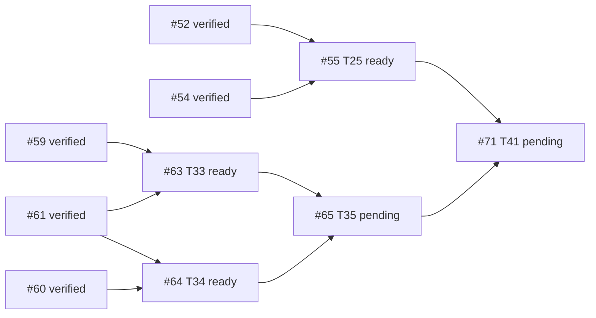

# B6 execution ledger — Issue #30 descendants #55 / #63 / #64

- GitHub read time: 2026-09-28 UTC, authenticated `gh` REST API.
- Repository: `1123786563/WeKnora-fork01` (origin remote).
- Root #30: open, approved specification; zero comments; native `sub_issues` endpoint returned an empty page. Its paginated timeline contains 41 distinct descendant issue references (#31–#71) and unrelated #174. All 41 descendant snapshots declare `Parent #30`; see `issues/index.md` and individual issue snapshots. No number-based filtering used.
- Existing implementation integration branch: `codex/issue30-mobile-office`, starting HEAD `db234c5eb171f2dde7427d382b55b503a038f879`.
- Current planning branch: `codex/issue30-b6-coordination`; baseline `db234c5eb`; planning-source checkpoint `df726bcaa55f1284e211b60c446de5fc4b37c1f3`.
- PR #174 is the existing local-delivery / #140 baseline PR. It is not modified here.

## Descendant readiness and B6 dependency edges

- #55 T25 is open; blocked by #52 and #54, both verified integrated in B5. It is ready.
- #63 T33 is open; blocked by #59 and #61, both verified integrated in B5. It is ready.
- #64 T34 is open; blocked by #60 and #61, both verified integrated in B5. It is ready.
- #65 T35 is downstream of #63 and #64 and stays pending.
- #71 T41 is downstream of #55 and #65 (among its other prerequisites); it stays pending. #51's exclusion-set TOCTOU repair `1c6779c7c` is integrated and has a mutation-test proof in `plans/plan-t51.md-report.md` §R5; prior final report's “not independently reviewed” statement is superseded by that report, but full historical final review/OCR limitations remain as written.

## Execution worktrees and scheduling

| Stream | Worktree | Branch | Base | Status | Owned files / conflict note |
|---|---|---|---|---|---|
| Coordination | `.worktrees/issue30-b6-coordination` | `codex/issue30-b6-coordination` | `db234c5eb` | running | Plans, issue snapshots, DAG, ledger, rulings and final evidence only |
| #55 | `.worktrees/issue30-b6-t55` | `codex/issue30-t55` | `df726bcaa` after plan transfer | ready | Delivery/codedelivery and mobile recovery; no Marketplace production files. Task 1's `delivery_collaboration_http_test.go` is outside #63/#64 ownership. |
| #63 | `.worktrees/issue30-b6-t63` | `codex/issue30-t63` | `df726bcaa` after plan transfer | ready | Marketplace lifecycle files. Shares migration/model/repository/service/router/admission seams with #64. |
| #64 | `.worktrees/issue30-b6-t64` | `codex/issue30-t64` | `df726bcaa` after plan transfer | ready | Security revocation files. Shares migration/model/adoption/upgrade/router/container/workbench/session seams with #63. Migration numbers moved to sqlite 000125/versioned 000204 to avoid #63's 000124/000203. |

### Preflight file/interface overlap matrix

| Plan/task pair | Shared files or interfaces | Finding / ruling |
|---|---|---|
| #63 T1 ↔ #64 T1 | migration tracks, adoption/marketplace persistence entities, repository test area | Real overlap. Serialize both Task 1s; #63 first owns sqlite 000124/versioned 000203; #64 uses sqlite 000125/versioned 000204. Merge/rebase and rerun migration uniqueness before downstream work. |
| #63 T2 ↔ #64 T2 | adoption and marketplace repository interfaces/types | Real interface overlap. #63 first; #64 adapts only after the lifecycle interface is stable and reviewed. |
| #63 T3 ↔ #64 T4/T6 | agent_adoption.go and agent_upgrade.go service guards | Real shared service files; serialize, lifecycle rejects Deprecated and security gate rejects revoked/blocklisted. Preserve separate predicates and deterministic error precedence; write compatibility tests. |
| #63 T4 ↔ #64 T7 | router params/route registration, container wiring | Real wiring overlap. Serialize #63 first, then #64 rebase onto reviewed lifecycle wiring. |
| #63 T5 ↔ #64 T8 | AdmissionCoordinator, workbench_start.go, container/workbench.go | Real seam overlap. #64 also adds session AgentQA gate. Implement one gate API with independently composable predicates; serialize seam edits and prove both behavior sets. |
| #63 T6 ↔ #64 T9 | test fixture/HTTP router suites | Same test architecture but distinct new files; can proceed independently after production APIs are stable, using non-overlapping files. |
| #55 Tasks 1–8 ↔ #63/#64 | no declared Marketplace production files; #55 owns delivery APIs, mobile composition and delivery test files | Parallel streams permitted in separate worktrees. Recheck changed-file lists before merging. |

## Task state / review / checkpoints

| Node | Status | Checkpoint / review |
|---|---|---|
| #55 T25 | running | T1 `3a0a7467b` approved; T2 round2 `cecd8d5a9` Spec/Quality PASS; T3 repair `a2f7675a2` PASS; T4 `a625ab308` PASS; T5 repair `45c8531ff` PASS; T7 repair `d4e6d6d2d` PASS (real-provider path blocked-env); T6 `fd119c0ad` independent Review found two MEDIUMs (stale route state and uninvoked behavior test) and one LOW terminal scan scope gap. Repair plan `plans/plan-t55-task6-review-fix.md` active. T8 waits for T6 repair Review. |
| #63 T33 | running / blocked downstream | T1 `4385f6d678` Review PASS with one low migration metadata/down/versioned verification gap deferred; T2 `a4ab413a3` Review found HIGH EndAdoption/CreateVariant race; dedicated repair plan `plans/plan-t63-task2-race-fix.md`, repair active. T64 T2 and #65 remain blocked until repair is reviewed/integrated. |
| #64 T34 | running / waiting on #63 T2 | T1 `6db98f0f1` Spec/Quality PASS; low migration metadata/PG/down coverage limitation recorded. T2 must wait for stable reviewed #63 adoption repository interface; IDs are SQLite 000125/versioned 000204. |

### Completed task review rulings

- #55 Task 1 `3a0a7467b90036c0384a6fd149d8b491253422f6`: independent Spec/Quality review approved; no findings.
- #63 Task 1 `4385f6d6787e2094a46fc0b83f71c9167e62544c`: independent Spec/Quality review passed. One minor gap: migration alignment test checks SQLite column names but not null/default/type, versioned application, or rollback. Reviewer found SQL itself matches the plan. Defer this coverage strengthening to final review; no production correctness issue was reported.
- #55 Task 2 initial `82505197e150074b89447452a692252c3b3fd93c`: first run passed (no RED); initial Review found lost-PR-ack, remote-read/write evidence, route/auth claim and credential-surface gaps. Round1 repair `d83ff539b` was reviewed and found incomplete: unknown→resolve→dispatch lacked PR-only write proof, write counters covered only known paths, and credential response state checks could be vacuous. Round2 repair `cecd8d5a9d2b9d5515049290604857ea1a007b40` was independently PASS for spec and quality; full ingress write trace, resolve no-write, PR-only subsequent dispatch and response-state gating are now covered. Production router/auth remains explicitly outside this repository test fixture.
- #55 Task 3 `90580a2fa`: Review found in-place map mutation invalidated the whitelist assertion; repair `a2f7675a213589b8b1694b26063cc63dda155076` independently PASS.
- #55 Task 4 `a625ab30812268723092fbfc6749c01854021dcd`: independent Spec/Quality PASS; note 409 test models `body.code`, not separately top-level ApiError code; no production conversion exists and Task5 handles both.
- #55 Task 5 `a07ac18da9c8432b6cd202c344c52a49f5ca1823`: Review found revoked lease followed by rejected read/write exposed stale backend/conflict errors. Round2 repair `45c8531ffe73c507aacbd9da67a272e1fb778255` independently PASS; deterministic tests cover read rejection and write 409 after revoke.
- #55 Task 7 `4c1ce1b81`: Review found draft not asserted, unchanged SHA insufficient for zero writes, and README-only fixture could delete other baseline files. Repair `d4e6d6d2d` independently PASS; test is fail-closed on README-only tree, checks draft state twice and transport write counters. Real GitHub invocation is blocked-env and is not counted as live verification.
- #63 Task 2 `a4ab413a3e40f3f2bee4309cebc9d6c33f7f8ac1`: independent Review FAIL with one HIGH concurrency flaw. Do not integrate or unblock T64 Task2/#65 until repair and review pass.
- #64 Task 1 `6db98f0f1544dd4978e1657f98f5f692694365f1`: independent Spec/Quality PASS, low coverage gap only (SQLite column existence, no null/default/type, PostgreSQL execution or down test).

### Review-fix wave checkpoints

- T55 review-fix round 1 plan: `plans/plan-t55-task2-review-fix.md`, ruling `T55-review-fix-ruling.md`. Task2/Task3/Task7 had disjoint file ownership and separate worktrees.
- T55 review-fix round 2 plan: `plans/plan-t55-review-fix-round2.md`. Task2 commit `cecd8d5a9d2b9d5515049290604857ea1a007b40` and Task5 lease-fencing commit `45c8531ffe73c507aacbd9da67a272e1fb778255` each received independent Spec/Quality PASS. Task2 repair report is `.superpowers/sdd/plan-t55-review-fix-round2/task-1-report.md`; Task5 report is `.superpowers/sdd/plan-t55-review-fix-round2/task-2-report.md`.
- Task3 env whitelist repair `a2f7675a213589b8b1694b26063cc63dda155076` independently PASS; report `.superpowers/sdd/plan-t55-review-fix/task-2-report.md`.
- Task7 opt-in provider repair `d4e6d6d2d` independently PASS; no live GitHub credential/write opt-in available, so its actual provider leg remains blocked-env. Report `.superpowers/sdd/plan-t55-review-fix/task-3-report.md` in the Task7 worktree.
- T55 Task6 mobile UI/composition is running on an isolated worktree based on verified T55 Task5 fix `45c8531ffe73c507aacbd9da67a272e1fb778255`; T8 depends on its exported `activeDeliveryRecovery` checkpoint.
- T63 Task2 HIGH finding repair plan: `plans/plan-t63-task2-race-fix.md`. Architecture ruling: both repository writers must begin their transaction with the same tenant/id/state-guarded parent no-op UPDATE; SQLite's first write obtains writer reservation while PostgreSQL row updates serialize. Deterministic tests must use file-backed SQLite, separate connections and channel/callback barriers; no sleeps. Repair is active in `codex/issue30-t63` at `a4ab413a3e40f3f2bee4309cebc9d6c33f7f8ac1`.

### Parallel execution checkpoints

- T55 independent streams use isolated worktrees: Task3 original and repair branches; Task4/T5 separately based on reviewed predecessor commits; Task7 original and repair branch; Task2 HTTP fixture remains in primary T55 worktree. No active streams share code files.
- #63 Task2 review-fix owns adoption lifecycle repository/service and focused tests in the existing T63 worktree. T64 Task2 is paused because of shared adoption interface/state semantics.
- #64 Task1 migration/entity/audit file set is disjoint from #63 Task2 lifecycle repository/service repair.

## Rulings

1. **Ruling:** use `timeline.cross-referenced` + each descendant's explicit `## Parent #30` statement as the scope evidence because the native `sub_issues` REST endpoint returns no children and its absence conflicts with 41 real descendant references; do not infer “no descendants.” Cost if wrong: a descendant omitted from timeline/Parent evidence would need a scope correction and implementation before #30 can close.
2. **Ruling:** serialize #63/#64 tasks that touch shared Marketplace types, migration tracks, service guard seams, route/container wiring and admission seams; parallelize #55 with isolated ownership and parallelize disjoint #63/#64 tasks only after stable reviewed interfaces. Cost if wrong: serialization costs time; premature parallel edits can produce incompatible lifecycle/security checks or duplicate migrations.
3. **Ruling:** move #64 migration IDs to sqlite 000125/versioned 000204; #63 keeps 000124/000203. Cost if wrong: migration IDs can be renumbered before merge; persisted environments must never see duplicate versions.
4. **Ruling:** treat #51 TOCTOU as verified repaired by `1c6779c7c` and the recorded mutation test, while preserving separate historical review/OCR caveats. Cost if wrong: #71 could accept a broken Action Plan exclusion invariant; its dedicated proof and final B6 review must recheck the behavior.
