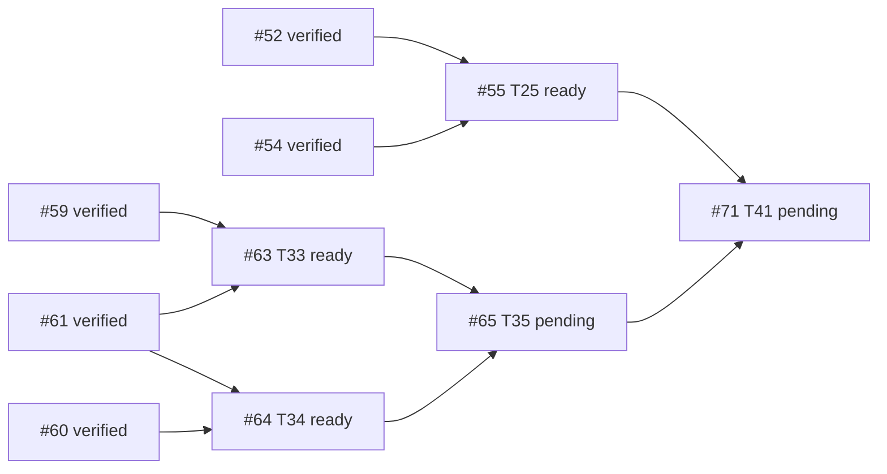

# B6 execution ledger — Issue #30 descendants #55 / #63 / #64

- GitHub read time: 2026-09-28 UTC, authenticated `gh` REST API.
- Repository: `1123786563/WeKnora-fork01` (origin remote).
- Root #30: open, approved specification; zero comments; native `sub_issues` endpoint returned an empty page. Its paginated timeline contains 41 distinct descendant issue references (#31–#71) and unrelated #174. All 41 descendant snapshots declare `Parent #30`; see `issues/index.md` and individual issue snapshots. No number-based filtering used.
- Existing implementation integration branch: `codex/issue30-mobile-office`, starting HEAD `db234c5eb171f2dde7427d382b55b503a038f879`.
- Current planning branch: `codex/issue30-b6-coordination`; baseline `db234c5eb`; planning-source checkpoint `df726bcaa55f1284e211b60c446de5fc4b37c1f3`.
- PR #174 is the existing local-delivery / #140 baseline PR. It is not modified here.

## Descendant readiness and B6 dependency edges

- #55 T25 is open; blocked by #52 and #54, both verified integrated in B5. It is ready.
- #63 T33 is open; blocked by #59 and #61, both verified integrated in B5. It is ready.
- #64 T34 is open; blocked by #60 and #61, both verified integrated in B5. It is ready.
- #65 T35 is downstream of #63 and #64 and stays pending.
- #71 T41 is downstream of #55 and #65 (among its other prerequisites); it stays pending. #51's exclusion-set TOCTOU repair `1c6779c7c` is integrated and has a mutation-test proof in `plans/plan-t51.md-report.md` §R5; prior final report's “not independently reviewed” statement is superseded by that report, but full historical final review/OCR limitations remain as written.

## Execution worktrees and scheduling

| Stream | Worktree | Branch | Base | Status | Owned files / conflict note |
|---|---|---|---|---|---|
| Coordination | `.worktrees/issue30-b6-coordination` | `codex/issue30-b6-coordination` | `db234c5eb` | running | Plans, issue snapshots, DAG, ledger, rulings and final evidence only |
| #55 | `.worktrees/issue30-b6-t55` | `codex/issue30-t55` | `df726bcaa` after plan transfer | ready | Delivery/codedelivery and mobile recovery; no Marketplace production files. Task 1's `delivery_collaboration_http_test.go` is outside #63/#64 ownership. |
| #63 | `.worktrees/issue30-b6-t63` | `codex/issue30-t63` | `df726bcaa` after plan transfer | ready | Marketplace lifecycle files. Shares migration/model/repository/service/router/admission seams with #64. |
| #64 | `.worktrees/issue30-b6-t64` | `codex/issue30-t64` | `df726bcaa` after plan transfer | ready | Security revocation files. Shares migration/model/adoption/upgrade/router/container/workbench/session seams with #63. Migration numbers moved to sqlite 000125/versioned 000204 to avoid #63's 000124/000203. |

### Preflight file/interface overlap matrix

| Plan/task pair | Shared files or interfaces | Finding / ruling |
|---|---|---|
| #63 T1 ↔ #64 T1 | migration tracks, adoption/marketplace persistence entities, repository test area | Real overlap. Serialize both Task 1s; #63 first owns sqlite 000124/versioned 000203; #64 uses sqlite 000125/versioned 000204. Merge/rebase and rerun migration uniqueness before downstream work. |
| #63 T2 ↔ #64 T2 | adoption and marketplace repository interfaces/types | Real interface overlap. #63 first; #64 adapts only after the lifecycle interface is stable and reviewed. |
| #63 T3 ↔ #64 T4/T6 | agent_adoption.go and agent_upgrade.go service guards | Real shared service files; serialize, lifecycle rejects Deprecated and security gate rejects revoked/blocklisted. Preserve separate predicates and deterministic error precedence; write compatibility tests. |
| #63 T4 ↔ #64 T7 | router params/route registration, container wiring | Real wiring overlap. Serialize #63 first, then #64 rebase onto reviewed lifecycle wiring. |
| #63 T5 ↔ #64 T8 | AdmissionCoordinator, workbench_start.go, container/workbench.go | Real seam overlap. #64 also adds session AgentQA gate. Implement one gate API with independently composable predicates; serialize seam edits and prove both behavior sets. |
| #63 T6 ↔ #64 T9 | test fixture/HTTP router suites | Same test architecture but distinct new files; can proceed independently after production APIs are stable, using non-overlapping files. |
| #55 Tasks 1–8 ↔ #63/#64 | no declared Marketplace production files; #55 owns delivery APIs, mobile composition and delivery test files | Parallel streams permitted in separate worktrees. Recheck changed-file lists before merging. |

## Task state / review / checkpoints

| Node | Status | Checkpoint / review |
|---|---|---|
| #55 T25 | running | T1 `3a0a7467b` approved; T2 round2 `cecd8d5a9` Spec/Quality PASS; T3 repair `a2f7675a2` PASS; T4 `a625ab308` PASS; T5 repair `45c8531ff` PASS; T7 repair `d4e6d6d2d` PASS (real-provider path blocked-env); T6 `fd119c0ad` independent Review found two MEDIUMs (stale route state and uninvoked behavior test) and one LOW terminal scan scope gap. Repair plan `plans/plan-t55-task6-review-fix.md` active. T8 waits for T6 repair Review. |
| #63 T33 | running / blocked downstream | T1 `4385f6d678` Review PASS with one low migration metadata/down/versioned verification gap deferred; T2 `a4ab413a3` Review found HIGH EndAdoption/CreateVariant race; dedicated repair plan `plans/plan-t63-task2-race-fix.md`, repair active. T64 T2 and #65 remain blocked until repair is reviewed/integrated. |
| #64 T34 | running / waiting on #63 T2 | T1 `6db98f0f1` Spec/Quality PASS; low migration metadata/PG/down coverage limitation recorded. T2 must wait for stable reviewed #63 adoption repository interface; IDs are SQLite 000125/versioned 000204. |

### Completed task review rulings

- #55 Task 1 `3a0a7467b90036c0384a6fd149d8b491253422f6`: independent Spec/Quality review approved; no findings.
- #63 Task 1 `4385f6d6787e2094a46fc0b83f71c9167e62544c`: independent Spec/Quality review passed. One minor gap: migration alignment test checks SQLite column names but not null/default/type, versioned application, or rollback. Reviewer found SQL itself matches the plan. Defer this coverage strengthening to final review; no production correctness issue was reported.
- #55 Task 2 initial `82505197e150074b89447452a692252c3b3fd93c`: first run passed (no RED); initial Review found lost-PR-ack, remote-read/write evidence, route/auth claim and credential-surface gaps. Round1 repair `d83ff539b` was reviewed and found incomplete: unknown→resolve→dispatch lacked PR-only write proof, write counters covered only known paths, and credential response state checks could be vacuous. Round2 repair `cecd8d5a9d2b9d5515049290604857ea1a007b40` was independently PASS for spec and quality; full ingress write trace, resolve no-write, PR-only subsequent dispatch and response-state gating are now covered. Production router/auth remains explicitly outside this repository test fixture.
- #55 Task 3 `90580a2fa`: Review found in-place map mutation invalidated the whitelist assertion; repair `a2f7675a213589b8b1694b26063cc63dda155076` independently PASS.
- #55 Task 4 `a625ab30812268723092fbfc6749c01854021dcd`: independent Spec/Quality PASS; note 409 test models `body.code`, not separately top-level ApiError code; no production conversion exists and Task5 handles both.
- #55 Task 5 `a07ac18da9c8432b6cd202c344c52a49f5ca1823`: Review found revoked lease followed by rejected read/write exposed stale backend/conflict errors. Round2 repair `45c8531ffe73c507aacbd9da67a272e1fb778255` independently PASS; deterministic tests cover read rejection and write 409 after revoke.
- #55 Task 7 `4c1ce1b81`: Review found draft not asserted, unchanged SHA insufficient for zero writes, and README-only fixture could delete other baseline files. Repair `d4e6d6d2d` independently PASS; test is fail-closed on README-only tree, checks draft state twice and transport write counters. Real GitHub invocation is blocked-env and is not counted as live verification.
- #63 Task 2 `a4ab413a3e40f3f2bee4309cebc9d6c33f7f8ac1`: independent Review FAIL with one HIGH concurrency flaw. Do not integrate or unblock T64 Task2/#65 until repair and review pass.
- #64 Task 1 `6db98f0f1544dd4978e1657f98f5f692694365f1`: independent Spec/Quality PASS, low coverage gap only (SQLite column existence, no null/default/type, PostgreSQL execution or down test).

### Review-fix wave checkpoints

- T55 review-fix round 1 plan: `plans/plan-t55-task2-review-fix.md`, ruling `T55-review-fix-ruling.md`. Task2/Task3/Task7 had disjoint file ownership and separate worktrees.
- T55 review-fix round 2 plan: `plans/plan-t55-review-fix-round2.md`. Task2 commit `cecd8d5a9d2b9d5515049290604857ea1a007b40` and Task5 lease-fencing commit `45c8531ffe73c507aacbd9da67a272e1fb778255` each received independent Spec/Quality PASS. Task2 repair report is `.superpowers/sdd/plan-t55-review-fix-round2/task-1-report.md`; Task5 report is `.superpowers/sdd/plan-t55-review-fix-round2/task-2-report.md`.
- Task3 env whitelist repair `a2f7675a213589b8b1694b26063cc63dda155076` independently PASS; report `.superpowers/sdd/plan-t55-review-fix/task-2-report.md`.
- Task7 opt-in provider repair `d4e6d6d2d` independently PASS; no live GitHub credential/write opt-in available, so its actual provider leg remains blocked-env. Report `.superpowers/sdd/plan-t55-review-fix/task-3-report.md` in the Task7 worktree.
- T55 Task6 mobile UI/composition is running on an isolated worktree based on verified T55 Task5 fix `45c8531ffe73c507aacbd9da67a272e1fb778255`; T8 depends on its exported `activeDeliveryRecovery` checkpoint.
- T63 Task2 HIGH finding repair plan: `plans/plan-t63-task2-race-fix.md`. Architecture ruling: both repository writers must begin their transaction with the same tenant/id/state-guarded parent no-op UPDATE; SQLite's first write obtains writer reservation while PostgreSQL row updates serialize. Deterministic tests must use file-backed SQLite, separate connections and channel/callback barriers; no sleeps. Repair is active in `codex/issue30-t63` at `a4ab413a3e40f3f2bee4309cebc9d6c33f7f8ac1`.
- T64 Task2 read-only preflight confirmed its code files (`agent_security.go` and `agent_security_test.go`) are disjoint from the T63 race repair, but its release/variant reads consume the lifecycle schema and CreateVariant state contract. T64 Task2 stays unstarted until the T63 race repair is reviewed and integrated; its `ReleaseFacts` must include both local and tenant-introduced releases, deduplicating by ID with local rows winning.
- T55 Task6 review-fix plan: `plans/plan-t55-task6-review-fix.md`, active in the same isolated Task6 worktree. Review found stale task-route state/in-flight results and missing action invocation evidence; Task8 is blocked pending the repair's independent pass.

### Parallel execution checkpoints

- T55 independent streams use isolated worktrees: Task3 original and repair branches; Task4/T5 separately based on reviewed predecessor commits; Task7 original and repair branch; Task2 HTTP fixture remains in primary T55 worktree. No active streams share code files.
- #63 Task2 review-fix owns adoption lifecycle repository/service and focused tests in the existing T63 worktree. T64 Task2 is paused because of shared adoption interface/state semantics.
- #64 Task1 migration/entity/audit file set is disjoint from #63 Task2 lifecycle repository/service repair.

## Rulings

1. **Ruling:** use `timeline.cross-referenced` + each descendant's explicit `## Parent #30` statement as the scope evidence because the native `sub_issues` REST endpoint returns no children and its absence conflicts with 41 real descendant references; do not infer “no descendants.” Cost if wrong: a descendant omitted from timeline/Parent evidence would need a scope correction and implementation before #30 can close.
2. **Ruling:** serialize #63/#64 tasks that touch shared Marketplace types, migration tracks, service guard seams, route/container wiring and admission seams; parallelize #55 with isolated ownership and parallelize disjoint #63/#64 tasks only after stable reviewed interfaces. Cost if wrong: serialization costs time; premature parallel edits can produce incompatible lifecycle/security checks or duplicate migrations.
3. **Ruling:** move #64 migration IDs to sqlite 000125/versioned 000204; #63 keeps 000124/000203. Cost if wrong: migration IDs can be renumbered before merge; persisted environments must never see duplicate versions.
4. **Ruling:** treat #51 TOCTOU as verified repaired by `1c6779c7c` and the recorded mutation test, while preserving separate historical review/OCR caveats. Cost if wrong: #71 could accept a broken Action Plan exclusion invariant; its dedicated proof and final B6 review must recheck the behavior.

### T55 Task6 review-fix round 2

- Round 1 checkpoint `da2ce4911ae90c9af1686b1ee6736e88ee377ad5` fixed A→B route leakage, actual rendered-button behavior evidence, and bounded terminal scan scope; independent review then identified a remaining MEDIUM: A→B→A re-entry reuses the same taskId/runId, allowing an earlier A async completion to mutate the later A visit.
- Narrow repair plan: `plans/plan-t55-task6-review-fix-round2.md`; SDD brief `.superpowers/sdd/plan-t55-task6-review-fix-round2/task-1-brief.md`.
- Task6 remains unverified until this generation-fence repair is implemented, independently reviewed and validated. T55 Task8 remains blocked.

### T55 Task6 review-fix round 2

- Round 1 checkpoint `da2ce4911ae90c9af1686b1ee6736e88ee377ad5` fixed A→B route leakage, actual rendered-button behavior evidence, and bounded terminal scan scope; independent review then identified a remaining MEDIUM: A→B→A re-entry reuses the same taskId/runId, allowing an earlier A async completion to mutate the later A visit.
- Narrow repair plan: `plans/plan-t55-task6-review-fix-round2.md`; SDD brief `.superpowers/sdd/plan-t55-task6-review-fix-round2/task-1-brief.md`.
- Task6 remains unverified until this generation-fence repair is implemented, independently reviewed and validated. T55 Task8 remains blocked.

### Latest parallel execution update (2026-09-28)

- T63 Task2 race repair `512ff27cb5a29863ab26ed8b4d3e8d7aec12efd5` independently reviewed: Spec PASS; quality PASS. Reviewer accepts the guarded first transactional UPDATE and stale-state mappings. Record LOW evidence limitation: GORM callback ordering does not directly observe entry into SQLite driver lock wait; PostgreSQL schedule unavailable (`TRPC_TEST_POSTGRES_DSN` absent). This is disclosed in the task report and is not a blocker.
- T64 Task2 worktree now contains T64 Task1 plus T63 Task2 original interface commit and reviewed race repair, cherry-picked as `7c5afd541` and `2fc2feaca`. T64 Task2 dispatched to `backend_implementer` on exactly `agent_security.go` and `agent_security_test.go`; no migration/service/router ownership overlap.
- T55 Task6 repair round1 `da2ce4911` independently reviewed; A→B, button behavior and bounded terminal-scan fixes pass, but a new MEDIUM A→B→A stale-completion race was found. Narrow round2 plan `plans/plan-t55-task6-review-fix-round2.md` is committed (`701e1f879`); ledger finding record `6127253bb`. Same isolated Task6 implementer has been assigned route-entry generation fencing; Task8 stays blocked.
- Read-only readiness scan found no other safe implementation task at this point. Existing independent execution remains T55 T6 round2 and T64 T2, with T63 review complete.

- After T63 Task2 independent PASS and integration to the coordination line (`65156cd4b` T1, `8e997cd96` Task2 interface, `156f070e0` race repair), T63 Task3 is now unblocked. It is dispatched on the existing T63 worktree with service-only ownership while T64 Task2 owns the repository security files and T55 Task6 round2 owns mobile UI files; these three streams are file-disjoint. T63 Task4/5 and overlapping T64 service/wiring/admission tasks remain serialized.

- T55 Task6 round2 implementation checkpoint `c338e2f0b71113bc23a4a5b18431f2e7880bdaa2` completed on the Task6 worktree, adding per-route-entry generation fencing and deferred A→B→A old read/success/failure cases. Implementer reports focused 72/72, mobile 280 pass / 14 opt-in skipped / 0 fail, typecheck, API-client terminal-surface check and diff check pass. Independent reviewer and frontend validator are now running in parallel; Task8 remains blocked until both pass and checkpoint integration.
- T64 Task2 has confirmed expected RED (store/types undefined), added prescribed tests and implementation, and is running focused GREEN. T63 Task3 has started RED-first work on disjoint service files.
- T55 Task6 round2 review provisional finding: MEDIUM still open. `TaskDetailRouteLifecycle` advances generation only when its retained component instance receives different task/run props; Expo Router Stack `push` may preserve A while B is pushed, and returning to A may restore the same A instance/props. Current deferred test mutates the generation seam manually rather than proving actual focus/return lifecycle. Independent reviewer requested route focus/entry-key binding and an actual lifecycle test. Task8 remains blocked pending final review and a further focused repair; read-only navigation lifecycle research is active.
- T55 Task6 round2 frontend validator finished: focused 72/72, full mobile 280 pass / 14 opt-in skipped / 0 fail, typecheck, API terminal-surface test and diff check passed at `c338e2f0`. Validator confirms tests simulate route-entry generation through handler seam rather than mounted Expo Router navigation; this matches the independent review’s open MEDIUM lifecycle gap, so validation evidence does not close it.

### T55 Task6 route-focus repair round 3

- Round2 independent review FAIL: checkpoint `c338e2f0` only advances generation on prop changes; Expo Router Stack may retain A while B is pushed and restore the same A component/props, so old A work can still complete after refocus. Round2 validator also confirms its generation test manually simulated entries rather than exercising the production route lifecycle.
- Read-only research confirmed `_layout.tsx` uses Stack with no unmount/focus handling, `tasks.tsx` uses `router.push`, and `TaskDetailRouteLifecycle` has no focus/blur subscription. Research recommends the existing Expo Router `useFocusEffect` public hook, fresh epoch on focus and synchronous invalidation on blur.
- Narrow round3 plan: `plans/plan-t55-task6-review-fix-round3.md`; SDD brief `.superpowers/sdd/plan-t55-task6-review-fix-round3/task-1-brief.md`. Next dispatch must own the same two mobile files and exercise the mounted lifecycle component's focus/blur callback seam with A retained and unchanged IDs. Task8 remains blocked.
- Integrated reviewed T64 Task1 checkpoint `6db98f0f1` into the coordination line as `660792d5f`; its migration IDs remain SQLite `000125` / versioned `000204` alongside T63 `000124` / `000203`.
- T64 Task2 commit `da8a26181e4735b3611864704e66aa590a9bb617` is complete on its isolated worktree. Focused `TestAgentSecurity` suite and diff check passed; PostgreSQL unavailable. Independent reviewer and backend validator are now checking it in parallel; do not release T64 downstream tasks until review passes.
- T63 Task3 implementation has RED/GREEN and broader service regression evidence reported; agent is finalizing its owned-file check and local commit. Its five-file service/interface scope is disjoint from T64 Task2's repository scope and T55 Task6 mobile scope.
- T64 Task2 independent Review: Spec PASS, code quality PASS; one LOW test gap where the map conversion could hide duplicate Release IDs. Backend validator independently passed focused `TestAgentSecurity`, migration-number uniqueness, and diff checks at `da8a26181`; no PG DSN. A narrow test-only plan `plans/plan-t64-task2-review-fix.md` and brief are ready; T64 Task3 remains blocked pending its review.
- T64 Task2 LOW repair `a924b4952f233266afc5873066a8ae2775473f9b` independently reviewed PASS. T64 Task2 implementation + repair are integrated into coordination branch as `475a34500` and `b59a35bcb`; its original checkpoint validation passed focused repository tests, migration uniqueness and diff check. PostgreSQL remains unverified without DSN.
- T55 Task6 round3 review PASS (Spec/Quality PASS); LOW integration-evidence boundary only: the Node test drives the production component's registered focus callback but not a real native navigator or production reader on refocus. Frontend validation is still running. Route-focus implementation commit `17fde2a5` is not yet integrated pending validator result.
- T55 Task6 round3 checkpoint `17fde2a5cfd50f1577ed6bf2ff3f6d5e0fe64ba0` passed independent Spec/Quality review and frontend validation. Validator: focused app/purity 2/2, full mobile 281 pass / 14 optional skipped / 0 fail, typecheck, API terminal-surface 1/1 and diff check pass. Review/validation limitations: Node harness invokes registered focus callback but does not mount native navigator; deferred reader rejection not separately exercised. Neither blocks the state-fencing fix.
- T55 Task8 is now ready and dispatched in a separate worktree based on `17fde2a5c`; exact owned files are `delivery-integration-smoke.ts` and its test. It runs parallel with T63 Task3 review-fix and has no Marketplace overlap.

### T63 Task3 review repair

- Task3 implementation `c28e783bb3010d748e79779391b65ade097ed4d9` independently validated (focused and adjacent service filters + diff check passed) but review failed: HIGH ended-Adoption reactivation/mutation; MEDIUM A↔B successor cycle; MEDIUM deprecated-release check/write race; no active-Adoption AcceptUpgradeProposal deprecated-target test.
- Read-only architecture ruling groups findings into two serial waves because both touch the same repository state seams: Task1 makes Adoption terminal across direct Adopt and public IntroduceRelease paths; Task2 serializes release deprecation and repository-level use gates, then adds direct Accept behavior test. Detailed plan `plans/plan-t63-task3-review-fix.md`; Task1 brief is prepared. T63 Task4/5 remain blocked.

### T64 Task2 and T55 Task8

- T64 Task2 LOW cardinality repair `a924b4952f233266afc5873066a8ae2775473f9b` review PASS; exact focused test passed in implementer run. Task2 original checkpoint validation independently passed `TestAgentSecurity`, migration uniqueness and diff checks; PG DSN absent. Integrated implementations in coordinator line are `475a34500` and `b59a35bcb`.
- T55 Task8 worktree creation via managed tool could not resolve a commit held only in the isolated T55 clone; fallback `git worktree add` inside the T55 Task6 clone created an isolated worktree at its exact reviewed base `17fde2a5c`. The worker could not see coordinator-local ignored brief, so the full formal brief was sent directly in its task message; plan Task8 is in the worktree.
- T55 Task8 implementation `3cf6b7be01d1f9d44a6b6889c79ed1dd2ab98dde` completed on isolated `codex/issue30-t55-t8` based on reviewed Task6 route-focus checkpoint. Implementer reports focused 3/3, full mobile 282 pass / 14 opt-in skipped / 0 fail, typecheck and diff check. Independent reviewer + frontend validator are running; no live deployment/credentials used.
- T64 Task3 is now unblocked after T64 Task2 implementation, LOW finding fix, review and validation all passed. It owns only two new agent-run security repository files and runs parallel with T63 Task3 terminality repair and T55 Task8 reviews; downstream Task4 waits for review/validation.
- T55 Task8 independent review and validator rejected checkpoint `3cf6b7be`: two MEDIUMs (already-delivered recovery mislabeled as recovered/first row stops later candidates; no execution behavior tests for recovery evidence branches) and one LOW comment claiming whole flow is read-only despite opt-in dispatch. Narrow review-fix plan saved at `plans/plan-t55-task8-review-fix.md`; keep Task8 unverified and do not integrate until fixed/reviewed/validated. Live deployment remains intentionally unrun.
- T64 Task3 implementer confirmed expected RED (`CancelRunsByAgents` undefined), added method and targeted tests including lease/revision, malformed snapshot fail-quiet, and empty no-op; focused plus adjacent regression checks are in progress.
- T64 Task3 `CancelRunsByAgents` committed `762ca4e40593beb86800a9b61914b4358ea209ba`, only the two planned new repository files. Implementer reports expected RED, focused+existing cancellation regressions PASS (6.120s), and diff check PASS. Independent reviewer/backend validator are running in parallel.
- T63 Task3 review-fix Task1 RED confirmed on prior implementation for same-release re-Adopt and public IntroduceRelease after ended state. Implementer has transactional scope no-op guard + active-only reconcile and service conflict mapping; focused repository/public-introduction tests are running. Task2 remains blocked until this slice is reviewed and validated.
