# Issue #30 依赖 DAG（issue30-sweep）

- 生成时间: 2026-09-23
- Worktree: `.worktrees/issue30-sweep`（分支 `issue30-sweep`）
- 输入:
  - Issue 清单与 `## Blocked by` 声明: [issues/index.md](issues/index.md)（Blocked by 列，index.md:56-99；各 `issues/issue-N.md` 的 `## Blocked by` 段，如 issue-39.md:41-44、issue-42.md:41-44、issue-58.md:41-43）
  - 调查核实结果（现状 partial/absent/done-evidenced、缺口）: sweep 会话逐 Issue 调查（本文档「状态总表」「推断边」处引用其缺口条目）
  - 总体目标与验收: [issues/issue-30.md](issues/issue-30.md)、docs/specs/2026-09-20-mobile-ai-office-design.md
- 图规模: 42 节点（#30 规格根 + #31–#71 共 41 个子任务），92 条依赖边 = 91 条声明边 + 1 条推断边
- 验证: Kahn 拓扑排序 40/40 节点全部出队 → **无环**；批内任意两节点无直接边 → 批内可并行（脚本核验，见「环路检查」节）

## 1. 范围与方法

1. **父子 ≠ 执行顺序**。#30 是父规格 Issue（范围归属、事实源），无实现工作、无 Blocked by，**不作为执行节点入图**；#31–#71 为 41 个执行单元。层级树见 [issues/index.md](issues/index.md)。
2. **依赖边只表示「某交付必须先完成，另一项才能开始」**。主证据是各 Issue 的 `## Blocked by`（与 GitHub 原生 blocked-by 关系逐项一致，41/41，见 index.md:105）。语义补充边（接口 Consumes/Produces）仅 1 条，单独列出并标注「推断」及依据。
3. **#58（T28）done-evidenced**：Issue 已关闭（2026-09-20 关闭→重开→补证再关闭，index.md:86），标记完成、不重新实施。其出边 `58→59`、`58→60` 视为**已满足**（不产生等待、不占批次）。残余缺口（PostgreSQL 运行时迁移 000187/000188 本会话无 PG 环境未复跑，仅 SQLite/代码级证据）记录在状态总表，不构成重开或阻塞理由。
4. **closed 但无证据的节点**：无。#58 是唯一 closed Issue 且调查结论为 done-evidenced（缺口仅环境性复跑）；其余 40 个全部 open，按调查的 partial/absent/blocked-external 状态列入总表。
5. **真实依赖 vs 调度约束**：本图所有边均为业务/接口交付依赖，**没有任何一条边因文件冲突而加入**；文件冲突仅作为同批次并行实施的调度注意项列出（第 4 节）。

## 2. Mermaid DAG

节点 `#58` 为已完成（done-evidenced，绿色）；其余 40 个为待执行。`#30` 为范围根不入图。

```mermaid
graph TD
  n31["#31 T01 登录 Deployment"]
  n32["#32 T02 Tenant 切换/Scoped Vault"]
  n33["#33 T03 Resource Shelf"]
  n34["#34 T04 首页 Attention/Task 列表"]
  n35["#35 T05 Task 详情/Timeline/SSE"]
  n36["#36 T06 目标输入/Task 创建"]
  n37["#37 T07 运行干预"]
  n38["#38 T08 Attention Inbox/审批"]
  n39["#39 T09 Budget 达限/扩额"]
  n40["#40 T10 加密离线缓存/草稿"]
  n41["#41 T11 设备注册/通知/深链"]
  n42["#42 T12 Task 协作角色"]
  n43["#43 T13 合规访问/Retention"]
  n44["#44 T14 Legacy Task 投影"]
  n45["#45 T15 证据知识问答"]
  n46["#46 T16 Task Material"]
  n47["#47 T17 并行研究/报告"]
  n48["#48 T18 Notion 发布"]
  n49["#49 T19 飞书发布"]
  n50["#50 T20 Confluence 发布"]
  n51["#51 T21 Action Plan"]
  n52["#52 T22 GitHub 草稿 PR"]
  n53["#53 T23 GitHub 空间连接"]
  n54["#54 T24 GitLab 草稿 MR"]
  n55["#55 T25 交付部分成功/凭据隔离"]
  n56["#56 T26 语音转写草稿"]
  n57["#57 T27 Task 实时语音"]
  n58["#58 T28 Catalog Release ✓"]
  n59["#59 T29 Adoption/Variant"]
  n60["#60 T30 Public Marketplace"]
  n61["#61 T31 Upgrade Proposal"]
  n62["#62 T32 Fork lineage"]
  n63["#63 T33 退役/终止/Listing"]
  n64["#64 T34 安全撤回传播"]
  n65["#65 T35 Evaluation/隐私/Custody"]
  n66["#66 T36 多 Deployment 降级"]
  n67["#67 T37 自托管推送/自签名"]
  n68["#68 T38 Taro Adapter 复用"]
  n69["#69 T39 iOS 安装包验收"]
  n70["#70 T40 Android 安装包验收"]
  n71["#71 T41 发布证据矩阵"]

  n31 --> n32
  n32 --> n33
  n32 --> n34
  n32 --> n35
  n32 --> n40
  n32 --> n41
  n32 --> n66
  n33 --> n36
  n33 --> n45
  n33 --> n59
  n34 --> n38
  n34 --> n41
  n34 --> n42
  n34 --> n44
  n34 --> n68
  n35 --> n36
  n35 --> n37
  n35 --> n38
  n35 --> n40
  n35 --> n41
  n35 --> n42
  n35 --> n44
  n35 --> n45
  n35 --> n46
  n35 --> n57
  n35 --> n68
  n36 --> n37
  n36 --> n39
  n36 --> n40
  n36 --> n45
  n36 --> n52
  n36 --> n56
  n36 --> n68
  n38 --> n39
  n38 --> n48
  n38 --> n52
  n38 --> n68
  n42 --> n43
  n42 --> n53
  n42 -.推断.-> n39
  n45 --> n47
  n46 --> n47
  n46 --> n48
  n46 --> n52
  n46 --> n68
  n48 --> n49
  n48 --> n50
  n48 --> n51
  n52 --> n53
  n52 --> n54
  n52 --> n55
  n54 --> n55
  n56 --> n57
  n56 --> n69
  n56 --> n70
  n58 --> n59
  n58 --> n60
  n59 --> n60
  n59 --> n61
  n59 --> n62
  n59 --> n63
  n60 --> n61
  n60 --> n62
  n60 --> n64
  n60 --> n65
  n61 --> n63
  n61 --> n64
  n61 --> n65
  n63 --> n65
  n64 --> n65
  n66 --> n67
  n66 --> n69
  n66 --> n70
  n40 --> n69
  n40 --> n70
  n41 --> n67
  n41 --> n69
  n41 --> n70
  n67 --> n71
  n43 --> n71
  n44 --> n71
  n47 --> n71
  n49 --> n71
  n50 --> n71
  n51 --> n71
  n53 --> n71
  n55 --> n71
  n57 --> n71
  n62 --> n71
  n65 --> n71
  n68 --> n71
  n69 --> n71
  n70 --> n71

  classDef done fill:#9ae6b4,stroke:#2f855a
  class n58 done
```



注：`n58 → n59`、`n58 → n60` 为声明边但已满足（#58 完成），图中保留以示来源。`n42 -.推断.-> n39` 为唯一推断边。

## 3. 依赖边表

### 3.1 声明边（91 条，按前置分组）

证据列：`index` = issues/index.md:56-99 的 Blocked by 列（与各 issue-N.md `## Blocked by` 段、GitHub 原生关系三方一致，index.md:105）。

| 前置 | 后续 | 原因（为何必须先完成） | 所需交付（前置 Produces → 后续 Consumes） | 证据 | 推断 |
|---|---|---|---|---|---|
| #31 | #32 | 登录进入 Deployment 是一切 Runtime 状态前提 | T01 交付 Mobile Runtime 登录/capability 闭环（Deployment + 身份上下文）→ T02 在其上切换 Active Tenant | index | 否 |
| #32 | #33 | 资源可见性按 Active Tenant 过滤 | T02 交付 Active Tenant 上下文 + Scope Lease（调查 #32：现无 switchTenant，activeTenantId 只读）→ T03 按当前空间投影资源 | index | 否 |
| #32 | #34 | 首页/统一列表需按 Tenant 范围聚合 | Active Tenant 读投影 + 作用域失效 → 三段视图与统一列表 | index | 否 |
| #32 | #35 | Task 详情恢复在 Tenant 作用域内进行 | Tenant 作用域 + 订阅失效 → Snapshot 水合/SSE 恢复 | index | 否 |
| #32 | #40 | Scoped Vault 的隔离模型由 T02 定义 | T02 定义按 Deployment/user/Tenant 的加密作用域（调查 #32：Scoped Vault 零命中）→ T10 实现离线缓存/草稿/确认 | index | 否 |
| #32 | #41 | 设备注册按 Deployment 分离、深链在 Tenant 上下文路由 | Runtime 作用域（Deployment/Tenant 维度）→ 设备注册与深链处理 | index | 否 |
| #32 | #66 | 多 Deployment 切换建立在单 Deployment 登录 + Tenant 上下文之上 | 登录态/作用域模型 → 多实例登记/隔离/降级 | index | 否 |
| #33 | #36 | 创建 Task 时选择附加资源 | Resource Shelf Interface（browse/selection/prepare，seams spec §181-207）→ StartInput 附件/知识接入提交链 | index | 否 |
| #33 | #45 | 证据问答只搜索我有权访问的知识 | 知识授权过滤投影 → Lead Agent 检索边界 | index | 否 |
| #33 | #59 | 移动 Available Agent 投影挂在 Resources 页 | Resources 页面载体（调查 #59：apps/mobile 无资源页）→ Available Agent 投影 | index | 否 |
| #34 | #38 | Attention Inbox 与 Home/Task list 同一读投影 | 三段视图读模型（seams spec §5.1）→ 类型化 Interaction 展示 | index | 否 |
| #34 | #41 | 行动通知以「需要我处理」权威状态为源 | Attention 权威状态 → 推送仅作同步提示 | index | 否 |
| #34 | #42 | 协作可见性由统一列表/读模型承载 | 读投影扩展（调查 #34：overview owner-only 谓词）→ Viewer/Collaborator 共享读 | index | 否 |
| #34 | #44 | Legacy Session 投影进入统一 Task 列表 | 列表投影模型 → 旧会话投影为 Legacy Task | index | 否 |
| #34 | #68 | 小程序经深 Module 跑关键 scenario 需列表投影稳定 | Task Office 读投影 Interface → Taro Adapter 复用 | index | 否 |
| #35 | #36 | 耐久创建与详情恢复是同一 Task Office 读写两面 | Snapshot/事件流形态 → durable submission identity/对账 | index | 否 |
| #35 | #37 | 干预作用于 Task 详情呈现的 Run | Run 状态 + 干预路由（steer/queue/stop）→ 运行中调整 | index | 否 |
| #35 | #38 | 审批决定从 Task/Interaction 上下文发出 | Task 详情 + decision CAS → 类型化审批闭环 | index | 否 |
| #35 | #40 | 离线缓存投影 Task Snapshot/事件 | Snapshot 与事件流形态 → event projection/离线读 | index | 否 |
| #35 | #41 | SSE 恢复与通知指向同一权威状态 | Snapshot 权威状态 → 通知同步提示与深链恢复 | index | 否 |
| #35 | #42 | 成员共享读同一详情投影 | 详情/生命周期投影 → Viewer/Collaborator 视角 | index | 否 |
| #35 | #44 | 旧 Session 投影对齐 Task 详情/Snapshot 形态 | Snapshot/Timeline 形态 → Legacy 投影不伪造历史 | index | 否 |
| #35 | #45 | 问答结论/引用进入 Task Timeline 事实流 | Timeline 事实流模型 → 证据引用挂接 | index | 否 |
| #35 | #46 | Material 挂在 Task 详情页展开 | Task 详情载体 → Artifact/引用/预览/分享 | index | 否 |
| #35 | #57 | 语音会话附着于 Task | Task 上下文 + 恢复 → Voice Room 接线 | index | 否 |
| #35 | #68 | 详情投影稳定后小程序复用 | Task Office Interface → Taro Adapter | index | 否 |
| #36 | #37 | 干预对象是已创建 Task 的 Run | 耐久 Task 创建 + Run 准入 → 干预命令 | index | 否 |
| #36 | #39 | 预算属于 Task，创建后才有四数字与扩额 | Task 身份 + 提交链 → budget 达限/扩额/恢复 | index | 否 |
| #36 | #40 | 离线草稿是 New 入口的创建草稿 | 提交模型（StartInput/durable identity）→ 离线草稿与联网确认 | index | 否 |
| #36 | #45 | 首版快速知识问答即 Task 创建 | 创建链 → 问答闭环入 Task 历史 | index | 否 |
| #36 | #52 | 代码交付从 Task 目标发起 | Task 创建 + 审批语义 → Workspace/分支/草稿 PR | index | 否 |
| #36 | #56 | 转写草稿产出可提交的目标文本 | New 入口提交链 → 可编辑转写草稿确认后提交 | index | 否 |
| #36 | #68 | 深 Module Interface 需创建链稳定 | Task Office Interface → Taro 复用 | index | 否 |
| #38 | #39 | 预算恢复决定是 InteractionRecovery 类型 | 类型化 Interaction 身份（调查 #38：现走独立通道未统一）→ budget/extend 与恢复统一入口 | index | 否 |
| #38 | #48 | 外部发布需类型化审批闭环 | 审批 Gate → Artifact 审批→发布→回执 | index | 否 |
| #38 | #52 | 草稿 PR 创建需审批 | 审批闭环 → 代码交付审批 | index | 否 |
| #38 | #68 | 审批投影稳定后小程序复用 | Task Office Interface → Taro 复用 | index | 否 |
| #42 | #43 | 合规访问以角色模型存在为前提（是审计流程而非成员角色） | Owner/Collaborator/Viewer 角色谓词 → 合规访问/Retention/安全删除 | index | 否 |
| #42 | #53 | 团队归因需 Task 角色与协作模型 | 角色模型 → 发起者/批准者/远端身份归因 | index | 否 |
| #45 | #47 | 并行研究是证据问答的并行化 | 证据/引用模型 → 只读子任务证据组装 | index | 否 |
| #46 | #47 | 版本化报告是 Artifact 版本链 | Artifact 不可变版本 → 报告组装 | index | 否 |
| #46 | #48 | 发布对象是确定版本的 Artifact | Artifact 版本 + 只读预览 → 审批后发布 | index | 否 |
| #46 | #52 | Diff/测试报告/候选提交是 Material 只读面 | 只读 Diff/测试呈现 → 交付审阅 | index | 否 |
| #46 | #68 | Material Interface 稳定后小程序复用 | Task Material Interface → Taro 复用 | index | 否 |
| #48 | #49 | Publication seam 先在 Notion 建立再复制到飞书 | 版本读取/冲突检测/回执 seam → 飞书 Adapter 复用（调查 #49：Publication seam 不存在） | index | 否 |
| #48 | #50 | 同上，Confluence 复用 seam | Publication seam → Confluence Adapter | index | 否 |
| #48 | #51 | 多操作 Action Plan 的首个载体是 Notion 发布链路 | 发布链路 + 审批失效（调查 #51：现仅单 Action 粒度）→ 计划级批准/失效/恢复 | index | 否 |
| #52 | #53 | 空间连接（GitHub App）建立在个人连接之上 | OAuth/凭据托管/owner-only → 租户安装与归因 | index | 否 |
| #52 | #54 | GitLab 复用统一 Delivery seam | 基线/修改/测试/Diff/审批/任务分支 seam → GitLab Adapter（调查 #54：Delivery seam 零实现） | index | 否 |
| #52 | #55 | 部分成功/未知结果/凭据隔离以 T22 交付链为载体 | 推送/PR 两步交付 → 步骤化状态机与凭据隔离 | index | 否 |
| #54 | #55 | GitLab MR 两步交付是 T25 场景之一 | MR 交付链 → 部分成功恢复验证 | index | 否 |
| #56 | #57 | 实时会话复用转写与确认流 | 转写/确认语义 → realtime 会话（调查 #57：断线恢复/三分离旧实现已删） | index | 否 |
| #56 | #69 | 安装包验收含语音权限与转写工作流 | 语音工作流 → iOS 验收矩阵 | index | 否 |
| #56 | #70 | 同上 Android | 语音工作流 → Android 验收矩阵 | index | 否 |
| #58 | #59 | **已满足（#58 完成）**。Adoption 消费不可变 Release | Catalog/不可变 Release（T28 已交付）→ Adoption/Variant | index | 否 |
| #58 | #60 | **已满足（#58 完成）**。跨 Tenant 传播对象是可移植 Release | 可移植 Release → Public Marketplace 传播 | index | 否 |
| #59 | #60 | Public Marketplace Adoption 需 Tenant Adoption 机制先存在 | Adoption 实体/接口（调查 #59：absent）→ 跨 Tenant Adoption | index | 否 |
| #59 | #61 | 升级建议针对 per-Adoption 差异 | Adoption → Upgrade Proposal 四维差异 | index | 否 |
| #59 | #62 | Fork 从本地 Variant 派生 | Variant → Fork lineage/许可证 | index | 否 |
| #59 | #63 | 退役/终止以 Adoption/Variant 存在为前提 | Adoption/Variant → Retire/End Adoption/Unlist/Deprecate | index | 否 |
| #60 | #61 | 升级建议对比 Marketplace Release | Public Release 目录 → 差异计算 | index | 否 |
| #60 | #62 | 再发布进入 Public Marketplace 需其审核体系 | Verified Publisher/审核 → 再分发许可校验 | index | 否 |
| #60 | #64 | 安全撤回从 Public Release 传播到 Adoption | Public Release 状态 → 撤回传播/准入拦截 | index | 否 |
| #60 | #65 | Metrics/Custody 作用于 Marketplace 目录 | Public 目录与 Publisher 体系 → 去标识化指标/Custody | index | 否 |
| #61 | #63 | 退役与渐进升级的状态交互 | 升级状态机 → 生命周期操作并存语义 | index | 否 |
| #61 | #64 | 撤回传播与升级建议的状态交互 | 升级状态 → 撤回时在途处置 | index | 否 |
| #61 | #65 | Evaluation 证据关联 Release 版本与升级 | 升级锚点 → 结构化质量/安全证据 | index | 否 |
| #63 | #65 | Listing 生命周期影响 Custody 场景 | Unlist/Deprecate → Publisher 消失后的保管边界 | index | 否 |
| #64 | #65 | 撤回状态影响 Custody | 撤回保留语义 → Custody 最小必需包 | index | 否 |
| #66 | #67 | 自签名/盲推送面向自托管 Deployment 形态 | 多 Deployment 模式 → 企业 Provider/隔离 | index | 否 |
| #66 | #69 | 安装包验收含多 Deployment 切换与降级 | 切换/降级行为 → iOS 验收矩阵 | index | 否 |
| #66 | #70 | 同上 Android | 切换/降级行为 → Android 验收矩阵 | index | 否 |
| #40 | #69 | 安装包验收含离线草稿/加密缓存 | Scoped Vault 行为 → iOS 验收矩阵 | index | 否 |
| #40 | #70 | 同上 Android | Scoped Vault 行为 → Android 验收矩阵 | index | 否 |
| #41 | #67 | 推送 Provider 建立在设备注册与通知链路之上 | 设备注册/通知链路 → 盲推送/自签名 Provider | index | 否 |
| #41 | #69 | 安装包验收含通知与深链 | 通知/深链 → iOS 验收矩阵 | index | 否 |
| #41 | #70 | 同上 Android | 通知/深链 → Android 验收矩阵 | index | 否 |
| #43 | #71 | 证据矩阵验收合规/Retention 闭环 | 合规访问证据 → 首版验收 | index | 否 |
| #44 | #71 | 证据矩阵验收 Legacy 投影 | 迁移测试证据 → 首版验收 | index | 否 |
| #47 | #71 | 证据矩阵验收研究闭环 | 研究/报告证据 → 首版验收 | index | 否 |
| #49 | #71 | 证据矩阵验收飞书发布 | 飞书端到端证据 → 首版验收 | index | 否 |
| #50 | #71 | 证据矩阵验收 Confluence 发布 | Confluence 端到端证据 → 首版验收 | index | 否 |
| #51 | #71 | 证据矩阵验收 Action Plan | 计划级恢复证据 → 首版验收 | index | 否 |
| #53 | #71 | 证据矩阵验收空间连接归因 | 团队归因证据 → 首版验收 | index | 否 |
| #55 | #71 | 证据矩阵验收交付部分成功 | 部分成功/凭据隔离证据 → 首版验收 | index | 否 |
| #57 | #71 | 证据矩阵验收语音会话 | 实时语音证据 → 首版验收 | index | 否 |
| #62 | #71 | 证据矩阵验收 Fork/再发布 | lineage 证据 → 首版验收 | index | 否 |
| #65 | #71 | 证据矩阵验收 Marketplace 治理面 | Evaluation/隐私证据 → 首版验收 | index | 否 |
| #67 | #71 | 证据矩阵验收自托管模式 | 盲推送/自签名证据 → 首版验收 | index | 否 |
| #68 | #71 | 证据矩阵验收 Taro 维护模式门槛 | 复用/门槛证据 → 首版验收 | index | 否 |
| #69 | #71 | 证据矩阵汇总 iOS 安装包验收 | iOS 真机证据 → 首版验收 | index | 否 |
| #70 | #71 | 证据矩阵汇总 Android 安装包验收 | Android 真机证据 → 首版验收 | index | 否 |

### 3.2 推断边（1 条）

| 前置 | 后续 | 原因 | 依据 | 推断 |
|---|---|---|---|---|
| #42 (T12) | #39 (T09) | T09 的「只有任务所有者或获授权的账单管理员可以增加上限」需要任务级角色谓词；当前实现仅空间 owner / 显式 billingGrant，不存在 Task Owner/Collaborator 角色谓词。T12 Produces 的 Task 角色模型是 T09 扩额权限的 Consumes 接口，故 T12 需先于或同批（不可晚于）T09 完成。 | 调查 #39 缺口：「权限谓词是空间级而非任务级……不存在 Task Collaborator/Owner 角色谓词」，并引 CONTEXT.md:274 语义；调查 #39 同时标注 Task 角色模型为其前置。CONTEXT.md:274（任务输入 2 转引）。**推断**（Issue 声明 Blocked by 未列 #42） | 是 |

加边后环检查通过（见第 5 节），#42 与 #39 分别落 B3/B4，约束被批次自然满足。

### 3.3 未补充为边的语义观察（记录不扩边）

- **#71 的声明前置传递闭包不含 #37 (T07)、#39 (T09)**（脚本核验，仅此两个未完成节点不在闭包内）。T41 是验收证据矩阵，T07/T09 与其无接口 Consumes/Produces 关系，属产品范围判断（首版验收是否覆盖运行干预与预算闭环），不是交付依赖 → 不加边。若首版验收需覆盖 T07/T09，由主流程决策是否扩 #71 前置，而非 DAG 层面推断。
- #59 缺口提到「移动 Available Agent 投影未反映新 Marketplace 模型」（spec:195 自认）→ 已由声明边 #33→#59 覆盖载体依赖，不再加边。

## 4. 真实依赖 vs 文件冲突调度约束

本 DAG 所有边均为业务/接口交付依赖。以下为**同批次并行实施时的文件冲突调度约束**（不构成依赖边，按 AGENTS.md 并行规则用独立 worktree + 主 Agent 集成解决）：

| 批次 | 并行节点 | 潜在共享写面（调度注意） |
|---|---|---|
| B2 | #33/#34/#35/#66 | `apps/mobile/src`（App Shell 组合根、屏幕路由）、`packages/mobile-core/src`（模块注册）、`packages/contracts/src/mobile`（契约） |
| B3 | #36/#38/#41/#42/#44 | `packages/contracts/src/mobile`（Task/Interaction 字段）、Task Office 域、`apps/mobile/src/screens` |
| B4 | #48/#52 之外还有 #37/#39/#40/#43/#45/#56/#60/#67/#68 | #48 与 #52 同动 `internal/modules/appconnector` 审批接线与 Go 路由注册；#37/#39 同动 workbench 命令面 |
| B5 | #49/#50/#51/#53/#54/#55/#57/#61/#62/#69/#70 | #49/#50/#51 同动 Publication seam 与 appconnector Adapter 注册；#69/#70 同动打包/发布配置 |

## 5. 环路检查

- 方法：以 40 个未完成节点为顶点（#58 出边视为已满足、不参与等待），91 条声明边 + 1 条推断边，Kahn 拓扑排序。
- 结果：全部 40 节点出队（脚本输出「节点数(未完成): 40 拓扑排序输出数: 40」）→ **无环，无需提取最小公共前置**。
- 附加核验：每个批次内任意两节点之间无直接边 → 批内可并行成立。

## 6. 拓扑批次（批内节点相互无依赖，可并行实施）

分层规则：节点所有未完成前置都在更早批次时进入当前批次；#58 已完成不产生等待。

| 批次 | 节点（#编号 / T 编号） | 数量 |
|---|---|---|
| **B0** | #31 (T01) | 1 |
| **B1** | #32 (T02) | 1 |
| **B2** | #33 (T03)、#34 (T04)、#35 (T05)、#66 (T36) | 4 |
| **B3** | #36 (T06)、#38 (T08)、#41 (T11)、#42 (T12)、#44 (T14)、#46 (T16)、#59 (T29) | 7 |
| **B4** | #37 (T07)、#39 (T09)、#40 (T10)、#43 (T13)、#45 (T15)、#48 (T18)、#52 (T22)、#56 (T26)、#60 (T30)、#67 (T37)、#68 (T38) | 11 |
| **B5** | #47 (T17)、#49 (T19)、#50 (T20)、#51 (T21)、#53 (T23)、#54 (T24)、#57 (T27)、#61 (T31)、#62 (T32)、#69 (T39)、#70 (T40) | 11 |
| **B6** | #55 (T25)、#63 (T33)、#64 (T34) | 3 |
| **B7** | #65 (T35) | 1 |
| **B8** | #71 (T41) | 1 |

- 合计 40 个待执行节点；#58 (T28) 已完成不占批次。
- 串行最长链（关键路径）：#31→#32→#35→#36→#52(#38/#46)→#54→#55→#71（B0–B6→B8，9 批深度）。

## 7. readyOrder（open 且未完成节点的拓扑执行序）

按批次展开、批内按编号升序（同一位置的任务可并行启动）：

```
31, 32, 33, 34, 35, 66, 36, 38, 41, 42, 44, 46, 59, 37, 39, 40, 43, 45, 48,
52, 56, 60, 67, 68, 47, 49, 50, 51, 53, 54, 57, 61, 62, 69, 70, 55, 63, 64,
65, 71
```

## 8. 阻塞节点表（外部资源/环境性阻塞，非依赖排序问题）

| 节点 | 阻塞成分 | 性质 | 可先行子集 |
|---|---|---|---|
| #31 (T01) | 本地 iOS 27 UIScene/startup 已修复，R4 Release 启动证据显示登录界面位于状态栏下方；HTTPS staging 密码/OIDC 登录与真实 Deployment capability 验收、Android 真机证据仍待外部资源 | blocked-external（部分） | 本地 iOS 27 UIScene/startup 修复及登录布局已验证（见 `docs/testing/mobile-runtime-login-device-acceptance.md` 与 `docs/testing/evidence/mobile-runtime-login/2026-09-29-r4/`）。HTTPS staging 密码/OIDC、真实 Deployment capability（含兼容/不兼容结果）和 Android 真机证据仍待验收；集成测试实跑 SKIP。仍排 B0，按「可实施子集完成 + 外部验收缺口挂账」放行 B1，避免全链空转——是否放行由主流程决策 |
| #41 (T11) | 真机 APNs/FCM 推送验收依赖本环境不存在的真实设备与推送凭据（旧通知/深链实现已随提交 723de9179 删除，当前零命中） | blocked-external（部分，仅验收证据） | 设备注册/深链/通知处理的实现与 mock Port 测试（B3 时点） |
| #48 (T18) | TestNotionRealControlledCreate 需 NOTION_TOKEN/NOTION_PARENT_PAGE_ID，实跑 SKIP（skip is not a pass） | blocked-env（仅真实集成证据） | 版本读取/冲突检测、Adapter 生产接线、端到端链路实现（B4 时点） |
| #69 (T39) | iOS 安装包需签名配置/开发者账号与真机；当前无 iOS 原生工程与 Release 包 | blocked-env（验收证据） | 核心工作流实现随各前置推进（B5 时点做工程化准备），真机验收待外部资源 |
| #70 (T40) | Android 安装包需 Keystore/签名与设备；缺 Android 工具链与设备 | blocked-env（验收证据） | 同上 |
| #58 (T28) | PostgreSQL 运行时迁移复跑（本分支编号 000187/000188）无 PG 环境未复跑，仅 SQLite/代码级证据 | 残余缺口记录 | 无动作：done-evidenced 已关闭，不重开、不阻塞（其出边已满足） |

除上述外，其余 34 个待执行节点均无外部阻塞，仅受依赖排序约束。

## 9. 42 节点状态总表

核实状态来源：任务输入 2（调查核实结果）。批次 `-` 表示非执行节点或已完成。

| 编号 | T | 标题（简） | Issue 状态 | 核实状态 | 批次 | 未完成前置 | 备注 |
|---|---|---|---|---|---|---|---|
| #30 | - | Spec: WeKnora 移动 AI Office | open | -（规格根） | - | - | 范围归属根，事实源，不入执行图 |
| #31 | T01 | 原生客户端登录并进入 Deployment | open | blocked-external | B0 | 0 | 本地 iOS 27 scene/startup 已修复，R4 Release 登录界面显示在状态栏下方；HTTPS staging 密码/OIDC、真实 Deployment capability 与 Android 真机证据仍待验收 |
| #32 | T02 | Active Tenant 切换与 Scoped Vault 隔离 | open | partial | B1 | 1 (#31) | 无 switchTenant API/UI；Scoped Vault 零命中 |
| #33 | T03 | Resource Shelf | open | partial | B2 | 1 (#32) | 深模块 Interface 不存在；无 Resources 页 |
| #34 | T04 | 首页 Attention 与统一 Task 列表 | open | partial | B2 | 1 (#32) | 无 Home 屏；overview owner-only |
| #35 | T05 | Task 详情 Snapshot/Timeline/SSE | open | partial | B2 | 1 (#32) | 详情屏不存在；恢复控制器已删（723de9179） |
| #36 | T06 | 通用目标输入与耐久 Task 创建 | open | partial | B3 | 2 (#33,#35) | 无统一 New 入口；附件未接提交链 |
| #37 | T07 | 运行中调整/排队/停止重启 | open | partial | B4 | 2 (#35,#36) | act() 仅 cancel\|steer；无停止三态 |
| #38 | T08 | Attention Inbox 与类型化审批 | open | partial | B3 | 2 (#34,#35) | Interaction 类型无生产创建方；移动 UI 零消费 |
| #39 | T09 | Task Budget 达限/扩额/恢复 | open | partial | B4 | 3 (#36,#38,+推断 #42) | 权限谓词空间级；entitlement 未接线 |
| #40 | T10 | 加密离线缓存/草稿/联网确认 | open | absent | B4 | 3 (#32,#35,#36) | Scoped Vault 全缺；仅内存草稿 |
| #41 | T11 | 设备注册/行动通知/安全深链 | open | partial | B3 | 3 (#32,#34,#35) | 旧实现整树已删；推送验收外部依赖 |
| #42 | T12 | Task Owner/Collaborator/Viewer | open | partial | B3 | 2 (#34,#35) | Collaborator 角色/角色门禁不存在 |
| #43 | T13 | 合规访问/Retention/安全删除 | open | partial | B4 | 1 (#42) | 合规流程与 Task 保留策略全缺 |
| #44 | T14 | 旧 Session 投影为 Legacy Task | open | partial | B3 | 2 (#34,#35) | 无 Legacy 投影层与升级门禁 |
| #45 | T15 | 有证据的知识问答闭环 | open | partial | B4 | 3 (#33,#35,#36) | 三类区分无生产实现；引用无版本/时间 |
| #46 | T16 | Task Material | open | partial | B3 | 1 (#35) | 深模块不存在；移动只读 Terminal 未实现 |
| #47 | T17 | 多来源并行研究与版本化报告 | open | absent | B5 | 2 (#45,#46) | 委派/Task Grant/单写者准入全缺 |
| #48 | T18 | Notion 发布端到端 | open | partial | B4 | 2 (#38,#46) | Adapter 未接线生产；真实集成 blocked-env |
| #49 | T19 | 飞书文档发布端到端 | open | absent | B5 | 1 (#48) | docx 创建/更新零实现 |
| #50 | T20 | Confluence 页面发布端到端 | open | absent | B5 | 1 (#48) | 写能力零实现 |
| #51 | T21 | 多操作 Action Plan | open | partial | B5 | 1 (#48) | ActionPlan 实体不存在；计划级失效/恢复未实现 |
| #52 | T22 | GitHub 个人连接到草稿 PR | open | verified at local task/evidence level; live provider E2E blocked-env | B4 | 3 (#36,#38,#46) | Delivery Tasks 1–11 are integrated and reviewed; real GitHub provider leg requires unavailable credentials. Keep Issue open; prerequisite Issues #36/#38/#46 remain independently tracked. |
| #53 | T23 | GitHub 空间连接与团队归因 | open | partial | B5 | 2 (#42,#52) | GitHub App 形态零实现 |
| #54 | T24 | GitLab 草稿 MR | open | verified at local task/evidence level; live provider E2E blocked-env | B5 | 1 (#52) | Provider-neutral adapter and local HTTP emulator evidence are integrated/reviewed; real GitLab OAuth/repository E2E is environment-gated. Keep Issue open. |
| #55 | T25 | 交付部分成功/未知结果/凭据隔离 | open | verified at local task/evidence level; live provider leg blocked-env | B6 | 2 (#52,#54 verified locally) | Task 1–8 implementation/review/validation evidence is recorded in B6; T7 live provider requires unavailable credentials and is not claimed as executed. |
| #56 | T26 | 可编辑语音转写草稿 | open | partial | B4 | 1 (#36) | 移动端无录音/转写 UI（旧实现已删） |
| #57 | T27 | Task 内实时语音会话 | open | partial | B5 | 2 (#35,#56) | 无 WebRTC/WS voice 通道 |
| #58 | T28 | Tenant Catalog 不可变 Release | **closed** | done-evidenced | -（完成） | 0 | 不重新实施；PG 迁移复跑为残余缺口（不阻塞） |
| #59 | T29 | Adoption/Variant/移动 Available Agent | open | verified at local task/evidence level; #33 remains open | B3 | 1 (#33)（#58 已满足） | Adoption/Variant contracts, persistence, lifecycle, and mobile projection are integrated with evidence in `plan-t59.md-report.md`; #33 remains a declared predecessor and is not silently marked complete. |
| #60 | T30 | Public Marketplace 审核/跨 Tenant | open | verified at local task/evidence level | B4 | 1 (#59 verified locally; #58 已满足） | Review/publish CAS, privacy boundary, cross-tenant adoption, and HTTP evidence are integrated; GitHub Issue remains open. |
| #61 | T31 | Upgrade Proposal 与渐进升级 | open | verified at local task/evidence level | B5 | 2 (#59,#60 verified locally) | Upgrade proposal lifecycle, reconciliation, routes, and HTTP/SQLite evidence are integrated; PostgreSQL runtime was unavailable; GitHub Issue remains open. |
| #62 | T32 | Fork lineage/许可证/再发布 | open | absent | B5 | 2 (#59,#60) | Fork 实体与再分发校验不存在 |
| #63 | T33 | 退役/终止/Listing 生命周期 | open | verified at local task/evidence level; Issue remains open | B6 | 2 (#59,#61 verified locally) | T1–T6 review/validation/integration evidence is recorded in B6. The integrated Task2 patch matches the reviewed patch exactly; PostgreSQL runtime is not available. |
| #64 | T34 | Release 安全撤回传播 | open | partial: Tasks 1–7 and 8A–8B verified/integrated; 8C–8E pending; Task9 pending | B6 | 2 (#60,#61 verified) | Task7 HTTP/container repair has independent review/validation evidence in `evidence/t64-task7-r1/`. Task8 plan/ADR passed plan review R6 and interface audit R4. Task8A is integrated through `6d2ea7998` + `43100052b`; evidence and fix-r1 Spec/Quality PASS are in `evidence/t64-task8-8a/`. Task8B implementation commits `43c77e21d` + R1 fix `17f0006f3` passed independent review and exact-HEAD validation at `ebb439454`; coordination integration is `235f9274d`, `0426c6645`, `d966a6ec4`, `ea3710aa6`, `2e6b8b4ed`. Integrated focused repository/service/database tests, `go build ./...`, and diff check passed at coordination HEAD `2e6b8b4ed`. Evidence: `evidence/t64-task8-8b/`. #64 still blocks #65 until 8C–8E and Task9 are verified and integrated. PostgreSQL migration runtime remains unverified. |
| #65 | T35 | Evaluation/隐私指标/Custody | open | blocked by incomplete #64 Tasks 7–9; T1–T3 source task reviews/validation pass but are not Issue-verified; T4 not dispatched | B7 | 3 (#60,#63 verified,#64 incomplete) | Keep T65 source work in isolated worktrees until #64 is verified/integrated. Approved Spec §12 adopter error-category metrics also lack immutable Run→Adoption/Release attribution; never infer from raw Task/Run errors. |
| #66 | T36 | 多 Deployment 切换与降级 | open | partial | B2 | 1 (#32) | 仅单实例存储；无只读降级面 |
| #67 | T37 | 自托管盲推送/自签名 | open | partial | B4 | 2 (#41,#66) | 仅 Expo/HTTP 网关；无企业 Provider |
| #68 | T38 | Taro Adapter 复用深 Module | open | partial | B4 | 5 (#34,#35,#36,#38,#46) | mobile-core 仅 Runtime 一模块；两棵小程序树并存 |
| #69 | T39 | iOS 安装包核心工作流验收 | open | absent | B5 | 4 (#40,#41,#56,#66) | 无 iOS 工程/签名/包；验收 blocked-env |
| #70 | T40 | Android 安装包核心工作流验收 | open | absent | B5 | 4 (#40,#41,#56,#66) | 无 Android 工程/签名/包；验收 blocked-env |
| #71 | T41 | 跨平台发布证据矩阵与首版验收 | open | absent | B8 | 15 | 矩阵文档不存在；传递闭包不含 #37/#39（见 3.3） |

## 10. 与 issues/index.md 的相互链接

- 本文档 ← 上游: [issues/index.md](issues/index.md)（层级树与 Blocked by 清单，其末节已回链本 DAG）
- 单 Issue 详情: [issues/issue-30.md](issues/issue-30.md)（总体目标与验收）及 issues/issue-31.md … issues/issue-71.md
- 后续按批次实施时：每个 Issue 的执行 Agent 以本文档批次与第 3 节边表确认「前置交付已就绪」，再以 issues/issue-N.md 的验收标准为完成依据。

## 11. 变更记录

| 日期 | 变更 | 来源 |
|---|---|---|
| 2026-09-23 | 初版：91 声明边 + 1 推断边（#42→#39），无环，9 批次，40 待执行节点，#58 done-evidenced | issue30-sweep DAG 构建会话 |
