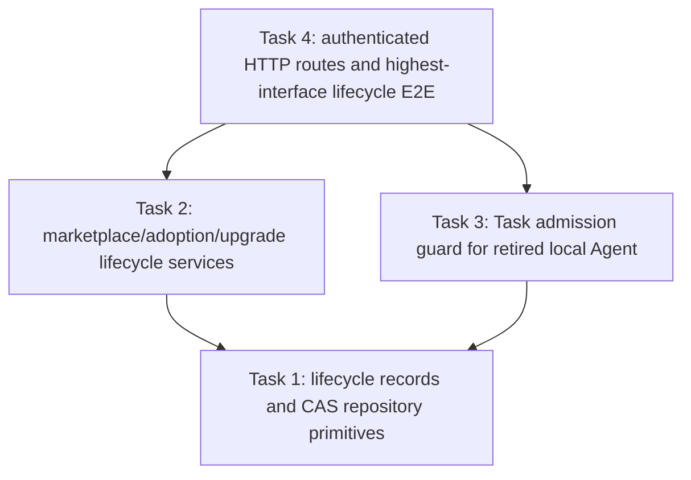

# Issue #63 T33 Lifecycle Plan — Retire, End, Unlist, Deprecate

> **For agentic workers:** REQUIRED SUB-SKILL: Use superpowers:subagent-driven-development (recommended) or superpowers:executing-plans to implement this plan task-by-task. Steps use checkbox (`- [ ]`) syntax for tracking.

**Goal:** Implement Issue #63's four lifecycle operations so new use stops at the correct boundary while immutable Releases, local Agent Versions, existing Tasks, Artifacts, license records, lineage, and audit history remain available.

**Architecture:** Preserve the existing Adoption and Variant aggregates from #59 and the proposal lifecycle from #61. Add tenant-scoped, compare-and-set lifecycle transitions with actor, time, and reason. A retired Variant is excluded from new Task admission by its local Agent ID; an ended Adoption can have no non-retired Variants and cannot create new Variants or accept upgrade proposals. Tenant and Public listings become unlisted without revoking their Releases or existing Adoption/local Agents. Release deprecation is lifecycle metadata separate from immutable Release bundle bytes and points to a replacement Release; deprecated releases stay discoverable with a warning, and new adoption is blocked by default. Security revocation remains #64.

**Tech Stack:** Go, GORM migrations (SQLite and versioned tracks), existing marketplace services/repositories, Gin handlers/router, SQLite-backed router integration tests.

**Issue input:** Snapshot `docs/plans/issue30-sweep/issues/issue-63.md`, captured with the recursive #30 Issue tree on 2026-09-23. Issue #63 is open, `ready-for-agent`, has no formal subissues or comments, declares parent #30, and declares `depends_on #59,#61`. Its three acceptance criteria are preserved below.

**Approved facts:** `CONTEXT.md` Agent Variant / Adoption / Listing / Release terminology; `docs/specs/2026-09-20-agent-marketplace-domain-model.md` §§4, 8–11, 15, 17; `docs/adr/0011-agent-marketplace-release-adoption-boundary.md`; Issue #63 snapshot.

**Dependency evidence:** `docs/plans/issue30-sweep/FINAL-REPORT.md` rows #59 and #61 mark both predecessor deliveries verified; it records B6 dependencies #63←#59+#61 as satisfied. Their implementation commits are ancestors of this plan worktree base `38240b187b0122219a881a2fc46e2336a0cfa6fa`: #59 final `a522079427c1ab8a7a04a9c0108d382a502b8b91`; #61 final `d51401af48d33c844f1f3c4664023017515cbdcd`. #63 execution still requires this plan commit, task reviews, integrated verification, and the complete review gates below.

## Global Constraints

- Issue #63 AC1: “退出不删除版本、Task、Artifact、许可或审计。”
- Issue #63 AC2: “Unlisted 与 Deprecated 的行为差异可验证。”
- Issue #63 AC3: “端到端行为通过最高稳定 Interface 验证；底层单测、静态检查或 mock 不冒充真实集成证据。”
- Retire Variant means no new Task may be created from its local Agent; it does not stop an already-created Task or delete its immutable Agent Version.
- End Adoption requires every Variant terminally retired, prevents new Variants and new/accepted upgrade proposals, and records archival history.
- Unlisted stops catalog discovery and new Adoption but does not revoke or mutate an existing Adoption, Release, or local Agent Version.
- Deprecated remains discoverable but carries a deprecation reason and replacement Release; new Adoption of it is blocked by default. Existing Adoptions and local Agents remain usable. A deprecation transition must validate replacement identity and preserve both Releases.
- Release bundle, Manifest, Dependency Lock, license, and lineage content remain immutable. Lifecycle metadata must not rewrite bundle bytes.
- Security Revoked and Dependency Security Blocked behavior is Issue #64 and is outside this plan.
- All lifecycle reads/writes remain tenant-scoped or platform-admin scoped as appropriate, use bound DB parameters and durable CAS, and preserve non-enumerating not-found behavior.
- Local commits only. No push, merge to main, deployment, publication, or Issue mutation.

## Review Focus

1. Retired Variant local Agent cannot be used to create a new Task through the actual production Task/session admission boundary; a pre-existing Task still loads and can finish.
2. Adoption cannot end while any Variant is not retired; after end, create-variant and accept-upgrade paths reject, and all rows remain queryable for history.
3. Unlist and deprecate have different observable behavior: unlisted disappears from discovery and rejects new adoption while current local Agents continue; deprecated stays visible with reason/replacement and default adoption rejects with a clear conflict.
4. Retiring, ending, unlisting, and deprecating do not delete or rewrite Release bytes, frozen versions, Task/Artifact/License rows, or lineage/audit records.
5. Competing lifecycle calls converge through persistent CAS with one recorded actor/time/reason; stale or invalid transitions fail without partial mutation.
6. Ended Adoption prevents both new proposal materialization and accepting an already-open proposal while preserving proposal history.

## Task DAG and file ownership

Task 2 and Task 3 may run in separate worktrees after Task 1's interfaces are reviewed: their production files differ (`marketplace` domain vs session admission), but both consume the lifecycle repository contract. Task 4 is serial after both. If production wiring or test helpers reveal shared files, update this preflight before dispatch.

| Task | Owned files | Consumes | Produces |
|---|---|---|---|
| 1 | lifecycle migration files; `internal/types/agent_adoption_persistence.go`, `agent_marketplace_persistence.go`, `public_marketplace_persistence.go`; repository interfaces and implementation/tests | Existing #59 Adoption/Variant and #60 Public Marketplace entities; existing `TransitionProposal` / Variant CAS seams | Tenant-scoped CAS transition methods and durable audit metadata for Variant, Adoption, tenant/public Listing, and tenant/public Release deprecation |
| 2 | `internal/application/service/agent_adoption.go`, `agent_marketplace.go`, `public_marketplace.go`, `agent_upgrade.go` and domain service tests/interfaces as required | Task 1 lifecycle repository methods | Retire/End/Unlist/Deprecate domain operations; guard CreateVariant, Adopt/Introduce and upgrade proposal reconcile/accept semantics |
| 3 | `internal/handler/session/handler.go`, session admission service/interface, `internal/container/container.go`, focused handler/service tests | Task 1 `AgentTaskAdmission` lookup by tenant + local Agent ID | Production Task creation refuses only a retired marketplace Variant's Agent; ordinary Agents and existing Tasks preserve current behavior |
| 4 | `internal/handler/agent_marketplace.go`, public-marketplace handler as required; `internal/router/routes_agent_marketplace.go`, public routes, router lifecycle integration tests; relevant container/router registration | Task 2 and Task 3 reviewed services/interfaces | Admin/platform-admin lifecycle routes, explicit response fields, and real migrated SQLite + real HTTP acceptance proof |

## Issue acceptance mapping

| Acceptance | Required evidence |
|---|---|
| AC1: exit preserves records | Router-level flow snapshots Release bundle/digest, local frozen Agent Version, session/Task row, Artifact, license, lineage, review, and audit before/after lifecycle operations; exact bytes/IDs remain. New session creation using a retired local Agent is rejected; an existing session remains readable and can complete a run. |
| AC2: Unlisted differs from Deprecated | Real catalog HTTP: Unlisted is absent and new Adoption is rejected while existing available local Agent remains; Deprecated is present with reason/replacement, default new Adoption is rejected with an actionable conflict, and existing Adoption/local Agent remains available. |
| AC3: highest stable Interface | `internal/router` integration tests exercise actual production wiring, real SQLite migrations/stores/services/handlers/Gin routes, and observable HTTP plus Task/session creation. Unit tests support but do not replace these tests. |

## Tasks

### Task 1: Add durable lifecycle metadata and tenant/platform-scoped CAS primitives

**Dependencies:** none.
**Owner role:** `backend_implementer`. **Validator role:** `backend_validator`. **Independent reviewer:** `reviewer`.

**Owned files:** As shown in the task table. Add only the minimum columns/tables and interfaces needed for lifecycle state and audit evidence. Keep Release content immutable; lifecycle records must identify tenant/public lane and target Release without copying or changing bundle data.

- [ ] Add failing repository/migration tests for Variant retirement, Adoption end, tenant/public Listing unlisting, and tenant/public Release deprecation metadata. Cover missing rows, wrong tenant, invalid current state, and competing CAS calls.
- [ ] Add failing migration assertions for up/down/up in SQLite and versioned schema parity; use the next unique migration numbers recorded in the current branch and run `TestMigrationVersionsUniquePerTrack` before finalizing numbers.
- [ ] Implement scoped CAS operations that persist actor, UTC timestamp, reason, and replacement Release where applicable. Existing review/audit rows and Release bundle fields remain untouched.
- [ ] Add `AgentTaskAdmission` repository seam to find whether `(tenantID, localAgentID)` is linked to a retired marketplace Variant, without making ordinary local Agents require marketplace rows.
- [ ] Run focused repository/migration tests and `git diff --check`; report exact commands/results and commit a review package with hash.

**Failure handling:** If Public and Tenant release lifecycles cannot share an unambiguous key or tenant boundary, keep distinct lifecycle records and explicit interfaces; do not overload a tenant ID onto the public Release row.

### Task 2: Implement lifecycle domain transitions and Adoption/upgrade guards

**Dependencies:** Task 1 verified and its checkpoint integrated into the current worktree.
**Owner role:** `backend_implementer`. **Validator role:** `backend_validator`. **Independent reviewer:** `reviewer`.

**Owned files:** `internal/application/service/agent_adoption.go`, `agent_marketplace.go`, `public_marketplace.go`, `agent_upgrade.go`, required `internal/types/interfaces` declarations, and service tests.

- [ ] Add failing service tests for retiring draft and published Variants, repeated retire conflict, End Adoption with active Variants rejected, End Adoption after all retired accepted, and post-end CreateVariant rejected.
- [ ] Add failing service tests for unlisting/deprecating operations and behavior: unlisted blocks new Adoption/Introduction and catalog discovery but not existing AvailableAgent rows; deprecated stays visible and default new Adoption returns a clear conflict with reason/replacement; existing Adoption and Variant remain runnable.
- [ ] Add failing upgrade tests: ended Adoption is skipped by proposal reconciliation; accepting a pre-existing open proposal after end returns conflict and leaves proposal history unchanged.
- [ ] Implement lifecycle service methods using Task 1 CAS. Validate deprecation replacement exists in the same listing/public listing lineage and is not the deprecated Release itself. Do not rewrite Release bytes or state in the immutable bundle.
- [ ] Run focused service tests and `git diff --check`; document which catalog routes expose deprecated metadata and how default rejection is returned.

**Failure handling:** Do not silently convert end/deprecate into delete or security revoke. If a legacy adoption path cannot express a safe default-deprecation response, stop and document the smallest interface gap.

### Task 3: Enforce retired Variant blocking at production Task admission

**Dependencies:** Task 1 verified and its checkpoint integrated; may run alongside Task 2 only in an independent worktree with exact owned files.
**Owner role:** `backend_implementer`. **Validator role:** `backend_validator`. **Independent reviewer:** `reviewer`.

**Owned files:** Task table's session admission, container wiring, and focused test files. Do not modify `AgentAdoptionService` or marketplace lifecycle handlers.

- [ ] Identify the canonical create-Task boundary for mobile and web sessions; pin it with a handler-level failing test that creates a session with a normal Agent and one backed by a retired Variant.
- [ ] Add production-wiring admission guard: reject creation only when the requested tenant-owned local Agent is linked to a retired Variant. Preserve behavior for ordinary Agents and shared-agent authorization.
- [ ] Add regression proving the retired Agent cannot start a new Task/session, while an already-created session remains readable and may complete a run; prove no Task/Artifact/history row was deleted.
- [ ] Run focused session/handler tests, check container compilation, and `git diff --check`; report exact files and boundary reasoning.

**Failure handling:** If Task/session creation has multiple production entry points, enumerate and cover each. Do not rely on hiding the Agent from `available-agents` as authorization. If a new Task cannot be distinguished from a new Run on an existing Task, preserve existing Task execution and block only creation as specified.

### Task 4: Wire lifecycle routes and prove the complete behavior through HTTP

**Dependencies:** Tasks 2 and 3 verified and integrated.
**Owner role:** `backend_implementer`. **Validator role:** `backend_validator`. **Independent reviewer:** `reviewer`.

**Owned files:** marketplace/public handlers, router registrations and `internal/router` integration tests; avoid production service/repository edits unless scoped follow-up is approved.

- [ ] Add failing real-router tests for Retire Variant → new Task denied while old Task, Agent Version, Artifact/license/lineage remain; End Adoption denied until all Variants retired and then blocks CreateVariant and open-proposal accept/reconciliation.
- [ ] Add failing HTTP lifecycle distinction test: unlisted disappears and rejects new Adoption/Introduction while old AvailableAgent works; deprecated remains visible with reason and replacement, rejects a new Adoption by default, and does not block existing Adoption/local Agent.
- [ ] Add authorization/tenant tests for each lifecycle route (Admin or platform governance role as dictated by existing #58/#60 authorization contracts), including another tenant's IDs matching not-found shape and zero mutation.
- [ ] Wire authenticated routes and responses to production services; ensure request identity comes only from authenticated context and bodies reject unknown fields/oversized input using existing handler patterns.
- [ ] Run the complete targeted router suite with SQLite migrations, related service/repository suites, migration uniqueness check, `go build ./internal/...`, and `git diff --check`. Save exact outputs and a review package hash.

**Failure handling:** Any protected resource deletion, version mutation, existing Task denial, or ambiguous identity scope fails acceptance. Do not mark verified on unit tests alone.

## Independent review and integrated verification

- Each task reviewer returns separate Spec compliance and code-quality conclusions. Valid findings receive scoped SDD repair tasks and re-review before integration.
- After Task 4, run backend validators and a full independent Issue #63 review on the integrated range.
- Then run OCR on the full Issue #63 range with business background and `--audience agent`; archive every report and ruling under `docs/plans/issue30-sweep/ocr/` and update the execution ledger.
- Keep #63 incomplete until AC1–AC3 evidence is complete and no valid High/Medium independent-review or OCR issue remains.
