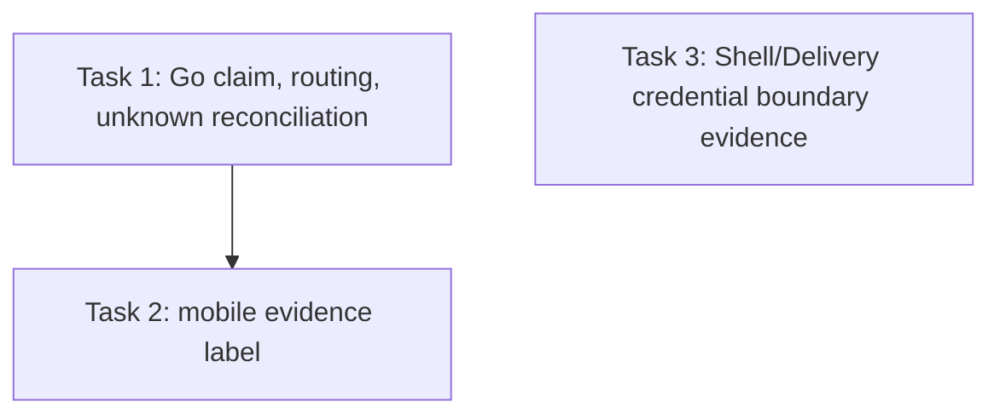

# T55 Integrated Review Repair Plan

> **For agentic workers:** REQUIRED SUB-SKILL: Use superpowers:subagent-driven-development (recommended) or superpowers:executing-plans to implement this plan task-by-task. Steps use checkbox (`- [ ]`) syntax for tracking.

**Goal:** Close the four valid findings from the final independent review of Issue #55 by making pushed recovery single-claim and run-bound, reporting mobile recovery evidence truthfully, and proving managed code-platform credentials stay outside the general Shell boundary.

**Architecture:** Keep the durable Delivery row as the recovery linearization point: atomically claim `pushed` before any PR write, settle a definite rejection back to `pushed`, and park an unobservable write outcome as `unknown` for provider-query-only reconciliation. Bind every action to the URL run and owner before entering the provider path. Keep the mobile opt-in evidence flow honest for already-delivered records. Add a production-wiring boundary integration test for Delivery credentials versus general Shell sandbox creation and execution. A narrow optional provider-factory seam may be added to the tenant sandbox resolver so the test can keep the real persisted-config loader and `SessionBoundManager` path while injecting a fake `RemoteSandboxClient`; production container wiring continues to use the existing concrete Cube/E2B/Docker factory. Do not change operator-provided Shell environment semantics.

**Tech Stack:** Go 1.26, GORM/SQLite migration-backed HTTP integration tests, Gin handlers, TypeScript/node:test/tsx, Expo mobile smoke tests.

**Spec:** `docs/plans/issue30-sweep/issues/issue-55.md`; approved `docs/specs/2026-09-20-mobile-ai-office-design.md` (Developer credential boundary and integration requirements); `docs/specs/2026-09-20-mobile-module-seams.md` (mobile Terminal read-only surface); `CONTEXT.md` (Code Delivery and Code Delivery Approval).

## Global Constraints

- Issue #55 AC1: “推送成功/PR失败可恢复且不重复推送。”
- Issue #55 AC2: “移动 Terminal 底层无法发送输入或绕过 Delivery。”
- Issue #55 AC3: “端到端行为通过最高稳定 Interface 验证；底层单测、静态检查或 mock 不冒充真实集成证据。”
- Issue #55 What to build: “交付部分成功时只补做未完成步骤；未知结果核对远端；通用 Shell 无远端写凭据。”
- Approved mobile design §140: Developer supports personal and Tenant GitHub/GitLab connections, task branches and draft PR/MR only; it does not merge automatically or expose remote credentials to Shell.
- Approved mobile design §163: Go integration tests verify authorization, Tenant/Owner/Collaborator predicates, idempotency, partial external success, unknown outcomes, and durable checkpoints.
- A request whose provider write may have taken effect must never issue another PR create until remote facts have been queried. No access to live credentials or real-provider writes is allowed in these tasks.
- Keep separate the pre-existing general Shell operator environment from server-managed Delivery credentials. Do not silently remove supported operator-configured environment values.
- Task commits are local only. No push, merge to main, deployment, publication, or GitHub Issue mutation.

## Review Focus

1. **Two overlapping recovery requests for the same pushed Delivery:** exactly one claimant reaches the PR write; the loser performs no provider call. Pin with a barrier-controlled HTTP integration test.
2. **An HTTP URL run paired with another owned run's Delivery ID:** reject before state transition or provider access. Pin dispatch and resolve paths with two owned runs and an exact zero-provider-write assertion.
3. **PR create returns an ambiguous transport/server outcome:** persist unknown and reconcile only through provider reads; retrying the recovery endpoint must not create a second PR. Pin with a provider stub that accepts the request but drops the response, then a read-only resolve assertion.
4. **An opt-in smoke receives a Delivery already in `delivered`:** record `not-needed`, issue zero recovery writes, and reserve `recovered` for a witnessed state transition. Pin through `runDeliveryIntegration`, not only the mapping helper.
5. **A general Shell is created while a managed Delivery credential exists for the same owner/Tenant:** the Shell provider request and executed process must not receive the managed credential, while the Delivery adapter alone resolves it into the outbound Authorization header. Pin through the production configuration/secret-resolution wiring with a fake credential and fake provider.

## Task DAG and shared-file preflight

Task 3 uses a new isolated integration-test file and may run beside Task 1 only if its implementation agent confirms it does not need a shared helper or production file. Task 2 consumes no new Go interface and can run beside Task 1 in a separate worktree. All integration commits are reviewed before merging into the serial T55 integration worktree. If either independent boundary proves false, stop parallel integration and update the task brief before proceeding.

| Task pair | Shared files or interfaces | Preflight result |
|---|---|---|
| Task 1 ↔ Task 2 | No shared files; Go Delivery state/wire contract is consumed by the already-existing mobile API and smoke interface | Independent implementation worktrees are safe; integrate and rerun combined tests afterward |
| Task 1 ↔ Task 3 | Task 1 changes `internal/application/repository/delivery_recovery_http_test.go`; Task 3 creates `internal/application/repository/delivery_shell_isolation_http_test.go` and consumes existing Shell/provider seams | No shared owned file or produced interface; run concurrently only if Task 3 needs no helper in Task 1's test file |
| Task 2 ↔ Task 3 | No shared files or interfaces | Independent |

| Task | Internal consistency check | Result |
|---|---|---|
| 1 | CAS claim occurs before PR write; mismatch checks precede provider access; successful, definite failure, and ambiguous outcomes each have a terminal/persisted result and explicit tests | Consistent; if the existing action snapshot/query seam is insufficient, pause before widening |
| 2 | The read state chooses `not-needed` before invoking recovery; tests assert both result label and zero writes | Consistent |
| 3 | Uses a fake managed credential and provider at production Shell and Delivery wiring boundaries; keeps operator-provided env unchanged | Consistent; permit only a default-preserving optional client factory seam for test injection, with no change to production provider selection or operator env |

## Review finding coverage

| Finding | Severity | Plan task | Required evidence |
|---|---|---|---|
| T55-F1 concurrent pushed recovery may duplicate PR creation | High | 1 | barrier-controlled two-request HTTP test; exactly one PR POST; ambiguous outcome resolves by GET only |
| T55-F2 Delivery ID is not bound to URL run/owner | Medium | 1 | dispatch and resolve mismatch tests; no provider writes |
| T55-F3 delivered no-op reported as recovered | Medium | 2 | full integration smoke test returns `not-needed`, zero recovery calls |
| T55-F4 Shell credential boundary lacks production evidence | Medium | 3 | fake managed credential absent from production Shell create/exec while Delivery adapter alone sees outbound Authorization |

## Tasks

### Task 1: Claim pushed recovery, bind Delivery to its run, and reconcile ambiguous outcomes

**Dependencies:** none.

**Owner role:** `backend_implementer`. **Validator role:** `backend_validator`. **Independent reviewer:** `reviewer`.

**Owned files:**
- Modify: `internal/modules/codedelivery/service.go`
- Modify: `internal/modules/codedelivery/dispatcher.go`
- Modify: `internal/modules/codedelivery/repository/codedelivery/store.go` only if a narrowly scoped CAS method is required
- Test: `internal/modules/codedelivery/service_dispatch_test.go`
- Test: `internal/modules/codedelivery/service_gitlab_test.go`
- Test: `internal/application/repository/delivery_recovery_http_test.go`

**Consumes:** existing `DeliveryStore.TransitionState(ctx, tenantID, id, from, to, failure)` CAS; existing `DeliveryDispatcher.QueryProvider`; existing `DispatchInput{TenantID, CallerID, RunID, DeliveryID}`.

**Produces:** recovery that performs a persistent `pushed → dispatched` CAS before any PR write; definite no-write/provider rejection returns the row to `pushed`; uncertain provider write moves it to `unknown`; remote reconciliation of a recovery-originated unknown works even though its already-consumed A03 action is succeeded; ordinary A03 action-unknown continues to use `Actions.ResolveUnknown`. Dispatch and resolve require `row.RunID == in.RunID` and `row.OwnerID == in.CallerID` before any provider call.

- [ ] **Step 1: Add failing service tests.** Add a two-caller barrier test starting from a `pushed` row; hold the first PR create request until the second request has attempted recovery. Assert one successful claim, one state conflict, exactly one `POST /pulls`, and zero repeated push writes. Add an ambiguous response test where the stub receives `POST /pulls` and drops the connection; assert durable `unknown`, then resolve with GET-only provider calls and no second POST. Add mismatched run/Delivery ID cases for both dispatch and resolve and assert rejection plus zero provider writes.
- [ ] **Step 2: Run only the focused tests and confirm RED.** Run `go test ./internal/modules/codedelivery/ -run 'Test.*(Concurrent|Ambiguous|MismatchedRun)' -count=1 -v` and the new focused HTTP cases. Expected: current pushed recovery permits duplicate POSTs, and cross-run IDs are accepted; the tests must fail on these behaviors before implementation.
- [ ] **Step 3: Implement the CAS claim and state settlement.** Claim `pushed → dispatched` using the existing compare-and-set before calling `RecoverPullRequest`. Reject a lost claim without calling the provider. Refactor recovery outcome classification so a definite rejected PR write returns `dispatched → pushed`, a confirmed PR returns `dispatched → delivered`, and an ambiguous PR write returns `dispatched → unknown`. Do not re-run push steps on any recovery path.
- [ ] **Step 4: Implement query-only reconciliation for recovery-originated unknown.** Load the Delivery and its action snapshot. If the Delivery is unknown while its A03 action is already succeeded from the partial push, call the dispatcher's provider query directly and leave A03 terminal state unchanged; if the A03 action itself is unknown, preserve the existing `Actions.ResolveUnknown` path. Provider query must only GET remote facts and settle `unknown → delivered|pushed`.
- [ ] **Step 5: Bind run and owner before action.** Compare the persisted row's `RunID` and `OwnerID` with input values in both dispatch and resolve after tenant-scoped load and before CAS, action service, or provider calls. Return the existing non-enumerating not-found/ownership error surface on mismatch.
- [ ] **Step 6: Run focused regression tests.** Run `go test ./internal/modules/codedelivery/ -run 'Test(PartialPushPRFailureRecoversWithoutRepush|ConcurrentPushedRecoveryClaimsOnce|AmbiguousPushedRecoveryResolvesWithoutSecondPRWrite|DispatchRejectsDeliveryFromDifferentOwnedRun|ResolveRejectsDeliveryFromDifferentOwnedRun)' -count=1 -v`, `go test ./internal/application/repository/ -run 'TestT25(PartialPushPRFailureRecoversExactlyOnceOverHTTP|UnknownResolvesFromRemoteFactsOverHTTP)' -count=1 -v`, and `git diff --check`. Expected: all selected tests pass, provider POST count is one under overlap and ambiguity, and zero mutation occurs for mismatched run IDs.
- [ ] **Step 7: Commit the task.** Commit only the owned production/test files and write an exact task report with HEAD, commands, outcomes, review-package path, and SHA-256.

**Failure handling:** If the action recovery API cannot expose the existing snapshot/query seam without broadening authorization or modifying unrelated action state, stop and report the exact interface gap before widening files. Do not solve concurrency by an in-memory mutex; the claim must survive multiple processes.

### Task 2: Report no-op delivery recovery honestly in mobile integration evidence

**Dependencies:** none at interface level; review after Task 1 integration for the combined T55 range.

**Owner role:** `frontend_implementer`. **Validator role:** `frontend_validator`. **Independent reviewer:** `reviewer`.

**Owned files:**
- Modify: `apps/mobile/src/delivery-integration-smoke.ts`
- Test: `apps/mobile/src/delivery-integration-smoke.test.ts`

**Consumes:** existing `runDeliveryIntegration` delivery read and `createDeliveryRecovery` result contract.

**Produces:** an initially `delivered` read is recorded as `not-needed` without dispatch/resolve; `recovered` means the smoke witnessed a dispatch or resolve action and a successful resulting state. Keep disabled, unreadable, and missing-delivery behavior unchanged.

- [ ] **Step 1: Add a failing full-flow test.** Exercise `runDeliveryIntegration` with recovery opt-in enabled and a readable `delivered` record. Assert `recovery === 'not-needed'`, the action request list is empty, and no recovery error is recorded.
- [ ] **Step 2: Run the focused test and confirm RED.** Run `pnpm --filter @weknora/mobile exec tsx --test src/delivery-integration-smoke.test.ts`; expected: the current code calls recovery and reports `recovered`.
- [ ] **Step 3: Add a state guard before the recovery call.** When the read record is already delivered, write the `not-needed` evidence result and return without calling the recovery API. Preserve success reporting only for a performed dispatch/resolve transition.
- [ ] **Step 4: Run focused tests and typecheck.** Run `pnpm --filter @weknora/mobile exec tsx --test src/delivery-integration-smoke.test.ts` and `pnpm --filter @weknora/mobile typecheck`. Expected: focused suite and typecheck pass; delivered no-op asserts zero requests.
- [ ] **Step 5: Commit the task.** Commit only the two owned files and write an exact report with the task commit, verification outputs, and review-package checksum.

### Task 3: Prove managed Delivery credentials do not cross the general Shell boundary

**Dependencies:** none; may run beside Task 1 only with new test-only files and no shared helper edits.

**Owner role:** `backend_implementer`. **Validator role:** `backend_validator`. **Independent reviewer:** `reviewer`.

**Owned files:**
- Create: `internal/application/repository/delivery_shell_isolation_http_test.go`
- Modify only as required for the test seam: `internal/modules/execution/sandbox/tenant_resolver.go` and its resolver test; optional factory must default to the existing production `buildClient` behavior.

**Consumes:** production Delivery credential resolver and outbound HTTP transport already exercised by `delivery_recovery_http_test.go`; production tenant Shell configuration resolver, `SessionBoundManager`, and `RemoteSandboxClient` boundary.

**Produces:** one isolated fake-secret/fake-provider integration test that resolves a fake managed GitHub write credential for Delivery, creates a general Shell through the production tenant configuration path, executes one benign command through the general Shell surface, and proves the fake managed credential appears only in the Delivery adapter's outbound Authorization header and nowhere in the Shell create request, execution environment, response, or persisted Shell configuration. Keep owner-configured environment values unchanged.

- [ ] **Step 1: Build the failing boundary test with separate probes.** Use distinct fake values for the managed Delivery credential and the operator-provided Shell environment. Record the exact production-resolved Shell config and the captured provider `Create`/`Exec` request. Assert the managed credential is absent from every Shell boundary while the Delivery HTTP stub sees it only as Authorization. The test must fail if the managed probe is injected into Shell env or output.
- [ ] **Step 2: Establish the narrow provider injection seam if needed.** The existing tenant resolver privately constructs concrete clients. Add an optional injected `RemoteSandboxClient` factory used only when explicitly provided; leave production container wiring unset so it continues to use `buildClient`, guarded shared transports, and the real persisted tenant config loader. Pin that default behavior with a resolver test.
- [ ] **Step 3: Run the focused test and confirm the baseline.** Run `go test ./internal/application/repository/ -run '^TestManagedDeliveryCredentialNeverEntersGeneralShell$' -count=1 -v`. Expected: production config resolution and `SessionBoundManager` use the fake client only at the provider seam; no helper-only stand-in.
- [ ] **Step 4: Correct only a proven boundary violation.** If managed Delivery credentials are present at the Shell seam, remove that unintended cross-wiring at the nearest composition boundary; do not strip arbitrary operator-supplied variables or silently redefine Shell configuration.
- [ ] **Step 5: Re-run the focused test and existing Shell regressions.** Run the focused boundary test, `go test ./internal/modules/execution/sandbox/ -run 'TestWithWorkspaceEnvDefaults' -count=1`, resolver factory/default tests, and `git diff --check`. Expected: all pass; the Delivery fake credential never appears in Shell observations.
- [ ] **Step 6: Commit the task.** Commit the owned test/seam and any proven minimal composition fix, then record exact commands, results, commit, and package checksum.

## Completion checks

- All three tasks have implementation reports and independent task reviews at the final task commit.
- The backend barrier test proves exactly one PR write, the ambiguous outcome test proves query-only settlement, and run/owner mismatch tests prove no provider mutation.
- The full-flow mobile test distinguishes `not-needed` from `recovered` and proves zero writes for an already-delivered record.
- The Shell/Delivery boundary test uses fake managed credentials and production credential/configuration wiring; no real secrets or provider writes are used.
- Run the affected backend repository, codedelivery and sandbox suites plus mobile test suite/typecheck at the final integration HEAD. Re-run a full independent T55 review, then T55 OCR on the complete exact range after the provider is operational. Do not mark #55 fully verified while its live credential-gated path is skipped or final OCR is incomplete.
