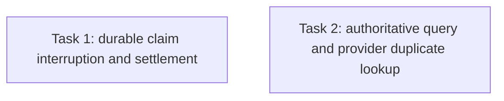

# T55 Task 1 High Finding Repair Plan

> **For agentic workers:** REQUIRED SUB-SKILL: Use superpowers:subagent-driven-development (recommended) or superpowers:executing-plans to implement this plan task-by-task. Steps use checkbox (`- [ ]`) syntax for tracking.

**Goal:** Resolve the two High findings from the independent review of T55 repair Task 1 without reopening the already reviewed run/owner binding or weakening query-before-retry guarantees.

**Architecture:** The durable Delivery state remains the recovery authority. A claimed `dispatched` recovery must be recoverable after caller cancellation/process interruption, with settlement performed through a bounded context and persistence errors surfaced. An abandoned claim may move to `unknown` only through a safe durable recovery path; any subsequent attempt must query authoritative PR and branch facts first. A PR lookup error is uncertainty, never proof of absence. Provider adapters must not create a PR when their duplicate-detection lookup fails.

**Tech Stack:** Go, GORM/SQLite, Gin integration tests, existing `DeliveryStore` CAS and GitHub/GitLab provider adapters.

**Spec and inputs:** Issue #55 snapshot `docs/plans/issue30-sweep/issues/issue-55.md`; approved `docs/specs/2026-09-20-mobile-ai-office-design.md`; `CONTEXT.md`; integrated repair plan `2026-09-30-t55-integrated-review-repairs.md`; Task 1 implementation report in its assigned worktree; independent review `.superpowers/sdd/plan-t55/task-1-independent-review.md`.

## Global Constraints

- Preserve AC1: “推送成功/PR失败可恢复且不重复推送。”
- Never repeat PR create while a previous write is ambiguous and provider facts are unavailable.
- A failed provider GET remains unknown; it cannot settle `unknown → pushed`.
- Avoid in-memory mutexes as the cross-process correctness mechanism.
- Preserve run/owner checks before actions/provider access and preserve ordinary A03 action-unknown behavior.
- No live provider credentials or writes. Local commits only; no push, merge to main, deploy, publication, or Issue mutation.

## Review Focus

1. Caller cancellation after PR create and process interruption after the durable claim cannot strand a permanently unresolvable `dispatched` row.
2. Persistence failure while settling recovery is visible and the durable state remains safely reconcilable.
3. Failed PR GET, timeout, 5xx, malformed response, or failed duplicate-detection lookup never implies PR absence or allows a new POST.
4. Only a successful authoritative empty PR lookup plus successful branch confirmation can settle an ambiguous recovery to `pushed`.
5. GitHub and GitLab both fail closed before POST when pre-create duplicate lookup errors.

## Task DAG and ownership

| Task pair | Shared files/interfaces | Result |
|---|---|---|
| Task 1 ↔ Task 2 | Both may touch `service.go`/`dispatcher.go` or provider adapter behavior, and both consume Delivery state semantics | Serialize in one assigned worktree; Task 2 depends on Task 1 interface decisions |

## Task 1: Make claimed recovery interruption-safe

**Dependencies:** none.
**Owner role:** `backend_implementer`. **Validator role:** `backend_validator`. **Independent reviewer:** `reviewer`.

**Owned files:** `internal/modules/codedelivery/service.go`, relevant codedelivery service tests, and `internal/application/repository/delivery_recovery_http_test.go` only where needed for HTTP behavior.

**Consumes:** existing persisted CAS state transitions and Task 1 initial repair commit `e43c859b8ab0a84ba69c64136a91067dac6127e0`.

**Produces:** cancellation/process interruption after `pushed → dispatched` is safely settled or recoverable; no ignored persistence failures; tests prove no duplicate PR write.

- [ ] Add a failing regression that claims recovery, accepts or ambiguously completes PR create, then cancels the request context before settlement. Assert the row can reach `unknown` through bounded independent settlement or a durable reconciliation route.
- [ ] Add a failure-injection regression for CAS settlement failure. Assert the error is surfaced and the stored state is not reported as safely settled.
- [ ] Trace restart/retry behavior for `dispatched`. Provide a bounded, durable reconciliation route for stale recovery claims without any PR write; never use an in-memory lock or time-only guess to repeat PR create.
- [ ] Use a bounded context independent of the canceled request for the required state settlement, check every transition error, and return an error that preserves the original provider error context.
- [ ] Run focused service/HTTP tests, the full codedelivery package, and `git diff --check`. Record actual outputs and commit a task report with base, implementation commit, and payload hash.

**Failure handling:** If a safe stale-claim criterion cannot be derived from existing persisted facts or interfaces, keep `dispatched` fail-closed and stop for an interface/ADR ruling rather than retrying a remote write. The repair must still surface cancellation/settlement failure precisely.

## Task 2: Keep uncertain PR queries from authorizing another create

**Dependencies:** Task 1's settlement/state handling reviewed in the same branch.
**Owner role:** `backend_implementer`. **Validator role:** `backend_validator`. **Independent reviewer:** `reviewer`.

**Owned files:** `internal/modules/codedelivery/dispatcher.go`, GitHub/GitLab provider implementation and tests, codedelivery service/provider tests, and `internal/application/repository/delivery_recovery_http_test.go` only if needed. Reuse Task 1 worktree after its checkpoint is reviewed.

**Consumes:** `DeliveryDispatcher.QueryProvider`, `PullRequestForHead`, `DraftPullRequest`, and Task 1 durable claim semantics.

**Produces:** provider query/duplicate-detection errors retain unknown and never cause another POST; only authoritative PR absence plus branch presence may settle to `pushed`.

- [ ] Add a failing HTTP regression with ambiguous PR create, persisted remote PR, PR GET returning a transient failure, and branch GET succeeding. Assert Delivery remains `unknown` and no additional PR POST occurs.
- [ ] Add provider adapter regressions proving GitHub and GitLab abort `DraftPullRequest` when pre-create PR lookup errors; assert zero POST.
- [ ] Propagate lookup errors from `QueryProvider`; settle to `pushed` only on a successful empty PR result followed by successful branch confirmation. Preserve `unknown` on all inconclusive read outcomes.
- [ ] Run focused query/provider tests, full codedelivery and relevant repository suites, and `git diff --check`. Update report and review package hash.

**Failure handling:** Do not downgrade read errors to absence. If a provider API cannot distinguish authoritative absence from transient errors, retain `unknown` and document the provider-specific limitation.

## Required review and repair loop

- The backend implementer self-checks only; an independent reviewer gives separate Spec-compliance and code-quality verdicts.
- A validator reviews behavior tests without editing production or test source.
- Any valid finding receives a scoped repair round and independent re-review.
- Integrate only reviewed commits into the serial T55 worktree, then run T55 combined backend/mobile verification and a new full-range independent review.
- Final OCR must cover the full T55 delivery range; no valid High/Medium finding or incomplete OCR may be called complete.
