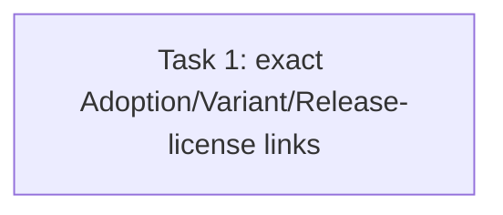

# T63 Task 6 History Evidence — Review Fix R1

> **For agentic workers:** REQUIRED SUB-SKILL: Use superpowers:subagent-driven-development. This narrowly repairs reviewer finding F2-R1-1 from `plan-t63-task6-review-fix.md` Task 1.

**Goal:** Pin the exact Adoption→Release and Variant→Release history links across all four lifecycle exits, and prove the seeded registry License remains the license referenced by the historical Release manifests.

**Architecture:** Extend the existing real-router lifecycle test only. Capture the exact tenant-scoped Adoption row and preserve its stable identity/Listing/AcceptedRelease relationships after it enters `ended`; assert the Variant’s pinned Release ID is unchanged; resolve the retained Release→Submission→Version chain and assert the manifest’s `license_id` still identifies the retained registry License. Keep table-count conservation and existing assertions.

**Tech Stack:** Go, Gin/httptest, GORM, real SQLite migration stream.

**Spec:** Issue #63 AC1 (`docs/plans/issue30-sweep/issues/issue-63.md`); approved marketplace Spec §§8–10; ADR-0011; `CONTEXT.md`; review report `task-1-review-report.md` finding F2-R1-1 and validation report `task-1-validation-report.md`.

## Global Constraints

- Modify only `internal/router/routes_agent_marketplace_lifecycle_test.go` in `codex/issue30-t63`.
- Do not modify lifecycle production code or any other test file.
- Preserve the expected post-exit Adoption state `ended`; this repair asserts identity and provenance links, not that lifecycle state stays unchanged.
- Keep all reads tenant-scoped and assert exact row identity after retire, end, unlist, and deprecate.
- The seeded Releases in this fixture are original (non-Fork) Releases; the lineage relevant to this scenario is the actual Adoption→accepted Release, Variant→pinned Release, Release→Submission→Version graph. Do not add synthetic non-empty Fork lineage fields: #63 AC1 does not require converting an original Release into a Fork, and that would misrepresent the fixture.
- Local commit authorized; do not push or merge remotely.

## Review Focus

1. The exact Adoption ID remains present with its original ListingID and AcceptedReleaseID after ending.
2. The exact Variant remains present with its original ReleaseID, AdoptionID, LocalAgentID and LocalAgentVersionID.
3. Each retained Release still points to its exact Submission and AgentVersion; the parsed manifest license ID points to the exact retained `AgentLicenseEntity` row.
4. Existing history counts and lifecycle route status assertions remain intact.

## Task DAG

### Task 1: Close history-provenance finding

**Source:** Issue #63 AC1; Task review finding F2-R1-1; backend validation coverage note.
**Dependencies:** `707b0f803dfd3c7cf31271de1b1acdda5dab1fe7` (F2 identity matrix; review and validator results are concerns, not acceptance).
**Role:** backend_implementer (narrow Go test repair).
**Owned files:** `internal/router/routes_agent_marketplace_lifecycle_test.go` only.
**Consumes:** existing `seededVariant`, `seededReleases`, `seededLicense`, `adoptionID`, and `listingID` fixture values in `TestLifecycleExitDeletesNothingAcrossGovernanceRows`.
**Produces:** exact post-exit Adoption, Variant release-pin and Release-manifest-license provenance assertions.

**RED → GREEN:**

1. Before the four exits, load and retain the exact `AgentAdoptionEntity` by `(tenant_id, adoptionID)`, and retain each variant/release ID and link value.
2. After all exits, reload the Adoption by exact tenant+ID; assert `ListingID` and `AcceptedReleaseID` are unchanged, and assert `State == "ended"`.
3. Reload the Variant and assert `ReleaseID` equals the pre-exit `seededVariant.ReleaseID` in addition to the existing links. Assert that its pinned Release is among the exact retained Release IDs.
4. For each reloaded Release, retain the existing Listing/Submission link assertions and assert the exact `AgentVersionID` source row still exists. Decode the manifest JSON's `license_id` and assert it equals `seededLicense.ID`; reload the exact license row and keep the existing registry identity/name check.
5. Run the targeted router test and verify these assertions pass. Do not add a synthetic Fork or mutate immutable Release fields solely to force non-empty `ForkSource*` values.

**Verification:**

- `go test ./internal/router/ -run 'TestLifecycleExitDeletesNothingAcrossGovernanceRows|TestLifecycleUnlistedVersusDeprecatedBehaviorDiffers|TestLifecycleRetireBlocksNewWorkEndToEnd' -count=1`
- `git diff --check`

**Acceptance mapping:** #63 AC1 → preserved counts and exact historical entity identities plus Adoption/Variant/Release→Submission/Version/manifest-license links. #63's unrelated fork-submission semantics remain covered by its dedicated #62 lineage route tests; this fixture remains an original Release lineage.

**Failure handling:** If the current manifest uses a different license ID from the manually seeded test registry row, update the fixture to seed the exact manifest license and explain the source in the report; never assert a fabricated cross-link.

