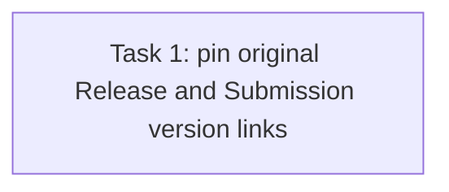

# T63 Task 6 History Evidence — Review Fix R2

> **For agentic workers:** REQUIRED SUB-SKILL: Use superpowers:subagent-driven-development. Steps use checkbox syntax. This plan addresses reviewer finding F2-R2-1 only.

**Goal:** Assert lifecycle exits preserve the exact Release-to-Version and Submission-to-Version links captured before the exit sequence.

**Architecture:** Extend the existing migration-backed router test only. Capture each retained Submission and its version identity before lifecycle exits, then compare both Submission and Release version IDs to their pre-exit values after the exits. Keep all existing provenance, identity, and count assertions.

**Tech Stack:** Go, Gin/httptest, GORM, SQLite.

**Spec:** Issue #63 AC1 (`docs/plans/issue30-sweep/issues/issue-63.md`); approved marketplace Spec §§8–10; ADR-0011; `CONTEXT.md`; `plan-t63-task6-history-r1.md` and its R1 review finding F2-R2-1.

## Global Constraints

- Modify only `internal/router/routes_agent_marketplace_lifecycle_test.go` in `codex/issue30-t63`.
- Test only; do not alter production code or weaken lifecycle behavior.
- Compare exact pre-exit values, not only cross-row equality after the exits.
- Local commit is authorized; do not push or merge remotely.

## Review Focus

1. A lifecycle operation that rewrites both Release and Submission version IDs must fail the test; compare each to its own captured value.
2. Keep reads tenant-scoped and retain the existing Adoption, Variant pin, manifest License and row-count assertions.

## Task DAG

### Task 1: Pin original version provenance

**Source:** Issue #63 AC1; R1 reviewer finding F2-R2-1.
**Dependencies:** R1 checkpoint `e033c95eaebbcfce2e257ae75a4e33510c75fb37`; scoped review and validator reports in `.superpowers/sdd/plan-t63-task6-history-r1/`.
**Role:** backend_implementer.
**Owned files:** `internal/router/routes_agent_marketplace_lifecycle_test.go` only.
**Consumes:** the existing seeded Release rows and their `SubmissionID`/`AgentVersionID` fields in `TestLifecycleExitDeletesNothingAcrossGovernanceRows`.
**Produces:** assertions proving post-exit `Release.AgentVersionID` and each linked `Submission.AgentVersionID` equal their separately captured pre-exit values.

- [ ] Before exits, capture exact Release and linked Submission IDs and each row's `AgentVersionID` under tenant scope.
- [ ] After all exits, reload each exact row and compare its `AgentVersionID` against its own captured value; preserve existing Release→Submission equality assertion as a separate relationship check.
- [ ] Run `go test ./internal/router/ -run 'TestLifecycleExitDeletesNothingAcrossGovernanceRows|TestLifecycleUnlistedVersusDeprecatedBehaviorDiffers|TestLifecycleRetireBlocksNewWorkEndToEnd' -count=1`; all three tests must pass.
- [ ] Run `git diff --check`; it must be clean.
- [ ] Commit only the owned test file and write the independent implementation report to `.superpowers/sdd/plan-t63-task6-history-r2/task-1-report.md`.

**Acceptance mapping:** #63 AC1 → lifecycle history preserves exact Release and Submission source-Version links across Retire, End, Unlist and Deprecate.

**Failure handling:** If fixtures cannot load the pre-exit source IDs without changing production code, report the exact schema/query constraint; do not broaden this repair into an API or schema change.
