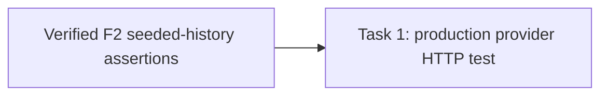

# Issue #63 Task 6 Review Follow-up — Production Admission Wiring

> **For agentic workers:** REQUIRED SUB-SKILL: Use superpowers:subagent-driven-development. This plan closes Task 6 review finding F1. Its dependency, the independent review and validation of `plan-t63-task6-review-fix.md` Task 1, must be verified before implementation dispatch.

**Goal:** Prove that production `NewWorkbenchAdmissionCoordinator` composition installs the retired-variant gate and that the real Workbench Start HTTP handler refuses new work for an Agent whose persisted Variant is retired.

**Architecture:** Add a container-package integration test. A test in `package router` cannot import `internal/container` because the production container imports the router, producing `router → container → router`. The new test lives in `package container`, calls the production provider directly, and sends HTTP through `session.NewWorkbenchStartHandler`. It uses a real migration-backed SQLite DB and a persisted retired Variant. The existing router test continues to prove lifecycle HTTP behavior; this test adds the missing production wiring evidence.

**Tech Stack:** Go, `internal/container`, Gin/httptest, `session.WorkbenchStartHandler`, GORM, production SQLite migrations.

**Spec:** `docs/specs/2026-09-20-agent-marketplace-domain-model.md` §§9–10; `CONTEXT.md` lifecycle terminology; Issue #63 AC3 in `docs/plans/issue30-sweep/issues/issue-63.md`; finding F1 in `task-6-review-report.md`; the import-cycle ruling in `B6-execution-ledger.md`.

## Global Constraints

- Do not weaken the production gate, handler status mapping, or zero-write behavior.
- Exercise the production `NewWorkbenchAdmissionCoordinator`; no manually installed/copy gate is valid evidence.
- Use a real migrated database, production repositories/provider, and actual `WorkbenchStartHandler.Start` HTTP path. Do not mock the gate or coordinator.
- Seed persisted parent/adoption/variant rows directly with the Variant `state='retired'`; the router acceptance test already covers the lifecycle transition.
- Scope records to tenant 1 and assert 409 plus zero `workbench_requests` and `agent_runs` for the attempted request.
- Do not import `internal/container` from a `package router` test or modify production source.
- Owned files only: create `internal/container/workbench_agent_lifecycle_test.go`.
- Local commits are authorized; no push, remote merge, deployment, or Issue mutation.

## Review Focus

1. The test calls the production provider and uses its real AgentAdoptionRepository and ExecutionTargetStore; no `SetAgentUseGate` call exists in the new test.
2. The request goes through `session.NewWorkbenchStartHandler(coordinator).Start` with tenant/user identity on the HTTP context.
3. A persisted retired Variant for the requested agent produces HTTP 409 before a durable request or Run is created.
4. Test package is `container` and introduces no package cycle.

## Task DAG

### Task 1: Add production-composed retired-Agent admission test

**Source:** Issue #63 AC3; Task 6 review finding F1.
**Dependencies:** `plan-t63-task6-review-fix.md` Task 1 commit `707b0f803dfd3c7cf31271de1b1acdda5dab1fe7`, independently reviewed and validated before this task starts.
**Role:** backend_implementer (Go integration test).
**Owned files:** Create `internal/container/workbench_agent_lifecycle_test.go` only.
**Consumes:** same-package `wiringTestDB(t)` in `internal/container/craft_interaction_wiring_test.go`; `NewWorkbenchAdmissionCoordinator` in `internal/container/workbench.go`; `repository.NewAgentRunStore`, `NewExecutionTargetStore`, `NewAgentAdoptionRepository`; `session.NewWorkbenchStartHandler`; `types.AgentAdoptionEntity` and `types.AgentAdoptionVariantEntity`.
**Produces:** an HTTP integration test that fails if the production provider stops registering the retired-Agent gate.

**RED → GREEN steps:**

1. Build a real full-migration database with `wiringTestDB(t)`, which seeds tenant 1 and session `s-wiring`. Seed an `AgentAdoptionEntity` for tenant 1 and an `AgentAdoptionVariantEntity` referencing that Adoption, with `LocalAgentID='retired-agent'` and `State='retired'`.
2. Construct coordinator using `NewWorkbenchAdmissionCoordinator(&config.Config{}, db, repository.NewAgentRunStore(db), repository.NewExecutionTargetStore(db), repository.NewAgentAdoptionRepository(db))`; build Gin route POST `/api/v1/workbench/executions` with `session.NewWorkbenchStartHandler(coordinator).Start` and context values for tenant 1/user `u-wiring`.
3. POST JSON using session `s-wiring`, agent `retired-agent`, target `platform`, unique request ID, non-empty text and positive budget. Assert 409 and zero matching tenant-1 `workbench_requests` and `agent_runs`.
4. Confirm the test is sensitive to missing production gate registration: in this isolated test worktree only, temporarily remove the production provider's `SetAgentUseGate` call, run the new test and confirm it fails, then restore the production file byte-for-byte before committing. The production provider is not an owned file and must be clean in the final diff.

**Verification:**

- `go test ./internal/container/ -run TestWorkbenchAdmissionRejectsRetiredAgentFromProductionProvider -count=1` — PASS.
- `go test ./internal/container/ ./internal/modules/workbench/service/workbench/ -run 'WorkbenchAdmission|AgentUse' -count=1` — PASS; use the repository's actual package path.
- `go build ./...` — PASS.
- `git diff --check` — PASS.

**Acceptance mapping:** #63 AC3 → production provider + real HTTP Start handler returns 409 and writes no request/Run for a persisted retired Agent. Combined with existing lifecycle router tests, this establishes the lifecycle transition and production admission wiring without an import cycle.

**Failure handling:** If `wiringTestDB` lacks a required fixture, add setup only in the owned test file. If setup fails before reaching the lifecycle gate, fix tenant/session/target request inputs; never replace production composition or weaken the denial assertions.

