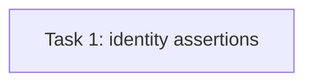

# Issue #63 Task 6 Review Fix — Acceptance Evidence

> **For agentic workers:** REQUIRED SUB-SKILL: Use superpowers:subagent-driven-development. This is a scoped repair plan for the two findings in the Task 6 review report; do not expand into production implementation.

**Goal:** Prove the exact seeded historical records survive every lifecycle exit. Review finding F1 was split into `plan-t63-task6-production-wiring.md` after confirming the same-package import constraint.

**Architecture:** Keep AC1's lifecycle HTTP scenario in the existing router lifecycle test. It retains table-count conservation and additionally checks identities and relationships of seeded records after exits. F1 is covered by a separate container-owned production-composition HTTP test.

**Tech Stack:** Go, Gin/httptest, GORM, real SQLite migrations, production container wiring.

**Spec:** `docs/specs/2026-09-20-agent-marketplace-domain-model.md` §§9–10; `CONTEXT.md` lifecycle terminology; Issue #63 AC1–AC3 in `docs/plans/issue30-sweep/issues/issue-63.md`; parent Issue #30 scope snapshot and DAG in `docs/plans/issue30-sweep/`.

## Global Constraints

- Do not change production source or weaken the lifecycle semantics.
- Preserve historical rows: exits do not delete Run, Artifact, version, Release, review, license, or lineage records.
- Keep the Unlisted-versus-Deprecated distinction and existing 409/zero-write retired-agent assertions.
- Modify only `internal/router/routes_agent_marketplace_lifecycle_test.go` in the T63 implementation worktree.
- Keep local commit authorization and do not push or merge remotely.

## Review Focus

1. AC1 proves identity preservation, not only equal aggregate row counts; assert seeded IDs and relevant foreign-key/lineage identities.
2. Keep fixtures tenant-scoped and make assertions occur after all four lifecycle exits.

## Task DAG

### Task 1: Close T63 Task 6 history-preservation finding F2

**Source:** Issue #63 AC1; independent review `task-6-review-report.md`, finding F2.
**Dependencies:** Original Task 6 commit `0d99b972eaedfaf6aa23a776e798d81d85206e57` and verified T63 Tasks 1–5.
**Role:** backend_implementer (test-only Go work).
**Owned files:** `internal/router/routes_agent_marketplace_lifecycle_test.go` only.
**Consumes:** real migration-backed DB and router/service fixture helpers.
**Produces:** stable seeded Run, Artifact, version, Release, review, license and lineage IDs retained and checked after the exit matrix.

**Implementation steps (RED → GREEN):**

1. Before the exit matrix, record the exact IDs of the seeded Run, Artifact, local Agent, Version, Release, review, license and lineage records. After all exits, query each exact row by tenant and ID and verify its identifying links (Run→Agent, Artifact→Run, Version→Agent, Release→Listing, review/license/lineage→their source identities). Retain aggregate counts as supplemental conservation checks.
2. Run targeted test first and confirm failure if row identity is not checked; implement the narrow test-only correction and rerun the focused test.

**Verification:**

- `go test ./internal/router/ -run 'TestLifecycleExitDeletesNothingAcrossGovernanceRows|TestLifecycleUnlistedAndDeprecatedRemainDistinct|TestLifecycleRetireBlocksNewWorkEndToEnd' -count=1` — all three scenarios pass through real SQLite migrations and HTTP handlers.
- `git diff --check` — clean.

**Acceptance mapping:** #63 AC1 → exact seeded row/relationship assertions plus count matrix. #63 AC2 remains covered by the existing Unlisted-versus-Deprecated scenario. #63 AC3 production-composition proof is moved to `plan-t63-task6-production-wiring.md`.

**Ruling (2026-09-28):** The router test package cannot import `internal/container`, because production `internal/container` imports `internal/router`, creating `router → container → router`. Keep this task limited to F2 and cover F1 with a separate `package container` integration test. Cost if wrong: AC3 may still pass without production gate wiring; #63 Task6 stays unverified until the follow-up plan passes.
