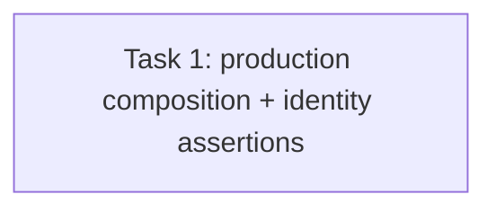

# Issue #63 Task 6 Review Fix — Acceptance Evidence

> **For agentic workers:** REQUIRED SUB-SKILL: Use superpowers:subagent-driven-development. This is a scoped repair plan for the two findings in the Task 6 review report; do not expand into production implementation.

**Goal:** Make Task 6 acceptance evidence fail if production workbench composition omits the retired-agent admission gate, and prove the exact seeded historical records survive every lifecycle exit.

**Architecture:** Keep the three AC1–AC3 HTTP acceptance scenarios in the existing router lifecycle test. AC3 must construct admission through the production container provider and exercise the HTTP handler; no test-owned copy of the gate is allowed. AC1 retains table-count conservation and additionally checks identities and relationships of seeded records after exits.

**Tech Stack:** Go, Gin/httptest, GORM, real SQLite migrations, production container wiring.

**Spec:** `docs/specs/2026-09-20-agent-marketplace-domain-model.md` §§9–10; `CONTEXT.md` lifecycle terminology; Issue #63 AC1–AC3 in `docs/plans/issue30-sweep/issues/issue-63.md`; parent Issue #30 scope snapshot and DAG in `docs/plans/issue30-sweep/`.

## Global Constraints

- Do not change production source or weaken the lifecycle semantics.
- Preserve historical rows: exits do not delete Run, Artifact, version, Release, review, license, or lineage records.
- Keep the Unlisted-versus-Deprecated distinction and existing 409/zero-write retired-agent assertions.
- Modify only `internal/router/routes_agent_marketplace_lifecycle_test.go` in the T63 implementation worktree.
- Use the production `container.NewWorkbenchAdmissionCoordinator` composition (and production dependencies) so the test fails if gate registration is removed.
- Keep local commit authorization and do not push or merge remotely.

## Review Focus

1. AC3 depends on the exact production provider path; a copied closure or manually installed gate is insufficient.
2. AC1 proves identity preservation, not only equal aggregate row counts; assert seeded IDs and relevant foreign-key/lineage identities.
3. Keep fixtures tenant-scoped and make assertions occur after all four lifecycle exits.

## Task DAG

### Task 1: Close T63 Task 6 review findings

**Source:** Issue #63 AC1 and AC3; independent review `task-6-review-report.md`, findings F1/F2.
**Dependencies:** Original Task 6 commit `0d99b972eaedfaf6aa23a776e798d81d85206e57` and verified T63 Tasks 1–5.
**Role:** backend_implementer (test-only Go work).
**Owned files:** `internal/router/routes_agent_marketplace_lifecycle_test.go` only.
**Consumes:** real migration-backed DB and router/service fixture helpers; production `container.NewWorkbenchAdmissionCoordinator` provider and its exact constructor dependencies from `internal/container/workbench.go`.
**Produces:** retired-agent HTTP test constructed with production coordinator composition; stable seeded Run, Artifact, version, Release, review, license and lineage IDs retained and checked after the exit matrix.

**Implementation steps (RED → GREEN):**

1. Remove `newRealAgentUseGate` and all direct test calls to `SetAgentUseGate` in this acceptance test.
2. Construct the workbench admission coordinator through `container.NewWorkbenchAdmissionCoordinator` using production repository/target dependencies; route the existing HTTP start handler through that coordinator. Preserve the pre-retirement 202, post-retirement 409, and zero new request/Run assertions.
3. Before the exit matrix, record the exact IDs of the seeded Run, Artifact, local Agent, Version, Release, review, license and lineage records. After all exits, query each exact row by tenant and ID and verify its identifying links (Run→Agent, Artifact→Run, Version→Agent, Release→Listing, review/license/lineage→their source identities). Retain aggregate counts as supplemental conservation checks.
4. Run targeted test first and confirm failure if the production gate provider is bypassed/removed; implement the narrow test-only correction and rerun the focused test.

**Verification:**

- `go test ./internal/router/ -run 'TestLifecycleExitDeletesNothingAcrossGovernanceRows|TestLifecycleUnlistedAndDeprecatedRemainDistinct|TestLifecycleRetireBlocksNewWorkEndToEnd' -count=1` — all three scenarios pass through real SQLite migrations and HTTP handlers.
- `go test ./internal/container/ ./internal/application/service/ ./internal/workbench/ -run 'Admission|AgentUse|Lifecycle' -count=1` — relevant production composition regressions pass (adjust only for exact existing test names; report actual command).
- `git diff --check` — clean.

**Acceptance mapping:** #63 AC1 → exact seeded row/relationship assertions plus count matrix; #63 AC2 → existing unlisted/deprecated scenario retained; #63 AC3 → production-composed coordinator with 202→retire→409 and zero-write checks.

**Failure handling:** If the production provider cannot be used from the existing router test without changing production code, add an additional container-backed HTTP fixture in the same owned test file; do not fall back to manually installing a gate. Report any unavailable external runtime separately.

