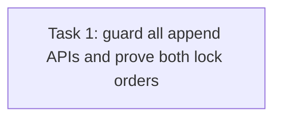

# T64 Task 6 Atomic Admission — Review Fix R2

> **For agentic workers:** REQUIRED SUB-SKILL: Use superpowers:subagent-driven-development. Steps use checkbox syntax. This plan addresses review findings T64-6-R1-1 and T64-6-R1-2 only.

**Goal:** Ensure every public repository revocation append participates in tenant admission serialization, and prove both revocation-first and admission-first orders with deterministic two-connection interleavings.

**Architecture:** Wrap `AppendReleaseRevocation` and `AppendDependencyRevocation` in the existing tenant guard. Extract transaction-scoped insert helpers so the `WithAudit` methods can share those inserts without nesting transactions. Replace sequential revocation-first assertions with the same channel/callback barrier schedule used for admission-first, and cover both release and exact dependency revocations.

**Tech Stack:** Go, GORM, file-backed SQLite, channel-controlled callback barriers.

**Spec:** Issue #64 Task 6 and approved marketplace Spec §§10–11; `plan-t64-task6-review-fix.md`; independent Review findings in `task-1-review-report.md` at checkpoint `236e2c2429f8872cebb80aea14b1632a86a98df8`.

## Global Constraints

- All revocation writes, including no-audit repository methods, use the same tenant guard as decisive admission writes.
- Keep ledger+audit atomic in `Append*RevocationWithAudit`; do not nest transactions.
- Use file-backed SQLite and separate concurrent transaction connections; do not use sleeps or in-process locks to establish ordering.
- Preserve the exact dependency tuple `(type,id,version,digest)` and the four decisive admission operations.
- Local commit is authorized; do not push or alter Issues.

## Review Focus

1. A direct append cannot commit between admission's authoritative security check and its decisive write.
2. A revocation that holds the guard first commits before the waiting admission proceeds, and that admission observes the revocation and fails closed.
3. The same invariant holds for release and dependency revocations and preserves audited rollback behavior.

## Task DAG

### Task 1: Guard public append paths and deterministically prove order

**Source:** Issue #64 Task 6; R1 review findings T64-6-R1-1 and T64-6-R1-2.
**Dependencies:** R1 checkpoint `236e2c2429f8872cebb80aea14b1632a86a98df8`.
**Role:** backend_implementer.
**Owned files:**

- `internal/application/repository/agent_security.go`
- `internal/application/repository/agent_security_test.go`

**Consumes:** `withTenantSecurityGuard(ctx, db, tenantID, callback)`, `tenantGuardBarrierKey`, `tenantGuardAttemptKey`, `installTenantGuardBarrier`, `installTenantGuardAttemptBarrier`, `openRunTestDB`, and the guarded admission repository methods.
**Produces:** guarded `AppendReleaseRevocation` and `AppendDependencyRevocation`; transaction-scoped insert helpers reused by their audited counterparts; channel-controlled tests for both lock orders on release and exact dependency revocations.

- [ ] Extract private `appendReleaseRevocationTx(tx, row)` and `appendDependencyRevocationTx(tx, row)` insert helpers that validate/prepare and create rows on the supplied transaction.
- [ ] Implement the public no-audit Append methods using `withTenantSecurityGuard` and the matching helper.
- [ ] Change each WithAudit method to acquire one guard, insert through its helper, and write audit in the same transaction; do not call the public guarded method from inside the transaction.
- [ ] In `TestTenantSecurityGuardSerializesDecisiveWriteFamilies`, replace the sequential `revocation-first` branch for all four families with a concurrent schedule: use `installTenantGuardBarrier` on the revocation table's Create callback; start the writer and wait until it has acquired the tenant guard; start the selected admission with `installTenantGuardAttemptBarrier`; wait for the second transaction's SQLite tenant-guard attempt; release the revocation insert and wait for commit; release admission so it resumes and assert the decisive write returns `ErrAgentSecurityReleaseBlocked`.
- [ ] Add `TestAppendDependencyRevocationSerializesAgainstAdmission` with an exact `(skill, weather, 1.2.3, sha256:abc)` lock; use the same independent-connection barrier protocol for admission-first and revocation-first, calling the public no-audit `AppendDependencyRevocation` method.
- [ ] Use the public no-audit `AppendReleaseRevocation` method for the release revocation-first matrix; keep audited append for the admission-first matrix. Keep both existing WithAudit atomicity rollback tests. Set the SQLite pool to at least two connections in these concurrent tests and use no sleeps.
- [ ] Run `go test ./internal/application/repository/ -run '^(TestTenantSecurityGuardSerializesDecisiveWriteFamilies|TestAgentSecurityStoreAppendAndListKeepsHistoryTenantScoped|TestTransactionAdmissionMatchesCompleteDependencyTuple|TestAgentSecurityStoreAppendReleaseAndAuditRollsBackTogether|TestAgentSecurityStoreAppendDependencyAndAuditRollsBackTogether)$' -count=10 -timeout=180s`.
- [ ] Run `go test ./internal/application/repository/ ./internal/application/service/ -count=1`, `go build ./...`, and `git diff --check`.
- [ ] Commit only the two owned files and write `.superpowers/sdd/plan-t64-task6-review-fix-r2/task-1-report.md`.

**Acceptance mapping:** #64 revocation/admission serialization → both direct and audited revocation append APIs share the tenant lock; all four decisive write families observe deterministic revocation-first and admission-first schedules.

**Failure handling:** If SQLite cannot expose the driver's lock wait deterministically, retain the callback barrier proof of ordering and state precisely what boundary it observes; do not replace it with elapsed-time assumptions. PostgreSQL runtime remains a separate environment limitation.
