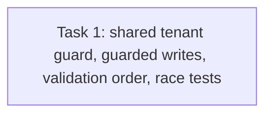

# Issue #64 Task 6 Review Fix — Atomic Governance Admission

> **For agentic workers:** REQUIRED SUB-SKILL: Use superpowers:subagent-driven-development. This scoped repair plan addresses both Task 6 review findings and the architectural ruling. Keep changes within the owned service/repository files listed below.

**Goal:** Preserve listing authorization/error boundaries and ensure release revocation and a governance use that writes adoption/variant/publication/accepted-proposal state have a deterministic commit order.

**Architecture:** Services validate explicit release membership before security adjudication. The service-level security gate remains for fast feedback. Repository write operations acquire a tenant-scoped database serialization guard, query release/dependency revocation state in the same transaction, and perform the decisive write before releasing that guard. Revocation append+audit transactions acquire the same tenant guard. PostgreSQL uses a tenant row `FOR UPDATE`; SQLite uses a no-op tenant-row `UPDATE` as its first write statement. Never hold the guard across remote/service calls. Publication checks again at its final published-state CAS; upgrade acceptance checks within the proposal transition transaction.

**Tech Stack:** Go, GORM transactions, SQLite concurrency tests, existing PostgreSQL-capable GORM path.

**Spec:** `docs/specs/2026-09-20-agent-marketplace-domain-model.md` §§10–11; `CONTEXT.md` security revocation and marketplace lifecycle; Issue #64 acceptance in `docs/plans/issue30-sweep/issues/issue-64.md`; original `plan-t64.md` Task 6; architecture ruling in `B6-execution-ledger.md`.

## Global Constraints

- The commit-order invariant is authoritative: a governance write that commits before revocation may succeed; once revocation commits, any later decisive adoption, variant, publication, or proposal-acceptance write must fail closed.
- Keep tenant isolation and the exact dependency identity tuple `(type,id,version,digest)`.
- Keep audit and revocation ledger atomic. All revocation transactions use the same tenant lock helper as admission transactions.
- Do not use process mutexes, release-only locks, raw DB handles in service APIs, or hold locks over unrelated/external calls.
- Preserve existing deprecation checks and nil-gate compatibility.
- Validate explicit release membership before invoking `ReleaseAdmission`; do not disclose security state for invalid or cross-listing release identifiers.
- Local commit is authorized; no push, remote merge, deployment, or issue mutation.

## Review Focus

1. Both lock acquisition orders must serialize across independent DB connections; an in-process mutex is not evidence.
2. Tenant guard exists and is acquired in a dialect-correct way; SQLite guard is the first transactional write and verifies the tenant row exists.
3. Admission decision and decisive repository write share one transaction. Revocation ledger plus audit share a transaction under the same guard.
4. Adopt/CreateVariant return the established invalid-input error for missing, foreign, or wrong-listing explicit release IDs before any security verdict.
5. PublishVariant does not hold a transaction across Agent/version/service calls; its final publish CAS performs the authoritative guarded check. Any allowed orphan behavior is explicitly tested/documented.
6. AcceptUpgradeProposal's accepted transition is guarded; no acceptance can commit after revocation.

## Task DAG

### Task 1: Implement the shared tenant-scoped revocation/admission guard

**Source:** Issue #64 acceptance; Task 6 review findings R1/R2; architect ruling dated 2026-09-28.
**Dependencies:** Verified T63 Task 3 lifecycle predicates and T64 Tasks 1–5 security store/revocation operations.
**Role:** backend_implementer.
**Owned files:**

- `internal/application/service/agent_adoption.go`
- `internal/application/service/agent_upgrade.go`
- `internal/application/service/agent_security_guard_test.go`
- `internal/application/repository/agent_adoption.go` and repository tests
- `internal/application/repository/agent_upgrade.go` and repository tests
- `internal/application/repository/agent_security.go` and repository tests
- A new shared repository helper file only if needed for the tenant transaction guard.

**Consumes:** existing `ReleaseAdmission` interface and verdict/error definitions from `internal/application/repository/agent_security.go`; existing repository methods `AdoptListing`, `CreateVariant`, `UpdateVariantState`, `TransitionProposal`; existing `TenantEntity` table and `NewAuditLogRepository(tx)`.
**Produces:** one repository-owned transaction helper that acquires and verifies the tenant serialization row; guarded authoritative release/dependency admission at the decisive write boundary; revocation append+audit path sharing that lock; service validation-order correction.

**Required behavior and concrete interface constraints:**

- Add a tenant-scoped transactional helper that receives `ctx`, `tenantID`, and a callback receiving the transaction-scoped `*gorm.DB`. PostgreSQL must execute `SELECT id FROM tenants WHERE id=? FOR UPDATE`; SQLite must issue `UPDATE tenants SET id=id WHERE id=?` before any other query/write and require exactly one affected row. Missing tenant returns the existing tenant/not-found error. Other supported dialects must use a safe equivalent or fail closed with a clear unsupported-dialect error.
- Add a transaction-scoped security admission query against the same transaction handle, checking the release revocation and every exact dependency-lock tuple. The helper must not use the injected service gate's separately held DB connection for the authoritative decision.
- `AdoptListing` and `CreateVariant`: in the same guarded transaction, recheck security and perform the decisive insert. Preserve existing errors and tenant predicates.
- Final local publication state transition: use `UpdateVariantState` (or a purpose-specific repository operation) to recheck security and perform the final transition to `published` under the guard. Earlier Agent/Version creation may remain if revocation wins; do not hold the tenant lock over those calls, and document/test this compensation boundary.
- Upgrade proposal acceptance: guard the `accepted` transition and evaluate the proposal's destination release in the same transaction. If the draft was created before revocation but acceptance loses the race, leave the draft intact and reject the proposal transition.
- `AppendReleaseRevocationWithAudit` and `AppendDependencyRevocationWithAudit` (or existing typed equivalents) must acquire the same tenant helper around ledger+audit writes. Preserve their atomic rollback guarantees.
- In `Adopt` and `CreateVariant`, resolve the explicit Release tenant-scoped and verify `ListingID` before calling `ReleaseAdmission`; retain deprecation checks and existing error mapping.

**RED → GREEN / tests:**

1. Add file-backed SQLite tests using two independent DB connections and channel-controlled interleavings for each decisive write family. Verify lock-first admission commits, then revocation; revocation-first commits, then admission is rejected. Cover adoption, variant creation, final publish CAS, and proposal acceptance.
2. Add release-scope tests with a real gate for missing ID, foreign-tenant ID, same-tenant wrong-listing ID, and valid blocked release. Invalid IDs must return the prior invalid-input/not-found result without exposing a revocation reason.
3. Add tenant-lock tests for missing tenant, and verify audit+ledger rollback still holds under revocation path.
4. Run RED tests against the current separate-check implementation and observe the race/boundary failure; implement, then rerun to GREEN.

**Verification:**

- Targeted repository tests for adoption, upgrade, security and guard races with `-count=10` for deterministic interleavings.
- Targeted service tests for adoption/upgrade/security guard.
- `go test ./internal/application/repository/ ./internal/application/service/ -count=1`.
- `go build ./...`.
- `git diff --check`.
- PostgreSQL runtime is not available in the current local environment; if unavailable, report that explicitly and retain dialect-specific SQL tests or query-construction coverage. Do not claim PostgreSQL concurrency runtime verification.

**Acceptance mapping:** #64 Task 6 service gate coverage → guarded repository writes; security revocation semantics → shared tenant serialization point and exact dependency tuple; authorization/error boundary → release membership checks before adjudication; audit atomicity → shared guard with same-transaction ledger+audit.

**Failure handling:** Do not replace the shared DB guard with per-process synchronization. If a production dialect cannot supply a safe guard, fail closed and record the unsupported path; continue completing the SQLite/PostgreSQL paths and report exact limitation. Keep prior T64 service-only commit in history; repair is additive and independently reviewed.

