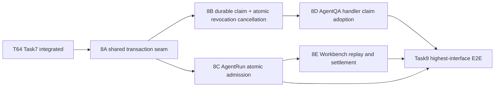

# T64 Task 8 Atomic Admission Implementation Plan

> **For agentic workers:** REQUIRED SUB-SKILL: Use superpowers:subagent-driven-development to implement each checkpoint. Every checkpoint has its own isolated worktree, Task Brief, review package, independent review and validation. Checkboxes track only that checkpoint's work.

**Goal:** Make revoked Release and exact dependency decisions atomic with new Agent Run and AgentQA turn admission while preserving existing replay, retirement, tenant isolation, and historical records.

**Architecture:** Two serial prerequisites establish (1) an exact Version-bound Variant/Release transaction guard and (2) durable AgentQA claim identity plus atomic cancellation from the revocation transaction. Once these contracts are integrated, Run admission and AgentQA handler adoption can proceed in disjoint worktrees. Workbench composition follows Run admission because pending settlement depends on its authoritative result. Task9 follows all verified streams. Durable transactions end before storage, parsing, budget/network calls, Redis, model execution, or SSE.

**Tech Stack:** Go, GORM, Gin, SQLite and PostgreSQL migrations, existing `AgentRunStore`, workbench `AdmissionCoordinator`, Agent Marketplace security service, AgentQA handler, and StreamManager/EventBus.

**Spec:** `docs/specs/2026-09-20-agent-marketplace-domain-model.md` §10–11; Issue snapshot `docs/plans/issue30-sweep/issues/issue-64.md`; parent acceptance `docs/plans/issue30-sweep/issues/issue-30.md`; implementation parent `docs/plans/issue30-sweep/plans/plan-t64.md` Task 8; proposed decision `docs/adr/0015-agent-security-transactional-admission.md`; preflight `docs/plans/issue30-sweep/evidence/t64-task7-task8-preflight.md`.

## Global Constraints

- A Security Revoked Release blocks new use and retains history. A Dependency Security Blocked Release remains blocked until a new Release locks safe dependencies.
- A Release dependency is identified by exact `(type, id, version, digest)`; do not substitute by name, version, or digest.
- A previously admitted workbench request retains its existing idempotent replay result.
- `RetireVariant` continues to block new work through the existing lifecycle gate.
- Revocation `cancel` terminates applicable in-flight work; `allow` permits work admitted before revocation to finish.
- Tenant isolation is enforced on every read, write, claim transition, and cancellation query.
- Historical messages, Runs, Release records, dependency locks, and revocation ledger rows are retained.
- Do not hold a tenant database lock during attachment storage/extraction, budget/network work, Redis, model calls, or SSE.
- No push, merge, publish, deploy, GitHub Issue edit, or Issue closure.
- Paired migration heads at planning time: SQLite `000125`, versioned/PostgreSQL `000204`; re-read both heads before claiming `000126` and `000205`.

## Review Focus

- Existing request replay after revocation returns the same admitted Run and creates no second Run — Checkpoint 8E.
- Revocation commits before new Run/claim admission, causing fail-closed refusal; admission commits first, making the in-flight disposition explicit — Checkpoint 8C and 8D.
- Same-name dependency with a different version or digest is not substituted — Checkpoint 8A transaction seam.
- Both AgentQA quick-answer and agent mode reject before image/file persistence, message writes, live-run allocation, or SSE — Checkpoint 8D.
- Revocation cancellation survives stop-notification loss and only affects matching tenant/Release/message; `allow` and unrelated Releases continue — Checkpoints 8B and 8D.

---

## File ownership map and schedule

| Checkpoint | Files | Dependency |
|---|---|---|
| 8A — exact Version-aware shared transaction guard | `internal/application/repository/agent_security_guard.go`, `agent_security_guard_test.go` | T64 Task7 reviewed and integrated |
| 8B — durable claim schema and atomic revocation cancellation contract | paired migration files; new claim entity/repository files and tests; `internal/database/migration_sqlite_versioned_schema_test.go`; `internal/application/repository/agent_security.go`; `internal/application/service/agent_security.go` and tests; Task7 `internal/container/agent_security.go`; `internal/container/container.go` | 8A reviewed and integrated |
| 8C — atomic Run admission | `internal/application/repository/agent_run.go`, `internal/modules/agentruntime/agent/runtime/contracts.go`, new `agent_run_security_admission_test.go`, and narrowly scoped Run tests only if required | 8A and 8B reviewed and integrated |
| 8D — AgentQA handler claim adoption | session `handler.go`, `qa.go`, `helpers.go`, new `agent_security_claim.go` and tests; no Container wiring | 8A and 8B reviewed and integrated |
| 8E — workbench request composition and settlement | `internal/modules/workbench/service/workbench/admission.go`, new `admission_agent_security_test.go`, `internal/container/workbench.go`, `internal/handler/session/workbench_start.go` | 8C reviewed and integrated; may run beside 8D |

8A then 8B are serial prerequisites. Once both are reviewed, validated and integrated, dispatch 8C (Run admission) and 8D (AgentQA handler) concurrently in separate managed worktrees; their owned files do not overlap. After 8C is reviewed, validated and integrated, dispatch 8E from the integrated 8B+8C base while 8D may still be under review, validation or integration: 8E owns separate Workbench files and consumes the authoritative Run result. Before dispatch, verify the test suites use isolated databases and no fixed shared ports or mutable external services; serialize only any test command that shares such a resource. Integrate 8C, 8E and 8D in that order (8D can be integrated before or after 8E after both pass gates) and rerun affected package checks. Task9 remains downstream of verified/integrated 8C–8E.

## Shared interfaces

Checkpoint 8A produces this repository seam in `internal/application/repository/agent_security_guard.go`:

```go
func checkLocalAgentReleaseAdmissionTx(tx *gorm.DB, sourceTenantID uint64, localAgentID, localAgentVersionID string) (releaseID string, adopted bool, err error)
```

The caller must hold the ordered tenant guard transaction for source tenant (and session tenant when different). The helper resolves exactly one published Variant matching both `localAgentID` and the server-derived immutable `localAgentVersionID`; it checks the fixed Release and exact dependency lock through `checkReleaseAdmissionTx`. A mismatched, stale, unpublished, or ambiguous adoption association fails closed. `adopted=false` is reserved for a confirmed non-Marketplace Agent, not a failed association lookup. Callers freeze the selected Version ID with the admitted Run or claim. It never selects by display name or current catalog pointer.

8B adds `AgentSecurityService.ResolvePublishedAgentVersion(ctx, sourceTenantID, localAgentID) (snapshot interfaces.AgentVersionSnapshot, releaseID string, adopted bool, err error)` for Workbench binding. It returns the published Variant's immutable Version snapshot after verifying tenant and Agent identity; it never accepts Version ID from JSON. A confirmed non-Marketplace Agent returns an empty snapshot and `adopted=false`; ambiguous/stale Marketplace associations fail closed. 8E stores `snapshot.AgentVersionView.ID` in `TrustedAdmissionBinding` and the immutable Run snapshot. AgentQA does not pre-resolve the current Version: `AgentChatTurnClaimStore.Admit` looks up a replay before resolving a new Variant, so retries return their originally pinned Version even after catalog changes. For a new claim, it resolves/checks the published Variant Version inside the guard transaction, persists that exact Version ID, and 8D loads that immutable snapshot with `AgentVersionService.GetAgentVersion` for execution. This keeps replay identity and execution pinned to the same Version.

Checkpoint 8C adds the trusted `LocalAgentVersionID string` field to `agentruntime.Admission`; it is set from the server-owned snapshot by 8E, never from `StartInput`. The repository guard verifies that this exact ID still matches the published Variant selected at admission. A retry resolves the existing Run before the Version check and returns its original snapshot. In 8E, `TrustedAdmissionBinding.LocalAgentVersionID` is populated using the security service, and `NewWorkbenchAdmissionCoordinator` receives that service through DI while preserving its existing `adoptions` parameter and `SetAgentUseGate` lifecycle guard. `AgentRunStore.Admit` resolves the existing request replay first, then checks the exact Version/Variant/Release before reserving a session slot or writing a Run/message row. It persists the Version ID in `agent_runs.snapshot`. Lifecycle retirement remains checked in the same transaction. 8C's repository tests supply that field directly; the Workbench caller begins supplying it when 8E is integrated.

Checkpoint 8E may keep the existing `AgentSecurityGate` fast refusal in `AdmissionCoordinator`, but the repository transaction in 8C is authoritative. It preserves admitted/dispatching/rejected replay ahead of the security fast gate and uses `settleDeniedPending` for an unadmitted pending request so reservation release is single-winner.

Checkpoint 8B produces a durable claim store. The claim identity is `(session_tenant_id, session_id, owner_id, request_id)` and stores a canonical request hash, server-generated assistant message ID, source tenant, local Agent Version, pinned Release, state, lease owner/expiry, and monotonically increasing fencing generation. For an adopted Agent both `local_agent_version_id` and `release_id` are required. For a confirmed non-Marketplace Agent both are NULL and QA continues using the current authorized CustomAgent configuration; the database check requires the two fields to be both NULL or both non-NULL. Claim creation and assistant placeholder insertion occur in one transaction, removing the pre-message Stop race. A retry with the same key and hash returns the existing claim; a changed hash conflicts; a terminal claim never restarts generation. Each message/model continuation and terminal write must CAS against the current generation. Expiry fences the old worker and terminalizes any orphan placeholder before a new request may start. Exact DDL and interface fields are specified in 8B below.

The repository exposes:

```go
type AgentChatTurnClaimStore interface {
    Admit(ctx context.Context, in AgentChatTurnClaimInput) (AgentChatTurnClaim, ReplayState, error)
    Renew(ctx context.Context, sourceTenantID uint64, claimID string, generation uint64, leaseOwner string) error
    Get(ctx context.Context, sourceTenantID uint64, claimID string) (AgentChatTurnClaim, error)
    Finish(ctx context.Context, sourceTenantID uint64, claimID string, generation uint64, leaseOwner, terminalState, reason string) (bool, error)
    FinishAssistantMessage(ctx context.Context, sourceTenantID uint64, claimID string, generation uint64, leaseOwner string, message *types.Message, terminalState, reason string) (bool, error)
    CreateUserMessage(ctx context.Context, sourceTenantID uint64, claimID string, generation uint64, leaseOwner string, message *types.Message) error
    UpdateMessage(ctx context.Context, sourceTenantID uint64, claimID string, generation uint64, leaseOwner string, message *types.Message) error
    CancelByOwner(ctx context.Context, sessionTenantID uint64, sessionID, ownerID, assistantMessageID, reason string) (AgentChatTurnClaim, bool, error)
}
```

`AgentChatTurnClaimInput` contains server-derived `SourceTenantID`, `SessionTenantID`, `SessionID`, `OwnerID`, `RequestID`, canonical `RequestHash`, per-handler `LeaseOwner`, and authorized `AgentID`; it does not accept Version ID or assistant ID. `Admit` first returns an existing same-key/same-hash claim (changed hash conflicts), then for a new request resolves the published Variant and exact Version under the guard, calls 8A, and persists that Version. It returns `(claim, ReplayState, error)` only; same-session expired claims and their placeholders are terminalized internally in the transaction. Admission revalidates session owner and, for cross-tenant Agents, the exact `agent_shares` row plus active `organization_tenant_members` row under lock. A new `withTenantSecurityGuards` helper deduplicates source/session tenant IDs, sorts ascending, acquires each guard in one DB transaction, then runs the callback. Only after both guards does it lock/revalidate the session, grant, Variant, and claim rows. Run admission uses the existing single-tenant guard because its source and session tenant are identical.

Revocation appends audit and marks exact affected active claims `cancelled` in the same source-tenant transaction; repository methods are `AppendReleaseRevocationWithAuditAndCancelClaims` and `AppendDependencyRevocationWithAuditAndCancelClaims`, returning committed notification targets. Dependency revocation selects Releases whose lock contains the exact `(type,id,version,digest)` tuple inside that transaction. An update error rolls back ledger, audit, and claim state. Only after commit does service notify handlers. `allow` leaves current claims running, while a later applicable `cancel` wins. Stop/Finish/expiry compete through one `WHERE state='active' AND generation=? AND lease_owner=?` CAS; only one transition wins. Handler progress, user-message creation, assistant-message updates, and finalization use claim-store repository methods that update the claim/message rows in one DB transaction; a prior Renew/Get check cannot authorize a later standalone `MessageService.UpdateMessage`. `CancelByOwner` is separate from handler `Finish`: it locates a claim by session tenant/session/assistant message, then revalidates session owner under ordered tenant guards and atomically marks claim+assistant placeholder cancelled before Stop sends its event. If no claim exists, Stop keeps the existing non-AgentQA behavior. The handler renews every 10 seconds against a 30-second lease from a heartbeat goroutine, including while a provider/tool call is blocked. Renewal failure cancels local execution; subsequent external steps do not start and DB writes remain generation-fenced. `Admit` performs a bounded sweep of expired claims for the target session and terminalizes their assistant placeholders. No recovery path restarts generation; a retry under a terminal claim key/hash returns its terminal state/conflict and a new explicit turn needs a new request ID. A watcher recovers lost stop notifications.

## Checkpoint 8A: shared transactional Variant/Release predicate

### Files

- Modify: `internal/application/repository/agent_security_guard.go`
- Modify: `internal/application/repository/agent_security_guard_test.go`

### RED → GREEN

- [ ] Add table-driven `TestCheckLocalAgentReleaseAdmissionTx`: only an explicit confirmed non-Marketplace classification returns `adopted=false`; one active published Variant returns its fixed Release; missing/mismatched Version association, retired/draft Variant, revoked Release returns `ErrAgentSecurityReleaseBlocked`; exact dependency tuple is blocked; different version and same version/different digest remain allowed; two eligible local mappings fail closed.
- [ ] Run `go test ./internal/application/repository -run '^TestCheckLocalAgentReleaseAdmissionTx$' -count=1`; expected initial compile failure because the helper is undefined.
- [ ] Implement the helper using the caller's transaction only. Lock matching Variant rows deterministically before reading state; never open a nested transaction and never use a service-level verdict read.
- [ ] Run the focused test, existing `TestTenantSecurityGuardSerializesDecisiveWriteFamilies`, and `git diff --check`; expect all pass.
- [ ] Commit only the two owned files. Record BASE, HEAD, and complete diff digest in the Task report.

### Acceptance

One shared in-transaction predicate exists and returns deterministic fail-closed outcomes. No schema change. Its exact outputs are consumed by 8B, 8C, and 8D.

## Checkpoint 8C: atomic Agent Run admission

### Files

- Modify: `internal/application/repository/agent_run.go`
- Modify: `internal/modules/agentruntime/agent/runtime/contracts.go`
- Create: `internal/application/repository/agent_run_security_admission_test.go`

### Consumes / Produces

- Consumes 8A `checkLocalAgentReleaseAdmissionTx` and existing `withTenantSecurityGuard`.
- Produces the same public `AgentRunStore.Admit(context.Context, agentruntime.Admission) (agentruntime.Run, error)` signature; revocation and Run admission serialize on one tenant guard.

### RED → GREEN

- [ ] Add deterministic barrier tests `TestAgentRunAdmitSerializesAgainstReleaseRevocationBothOrders` and `TestAgentRunAdmitSerializesAgainstExactDependencyRevocationBothOrders`. Assert revocation-first rejects with `ErrAgentSecurityReleaseBlocked`, admission-first commits exactly one Run, and neither schedule deadlocks.
- [ ] Add `TestAgentRunAdmitReplaysExistingRunAfterRevocation`: first admit succeeds; revoke; same tenant/owner/request/hash returns the same Run; mismatched hash remains `ErrConflict`.
- [ ] Add `TestAgentRunAdmitSecurityDenialPreservesRetirementGateAndWritesNothing`: retirement still denies; security denial leaves no Run, active session slot, or new messages.
- [ ] Run `go test ./internal/application/repository -run '^TestAgentRunAdmit(Security|ReplaysExistingRun)' -count=1`; expected initial failure because Admit does not call the security seam.
- [ ] Refactor `AgentRunStore.Admit` to acquire the tenant guard before session/request/Variant/Run rows. Inside the transaction, resolve session scope, return an idempotent existing Run before a new-use security decision, call 8A for new Marketplace work, retain the retirement row lock/check, and only then reserve the session slot and create the Run/messages.
- [ ] Run those tests with `-count=10`, existing `TestAgentRunConcurrentClaim`, `TestTenantSecurityGuardSerializesDecisiveWriteFamilies`, repository package tests, `go build ./...`, and `git diff --check`; expect all pass.
- [ ] Commit only the owned repository files and record exact test outputs/HEAD.

### Failure handling

If a schedule fails, use its lock barrier transcript to identify the inverse lock acquisition before changing any code. Do not weaken tenant serialization or update the session slot outside the transaction.

## Checkpoint 8E: workbench replay, guard and denial settlement

### Files

- Modify: `internal/modules/workbench/service/workbench/admission.go`
- Create: `internal/modules/workbench/service/workbench/admission_agent_security_test.go`
- Modify: `internal/container/workbench.go`
- Modify: `internal/handler/session/workbench_start.go`

### Consumes / Produces

- Consumes the already existing Task7 `AgentSecurityService.VerdictForAgent` behavior and the existing `settleDeniedPending` / `resumeExisting` request state machinery.
- Produces a nil-safe `SetAgentSecurityGate(gate AgentSecurityGate)` seam and `ErrAgentSecurityBlocked` denial classification without changing request IDs, request hash, request states, or Run APIs.

### RED → GREEN

- [ ] Add `TestAdmissionAgentSecurityReplayAfterRevocationReturnsExistingRun`: first request admits; revoke the fixed Release; retry same identity/hash returns original Run and creates no second Run.
- [ ] Add `TestAdmissionAgentSecurityBlockedBeforeNewPendingIntent`: a new blocked request creates no pending request, Run, or message.
- [ ] Add `TestAdmissionAgentSecurityRejectsPendingAndReleasesReservationExactlyOnce`: seed pending intent/reservation; race two retries against a blocked verdict; exactly one pending→rejected transition releases the reservation, while committed replay wins if Run admission completed.
- [ ] Add fail-closed infrastructure error coverage with no new durable request.
- [ ] Run the new tests; expected compile failure until gate setter/error are added.
- [ ] Implement the fast refusal only after request hash and existing admitted/dispatching/rejected replay; for a pending request call `settleDeniedPending`. Keep the 8C repository guard authoritative against revocation racing the fast check. Preserve `SetAgentUseGate` and the constructor's `adoptions` parameter.
- [ ] Extend workbench error mapping to HTTP 409 for security refusal. Keep infrastructure errors as the existing 500 path. Wire the existing `AgentSecurityService` in `container/workbench.go` without dropping lifecycle wiring.
- [ ] Run focused `TestAdmissionAgentSecurity`, existing admission idempotency/concurrency suites, `go test ./internal/container/ -run TestAgentSecurityWiringRegistered -count=1`, `go test ./internal/handler/session/ -run TestWorkbenchStart -count=1`, `go build ./...`, and `git diff --check`; expect all pass.
- [ ] Commit only the owned files and record exact outputs/HEAD.

## Checkpoint 8B: durable claim schema/store and atomic revocation cancellation

### Storage contract

Recheck migration heads immediately before editing. Create paired `000126_agent_chat_turn_claims.{up,down}.sql` and `000205_agent_chat_turn_claims.{up,down}.sql` only if free. PostgreSQL columns: `id VARCHAR(36) NOT NULL`, `source_tenant_id BIGINT NOT NULL`, `session_tenant_id BIGINT NOT NULL`, `session_id VARCHAR(36) NOT NULL`, `owner_id VARCHAR(36) NOT NULL`, `request_id VARCHAR(128) NOT NULL`, `request_hash CHAR(64) NOT NULL`, `assistant_message_id VARCHAR(36) NOT NULL`, `agent_id VARCHAR(36) NOT NULL`, nullable `local_agent_version_id VARCHAR(36)`, nullable `release_id VARCHAR(36)`, `state VARCHAR(16) NOT NULL`, nullable `cancel_reason TEXT`, `lease_owner VARCHAR(36) NOT NULL`, `generation BIGINT NOT NULL`, `lease_expires_at TIMESTAMPTZ NOT NULL`, `created_at TIMESTAMPTZ NOT NULL`, `updated_at TIMESTAMPTZ NOT NULL`; SQLite uses matching `TEXT` IDs/hash/state, `INTEGER` tenants/generation, nullable `TEXT` version/release/cancel fields, and `DATETIME` timestamps. Primary key `(id, source_tenant_id)`; unique `(session_tenant_id, session_id, owner_id, request_id)` and `(session_tenant_id, assistant_message_id)`; indexes `(source_tenant_id, state, release_id)` and `(session_tenant_id, session_id, owner_id, request_id)`; `CHECK state IN ('active','cancelled','completed','failed')`; `CHECK ((local_agent_version_id IS NULL) = (release_id IS NULL))`; no cascading deletes. Store every lookup/update with both claim ID and source tenant. ``Admit` receives server-resolved source/session tenant, owner, request ID and hash, per-handler lease owner, and Agent ID; it resolves Version under lock and atomically generates assistant ID, inserts claim and assistant placeholder. Same key/hash returns prior claim and assistant ID; same key with changed hash conflicts. Expired claims become failed and their placeholder is completed with an expiry error before a new explicit request proceeds. The handler renews every 10 seconds against a 30-second lease, including during blocked provider/tool calls; renewal failure cancels local execution and fences subsequent writes. Admission performs a bounded expired-claim sweep for the target session. No recovery path restarts generation.

### Files

- Create: `migrations/sqlite/000126_agent_chat_turn_claims.up.sql`, `.down.sql`
- Create: `migrations/versioned/000205_agent_chat_turn_claims.up.sql`, `.down.sql`
- Create: `internal/types/agent_chat_turn_claim.go`
- Create: `internal/application/repository/agent_chat_turn_claim.go`, `agent_chat_turn_claim_test.go`
- Modify: `internal/application/repository/agent_security.go`, `agent_security_test.go`
- Modify: `internal/application/service/agent_security.go`, `agent_security_test.go`
- Modify: `internal/database/migration_sqlite_versioned_schema_test.go`
- Modify: Task7 `internal/container/agent_security.go` and `internal/container/container.go` to register the claim store/service; do not modify session handler files in this checkpoint. Their owner is 8D.

### Consumes / Produces

- Consumes 8A guarded Variant/Release predicate; Task7 `AgentSecurityService`; current `resolveAgent` authorized source scope; `effectiveTenantID` for shared Agents and `session.TenantID` for tenant-local Agents; existing StopSession message-specific event path.
- Produces repository methods matching the shared interface above, the claim lifecycle service and Container providers, and an idempotent claim state transition. It does not change HTTP handlers.

### RED → GREEN

- [ ] Add repository tests `TestAgentChatTurnClaimAdmitUsesOrderedTenantGuards`, `TestAgentChatTurnClaimIsTenantScopedAndIdempotent`, `TestAgentChatTurnClaimCancelMatchesOnlyPinnedReleases`, and `TestAgentChatTurnClaimTerminalTransitionIsSingleWinner`. Use migrated SQLite databases isolated per test.
- [ ] Test repository replay, changed-hash conflict, both tenant-lock numeric orders, share revocation between resolution and claim, generation fencing, same-session expiry cleanup, atomic Release/dependency cancellation and rollback. In this checkpoint modify `internal/database/migration_sqlite_versioned_schema_test.go` to assert columns, both uniqueness constraints, indexes, fresh SQLite head, down/up round trip, and migration version uniqueness. Expected RED until schema/store/service wiring exists.
- [ ] Implement `withTenantSecurityGuards` as one transaction that deduplicates/sorts IDs and acquires both guards ascending, then revalidates session owner and shared-Agent grant. Add tests for both numeric orders and grant removal between request resolution and claim admission.
- [ ] Implement claim migration/entity/store and `AgentSecurityService.ResolvePublishedAgentVersion`. `Admit` revalidates owner/share under the ordered guards, calls 8A with exact Version, inserts claim plus assistant placeholder, and handles replay/expired target-session claims. It returns no claim or placeholder on blocked admission or infrastructure failure. Reads/transitions constrain source tenant, claim ID, expected generation and state. The resolver returns the published Variant Version plus `AgentVersionService.GetAgentVersion` snapshot after verifying tenant and Agent binding.
- [ ] Implement `Renew`, generation-fenced `Finish`, same-session expiry cleanup and exact Release/dependency cancellation. Add `AppendReleaseRevocationWithAuditAndCancelClaims` and `AppendDependencyRevocationWithAuditAndCancelClaims`; each atomically appends revocation+audit and, for `cancel`, updates affected claims and returns notification targets. Dependency Release selection matches exact `(type,id,version,digest)` inside that transaction. Any claim update error rolls back revocation and audit. Service sends notifications only after commit. Existing Run cancellation remains its current post-commit action. `allow` leaves claims active; a later applicable `cancel` wins. Test rollback and crash-after-commit notification recovery for both revocation forms.
- [ ] Recheck migration heads immediately before creating `000126`/`000205`; assert all claim columns, unique/index constraints, fresh SQLite head and down/up round trip. Run migration version uniqueness.
- [ ] Run focused repository, migration and service tests, existing revocation tests, full owning package suites serially, `go build ./...`, and `git diff --check`; expect all pass.
- [ ] Commit only owned migration/storage/service/DI files; record exact outputs, migration IDs and source-scope evidence.

### Checkpoint 8D: AgentQA handler claim adoption (dispatch after 8B; parallel with 8C)

Files: session `handler.go`, `qa.go`, `helpers.go`, `stream.go`, new `agent_security_claim.go` and its tests; Swagger annotation edits in `qa.go` regenerate `docs/swagger.yaml`, `docs/swagger.json`, and `docs/docs.go` with `make docs`. Task7-verified `internal/container/container.go` is owned by 8B for claim-store providers; 8D does not edit it. Do not edit repository/service/migration files owned by 8B or Run-store files owned by 8C.

Consumes: 8A exact Version-bound security guard; 8B claim store/service contract; Task7 Stop route and message-specific signaling.

### RED → GREEN

- [ ] Add zero-side-effect tests for blocked quick-answer and agent modes; shared-Agent source tenant and Version binding; claim revocation/allow behavior; stale-generation message write refusal; and cleanup after claim failure. Assert no upload processing, user/assistant messages, live marker or SSE bytes before blocked rejection.
- [ ] Refactor AgentQA parsing into side-effect-free resolution and explicit post-claim attachment processing. Preserve KnowledgeQA behavior. Blocked/invalid admission creates no messages or other side effects. On success, use the assistant placeholder ID atomically inserted by 8B; only then process attachments and create the user message. Refactor `createTurnMessages` to reuse that placeholder rather than create a duplicate; terminalize it on failure/cancel so history remains auditable.
- [ ] After authorized `resolveAgent`, pass only source/session tenant, owner, Agent ID, LeaseOwner, request ID and canonical hash to `Admit`; 8B revalidates share grant/owner under ordered tenant guards. On new admission or replay, load the claim's stored Version ID through `AgentVersionService.GetAgentVersion` and execute that immutable snapshot. Never trust a request tenant or Version field.
- [ ] Replace the two standalone assistant `MessageService.UpdateMessage` writes and the QA user-message create/update writes with `CreateUserMessage`, `UpdateMessage`, and `FinishAssistantMessage` claim-store methods that atomically check `(claim, sourceTenant, generation, leaseOwner, active)` and write the message. No successful preflight check may authorize a later unfenced write. Keep failed/cancelled assistant placeholders and any already-created user message terminal in history; clean only temporary uploaded resources through their existing deletion API. Mark failures `failed`, completion `completed`, and user Stop/revocation `cancelled` using owner-fenced Finish or `CancelByOwner` as appropriate.
- [ ] In StopSession, call `CancelByOwner` with authenticated session owner and exact message ID; it atomically cancels the claim and assistant placeholder before sending the message-specific stop event. A completed/cancelled claim is idempotent and does not send a second effective transition. Poll durable claim state every 100ms; on revocation `cancelled`, deliver the persisted stop reason and cancel local generation. Poll/store errors fail closed before model generation and retry/log during an active stream.
- [ ] Map blocked AgentQA admission to HTTP 409 `AppError` and claim-store infrastructure failure to HTTP 500 `AppError` before SSE headers. Add handler/middleware tests for both statuses and zero SSE bytes. Add Swagger `@Failure 409` and `@Failure 500` annotations to AgentQA only; verify the generated `/agent-chat/{session_id}` operation exposes both while KnowledgeQA remains unchanged. Run `make docs` and inspect only the generated diff.
- [ ] Run focused handler and existing AgentQA stream-stop/upload tests, package suites serially, `go build ./...`, `make docs`, and `git diff --check`; expect all pass.
- [ ] Commit only owned session handler/test and generated Swagger files; record exact outputs and HEAD.

### Failure and recovery handling

No worker automatically restarts generation from an `active` claim. A handler crash stops its local process; the claim's lease expiry only allows a later explicit request with a new assistant-message ID after the old message is terminalized. A cancellation write commits before any notification; the handler watcher polls durable state and retries transient reads. Claim cancellation never selects by Agent display name, only by `(source_tenant_id, release_id)`.

## DAG and validation gates



After 8A and then 8B each pass independent review and backend validation and are integrated, dispatch 8C and 8D concurrently to separate managed worktrees with the explicit file ownership above. Each must pass independent Spec Compliance + Code Quality review and a backend validator against its exact committed HEAD. Once 8C passes both gates and is integrated, dispatch 8E on the 8B+8C base in parallel with any still-running read-only review/validation of 8D; their production files and isolated DB tests are disjoint. Integrate all verified checkpoints and rerun affected package checks. Task9 starts only after 8C–8E are verified and integrated.

## Acceptance traceability

| Issue #64 / Spec requirement | Checkpoint | Evidence |
|---|---|---|
| New Task/Run blocked for a revoked Release | 8A + 8B + 8C + 8D + 8E | guarded exact Release predicate; Run transaction order tests; pending settlement; blocked QA zero-side-effect tests |
| Exact locked dependency propagates transitively without same-name substitution | 8A + 8B + 8D | exact tuple tests and concurrent revocation/admission barriers |
| Run/turn admitted before revocation follows `cancel` or `allow` | 8B + 8C + 8D | both transaction orderings; claim exact Release cancellation and `allow` preservation |
| Existing history is retained | 8B + 8D | replay identity and claim terminal state preserve Run/message rows; existing revocation append-only tests |
| Workbench lifecycle retirement remains enforced | 8C + 8E | retirement regression tests and preserved `SetAgentUseGate` wiring |
| Highest stable interface can verify security propagation | Task9 (downstream) | real route/container/workbench/session integration evidence consumes these gates |

## Self-review

- **Spec coverage:** new work blocking, exact dependency propagation, in-flight cancel/allow, history retention, lifecycle retirement, quick-answer and agent-mode coverage, and Task9 highest-interface evidence are each mapped above. Product semantics are unchanged. The proposed ADR requires independent review before 8A dispatch.
- **Step scan:** each checkpoint's tests, expected RED, implementation seam, checks and commit ownership are explicit. The resolved Task7 Container registration file is explicitly assigned to 8B; no file ownership is deferred to runtime discovery. No TODO/TBD placeholder is used.
- **Type consistency:** `checkLocalAgentReleaseAdmissionTx` is shared unchanged by Run and claim stores. Claim identity/state and repository signatures are fixed above. The plan will be amended if the independent architecture review finds an unsafe contract before any Task8 Brief is dispatched.
- **Review Focus mapping:** replay → 8C; both revocation/admission orderings and exact dependency → 8A/8B/8D; zero-side-effect QA → 8D; cancel/allow + delivery-loss recovery → 8D. Cross-tenant claim source is tested explicitly.
- **Migration and test isolation:** paired next IDs are rechecked at dispatch; schema tests and migration uniqueness are owned by 8B; all database tests use isolated temporary SQLite files and validators run suites serially.
