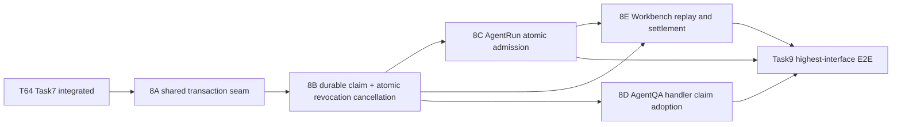

# T64 Task 8 Atomic Admission Implementation Plan

> **For agentic workers:** REQUIRED SUB-SKILL: Use superpowers:subagent-driven-development to implement each checkpoint. Every checkpoint has its own isolated worktree, Task Brief, review package, independent review and validation. Checkboxes track only that checkpoint's work.

**Goal:** Make revoked Release and exact dependency decisions atomic with new Agent Run and AgentQA turn admission while preserving existing replay, retirement, tenant isolation, and historical records.

**Architecture:** Two serial prerequisites establish (1) an exact Version-bound Variant/Release transaction guard and (2) durable AgentQA claim identity plus atomic cancellation from the revocation transaction. After those contracts integrate, implementation proceeds serially through Run admission, AgentQA handler adoption, and Workbench composition under the user's active SDD dispatch constraint; their file ownership remains disjoint. Workbench composition follows Run admission because pending settlement depends on its authoritative result. Task9 follows all verified checkpoints. Durable transactions end before storage, parsing, budget/network calls, Redis, model execution, or SSE.

**Tech Stack:** Go, GORM, Gin, SQLite and PostgreSQL migrations, existing `AgentRunStore`, workbench `AdmissionCoordinator`, Agent Marketplace security service, AgentQA handler, and StreamManager/EventBus.

**Spec:** `docs/specs/2026-09-20-agent-marketplace-domain-model.md` §10–11; Issue snapshot `docs/plans/issue30-sweep/issues/issue-64.md`; parent acceptance `docs/plans/issue30-sweep/issues/issue-30.md`; implementation parent `docs/plans/issue30-sweep/plans/plan-t64.md` Task 8; proposed decision `docs/adr/0015-agent-security-transactional-admission.md`; preflight `docs/plans/issue30-sweep/evidence/t64-task7-task8-preflight.md`.

## Global Constraints

- A Security Revoked Release blocks new use and retains history. A Dependency Security Blocked Release remains blocked until a new Release locks safe dependencies.
- A Release dependency is identified by exact `(type, id, version, digest)`; do not substitute by name, version, or digest.
- A previously admitted workbench request retains its existing idempotent replay result.
- `RetireVariant` continues to block new work through the existing lifecycle gate.
- Revocation `cancel` terminates applicable in-flight work; `allow` permits work admitted before revocation to finish.
- Tenant isolation is enforced on every read, write, claim transition, and cancellation query.
- Historical messages, Runs, Release records, dependency locks, and revocation ledger rows are retained.
- Production code rollback is allowed only to a security-compatible build that keeps both exact AgentRun admission and AgentQA claim admission/fencing. A pre-Task8 binary is forbidden while adopted AgentQA or Workbench ingress is reachable; if no compatible build is available, keep the current build or close both ingress routes at the gateway and verify rejection before starting older code.
- Do not hold a tenant database lock during attachment storage/extraction, budget/network work, Redis, model calls, or SSE.
- No push, merge, publish, deploy, GitHub Issue edit, or Issue closure.
- Paired migration heads at planning time: SQLite `000125`, versioned/PostgreSQL `000204`; re-read both heads before claiming `000126` and `000205`.

## Review Focus

- Existing request replay after revocation returns the same admitted Run and creates no second Run — Checkpoint 8E.
- Revocation commits before new Run/claim admission, causing fail-closed refusal; admission commits first, making the in-flight disposition explicit — Checkpoint 8C and 8D.
- Same-name dependency with a different version or digest is not substituted — Checkpoint 8A transaction seam.
- Both AgentQA quick-answer and agent mode reject before image/file persistence, message writes, live-run allocation, or SSE — Checkpoint 8D.
- Revocation cancellation survives stop-notification loss and only affects matching tenant/Release/message; `allow` and unrelated Releases continue — Checkpoints 8B and 8D.

---

## File ownership map and schedule

| Checkpoint | Files | Dependency |
|---|---|---|
| 8A — exact Version-aware shared transaction guard | `internal/application/repository/agent_security_guard.go`, `agent_security_guard_test.go` | T64 Task7 reviewed and integrated |
| 8B — durable claim schema and atomic revocation cancellation contract | paired migration files (claim table, revocation reconciliation state, unique tenant/local-Agent Variant index, immutable mapping triggers and legacy Run pin backfill); new claim entity/repository files and tests; `internal/database/migration_sqlite_versioned_schema_test.go`; `internal/application/repository/agent_security_guard.go` and tests (ordered dual-tenant guard); `internal/application/repository/agent_security.go`; `internal/application/repository/agent_run.go` (four sidecar fields in its internal `agentRunRow` projection only); `internal/application/repository/agent_run_security_cancel.go` and targeted-cancel/reconciliation tests; `internal/application/repository/agent_adoption.go` and mapping-immutability tests; `internal/types/agent_security_persistence.go` (release/dependency revocation reconciliation state only); `internal/types/interfaces/agent_security.go`; `internal/application/service/agent_security.go` and tests; new `internal/container/agent_security_reconciler.go`; `internal/container/container.go`; `internal/container/agent_security.go`; `internal/container/agent_security_wiring_test.go`; `internal/handler/session/handler.go` for claim/version dependency fields, setters and DI contract | 8A reviewed and integrated |
| 8C — atomic Run admission | `internal/application/repository/agent_run.go`, `internal/modules/agentruntime/agent/runtime/contracts.go`, new `agent_run_security_admission_test.go`, and narrowly scoped Run tests only if required | 8A and 8B reviewed and integrated |
| 8D — AgentQA handler claim adoption | session `qa.go`, `helpers.go`, `stream.go`, new `agent_security_claim.go` and tests; generated `docs/swagger.yaml`, `docs/swagger.json`, `docs/docs.go`; no `handler.go` or Container edits | 8A and 8B reviewed and integrated; controller dispatches after 8C due session SDD's serial-implementation constraint |
| 8E — workbench request composition and settlement | `internal/modules/workbench/service/workbench/admission.go`, new `admission_agent_security_test.go`, `internal/container/workbench.go`, `internal/handler/session/workbench_start.go` | 8B and 8C reviewed and integrated; controller dispatches after 8D per serial SDD constraint |

8A then 8B are serial prerequisites. The user-provided execution instructions explicitly require serial implementation dispatch under the active SDD workflow, so implement checkpoints serially in the order 8C, 8D, 8E after their dependencies pass, even though 8C/8D and 8D/8E own disjoint files. Independent review and validation may overlap when they inspect the same frozen commit and do not share mutable resources. Before each dispatch, verify suites use isolated databases and no fixed shared ports or mutable external services; serialize any command that shares a resource. Run 8D's session-package validation separately from Task9's session-package tests; run package checks serially if they share the Go build/test cache or fixtures. Integrate each checkpoint only after its individual gates pass, then rerun affected package checks. Task9 remains downstream of verified/integrated 8C–8E.

## Shared interfaces

Checkpoint 8A produces this repository seam in `internal/application/repository/agent_security_guard.go`:

```go
func checkLocalAgentReleaseAdmissionTx(tx *gorm.DB, sourceTenantID uint64, localAgentID, localAgentVersionID string) (releaseID string, adopted bool, err error)
```

The caller must hold the ordered tenant guard transaction for source tenant (and session tenant when different). The helper resolves exactly one published Variant matching both `localAgentID` and the server-derived immutable `localAgentVersionID`; it checks the fixed Release and exact dependency lock through `checkReleaseAdmissionTx`. A mismatched, stale, unpublished, or ambiguous adoption association fails closed. `adopted=false` is reserved for a confirmed non-Marketplace Agent, not a failed association lookup. Callers freeze the selected Version ID with the admitted Run or claim. It never selects by display name or current catalog pointer.

8B adds `AgentSecurityService.ResolvePublishedAgentVersion(ctx, sourceTenantID, localAgentID) (snapshot interfaces.AgentVersionSnapshot, releaseID string, adopted bool, err error)` for Workbench binding. It returns the published Variant's immutable Version snapshot after verifying tenant and Agent identity; it never accepts Version ID from JSON. A confirmed non-Marketplace Agent returns an empty snapshot and `adopted=false`; ambiguous/stale Marketplace associations fail closed. 8E stores both `snapshot.AgentVersionView.ID` and the trusted `releaseID` in `TrustedAdmissionBinding` and the immutable Run snapshot. 8C rechecks the exact Version and Release in its admission transaction. AgentQA does not pre-resolve the current Version: `AgentChatTurnClaimStore.Admit` looks up a replay before resolving a new Variant, so retries return their originally pinned Version even after catalog changes. For a new claim, it resolves/checks the published Variant Version inside the guard transaction, persists that exact Version and Release ID, and 8D loads that immutable snapshot with `AgentVersionService.GetAgentVersion` for execution. This keeps replay identity and execution pinned to the same Version.

Checkpoint 8C adds trusted `LocalAgentVersionID` and `ReleaseID` fields to `agentruntime.Admission`; they are set from the server-owned snapshot by 8E, never from `StartInput`. The repository guard verifies the exact IDs still match the published Variant selected at admission. A retry resolves the existing Run before the Version check and returns its original snapshot. In 8E, `TrustedAdmissionBinding` receives both IDs from the security resolver and the Workbench builder passes both fields through DI to the coordinator. `AgentRunStore.Admit` resolves existing request replay first, then checks exact Version/Variant/Release before reserving a session slot or writing a Run/message row. It writes the unchanged immutable JSON snapshot and separate immutable `agent_runs.security_*` pin columns for the exact identity. Lifecycle retirement remains checked in the same transaction. 8C's repository tests supply both exact fields; the Workbench caller begins supplying them when 8E is integrated.

8B extends `AgentRunStore` in its existing `agent_run_security_cancel.go` seam with tenant-scoped `ReconcileRunCancellation(ctx, tenantID, revocationID)`. Run `snapshot` remains immutable: paired migrations add nullable sidecar pin columns to `agent_runs` (`security_agent_id`, `security_local_agent_version_id`, `security_release_id`, `security_pin_source`) plus one check requiring either all four sidecars to be NULL or all four to be non-NULL with `security_pin_source IN ('admission','legacy_backfill')`; `security_pin_source` is `admission` for new rows and `legacy_backfill` for attributable historical rows. New Run rows write all exact pins; legacy backfill updates only those sidecar columns. Create a `BEFORE UPDATE` trigger only after backfill that rejects any change to any of these four sidecar values (including clearing them); migration tests attempt mutation of a populated pin and require rejection. Run each paired migration as one transaction: SQLite production migration uses the existing transactional runner (`NoTxWrap=false`); PostgreSQL locks `agent_runs` and `agent_adoption_variants` with `ACCESS EXCLUSIVE` before its final mapping recheck and holds both locks through backfill, old-writer INSERT guard creation, and pin UPDATE trigger creation. The operator quiesces old Run/Variant writers before signing the final preflight and keeps them quiesced until migration commits; the release operator compares the frozen-state preflight result hash to the signed report at the go/no-go point. SQLite relies on the quiesced-writer gate and the production runner's transactional migration. Keep the old-writer INSERT guard and post-backfill UPDATE trigger in the same committed migration as the backfill. This closes the backfill-to-trigger insertion window. A target is the exact `(agent_id, local_agent_version_id, release_id)` identity derived from every affected Variant, including retired Variants. Migration adds a partial unique index, immutable identity triggers, and a trigger rejecting old-writer Marketplace Run inserts without exact pins. A deployment preflight reports duplicate and timestamp-inconsistent mappings and lists active agent Runs with no current Variant lineage for operator classification. Before the final preflight, deployment operations quiesce every old Run and Variant writer and keep them stopped through migration completion. They run the read-only preflight against that frozen database state; the named deployment data owner records a disposition for every unmatched active Run and signs a report containing database identity, schema version, preflight query hash, and result-set hash. Store the report and raw identifiers only in the access-controlled deployment evidence store (never Git); record only its opaque evidence reference and hashes in the rollout record. The release operator verifies the signed report and then-current preflight set before applying migrations. Any unresolved row, set mismatch, or missing signed report blocks rollout. The SQL migration rechecks and fails for provable duplicate or timestamp-inconsistent mappings, but cannot establish that a human reviewed unmatched records and must not claim to enforce the signed-report gate. Supported application history assigns a fresh Agent ID at Variant publication and preserves Variant rows; this is a documented historical-provenance assumption, not a proof against out-of-band database edits. No ambiguous Run is silently skipped or widened to Agent-only cancellation.

Checkpoint 8E may keep the existing `AgentSecurityGate` fast refusal in `AdmissionCoordinator`, but the repository transaction in 8C is authoritative. It preserves admitted/dispatching/rejected replay ahead of the security fast gate and uses `settleDeniedPending` for an unadmitted pending request so reservation release is single-winner.

Checkpoint 8B produces a durable claim store. The claim identity is `(session_tenant_id, session_id, owner_id, request_id)` and stores a canonical request hash, server-generated assistant message ID, source tenant, local Agent Version, pinned Release, state, lease owner/expiry, and monotonically increasing fencing generation. For an adopted Agent both `local_agent_version_id` and `release_id` are required. For a confirmed non-Marketplace Agent both are NULL and QA continues using the current authorized CustomAgent configuration; the database check requires the two fields to be both NULL or both non-NULL. Claim creation and assistant placeholder insertion occur in one transaction, removing the pre-message Stop race. A retry with the same key and hash returns the existing claim; a changed hash conflicts; a terminal claim never restarts generation. Each message/model continuation and terminal write must CAS against the current generation. Expiry fences the old worker and terminalizes any orphan placeholder before a new request may start. Exact DDL and interface fields are specified in 8B below.

The repository exposes:

```go
type AgentChatTurnClaimStore interface {
    Admit(ctx context.Context, in AgentChatTurnClaimInput) (AgentChatTurnClaim, ReplayState, error)
    Renew(ctx context.Context, sourceTenantID uint64, claimID string, generation uint64, leaseOwner string) error
    GetForHandler(ctx context.Context, sourceTenantID uint64, claimID string, generation uint64, leaseOwner string) (claim AgentChatTurnClaim, leaseValid bool, err error)
    Finish(ctx context.Context, sourceTenantID uint64, claimID string, generation uint64, leaseOwner string, assistantMessage *types.Message, terminalState, reason string) (bool, error)
    CreateUserMessage(ctx context.Context, sourceTenantID uint64, claimID string, generation uint64, leaseOwner string, message *types.Message) (userMessageID string, err error)
    UpdateMessage(ctx context.Context, sourceTenantID uint64, claimID string, generation uint64, leaseOwner string, message *types.Message) error
    CancelByOwner(ctx context.Context, sessionTenantID uint64, sessionID, ownerID, assistantMessageID, reason string) (AgentChatTurnClaim, bool, error)
}
```

`ReplayState` has exactly `ReplayNew`, `ReplayActive`, and `ReplayTerminal`. `Admit` returns `ReplayNew` only for a committed new claim; same-key/same-hash replay returns the existing active or terminal state and IDs without changing lease owner/generation or inserting a message. Same key with a changed hash returns `ErrConflict`. The handler executes only `ReplayNew`; active or terminal replay returns HTTP 409 with `assistant_message_id` and current claim state before SSE or side effects. A later explicit turn uses a new RequestID. `AgentChatTurnClaimInput` contains server-derived `SourceTenantID`, `SessionTenantID`, `SessionID`, `OwnerID`, validated `RequestID`, canonical `RequestHash`, per-handler `LeaseOwner`, authorized `AgentID`, and an assistant-placeholder template with an empty ID; it never accepts a Version ID or assistant-message ID. `Admit` first returns an existing same-key claim, then for a new request resolves the published Variant and exact Version under the guard, calls 8A, assigns a server-generated assistant ID, and atomically inserts both claim and placeholder. For a confirmed non-Marketplace Agent, both `local_agent_version_id` and `release_id` are NULL and the authorized current `CustomAgent` remains the execution source. For an adopted Agent both are non-NULL and QA loads the immutable snapshot by the stored Version ID. A stale or inconsistent Marketplace association fails closed; it never falls back to mutable configuration. `Admit` returns `(claim, ReplayState, error)` only; same-session expired claims and their placeholders are terminalized internally in the transaction. Admission revalidates session owner and, for cross-tenant Agents, the exact `agent_shares` row plus active `organization_tenant_members` row under lock. A new `withTenantSecurityGuards` helper deduplicates source/session tenant IDs, sorts ascending, acquires each guard in one DB transaction, then runs the callback. Only after both guards does it lock/revalidate the session, grant, Variant, and claim rows. Run admission uses the existing single-tenant guard because its source and session tenant are identical.

`AgentChatTurnClaimEntity` stores a nullable `user_message_id` alongside the server-generated `assistant_message_id`. `CreateUserMessage` requires an ID-empty user message template matching the claim's session ID, owner and session tenant as established by the locked Session row, and matching the claim's RequestID and `user` role; it checks the unexpired active lease fence, assigns and stores the user ID, and inserts the row atomically. Replay after an existing user message returns that same ID without a second insert. Since `types.Message` has no tenant or owner columns, `UpdateMessage` accepts only the claim's exact assistant or user message ID, locks and verifies the Session row by `(tenant_id, id, user_id)` and requires `Session.UserID == claim.owner_id`, then reloads the Message by `(session_id, id, request_id, expected role)` and checks that its ID is the one bound to the claim. It updates only mutable content/attachment/status columns and never saves caller-supplied session, role, request ID, or other identity fields. `Finish` performs the same locked Session ownership check, reloads the exact assistant placeholder bound to the claim, and atomically writes its mutable terminal fields with claim state `completed` or `failed`.

The handler obtains `RequestID` from the existing `X-Request-ID` middleware and validates it as nonempty and at most 128 bytes before claim admission. The middleware generates and echoes an ID when the caller omits it; a caller retry is recognized as the same turn only if it reuses the echoed `X-Request-ID` and the same canonical request hash. The hash is SHA-256 over deterministic JSON for the validated request's execution-affecting fields, with file/image content represented by its digest before storage; it excludes request ID, server tenant resolution, and generated message IDs. For `ReplayStateNew`, AgentQA owns execution. For an existing active or terminal claim, it never starts execution or writes another message/upload; it returns HTTP 409 with the existing `assistant_message_id` and claim state so the caller can reload session history. This response is a request-collision contract, not an alternate generated answer; it does not change the approved Run replay behavior. Client inspection found no automatic AgentQA stream retry or promise that a retry resumes SSE; the API client stream builder currently has no request-ID option. The 409 contract therefore applies when a caller explicitly reuses the echoed header, and Task9 fixes the response status/headers/side-effect behavior without asserting a specific error-body sentence.

Revocation appends audit, marks exact affected active claims `cancelled`, and marks each bound assistant placeholder terminal in the same source-tenant transaction; repository methods are `AppendReleaseRevocationWithAuditAndCancelClaims` and `AppendDependencyRevocationWithAuditAndCancelClaims`, returning committed notification targets. Dependency revocation selects Releases whose lock contains the exact `(type,id,version,digest)` tuple inside that transaction. Any claim or message update error rolls back ledger, audit, and cancellation. Only after commit does service notify handlers. `allow` leaves current claims and placeholders active, while a later applicable `cancel` wins. Every handler-owned mutation (`Renew`, `CreateUserMessage`, `UpdateMessage`, and `Finish`) fences on source tenant, claim ID, session tenant/session, generation, lease owner, `state='active'`, and `lease_expires_at > transaction_now`; renewal after expiry fails and cannot reclaim the old generation. `GetForHandler` is a read, not an active-state mutation predicate: it scopes by source tenant, claim ID, session tenant/session, generation and lease owner, returns the current claim state/reason even when terminal, and separately returns `leaseValid=false` for terminal state, generation mismatch, or expiry. User Stop is separate: `CancelByOwner` first performs an unlocked, non-authoritative lookup of the claim's source tenant and ID using session tenant/session/assistant-message ID. It then acquires source and session tenant guards in ascending tenant-ID order, re-reads and locks the exact claim and session under those guards, revalidates the authenticated owner, and atomically changes only the matching active claim and assistant placeholder to `cancelled` before Stop sends its event. The initial lookup's fields are hints only and are never authorization. No lease owner is accepted from the Stop caller. If no claim exists, Stop keeps the existing non-AgentQA behavior. Only one competing terminal transition wins. Handler progress, user-message creation, and assistant-message updates write messages in the same transaction; a prior `Renew` or `GetForHandler` cannot authorize a later standalone `MessageService.UpdateMessage`. A stale-generation, expired-lease, or already-terminal write returns `false`/a fenced error and must not mutate a message. The handler renews every 10 seconds against a 30-second lease from a heartbeat goroutine, including while a provider/tool call is blocked. The cancellation watcher calls `GetForHandler`; it receives the persisted terminal state and cancellation reason when cancelled, then cancels local execution and stops scheduling external work. Generation change, lease expiry, or any claim-read error has the same fail-closed effect; no provider/tool call proceeds while cancellation state cannot be confirmed. Revocation `cancel` notifies only after commit, and polling recovers a lost stop notification. `Admit` performs a bounded sweep of expired claims for the target session and terminalizes their assistant placeholders as failed before a new explicit request proceeds; its effects remain internal to the transaction and do not change the three-result interface. No recovery path restarts generation.

## Checkpoint 8A: shared transactional Variant/Release predicate

### Files

- Modify: `internal/application/repository/agent_security_guard.go`
- Modify: `internal/application/repository/agent_security_guard_test.go`

### RED → GREEN

- [ ] Add table-driven `TestCheckLocalAgentReleaseAdmissionTx`: only an explicit confirmed non-Marketplace classification returns `adopted=false`; one active published Variant returns its fixed Release; missing/mismatched Version association, retired/draft Variant, revoked Release returns `ErrAgentSecurityReleaseBlocked`; exact dependency tuple is blocked; different version and same version/different digest remain allowed; two eligible local mappings fail closed.
- [ ] Run `go test ./internal/application/repository -run '^TestCheckLocalAgentReleaseAdmissionTx$' -count=1`; expected initial compile failure because the helper is undefined.
- [ ] Implement the helper using the caller's transaction only. Lock matching Variant rows deterministically before reading state; never open a nested transaction and never use a service-level verdict read.
- [ ] Run the focused test, existing `TestTenantSecurityGuardSerializesDecisiveWriteFamilies`, and `git diff --check`; expect all pass.
- [ ] Commit only the two owned files. Record BASE, HEAD, and complete diff digest in the Task report.

### Acceptance

One shared in-transaction predicate exists and returns deterministic fail-closed outcomes. No schema change. Its exact outputs are consumed by 8B, 8C, and 8D.

## Checkpoint 8C: atomic Agent Run admission

### Files

- Modify: `internal/application/repository/agent_run.go`
- Modify: `internal/modules/agentruntime/agent/runtime/contracts.go`
- Create: `internal/application/repository/agent_run_security_admission_test.go`

### Consumes / Produces

- Consumes 8A `checkLocalAgentReleaseAdmissionTx` and existing `withTenantSecurityGuard`.
- Produces the same public `AgentRunStore.Admit(context.Context, agentruntime.Admission) (agentruntime.Run, error)` signature; revocation and Run admission serialize on one tenant guard.

### RED → GREEN

- [ ] Add deterministic barrier tests `TestAgentRunAdmitSerializesAgainstReleaseRevocationBothOrders` and `TestAgentRunAdmitSerializesAgainstExactDependencyRevocationBothOrders`. Assert revocation-first rejects with `ErrAgentSecurityReleaseBlocked`, admission-first commits exactly one Run, and neither schedule deadlocks.
- [ ] Add `TestAgentRunAdmitReplaysExistingRunAfterRevocation`: first admit succeeds; revoke; same tenant/owner/request/hash returns the same Run; mismatched hash remains `ErrConflict`.
- [ ] Add `TestAgentRunAdmitSecurityDenialPreservesRetirementGateAndWritesNothing`: retirement still denies; security denial leaves no Run, active session slot, or new messages.
- [ ] Run `go test ./internal/application/repository -run '^TestAgentRunAdmit(Security|ReplaysExistingRun)' -count=1`; expected initial failure because Admit does not call the security seam.
- [ ] Refactor `AgentRunStore.Admit` to acquire the tenant guard before session/request/Variant/Run rows. Inside the transaction, resolve session scope, return an idempotent existing Run before a new-use security decision, call 8A for new Marketplace work, retain the retirement row lock/check, and only then reserve the session slot and create the Run/messages.
- [ ] Run those tests with `-count=10`, existing `TestAgentRunConcurrentClaim`, `TestTenantSecurityGuardSerializesDecisiveWriteFamilies`, repository package tests, `go build ./...`, and `git diff --check`; expect all pass.
- [ ] Commit only the owned repository files and record exact test outputs/HEAD.

### Failure handling

If a schedule fails, use its lock barrier transcript to identify the inverse lock acquisition before changing any code. Do not weaken tenant serialization or update the session slot outside the transaction.

## Checkpoint 8E: workbench replay, guard and denial settlement

### Files

- Modify: `internal/modules/workbench/service/workbench/admission.go`
- Create: `internal/modules/workbench/service/workbench/admission_agent_security_test.go`
- Modify: `internal/container/workbench.go`
- Modify: `internal/handler/session/workbench_start.go`

### Consumes / Produces

- Consumes the 8B `AgentSecurityService.ResolvePublishedAgentVersion` resolver and Task7 `VerdictForAgent`, plus the existing `settleDeniedPending` / `resumeExisting` request state machinery.
- Produces server-owned `TrustedAdmissionBinding.LocalAgentVersionID` and `ReleaseID` from the published Variant snapshot and copies both into `agentruntime.Admission`; client JSON and request identity never select either pin. It preserves the nil-safe fast `SetAgentSecurityGate` seam and `ErrAgentSecurityBlocked` classification without changing request IDs, request hash, request states, or Run APIs.

### RED → GREEN

- [ ] Add `TestAdmissionAgentSecurityReplayAfterRevocationReturnsExistingRun`: first request admits; revoke the fixed Release; retry same identity/hash returns original Run and creates no second Run.
- [ ] Add `TestAdmissionAgentSecurityBlockedBeforeNewPendingIntent`: a new blocked request creates no pending request, Run, or message.
- [ ] Add `TestAdmissionAgentSecurityRejectsPendingAndReleasesReservationExactlyOnce`: seed pending intent/reservation; race two retries against a blocked verdict; exactly one pending→rejected transition releases the reservation, while committed replay wins if Run admission completed.
- [ ] Add fail-closed infrastructure error coverage with no new durable request.
- [ ] Add a stale-Version race case: resolve a trusted binding for Version V1, change/retire the selected published Variant before repository admission, and prove 8C rejects without Run/session-slot/message writes; an existing admitted replay still returns its original V1 snapshot before this new-use check.
- [ ] Run the new tests; expected compile failure until gate setter/error are added.
- [ ] Implement the fast refusal only after request identity/hash and existing admitted/dispatching/rejected replay; for a pending request call `settleDeniedPending`. Resolve the authorized Agent's immutable published Variant snapshot after authorization and copy its Version and Release IDs into `TrustedAdmissionBinding.LocalAgentVersionID`/`ReleaseID`; pass both server-owned fields to `AgentRunStore.Admit` as `agentruntime.Admission.LocalAgentVersionID`/`ReleaseID`. Keep the 8C transaction guard authoritative if revocation or Variant change races binding resolution. Preserve `SetAgentUseGate` and the constructor's `adoptions` parameter; do not add client-supplied pin fields.
- [ ] Extend workbench error mapping to HTTP 409 for security refusal. Keep infrastructure errors as the existing 500 path. Wire the existing `AgentSecurityService` in `container/workbench.go` without dropping lifecycle wiring.
- [ ] Run focused `TestAdmissionAgentSecurity`, existing admission idempotency/concurrency suites, `go test ./internal/container/ -run TestAgentSecurityWiringRegistered -count=1`, `go test ./internal/handler/session/ -run TestWorkbenchStart -count=1`, `go build ./...`, and `git diff --check`; expect all pass.
- [ ] Commit only the owned files and record exact outputs/HEAD.

## Checkpoint 8B: durable claim schema/store and atomic revocation cancellation

### Storage contract

Recheck migration heads immediately before editing. Create paired `000126_agent_chat_turn_claims.{up,down}.sql` and `000205_agent_chat_turn_claims.{up,down}.sql` only if free. Besides the claim table below, add `run_cancellation_state` to each revocation ledger (`pending` for existing `cancel` rows, `complete` for `allow`) so a committed cancel is a durable reconciliation obligation. PostgreSQL claim columns: `id VARCHAR(36) NOT NULL`, `source_tenant_id BIGINT NOT NULL`, `session_tenant_id BIGINT NOT NULL`, `session_id VARCHAR(36) NOT NULL`, `owner_id VARCHAR(36) NOT NULL`, `request_id VARCHAR(128) NOT NULL`, `request_hash CHAR(64) NOT NULL`, `assistant_message_id VARCHAR(36) NOT NULL`, nullable `user_message_id VARCHAR(36)`, `agent_id VARCHAR(36) NOT NULL`, nullable `local_agent_version_id VARCHAR(36)`, nullable `release_id VARCHAR(36)`, `state VARCHAR(16) NOT NULL`, nullable `cancel_reason TEXT`, `lease_owner VARCHAR(36) NOT NULL`, `generation BIGINT NOT NULL`, `lease_expires_at TIMESTAMPTZ NOT NULL`, `created_at TIMESTAMPTZ NOT NULL`, `updated_at TIMESTAMPTZ NOT NULL`; SQLite uses matching `TEXT` IDs/hash/state, `INTEGER` tenants/generation, nullable `TEXT` user-message/version/release/cancel fields, and `DATETIME` timestamps. Primary key `(id, source_tenant_id)`; unique `(session_tenant_id, session_id, owner_id, request_id)`, `(session_tenant_id, assistant_message_id)`, and `(session_tenant_id, user_message_id)`; indexes `(source_tenant_id, state, release_id)` and `(session_tenant_id, session_id, owner_id, request_id)`; `CHECK state IN ('active','cancelled','completed','failed')`; `CHECK ((local_agent_version_id IS NULL) = (release_id IS NULL))`; no cascading deletes. Add paired partial unique indexes named `uq_agent_adoption_variants_tenant_local_agent` on `(tenant_id, local_agent_id)` where `local_agent_id IS NOT NULL`, plus triggers that reject changes to `release_id`, `local_agent_id`, or `local_agent_version_id` after a Variant is published/retired. Before migration, read-only deployment preflight SQL lists duplicate mappings, every active agent Run without a current Variant row, and every mapped Run whose unique Variant/Version did not exist by the Run creation time. Deployment operations quiesce all writers before the final per-tenant preflight and keep them quiesced through migration completion. The named data owner signs a disposition for every unmatched active Run in an access-controlled deployment evidence store; only the opaque evidence reference and hashes are recorded in the rollout record, never raw IDs in Git. The release operator verifies database identity, schema version, query hash, result-set hash, and unchanged reviewed set before startup migration; any unresolved row, mismatch, or missing signature blocks rollout. SQL migration repeats provable uniqueness/timestamp checks and fails with actionable IDs, but does not enforce or attest the human signoff; then it backfills only `agent_runs.security_*` sidecar columns for attributable active Runs. It leaves immutable JSON snapshots untouched. Supported publication creates a fresh local Agent ID per Variant, upgrades create a fresh Variant, retirement preserves the Variant row; this is the historical-provenance assumption and is recorded as such. Tests cover duplicate, timestamp-inconsistent, attributable, and unmatched classifications. Store every claim lookup/update with both claim ID and source tenant. `Admit` receives server-resolved source/session tenant, owner, request ID and hash, per-handler lease owner, authorized Agent ID, and an assistant-placeholder template with an empty ID; it resolves the Variant Version under lock, assigns the server-generated assistant ID, and atomically inserts claim plus placeholder. Same key/hash returns the prior claim and assistant ID; same key with changed hash conflicts. Expired claims become failed and their placeholder is terminalized before a new explicit request proceeds. The handler renews every 10 seconds against a 30-second lease, including during blocked provider/tool calls; renewal failure cancels local execution and fences subsequent writes. Admission performs a bounded expired-claim sweep for the target session. No recovery path restarts generation.

### Files

- Create: `migrations/sqlite/000126_agent_chat_turn_claims.up.sql`, `.down.sql`; add `security_agent_id TEXT NULL`, `security_local_agent_version_id TEXT NULL`, `security_release_id TEXT NULL`, `security_pin_source TEXT NULL` to `agent_runs`, an all-four-NULL or all-four-populated/source-checked constraint, sidecar backfill, old-writer insert guard, and post-backfill immutable-sidecar update trigger. The down path refuses when any claim row, any release/dependency revocation row, any pending cancellation obligation, or any non-NULL Run sidecar exists; empty-schema down/up remains supported for tests and local development. Production rollback retains the forward schema and is permitted only to a security-compatible build with both admission gates, or after adopted ingress has been disabled and verified.
- Create: `migrations/versioned/000205_agent_chat_turn_claims.up.sql`, `.down.sql`; add equivalent nullable `VARCHAR(36)`/`VARCHAR(32)` sidecar columns, all-four-NULL/all-four-populated source check, backfill and triggers for PostgreSQL. Because the configured golang-migrate PostgreSQL driver executes each SQL file without an implicit transaction, bracket the complete migration body with explicit `BEGIN;`/`COMMIT;`; acquire table locks before preflight recheck/backfill. The down script uses the same explicit transaction and a conditional exception refusal. Production rollback retains the forward schema and is permitted only to a security-compatible build with both admission gates, or after adopted ingress has been disabled and verified.
- Create: `internal/types/agent_chat_turn_claim.go`
- Create: `internal/application/repository/agent_chat_turn_claim.go`, `agent_chat_turn_claim_test.go`
- Modify: `internal/application/repository/agent_security.go`, `agent_security_test.go`
- Modify: `internal/application/repository/agent_run.go` only to expose the four immutable `security_*` attribution sidecars in its internal persistence row projection; Run admission behavior belongs to 8C.
- Modify: `internal/application/repository/agent_security_guard.go`, `agent_security_guard_test.go` to implement the ordered dual-tenant guard consumed by claim admission.
- Modify: `internal/application/repository/agent_run_security_cancel.go` and targeted-cancel/reconciliation tests; implement tenant-scoped pending-obligation reconciliation with the lock/recheck order below, exact sidecar targets, cumulative counts, and atomic Run/event/session/ledger completion.
- Modify: `internal/application/repository/agent_adoption.go` and its tests to reject any identity-field update after publication; migration triggers enforce the same invariant for direct SQL writers.
- Modify: `internal/types/agent_security_persistence.go` only to add durable cancellation reconciliation state to release/dependency revocation entities. The four Run security pins live only in the internal `agentRunRow` projection in `internal/application/repository/agent_run.go`; no duplicate Run entity is added here.
- Create: `docs/plans/issue30-sweep/evidence/t64-task8-run-cancel-preflight-sqlite.sql` and `docs/plans/issue30-sweep/evidence/t64-task8-run-cancel-preflight-postgres.sql`, read-only deployment queries that enumerate conflicting and unmatched legacy Run/Variant mappings before the migration is attempted. Create a sanitized `t64-task8-unmatched-run-review-template.md`; actual signed per-tenant reports and raw identifiers remain only in the access-controlled deployment evidence store.
- Modify: `internal/application/service/agent_security.go`, `agent_security_test.go`
- Modify: `internal/types/interfaces/agent_security.go` to expose `ResolvePublishedAgentVersion` from the Task8B service contract.
- Modify: `internal/database/migration_sqlite_versioned_schema_test.go`
- Create: `internal/container/agent_security_reconciler.go` and `internal/container/agent_security_reconciler_test.go`; `internal/container/container.go` invokes it with the durable revocation reconciler and registered `ResourceCleaner` shutdown.
- Modify: Task7 `internal/container/agent_security.go` and `internal/container/container.go` to register the claim store and inject dependencies
- Modify: `internal/handler/session/handler.go` to add claim-store and AgentVersion service fields, nil-safe setters, and DI injection seam; 8D consumes these fields and must not edit `handler.go`
- Modify: `internal/container/agent_security_wiring_test.go` to assert claim-store and AgentVersion dependency injection

### Consumes / Produces

- Consumes 8A guarded Variant/Release predicate; Task7 `AgentSecurityService`; current `resolveAgent` authorized source scope; `effectiveTenantID` for shared Agents and `session.TenantID` for tenant-local Agents; existing StopSession message-specific event path.
- Produces repository methods matching the shared interface above, the claim lifecycle service and Container providers, plus the handler's claim-store and AgentVersion setters/injection. It does not change AgentQA or StopSession behavior; 8D consumes this fixed seam.

### RED → GREEN

- [ ] Add repository tests `TestAgentChatTurnClaimAdmitUsesOrderedTenantGuards`, `TestAgentChatTurnClaimIsTenantScopedAndIdempotent`, `TestAgentChatTurnClaimCancelMatchesOnlyPinnedReleases`, and `TestAgentChatTurnClaimTerminalTransitionIsSingleWinner`. Use migrated SQLite databases isolated per test.
- [ ] Test repository replay, changed-hash conflict, both tenant-lock numeric orders, share revocation between resolution and claim, generation fencing, same-session expiry cleanup, atomic Release/dependency cancellation and rollback. Add a watcher-read case proving `GetForHandler` returns a cancelled claim and persisted reason with `leaseValid=false`, while a wrong source tenant returns no claim. Add a revocation cancellation case with two Releases and two local Agents; cancelling one Release must cancel only Runs pinned to its exact Release/Version and leave the other Agent/Release active. Verify sidecar backfill covers each attributable active legacy Run without changing immutable snapshot bytes, reports duplicates/timestamp conflicts, and produces an explicit unmatched-ID review list; reject identity mutation after publication and reject clearing/changing any populated Run sidecar pin after backfill. Migration tests assert SQLite/PostgreSQL index and trigger definitions, all-four-sidecar check (including rejected partial pins and invalid source), sidecar backfill without snapshot mutation, rejection of any post-backfill sidecar pin update, old-writer Marketplace insert rejection, and a concurrent writer boundary proving no insert can land between backfill and guard installation. Test populated-state down refusal for any revocation history, any claim history, and any pinned Run, while retaining the empty-state down/up round trip and migration version uniqueness. Operational rollback retains the forward schema and uses only a security-compatible binary with both Run and AgentQA admission gates; a pre-Task8 binary requires adopted AgentQA and Workbench ingress to be disabled and rejection verified before startup. The deployment operator verifies the signed per-tenant report reference, database identity, and hashes against the quiesced live state before migration; actual identifiers never enter Git. The migration only enforces SQL-provable conflicts. `agent_run_security_cancel.go` matches exact `security_*` sidecar targets; reviewed non-Marketplace rows have no target and are never selected. Expected RED until schema/store/service wiring exists.
- [ ] Implement `withTenantSecurityGuards` as one transaction that deduplicates/sorts IDs and acquires both guards ascending, then revalidates session owner and shared-Agent grant. Add tests for both numeric orders and grant removal between request resolution and claim admission.
- [ ] In `internal/handler/session/handler.go`, add narrow fields/setters for the claim store and `interfaces.AgentVersionService`; in Container wiring, inject both into the `session.Handler`. Add a Dig resolution test proving both are present. Do not add the runtime claim/QA flow here.
- [ ] Implement claim migration/entity/store and `AgentSecurityService.ResolvePublishedAgentVersion`. `Admit` revalidates owner/share under the ordered guards, calls 8A with exact Version, inserts claim plus assistant placeholder, and handles replay/expired target-session claims. It returns no claim or placeholder on blocked admission or infrastructure failure. Mutations constrain source tenant, claim ID, expected generation, lease owner, active state and unexpired lease. `GetForHandler` reads by source tenant and claim ID, returns persisted state/reason even when terminal, and compares generation, lease owner, state and expiry before setting `leaseValid`; stale generation/owner gives `leaseValid=false` and cannot mutate. The claim row itself carries persisted session tenant/session identity. The resolver returns the published Variant Version plus `AgentVersionService.GetAgentVersion` snapshot after verifying tenant and Agent binding.
- [ ] Implement `Renew`, generation-fenced `Finish`, same-session expiry cleanup, and exact Release/dependency claim cancellation. Add `AppendReleaseRevocationWithAuditAndCancelClaims` and `AppendDependencyRevocationWithAuditAndCancelClaims`; each atomically appends revocation+audit, sets a durable Run cancellation obligation to `pending` for `cancel`, and updates every affected claim and its bound assistant placeholder. Dependency Release selection matches exact `(type,id,version,digest)` inside that transaction. Any claim/message update error rolls back revocation and audit. After commit, immediately attempt `ReconcileRunCancellation(ctx, tenantID, revocationID)`; a bounded periodic startup worker retries pending ledger obligations after process restart. Reconciliation acquires the tenant security guard first, reserves the SQLite writer if applicable, then locks/rechecks the tenant-scoped revocation row for `pending`; it derives exact targets including retired Variants and performs Run/event/session-slot changes, cumulative `canceled_run_count` update (stored count plus newly transitioned Runs), and `pending -> complete` in one transaction. A second replica waits, rechecks, and no-ops after completion. `allow` writes `complete` with zero cancellation and leaves Runs, claims, and placeholders active; a later applicable `cancel` wins. Test interruption after revocation commit but before cancellation, process restart reconciliation, two-replica barrier ordering, retry after transient DB error, preservation of an existing nonzero historical count, and rollback of the run/event/count/state unit.
- [ ] Recheck migration heads immediately before creating `000126`/`000205`; assert all claim/revocation/Run-sidecar columns, unique/index constraints, immutable Variant and Run-pin triggers, legacy-run audit/backfill, fresh SQLite head and down/up round trip. Run migration version uniqueness.
- [ ] Run focused repository, migration and service tests, existing revocation tests, full owning package suites serially, `go build ./...`, and `git diff --check`; expect all pass.
- [ ] Implement the worker in `internal/container/agent_security_reconciler.go`: run one bounded pass at startup, then every 10 seconds (overridable through `AGENT_SECURITY_RECONCILE_INTERVAL`); stop through a context registered with `ResourceCleaner`, and wait for the in-flight pass during shutdown. Log pending failures with tenant and revocation ID. The repository lock/recheck protocol is authoritative for multi-replica safety.
- [ ] Record the read-only SQLite and PostgreSQL legacy attribution preflight queries in the two owned evidence files; each query reports duplicate Variant IDs, stale/missing Version ownership, and active matching Runs whose Run creation time predates the exact Variant/Version publication. Confirm ordinary non-Marketplace Agent IDs with no Variant lineage are not treated as Marketplace conflicts. The migration repeats the fail-closed SQL-provable checks while writer quiescence remains in force; the release operator compares the frozen-state result hash to the signed report before migration starts.
- [ ] Commit only owned migration/storage/service/DI/reconciliation files; record exact outputs, migration IDs and source-scope evidence.

### Checkpoint 8D: AgentQA handler claim adoption (dispatch after 8B and 8C)

### Files

- Modify: `internal/handler/session/qa.go`, `helpers.go`, and `stream.go`
- Create: `internal/handler/session/agent_security_claim.go` and focused tests
- Modify: `docs/swagger.yaml`, `docs/swagger.json`, and `docs/docs.go` generated from AgentQA annotations via `make docs`
- Do not modify: `internal/handler/session/handler.go` (owned by 8B for injected dependencies), `internal/container/container.go` (owned by 8B), repository/service/migration files (8B), or Run-store/runtime files (8C)

Consumes: 8A exact Version-bound security guard; 8B claim store, claim/version fields injected into `session.Handler`, and Task7 Stop route/message-specific signaling. Claims apply only when `resolveAgent` yields a CustomAgent (adopted or confirmed non-Marketplace); ordinary AgentQA with no CustomAgent and `agent_enabled=false` bypasses claim admission and continues through existing `qaModeNormal` unchanged. For adopted claims, execute `AgentVersionService.GetAgentVersion` using the claim's stored Version ID; for confirmed non-Marketplace claims where both Version and Release are NULL, continue using the authorized current `CustomAgent`.

### RED → GREEN

- [ ] Add zero-side-effect tests for blocked quick-answer and agent modes; shared-Agent source tenant and Version binding; claim revocation/allow behavior; stale-generation and expired-lease message-write refusal; same `X-Request-ID` active/terminal replay (409 with the existing assistant ID and no second execution/message/upload); changed-hash conflict; request ID validation; cleanup after claim failure; and ordinary agentless `AgentQA` (`customAgent == nil`, `agent_enabled=false`) continuing through `qaModeNormal` with no claim. Assert no upload processing, user/assistant messages, live marker or SSE bytes before blocked rejection.
- [ ] Refactor AgentQA parsing into side-effect-free resolution and explicit post-claim attachment processing. Preserve KnowledgeQA behavior. Blocked/invalid admission creates no messages or other side effects. On success, use the assistant placeholder ID atomically inserted by 8B; only then process attachments and create the user message. Refactor `createTurnMessages` to reuse that placeholder rather than create a duplicate; terminalize it on failure/cancel so history remains auditable.
- [ ] After authorized `resolveAgent`, pass only source/session tenant, owner, Agent ID, LeaseOwner, request ID, canonical hash, and an ID-empty assistant-placeholder template to `Admit`; 8B revalidates share grant/owner under ordered tenant guards. On replay, reuse the stored assistant ID and Version identity. For adopted claims load the stored Version ID through `AgentVersionService.GetAgentVersion` and execute that immutable snapshot; for confirmed non-Marketplace claims keep the authorized current CustomAgent. Never trust a request tenant or Version field.
- [ ] Replace standalone assistant `MessageService.UpdateMessage` and QA user-message create/update calls with fenced `CreateUserMessage`, `UpdateMessage`, and `Finish`. Each checks `(claim, sourceTenant, generation, leaseOwner, active)` and writes the message in the same transaction. No successful preflight check authorizes a later unfenced write. Keep failed/cancelled assistant placeholders and any already-created user message terminal in history; clean only temporary uploaded resources through their existing deletion API. `Finish` atomically writes the final assistant message with claim state `completed` or `failed`; user Stop uses `CancelByOwner`, revocation uses the atomic 8B repository transition, and expiry terminalizes the placeholder in `Admit`.
- [ ] In StopSession, call `CancelByOwner` with authenticated session owner and exact message ID; it atomically cancels the claim and assistant placeholder before sending the message-specific stop event. A completed/cancelled claim is idempotent and does not send a second effective transition. Poll durable claim state every 100ms with `GetForHandler`; revocation and user Stop commit the placeholder's terminal state before the handler observes them. On generation mismatch or `leaseValid=false`, stop local work. On any claim-read error, immediately cancel local execution and schedule no further provider/tool operation; return a sanitized error to the stream and log using bounded retries only for final cleanup, never for deciding whether to continue generation. Add repository/handler regressions for wrong owner in the same tenant, a foreign tenant, and a hint-change race between the unlocked lookup and guarded re-read; assert no other claim or placeholder is mutated and no stop event is sent.
- [ ] Map `ErrAgentSecurityReleaseBlocked`, changed-hash conflicts, and active/terminal request replays to HTTP 409 `AppError`; map claim/version-store infrastructure failures to HTTP 500 `AppError` before SSE headers and invalid RequestID to HTTP 400. Add handler/middleware tests for these statuses and zero SSE bytes. Add Swagger `@Failure 400`, `@Failure 409`, and `@Failure 500` annotations to AgentQA only; verify the generated `/agent-chat/{session_id}` operation exposes them while KnowledgeQA remains unchanged. Run `make docs` and inspect only the generated diff.
- [ ] Run focused handler and existing AgentQA stream-stop/upload tests, package suites serially, `go build ./...`, `make docs`, and `git diff --check`; expect all pass. Verify claim message writes cannot change row identity and every write fails after `lease_expires_at` even before another Admit sweeps the row.
- [ ] Commit only owned session handler/test and generated Swagger files; record exact outputs and HEAD.

### Failure and recovery handling

No worker automatically restarts generation from an `active` claim. A handler crash stops its local process; the claim's lease expiry only allows a later explicit request with a new assistant-message ID after the old message is terminalized. A cancellation write commits before any notification; the handler watcher polls durable state and retries transient reads. Claim cancellation never selects by Agent display name, only by `(source_tenant_id, release_id)`.

## DAG and validation gates



After 8A and then 8B each pass independent review and backend validation and are integrated, implement 8C, 8D, and 8E serially in that order under the active SDD implementation-dispatch constraint. Each must pass independent Spec Compliance + Code Quality review and a backend validator against its exact committed HEAD before the next checkpoint begins. Their files remain separately owned as listed above. Test commands sharing Go packages/fixtures run serially, and 8D validation never overlaps Task9 session-package tests. Integrate each verified checkpoint and rerun affected package checks. Task9 starts only after 8C–8E are verified and integrated.

## Acceptance traceability

| Issue #64 / Spec requirement | Checkpoint | Evidence |
|---|---|---|
| New Task/Run blocked for a revoked Release | 8A + 8B + 8C + 8D + 8E | guarded exact Release predicate; Run transaction order tests; pending settlement; blocked QA zero-side-effect tests |
| Exact locked dependency propagates transitively without same-name substitution | 8A + 8B + 8D | exact tuple tests and concurrent revocation/admission barriers |
| Run/turn admitted before revocation follows `cancel` or `allow` | 8B + 8C + 8D | both transaction orderings; claim exact Release cancellation and `allow` preservation |
| Existing history is retained | 8B + 8D | replay identity and claim terminal state preserve Run/message rows; existing revocation append-only tests |
| Workbench lifecycle retirement remains enforced | 8C + 8E | retirement regression tests and preserved `SetAgentUseGate` wiring |
| Highest stable interface can verify security propagation | Task9 (downstream) | real route/container/workbench/session integration evidence consumes these gates |

## Self-review

- **Spec coverage:** new work blocking, exact dependency propagation, in-flight cancel/allow, history retention, lifecycle retirement, quick-answer and agent-mode coverage, and Task9 highest-interface evidence are each mapped above. Product semantics are unchanged. The proposed ADR requires independent review before 8A dispatch.
- **Step scan:** each checkpoint's tests, expected RED, implementation seam, checks and commit ownership are explicit. The resolved Task7 Container registration file is explicitly assigned to 8B; no file ownership is deferred to runtime discovery. No TODO/TBD placeholder is used.
- **Type consistency:** `checkLocalAgentReleaseAdmissionTx` is shared unchanged by Run and claim stores. Claim identity/state and repository signatures are fixed above. The plan will be amended if the independent architecture review finds an unsafe contract before any Task8 Brief is dispatched.
- **Review Focus mapping:** replay → 8C; both revocation/admission orderings and exact dependency → 8A/8B/8D; zero-side-effect QA → 8D; cancel/allow + delivery-loss recovery → 8D. Cross-tenant claim source is tested explicitly.
- **Migration and test isolation:** paired next IDs are rechecked at dispatch; schema tests and migration uniqueness are owned by 8B; all database tests use isolated temporary SQLite files and validators run suites serially.
