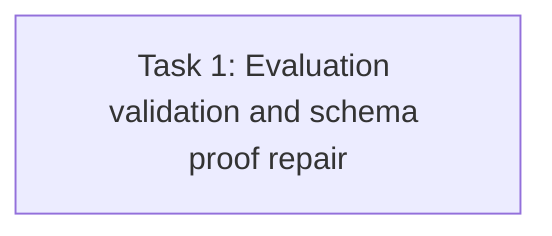

# T65 Task1 Review Fix R1 Implementation Plan

> **For agentic workers:** REQUIRED SUB-SKILL: Use superpowers:subagent-driven-development (recommended) or superpowers:executing-plans to implement this plan task-by-task. Steps use checkbox (`- [ ]`) syntax for tracking.

**Goal:** Make Task1’s validation tests prove application validation rather than foreign-key rejection, prove evaluation remains pinned after a second Release is published, and verify the new migration table’s full column set.

**Architecture:** Improve only the existing repository behavior tests and SQLite migration schema assertions; production persistence code is unchanged unless the new tests reveal a defect. The follow-up review is limited to the fix commit range.

**Tech Stack:** Go, GORM, SQLite migration test helpers.

**Spec:** `docs/specs/2026-09-20-agent-marketplace-domain-model.md` §12; original implementation plan `docs/plans/issue30-sweep/plans/plan-t65.md`, Task1 and its structured Evaluation ruling.

## Global Constraints

- “Agent Evaluation fixes immutable Release, test set/version, environment class, time, result.”
- Only result status `pass|fail|inconclusive` and checks using codes `manifest_completeness|compatibility|license|security|dependency_integrity|privacy` with statuses `pass|fail|not_run` are accepted.
- Evaluation persistence contains no Task, adopter, Tenant mapping, local version mapping, prompt/output, or runtime telemetry fields.
- Duplicate Evaluation identity is rejected; no write API may mutate an existing Evaluation.

## Review Focus

- Invalid validation cases use an existing Public Release and assert `ErrAgentEvaluationInvalid`; include the valid `inconclusive` + `not_run` combination in a positive repository test.
- Pinning test publishes a second Release on the same Public Listing, advances its current Release pointer, then proves the Evaluation is returned only for the original immutable Release ID.
- Fresh SQLite migration schema assertion includes each persisted Evaluation column and existing indexes.
- Existing production tests pass without modifying the approved structured result allowlist.

## Task DAG

## Task 1: Evaluation Test Evidence Repair

**Source:** Independent Task1 review findings T1-R1-1 (Medium), T1-R1-2 (Medium), T1-R1-3 (Low).

**Dependency:** Task1 implementation range `93706830b78205de0c7d433097e89f33d9726513..0dba37e17940acc4c02c4e2f5eede48c7b1bfde1` passed focused backend validation, but Task review is not approved until these assertions are corrected.

**Role:** backend_implementer.

**Owned files:** `internal/application/repository/agent_evaluation_test.go`; `internal/database/migration_sqlite_versioned_schema_test.go`. Do not modify production code or migrations.

**Consumes:** Existing `seedPublicEvaluationReleaseFixture` helper and `PublicMarketplaceRepository.CreatePublicSubmission`, `ReviewAndPublishPublicTx`, `GetPublicRelease`, and `GetPublicListing` methods.

**Produces:** Tests that establish strict structured-result validation with a valid Release FK, Release pinning across two immutable Releases under one Listing, and complete Evaluation table column coverage on a fresh migrated SQLite database.

- [ ] Update `TestAgentEvaluationRejectsInvalidRows` to seed a valid Public Release, use its ID for all cases except the deliberately blank ReleaseID case, and assert every invalid case returns `ErrAgentEvaluationInvalid` rather than any generic error. Keep a valid `inconclusive` overall status with a `not_run` check in the positive allowlist test.
- [ ] Extend the pinning scenario to create a second approved public Release on the same Listing, advance the Listing current-release pointer using the expected first Release ID, read both Releases’ evaluations, and assert the persisted row remains only under the original Release ID.
- [ ] Add explicit `sqliteColumnExists` assertions for `agent_release_evaluations` columns `id`, `release_id`, `test_set_id`, `test_set_version`, `environment_class`, `evaluator_id`, `evaluated_at`, and `results_json` in the fresh-schema migration test.
- [ ] Run `go test ./internal/application/repository -run 'TestAgentEvaluation' -count=1`, `go test ./internal/database -run '^TestSQLiteMigrationsCreateVersionedSchema$' -count=1`, `git diff --check`, and `go build ./...`.
- [ ] Commit only the two owned test files and append exact command/output evidence to `.superpowers/sdd/plan-t65/task-1-report.md`.

**Acceptance mapping:** T1-R1-1 is resolved by valid-FK invalid-result cases plus explicit sentinel assertions; T1-R1-2 by a two-Release pointer-advance test; T1-R1-3 by full SQLite Evaluation column assertions.

**Failure handling:** If the current helper cannot safely publish two Releases on one Listing, add only a focused test helper in the owned repository test file; do not alter production code or migration numbering.
