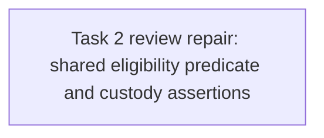

# T65 Task2 Review Fix R1 Implementation Plan

> **For agentic workers:** REQUIRED SUB-SKILL: Use superpowers:subagent-driven-development (recommended) or superpowers:executing-plans to implement this plan task-by-task. Steps use checkbox (`- [ ]`) syntax for tracking.

**Goal:** Close the valid Task2 repository-predicate and custody-preservation findings from the independent review without widening the Task2 production scope.

**Architecture:** Reuse one GORM query-builder seam for the shared Publisher/source Listing/public Listing eligibility conditions in catalog reads, detail reads, and the guarded introduction transaction. Strengthen existing persistence-level custody tests to prove active Adoptions and immutable introduction identity remain intact.

**Tech Stack:** Go, GORM, SQLite repository tests.

**Spec:** `docs/specs/2026-09-20-agent-marketplace-domain-model.md` §§9–10 and 15; original implementation plan `docs/plans/issue30-sweep/plans/plan-t65.md`, Task2.

## Global Constraints

- “Unlisted” means new discovery and new Adoption are stopped; existing local versions and history remain preserved.
- Publisher custody does not transfer Publisher identity or delete referenced packages.
- The #64 Security Revocation gate remains the stricter override for release and dependency admission.
- Metrics and custody paths must not expose Tenant/member identity or Task/run content.

## Review Focus

- The list, detail, and new-introduction decision use the same Publisher/source Listing/public Listing eligibility predicate; cover each path with the repository/service tests already owned by Task2.
- Revocation and source Listing unlisting remain serialized with Introduction through the ordered tenant guard; retain deterministic two-connection barrier tests.
- Existing Adoption remains active and points to the same local introduced Release after Publisher revocation and source unlisting; verify digest, Publisher identity, submission lineage, and bundle bytes.
- Public Listing state has no supported unlisting writer: the only lifecycle transition found is tenant-scoped `AgentMarketplaceRepository.TransitionListingState`; the public repository writes current Release pointers during review/publish, and a service test directly changes the public state only to seed a read-path case. Do not add a new public state-transition API in this repair. Any future public unlist writer must serialize on the same publisher guard. This is the controller ruling for review finding T2-R1-1.

## Task DAG

## Task 1: Shared Eligibility Query and Preservation Tests

**Source:** Independent Task2 review findings T2-R1-2 (Medium) and T2-R1-3 (Low); controller ruling T2-R1-1 (not applicable to a supported write path).

**Dependency:** Task2 source commit `5688cfffd70edb0d268c0d85445a4efa5bb4dac0`; independent backend validation passed at that exact HEAD. The fix review must cover from that commit to the fix HEAD.

**Role:** backend_implementer.

**Owned files:** `internal/application/repository/public_marketplace.go`; `internal/application/repository/public_marketplace_test.go`. No other source or test file may change.

**Consumes:** Existing tenant-guard helper `acquireTenantSecurityGuardTx(*gorm.DB, uint64) error`; existing `PublicMarketplaceRepository` methods.

**Produces:** One internal query builder that applies the verified Publisher, listed source Tenant Listing, listed public Listing, and non-null current Release predicates to a caller-provided `*gorm.DB`. `IsPublicListingDiscoverable`, `ListPublicCatalog`, and `IntroduceRelease` all use it; transaction-specific publisher/listing identity conditions are layered onto the builder result. No new public API or schema.

- [ ] Add or adapt repository tests demonstrating that the shared predicate rejects revoked Publisher, source-unlisted, public-unlisted, and missing-current-Release rows consistently in detail, catalog, and Introduction; run them to confirm the expected failure before refactoring.
- [ ] Refactor the eligibility conditions into one query-builder seam accepting `*gorm.DB`; use it in the three existing methods without changing the ordered tenant guards or #64 checks.
- [ ] Extend both custody preservation tests to assert the Adoption remains `active`, its `accepted_release_id` is the same introduced local Release, and the introduced row preserves public release/listing IDs, digest, Publisher tenant provenance, submission lineage, and bundle bytes.
- [ ] Run `go test ./internal/application/repository -run 'TestPublicMarketplace.*(Custody|Discoverable|Introduce|Revok)' -count=10`, `go test ./internal/application/service -run '^TestPublicMarketplace' -count=1`, `git diff --check`, and `go build ./...`.
- [ ] Commit only the two owned files and append exact command output to `.superpowers/sdd/plan-t65/task-2-report.md`.

**Acceptance mapping:** T2-R1-2 is closed by a shared eligibility query used on read and write paths. T2-R1-3 is closed by explicit persistence assertions for existing Adoption and provenance. T2-R1-1 is ruled not applicable to current supported APIs; any future public Listing state writer must join the same guard.

**Failure handling:** If an existing public Listing state write API is discovered during the fix, stop and report its exact call path; the controller will amend the plan before code changes. Do not expand this repair to add a public unlisting capability.
