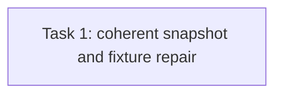

# T65 Task3 Review Fix R1 Implementation Plan

> **For agentic workers:** REQUIRED SUB-SKILL: Use superpowers:subagent-driven-development (recommended) or superpowers:executing-plans to implement this plan task-by-task. Steps use checkbox (`- [ ]`) syntax for tracking.

**Goal:** Ensure each Marketplace Metrics response reads all four measures from one database snapshot and make its boundary, distinct-tenant, and privacy tests exercise matching source rows.

**Architecture:** Replace four independent aggregate statements with one SQL statement containing four scalar aggregate subqueries; database statement snapshot semantics give one coherent view. Strengthen existing repository and service tests using real joined source rows and private markers. Keep interfaces, bucket values, metric grains, and caller-visible fields unchanged.

**Tech Stack:** Go, GORM, SQLite repository/service tests; SQL compatible with the project's SQLite and PostgreSQL backends.

**Spec:** `docs/specs/2026-09-20-agent-marketplace-domain-model.md` §12; `docs/plans/issue30-sweep/plans/plan-t65.md`, Task3.

## Global Constraints

- Lifetime introductions, current active Adoptions, and fixed-window Upgrade Proposal counts are distinct measures and must not be merged.
- Use `COUNT(DISTINCT tenant_id)` per measure; local Release IDs resolve through `(tenant_id, local_id)` to immutable public Release IDs.
- Upgrade Proposal membership uses `created_at` in `[upgradeSince, asOf)`; never use `updated_at` as creation time.
- Suppress counts below 5; expose only `suppressed`, `5-9`, `10-19`, `20+`; never expose raw count or tenant identifier.
- Do not query or serialize Evaluation, Task, Run, tool attempt, or freeform diagnostics; error-category availability remains `not_collected`.

## Review Focus

- All four counts are evaluated by exactly one database statement so concurrent source writes cannot split the measures across snapshots.
- Upper and lower window boundary fixtures have matching TenantIntroducedRelease rows, so only the date predicate excludes them.
- Same-tenant duplicate Adoption and Upgrade Proposal source rows do not increase those distinct-tenant measures.
- A repository-backed service privacy test seeds private Introduction/Proposal markers and proves serialized `MarketplaceMetricsView` contains none of them.

## Task DAG

## Task 1: Coherent Aggregate Snapshot and Honest Coverage

**Source:** Independent Task3 review finding T3-R1-1 (Medium), T3-R1-2 (Low), T3-R1-3 (Low).

**Dependency:** Task3 source commit `0b0057f78dffa4b2db62f0f4cc9de99f27b010a5`; validator passed repository/service tests and build at that exact HEAD. Re-review the fix range only.

**Role:** backend_implementer.

**Owned files:** `internal/application/repository/marketplace_metrics.go`; `internal/application/repository/marketplace_metrics_test.go`; `internal/application/service/marketplace_metrics_test.go`. No interface or container/handler/router changes.

**Consumes:** Existing `MarketplaceMetricsAggregate` and service/repository contracts unchanged.

**Produces:** `AggregateForRelease` returns all four internal raw counts from one SQL SELECT snapshot; tests prove the fixed privacy projection against genuine joined source rows.

- [ ] Add a repository statement-count assertion showing the aggregate executes one SELECT; verify it fails against the current four-query implementation for the expected count mismatch.
- [ ] Refactor the four counts into one SQL SELECT with scalar subqueries for lifetime introductions, current active Adoptions, all created-in-window proposals, and accepted created-in-window proposals; bind release ID, statuses and UTC half-open bounds as parameters.
- [ ] Add matching introduction rows for both boundary tenants; assert proposals exactly at `asOf` and before `upgradeSince` are excluded while in-window proposals remain counted.
- [ ] Add a second active Adoption and a second Proposal for one existing tenant (using valid distinct source identities); assert `COUNT(DISTINCT tenant_id)` keeps each affected measure unchanged.
- [ ] Replace or extend the service serialization test with a SQLite-backed `MarketplaceMetricsRepository`; seed private markers in introduction and proposal source fields, call the actual service, and assert the closed five-field JSON response contains no private marker or exact raw count.
- [ ] Run `go test ./internal/application/repository -run 'TestMarketplaceMetrics' -count=5`, `go test ./internal/application/service -run 'TestMarketplaceMetrics' -count=5`, `go test ./internal/application/repository ./internal/application/service -count=1`, `git diff --check`, and `go build ./...`.
- [ ] Commit only the three owned files and append exact commands/output to `.superpowers/sdd/plan-t65/task-3-report.md`.

**Acceptance mapping:** T3-R1-1 closes coherent-snapshot inconsistency; T3-R1-2 makes boundary tests sensitive to date predicate regressions; T3-R1-3 adds real same-tenant duplicates and proves marker-free service serialization.

**Failure handling:** If one parameterized statement cannot represent all aggregates identically in SQLite and PostgreSQL, use a read-only `REPEATABLE READ` transaction for PostgreSQL and the equivalent supported SQLite snapshot transaction, with deterministic cross-connection tests for both available dialects. Do not silently fall back to independent statements.
