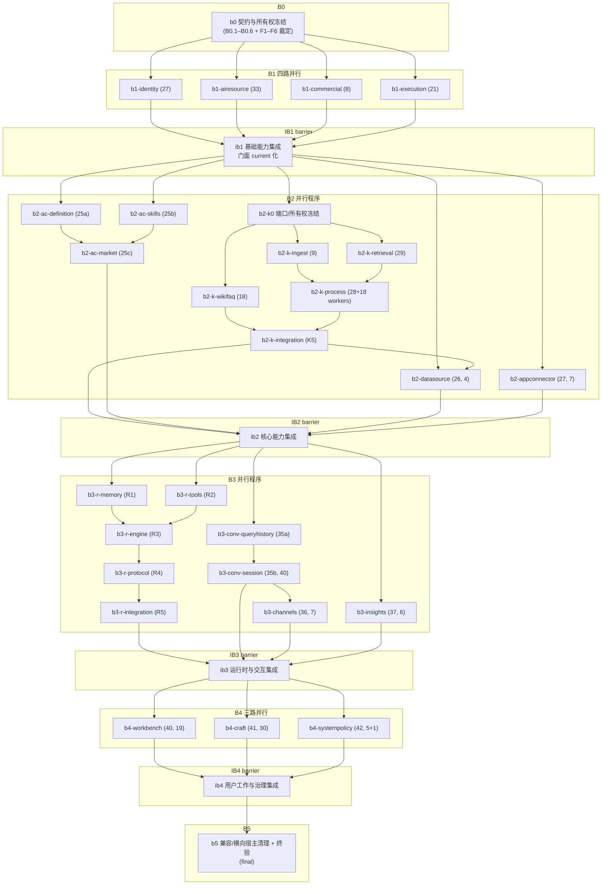

# Pass B 执行 DAG（execution-dag.md）

> 调度事实源是同目录 `execution-dag.json`（33 节点，字段与状态以 JSON 为准）；本文件是其人读视图：Mermaid 依赖图 + 任务表 + 修正记录。执行公约见主 checkout `.superpowers/sdd/passb/conventions.md`（git-ignored 区）。
>
> 基线：integration base = `b1a3d6dd8`（任务书称 `29c1e5635`，实际 HEAD 多 2 个纯前端 parity 提交，不触及 Pass B 文件，全部按 `b1a3d6dd8` 起算）；Pass A 验收 `78f18915f`。计数基线 633 路由 / 23+23 任务类型 / 58 生命周期挂点 / 537 迁移文件 + 396 legacy 文件 / 105 import 例外——语义为**三方一致**（guard 实测 == pass-a-acceptance.md 台账 == manifests 发现值，b0 审计裁定 F5），不是硬编码断言。
>
> 来源：`docs/plans/2026-09-23-backend-modularization-pass-b-framework.md`、`docs/plans/passb/00-contract-and-ownership-freeze.md`、`docs/specs/2026-09-21-backend-domain-module-reorganization-design.md` §11–§17.2、16 份 `docs/architecture/moves/*.yaml`、13 份 `docs/architecture/passb/*.md` brief，叠加架构事实实测（跨模块 import、同包未导出互耦、*Handler 共享）校正。

## Mermaid DAG



## 任务表

| ID | 节点 | Phase | Role | 前置 | 计划 | 模式 | 关键耦合 / 裁定 |
|---|---|---|---|---|---|---|---|
| b0 | 契约与所有权冻结 | B0 | work | — | `00-contract-and-ownership-freeze.md`（已存在） | serial | task_ids B0.1–B0.6；notes 收录审计裁定 F1–F6（movemanifest 共享库 / façade planned-not-current / 事件三元组判重 / replay 语义 / 计数三方一致 / Makefile .PHONY 风格） |
| b1-identity | Identity 边界（27） | B1 | work | b0 | `10-identity.md` | parallel | identity 被消费符号：getJwtSecret/tenantIDFromClaims（←execution）、auditActor/auditActorRole（←system/knowledge）、forUpdateClause（←agentruntime）；isStorageProviderAllowed 归 policy 不在本面（审校 F3） |
| b1-airesource | AI Resource 边界（33） | B1 | work | b0 | `11-airesource.md` | parallel | 下游最重（审校 F6 双口径）：例外口径 agentruntime 32 / conversation 6 / knowledge 4 对，包限定符 203/37/10 处 |
| b1-commercial | Commercial 边界（8） | B1 | work | b0 | `12-commercial.md` | parallel | model_usage 绑定族导出（knowledge 3 符号 + agentcatalog 3 符号）；payment/usage 高风险差分 |
| b1-execution | Execution 边界（21） | B1 | work | b0 | `13-execution.md` | parallel | execution→agentcatalog 4 符号 + →identity getJwtSecret（sandbox_terminal_ticket.go）；反向 conversation→execution 10 调用点（tenant_sandbox_resolve.go）；browserskill/sandbox_terminal_ws 为 *Handler 方法文件 |
| ib1 | 基础能力集成 | IB1 | barrier | b1 四支 | `19-foundation-integration.md` | serial | 集成工程师独占 router/container/bootstrap/migration/go.mod；门面 current 化（F2） |
| b2-k0 | Knowledge 端口冻结 | B2 | work | ib1 | `20-knowledge-program.md` K0 | serial | 分配 Chunk/KnowledgeBase/Tag/semantic 共享类型，K1-K3 并行前提 |
| b2-k-ingest | K1 Ingest（9） | B2 | work | b2-k0 | `21-knowledge-ingest.md` | parallel | K1 9 文件=knowledge-ingest.md:8-16（**不含** kb_activity.go，审校 F1）；buildVLMCaptionPrompt/sanitizeOCRText 为 conversation 调用方导出 |
| b2-k-retrieval | K2 Retrieval（29） | B2 | work | b2-k0 | `22-knowledge-retrieval.md` | parallel | kb_activity.go 归 K2（knowledge-retrieval.md:11）——kb_activity 4 函数为 datasource 调用方导出；kbReadPermissions（←conversation）、applyTenantRoleCap（←agentcatalog） |
| b2-k-wikifaq | K3 Wiki+FAQ（18） | B2 | work | b2-k0 | `23-knowledge-wikifaq.md` | parallel | wiki_fixer_scope.go 为 *Handler 方法文件（freeze:202） |
| b2-k-process | K4 Process（28） | B2 | work | b2-k-ingest, b2-k-retrieval | `24-knowledge-process.md` | serial | 18 worker handler 实现；注册行禁改；K4 被消费符号 withKnowledgeCleanup/deleteReferencedKnowledge/isValidFileType（←datasource/conversation/airesource/insights） |
| b2-k-integration | K5 Knowledge 集成 | B2 | work | b2-k-process, **b2-k-wikifaq** | `20-knowledge-program.md` K5 | serial | **CORR-1**：骨架补 wikifaq 前置 |
| b2-ac-definition | 25a 定义/版本 | B2 | work | ib1 | `25a-agent-definition-version.md` | parallel | agentcatalog→conversation 7 条未导出（session_*.go 系）导出/shim 裁定 |
| b2-ac-skills | 25b Skill 目录 | B2 | work | ib1 | `25b-skill-catalog-install.md` | parallel | tenant_skill_reaper.go 导出化收口 execution→agentcatalog 4 条 |
| b2-ac-market | 25c Marketplace | B2 | work | b2-ac-definition, b2-ac-skills | `25c-marketplace.md` | serial | 消费 25a/25b release/install 门面 |
| b2-datasource | Data Source（4） | B2 | work | ib1, **b2-k-integration** | `26-datasource.md` | serial | **CORR-2**：datasource_service.go（datasource.yaml:59）调用 knowledge 未导出 5 符号 24 调用点（kb_activity 4 函数=K2、withKnowledgeCleanup=K4），先搬必断链；internal/datasource 目录已不存在，仅剩 4 条 legacy + 别名删除（审校 F7） |
| b2-appconnector | App Connector（7） | B2 | work | ib1 | `27-appconnector.md` | parallel | →commercial/agentruntime 引用走门面；测试夹具随迁 |
| ib2 | 核心能力集成 | IB2 | barrier | b2-k-integration, b2-ac-market, b2-datasource, b2-appconnector | `29-core-capability-integration.md` | serial | K 序 + 25 序集成；R0 复核后放行 B3 |
| b3-r-memory | R1 memory/modelcontext | B3 | work | ib2 | `31-agentruntime-memory.md` | parallel | agentruntime→airesource 67 处引用改走门面 |
| b3-r-tools | R2 tools | B3 | work | ib2 | `32-agentruntime-tools.md` | parallel | repository/agent_run.go 的 runScope 等为 craft B4 消费导出 |
| b3-r-engine | R3 engine/run/approval | B3 | work | b3-r-memory, b3-r-tools | `33-agentruntime-engine.md` | serial | 断链（行号经审校 F5 修正）：searchResultFromMap=helpers.go:471（调用点仅 agent_stream_handler.go:431）、artifactHandle=artifact_download.go:442 / rewriteArtifactReferences=artifact_reference.go:56（均 workbench 属主）、agent_run.go *Handler 方法；Agent Run recovery 高风险差分 |
| b3-r-protocol | R4 native/tRPC/OpenCode | B3 | work | b3-r-engine | `34-agentruntime-protocol.md` | serial | engine/protocol 所有权按 freeze:193-196；native_archive.go 自带 NativeArchiveHandler（:16/:23），非 *Handler 方法文件（审校 F4） |
| b3-r-integration | R5 runtime 集成 | B3 | work | b3-r-protocol | `30-agentruntime-program.md` R5 | serial | 恢复竞态 -race；13 条 lint 已知债清偿 |
| b3-conv-queryhistory | 35a QueryHistory（4） | B3 | work | ib2 | `35a-conversation-queryhistory.md` | serial | notes 收录试点复用裁定全文（选择性采纳：文件级移植，禁 merge/cherry-pick） |
| b3-conv-session | 35b Session（40） | B3 | work | b3-conv-queryhistory | `35b-conversation-session.md` | serial | **CORR-3**：保守串行（framework:179 允许 application 并行）；*Handler（67 字段）拆分收口 |
| b3-channels | Channels（7） | B3 | work | b3-conv-session | `36-channels.md` | serial | 等 Conversation 公共 session API（framework:186）；10 别名包删除 |
| b3-insights | Insights（6） | B3 | work | ib2 | `37-insights.md` | parallel | 只读边界；analytics 方言差分 |
| ib3 | 运行时与交互集成 | IB3 | barrier | b3-r-integration, b3-conv-session, b3-channels, b3-insights | `39-runtime-interaction-integration.md` | serial | Task/Artifact 契约冻结供 B4（framework:204） |
| b4-workbench | Workbench（19） | B4 | work | ib3 | `40-workbench.md` | parallel | artifact_download.go 双面耦合点；handler/session 所有权精确不相交 |
| b4-craft | Craft（30） | B4 | work | ib3 | `41-craft.md` | parallel | runScope 等消费 B3 已导出端口；Craft Artifact 高风险差分 |
| b4-systempolicy | System+Policy（5+1） | B4 | work | ib3 | `42-system-policy.md` | parallel | KnowledgeHousekeeping 窄端口（freeze:209）；system→identity 收口 |
| ib4 | 用户工作与治理集成 | IB4 | barrier | b4 三支 | `49-user-work-governance-integration.md` | serial | 冻结 B5 清理台账（实际剩余路径） |
| b5 | 终清理 + 终验 | B5 | final | ib4 | `50-final-cleanup-and-acceptance.md` | serial | 零 alias/零例外/零遗留；`pass-b-acceptance.md` 对 Spec §17.2 |

## 骨架修正记录（相对派发骨架）

- **CORR-1** `b2-k-integration`：depends_on 由 `[b2-k-process]` 修正为 `[b2-k-process, b2-k-wikifaq]`——K5 是 K1–K4 全量汇聚（framework:119-120），漏 wikifaq 会丢 18 文件、`wiki_fixer_scope.go` 与对应别名。
- **CORR-2** `b2-datasource`：depends_on 由 `[ib1]` 修正为 `[ib1, b2-k-integration]`——datasource→knowledge 5 符号 24 调用点同宿主包（`internal/application/service`）跨 owner 未导出调用（调用方 `datasource_service.go` 归属 datasource.yaml:59；定义方分两处：kb_activity 4 函数在 `kb_activity.go`=K2 retrieval（knowledge-retrieval.md:11）、`withKnowledgeCleanup` 在 `knowledge_delete_plan.go:22`=K4 process（knowledge-process.md:12），本会话 grep 双向实证）。保守串行；IB1 若裁定共享 shim/提前导出端口，按基线变更流程回写 DAG 降级并行。
- **CORR-3** `b3-conv-session`：保持骨架串行（35b 依赖 35a）——framework:179 允许 application 层并行、装配串行（QueryHistory 先集成），但 handler/session 宿主包 agentcatalog↔conversation 7 条未导出互耦 + `conversation/module.go` 门面共享，DAG 层取串行为默认；35 计划内部可安排 application 层并行预写。
- **CORR-4** 30 计划的 R0（engine/protocol 所有权 SERIAL CHECK）不设独立节点——裁定已由 B0.3 Step 2 冻结（freeze:193-196），作为 ib2→b3-r-* 派发前置检查写入各节点 required_contracts。
- **CORR-5**（审校 F1）K 面 plan 级归属修正：kb_activity.go 归 K2 retrieval（不归 K1），kb_activity 4 函数导出义务移至 b2-k-retrieval，withKnowledgeCleanup 归 K4（knowledge_delete_plan.go:22）；b2-datasource 依赖边不变（同时覆盖 K2/K4）。

## 审校修正记录（8 项，详见 JSON top-level review_fixes）

| # | 级别 | 修正 |
|---|---|---|
| F1 | important | kb_activity.go 归属 K1→K2（knowledge-retrieval.md:11 / knowledge-ingest.md:8-16）；withKnowledgeCleanup 归 K4；相关导出义务随之迁移 |
| F2 | important | 耦合枚举补全：新增 JSON top-level `package_private_couplings` 全量表（29 owner 对 / 59 符号对 / 108 调用点，含此前漏列的 conversation→execution、agentcatalog→commercial、execution→identity 等 ~29 条），节点 notes 同步补全 |
| F3 | important | b1-identity 归属修正：getJwtSecret 消费方=execution 属主 sandbox_terminal_ticket.go（execution.yaml:47），非 system；isStorageProviderAllowed 定义 internal/handler/storage_allowlist.go:13 归 policy.yaml:27（b4-systempolicy），移出 identity 面 |
| F4 | minor | b3-r-protocol：native_archive.go 定义独立 NativeArchiveHandler（:16/:23/:27/45/58），非共享 *Handler 方法文件 |
| F5 | minor | b3-r-engine 行号/文件修正：searchResultFromMap=helpers.go:471（:190 是 buildStreamResponse）；调用点仅 agent_stream_handler.go:431；rewriteArtifactReferences=artifact_reference.go:56（workbench.yaml:67）、artifactHandle=artifact_download.go:442 |
| F6 | minor | 引用计数改双口径（本会话实测）：例外口径 32/6/4/13，包限定符口径 203/37/10/99；原 67/7/7/31 作废 |
| F7 | minor | b2-datasource：internal/datasource 已不存在（Pass A 完成 12 个 move_packages），仅剩 4 条 legacy 文件 + 别名删除 |
| F8 | minor | b2-k0 写权限澄清：contracts.yaml 对 K0 只读、knowledge 契约区状态回写归 ib2；K0 冻结产物写入 20 计划分配表与代码；conventions §3 补子程序 freeze 节点条款 |

另（审校后新发现，记入 b0 notes）：`internal/application/repository/knowledge.go`（knowledge.yaml:87，escapeLikeKeyword 定义处）未被任何 K brief scope 枚举——B0.2 ownership-matrix 必须显式分配。

## package-private 耦合全量表（摘要）

完整数据在 `execution-dag.json` top-level `package_private_couplings`（29 owner 对/59 符号/108 调用点）。按 sites 降序前 10：

| caller→def | sites | symbols |
|---|---:|---|
| datasource→knowledge | 24 | kbActivityTrigger, recordKBActivity, withKBActivitySuppressed, withKBActivityTask, withKnowledgeCleanup |
| conversation→knowledge | 11 | buildVLMCaptionPrompt, deleteReferencedKnowledge, escapeLikeKeyword, isValidFileType, kbReadPermissions, sanitizeOCRText |
| agentcatalog→conversation | 10 | resolveSandboxForExecution, sandboxConfigForExistingSandbox, sessionSandboxFileStore, sessionSandboxInstallShellExecutor, sessionSandboxShellExecutor, sessionUserIDFromContext, uniqueNonEmptyStrings |
| conversation→execution | 10 | browserSkillScope, resolveTenantSandboxForConfig |
| execution→agentcatalog | 5 | matchSnapshotByName, skillSnapshotNamePrefix, snapshotsNotFromOtherConfig, validateUserEnvName |
| agentcatalog→commercial | 5 | customAgentModelUsageBindings, scopeCustomAgentsByModelID, scopeCustomAgentsBySandboxConfigID |
| craft→agentruntime | 5 | runScope, runView, toolCallScope |
| knowledge→commercial | 4 | knowledgeBaseModelUsageBindings, scopeKnowledgeBasesByModelID, semanticBudgetFailure |
| agentcatalog→knowledge | 3 | applyTenantRoleCap |
| execution→identity | 3 | getJwtSecret, tenantIDFromClaims |

（其余 19 对各 1–3 sites，见 JSON。）复现脚本（本会话执行的符号级分析，python3 正则近似 + 注释/字符串剥离 + 定义行掩码）：

```bash
python3 - <<'EOF'
import re,glob,os,collections
owner={}
for mf in glob.glob('docs/architecture/moves/*.yaml'):
    mod=os.path.basename(mf)[:-5]
    for line in open(mf):
        m=re.match(r'\s*-\s*path:\s*(\S+)',line)
        if m: owner[m.group(1)]=mod
HOSTS=['internal/application/service','internal/application/repository','internal/handler/session']
def strip(code):  # 剥离 //、/* */、字符串/原始字符串
    ...
defs={}
for pkg in HOSTS:
    for f in glob.glob(pkg+'/*.go'):
        if f.endswith('_test.go'): continue
        code=strip(open(f).read())
        for m in re.finditer(r'^func ([a-z][A-Za-z0-9_]*)\(',code,re.M):
            defs.setdefault(m.group(1),set()).add(f)
# 对每个非测试文件掩码定义行后匹配同包裸标识符调用，caller_owner!=def_owner 计入
# 结果：59 符号对 / 108 调用点 / 29 owner 对（完整脚本见会话记录；审稿人同法独立得 54/102）
EOF
```

已核查（本会话执行）：无环路、无悬挂前置、无重复节点 id、每节点 19 个必备字段齐全（`python3` 校验脚本，33 节点通过）；同一文件多写由 b0 产出的 ownership-matrix 单一属主约束 + 集成节点独占装配文件消除；「上游未冻结就开下游」由 façade planned/current 两区状态（F2）与 barrier 边消除。

## 字段与回填

字段语义、`status/base_sha/head_sha/review_status/task_ids` 回填规则、门禁 argv 展开方式（`["test",pkgs]`→`go test -count=1`、`["make",t]`、`["sh","-c",cmd]` 中 `$PASSB_BASE_SHA` 替换）见 `.superpowers/sdd/passb/conventions.md`。计划文件 `10-*.md`–`50-*.md` 尚未撰写，按 framework「Child Plan Authoring Order」逐阶段编写并在评审通过后回填各节点 `task_ids`。
