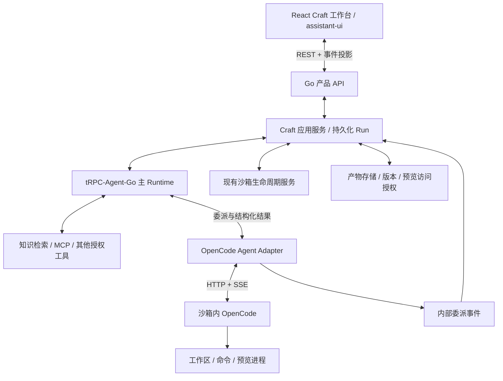

# WeKnora Craft 双 Runtime 架构规格

日期：2026-09-10。状态：用户已确认架构方向；本文为据此细化的规格，尚未实施或运行验收。

## 1. 已确认决策

- WeKnora-fork01 正在迁移 React，Craft 沿用该改造的共享包方向。
- React + assistant-ui 承担对话交互；作品文件树、预览和版本视图是独立工作台组件。
- tRPC-Agent-Go 是主 Agent Runtime，拥有主 Agent 的推理、上下文、工具选择和执行循环。
- 主 Agent 通过 OpenCode Agent Adapter 委派任务；OpenCode 在沙箱中拥有独立的编码执行循环。
- 产品后端管理用户可见的会话、Run、权限、审批和产物；两个 Runtime 的内部状态不替代产品权威记录。

本次确认不扩大为全仓库 Agent 替换、支付改造、移动端 Craft 或公开应用托管。下文首版范围与具体接口是实施建议，不将其描述为用户逐项批准。

## 2. 证据与当前边界

静态核查基线：WeKnora-fork01 `e211610983e387316746b55e056d7208e83d46db`；wanwu `99df6e41d4141276553320b6f9a705d432c14bd7`。基线仅标识提交，实施前还需核对工作区改动。

| 证据 | 结论 | 限制 |
|---|---|---|
| `frontend/package.json` 与 React 迁移规格 | 已有 Vue 发布源，目标 React 共享包 | 文件现状不否定用户正在推进的迁移；不修改另一任务的文档状态 |
| `internal/agent/engine.go`、`go.mod` | 当前根模块仍有自有 ReAct engine，未声明 tRPC-Agent-Go | 新 Runtime 接入是独立增量；不能宣称已迁移完成 |
| `internal/sandbox/session_binding.go` | tenant/session 沙箱绑定、生命周期锁和配置失效能力可作集成入口 | 不直接把绑定存储当作完整 Craft Run 数据库 |
| `internal/application/service/artifact_collector.go`、`internal/types/artifact_versions.go` | 已有产物收集与历史版本引用语义 | 尚未验证 Craft 预览服务和工作区快照完整性 |
| wanwu `pkg/wga-sandbox/internal/runner/opencode/opencode.go` | HTTP session、先订阅 SSE 再提交 prompt、输出收集 | AfterRun 删除 session；全局 SSE 和兼容事件不能未经筛选照搬 |
| wanwu `pkg/ag-ui-util/translator_opencode.go` | 文本、工具、问题事件映射参考 | 不是本产品父子 Run、持久化与审批契约 |

以上是源码和文档分析；未运行应用、模型调用、容器或测试。未读取密钥配置。

外部参考（2026-09-10 调研）：

- [Onyx Craft 产品流程](https://github.com/onyx-dot-app/onyx/blob/main/web/src/app/craft/README.md)：知识与文件生成作品、预览、迭代、会话恢复。README 含旧部署表述，部署细节以专门架构文档及选定版本源码为准。
- [Onyx Craft 镜像架构](https://github.com/onyx-dot-app/onyx/blob/main/docs/craft/infra/image-architecture.md)：OpenCode 位于沙箱，后端通过 HTTP 对接。借鉴边界，不搬入其 Python/Celery 栈。
- [OpenCode Server](https://opencode.ai/docs/server/)：HTTP/SSE 服务接口。实施时冻结二进制版本和对应 OpenAPI/事件 fixtures。
- [assistant-ui ExternalStoreRuntime](https://www.assistant-ui.com/docs/runtimes/custom/external-store)：外部状态映射到 UI，不要求由组件拥有持久化。
- [tRPC-Agent-Go AG-UI](https://trpc-group.github.io/trpc-agent-go/agui/)：主 Runtime 对外事件接口参考，不等于现有聊天协议已经是 AG-UI。

## 3. 产品闭环与非目标

首版建议以单个网页报告作为纵向切片：用户上传数据并描述目标 → 主 Agent 获取授权知识/文件 → 委派 OpenCode → 沙箱生成并启动网页 → 展示工具进度与预览 → 用户继续修改 → 刷新页面后恢复 → 下载指定版本。

用户能区分主 Agent 的解释和 OpenCode 的执行过程，看到失败原因、取消结果和待处理交互。下载历史版本不得悄悄变成最新文件。

首版不要求通用网站发布、域名绑定、多人实时编辑、并发修改同一工作区、完整 PPT/表格编辑器、移动原生 Craft、替换全部历史聊天路由。计费系统选型与价格不在本规格；必须记录两个 Runtime 的原始模型用量和关联标识，以便现有计量入口后续接入，不能重复汇总父子调用。

## 4. 组件边界



主 Agent 决定何时检索、委派与检查结果。OpenCode 内部一次委派可多轮调用工具，无需每次回到主 Agent 决策。委派工具返回结构化结果；执行中的子事件通过独立事件通道展示，不作为伪造的主 Agent 消息注入历史。

Go 产品 API 继续承担鉴权；不增加 Next API 代理层。现有聊天和新 Craft 入口分别适配协议，禁止直接把旧 SSE 消费者切换到 AG-UI。

## 5. 身份与权威

| 标识 | 所有者 | 含义 |
|---|---|---|
| tenant_id / user_id | 产品后端 | 来自可信认证上下文，不能接受模型提供的归属 |
| conversation_id | 产品后端 | 用户可恢复的协作会话；复用现有 Session 标识语义 |
| run_id | 产品后端 | 用户一次执行的主 Run |
| delegation_id | 产品后端 | 一次 OpenCode 委派及幂等键 |
| workspace_id | 产品后端 | 作品工作区，首版一个会话绑定一个工作区 |
| sandbox_id + generation | 沙箱服务 | 当前承载实例与重建代次，防止旧实例事件污染新实例 |
| opencode_session_id | OpenCode | 工作区对应的执行历史，由后端持久化映射 |
| source message_id / part_id / request_id | OpenCode | 事件去重、工具和人工交互关联 |

所有查询、命令、事件、文件和交互均校验 tenant + conversation + workspace 归属。Tenant Go 标识保留 uint64；跨前端的内部契约规范化为十进制字符串，按 React 迁移的 wire 兼容规则处理。

主 Runtime 管理主上下文；OpenCode 保留编码上下文。产品数据库保存用户可见状态、父子关联和恢复信息，不复制两套可独立改变的主会话。主 Agent 接收结果摘要和引用，按需读取文件，不反复塞入完整执行日志。

## 6. 委派行为契约

拟新增内部端口 `Executor`：

```go
type Executor interface {
    Execute(context.Context, Request, Sink) (Result, error)
    Cancel(context.Context, Identity) error
    Respond(context.Context, Identity, InteractionResponse) error
}
```

端口位于 `internal/craft/delegation`，不依赖 React、AG-UI 或 tRPC-Agent-Go 类型。HTTP/SSE 实现在 `internal/craft/opencode`。这两个目录是建议新增目录，不能被误认为当前已存在。

- Request：Identity、task、输入资源引用、截止时间。权限、模型、预算和沙箱连接信息由服务端配置，模型只能提供任务和授权资源引用。
- Result：delegation_id、status、summary、artifact refs、验证记录、模型调用 usage。编译通过、测试通过与网页可访问必须分别报告，未运行不能推断为通过。
- Sink：接收内部 Event 并返回错误；事件持久化失败使执行进入核对流程，不能静默丢失后报告成功。
- Execute 是阻塞到委派终态的内部调用，由服务端工作任务承载；浏览器断开不取消该上下文。
- Cancel 幂等发起下游 abort；请求成功只代表已接受，必须核对远端停止才能进入 cancelled。
- Respond 按 InteractionID 校验一次性回复与权限；相同回复幂等，冲突回复失败。question 与 permission 分离；不能将回答问题等同于批准工具权限。

首版同一工作区串行执行。对活跃工作区的另一委派返回冲突，不隐式并发覆盖文件。重复 delegation_id 的同内容请求返回已有执行，内容冲突返回冲突；需要数据库唯一约束与请求摘要，不靠进程内 map 提供生产保证。

## 7. 状态、事件与异常

主 Run 状态由应用服务负责。委派状态：queued → running → waiting_input / waiting_approval → running → succeeded / failed；running 或等待态可进入 cancelling → cancelled。`reconciling` 表示提交、连接或停止结果不确定；不等价于失败或允许再次提交。

- prompt 超时但可能已被接收：标记 reconciling，检查 OpenCode 状态/消息；没有证据前不自动重放 prompt。
- SSE EOF：只说明连接结束，不能当作成功；重新查询消息和状态，无法证明结果则保持 reconciling。
- 初始 idle 或旧轮次 idle：不能结束新委派；必须关联本轮提交后的消息/活动和最终状态。
- 子任务 succeeded：只结束该 delegation；主 Agent 仍可检查产物或继续委派，只有主 Runtime 的结果能结束主 Run。
- 取消：保留取消意图，使用服务端独立超时上下文调用 abort；失败则保持 cancelling/reconciling，并给用户可重试状态。
- 进程重启：扫描非终态记录，核对沙箱 generation、OpenCode session 与消息，再恢复投影。不能自动再次创建同一副作用任务。

Event envelope 至少包含 version=1、tenant_id、conversation_id、run_id、delegation_id、workspace_id、sandbox_generation、event_id、sequence、kind、source_id、payload。sequence 由持久化发布层在单 delegation 内单调分配；event_id 用于重放去重。来源事件无可靠 ID 时对照 message/part 快照生成差异，不能声称原始 SSE 支持 exactly-once。

内部 kind：text、tool、interaction_required、interaction_resolved、artifact、usage、status。未知 wire 事件保留类型诊断，不打印敏感原文；未知必需控制事件使兼容检查失败，不能忽略后宣布完成。

前端使用 Snapshot + 有界事件游标恢复；游标过期返回需要重新读取 Snapshot 的明确结果。只有实现事件持久化后才能宣称支持游标续传。AG-UI 投影保留父子 ID；OpenCode 终态不能转换成主 Run 的 RUN_FINISHED。

## 8. 沙箱、文件与人工交互

复用现有 tenant/session 沙箱解析和生命周期锁，增加工作区到 OpenCode session 的持久映射。执行完成保留工作区与 session；显式会话删除或保留策略触发清理，不能照搬 wanwu AfterRun 删除行为。

休眠快照必须包含作品文件以及选定 OpenCode 版本实际使用的会话数据；只保存工作区文件不足以保证编码上下文恢复。恢复时核对版本、文件清单和 session 可用性；失败向用户显示恢复失败，不能暗中空会话续跑。

产物保存为可授权访问、不可变版本引用，沿用 `resource://` 语义。拒绝越界路径和符号链接逃逸，历史引用保持原对象。预览 URL 经后端按资源授权解析，不采信模型生成的任意 URL。可执行预览隔离 origin、限制 iframe 权限，不携带产品凭证；沙箱内服务端口不直接对公网暴露。

OpenCode 凭证和模型凭证留服务端/受控沙箱；不写消息、日志或前端状态。知识工具仍遵守用户资源权限。主层已批准范围不代表 OpenCode 获得全局自动批准，模型不能自行回复权限请求。

## 9. React 对接与迁移兼容

沿用 [React 多端设计](2026-09-10-react-multiclient-design.md) 的目录职责：

- `packages/contracts/src/craft/`：wire DTO/schema 与 fixtures。
- `packages/api-client/src/craft/`：Snapshot、命令、事件订阅和授权下载客户端。
- `packages/domain/src/craft/`：纯 reducer、父子 Run 关联、产物选择规则。
- `packages/core/src/craft/`：React 状态绑定与 assistant-ui ExternalStoreRuntime Adapter。
- `packages/views/src/craft/`：对话、活动、文件和预览工作台。
- `apps/web`：路由与浏览器能力接线；具体路由文件随 React 迁移结果核定。

上述是目标路径，不抢先创建迁移任务管理的包、manifest 或路由。新增 assistant-ui 依赖时由 React 包所属任务统一锁版。原生移动不导入 DOM assistant-ui；桌面后续以平台能力验证，不将 Web 成功视作桌面验收。

assistant-ui 是投影与操作入口，持久化事实来自产品 API；页面刷新先拉 Snapshot，再接事件并去重。切 tenant、登出时取消订阅并阻止迟到事件写回旧状态。

## 10. 分期与验收门槛

| 阶段 | 可验收交付 | 前置条件 |
|---|---|---|
| P1 | 独立 Go OpenCode Adapter：创建/复用 session、执行、流式映射、取消、协议核对 | 固定 OpenCode wire profile；详见首阶段计划 |
| P2 | 持久化会话/委派、幂等锁、审批回复、恢复、服务端任务接线 | P1；数据库/任务入口文件级设计 |
| P3 | tRPC-Agent-Go 主 Agent 真实委派 OpenCode，检查产物并回复 | P2；冻结 tRPC-Agent-Go 版本、工具/事件 API；独立 Craft 入口 |
| P4 | React/assistant-ui 工作台完成网页报告闭环 | P3；React contracts/domain/core/views 基础可用 |
| P5 | 重启与休眠恢复、隔离预览、跨租户否定验证、发布回退 | P4；真实沙箱与浏览器环境 |

P2–P5 先列交付门槛，实施各阶段前输出该阶段文件级任务计划；不将宏观路线图伪装成已具备精确 API 的执行计划。

最终验收必须覆盖：连续两轮修改同一作品；版本下载正确；浏览器断开后重连不重复执行；服务端重启可核对；取消确实停止远端；提问/审批往返；错误不冒充完成；跨 tenant 的事件、文件、回复及预览被拒绝；主 Agent 收到子结果后才能完成；父子模型调用计量不重复。

## 11. 取舍与风险

双 Runtime 提供 Go 主流程与成熟编码循环，但增加事件、上下文、取消和恢复边界。若实际产品始终只是单次编码代理，上层编排成本可能不值得；若必须完全统一工具执行与模型策略，再评估替代 OpenCode，不在本次任务隐式扩展。

主 Agent 与 OpenCode 都可能产生模型调用；首版默认单活跃工作区任务并设置截止时间。运营成本主要受模型循环、沙箱驻留、快照与预览服务影响，本次未核实供应商价格，不给预算数字。

## 12. 交付索引

- [P1 OpenCode Adapter 实施计划](../plans/2026-09-10-craft-opencode-adapter.md)
- [Craft 进度记录](../plans/craft-runtime-progress.md)

本文新增独立 Craft 规格，不覆盖 React 迁移规格中“不更换 Agent 引擎”的迁移范围约束；该约束继续适用于 React 等价迁移，Craft 是明确新增的产品能力。
