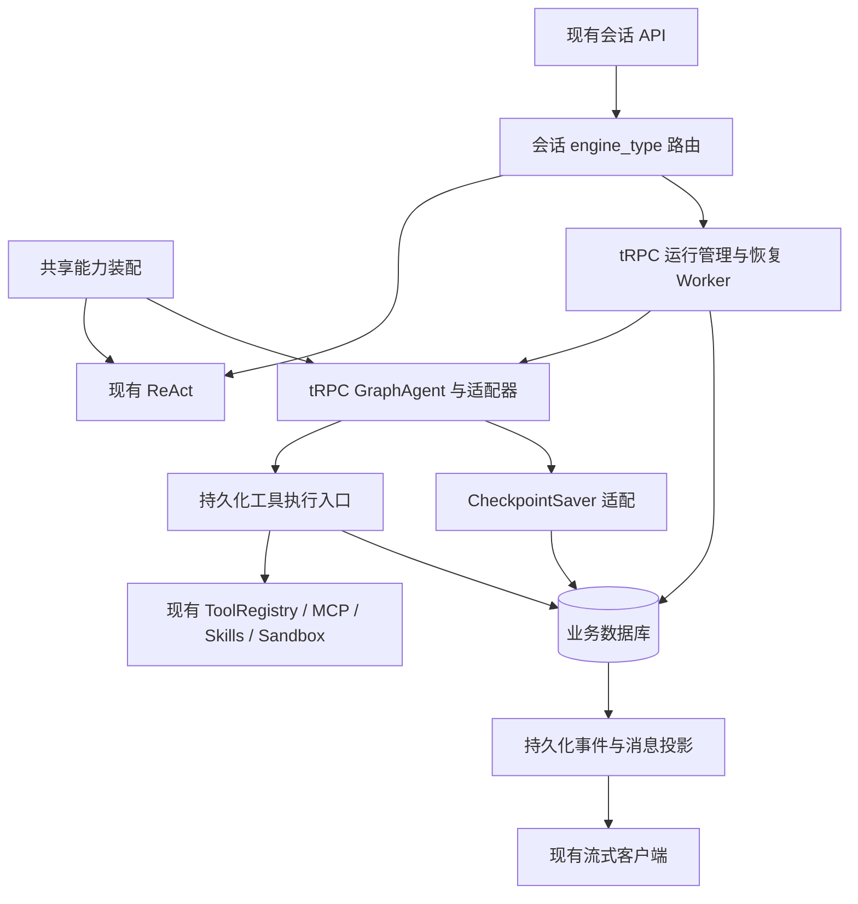

# 双 Agent 与 tRPC 持久化恢复设计

日期：2026-09-10。状态：用户已确认，进入实施计划阶段，尚未进入实现。

## 1. 已确认范围

- 同一后端保留现有自研 ReAct，并新增 tRPC-Agent-Go。
- 两种引擎用于不同会话；一个会话固定一种引擎，不做同会话双引擎执行或中途切换。
- 复用现有 MCP、Skills、Sandbox、Tools、模型配置、权限、消息存储与事件协议。
- 仅 tRPC 首版支持后端重启、进程崩溃后的未完成运行恢复；现有 ReAct 不增加恢复保证。
- 工具执行结果不明且不能安全查询或幂等重试时，持久化暂停，等待用户。
- 本设计覆盖后端进程故障；不承诺数据库丢失恢复、任意外部操作 exactly-once 或任意 Sandbox 内存快照恢复。

## 2. 证据与检查范围

本地基线：`e211610983e387316746b55e056d7208e83d46db`，仓库 `/Users/wuyongjun/trea/WeKnora-fork01`。

| 已检查代码 | 观察与影响 |
|---|---|
| `internal/types/interfaces/agent.go` | 已有 Execute、SetMemoryPrompt、SetSteerSink；保留现有接口语义，恢复调度采用独立入口 |
| `internal/application/service/agent_service.go` | CreateAgentEngine 同时负责共享能力装配和具体引擎构造，需要拆分 |
| `internal/application/service/session_agent_qa.go`、`agent_history.go` | 每轮从业务消息库加载历史；恢复运行不能重新拼接一份变化后的历史 |
| `internal/agent/tools/registry.go` | 已有工具执行入口、稳定排序、延迟公开、名称冲突保护；适配必须保留 |
| `internal/models/chat/chat.go` | 已有 Chat/ChatStream 及模型身份接口，可适配 tRPC 模型协议 |
| `internal/agent/compaction/compactor.go` | 当前 checkpoint 指上下文摘要，不是执行恢复快照 |
| `internal/agent/approval/gate.go` | Pending waiter 在进程 map/channel 中，Redis PubSub 用于跨实例转发；不能作为持久化等待来源 |
| `internal/handler/session/agent_stream_handler.go`、`steer.go` | 已有事件投影、消息收尾和追加消息；需要为 tRPC 解耦客户端连接与运行寿命 |
| `internal/sandbox/sandbox.go` | 公共 Execute 接口没有统一持久化任务查询协议；需要增加可选恢复能力 |
| `internal/types/session.go` | 已有会话租户/用户归属和 Sandbox 配置 pin，不能用配置 pin 代替任务身份 |

这是针对 Agent 路径的静态检查，未执行应用、数据库迁移、测试或 Sandbox 故障实验；未逐文件审计全部工具、模型提供商和数据库方言。已有 React 迁移文档不在本次改动范围。

官方依据（2026-09-10 查阅）：

- [GraphAgent](https://trpc-group.github.io/trpc-agent-go/graph/)：提供图执行、checkpoint saver、interrupt/resume。选用 BSP 图执行作为恢复边界，不由此推断外部工具恰好执行一次。
- [Noop Session](https://trpc-group.github.io/trpc-agent-go/session/noop/)：允许应用持有完整历史；Graph checkpoint 与 Session 历史是不同能力。不能依赖 Noop 恢复业务等待或历史。

以上是文档依据，非已验证的 SDK 接入结果。实施第一步必须固定依赖版本，并验证保存器接口、恢复输入、pending writes 和流式事件；禁止使用浮动版本或个人绝对路径 replace。

## 3. 方案与取舍

| 方案 | 优点 | 代价 / 结论 |
|---|---|---|
| tRPC GraphAgent + 专用持久化运行层 | 图负责推进与状态恢复，业务层负责工具结果和故障接管；满足范围 | 需要保存器、工具日志和事件适配；推荐 |
| tRPC 普通 LLM Agent + 自建全套恢复循环 | 容易从普通聊天接入 | 恢复位置和重放约束大部分自行实现，削弱采用框架的收益 |
| 两引擎统一迁入新持久化运行框架 | 统一执行语义 | 扩大旧引擎改造与回归范围，与已确认范围不符 |

本次不做其他框架选型比较，tRPC 已由用户指定。若固定 SDK 版本无法把持久化边界放在真实工具调用之前，应先调整 tRPC 图节点适配，不能用普通聊天历史重放替代恢复保证。

## 4. 模块边界

共享的是服务、配置解析、权限规则和实现代码。ToolRegistry、延迟工具公开状态、Skills manager、上下文容器及事件对象按运行创建，不能成为跨会话可变单例。

推荐新增 `internal/agent/trpc/`（图、模型/工具/事件适配）、`internal/agent/runtime/`（仅供 tRPC 的恢复契约）、相应 application service/repository/types 文件。目录名称为本设计提案，不表示文件已存在。

旧引擎走原执行路径；只接受共享装配提取所需的行为保持改动。tRPC 禁止再次启用框架自己的 MCP、Skills、Sandbox 执行实现绕过现有权限入口。

## 5. 会话与运行入口

会话增加不可变 `engine_type`：`builtin` / `trpc`。已有会话及未指定字段的客户端默认为 builtin。引擎选择独立于 custom agent 身份和模型选择；更换 custom agent 不得悄悄更换引擎。

tRPC 每条用户请求创建独立 Run。租户内客户端请求键去重；同键不同请求内容返回冲突。同会话最多一个非终态 Run，waiting_user 也占用该位置；通过事务和 session 活跃运行 CAS 保证，不只依赖进程锁。其他会话可以并发执行。

受理事务写入用户消息、assistant 占位消息、Run 与初始状态后才返回成功。Worker 使用持久化身份重建 context；HTTP/SSE 断开仅停止订阅，不取消 Run。新请求若已有活跃 Run，返回现有 Run 信息和冲突；运行中注入/排队走明确的 steering 入口。

## 6. 数据与状态契约

使用现有业务数据库的事务与 repository 模式，不新增必须部署的工作流服务。所有支持的数据库方言需实现相同 CAS/唯一性语义；未通过恢复验收的方言不得开启 tRPC 恢复功能。

| 记录 | 必要内容与约束 |
|---|---|
| Run | tenant、owner、session、request、assistant_message、engine、状态、wait_reason、配置快照、graph/sdk/schema 版本、lease_owner/expires、epoch、revision、预算与截止时间 |
| Checkpoint | run、namespace、checkpoint_id、parent、序号、graph state、pending writes、消息与压缩状态、配置摘要；只暴露已提交快照 |
| ToolCall | run、逻辑调用 ID、调用序号、工具稳定身份/版本、参数摘要与参数、恢复策略、幂等键、状态、外部任务引用、完整结果或持久化结果引用 |
| ToolAttempt | tool_call、attempt、epoch、dispatch 状态、时间、错误、外部执行凭据；保留人工重试前后两次执行的审计关系 |
| RunEvent | run、递增 seq、attempt、事件类型和 payload；唯一 `(run, seq)`，支持持久化回放 |
| UserDecision | run、pending_id、tool_call、expected_revision、decision_id、操作人、动作、结果与原因；同一等待只接受一次有效处理 |
| RunInput | run、steer_id、消息、注入/后续模式、处理游标；接受确认必须在持久化之后 |

Run 状态：queued → running → succeeded/failed/canceled；running 可进入 recovering 或 waiting_user；recovering 经核对进入 running/waiting_user/failed。用户处理成功将 waiting_user 变为 queued，由 Worker 继续。waiting_user 释放 Worker 和租约，不保留阻塞 goroutine。

配置快照固定模型 ID 与参数、提示词、工具/知识范围、Skills 内容摘要、Sandbox 绑定和运行预算。凭据存引用并在恢复时重新解析，不把 API key 放进 checkpoint。恢复必须重新校验当前租户、用户和资源权限；权限收窄不能被旧快照覆盖。资源或版本不可用时以具体原因暂停/失败，不能静默换模型或工具实现。

## 7. 图与 checkpoint

使用显式图节点：prepare → model → persist_tool_plan → dispatch_one_tool → apply_result → model；无工具调用时 finalize。首版同一 Run 内串行执行工具，跨 Run 并行。

同一模型响应包含多个工具调用时，apply_result 返回 dispatch_one_tool 处理下一项；整批结果齐备后才回到 model。持久化批次游标，不能漏掉剩余调用或给模型输入缺少结果的 tool_calls。

- model 节点每次只完成一次模型请求，不嵌入无法观测内部工具的完整自主循环。
- 模型响应和整批工具调用计划持久化成功后，才允许工具执行。逻辑调用 ID 从持久化响应绑定，恢复不能重新生成后执行同一计划。
- saver 必须保留完整 graph state、pending writes 和恢复所需元信息，不能仅实现“messages JSON 存取”。命名空间包含 tenant/run/graph_version，不按 session 共用一个 latest。
- 结果先落 ToolCall，再推进图快照。若结果已提交但 checkpoint 未提交，重放节点从 ToolCall 取结果，以调用 ID 去重应用，不再次执行工具。
- 不假定 SDK saver 能与业务写入共享一个事务：checkpoint 与工具日志允许前后提交，但禁止 checkpoint 宣称工具完成而日志没有对应结果；遇到不一致停止恢复并报告。
- 图消息快照是该 Run 的恢复输入；业务消息库是跨轮历史和展示来源。恢复同一 Run 不重复导入历史、不再次追加原始用户请求。
- 模型生成中崩溃可新建 model attempt 重试，但只有完整落库的响应能驱动工具。旧 attempt 的未完成文本标记废弃，新输出替换而非无条件拼接；实际模型消耗保留 attempt 归属，未知消耗不伪记为零。
- compaction 保留已有算法，但压缩结果、保留消息及摘要边界进入 graph state，不能从摘要推断工具是否执行过。

## 8. 工具恢复与人工等待

执行协议：持久化 planned → 验证权限及审批 → 持久化 dispatching → 调用工具 → 持久化 result → 推进 checkpoint。dispatching 先落库，故障后保守视为“可能已执行”。

| 状态 / 能力 | 恢复行为 |
|---|---|
| planned，确定尚未 dispatch | 验证当前权限后执行 |
| succeeded，结果完整 | 复用结果，不重新调用 |
| 结果不明，支持查询 | 查询稳定外部任务 ID；running 则观察，完成则收集结果；not found 只有提供商保证代表未执行才可重发 |
| 结果不明，具备已验证幂等能力 | 相同作用域/参数/幂等键重试；幂等有效期过期转等待 |
| 结果不明，已确认只读且安全重试 | 有界重试；只读不是工具名称推测，必须有实现级声明 |
| 其他结果不明 | waiting_user，原因 tool_outcome_unknown |

MCP 的只读或幂等 annotations 只能作为提示，不能自动获得安全重试保证。未分类工具默认等待策略。Skill 中执行的 Shell 命令按 Shell 工具判断，不能因 Skill 已安装就视为幂等。工具返回超时/取消/网络错误不等于外部没有执行。

重放必须恢复动态 MCP 工具公开状态、工具稳定服务身份、Skills 版本与输出截断规则。模型侧截断内容与业务完整结果分别保存，禁止丢掉恢复所需结果。

等待界面提供：重新执行、提供结果后继续、终止运行。重新执行记录用户接受可能重复的原因并创建新 attempt，不覆盖旧 attempt；提供结果必须符合工具结果 envelope、大小与类型限制，并标记人工来源，不能伪装为外部验证成功。停止不声称已经回滚副作用。

现有 MCP 审批规则与 OAuth 校验继续复用；tRPC 的等待载体改为持久化 pending 状态。执行前审批和执行后结果不明是两种不同 wait_reason，UI 不能混用“批准”。参数修改形成新的调用版本，审批绑定参数摘要；旧审批不能授权新参数。

## 9. 租约与故障接管

启动扫描及周期扫描 queued 和租约到期的 running。数据库时间判定租约，原子 CAS 获取 ownership 并递增 epoch；所有状态提交、checkpoint 保存和新工具 dispatch 检查 epoch 与租约有效性。租约丢失后旧 Worker 停止推进。

fencing 只能阻止旧 Worker 写回数据库及通过本地入口启动后续操作，不能撤回已经发往外部的命令。接管者不得因拿到新租约就重新执行 dispatching 工具，必须执行第 8 节策略。

等待中的 Run 不自动恢复；重复扫描不会重复产生待确认项。基础设施暂不可用采用有限退避，权限撤销或版本不兼容用明确原因阻止执行。重启不重置最大轮数、工具次数、执行预算和绝对截止时间。

## 10. Sandbox 边界

复用现有 Docker/Cube/E2B 实现，增加可选恢复能力适配：绑定已有实例、按任务 ID 查询、获取结果和明确取消。保存 provider/config/instance/workspace/task 身份及 generation，验证租户和会话归属。

同一 Run 恢复优先接回原 Sandbox。任务仍运行则观察；有持久化结果则导入。仅有进程 PID 或“容器存在”不能证明指定命令状态。

现有公共 Execute 接口不足以保证任意 Shell 的结果查询。首版对不具备可靠查询能力的后端，Shell 的不明结果进入 waiting_user；这仍是显式恢复流程，不算自动恢复成功。可靠任务执行需要提交前记录稳定任务 ID，并由后端保证去重或可查询。

Sandbox 已删除、TTL 到期或工作目录缺失时，进入 waiting_user/sandbox_unavailable，禁止创建空 Sandbox 冒充恢复。仅在有完整且验证通过的工作目录/产物快照，并且不存在不明旧任务时才可重建后继续；首版不承诺任意进程内存恢复。清理器必须识别活跃 Run 的资源引用；资源 TTL 无法续期时提前标记风险状态，不假设永久存活。

## 11. 事件、用户处理和取消

沿用业务事件种类并增加 run_id、seq、attempt_id、运行状态和等待原因。事件先持久化再发布，Redis/内存流只作为投递通道；客户端按 seq 去重并从 Last-Event-ID 补读。过期回放游标返回明确重载要求和消息快照，不静默漏事件。

将 tRPC 消息投影与 SSE handler 生命周期解耦。finalize 的 Run 终态、assistant 最终消息和完成事件在同一数据库事务写入；重复恢复不生成重复答案或重复业务完成副作用。

新增后端契约（路径为拟议接口，遵循现有会话路由前缀）：

- `GET /sessions/:session_id/runs/:run_id`：状态、恢复能力、等待信息、最近事件序号。
- `GET /sessions/:session_id/runs/:run_id/events`：SSE 回放与订阅。
- `POST /sessions/:session_id/runs/:run_id/decisions`：pending_id、decision_id、expected_revision、action、可选结果/原因；重复相同请求返回原结果，冲突返回 409。
- `POST /sessions/:session_id/runs/:run_id/cancel`：持久化取消意图；停止新 dispatch，尝试取消外部任务，并保留无法确认终止的状态说明。

所有接口验证租户、session owner 和现有共享访问规则，不信任客户端 run_id 所指归属。普通新消息不能意外解除等待。Steering 输入按 steer_id 持久化并在安全节点边界恰好应用一次；排队后续请求只在前一 Run 终态后受理执行。

首版需要最小客户端配套：新会话选择引擎、运行/等待状态、三个处理动作、重连和生成 attempt 替换。实现沿用届时仓库的客户端结构，本设计不决定并行 React 迁移的路线；无 UI 的 API 客户端使用相同契约。

## 12. 验收与交付顺序

1. 固定 tRPC SDK 版本，验证单次模型节点、真实 saver/pending writes、中断与恢复；此步骤通过才展开接入。
2. 提取共享装配并增加会话引擎路由；旧 ReAct 行为回归及两会话隔离通过。
3. 实现 Run、checkpoint、工具日志、租约、身份重建和后台调度；完成一个模型 → 工具 → 模型的重启恢复纵向链路。
4. 接入完整现有能力：模型流式/多模态、MCP 动态公开与审批、Skills、Sandbox、记忆、compaction、steering、引用与产物。
5. 实现持久化等待、决策接口、事件回放及最小客户端；最后做跨进程故障验收。

必要故障注入验收：

- 初始 Run 提交后、首次执行前杀进程：自动找到原 Run，用户消息只出现一次。
- 工具计划提交后、dispatch 前杀进程：执行计划内工具一次。
- 外部工具成功后、结果保存前杀进程：分别验证查询、幂等重试和 waiting_user，未知写入不得自动重试。
- 工具结果提交后、checkpoint 前杀进程：复用结果并继续，外部副作用计数不增加。
- waiting_user 后重启：等待和工具详情仍在；重复/竞争决策最多接受一个。
- 两 Worker 抢占及租约过期旧 Worker 回来：旧 epoch 写入拒绝，不因接管重复不明操作。
- 模型流中断、SSE 重连、finalize 后重启：不把半段文本重复追加，不重复完成投影。
- Sandbox 存活任务、失联任务、已删除实例三种情形均按能力处理，不伪报恢复。
- 恢复期间权限撤销、模型或 Skill 版本缺失、会话删除和用户取消：不得绕过限制重新执行。
- 非终态资源不得清理；终态按现有会话数据保留策略清理日志、checkpoint 和资源引用，删除前先阻止接管和新 dispatch。

验收必须以真实进程 kill/restart 和持久化数据库验证，不能只靠 mock 或正常退出模拟。所有声称支持的 Sandbox/数据库组合要记录已验证能力；未知组合默认采用保守等待策略或禁止开启，不泛化为全后端支持。

## 13. 审阅结论

已确认需求已覆盖；GraphAgent 显式节点、tRPC 专用运行层、每 Run 工具串行、业务库持久化和最小客户端恢复入口已随书面规格获得用户确认。

实施计划：[双 Agent 与 tRPC 恢复实施计划](../plans/2026-09-10-dual-agent-trpc-recovery.md)。

尚未声称完成 SDK 兼容验证、数据库/资源恢复验证或功能实现。设计不承诺任意工具自动恢复成功，承诺可恢复的位置自动继续、无法安全判断的位置持久化等待用户。
