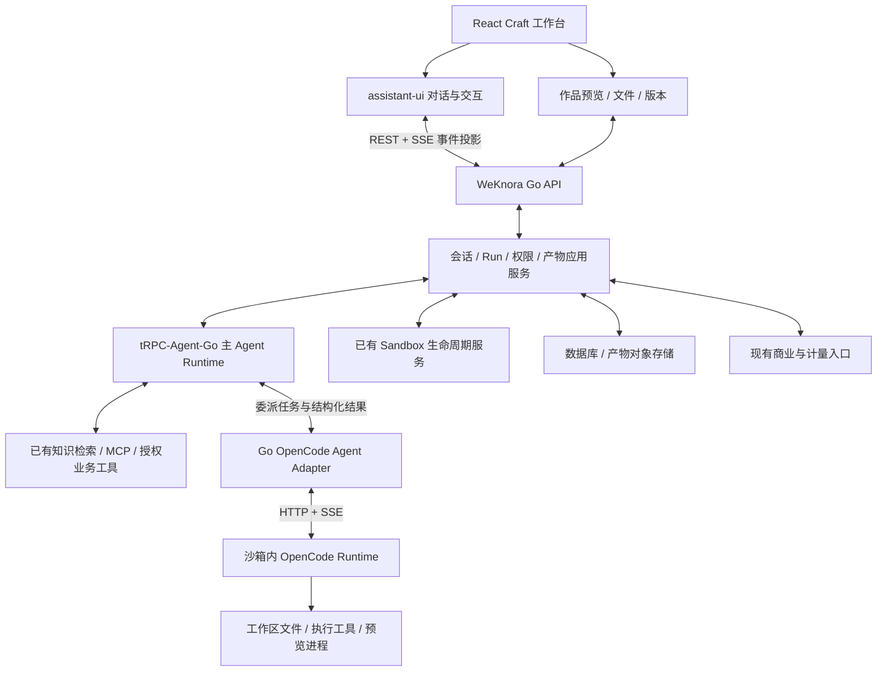

# WeKnora Craft 产品与总体架构方案

日期：2026-09-10。状态：完整方案建议稿，供用户审阅；本轮只做方案，不继续实施。

## 1. 目标与已确认方向

基于正在进行 React 改造的 WeKnora，建设类似 Onyx Craft 的成果创作工作台：用户以自然语言描述目标，选择企业知识或上传文件，由 Agent 生成可预览、可继续修改、可下载的作品。

已确认的技术方向：

1. **React + assistant-ui**：产品界面与对话交互。
2. **tRPC-Agent-Go**：主 Agent Runtime，负责理解需求、管理主上下文、知识检索、规划、工具选择与主执行循环。
3. **OpenCode**：沙箱中的执行 Agent Runtime，接受 tRPC-Agent-Go 委派，独立完成文件修改、命令执行、验证和修复循环。
4. **wanwu 的 Go 对接实现**：作为 OpenCode HTTP/SSE、运行准备和事件转换的代码参考。

以下用户画像、首版作品类型与交付阶段是建议范围，不代表用户已逐项批准。默认首先服务于需要将企业资料转化为报告、可视化页面和内部工具的知识型业务用户。

产品暂名为 **WeKnora Craft**，不改变现有品牌命名。

## 2. 产品要提供什么体验

建议形成三个相互衔接的能力：

- **理解材料**：使用用户有权访问的知识库、上传资料和已授权工具，明确作品应依据什么信息。
- **生成作品**：把目标转化为具体执行任务，在沙箱内生成文件或可运行页面，展示执行进度和产物。
- **持续协作**：用户直接要求修改，Agent 基于同一工作区继续处理；作品具有历史版本，关闭页面后可以再次打开。

典型场景：

| 场景 | 用户输入 | 产品输出 | 后续交互 |
|---|---|---|---|
| 数据报告 | 上传销售 CSV，选择产品资料，要求分析趋势 | 带图表与说明的网页报告、引用来源 | 调整筛选维度、图表和结论表述 |
| 知识驱动文档 | 选择产品知识库，要求制作客户介绍材料 | Markdown 报告及可选导出文件 | 增加章节、改写风格、核对引用 |
| 内部小工具 | 描述报价计算、数据筛选等需求并提供规则 | 在受控预览环境运行的页面 | 调整交互、计算规则与布局 |

网页报告作为首个纵向闭环；文档、表格和演示稿能力逐类增加。用户不需要先理解仓库、分支或终端才能完成创作。

## 3. 与 Onyx Craft、wanwu 的对应关系

2026-09-10 核查的 Onyx 官方资料将 Craft 描述为利用公司知识构建应用、文档等作品的能力，包含流式过程、实时预览、会话管理及恢复。其专门部署文档说明 OpenCode 在沙箱中运行，API 服务通过 HTTP 对接。功能介绍与部署 README 部分段落存在历史差异，不能把所有愿景功能都当成当前已完整实现。

| 参考对象 | 采用的思路 | 在本产品中的落点 | 不直接照搬的部分 |
|---|---|---|---|
| Onyx Craft | 企业知识驱动作品创作；对话与作品并排；沙箱、预览与持续修改 | Craft 产品流程和工作台结构 | Python/FastAPI/Celery 后端与其部署体系 |
| wanwu | Go 调用 OpenCode，准备模型/Skills/文件，通过 SSE 获取执行事件 | OpenCode Agent Adapter | Eino 专用转换层及每次执行后删除 session 的策略 |
| assistant-ui | 以外部状态适配对话 UI | 对话、工具卡片、人工交互入口 | 把 UI 组件状态当成后端会话数据库 |
| tRPC-Agent-Go | 主 Agent 的推理与执行循环，工具与 AG-UI 集成 | 主 Runtime 与 OpenCode 委派工具 | 再建一套绕过 WeKnora 现有权限的知识和工具系统 |

核心区别在职责安排：本方案的用户协作入口由 tRPC-Agent-Go 主 Agent 承担，OpenCode 专注执行被委派的任务。这会增加两层运行状态的协调成本，但适合将知识检索、业务工具与作品构建组合为一个流程。

## 4. 产品页面与信息结构

### 4.1 Craft 入口

提供新建作品、最近作品、继续上次会话。新建时允许输入目标、上传材料、选择知识范围；作品类型可以由用户指定，也可以由主 Agent 建议。

推荐模板首先作为任务引导，如“数据报告”“知识报告”“内部工具”，不承诺所有模板已经有独立专业编辑器。

### 4.2 创作工作台

```text
┌────────────────────────────────────────────────────────────────┐
│ 作品名称 · 当前状态 · 当前版本                  下载 / 版本记录 │
├─────────────────────────┬──────────────────────────────────────┤
│                         │  预览  |  文件  |  执行详情            │
│ 主 Agent 对话           │                                      │
│ · 需求与材料说明        │  当前选中作品的预览                    │
│ · 知识来源与引用        │  或文件内容、构建日志                  │
│ · 委派任务进度          │                                      │
│ · 用户问题/审批         │                                      │
│                         │                                      │
│ 输入修改要求 / 上传附件 │  版本、文件与当前任务关联              │
└─────────────────────────┴──────────────────────────────────────┘
```

| 区域 | 交互要求 | 实现职责 |
|---|---|---|
| 主对话 | 流式回答、附件、知识引用、继续修改 | assistant-ui + WeKnora 对话适配 |
| 执行卡片 | 展示“正在检索”“生成页面”“验证结果”，可展开具体工具过程 | 将主/子执行事件关联到同一任务 |
| 问题与审批 | 显示具体问题或申请的操作范围；回答、同意、拒绝 | 后端持久化交互状态，UI 提交决定 |
| 作品预览 | 网页、Markdown 和已支持文档的对应预览 | 独立作品预览组件与授权预览入口 |
| 文件列表 | 选择文件、查看内容、下载对应版本 | 后端工作区/产物 API |
| 历史版本 | 查看某次生成结果并继续修改 | 不可变产物版本与工作区恢复策略 |
| 执行详情 | 错误、命令结果、验证结果；终端按权限提供 | 复用已有日志/终端能力 |

assistant-ui 负责对话部分。文件树、预览面板、版本管理、运行服务和文件持久化需要由产品补齐，不能指望安装 assistant-ui 后自然具备。

## 5. 端到端用户与系统流程

以“上传销售数据，生成可筛选的分析页面，再修改图表”为例：

| 步骤 | 用户看到的行为 | 系统行为 |
|---|---|---|
| 1. 创建 | 输入目标、上传 CSV、选择知识库 | 确认空间与资源权限，记录材料及会话 |
| 2. 理解 | 主 Agent 说明理解，必要时询问关键缺失信息 | tRPC-Agent-Go 组织上下文，检索所选知识 |
| 3. 委派 | 展示明确的构建任务和进度卡片 | 主 Agent 向 OpenCode 委派目标、授权输入与约束 |
| 4. 构建 | 看到文件生成、命令运行、错误修复的进度 | OpenCode 在工作区内完成自己的执行循环 |
| 5. 验证 | 预览出现；主 Agent 说明结果与未通过项 | 收集文件、检查预览可用性，记录实际验证证据 |
| 6. 修改 | 输入“改成季度统计，增加地区筛选” | 新主 Run 继续使用该作品工作区与 OpenCode session |
| 7. 保存 | 看到新版本，旧版本仍可下载 | 记录不可变产物版本与本次执行关联 |
| 8. 再次打开 | 恢复对话、作品与运行状态 | 读取后端快照；需要时恢复沙箱和执行会话 |

不把每次模型内部工具调用都变成用户确认点。只有缺少决定性信息、需要超出当前授权的操作或不能安全确定恢复结果时，才向用户请求处理。

## 6. 总体架构与技术分层



| 层次 | 方案 | 作用与边界 |
|---|---|---|
| UI / API client | 当前 React 改造 + assistant-ui；共享 contracts/api-client/domain | 界面复用、状态投影和用户命令 |
| BFF / API | 保留 Go/Gin，采用现有认证与业务服务 | 持久化事实、授权、运行控制、文件与预览访问 |
| 主 Runtime | tRPC-Agent-Go | 推理、知识检索、工具选择、委派与结果检查 |
| 子 Runtime | OpenCode，部署于受控沙箱 | 文件/代码修改、命令执行和局部修复循环 |
| 工作流与恢复 | 衔接已有双 Agent/tRPC 恢复方案 | 持久化主 Run、ToolCall、执行结果不明时的核对与等待 |
| 商业能力 | 衔接已有空间计费与 OpenMeter 设计 | Craft 提供原始用量与归属，不自建第二份 Credits 账本 |
| 基础设施 | 现有数据库、对象存储、Sandbox 抽象 | 文件版本、运行记录、容器与工作区生命周期 |

前端框架、路由和精确依赖版本沿 React 改造确定，不额外引入一套 Next.js 后端。开发与自托管环境优先复用已有 Docker 沙箱能力；其他沙箱供应商按已有抽象验证，不把引入 Kubernetes 作为首版前置条件。

## 7. 两个 Agent Runtime 如何协作

### 7.1 tRPC-Agent-Go 主 Runtime

负责完整用户目标、主对话上下文、知识检索、任务分解、工具选择、执行预算与结果解释。例如用户要求“根据资料生成报告”，主 Agent 先获得必要的知识与数据，再提出一次明确的 OpenCode 构建任务。

主 Agent 可以根据返回结果继续委派修复、补充资料或直接向用户交付。OpenCode 完成某次委派不自动意味着整个主任务完成。

### 7.2 OpenCode 执行 Runtime

负责被委派任务内部的具体执行：理解工作区、编辑文件、运行命令、发现错误、修复后重试。一次委派可以包含多次模型调用和工具调用。

OpenCode 管理自己的编码上下文。它不直接拥有 WeKnora 的用户账户、空间权限、主 Run 或商业账本，也不决定主对话已完成。

### 7.3 Go OpenCode Agent Adapter

这是两个 Runtime 之间的边界，负责：

- 找到或恢复当前作品绑定的 OpenCode session。
- 把授权的任务输入传入执行环境。
- 提交任务并准确关联本轮消息。
- 将 OpenCode 事件转换为产品可以理解的子执行事件。
- 传递取消、问题与权限请求，核对最终结果。
- 返回摘要、产物引用、验证事实和原始用量。

Adapter 的输入包括任务目标、执行身份、输入资源、允许的操作范围和截止条件。沙箱地址、凭证、租户归属和模型配置由服务端解析，不允许模型生成这些权威参数。

Adapter 返回的是一次委派结果。主 Runtime 接收摘要及引用，必要时进一步读取文件，避免把完整工具日志反复塞进主上下文。

## 8. 知识、Skills 与工具如何进入创作流程

建议首版采用“主 Agent 获取知识，OpenCode 消费受控材料”的模式：

1. 用户选择知识范围或上传材料。
2. 主 Runtime 使用 WeKnora 现有检索工具获取有权限的内容。
3. 将构建需要的材料整理为带来源的任务输入或沙箱文件。
4. OpenCode 根据这些材料构建作品。
5. 主 Agent 在交付时区分原始资料、生成结论和验证结果。

当任务确实需要执行中继续检索时，再提供具有相同用户/空间权限的受控知识工具。通过 MCP 或适配工具调用都必须经过现有权限入口，不能把数据库或全部知识库直接开放给沙箱。

Skills 用于描述作品构建方法和工具使用流程，例如网页报告、文档导出、图表制作。Skills 版本与执行记录关联；不会因为沙箱中的技能文本声明需要某种权限，就自动授予该权限。

## 9. 会话、执行与作品数据模型

保持“空间”与“执行文件工作区”分离，沿用仓库现有领域词汇。

| 概念 | 含义与关系 |
|---|---|
| 空间 Tenant | 用户协作、资源访问与费用归属边界 |
| 创作会话 | 用户围绕一个作品持续交流，复用现有会话语义 |
| 主 Run | 用户发起的一轮主 Agent 执行 |
| OpenCode 委派 | 主 Run 中的一次执行任务，关联主工具调用 |
| 执行工作区 | 作品的可修改文件集合；首版建议一个创作会话对应一个工作区 |
| 沙箱实例 | 当前承载工作区与运行进程的计算环境，可休眠、重建 |
| OpenCode session | 子 Runtime 的执行历史，绑定工作区并持久保存映射 |
| 产物版本 | 某次交付的不可变文件/作品引用，关联生成它的 Run |
| 待处理交互 | 具体的问题或权限请求，关联委派和一次性用户决定 |

首版同一工作区串行修改。并行创建不同作品可以后续按资源配额开放；并发修改同一作品需要冲突与合并模型，不应默认为安全。

主 Run、ToolCall 和恢复调度复用现有 tRPC 恢复方案。Craft 增加子执行、工作区、产物等关联信息，不另建可以竞争更新主任务状态的系统。

## 10. 流式展示、交互、取消与恢复

**事件展示。** 后端先形成有归属的产品事件，再投影到 UI；可使用 AG-UI 适配 assistant-ui。保留主 Run、子委派和工具调用的关联，OpenCode 的完成事件只结束子委派。

**人工交互。** 问题回答与权限批准是两类动作。界面必须说明用户正在回答什么、批准什么；服务端校验身份、请求状态与决定是否已处理。模型不能替用户批准权限。

**取消。** 用户点击停止后，主 Run 记录取消意图，并向活跃 OpenCode 委派传递停止请求。收到 HTTP 响应不等于远端已停止，界面可以显示“正在停止”，核对后再显示取消结果。

**页面重连。** 关闭或刷新页面只影响订阅，不自动重新提交任务。重新打开时先加载后端状态，再接收后续事件；无法续传时重新读取快照，不把断流当成生成完成。

**服务端恢复。** 衔接主 Runtime 的持久化 Run、工具执行记录和恢复入口；结果不明的执行先核对 OpenCode 与工作区，不能盲目重试可能修改文件的任务。

**沙箱恢复。** 同时考虑作品文件与 OpenCode 会话数据，单纯保存文件目录不等价于完整恢复执行上下文。恢复不了时明确说明当前可用版本和下一步，不暗中以空会话续跑。

## 11. 产物、预览与版本

作品首先产生在执行工作区内。完成交付时，后端收集需要展示或下载的文件，保存为带版本的产物引用，沿用现有 `resource://` 语义。

- 网页预览对应实际沙箱服务或受控静态产物，不能把模型写出的 URL 直接当成可用预览。
- 可执行预览与主产品隔离 origin，并限制 iframe 能力和访问权限。
- 文件访问按空间、会话和资源授权，不把沙箱目录或访问凭证直接暴露给前端。
- 历史版本引用保持原始内容，不能静默重定向到最新文件。
- “下载旧版本”和“从旧版本继续编辑”是不同能力；前者先交付，后者在工作区版本恢复验证后开放。
- 构建成功、预览可访问、测试通过分别记录；没有执行的检查不能写成通过。

## 12. 用量与商业能力衔接

Craft 的主要消耗来自主 Runtime 模型调用、OpenCode 模型调用、沙箱运行和产物存储。

沿现有商业设计，由服务端固定空间归属并执行准入、预算及结算规则。主子 Runtime 分别上报实际模型调用用量，主 Agent 接收工具结果本身不会使同一笔 OpenCode 用量再记一次。

建议通过受控模型调用入口为 OpenCode 提供执行范围内凭证与预算限制；接入方式须在商业方案和 Adapter 详细规格中对齐。不能仅相信最终一次汇总事件就认定所有消耗均已记录，也不能让沙箱直接修改 OpenMeter 的客户或余额。

本方案不设定套餐、价格或充值规则，商业权威保持在现有专项方案。模型调用、沙箱驻留、快照存储等成本需要基于真实使用数据估算，此处不提供未经验证的成本数字。

## 13. 当前代码哪些可以参考或复用

| 资产 | 具体位置 | 使用建议 |
|---|---|---|
| React 多端分层 | `docs/superpowers/specs/2026-09-10-react-multiclient-design.md` | 复用 contracts/api-client/domain/core/views 的职责，Craft 作为新业务视图 |
| 主 Runtime 与恢复 | `docs/superpowers/specs/2026-09-10-dual-agent-trpc-recovery-design.md` | 复用会话固定引擎、主 Run、持久化工具调用和恢复模型 |
| 空间与商业语义 | `CONTEXT.md`、商业专项规格 | 区分 Tenant 与执行工作区，计量沿现有空间归属 |
| 沙箱绑定 | `internal/sandbox/session_binding.go` | 复用空间/会话绑定及生命周期锁，再扩展子会话映射 |
| 产物收集 | `internal/application/service/artifact_collector.go` | 评估复用文件收集、资源引用和持久化入口 |
| 产物版本语义 | `internal/types/artifact_versions.go` | 保留历史引用与本轮新文件的区别 |
| 终端能力 | `internal/handler/session/sandbox_terminal_ws.go` 等 | 按权限复用现有终端接入 |
| wanwu OpenCode Runner | `/Users/wuyongjun/trea/wanwu/pkg/wga-sandbox/internal/runner/opencode/opencode.go` | 参考配置准备、输入文件、HTTP 提交和 SSE 处理 |
| wanwu AG-UI 转换 | `/Users/wuyongjun/trea/wanwu/pkg/ag-ui-util/translator_opencode.go` | 参考文本、工具与问题事件转换 |

wanwu 的运行器每次执行后会删除 OpenCode session，这与作品连续修改的目标不同，需要改为保留和显式清理。其部分适配依赖 Eino，本产品只借鉴协议边界与运行准备，不把 Eino 引入主执行链。

检查过相关源码与官方资料，不代表上述模块已全部完成 Craft 接线，也没有完成全产品浏览器验收。已进行的 Adapter 探测只作设计参考，不能替代本方案评审。

## 14. 建议分阶段交付

| 阶段 | 用户可感知的交付 | 技术范围 | 验收重点 |
|---|---|---|---|
| A：完整方案评审 | 明确目标、工作台和首版作品范围 | 统一产品、Runtime、沙箱、恢复与商业边界 | 本文各边界无冲突，首版范围明确 |
| B：网页报告闭环 | 上传数据 → 生成页面 → 预览 → 修改 → 下载 | 主 Runtime 委派 OpenCode、工作区、基本产物、React 对话/预览 | 同一作品两轮修改，实际文件与预览一致 |
| C：知识驱动与可恢复协作 | 引用企业知识，处理问题/审批，关闭后继续 | 知识权限、持久化交互、重连、运行核对、版本引用 | 无越权、无重复执行、取消结果真实 |
| D：作品类型扩展 | 报告文档、表格、演示稿逐类开放 | 相应 Skills、生成工具、预览与导出适配 | 每类都有生成、修改、预览/下载闭环 |
| E：产品化运营 | 空间配额、用量展示、稳定发布与恢复 | 商业接入、生命周期、并发控制、故障演练 | 可运维、可回退、费用归属与实际消耗一致 |

基础权限与取消安全是每个可运行版本的前提；阶段 C 是完整交互与恢复能力的交付，不意味着阶段 B 可以忽略隔离。

首版建议暂不纳入：公开部署与域名绑定、多人实时编辑、完整在线 IDE、任意外部应用写操作、移动原生工作台、一次性交付所有 Office 文件类型。这样首个版本可以验证“基于材料创作并持续修改作品”的核心价值。

## 15. 关键取舍与方案失效条件

- **两层 Runtime 的收益**：主 Agent 能把知识检索和业务工具加入完整流程，OpenCode 负责深入的构建与修复。
- **代价**：需要明确上下文、事件、取消、会话与模型用量边界；可能增加主 Agent 的规划和结果检查调用。
- **如果目标简化为纯编码聊天**：Go API 直接对接 OpenCode 会更简单，上层完整编排的收益会降低。
- **如果要求完全由 Go 控制每一步执行**：可以另行评估用 tRPC-Agent-Go 自建编码循环，但会增加文件编辑、执行修复、上下文等工作；这不属于已确认方向。
- **如果需要生产级在线应用托管**：需要单独设计发布、构建、域名、应用认证、网络与租户隔离，不能把沙箱预览直接当作正式托管。

## 16. 本轮结论与后续动作

本轮先评审本产品方案。架构采用 **React/assistant-ui 工作台 + tRPC-Agent-Go 主 Runtime + Go Adapter + 沙箱 OpenCode Runtime**，并与现有知识、权限、沙箱、产物、恢复和商业能力衔接。

建议下一步按顺序细化：

1. 确定首版是否采用网页报告闭环，以及工作台交互范围。
2. 将主/子 Runtime、知识输入、工作区/产物、交互/恢复拆为专项规格，明确由现有模块还是新增模块承担。
3. 基于确认后的规格形成完整纵向交付计划，再开展实现与验收。

之前生成的 Adapter 计划是局部技术计划，不能代替本产品方案。用户已澄清先出方案，因此已停止该实现流程；已有工作保留在独立工作树，未作为已完成产品交付。

## 参考资料

- [Onyx Craft 产品说明](https://github.com/onyx-dot-app/onyx/blob/main/web/src/app/craft/README.md)
- [Onyx Craft 部署架构](https://github.com/onyx-dot-app/onyx/blob/main/docs/craft/infra/image-architecture.md)
- [OpenCode Server](https://opencode.ai/docs/server/)
- [assistant-ui ExternalStoreRuntime](https://www.assistant-ui.com/docs/runtimes/custom/external-store)
- [tRPC-Agent-Go AG-UI](https://trpc-group.github.io/trpc-agent-go/agui/)

上游产品和协议会变化；进入具体实施前需固定源码/二进制版本。本方案中的产品建议与架构推导，不表示上游框架开箱提供全部能力。
