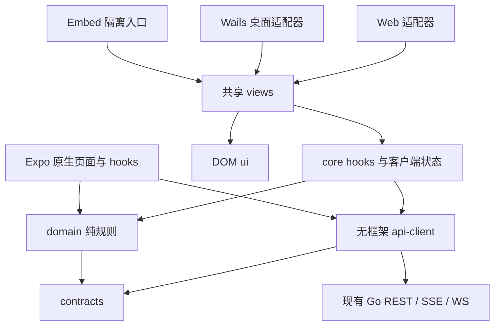

# WeKnora React 多端改造设计草案

状态：供评审的建议方案，尚未批准实施。日期：2026-09-10。

2026-09-10 移动方向增补：用户已确认以 Happy 保留现有移动交互，作为知识问答、通用 Agent、专业 Agent 的统一客户端；详见 [Happy 统一 Agent 移动设计](2026-09-10-happy-agent-mobile-design.md)。本文中的移动 Expo 从零搭建/Multica 参考方向由该增补替代，共享 contracts/api-client/domain 与现有 Go 后端边界保留。原设计状态不代表本次方向未经确认，也不代表实现已验收。

## 1. 目标与默认范围

将 `/Users/wuyongjun/trea/WeKnora-fork01` 的产品前端迁移到 React，参考 `/Users/wuyongjun/trea/multica` 的多端分层，实现 Web、桌面、移动端共享 API 契约、数据模型和纯业务逻辑，Web/桌面进一步共享组件与业务页面。保留 WeKnora 的知识库、RAG、Agent、组织与空间、权限和数据模型语义。

本次交付是改造计划，不启动业务代码迁移。建议范围：Web 与现有 Lite 桌面功能等价；移动端分核心使用闭环和管理功能补齐两批，最终每个现有功能都必须在能力矩阵中有明确去向。未确认的默认假设：保留现有部署形态；不要求服务端页面渲染；不强制更换桌面容器；移动端覆盖 iOS 与 Android；不引入离线编辑同步、移动端本地 RAG、支付或新的 Agent 引擎。

## 2. 当前证据与边界

| 对象 | 静态核查结果 | 对方案的影响 |
|---|---|---|
| WeKnora HEAD | `5cf093706ebecdfe8bc4eca80886e80c01805289`，调查开始时工作区干净 | 实施前重新核对 HEAD 与脏文件 |
| Multica HEAD | `85b1fdbb44fd90aa90ce3353a95c2b1f3d115ddf`，调查时工作区干净 | 源码参考固定到提交，不依赖相邻目录构建 |
| WeKnora 前端 | Vue 3.5、Vite 7、Pinia 3、TDesign Vue、vue-i18n；199 个 Vue SFC | 组件需要 React 实现，不能自动语法转换视为完成 |
| API | `frontend/src/api` 下 33 个 TS 文件（含测试/辅助文件）；Swagger 2.0 有 282 个 path、361 个操作 | 数字是文档库存，不代表实际路由覆盖完整 |
| 聊天 | `api/chat/streame.ts` 260 行，`useChatStreamHandler.ts` 1249 行；有 POST SSE、continue-stream、工具审批等 | 先迁移协议和状态，再迁移渲染 |
| 桌面 | `cmd/desktop` Wails v2，启动本地 Go 服务、反向代理、数据目录与更新逻辑 | React 不要求换掉 Wails |
| 发布 | Docker Nginx、Lite 的 `web/` 静态目录、Wails、独立 Embed 入口 | 构建和发布是主迁移任务，不是末尾小修 |
| Multica Web/桌面 | Next.js 16 / Electron 39，React 19，共享 core/ui/views，平台适配器隔离路由 | 借鉴共享包边界，不照搬产品域和服务端框架 |
| Multica 移动 | Expo 55；package.json 为 RN 0.83.6 / React 19.2.0；NativeWind 4 / Tailwind 3 | 移动独立版本、路由、UI、QueryClient 与发布 |
| 参考文档漂移 | Multica mobile/CLAUDE.md 仍写 RN 0.82 / React 19.1，与 manifest 不同 | 文档描述不是安装结果；P0 验证锁文件和兼容矩阵 |
| 参考实现边界 | Multica mobile 自己维护 API wrapper；core schema 有 fallback；部分通用 fetch 直接返回 JSON | 可以改进 API 共享与校验，不把参考仓库规则当成全部代码已满足 |

检查范围：两仓库 manifest、目录、导航、认证/传输关键路径、桌面启动、移动数据层、主要 API/模型文件、发布引用与测试源码。未逐个深读 199 个组件或 361 个 API 操作；未运行应用、构建、测试或真机验证；未审核数据库全部实现。库存附录逐项列出 Vue/API 文件与 Swagger 操作，实施 P0 要补实际端点/权限/行为映射。

## 3. 方案比较与建议

| 方案 | Web | 桌面 | 移动 | 优点 | 代价/适用条件 |
|---|---|---|---|---|---|
| A：贴近 Multica 容器 | Next.js | Electron + Go sidecar | Expo RN | 容器技术接近参考，可引入 SSR 和 Electron 插件 | 新增 Node 部署或静态导出限制，重新实现 Lite 生命周期/签名/更新；确认需要这两项才采用 |
| **B：借鉴分层、保留部署（推荐）** | React + Vite SPA | Wails + 共享 React 页面 | Expo RN | 保留 Go 和静态部署，以业务迁移为主，跨端共享充分 | Wails WebView 差异需实测；不提供 Next SSR；原生移动 UI 单独实现 |
| C：统一 DOM 界面 | React + Vite | Wails 或 Electron | WebView/PWA | 最大化页面级复用、首版快 | 原生导航、后台、文件与系统集成受限；适合明确接受混合移动体验的产品 |

若“参考”实际意味着必须采用 Next.js/Electron，切换到 A，并新增本地后端进程管理、端口与数据目录继承、原生桥、安装升级验收。若主要目标是最快移动展示、无需原生体验，C 更合适。方案 B 是建议而非用户已批准的选择。

## 4. 建议技术栈

- Web：React 19 系列、TypeScript strict、Vite、React Router；保持 SPA 和现有 URL。
- 桌面：现有 Wails v2 + `apps/desktop` React renderer；Go 壳仍留 `cmd/desktop`。
- 移动：Expo + React Native + Expo Router，原生组件；采用 SDK 对应的 React/RN 版本，不强行跟 Web 完全一致。
- 服务端状态：TanStack Query 5。Web/桌面共享 hooks；移动拥有独立 hooks/QueryClient，复用纯 query-key 与 selector。
- 客户端状态：Zustand，仅草稿、选择、弹窗、布局；服务端记录放 Query；运行中消息状态由纯 reducer 管理并在落盘后对齐 Query。
- UI：Tailwind 4 + Base UI/shadcn 风格的 Web/桌面组件；移动可用 NativeWind 4 与 RN primitives。抽象 token 值共享，CSS 和 RN 样式各自生成。
- BFF/API：保留 Go/Gin REST + SSE + 终端 WS，不增加 Next API routes/tRPC 中间层；鉴权和业务规则仍在 Go。
- 工作流、数据库、检索、文档解析、模型调用：保留现有后端；前端迁移不要求数据库重建、Agent 引擎更换或数据格式迁移。
- 工程：pnpm workspace + Turborepo，Vitest/Testing Library、Playwright；移动独立 typecheck、测试、iOS/Android 原生打包任务。
- 版本：以上为主版本方向，P0 锁定精确组合并提交 lockfile；不能直接复制 Multica 的全部版本或 overrides。

没有新增云服务的必要依赖。实际新增成本来自三端 CI、真机验证、签名和分发维护；这里不提供未经核实的价格和运行成本数字。Next 服务器或 Electron sidecar 仅方案 A 引入。

## 5. 目标目录与依赖

```text
apps/
  web/                 Vite 入口、路由、浏览器适配器
  desktop/             Wails React renderer、桥接和平台导航
  mobile/              Expo Router、原生 UI、移动 QueryClient 与适配器
  embed/               独立轻量 iframe 入口和 Embed 凭证环境
packages/
  contracts/           DTO、运行时 schema、生成的类型、协议 fixtures
  api-client/          无 React 的端点 SDK、传输端口、认证协调
  domain/              纯 selector、权限展示规则、状态机、消息/引用语义
  core/                Web/桌面 React hooks、Query、Zustand
  ui/                  DOM 原子组件，零业务依赖
  views/               Web/桌面业务页面，依赖 core/ui/domain
  design-tokens/       颜色/字号/间距语义值，CSS/RN 分别适配
  i18n/                翻译资源与纯格式化规则
  tsconfig/            共享 TS 基础配置
  eslint-config/       包边界规则
frontend/              迁移期间保留的 Vue 发布源，最终整批退出
cmd/desktop/           保留 Wails/Go 生命周期与本地数据逻辑
internal/              保留服务端业务代码
```

根 workspace 明确列入新包，不用不加审查的 `packages/*` 将现有 `packages/dsh-weknora` 的发布流程一起改变。`miniprogram`、`website-docs`、Go/Python client 和 DSH 插件保留各自构建，纳入 API 兼容回归。



Embed 只导入需要的聊天视图，独立 provider，不能携带主产品用户/租户凭证；不能因共享 views 把后台设置等全部打入 embed 首屏。

## 6. 复用政策：最大化正确复用

| 资产 | 策略 | 目标位置 | 限制 |
|---|---|---|---|
| WeKnora Go handler/service/repository/数据库模型 | 原样复用 | 原目录 | SDK DTO 不导出完整 ORM 实体和敏感字段 |
| WeKnora API 路径/鉴权/业务响应 | 保留语义，包装成共享 SDK | contracts + api-client | Swagger 先校验；SSE、Blob、上传单独描述 |
| WeKnora TS 类型 | 对照 handler JSON 和 Swagger 整理 | contracts | 消除重复类型；保留 null/缺失/ID 差异 |
| 无框架工具函数 | 搬迁后保持行为与测试 | domain | 无 import 不等于无浏览器依赖，仍查 window/document/storage |
| Vue hooks、Pinia | 抽取纯规则，React 重写绑定 | domain + core | 不在共享层残留 Vue 生命周期 |
| Vue/TDesign 组件 | 复用行为、文案、资产和视觉规则；重建 React | ui + views | 不能直接运行 Vue SFC |
| WeKnora Markdown/引用/产物协议 | 保留解析语义，DOM 渲染分离 | domain + views | HTML 清洗、Mermaid/Office/xterm 留 DOM；移动独立渲染 |
| Multica navigation/storage/provider 边界 | 借鉴接口与依赖方向 | app adapters | 不导入 issue/project/workspace slug 业务假设 |
| Multica 原子组件/布局/rich-content | 可选择适配，逐文件记来源和许可证 | ui/views | 不能默认复制整包；内部实体链接、授权、CDN 规则要剥离 |
| Multica API/业务模型 | 仅借鉴组织方法 | 不整包移植 | Issue/Task/ChatSession 不等价于 WeKnora 知识/会话模型 |
| Web 与桌面页面 | 共用同一份 React 源码 | views | 平台能力用 adapter/slot，不复制页面 |
| 移动与 Web | 共用 SDK、schema、纯函数、语义 token/文案 | 四类纯包 | 不导入 DOM ui/views 或 Web core；原生 transport 实例独立 |

Multica 当前 LICENSE 标明 Apache 2.0 加附加条件，涉及对外托管与商业分发；WeKnora LICENSE 为 MIT 并另列第三方组件。源码复用前要记录具体源文件、提交、组件原始出处和适用许可/授权范围；未核实来源的组件按架构模式自行实现或从可用上游重新引入。此项只约束直接代码搬运，不阻碍设计和 WeKnora 自有代码抽取。

不预报“复用率 80%”。按库存统计：三端端点定义单份率、共享纯规则数量、Web/桌面重复页面数量、必须平台化的功能数量；最终每一项需有测试或明确平台差异证据。

## 7. 数据契约与 SDK

### 7.1 权威顺序

运行行为由现有路由、handler DTO、权限与集成测试确定；Swagger 是可生成资产，需要和实现一致。先比对，再以修正后的 Swagger 2.0 导出规范化生成输入。建议生成工具为支持 Swagger 2.0 的 OpenAPI Generator `typescript-fetch`（P0 验证固定版本），生成结果只作内部 wire layer；contracts 仅接收无平台依赖的模型/序列化代码，生成客户端放 api-client 内部并通过注入 transport 接入。手写窄域 facade 不重复维护端点路径/DTO，不向页面泄露生成器运行时；不得让生成的 Fetch/Blob runtime 污染 contracts 或绕过移动 transport。若试点转换失败，使用经过测试的 Swagger2→OAS3 转换流程后再生成，不能直接假定所有 OpenAPI 工具接受 Swagger 2.0。

运行时 schema 与生成 TS 必须有 fixture/一致性检查；不要生成后重新手写第二套完整 DTO。SSE event 和非 JSON 传输保留手写 schema/测试。

### 7.2 必须对齐的数据族

Identity：User、Tenant、Membership、Invitation、Organization、部署能力。Knowledge：KnowledgeBase、Knowledge、Chunk、Folder、Tag、FAQ、DataSource、WikiPage/Revision。Conversation：Session、Message、Reference、MentionedItem、TemporaryAttachment、Artifact、审批和 OAuth 状态。Configuration：Model、MCP、Skill、StorageBackend、VectorStore、Memory、RuntimeTask、AuditLog。

`Tenant.ID` 在 Go 是 uint64，已有前端存在 string/number 混用。纯 domain 中统一规范化十进制字符串；wire schema 保持现有响应。超过 JS 安全整数的 JSON 数字拒绝静默转换（解析后已丢精度），先记录契约错误；若真实系统需要该范围，单列后端字符串序列化兼容变更，不把它夹带为前端重写。其他 UUID/string ID 不转数字。资源归属 tenant、当前访问 tenant、组织与分享关系分别保留，不将 Multica Workspace 直接映射替换 Tenant。

分页按端点保留 page/page_size、before_time 等真实规则；UTC 字符串留在 DTO，展示层本地化；PATCH 的省略与 null 语义分别测试；未知枚举保留原值并给可见的未知态。

### 7.3 SDK 横切契约

- 初始化时注入 baseURL、HTTP transport、凭证、locale、requestId、日志；禁止 SDK 读 `window`、`localStorage`、`process.env` 或 Vue i18n。
- Bearer 与 Embed 为不同鉴权 profile。保留 `X-Tenant-ID`、`Accept-Language`、`X-Request-ID`；Embed 不带用户 Bearer/tenant header，保留 visitor/session header。
- 错误结构统一为 status/code/message/requestId/details；日志不输出 token、原始敏感响应、文档正文。
- 支持 204、非 JSON 错误、413、Blob、FormData、上传取消；上传不能强制 JSON Content-Type。
- 并发 401 只触发一次 refresh；403 不 refresh；refresh 失败终止会话。请求重试受契约约束：GET 可有限重试，生成/上传/审批不能盲目重放；SSE 握手鉴权失败且未消费事件时最多一次授权重试。
- Read 请求传递 AbortSignal，并有可取消超时；SSE 使用握手超时/断线策略，不套 30 秒整体超时。
- 运行时 schema 对必填 ID、权限和 mutation 结果严格失败；仅非关键展示字段允许局部降级。不能照搬“非法响应变成空数组”掩盖删除失败或权限错误。
- query key 包含服务端 origin、用户、tenant、资源和参数。登出/切空间取消请求与 SSE/WS，清理旧上下文缓存，阻止迟到响应重新写入。

## 8. 聊天、文件和平台能力

聊天流先抽为纯 reducer。现有前端 case 包括 thinking、context_compacted、tool_approval_required/resolved、mcp_oauth_required/resolved、tool_call、tool_result、error、answer、artifacts_pending、user_message_injected、complete、stop；这份名单是前端分支库存，不宣称穷尽服务端协议。P0/P3 补全外层 envelope、事件顺序和 ID 定义。

发送仍使用当前 `/api/v1/knowledge-chat/:session_id`、`agent-chat`；恢复对照 `GET /api/v1/sessions/continue-stream/:session_id` 与 handler 的 message_id 语义。没有证据前不设计成 Last-Event-ID 可无限重放，不将 Multica WS 换进聊天协议。首个事件前失败、流中断、主动停止、后台恢复分别呈现；已发送请求不因重连生成第二次。

文件类型、引用、`resource://` artifact handle、鉴权下载和过期链接沿用现有规则；临时上传/解析完成状态与消息发送关联。Web/桌面保留复杂文档预览；PPTX 的 Vue wrapper 需要单独试点，不能因去 Vue 丢失预览能力。原生移动使用原生下载/分享或受控 WebView 预览，限制导航、桥消息和可执行 HTML。终端沿用 ticket→WS，不把 JWT 置于 URL。

建议适配端口：Navigation（push/replace/back）、Credential（异步 read/write/clear）、Storage（异步偏好存取）、File（选择/上传源/保存/打开）、Stream（字节或事件订阅/取消）、PlatformCapabilities（是否支持预览/终端/更新）。共享端口可异步，避免照搬 Multica 同步 StorageAdapter 而无法接 SecureStore。后端部署能力与设备能力分离。

六种现有语言 zh-CN/en-US/ja-JP/ko-KR/ru-RU 与 Embed 文案均纳入迁移；不得直接用 Multica 的 zh-Hans 替换客户端 locale 和服务器 Accept-Language。核心 i18n 资源无 Vue runtime，移动独立 provider。

## 9. 迁移和上线原则

按独立新入口构建，在开发/验收环境用同一版本后端比较 Vue 与 React，正式环境以入口/部署批次切换。迁移期间允许旧 frontend 发布源存在；不在同一路由树混挂两种框架。灰度若同源路径复杂，优先独立测试 origin，OIDC 回调和持久化命名空间显式配置，避免随意增加 `/react/` 导致回调/文件基址错误。

每个功能批次有行为对照验收，不以能编译代替功能等价。保留旧可部署 artifact 作为回退对象，数据库无破坏性迁移；切回旧 UI 前验证登录存储和新增偏好兼容。新页面达到矩阵全部接受状态后才删除 Vue/TDesign/Pinia 构建链。

## 10. 外部参考与适用范围

读取日期 2026-09-10。主要相邻实例为本地 Multica；另一类参考为官方 Wails 与 Expo 架构指南，无需再引入第二个大型产品复制业务。

- [OpenAPI Generator typescript-fetch](https://openapi-generator.tech/docs/generators/typescript-fetch/)：生成器选项和 OAS2/OAS3 支持面；需验证 date/string、未知枚举和平台 runtime，不能直接将生成 client 当三端兼容结论。
- [Wails Introduction](https://wails.io/docs/introduction/)：Go 与 Web 前端组合，支持保留桌面运行方式。
- [Expo Monorepos](https://docs.expo.dev/guides/monorepos/)：支持 workspace、共享包，强调版本/依赖隔离；不能据此声称 DOM 组件可直接原生运行。
- [TanStack Query React Native](https://tanstack.com/query/latest/docs/framework/react/react-native)：AppState/网络状态适配的依据。
- [Next.js Static Exports](https://nextjs.org/docs/app/guides/static-exports)：静态导出有功能限制；采用 Next 要明确 SSR 与部署模式。

完整任务、依赖、工期与验收见 [实施计划](../plans/2026-09-10-react-multiclient-migration.md)。
