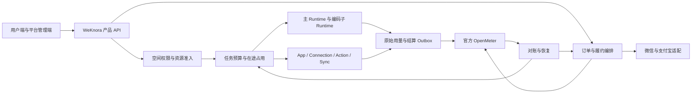

# WeKnora SaaS 商业能力与 App/Connector 完整规格

日期：2026-09-10。版本：1.0 规格稿。状态：业务范围已确认；本次补齐的技术契约供整体评审，接口验证与功能实现尚未完成。

本文替代原逐项讨论稿，保留全部已确认业务决定。关联文档：[接口验证清单](2026-09-10-saas-billing-connectors-interface-verification.md)、[领域词汇](../../../CONTEXT.md)、[OpenMeter 部署基线](../../../deploy/openmeter/README.md)、[Craft 双 Runtime 规格](2026-09-10-craft-runtime-design.md)。

## 1. 目标、范围与证据边界

目标是使每个空间能够独立购买套餐和 Credits，并让模型、解析、沙箱与 Connector 的收费执行具备明确授权、预算、原始用量、结算和恢复路径。统一 App 安装与 Connection 管理承载团队知识同步和 Agent 对外办事。

首期包含：套餐版本发布、资源与功能限制、预付 Credits、人民币微信支付／支付宝、手动续费、人工退款、平台模型与 BYOK、任务预算，以及飞书／Notion 同步、MCP／受控 HTTP Action、飞书发送消息和 Notion 创建页面。

首期不包含：跨空间合并付款或余额池、自动扣款、独立席位与存储加购包、嵌入式第三方 Web 应用、公开开发者上架与交易分成。年付只有在实际配置并发布后提供；若提供，套餐内 Credits 仍逐月发放。

证据分层：用户确认决定是产品约束；下文数据模型、状态、逻辑接口及默认算法是本次设计细化，不代表代码已存在。外部文档与官方源码只证明接口声明或文档语义，不能代替实际部署版本测试。

本轮检查范围：本规格、CONTEXT、OpenMeter 部署说明、TenantMember 角色与 DataSource Connector 接口、Craft 用量相关契约，以及官方 OpenMeter 固定提交的两份 OpenAPI。未做全仓实现审计、商户接入、真实付款或外部写入。2026-09-10 本轮直连本地 `127.0.0.1:48888` 返回 connection refused，因此先前部署冒烟记录只保留为历史证据，不作为当前服务健康结论。

## 2. 已确认业务决定

以下 B 编号用于接口、验收与后续任务追踪。

| 编号 | 已确认规则 |
| --- | --- |
| B01 | 每个空间始终独立购买、付款并承担费用；共享组织不改变归属，不共享余额或套餐。 |
| B02 | 套餐订阅 + 预付 Credits；套餐决定功能、资源和周期额度，充值不改变功能或资源上限。 |
| B03 | 套餐内额度按月发放、当期有效、不结转；年付同样逐月发放。 |
| B04 | 充值额度自到账生效起有效 12 个月；统一先到期先消耗，同到期按发放先后。 |
| B05 | 到期未续费回基础档，保留未到期充值额度和已有数据的授权查看、导出、清理；超限阻止新增，不自动删数据或移除成员。 |
| B06 | 新高级操作按当前权益准入；已准入任务在原有限预算和截止时间内收尾，新增或追加重新准入。 |
| B07 | 同时支持平台模型与 BYOK；BYOK 不重复收取模型 Token Credits，实际平台服务仍计费；不静默回退到收费模型。 |
| B08 | App 按空间安装和选定版本；一个 Installation 可有多个个人或空间 Connection。 |
| B09 | Owner/Admin 管理安装；个人连接仅本人及代表本人的授权任务可用，全空间同步与定时任务使用空间连接。 |
| B10 | 每次调用检查当前成员、安装、连接、外部权限、操作授权、套餐和预算；撤销阻止新调用及重试。 |
| B11 | DataSource、MCP、受控 HTTP 共用集成管理入口；同步、查询、写入分别建模。 |
| B12 | 查询在授权范围内自动执行；写操作默认审批；有限预授权可以减少重复确认。 |
| B13 | 删除、批量写入、对外发送默认逐次审批；例外必须另行明确授权；审批绑定实际目标和参数。 |
| B14 | 写入结果不明先查询或使用已验证的提供方幂等机制，无法确认就暂停，不能盲目重试。 |
| B15 | 人民币、微信支付／支付宝、主动下单续费，充值付款确认后到账；无自动扣款。 |
| B16 | 提前续费顺延原到期时间，不提前发额度；到期后重购从新生效时间起算。 |
| B17 | 升级按剩余时间补差价后立即生效，保留周期结束时间，补发对应月度额度差额；降级已付费周期结束后生效。 |
| B18 | 退款申请人工审核、原路退回；充值核算原订单可退余额，执行预占先结算；已生效套餐周期结合使用情况审核。 |
| B19 | 退款批准后锁定待退权益，成功后撤回；不能在退款期间继续消费这些权益。 |
| B20 | Owner 默认管理商业事务并可授权账单管理员；空间 Admin 商业权限另授；平台运营审批退款并留痕。 |
| B21 | 后台发布套餐版本，配置功能、资源、并发／速率、每月 Credits；已购周期不被目录修改追溯影响。 |
| B22 | 每个收费任务有有限预算，空间可设默认值；预算内无需逐调用费用确认，超额暂停新增收费步骤，追加授权后继续。 |
| B23 | 失败或取消仍结算实际可计费使用，释放未消耗预占；未知调用先核对，定时任务同样受预算限制。 |
| B24 | 首批飞书、Notion 同步接入统一模型；MCP、受控 HTTP 打通查询与写操作；其他现有数据源保留并分批迁移。 |
| B25 | 首批写操作为向指定飞书会话发送消息、在指定 Notion 父页面下创建页面。 |

## 3. 架构与权威边界

| 记录或决策 | 权威归属 | 其他模块可以保存什么 |
| --- | --- | --- |
| 空间、成员、资源授权 | WeKnora | 服务端解析出的不可改付款归属和权限版本。 |
| 已发布套餐商业定义 | OpenMeter 目标目录 + 平台发布编排 | 平台编辑草稿；发布成功后不可变快照与外部版本映射。禁止双边独立修改。 |
| 订单、支付尝试、退款申请与审批 | WeKnora；支付成功事实由渠道验证结果证明 | OpenMeter 商业对象、账单和渠道交易的关联。 |
| 订阅、Grant、最终 Credits 商业消费 | 选定的一套官方 OpenMeter 商业模型 | 平台只保存用于履约、准入和对账的投影，不建立可独立发钱的第二钱包。 |
| 任务预算与并发占用 | 平台准入协调器，或通过验证的官方原子接口 | 原子占用、结算交接和可用额度保守下界；不能把余额查询当原子预占。 |
| 实际调用、原始用量、价格换算版本 | 执行适配层 + 不可变用量记录 | 可重放但不重复消费的结算投递记录。 |
| 审批、预授权、Connection 权限 | WeKnora 产品授权记录 | Runtime 只接收一次执行所需的有限授权，不获得越权决策权。 |
| 外部写入是否已成功 | 提供方结果与核对证据 | 平台持久化成功 ID 或明确的 unknown 状态。 |

一空间对应一个 Billing Account 和一个 OpenMeter Customer；Customer key 由平台生成，映射唯一且不随成员变化。所有命令从可信认证上下文解析空间，外部回调从已创建订单解析空间，不信任客户端、模型或通知附带的自报 tenant。

跨空间知识访问按执行空间承担新调用费用；复制或同步到目标空间时，由目标空间的获授权执行承担新增解析、索引和存储资源占用。源空间保持其已有存储归属。费用披露和准入在操作前完成，不能用共享权限替代付款授权。

### 3.1 OpenMeter 接入的前置门槛

固定候选基线：`v1.0.0-beta.232`，提交 `887e0cac903ccd06e74d61ed23c651651d10c7a9`。官方 V1/V2 OpenAPI 存在 Entitlement/Grant API，官方 V3 OpenAPI 存在 Credits Grant/Balance/Transaction API。接口声明不证明两者可共用额度或可互相结算。

必须先执行清单 OM-02 至 OM-10，选定一个消费权威模型。不能把同一份充值同时发进两套系统，不能把一套余额与另一套交易相减。当前未定位到这两份 schema 中显式命名为 reserve/reservation 的业务端点；这不是对全部官方内部能力的否定。严格预占必须经能力实验或平台协调器验证，不能沿用旧本地扩展接口。

候选比较：V2 metered entitlement 接近原有按用量扣 Grant 的设计，但余额聚合、月度 reset、部分退款与预占需要重点验证；V3 Credits 提供另一组商业账本接口，但其到期、价格、消费与订阅关系尚未完成语义验证。两者均不能通过关键测试时，阻止收费执行上线，形成明确的适配方案评审，不能静默自建商业钱包或回退旧 fork。

## 4. 领域记录、唯一约束与时间

以下为逻辑模型，非已创建的数据表。所有空间记录含 `tenant_id`、不可变 ID、创建时间和版本号；金额、用量不使用浮点数。

| 实体 | 最小内容与约束 |
| --- | --- |
| BillingAccount | tenant 唯一、customer 唯一、subject 映射、状态、已完成同步版本。 |
| PlanVersion | plan_key/version、价格与币种、支付周期、功能、资源、并发、速率、月额度、发布状态、外部目录 ID。发布后只可新增版本。 |
| PriceBookVersion | 服务／模型／计量维度、单位、Credits 比率、舍入规则、生效时间；不得由 Runtime 随请求改价。 |
| Order / OrderLine | 空间、商品版本、实付分配、报价有效期、权益时间段、用途、总额、币种、创建人、履约键。 |
| PaymentAttempt | order、provider、merchant_ref、provider_transaction_id、状态；渠道交易 ID 在商户和渠道范围唯一。 |
| SubscriptionProjection | 外部 ID、已购版本、active interval、paid_until、未来已付款区间、待生效变更、同步版本。 |
| CreditLotProjection | 外部 Grant、来源订单行、额度、有效期、实付分摊、可退上限、核对时间；只作外部权威投影。 |
| TaskBudget / Allocation | run、总上限、已结算、在途额度、批次分配、有效截止、授权人、规则版本；子任务不能复制父预算。 |
| UsageFact / Settlement | physical_call_id、attempt、原始维度、资金来源、结果状态、价格版本、转换值、外部事件及确认水位。 |
| Refund | 订单行、申请与批准金额、待退权益分配、审批人、稳定渠道退款键、渠道状态、撤权状态。 |
| Installation / Connection | App 与版本、空间、启停、个人所属人或空间授权、凭据引用、scope 与权限版本。 |
| ActionExecution / Approval | 逻辑操作、连接、目标、规范化参数摘要、内容快照、有效期、审批／预授权来源、执行结果。 |
| SyncJob / SyncRun | 资源范围、目标知识库、调度、连接、游标版本、checkpoint、源端变更处理策略、预算关联。 |

服务端生成幂等键，作用域至少包含 tenant、命令类型和业务对象。相同键不同内容返回冲突。通知、事件和审计记录通过业务 ID 关联，审计不保存原始密钥。

### 4.1 本次提出的统一时间与精度默认值

以下是完整规格的推荐默认值，不冒充此前逐项确认；整体评审可调整，接口测试必须使用同一组参数。

- 存储 UTC 时间，商业周期按 `Asia/Shanghai` 日历计算；历史周期携带自己的时区与原始锚点，不能受用户显示时区影响。
- 月周期采用生效日期的日号与时刻，无该日的月份取月末，下个月恢复原始日号。例如 1 月 31 日起的锚点依次为 2 月末、3 月 31 日；区间为左闭右开。
- 新购首次履约成功形成固定的 `effective_at`，后续重试复用；提前续费严格衔接原 `paid_until`。超出报价允许的生效时间偏移需重新核对差价或进入人工恢复，不能按延迟后的较短周期交付却仍收原价。
- 人民币使用整数分；Credits 使用固定精度十进制定点，推荐 6 位小数，API 用十进制字符串。外部系统必须能无损表达，否则在接入门槛处调整整个契约。
- 若采用文档所述分钟精度的 Entitlement，产品生效边界必须显式对齐并展示，不能把秒级承诺交给向下取整的外部时间字段。原始用量仍保存真实时间；跨分钟／周期测试不能省略。

## 5. 权限矩阵

账单管理员是空间内单独授权，不加入现有 Owner > Admin > Contributor > Viewer 等级比较，以免 Admin 自动获得商业权限。

| 操作 | Owner | Admin | 获授权账单管理员 | 普通成员 | 平台获授权运营 |
| --- | --- | --- | --- | --- | --- |
| 购买、续费、充值、套餐变更、查看账单、申请退款 | 是 | 另授 | 是 | 否 | 不默认代空间下单 |
| 授予／撤销账单管理 | 是 | 否 | 否 | 否 | 仅受审计的特殊恢复流程 |
| 安装、升级、停用 App | 是 | 是 | 另授资源权限 | 可申请 | 不因运营身份读取凭据 |
| 管理空间连接与授权 | 是 | 是 | 另授 | 仅被授予使用 | 不默认使用客户连接 |
| 使用个人连接 | 本人且有操作权限 | 同左 | 同左 | 同左 | 否 |
| 退款审核与渠道执行 | 否 | 否 | 否 | 否 | 是；与申请方分离 |
| 设置空间任务预算政策 | 是 | 需单独预算管理授权 | 需单独预算管理授权 | 否 | 不默认替空间授权 |
| 发起任务／追加预算 | 当前资源权限 + 空间预算政策允许；超过授权范围由有权者批准 | 同左 | 同左 | 同左 | 不默认可用 |

Owner 转移在一个事务中改变管理归属；原 Owner 不保留隐式账单权限。已确认付款仍按订单空间恢复履约，不因下单成员离开而丢单。新的购买、退款申请、连接调用重新检查权限。只有到账与历史结算恢复可以依据既有有效订单继续；不能借恢复路径发起新的消费。

审批允许使用某项能力，不授予原本没有的资源或连接权限。费用预算批准和外部写入批准是独立条件，两者都满足才能执行。

## 6. 套餐、配额和 Credits 生命周期

### 6.1 配置与发布

套餐草稿 → 校验 → 外部目录发布与映射确认 → 可售。外部发布超时先查版本，不盲目创建第二版。只在外部映射完整后开放下单。已发布版本不可改价格和权益；停售停止新订单，保留已有周期的履约依据。

配置必须包含基础档及四类限制；`0` 和“未限制”分别表示，不用缺省零值表达无限。资源新增在实际提交时原子检查，例如并发邀请或并行文件入库不能靠页面预检查绕过配额。超限允许释放资源；持续资源超限阻止新增，瞬时并发满时排队或返回明确可重试原因。

### 6.2 购买、续费、升级与降级

| 触发 | 生效与发放 | 禁止行为 |
| --- | --- | --- |
| 首次购买或到期重购 | 付款后履约成功开启新周期，发当前月额度 | 未付款先开放收费权益。 |
| 同档提前续费 | 从 paid_until 顺延；未来月按期发放 | 提前发放全部未来月额度。 |
| 升级 | 按剩余付费区间报价，付款后切换权益；当前月只补额度差额 | 重置到期时间、重发已用额度。 |
| 降级 | 已付费覆盖区间结束后切换 | 中途删除已有数据或余额。 |
| 到期未续费 | 基础档 + 未到期充值额度 + 超限状态 | 将充值误认为恢复高级功能。 |

报价推荐公式：对剩余已付费区间逐段计算 `差价 = Σ max(0, 新段价 - 原段价) × 未经过时长 / 原段时长`，使用该段的已购版本与明确的新版本，总和统一舍入到分。月额度补发为 `max(0, 新月额度 - 旧月额度) × 当前月剩余时长 / 当前月总时长`，向下取到 Credits 精度，差额批次随当前月到期。未来月按最终购得版本发放。

该公式是待整体评审的技术细化；优惠、年付及特殊价必须提供段价分配才可报价。连续升级以已生效版本和已补发记录为基准；相同升级命令只能履约一次。已有提前续费区间纳入报价明细，不被悄悄改写；新的降级生效点不得早于已付款覆盖终点，提前结束走退款审核。报价过期、空间订阅版本变化或并发变更时拒绝旧报价并重新计算。

### 6.3 额度批次

套餐月额度与充值批次分别可追踪，统一先到期先消耗、同到期先发先用。采用 Entitlement 模型时各批次配置同一 priority，充值批次必须验证跨月 reset 仅保留剩余值，不恢复已消费值。自动月发与平台调度只选一个发放者；唯一键为 `subscription + month_start + benefit_kind`，升级差额另用订单行键。

展示总余额、套餐内、充值、即将到期、任务占用、退款锁定和数据更新时间。可用余额不包含过期、退款锁定及仍在途的额度。充值到期按生效锚点增加 12 个日历月，月末规则一致。

预占不延长额度有效期。按批次和执行截止约束准入；跨到期边界的持续资源必须拆成可计量区间，预先验证后续区间有有效额度。截止前实际发生但迟报的使用按真实发生时间核对，不伪造回填时间消费已过期批次。不能安全跨界的调用在派发前拒绝或缩短执行时限。已准入任务可以延迟收集结果，但不能在预算／额度失效后无限产生新的收费工作。

## 7. 支付、履约与退款状态机

支付通道和支付产品分别配置。首期币种、渠道已确认；网页、移动端最终采用 Native／网页支付等何种产品仍按客户端与商户开通情况确定，不能把扫码产品强加所有终端。

### 7.1 订单与支付

订单展示状态：`awaiting_payment → paid → fulfilling → fulfilled`；未支付可 `closed`，履约失败进入 `fulfillment_attention` 并保留 paid 事实。支付尝试另有 `creating/pending/succeeded/failed/closed/unknown`，切换渠道产生新的 attempt；同一订单多个尝试均成功时只履约一次，多收款进入退款审核，不能多发套餐。

1. 服务端固定空间、商品版本、金额、币种、权益和报价版本，再创建订单与支付尝试。
2. 渠道创建请求使用稳定商户订单标识；请求超时先查单，不更换标识重复下单。
3. 支付回调验签、必要解密后，检查商户／应用身份、渠道交易、订单、金额、币种与成功状态。持久化已验证通知和支付事实后应答；不在回调内等待全部商业发放。
4. 同事务写付款确认与履约 Outbox。恢复任务按订单行幂等发放订阅或额度，外部响应丢失时先查询关联对象。
5. 产品只有在所有必需权益确认后显示已生效。付款后未到账显示“已付款，权益处理中”，不引导再次付款。
6. 定时查单补齐漏通知；本地关单与远端支付竞态仍以可信渠道结果处理。账单展示真实付款与履约状态，不由浏览器返回页确认成功。

不把支付创建成功、二维码生成或渠道受理状态当作支付成功。订单金额权威不可来自回调自报金额。已关订单晚到成功付款进入恢复／人工处理，不能丢弃资金事实。

### 7.2 与 OpenMeter 账单的衔接

订单是用户购买意图，Invoice 是商业账单记录，不等于中国税务发票。目录、订单行、外部 Invoice 和渠道交易保留映射；同一笔钱只走一次商业结算。External Invoicing 官方文档提供自定义外部支付同步方向，但本部署的充值与订阅是否都走该路径必须单独验证。V3 Credits 的 external settlement 也不能在未验证时与旧 Invoice 路径双重确认同一笔充值。

### 7.3 退款

申请 `requested → reviewing → approved/rejected`；批准时原子验证剩余额度并锁定，支付流程为 `refund_pending → refund_succeeded/refund_failed/refund_unknown`；成功后撤回权益，最终 `completed`。渠道成功但权益撤回失败为 `revocation_pending`，仍保持锁定并告警恢复，不能告诉用户退款失败而再次退钱。

- 按原订单行核算可退本金与 Credits，扣除已退款份额。执行占用与未知结算先处理，不能重复用于退款。
- 部分退款须能撤回精确的对应额度；只支持整批 void 的 API 不自动等同于部分撤回。补偿 Grant 方案只有在到期、顺序、重复执行与审计全部验证后才能使用。
- 同一逻辑退款复用渠道退款标识；查明远端失败或无退款后才释放锁定。未知状态不释放，也不盲目重试新退款。
- 未开始套餐周期可申请；已生效周期由运营结合使用情况审核。退款期限、优惠分摊、过期充值可退资格属于上线政策，未配置时不得自动批准。
- 审核动作与实际渠道执行分离并审计，平台操作不能直接修改任意空间余额来“修账”。

## 8. 任务准入、预算和结算

### 8.1 统一准入顺序

`可信空间与成员 → 资源／连接权限 → 操作批准 → 套餐功能 → 资源／并发额度 → 任务预算与资金预占 → 持久化派发意图 → 外部调用`。

任何 Runtime，包括主 tRPC-Agent-Go、OpenCode 编码子任务和 Connector 调度器，都通过同一准入契约。子 Runtime 若能绕过平台直连收费模型或工具，必须有等价的出站控制与预算证据，否则不开放其收费路径。

任务预算上限是用户授权上限，不等于一次性占用整个上限。推荐逐调用或有限批次预占：调用费用上界可通过 Token 上限、沙箱时长、解析页数或操作数量计算；批次占用不得超过父任务剩余预算。追加预算校验当前权限、套餐和可用余额；已授权范围内可执行，超过范围等待有权者批准。

### 8.2 原子性与交接

准入状态：`requested → held → dispatched → settling → settled`；未派发可释放，已派发未知进入 `reconciling`。不能仅因租约 TTL 到期就释放已派发占用；TTL 只允许恢复者接管核对。

协调器必须保证同一空间所有并发占用、退款锁定和待外部确认消费互斥核算。以已经核对到水位 W 的可消费权益投影为基础：

`可准入下界 = W 时点已验证有效权益 - W 后尚未反映的消费 - 当前占用 - 退款锁定 - 已确定失效部分`。

每一项要有唯一业务记录与批次归属，水位推进时原子移交，不能同时算进已扣与占用造成永久双扣，也不能提前移除占用造成透支。余额只读接口不提供可靠水位时，禁止假装公式可直接套用；必须通过选定外部模型验证替代的逐交易核对或串行协调方案。外部数据陈旧到无法安全判断时停止新收费准入，已持久化使用继续重投与结算。

调用完成后在同一事务保存原始用量、最终费用、待投递结算与占用状态转换；直到外部确认水位覆盖结算前，待确认费用继续计入本地保护量。重放复用同一个 settlement/event 标识。调用实际成本超过保守预占时进入异常核对并停止后续派发，不能静默扩大用户批准的预算；责任和调整通过运营异常流程留痕。

### 8.3 原始用量与 Credits

每条实际调用至少记录：`tenant_id, run_id, delegation_id?, physical_call_id, attempt_id, provider_request_id?, runtime_source, credential_funding_source, service, model, dimensions, occurred_at/interval, observed_at, price_book_version, usage_status`。

父 Runtime 的聚合 usage 只用于展示，不再次作为消费事件。每次真正重试的外部调用有新的 attempt；同一调用的分片、流式最终汇总与 webhook 是一个事实的不同观测。只有明确完成或修正的结算贡献可消费，不能将累积值当增量反复相加。

`Credits = Σ 原始维度数量 × 对应价格版本比率`，以实际调用为舍入单位，避免逐流式片段舍入放大。平台模型按可信凭据来源计费；BYOK 的模型维度不产生平台模型 Credits，但解析、沙箱等分别记录。换算事件与原始 Token meter 分开，不能让同一费用被 Token 和 Credits 两条 meter 同时扣减。

缺失用量标为 pending/unknown，不能记零；修正关联原结算版本。负数冲正能否进入官方 API 必须验证，不支持时走已验证的补偿接口，不能直接修改历史总量。费用对账按空间、订单、Grant、实际调用和结算事件关联。

## 9. App、Installation 与 Connection

2026-09-12 补充：open-connector 首期采用私网共享运行时，由 WeKnora 管理租户隔离，并以按连接限制的 Token 执行。该部署决策已由用户确认，见 [ADR-0001](../../adr/0001-open-connector-shared-runtime.md)。详细接入建议见 [集成设计稿](2026-09-12-open-connector-integration-design.md)；其他技术细节仍待评审，本节原有连接权限与审批约束继续有效。

App/Version 包含能力清单、参数 schema、风险分类、提供方和适配器、凭据类型、外部 scope、费用展示和兼容版本。Installation 固定已审核版本；新增 scope 或扩大写入范围必须重新授权，不能静默升级权限。停用阻止新派发，卸载与凭据撤销分别处理，历史记录保留。

Connection 保存凭据引用，令牌加密且只供服务端适配器使用；API、日志、提示词与工具结果不返回密钥。OAuth 发起与回调绑定空间、成员、Installation、state 和一次性有效期；按提供方要求使用 PKCE，校验重放、跨空间换绑、重定向和 token refresh 竞态。个人连接的授权人离开空间立即失效；团队调度只使用空间连接与可审计的执行主体。

受控 HTTP 的目标来自管理员审核配置；禁止模型任意替换基础地址、认证头或请求方法。验证目标主机、重定向和解析后的地址，防止访问内部元数据或凭据端点。MCP 工具描述及只读标注为外部输入，平台维护可信分类与 schema，工具清单变化后重新审核；远端 stdio 进程需独立执行隔离，不能因注册 MCP 自动允许宿主命令执行。

安装不等于购买付费能力。安装页展示套餐要求、可能收费范围、外部账号费用责任、数据读取范围、写操作风险和连接类型；账单管理员无需获得凭据便能购买所需权益。

## 10. Action 执行与审批

状态为 `prepared → awaiting_approval/authorized → queued → dispatched → succeeded/failed/unknown`；未派发可 `cancelled/expired`，unknown 进入核对，不回到普通重试队列。

审批对象包括空间、发起人、connection 与权限版本、App/Action 版本、规范化目标、完整参数快照／摘要、可执行次数、有效期和预算引用。UI 内容来自该快照，不能在审批后重新用模型输出覆盖。执行前检查快照、权限和预算；审批到期、修改、成员撤销或连接停用均阻止派发。

一般写预授权限定连接、动作、资源、期限和次数／额度；匹配不扩大使用者原权限。对外发送、删除与批量写入默认逐次审批，只有对应类别的单独明确例外可以跳过。多个并行执行竞争同一授权次数时原子扣减。

本地 execution ID 防止平台重复调度，但不天然防止“远端成功，本地崩溃”。派发前保存 intent 与稳定 provider 幂等键；无提供方保证时派发超时保留 unknown，只查询或人工核对。取消只阻止后续执行，并向用户展示已发生的外部结果，不承诺撤回已经发送的消息。

首批动作：

| 动作 | 审批内容 | 成功证据 | 失败边界 |
| --- | --- | --- | --- |
| 飞书发送消息 | 指定连接、会话、消息类型与完整内容 | 提供方成功响应和消息标识，核对目标 | 有限幂等范围需核验；超范围不盲重发。 |
| Notion 创建页面 | 指定连接、父页面、标题与内容 | 创建结果 page ID 和对应父页面 | 创建与后续内容写入分步时分别记录；部分完成展示已有 page，不能重建重复页面。 |

真实验收前指定测试账号、目标和内容；设计确认不是当前外部发送授权。

## 11. Sync 生命周期

同步配置固定空间连接、源资源范围、目标知识库、周期、删除处理策略、预算和适配版本。运行状态为 queued/running/paused/succeeded/failed/cancelled；暂停原因区分预算、套餐、授权、配额和提供方限流。

沿用现有全量、增量及 streaming checkpoint 适配能力。只有内容与索引任务的持久化交接完成后才能推进对应 checkpoint；分页失败不跳过未落地内容。同一 Installation/source object/version 具有去重映射，恢复不重复创建知识条目；解析或嵌入真正再次调用仍留下独立用量事实。

源端删除、访问被撤销、暂时 404 和请求失败分别判定，不能把抓取失败当作源文档删除。推荐默认标记来源失效并保留本地副本，是否删除由明确配置决定；本地清理权和已有数据保留规则仍生效。

同一同步任务通过租约和 fencing 防止并发运行者推进旧游标；租约过期后的旧执行者不能覆盖新 checkpoint。暂停不清空游标，安装升级需验证游标兼容；不兼容时显式重建基线并去重，不能静默从头重复收费同步。

## 12. 产品 API 逻辑契约

下面为需要实现的逻辑操作名，不宣称已存在 HTTP 路由；具体传输层与仓库 API 规范一致。写命令返回 operation ID 与当前状态，长操作通过轮询或持久化事件查询。

| 接口组 | 输入与操作 | 输出与校验 |
| --- | --- | --- |
| Billing.Query | 当前空间；套餐、余额、批次、账单、用量查询 | 状态、as_of、数据新鲜度、权限过滤；不泄露其他空间。 |
| Catalog.Publish | draft_version、expected_version、idempotency_key | 不可变外部映射，失败可恢复；运营权限。 |
| Commerce.Quote/CreateOrder | 商品与数量、订阅版本、quote_id、渠道、幂等键 | 固定金额、权益区间、报价有效期、支付尝试状态。 |
| Commerce.GetOrder | order_id | 权限校验后的付款与履约双状态，含恢复提示。 |
| Commerce.ChangePlan | quote_id、expected_subscription_version | 升级订单或未来降级安排；冲突返回重报价。 |
| Refund.Request/Review/Get | order_line、申请金额／原因、版本；平台审核结果 | 可退核算、锁定、渠道结果、撤权状态与审计。 |
| Budget.Authorize/Reserve/Extend/Finalize | run、调用上界、期限、价格版本、幂等键 | 已获批上限、占用、剩余额度、可执行截止或明确拒绝原因。 |
| Usage.Record/Reconcile | 可信调用事实、revision、结果证据 | 持久化回执、结算状态；重复无额外消费。 |
| Apps.Install/Upgrade/Disable | app_version、空间配置、expected_version | Installation 与待授权 scope 差异。 |
| Connections.Authorize/Revoke | installation、类型、成员／空间授权范围 | connection 状态；凭据只在受控授权交换中进入服务端。 |
| Actions.Prepare/Approve/Execute/Get | action、connection、目标、参数、预算；审批绑定摘要 | 预览、审批记录、执行 ID、外部结果或 unknown。 |
| Sync.Configure/Run/Pause/Get | 范围、连接、调度、目标、预算和版本 | 进度、checkpoint 版本、暂停原因、费用状态。 |

公共错误语义：permission_denied、plan_required、quota_exceeded、budget_exceeded、insufficient_credits、approval_required、connection_revoked、version_conflict、quote_expired、usage_pending、provider_result_unknown、billing_unavailable。客户端只把明确可重试且幂等的命令自动重试，unknown 不显示为普通失败。

## 13. 用户端与管理端流程

空间商业页提供当前套餐／到期时间、变更入口、余额批次／到期时间／占用、订单、退款进度和用量明细。普通成员只看必要限制及自身可见用量；账单明细按商业权限过滤。

购买页先选空间并始终展示付款归属、价格、周期、功能与资源、到账规则；升级展示差价和生效时间，充值展示 12 个月有效期。付款后可关闭页面，后台仍恢复履约；再次打开能查到已付状态。

App 页依次完成安装、连接、选择资源／授权能力、试读和启用同步。操作审批展示真实变更与目标；任务页分别显示等待操作审批、预算不足、权限失效和结果核对，不统一显示“执行失败”。

平台管理端提供套餐版本与价格发布、支付／退款核对、履约重放、用量异常和结算差异队列。恢复动作使用原业务键并显示影响对象与证据，不提供无审计的任意余额修改按钮。

## 14. 故障恢复、审计与运营指标

订单、用量与回调采用持久化 Inbox/Outbox；重试有退避、上限、可见状态及人工接管入口。服务重启恢复未完成命令；业务幂等不能仅依赖队列去重 TTL。所有远端写入保存发送前 intent 与接收后结果；无法原子化的远端边界以 unknown 状态表示。

观察项包括：付款到权益可用延迟、paid 未履约数、退款锁定年龄、usage 待确认时间、余额差异、预算超界、授权拒绝、连接刷新失败、同步积压、unknown Action 年龄与重复外部结果。每项告警有业务 ID、影响空间与恢复入口；阈值在上线配置中显式给出。

空间注销流程先停止新消费和调度、撤销连接、核对在途任务／付款／退款，再执行数据删除政策。商业与审计记录使用独立保留政策；长期数据保留期限未批准前不开启自动到期删除。任务与数据清理不能删除仍用于结算或退款的关联记录。

## 15. 迁移与交付顺序

只规划增量接入，保留现有 React、Craft、移动端等并行工作的修改。本规格不声称当前代码已经完成 tRPC 或 React 迁移。

1. 完成接口门槛验证，选定官方商业模型；锁定精度、时间与预占交接方案。
2. 建空间 Customer 映射、版本目录、独立商业权限与配置；已有空间默认基础档，不凭旧余额自行发放真钱权益。
3. 完成订单付款到幂等发放、退款与对账。微信和支付宝各自验收，不能以其中一个代替另一个。
4. 接入实际调用用量与预算；先影子记录并对比，不在影子阶段真实扣费；按空间开关切换收费，切换边界不双投消费。
5. 迁移飞书／Notion Installation 和连接归属。原凭据个人／空间归属不能可靠推断时标记待重新授权；其他数据源保留旧能力直至其迁移。
6. 完成两类首批写操作与 Sync 的权限／预算／恢复联验，开放受控试点，再按门槛上线。

回退关闭新购买／新收费派发或新 Action 入口，但保留已有付款回调、退款查询、履约恢复与最终结算通道。不能通过回滚代码丢弃已付款订单或把已撤销连接重新启用。

## 16. 端到端验收矩阵

| 编号 | 场景与预期 | 关联 |
| --- | --- | --- |
| AC-01 | 用户管理 A/B 两空间，购买、用量、账单与连接均不串空间；共享组织不合并费用。 | B01/B08/B10 |
| AC-02 | Owner 授予／撤销账单管理员，Admin 未授权购买被拒；退款申请人不能批准自身退款。 | B20 |
| AC-03 | 微信成功、重复通知、漏通知查单、金额或商户不匹配各有独立结果，只履约一次。 | B15 |
| AC-04 | 支付宝分别重跑 AC-03，并验证其独立验签与状态映射。 | B15 |
| AC-05 | 付款后 OpenMeter 失败／返回丢失，恢复不重复发放，用户看到 paid 与处理中。 | B02/B15 |
| AC-06 | 提前续费不提前发月额度；1 月 31 日、闰年、时区、边界分钟的周期一致。 | B03/B16 |
| AC-07 | 连续升级与并发报价只补正确差额，未来已付款区间不丢失；降级按约定时间生效。 | B17/B21 |
| AC-08 | 月额度到期，充值剩余跨月保留但满 12 个月失效；同 priority 正确先到期先用。 | B03/B04 |
| AC-09 | 到期超限保留数据、成员和导出，阻止新增；充值不解锁高级能力。 | B05/B06 |
| AC-10 | 退款与消费并发、部分退款、渠道成功但撤权失败、未知退款均不重复退钱或误放额度。 | B18/B19 |
| AC-11 | 多个任务、并行子任务竞争同一余额，获准金额不超可用；追加按权限与当前余额校验。 | B22 |
| AC-12 | 原始使用已落地但外部消费未确认期间重启／重复投递，无漏扣、双扣或提前释放。 | B23 |
| AC-13 | 同一任务混用平台模型、BYOK、沙箱，父子汇总不双计；BYOK 不静默付费回退。 | B07 |
| AC-14 | 取消、失败、超时、迟报、用量修正及额度到期分别核对，真实已用不抹除。 | B06/B23 |
| AC-15 | 个人连接越权、成员离开、刷新竞态、scope 变化和停用后新派发被拒。 | B08/B09/B10 |
| AC-16 | 飞书／Notion 初始与增量同步断点恢复不重复建条目；源端失败不误删本地内容。 | B11/B24 |
| AC-17 | 飞书发送审批内容或目标改变则失效；确认发送的结果可追踪，未知结果不盲重发。 | B13/B14/B25 |
| AC-18 | Notion 创建在限定父页面可预授权，越界被拒；创建成功后内容写入失败不重建页面。 | B12/B14/B25 |
| AC-19 | 模型恶意参数、MCP 风险标注变化、HTTP 重定向／内部地址不能绕过平台控制。 | B10/B11 |
| AC-20 | 套餐发布、迁移、开关回退后历史订单、退款、结算与连接撤销仍能正确恢复。 | B21/B24 |

测试证据需包含输入、版本、实际响应／事件、最终外部记录和差异断言。单元测试只证明局部逻辑，mock 支付不证明真实商户接入；是否达到上线条件以接口清单门槛为准。

## 17. 未定参数、发布门槛与评审结论

| 类型 | 尚需确定的内容 | 处理规则 |
| --- | --- | --- |
| 外部能力门槛 | V2/V3 商业模型、幂等发放、部分退款、并发预占和结算交接 | OM 与 BUD 检查通过后才能实施依赖其保证的收费路径。 |
| 本次技术细化 | 时区／锚点、定点精度、升级分段公式、逐调用占用、逻辑 API | 随本完整规格整体评审，不再次逐条重问已确认业务规则。 |
| 上线商业配置 | 套餐名、价格、具体额度、基础档限制、可售支付周期 | 未发布有效配置时不开放相应商品下单。 |
| 上线政策 | 退款期限和优惠分摊、过期额度退款资格、数据保留、预算授权范围、告警阈值 | 必须版本化并展示；未定规则不得由实现者隐式推断。 |
| 外部环境 | 商户支付产品、真实回调地址、证书轮换、测试账号和外部目标 | 本次不使用真实凭据、不付款、不发送消息或创建页面。 |

文档整理完成不等于上述门槛通过。完整规格评审通过后，才拆分实施计划；第一批工作必须是接口验证和商业权威模型收敛。

## 18. 来源与事实依据

- 本仓库：`internal/types/tenant.go`、`internal/types/tenant_member.go`、`internal/types/organization.go`、`internal/types/model.go`、`internal/types/mcp_oauth.go`、`internal/datasource/connector.go`；并非上述新实体已实现的证据。
- [固定提交 V1/V2 OpenAPI](https://github.com/openmeterio/openmeter/blob/887e0cac903ccd06e74d61ed23c651651d10c7a9/api/openapi.yaml)、[V3 OpenAPI](https://github.com/openmeterio/openmeter/blob/887e0cac903ccd06e74d61ed23c651651d10c7a9/api/v3/openapi.yaml)：本次抽取实际路径、方法与 operationId，详见验证清单。
- [OpenMeter Grant](https://openmeter.io/docs/billing/entitlements/grant)：有效期、扣减顺序、rollover 与分钟精度的文档依据；不能外推成 V3 Credits 的相同语义。
- [External Invoicing](https://openmeter.io/docs/integrations/external-invoicing/overview)：自定义外部支付同步的文档依据，具体充值／订阅衔接尚未联调。
- [微信 Native 开发指引](https://pay.wechatpay.cn/doc/v3/merchant/4012791891)、[支付通知](https://pay.wechatpay.cn/doc/v3/merchant/4012791882)：候选支付产品及通知验证依据，未确认商户可用产品。
- [Notion 创建页面](https://developers.notion.com/reference/post-page)：官方索引说明创建需目标内容写入能力；完整正文抓取失败，字段和版本列入待核验。
- [飞书发送消息](https://open.feishu.cn/document/server-docs/im-v1/message/create)、[支付宝查单](https://opendocs.alipay.com/apis/api_1/alipay.trade.query)、[支付宝退款](https://opendocs.alipay.com/apis/api_1/alipay.trade.refund)：官方入口可定位但本轮未取得可读正文，不作为已验证字段契约。
