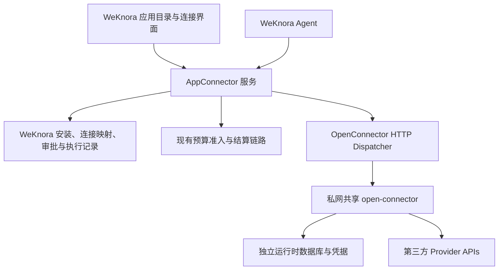

# WeKnora 与 open-connector 多租户 SaaS 集成设计

日期：2026-09-12。状态：**共享运行时及 WeKnora 管理租户隔离已确认；其余技术细节为建议稿，尚未实施或完成运行验证。**

关联：[已接受 ADR](../../adr/0001-open-connector-shared-runtime.md)、[领域词汇](../../../CONTEXT.md)、[SaaS 商业与 Connector 规格](2026-09-10-saas-billing-connectors-design.md)、[现有 SaaS 04 计划](../plans/2026-09-11-saas-04-connectors.md)。本文细化集成，不替代既有商业权限、预算或同步契约。

详细任务见 [实施计划](../plans/2026-09-12-open-connector-integration.md)。计划已按本次请求编写，尚未执行；固定版本契约与真实环境验收仍是前置门禁。

## 1. 决策与证据边界

已确认：私网共享 open-connector，WeKnora 负责空间、成员与连接归属校验，调用使用按连接限制的 Token；保留独立实例选项。每空间独立部署和混合部署不是首期默认方案。

以下均为设计建议：HTTP 派发、目录发布方式、OAuth 桥接、数据模型、接口改造与阶段安排。用户对隔离方式的选择不等于这些细节整体获批。

当前目录静态检查发现 `internal/appconnector`、安装/连接仓储、App handlers 和 ActionService 已存在；`internal/container/container.go` 构造 ActionService 时 dispatcher 和 unknown resolver 仍传入 nil。进一步阅读发现 Execute 尚未检查 nil dispatcher，且 settleOutcome 会把派发 error 归为 failed；实施计划 T11 明确修复这两点。不能继续采用此前“只有规划、没有 AppConnector 实现”的旧判断，也不能据代码存在宣称整链生产可用。未检查其他 worktree，未运行应用、迁移或外部调用。

研究时观察到 upstream main 为 `33dd4ad6ee22f9ce5158a1516a11d8b8566b5c8a`。这是候选研究提交，不是已经测试、批准的发布版本；P0 必须按固定提交重新核对文档、源码、镜像摘要及契约。

## 2. 架构与权威归属

| 能力 | 权威归属 |
| --- | --- |
| 空间、成员、连接归属与使用授权 | WeKnora |
| App/Action 发布版本、可信 schema 与风险 | WeKnora |
| 审批、执行准入、结果状态和恢复决策 | WeKnora |
| Credits 与商业结算 | 既有商业链路/OpenMeter；不建立第二本账 |
| 新增 OC 连接的凭据、OAuth 交换与刷新 | open-connector |
| Provider 操作执行 | open-connector |
| 知识同步进度与入库 | 现有 DataSource 系统 |

每个连接只有一个凭据与刷新管理方。原生飞书/Notion、现有 MCP 连接保持原路径；OC 连接记录独立 backend 类型，不能让双方同时刷新同一凭据。

## 3. 共享运行时隔离约束

1. 所有用户和 Agent 请求经 WeKnora，身份由认证会话或受控任务上下文产生；请求中的 tenant ID、别名或 URL 不构成授权。
2. 本地查询必须绑定 tenant_id、connection_id，并检查安装启用、连接状态、成员关系、个人 Owner 或空间显式授权。
3. 执行地址来自内部运行时配置；外部 Connection ID 与不可变别名从本地映射获取，模型不能覆盖。
4. 普通执行使用存储型 Runtime Token，非空 allowedConnections 精确绑定连接，Actions 限定为审核集合。无连接或无允许动作时不签发 Token，绝不以空清单模拟拒绝全部。
5. 撤销最后一个授权时删除 Token，不写入 allowedConnections=[]；普通执行不用 Bootstrap Token 或未经验证的 JWT 连接授权路径。
6. 首期关闭 Provider Proxy；MCP、管理 API、控制台和运行日志不直接对租户开放。目录、连接列表和日志由本地授权记录过滤。
7. 无凭据 Provider 也必须经过本地动作授权、限流和预算，不能因为 upstream 不要求连接授权而获得无限调用。
8. 控制面与执行面分别持有管理凭据和受限运行凭据；全局管理凭据仅用于受控连接/Token 管理，不进入普通 Agent 调用进程或响应。
9. 运行时与数据库使用独立密钥和备份；共享故障与管理权限的影响范围被视为真实风险，不描述为物理租户隔离。
10. 设置空间、连接、Provider 和全局并发/速率限制，避免单空间占满共享资源。公平性及限额数值由负载验证决定。

## 4. 数据模型建议

保留 Installation、Connection、Action 现有模型，优先增加映射和派发记录。以下为逻辑记录，不是既有表或已定迁移编号。

| 记录 | 核心信息 |
| --- | --- |
| connector_runtimes | 内部地址、健康/启停状态、版本和镜像摘要、密钥引用 |
| connector_connection_bindings | tenant、本地 connection、runtime、backend、provider、外部 connection ID、不可变 alias、账号展示信息、binding version |
| connector_action_definitions | App 版本、upstream Action ID、schema 摘要、可信风险、scope、发布状态 |
| connector_authorization_attempts | tenant、actor、installation、connection、随机尝试标识、期限、完成状态及 upstream 关联 |
| connector_dispatch_records | 本地 Action ID、运行时/连接/动作版本、幂等键、首次派发时间、回放期限、外部 executionId |
| connector_operations_outbox | 连接确认、Token 更新、远端撤销与孤立资源清理任务 |

外部 `(runtime_id, external_connection_id)` 不得同时绑定给不同本地连接或空间。别名由服务端生成且不复用；展示名称变化不改变执行身份。凭据后端切换、重新授权或账号替换必须更新绑定/授权版本，旧审批不可继续派发。运行时切换不会自动迁移旧幂等记录；未决执行必须留在原运行时核对。

## 5. 现有代码改造边界

| 文件/模块 | 建议变化 |
| --- | --- |
| internal/appconnector/model.go | 保留领域连接语义，增加后端关联的明确类型或独立映射 |
| internal/application/service/appconnector/credentials.go | 分离连接授权检查与原始凭据加载，OC 路径只解析受控绑定 |
| internal/application/service/appconnector/action.go | 复用 ActionService；冻结 upstream Action、schema、连接及运行时绑定版本 |
| internal/application/repository/appconnector | 增加租户作用域的绑定、授权尝试和派发持久化 |
| internal/appconnector/openconnector（拟新增） | HTTP 客户端、目录契约、错误映射；不负责产品审批或计费 |
| internal/application/service/appconnector（扩展） | 实现 ActionDispatcher、结果核对和连接协调 |
| internal/handler/app_connector_* | 扩展现有连接/动作产品 API，保留原生 Provider 路径 |
| internal/container/container.go | 注入真实 dispatcher；未配置运行时仍拒绝派发 |

ActionService 已有预算入口，不再嵌套 GatedAdapter 消费第二次审批或重复预占/计费。Agent 的通用工具执行记录引用同一 Action ID，不因 Agent 重试创建新的逻辑副作用。

当前权限 helper 对写入口包含 owner/admin 限制。个人连接并不自动意味着普通成员已经获准创建或执行；实施时先保留现行权限，若需扩大成员权限须单独确认业务矩阵。

## 6. OAuth 与撤销

授权：本地校验 → 创建 pending 连接/尝试 → 生成唯一 alias → 后端发起 OC 授权 → 浏览器到 Provider → Provider 回调 OC → 后端确认确切外部连接和账号/scope → 重查本地权限 → 激活连接并建立受限 Token。

只向外开放必要 OAuth callback，管理接口保持私网。浏览器回跳只触发界面刷新；不得据其参数或成功提示激活连接。OAuth 尝试与本地 tenant/actor/installation/connection 的关联、一次性消费及过期行为必须在固定 upstream 版本中验证。不得通过“最近创建的连接”猜测授权完成，也不得覆盖不属于该尝试的连接。

若 upstream 缺少可靠完成关联机制，P0 给出最小扩展方案，之后才能开放 OAuth。远端创建成功但本地写入失败形成孤立记录时，通过已持久化尝试和唯一 alias 对账；只有完成归属核验的记录可清理。已过期或本地撤销的尝试即使回调成功也不能激活。

撤销：本地先标记不可用、提高 AuthVersion、使缓存失效并阻止新派发；outbox 清理 Token 和远端连接。远端失败继续重试，本地不能恢复 active。派发和撤销的本地线性化边界由最终权限检查与派发 claim 确定；已派发不承诺撤回。提供商侧 OAuth 撤销与本地断开连接分开展示。

## 7. Action 执行与幂等

建议 HTTP 为生产 Action 入口。调用路径固定为 `/v1/actions/{已审核ActionID}`，使用受限运行 Token、明确 alias 和逻辑操作唯一随机 Idempotency-Key。目标 URL、方法、认证头不可由模型提供。

Prepare 时冻结本地 tenant/actor/connection、AuthVersion、runtime/binding version、Provider/Action ID、App 版本、schema 摘要、目标和规范化参数。审批覆盖完整快照；Execute 从持久快照读取，不重新接受模型参数。风险以本地审核定义为准。

结果规则：本地拒绝不派发；明确未执行的 upstream 拒绝可失败；明确成功保存 Provider 标识；超时、断连和无法证明无副作用的响应进入 unknown。HTTP 200 不自动等于 Action 成功，必须验证 envelope、结果结构和必要的 Provider 标识。

upstream 文档声明 HTTP 幂等回放为 24 小时，键为运行时全局命名空间；MCP execute_action 不支持同一幂等键机制。回放只允许原键、原运行时、原 Action、原账号与原参数，且不能绕过本地撤销或权限检查。

24 小时窗口使用首次派发的保守本地截止时间；超时、时钟不确定或超过窗口均停止自动回放，不能赌同键仍受保护。处理中或结果无法持久化的 409 不触发新键。无可靠 Provider 查询时保留 unknown，不制造失败、不自动重发。

收到成功但本地保存/计费失败时，补偿持久化与结算，不重复外部写入。upstream `auditPersisted=false` 不否定业务结果；本地独立保留执行审计。

## 8. 目录、Sync 与计费

目录先导入候选，再经平台审核发布。scope、schema、风险和执行器版本变化不能自动扩大安装权限。大量 Provider 不等于所有动作都可向租户开放；文件/临时 URL 类操作首期不开放，直至验证归属、有效期、下载权限、SSRF 与清理行为。

现有 Sync 首期保留，不为了统一连接器替换 DataSource 的资源枚举、游标或入库链路。后续允许 OC 作为读取适配器时仍遵守持久交接后推进 checkpoint 的现有契约。

一个逻辑 Action 使用稳定用量事件 ID，HTTP 回放不重复收费。收费路径复用现有预算与结算，不把运行时日志当成账本。unknown 的预占到期、核对、退款或结算沿用商业恢复机制，不自动视为零消耗或永久占用。

## 9. 阶段与验收

这是阶段设计，不是可直接执行的逐文件 TDD 实施计划。

| 阶段 | 依赖 | 交付与退出条件 |
| --- | --- | --- |
| P0 契约验证 | 无 | 固定提交/镜像；验证连接限制、OAuth 关联、错误 envelope、幂等窗口/恢复；不满足共享隔离即阻止生产接入 |
| P1 目录与运行时 | P0 | 审核目录、版本固定、私网配置、禁用代理；未审核动作不可调用 |
| P2 连接生命周期 | P1 | 个人/空间绑定、授权、撤销/outbox、孤立记录对账；跨空间与账号替换拒绝 |
| P3 派发与恢复 | P2 | 注入现有 dispatcher；单次副作用、冻结参数、unknown 与结果补偿 |
| P4 Agent/界面 | P3 | 产品目录、连接选择、审批、执行记录共用授权与生命周期 |
| P5 灰度与运维 | P4 | 限流、公平调度、备份恢复、升级回退、计费恢复；真实 Provider 验收 |

最低验收：两个空间、每空间两个成员、一个成员跨空间、同 Provider 两个账号；验证列举/查询/执行/日志均不串租户。覆盖 alias 伪造、外部 ID 换绑、空清单、默认连接回退、撤销与派发竞争、过期 OAuth、scope 升级、离开空间、并发重复请求、运行时崩溃和24小时窗口外恢复。

首批候选为 GitHub 只读、Notion 创建页面及一个消息发送动作；它们尚不是已确认产品清单。真实写入前需要明确测试账号、目标和内容。飞书现有原生适配继续可用，是否切换根据目标 Action 的真实能力决定。

## 10. 下一步待确认

共享部署已确认，不再重复询问。完整技术稿评审重点为：HTTP 执行边界与凭据管理方切分、OAuth 完成关联、首批 Provider/Actions、普通成员创建/执行权限是否沿用当前矩阵。接受这些细节后，再生成逐任务实施计划，不把本文阶段表当成实现或验收证据。

## 11. 外部依据

- [运行 API、Token grants、HTTP 幂等与审计](https://github.com/oomol-lab/open-connector/blob/33dd4ad6ee22f9ce5158a1516a11d8b8566b5c8a/docs/runtime-api.md)
- [连接命名、OAuth、加密与刷新](https://github.com/oomol-lab/open-connector/blob/33dd4ad6ee22f9ce5158a1516a11d8b8566b5c8a/docs/credentials.md)

文档声明不等于运行证明；P0 对固定源码与镜像重新收集证据。此稿未创建外部 Issue、未提交 Git、未部署、未修改业务代码。
