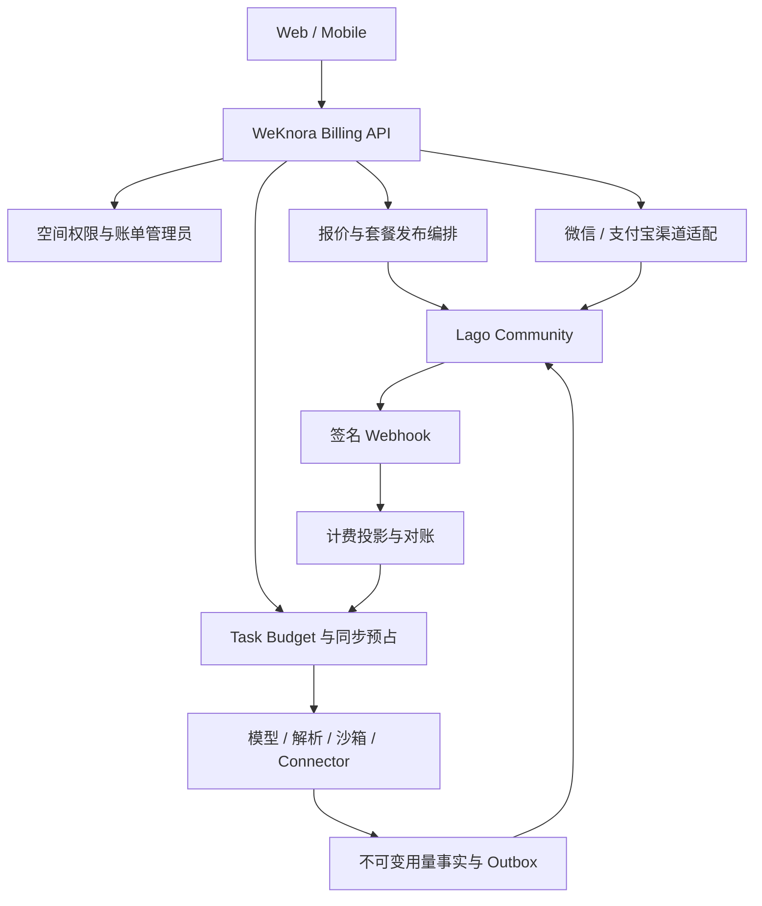

# Lago 计费平台迁移设计

日期：2026-09-20  
状态：已批准  
关联：[领域词汇](../../CONTEXT.md)、[ADR-0012](../adr/0012-lago-as-commercial-billing-authority.md)

## 1. 决策摘要

WeKnora 将自托管 Lago Community 作为套餐、订阅、功能权益、Credits、用量计价、客户账单、Credit Note 和商业付款状态的权威平台，替代现有 OpenMeter 集成。

WeKnora 继续拥有空间身份与权限、面向用户的计费 API、付款前报价、微信／支付宝渠道集成、Task Budget、同步额度预占、原始用量事实、渠道退款、Outbox、计费投影以及异常恢复。WeKnora 不再维护可独立发放或扣减 Credits 的第二本商业账。

迁移只处理开发环境数据，不迁移现有 OpenMeter 测试数据，不长期双写。Lago 一旦开始承载真实商业数据，系统只允许前向修复，不能通过切回 OpenMeter 回滚账本。

## 2. 背景与问题

当前实现并不是完整的 OpenMeter 计费系统：

- WeKnora 本地商业域掌握套餐版本、订单、微信／支付宝、退款、价格换算、任务预算、资源配额和原始用量。
- `internal/infrastructure/openmeter/commercial.go` 只尝试实现 Credits Grant、撤回和结算等少量外部操作，没有贯通 Customer、Plan、Subscription、Entitlement、Invoice 或 Usage Event API。
- OpenMeter 部署目录被定义为本地开发和集成环境，不是生产部署。
- 现有 OpenMeter 接口清单记录的 external settlement 是 `POST .../settlement/external`，而 Go 适配器使用 `PATCH .../settlement`；现有适配器测试是 HTTP 桩，不构成真实端到端证据。

因此，本迁移不能把当前 OpenMeter 适配器视为正确且完整的生产基线，也不能只做包名和 URL 替换。目标是重新确定商业权威边界，并用真实 Lago 环境验证关键语义。

## 3. 目标

本次迁移必须实现：

1. 一个空间对应一个独立 Lago Customer，并保持独立购买、付款和 Credits 归属。
2. Lago 权威管理不可变套餐版本、连续订阅链、权益、Wallet、Credits、用量计价、账单、付款状态和 Credit Note。
3. WeKnora 保留微信／支付宝支付体验和渠道安全边界。
4. 收费执行在真实调用前经过同步、原子的 Task Budget 和额度预占。
5. Lago 异步计价通过 Task／结算批次与 Pricing Group 对账，不伪造逐事件计价回执。
6. 套餐额度、充值额度、升级补发、退款锁定、BYOK 和基础档语义保持不变。
7. 所有付款、履约、用量、退款和 Webhook 流程支持幂等重放、乱序、响应丢失和 worker 崩溃恢复。
8. 自托管 Community 版、许可证、生产运维、备份恢复和观测门槛在上线前得到验证。

## 4. 非目标

首期不包含：

- OpenMeter 测试数据迁移；
- Lago Cloud；
- Lago Premium 功能；
- 中国法定税务发票；
- 多 Billing Entity、多币种或跨币种 Wallet；
- 阶梯价、百分比、最低消费、承诺消费等无法生成可信执行上界的复杂价格；
- 自动扣款；
- 客户端直连 Lago；
- Lago 提供逐事件计价完成回执；
- ClickHouse／Kafka event store；
- 运营人员直接修改已发布 Lago Plan；
- 长期双写 OpenMeter 与 Lago；
- 通过绕过许可证或 Premium 功能开关获得受限能力。

## 5. 必须保持的产品不变量

- 空间是购买、付款、订阅、余额和账单的唯一归属边界；共享组织不合并商业归属。
- 套餐决定功能权益、资源上限和周期额度；充值只增加 Credits。
- 套餐内额度按月发放、当期有效、不结转；年付套餐仍逐月发放。
- 每批充值额度自到账起有效 12 个日历月。
- Credits 按先到期先消费；同到期批次按发放先后消费。
- 到期未续费切换到基础档，保留未到期充值额度和已有数据；超限只阻止新增，不删除已有资源。
- 平台模型产生模型 Credits；BYOK 不重复收取模型 Credits，但解析、沙箱和 Connector 等仍可收费。
- 每个收费 Task 有有限预算；父子执行共享该预算，不能复制余额。
- 失败和取消仍结算实际发生的收费使用；未知结果继续保留预占。
- 退款先锁定待退权益；渠道退款和 Lago 撤权都确认后才完成。
- 支付成功、Lago 权益生效和 WeKnora 准入放行是三个独立事实。

## 6. 权威边界

| 数据或决策 | 权威方 | WeKnora 本地允许保存的内容 |
| --- | --- | --- |
| 空间、成员、账单管理员和操作权限 | WeKnora | 权威身份与授权记录 |
| Lago Organization | 部署配置 | Lago Organization 映射与版本 |
| Customer | Lago | 空间到 Customer 的不可变映射和投影 |
| 套餐草稿与发布审批 | WeKnora | 草稿、审计、发布命令 |
| 已发布套餐、Charge、Metric、Entitlement | Lago | 不可变版本映射和只读计费投影 |
| Subscription | Lago | 可重建状态投影，不可独立变更 |
| Wallet、Credits、消费与 Credit Note | Lago | 余额／批次投影和对账水位，不可独立改账 |
| 最终用量计价 | Lago | 价格版本投影、原始用量和关联证据 |
| Task Budget、预占和退款锁定 | WeKnora | 同步协调状态；不是第二个 Wallet |
| Customer Invoice 与商业付款状态 | Lago | Invoice／Payment 投影和对象映射 |
| 微信／支付宝交易与渠道退款事实 | WeKnora | 不可变验签结果、尝试、外部交易和退款状态 |
| 实际资源占用 | WeKnora | 成员、存储、并发等权威计数 |

WeKnora 的计费投影可用于展示、权限判断和保守准入，但不得脱离 Lago 发放、扣减或撤回 Credits，也不得把本地余额字段暴露为独立商业真相。

## 7. 逻辑架构

Lago API 不直接暴露给浏览器或移动端。客户端只使用 WeKnora 的 provider-neutral Billing API；Lago 内部 ID、API Key、Lago Organization 和原始状态枚举不构成公共客户端契约。

## 8. 身份、组织与币种

- 一个 WeKnora 部署实例对应一个独立 Lago Organization。
- 一个空间对应一个 Lago Customer。
- `external_customer_id` 由 WeKnora 生成，稳定、不可复用且不包含个人信息。
- 成员变更、Owner 转移或空间改名不改变 Customer 身份。
- 首期每个部署实例只有一个收费主体和人民币 CNY。
- 货币金额在 WeKnora 使用整数分；与 Lago 交互时不得经过浮点数。
- 空间删除后停止新收费并撤销可消费权益；交易、账单、付款、退款和审计按合规政策保留，展示信息可去标识化，Customer ID 永不复用。

## 9. 套餐、订阅与权益

### 9.1 不可变套餐版本

每个 WeKnora 套餐版本对应一个新的 Lago `plan_code`。发布后禁止修改其基础费、Charge、Billable Metric、Entitlement、资源上限或周期额度；任何商业变化都发布新版本。

套餐层级必须与基础订阅费的日化金额单调一致，使 Lago 对 upgrade／downgrade 的判断与产品语义一致。促销使用 Discount／Coupon 表达，不通过降低高档套餐基础价格制造层级倒挂。

WeKnora 管理后台是唯一商业配置入口。Lago UI 仅供受控诊断，不允许运营人员直接编辑已发布对象。

### 9.2 升级、降级与基础档

- 升级使用相同 external subscription ID，立即生效并保留周期锚点。
- WeKnora 根据新旧不可变套餐版本和原周期锚点计算当月套餐 Credits 补发；补发作为带确定到期时间和幂等键的 Lago granted Wallet Transaction。
- 降级在当前周期结束后生效，不提前收回本周期已发额度。
- 年付订阅仍按月创建套餐额度，不一次发放全年 Credits。
- 到期未续费通过同一 external subscription ID 切换到免费基础套餐，不创建并行订阅。
- Wallet 属于 Customer；切换套餐不清除未到期充值 Credits。

### 9.3 Entitlement 与资源配额

Lago Entitlement／Privilege 定义套餐允许的功能和资源上限。WeKnora 同步只读投影，并在敏感操作时检查当前有效订阅。成员、存储、并发等实际占用由 WeKnora 原子统计和限制。

充值只增加 Wallet，不改变 Entitlement 或资源配额。投影过期或 Lago 不可用时，禁止新增高级操作，但允许查看、导出和清理。

## 10. 报价、购买与支付

### 10.1 报价

首期只允许能从不可变套餐版本确定计算的价格。WeKnora 在付款前生成带商品版本、币种、金额、权益和有效期的报价，再让 Lago 创建实际订阅／账单。

创建渠道支付单前，报价必须与 Lago Invoice 的金额、币种和行项目逐项一致。任何不一致、报价过期或订阅状态变化都会终止流程并要求重新报价。报价不是最终账单，也不能反向修改 Lago Invoice。

### 10.2 首次购买

1. WeKnora 验证购买权限和报价。
2. Lago 创建 pay-in-advance、无 trial、带 payment activation rule 的 Subscription。
3. Subscription 保持 `incomplete`，Lago 生成首张 Invoice。
4. WeKnora 核对报价与 Invoice，并创建渠道支付单。
5. 微信／支付宝回调经签名、商户、订单、金额、币种和状态验证后形成付款事实。
6. WeKnora 通过 Lago 支持的外部付款接入写入 Payment。
7. 只有 Lago Subscription 变为 `active` 后，WeKnora 才更新投影并开放权益。

付款成功但尚未激活时显示“已付款，权益处理中”，继续按原幂等键恢复，不引导再次付款。

外部 manual payment 是否能解除 payment activation rule 尚无官方明确保证，必须通过真实契约测试。若不能，实施 Lago 认可的外部 Payment Provider 适配；不得由 WeKnora 绕过 Lago 强行把订阅标为 active。

### 10.3 Credits 充值

1. Lago 创建待付款 Wallet Transaction／Invoice。
2. WeKnora 核对报价并创建渠道支付单。
3. 渠道付款确认后向 Lago 登记 Payment。
4. 只有 Lago 确认 Wallet Credits 已入账后才允许消费。
5. 付款成功但 Credits 未到账时进入幂等履约队列。

不得在支付成功前把 paid credits 计入可消费余额。

### 10.4 异常付款

- 重复通知幂等处理，不重复创建 Lago Payment。
- 多个支付尝试均成功时只履约一次，其余进入多收款退款处理。
- 金额不足、币种不符或账单不匹配不能激活权益。
- 超额付款不自动转换为额外 Credits。
- 异常渠道事实必须保留，但不得改变 Lago Invoice 或扩大权益。

## 11. Usage、计价和预算

### 11.1 用量事实与事件身份

WeKnora 保存每个真实收费活动的不可变 Usage Fact。它至少记录 tenant、task、run、physical call、attempt、revision、服务维度、资金来源、发生时间、状态和原始数量。

每个物理尝试和修订映射到全局稳定、不可复用的 Lago `transaction_id`：

- 相同投递重试复用同一 transaction ID 和 timestamp；
- 真正的新尝试或修订使用新 ID；
- 相同 ID 但内容不同返回冲突；
- 不利用 ClickHouse pipeline 的 overwrite 行为静默改写事件；
- 持久保存 Usage Fact、transaction ID、Subscription、Metric、timestamp、接收响应和结算批次之间的关联。

Lago Event API 的成功响应只证明接收，不证明事件已经关联、聚合或计价。

### 11.2 价格与预占

Lago Billable Metric 和 Charge 是最终计价权威。WeKnora 只保留同一不可变版本的准入价格投影，用于计算收费执行的保守上界。

首期只开放固定单价、确定包价或具有明确封顶、能生成可信上界的模型。无法计算上界、价格投影缺失或投影过期时拒绝新的收费执行。

每次真实模型、解析、沙箱或 Connector 调用前，WeKnora 必须原子检查：

- 当前 Tenant、Task 和 Run；
- Task Budget；
- 空间保守可用余额；
- 已结算消费；
- 未确认结算批次；
- 退款锁定；
- 调用费用上界；
- 预算和执行截止时间。

读余额后再派发不是安全的原子预占。并发调用不能消费同一份余额；父子 Agent 和 Connector 共享父 Task Budget。

### 11.3 Task／结算批次

Lago 没有公开的单事件 `rated` 状态或成功计价 Webhook。首期按 Task 或受控时间窗口形成结算批次，并通过独立 Pricing Group 查询 current usage。

只有当 Lago current usage 可关联到该 Task／结算批次并返回确定计价结果时，WeKnora 才按实际费用结算对应预占。不得用整个 Wallet 的余额变化猜测单笔费用，也不得把聚合结果描述为逐事件计价回执。

计价异步期间：

- 原预占继续占用；
- 只要 Task Budget 和空间保守余额仍有余量，可以继续新的已预占调用；
- 达到预算、余额下界或最大未确认窗口后，暂停该 Task 新收费动作；
- 已发生用量必须继续持久化并最终进入 Lago。

若 Lago ongoing balance 为负，立即停止新的收费动作并进入对账；不得删除或伪造已发生用量，也不得静默补发 Credits。

### 11.4 修正

原始用量事实永不覆盖。未形成最终 Invoice 时，只对经过真实验证支持修正的 Metric 发送关联补偿用量。原事件与补偿事件共同形成审计链。

已形成最终 Invoice 后，不修改原事件或原账单；财务差额通过 Credit Note 或追加账单处理。无法证明安全修正时进入人工核对。

## 12. Credits 批次与消费顺序

套餐额度和充值额度必须保持独立来源、金额、发放时间和到期时间。产品要求全局先到期先消费，同到期先发先用。

Lago 支持多个 Wallet、Wallet priority、Transaction priority、Wallet expiration 和 traceable transaction，但公开契约尚未证明任意数量批次下能够完整满足该排序。实现可以通过 WeKnora 协调层组合 Lago Wallet／Transaction 和优先级，但 Lago 始终是余额权威。

以下能力在真实环境验证前阻断上线：

- 每月套餐额度到期且不结转；
- 每批充值额度独立有效 12 个月；
- 套餐与充值批次统一先到期先消费；
- 同到期批次按发放顺序消费；
- 升级补发不会重发已用额度；
- refund／void 只撤回未消费部分；
- 并发消费、到期、补发和退款不会产生负的可退余额或重复 Credits。

若 Lago 原生对象和协调层无法通过这些测试，迁移保持阻断状态；不得静默弱化产品规则。维护 Lago fork 或修改产品规则需要新的 ADR 和 Spec。

## 13. 退款与撤权

1. WeKnora 创建退款申请并锁定对应待退权益。
2. 根据 Lago traceable Wallet、Invoice、Payment 和 Credit Note 重新计算可退范围。
3. 平台运营审核，申请人与审批职责分离。
4. 使用稳定退款键调用原微信／支付宝渠道。
5. 渠道确认退款成功后，在 Lago void 剩余 Credits、调整 Subscription 或创建 Credit Note。
6. 渠道成功但 Lago 撤权失败时保持退款锁定和 `revocation_pending`，继续按原命令恢复。
7. 渠道退款和 Lago 撤权都确认后，退款完成。

渠道退款受理、Lago 命令接收或本地状态写入均不能单独代表退款完成。退款锁定只是临时风险控制，不是第二个 Wallet。

## 14. 本地持久化边界

WeKnora 保留：

- 套餐草稿、发布命令、审计和 Lago 对象映射；
- 报价；
- 渠道支付单、付款事实和渠道退款事实；
- Task Budget、额度预占和退款锁定；
- Usage Fact、Lago Event 关联和结算批次；
- Customer、Subscription、Entitlement、Wallet、Invoice 和 Payment 的可重建投影；
- Outbox、Inbox、Webhook 去重、对账和恢复记录。

现有表可以迁移为投影或协调记录，但不得继续作为本地套餐发布、Subscription、Wallet、Credit Lot、最终计价、Invoice 或 Payment 状态的独立权威。

## 15. API 与用户状态

客户端使用稳定的 WeKnora Billing API。服务端把 Lago 状态映射为产品状态，至少包括：

- 待付款；
- 已付款待激活；
- 已生效；
- 权益处理中；
- 等待计费同步；
- 余额不足；
- 退款审核中；
- 渠道退款处理中；
- 撤权待恢复；
- 需要人工处理。

客户端不能依赖 Lago 内部 ID、字段名或状态枚举，也不能获得 Lago API Key 或内部 URL。

## 16. Webhook、幂等与恢复

- Lago Webhook 只表示状态可能变化；收到后必须从 Lago API 重新读取权威对象。
- 校验 HMAC 或 JWT 签名。
- 使用 `X-Lago-Unique-Key`、对象 ID 和版本去重。
- 乱序通知不得使本地投影倒退。
- 定期对账覆盖丢通知、有限重试耗尽和投影漂移。
- WeKnora → Lago 命令通过本地 Outbox、稳定幂等键和响应关联恢复。
- 相同幂等键不同内容必须拒绝。
- 超时和 5xx 视为结果未知；先查询原对象，不能换键盲目重试。

Lago 不可用时停止新购买、套餐变更、充值和新的收费执行，但继续持久化支付回调、已发生用量、Outbox 和恢复任务；查看、导出和清理仍按权限开放。

## 17. 安全、隐私和许可证

- Lago API Key 只存于服务端 Secret Manager。
- 网络策略只允许指定 WeKnora 服务和受控运维网络访问 Lago。
- Webhook 使用独立验签材料。
- 替换 Compose 示例中的数据库密码、`SECRET_KEY_BASE`、RSA 和加密密钥。
- Community 版通过受控即时轮换与服务配置切换管理 API Key。
- 密钥泄露时立即停止新商业命令、轮换、审计并对账。
- Usage Event 不包含 Task 内容、Prompt、模型输出、知识内容或 Connector 参数，只包含计费所需维度与关联标识。
- 账单联系人、地址和税务信息按实际业务需要最小化同步。
- 日志和 metadata 不保存渠道密钥、原始凭据或敏感回调正文。

Lago 主仓库采用 AGPL-3.0。生产上线前必须完成法务／合规审查；任何 Lago 代码修改、自定义计价回执扩展或发布方式变化都需要重新审查。不得绕过 Premium 功能开关或商业许可。

## 18. 部署与运维

### 18.1 环境

- 本地开发和 CI：固定版本的 Lago Docker Compose。
- 生产：Kubernetes／Helm。
- 生产依赖：独立高可用 PostgreSQL、Sidekiq Redis、Cache Redis 和 S3 兼容对象存储。
- API、events、billing、webhook、wallet、clock、PDF worker 分开部署和扩缩。
- 补充项目级 readiness；不能只依赖 `/health` liveness。
- 首期使用 PostgreSQL event store。
- 只有真实压测超过容量或查询延迟门槛后，才按 Lago 官方流程另行迁移 ClickHouse／Kafka；不得手工翻转 Lago Organization event-store 标志。

### 18.2 可恢复性

- PostgreSQL 持续归档／PITR，目标 RPO 不超过 5 分钟。
- 服务恢复目标 RTO 不超过 60 分钟。
- Redis 队列不是唯一事实源；关键工作可从 Outbox、Lago 数据库和幂等命令重建。
- 对象存储、配置、密钥引用、许可证材料和固定版本清单纳入备份。
- 上线前必须在 staging 完成完整恢复和账务对账演练。

### 18.3 观测目标

- event acceptance 到结算批次可核对：p95 不超过 60 秒；
- 单批次超过 5 分钟仍不可核对：暂停该 Task 新收费动作；
- 超过 15 分钟或收到 `events.errors`：触发运营告警；
- 监控 API、各 Sidekiq 队列延迟、dead jobs、失败率、Webhook 重试、负余额、投影陈旧、付款未激活、退款撤权失败和 `reconciliation_pending` 年龄。

### 18.4 升级

- 固定精确 release tag，禁止 `latest`。
- 阅读 release notes 和 migration guide，按要求经过 bridge release。
- 升级前建立恢复点。
- staging 重放固定的计费、支付、退款和对账 fixtures。
- API 契约、数据迁移、性能和恢复门槛通过后才滚动生产。
- 不手工修改 Lago 业务数据或 Lago Organization event-store 标志。

## 19. 迁移与收尾

1. 建立独立 Lago 开发／集成环境，不复用 OpenMeter 数据库、Kafka、ClickHouse 或 Redis。
2. 固定 Lago Community 版本、镜像摘要、配置和依赖。
3. 用合成 Tenant、Customer、套餐、Subscription、Wallet、Payment 和 Usage 完成能力门槛。
4. 新增 Lago 适配器并保留 provider-neutral commercial seam。
5. 将本地权威表迁移为协调记录或可重建投影。
6. 完成端到端、故障注入、性能、安全和恢复验收。
7. 在发布窗口停止 OpenMeter 开发写入并切换默认适配器。
8. 完成一次无真实商业数据的可回退发布验证。
9. 关闭回退窗口后删除 OpenMeter adapter、Compose、镜像锁、专属探测脚本和环境变量。
10. 保留必要历史设计／验证记录并标记为已废弃。

影子验证只能使用合成数据，影子 Lago 不得改变真实权益。不存在长期双写模式。

## 20. 能力门槛

以下均必须使用固定版本的真实 Lago Community 环境取得证据，OpenAPI、mock 或单元测试不能代替：

| ID | 门槛 | 通过标准 |
| --- | --- | --- |
| LG-01 | Community 与许可证 | 目标 API 均可在 Community 使用；AGPL／商业许可审查完成。 |
| LG-02 | Customer 与隔离 | 一空间一 Customer；跨空间 ID、Event、Wallet、Invoice 和 Webhook 不串。 |
| LG-03 | 不可变套餐 | 新版本使用新 plan code；旧 Subscription 不受目录修改影响。 |
| LG-04 | 外部支付激活 | 微信／支付宝可信付款能通过受支持接入使 `incomplete` Subscription 变为 `active`；重复不重复激活。 |
| LG-05 | 充值履约 | 未付款不入账；付款成功后恰一次入账；响应丢失可恢复。 |
| LG-06 | Credits 批次 | 月额度、12 个月充值、先到期先消费、并发消费和 void／refund 全部符合不变量。 |
| LG-07 | Usage 幂等 | 重复 Event 不重复计量；新 attempt／revision 独立；冲突内容拒绝。 |
| LG-08 | Task／批次计价 | Pricing Group 可关联 current usage；金额与固定 fixtures 一致；无逐事件回执时不伪造确认。 |
| LG-09 | 计价延迟与规模 | 达成 p95 60 秒目标；Task/Pricing Group 基数、峰值 ingestion 和账期峰值通过压测。 |
| LG-10 | 预算并发 | 多 worker 竞争最后余额时总获准上界不超可用余额；未知结算不提前释放。 |
| LG-11 | 修正与出账 | 未出账补偿、finalized Invoice 后 Credit Note 和追加账单行为正确。 |
| LG-12 | 升降级与基础档 | 升级立即生效和补发正确；降级／基础档周期末生效；Wallet 保留。 |
| LG-13 | 退款 | 锁定、审批、渠道退款、Lago 撤权、失败恢复和重复调用不造成多退或多撤。 |
| LG-14 | Webhook 与对账 | 签名、重复、乱序、丢失、有限重试耗尽和定期对账可恢复。 |
| LG-15 | 故障注入 | API 超时、worker 崩溃、队列积压、响应丢失和重启不丢付款／用量且不重复权益。 |
| LG-16 | 安全与隐私 | API Key、Webhook secret、Tenant 隔离、最小 Usage metadata 和日志脱敏通过审查。 |
| LG-17 | 备份恢复 | staging 恢复后 Customer、Subscription、Wallet、Invoice、Payment、待处理任务和投影完成对账；满足 RPO/RTO。 |
| LG-18 | OpenMeter 收尾 | 回退窗口关闭；运行依赖和配置删除；历史记录明确废弃；无双写路径。 |

任何门槛失败都必须标记为 blocker 或形成新的已批准范围调整，不得静默降级或以“接口请求成功”替代业务验收。

## 21. 完成标准

只有在以下全部成立时，迁移才算完成：

- LG-01 至 LG-18 全部通过；
- 套餐购买、充值、升级、降级、到期回基础档闭环；
- Task 预占、Lago 计价、结算批次和余额对账闭环；
- 修正、退款、Credit Note 和撤权恢复闭环；
- 微信／支付宝与 Lago 激活闭环；
- 必要测试、类型检查、Lint／静态分析和故障注入通过；
- 性能、延迟、RPO／RTO 和恢复演练通过；
- AGPL／许可证审查通过；
- 独立 Spec Compliance 与代码 Review 无未处理阻断项；
- 最终 Diff 只包含批准范围内的迁移内容。

## 22. 官方事实来源

- [Lago GitHub 与许可证](https://github.com/getlago/lago)
- [Lago Self-hosted](https://docs.getlago.com/guide/self-hosted)
- [Lago OpenAPI](https://getlago.com/api/openapi.yaml)
- [Lago Event Object](https://docs.getlago.com/api-reference/events/event-object)
- [Lago Current Usage](https://getlago.com/docs/api-reference/customer-usage/get-current)
- [Lago Subscription Assignment](https://getlago.com/docs/guide/subscriptions/assign-plan)
- [Lago Upgrades and Downgrades](https://doc.getlago.com/guide/subscriptions/upgrades-downgrades)
- [Lago Payment Receipts](https://docs.getlago.com/guide/payments/receipts)
- [Lago Webhook Format and Signature](https://getlago.com/docs/api-reference/webhooks/format---signature)
- [Lago Docker Self-hosted Guide](https://getlago.com/docs/guide/lago-self-hosted/docker)
- [Lago Helm Charts](https://github.com/getlago/lago-helm-charts)
- [Lago Monitoring](https://github.com/getlago/lago/blob/main/docs/monitoring.md)
- [Lago Upgrade Guidance](https://doc.getlago.com/guide/lago-self-hosted/update-instance)
