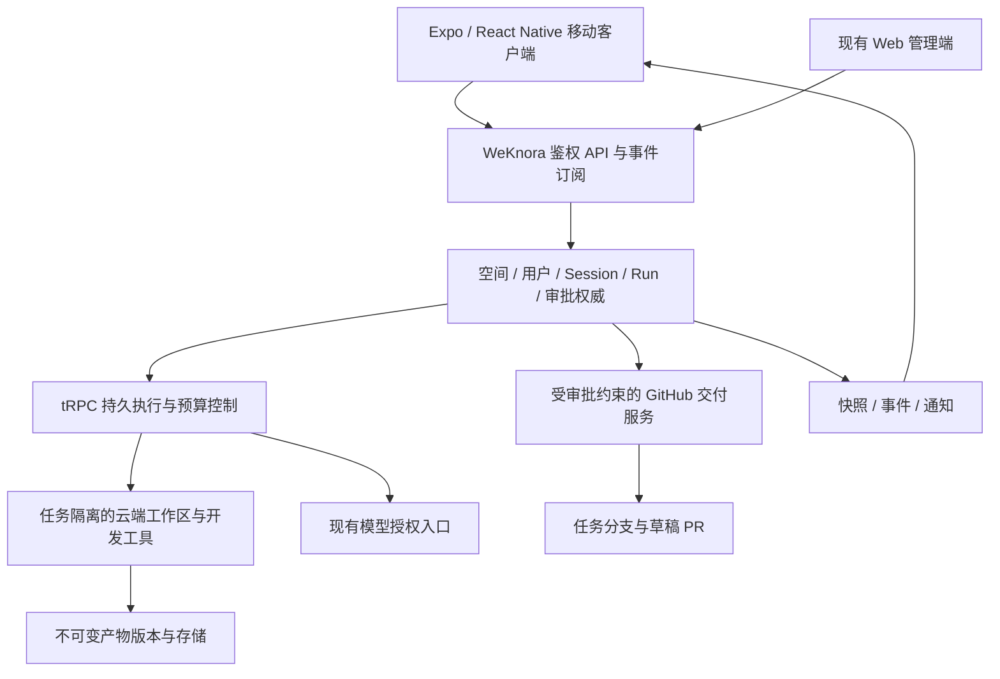

# Personal Mobile AI Office：WeKnora 云端 Developer 设计

日期：2026-09-20。状态：设计草案，等待整体审阅；Q1–Q12 的产品选择已确认，见 [ADR-0003](../../adr/0003-mobile-office-cloud-execution.md)。本次只做设计，不开始产品实现。

## 1. 目标与范围

用户从手机提交开发需求，WeKnora 在隔离的云端工作区执行代码修改与测试。手机可关闭、断网或切换设备；重新连接后查看权威状态，审批确定版本的代码交付，最终获得 GitHub 草稿 PR 或可下载文件。

第一版包括 iOS、Android、Developer、GitHub、任务时间线、文件与 Diff、终端输出观察、审批、产物下载、断线恢复与运行预算。管理配置继续使用现有 Web。Video 与 Business 只有扩展边界，不列为首版可用能力；完整编码 CLI、个人电脑执行、人工手机编辑、交互式 PTY、自动合并 PR、离线执行指令、新 Expo Web 和桌面客户端均不在首版。

Q1–Q12 确认了以上产品方向；下文具体模块、接口扩展、GitHub 接入方式、导航与沙箱验收策略是本草案提出的设计，不能冒充用户已逐项确认。

## 2. 本地代码依据与适用限制

核查基于本地工作树，三个仓库可能包含并行工作或未提交修改。记录的 HEAD 不是对未提交代码的完整快照：WeKnora `cc424e71097a4f29bd71a783964b9e4cdd6255c4`；Happy `ac64b9b4677870f7b7a9eacfd0780959229717f1`；Paseo `d636abd7a4ce302e7ccb9eb6074f637c6dd4d83b`。本轮为静态核查，未启动服务或进行真机、云沙箱、GitHub 联调。

| 代码依据 | 可复用事实与限制 |
| --- | --- |
| WeKnora `internal/application/repository/agent_run.go`、`internal/agent/trpc/engine.go` | 已有持久 Run、租约、Session 活跃运行约束与恢复入口；不等于 Developer 闭环已经完成 |
| WeKnora `internal/handler/session/workbench_read.go` | 快照与 SSE 重放可复用，游标裁剪需要重新获取快照；不能承诺每条增量永久保留 |
| WeKnora `internal/agent/approval/durable_gate.go` | 已有持久审批等待；不能直接认定覆盖 Git 推送、任意 Shell 或文件副作用 |
| WeKnora `internal/handler/session/workbench_artifacts.go` | 可复用运行归属与授权下载；Git Diff、文件树和交付版本仍需新增语义 |
| WeKnora `internal/container/paseo_provider.go`、`internal/application/service/workbench/capability_gate.go` | 存在桥接合约，远程生产准入仍有缺口；首版不依赖该路径 |
| WeKnora `internal/container/craft_runtime.go` | OpenCode 属于 Craft 专用接入；共享目录与并发限制使其不能直接承担多租户 Developer 工作区 |
| WeKnora `packages/contracts/src/mobile/`、`packages/domain/src/mobile/` | 已有执行契约、作用域和缓存规则；本次核查时 `apps/mobile/` 不存在，不能声称已有完整原生客户端 |
| WeKnora `apps/miniprogram/` | 存在 Taro 小程序，可参考认证作用域与断线恢复；其审批、下载交互不等于原生 Developer 验收能力 |
| Paseo `packages/app/src/runtime/directory-sync/index.ts`、`replica-cache/row-store.ts` | 数据类型与 Daemon 身份绑定，不能直接装入 WeKnora 账户和 Task 数据；复用思想与可分离实现 |
| Paseo `packages/server/src/server/bootstrap.ts` | Direct／Relay 都服务其 Daemon 执行链；本架构不引入该移动执行链 |
| Happy `packages/happy-server/prisma/schema.prisma` | Machine／Artifact 是账户所属、加密并版本化的数据；不等同云执行调度器或通用文件产物系统 |
| Happy `packages/happy-server/sources/app/api/routes/attachmentRoutes.ts` | 聊天图像附件与对象存储可借鉴；不能推导为已具备视频、文档的大文件产物链 |

历史 React 设计里存在 Happy 为移动底座的文字，而当前 CONTEXT 已采用 Paseo。以本轮架构决定和当前领域词汇为准，不据旧文档重建第二套账户或后端。tRPC 全面迁移规格仍作为 Agent 子系统方向；本设计使用其公共运行能力，不另建 Developer 执行循环。

## 3. 架构与职责

WeKnora 是唯一业务权威：身份、Tenant、任务、运行、审批、凭据归属与预算均由后端决定。移动缓存是读副本，推送是提示，沙箱是执行资源，三者均不能自行授予权限或宣布副作用完成。

Paseo 贡献原生客户端交互、时间线、输入、文件／Diff 阅读和断线恢复经验；Happy 贡献账户多端体验、附件交互、设备登记和版本冲突经验。两者的后端、Socket.IO 会话协议、同步 reducer 与加密账户模型不整套迁入。

建议在当前仓库的 `apps/mobile/` 增量建设客户端，将经过依赖检查的 Paseo UI 与原生能力迁入；共享 `packages/contracts`、`api-client`、`domain`、`design-tokens`、`i18n`。不复制 Paseo monorepo，不新增 Fastify Personal Cloud。移植时保留原有许可证与来源标记，原生 UI 不依赖 Web DOM 组件。

## 4. 领域与唯一身份

| 概念 | 本设计语义 |
| --- | --- |
| Tenant | 资源、权限与费用归属；用户可切换空间，个人使用也有个人空间 |
| Task | Session 的产品视图，`taskId = sessionId`，不另建独立 Task 身份 |
| Run | 一次持久执行；一个 Task 有多次 Run，任一时刻至多一个可写运行 |
| Workspace | Task 独占的持久云端文件工作区，多次 Run 复用；不同 Task 不共享可写目录 |
| Developer | 专业 Agent 配置与开发工具组合；运行由 tRPC 统一管理 |
| Artifact | Task／Run 产生的可引用版本化结果，例如 Diff、测试报告与文件包 |
| Approval | 对确定操作与确定版本的授权，不能等同一次客户端按钮点击 |

沿用当前 Session Owner 与空间权限；首版任务默认私有，已有共享机制不能赋予查看者 Owner 的 GitHub 凭据或执行权限。工作区存储与计算生命周期分离；休眠不删除文件，配额超限限制新增写入但保留查看、导出与清理。

## 5. Developer 主流程

1. 登录并选择空间，选择 Developer、获准使用的模型与云端执行环境；仅有一个环境时默认选择，不要求用户理解 Host／Daemon。
2. 通过 Owner 的 GitHub 连接选择仓库和基线，服务端将基线分支解析成固定提交。创建 Session 与工作区，登记请求幂等键和运行预算。
3. 隔离工作区取得代码；Agent 按任务授权修改文件、构建、测试。手机查看时间线、真实阶段和日志，不展示虚构完成百分比。
4. 在确定工作区版本上生成 Diff、测试结果与候选提交。展示仓库、目标分支、提交 SHA、拟推送内容和草稿 PR 内容。
5. 用户批准该交付方案。服务端重新校验 Owner、空间权限、连接授权和内容版本；随后推送任务分支并创建草稿 PR。
6. 保存提交、分支、PR 链接与产物版本作为交付回执。后续修改形成新版本，更新分支或 PR 需要新的审批；合并留在 GitHub 完成。

建议 GitHub 采用仓库范围的 App 授权，以便限制仓库和短时凭据；具体安装、用户归属、撤权与换取令牌需在接口验证阶段确认。不将管理密钥或写凭据注入通用 Shell；取代码所需只读授权也应短时、限仓库且不残留在仓库配置或日志。

审批可一次批准一份包含“推送确定提交、创建确定草稿 PR”的明确操作清单，但必须逐项持久记录结果。推送成功而创建 PR 失败时显示部分完成，核对既有分支与 PR 后仅处理未完成项，不能重做整个交付。

## 6. 权限、外部副作用与恢复

开发工具的自动执行权限只覆盖已授权工作区内修改、构建和测试。Shell 不能绕过交付服务直接推送、发送外部消息或改动生产资源。建议以沙箱身份、无写凭据和网络出口约束共同执行这一边界；依赖下载与构建网络访问采用管理员允许的策略，不能靠提示词或命令字符串黑名单替代。

审批记录建议绑定 Tenant、Owner、Session、Run、工作区版本、仓库、分支、提交、操作清单、内容摘要、有效期与版本。批准时原子比较预期版本；执行前再次检查权限与撤权状态。批准后不得继续修改同一待交付版本；后续工作基于新版本。

每次外部操作在执行前持久登记操作身份和状态；超时或断线后查询远端事实。不能保证外部系统的 exactly-once：通过稳定分支／提交／PR 关联、去重与结果核对避免盲目重试。未知结果在 UI 显示“正在核对／需要处理”，确认之前阻止同一工作区的新写运行。

停止请求先持久记录，再终止或核对正在执行的工具。服务端确认停止前保持停止中；停止不撤回已推送提交或已创建 PR。等待审批或预算暂停需要持久检查点，释放活跃执行资源；恢复先确认工作区身份、版本和运行权限，缺失时阻断而非在空目录继续。

Run 沿用现有 `queued/running/waiting_user/reconciling/succeeded/failed/canceled` 契约，预算等待、沙箱不可用与未知结果由原因及能力字段表达；若具体实现需要新状态，先修改共享契约，不在 UI 独创第二套状态机。Agent 认为完成不等于交付成功；任务显示分别反映执行结果与交付回执。

## 7. 预算与资源

空间管理员配置单 Run 的运行时长、模型消耗与工具调用次数默认上限，创建时记录本次实际额度。每个工具与模型调用开始前检查剩余预算，关联原始用量并避免重复计量。首版具体数值经代表性任务试运行决定，不宣称已有确定成本或性能。

预算耗尽后停止新操作、保留检查点与工作区，用户确认后在空间许可额度内继续；历史消耗不因继续或重试消失。建议额外定义 Task 累计消耗视图，避免用户通过多次 Run 忽略总成本。单次模型调用或已启动的外部作业可能产生在途用量，因此配额阈值不能未经验证就承诺严格零超额。

等待审批不占用活跃计算是验收目标，不是对现有代码的能力声明；沙箱暂停、文件持久化、长时等待截止时间和恢复需专项验证。存储仍有成本，保留策略沿用空间配置，不因手机断线或运行失败自动删除。

已确认的行为差异：`internal/application/service/agent_run_worker.go` 当前在持久 deadline 到期后将 Run 标记为 `failed/deadline_exceeded`，对应测试为 `agent_run_deadline_test.go`。这不等于本设计的“额度耗尽后保留可继续状态”；实施必须区分硬性失效截止时间、活跃运行预算与审批等待时间，显式设计继续的准入与历史用量继承，不能仅接现有超时处理就宣称满足预算目标。

当前 `AgentRunService.WaitForDecision` 只持久记录等待，未暂停沙箱；`DurableTaskBudget.Ensure/ReleaseUnstarted` 也不等于完整任务额度管理。现有商业适配器有模型调用预占与结算，但工具调用次数、活跃时长、预算暂停／继续需要新增统一契约。等待不应释放已经派发或结算中的外部调用额度，需先核对结果。

建议资源暂停流程由运行协调器负责：确认无仍在执行且结果未知的操作 → 持久化检查点与工作区版本 → 调用沙箱后端暂停或释放计算 → 记录暂停回执。工作区持久化由沙箱存储适配负责。失败时显示资源仍待回收，不宣称已无计算费用。审批有效期、最长等待期限与活跃时间预算分别配置；等待超期后审批失效并阻止执行，保留工作区，重新继续时重新准入和生成审批。具体时限由管理员设置，P0 必须验证状态、资源和费用事实一致。

## 8. 数据同步与离线

复用 WeKnora 执行快照、事件序列与预期 revision。Paseo directory sequence 和 Happy user seq 不成为第三套运行权威；首版不引入通用 cloudSeq 或离线命令队列。

客户端缓存按后端 origin、user、Tenant、Session／Run 分区；事件先持久写入读模型再推进游标，去重同一事件并检测缺口。首次打开读取快照后续订事件；游标裁剪、缺口或不完整快照必须重新同步，并保留“数据不完整”提示，不能丢弃缺口却标记恢复成功。

离线可看已缓存内容并保存草稿，明确最后同步时间；写命令与审批禁用。创建、停止、继续等联网操作带幂等身份，超时先查服务器结果，不将传输失败等同操作失败。切空间、退出登录时取消旧订阅并隔离或清除缓存，迟到响应不得污染当前作用域。

原生凭据使用安全存储；缓存不存长期凭据或可直接复用的下载授权。离线内容在撤权后无法保证远程即时抹除：重连后重新授权并清理不可访问缓存，后续组织如需禁止离线内容需另设产品策略。推送只携带最少定位信息，不带代码、审批正文或密钥；点击后经登录和权限检查获取最新状态。

## 9. 产物与移动交互

首版产物限定文件、Diff、测试报告和代码文件包。以 Session／Run 关联不可变版本、内容摘要、MIME、大小和存储引用，沿用现有存储与鉴权下载能力；数据库保存安全引用，后端解析实际对象位置，不暴露任意服务器绝对路径。

建议任务详情包含会话、变更、文件、终端输出、产物五个视图；审批作为明确的待处理卡片并可从首页进入。Diff 必须注明基线与交付版本；二进制、大文件或不支持的预览明确提供下载，不冒充文本预览。终端仅使用只读输出通道，隐藏输入框不能作为拒绝 PTY 写入的权限措施。

导航建议保留 Home、Tasks、Agents、Workspace、Me 的产品组织：Home 聚合活跃任务与待审批；Tasks 展示 Session 级任务；Agents 首版只有可用 Developer；Workspace 为任务工作区与产物入口；Me 提供账户、空间、通知与缓存设置。Workspace 在视觉上明确属于某任务，避免与 Tenant 混淆。完整配置和管理跳转现有 Web。

首发同时验收 iOS／Android；试点顺序由设备与发布环境决定，目前未指定。真实设备验证登录回跳、键盘、后台恢复、文件下载／系统分享、通知跳转和弱网；Web 构建通过不能替代原生验收。

## 10. 模块落点与能力缺口

| 模块 | 复用／新增职责 |
| --- | --- |
| `apps/mobile/`（拟建） | Paseo 原生体验适配，WeKnora 登录、空间作用域、任务详情、离线读缓存与原生下载 |
| `packages/contracts/src/mobile/` | 扩展 Developer 交付、Diff 版本与审批契约，保留现有执行 DTO |
| `packages/api-client/` | 复用认证与工作台接口，为增量交付能力增加窄接口；统一错误、幂等与订阅恢复 |
| `packages/domain/src/mobile/` | 纯状态计算、缓存作用域、任务表单、能力呈现；无 React Native 或 DOM 依赖 |
| `internal/application/service/` | 以现有 Session／Run 服务组合 Developer，新增仓库准备、交付版本与 GitHub 交付职责 |
| `internal/agent/` 与 `internal/sandbox/` | 复用 tRPC 和沙箱；补工具范围、只读终端、审批暂停资源释放与恢复验证 |
| `internal/handler/session/`、`internal/router/` | 扩展已有工作台/API，鉴权与授权在服务端执行；不新增平行云账户体系 |

沙箱具体后端不在本轮凭空选择供应商。实施前从部署已支持的后端选一个，必须通过任务隔离、持久卷、网络策略、暂停恢复、终止确认和只读日志测试；未通过则该后端不能作为首版可用环境。多后端完整适配不列为 MVP 前提。

尚未证明具备的关键能力：GitHub 授权完整链路、受限仓库读取、不可变 Diff／候选提交、写操作审批与核对、沙箱防止绕过外部写入、审批等待释放资源、原生持久缓存，以及双平台端到端可用性。共享契约与后端路由存在不能代替这些验收。

共享移动交互当前并不包含仓库、分支、SHA、Diff 与 PR 正文的完整审批载荷；GitHub 交付审批必须新增后端契约。共享缓存包含内存参考实现与持久化端口，原生 SQLite 等持久适配仍需建设。小程序现有“仅拒绝审批／转 Web 下载”的行为不能充当首版闭环，原生端应按本设计实现确定版本审批和授权下载。

## 11. 实施分期与验收

以下是分期建议，不是已批准执行的实施计划。

| 阶段 | 交付 | 必须证明 |
| --- | --- | --- |
| P0 能力验证 | 固定代码基线，选定一个合格沙箱，核对 tRPC 原生迁移与移动接口 | Session 隔离、运行恢复、工具授权、预算和审批暂停的真实行为；列清缺口 |
| P1 Developer 后端 | 仓库准备、工作区版本、Diff／测试产物、交付审批与 GitHub 回执 | 私有仓库只读获取；准确批准某一提交；推送／PR 部分失败可核对且不重复 |
| P2 移动闭环 | 登录、空间、创建、监督、审批、下载与离线恢复 | 关闭 App 不取消任务；重连恢复；越权被后端拒绝；只读终端不能发送命令 |
| P3 发布验证 | 双平台真实设备、推送、弱网、撤权与预算 | 以下验收场景全部通过；试点顺序和具体预算数值在试运行中确定 |

核心验收场景：

1. 私有 GitHub 仓库固定基线 → 修改 → 测试 → Diff → 批准 → 草稿 PR；每个结果都能追溯到 Session、Run 与提交。
2. 两个任务或两个空间同时运行，文件、缓存、凭据与事件不可交叉；客户端伪造身份不能越权。
3. 同一任务重复启动、重复审批、重复网络提交不会创建第二个写运行或重复交付。
4. 审批后候选内容变化、连接撤权或任务权限变化时拒绝执行旧授权。
5. 推送成功而 PR 创建失败、请求超时、执行进程崩溃时正确保留部分结果并核对，不盲目重试。
6. 手机离线只能读缓存与写草稿；云端继续工作；游标裁剪后能恢复，缺失事件不被静默当作成功。
7. 工具不能使用通用 Shell 绕过交付审批；移动端无法利用终端底层接口发送输入。
8. 达到预算、等待审批、停止中和未知结果有不同可理解状态；资源释放后文件仍在，恢复不能获得新权限。
9. 退出／切空间后旧事件与下载不能显示在新作用域；推送不携带代码和审批敏感内容。
10. iOS／Android 实机完成登录、后台恢复、审批和文件下载／分享。

## 12. 后续领域与审阅边界

Video 后续通过持久作业适配模型提交／查询／回调与媒体产物，不塞入交互式 Shell 运行状态；Business 复用连接授权、审批与副作用核对。两者共用 Task／Run、产物归属、预算与事件投影，具体流程需各自设计。

本草案需要整体确认的是：WeKnora 仓库内增量建设原生客户端、上述任务流与导航、受限开发工具和版本化交付边界、同步及恢复原则、能力验证门槛。GitHub App 接入、沙箱供应商、预算数值和移动试点顺序属于待验证／发布参数，不在此文中声称已选定或已实现。整体设计确认后才细化实施计划；本轮未授权开始产品实现。
