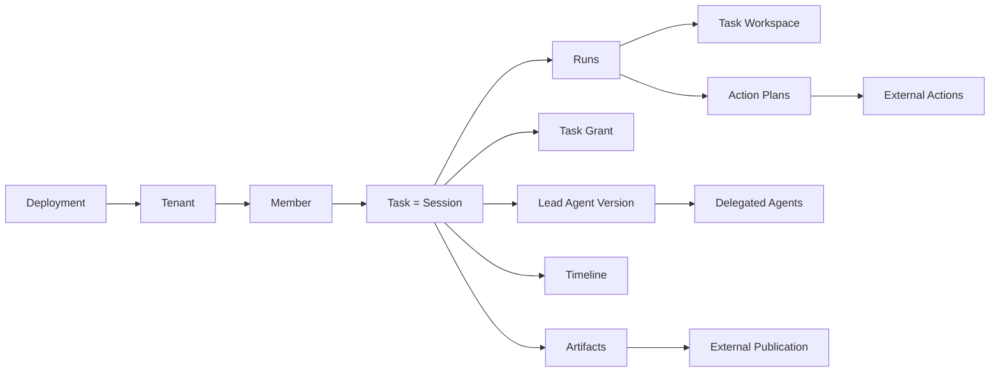
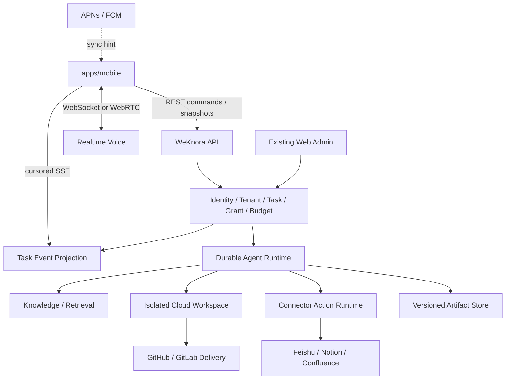

# WeKnora 移动 AI Office 设计规格

日期：2026-09-20
状态：已批准设计，实施前需完成第 15 节能力验证；本规格只定义 WHAT / WHY，不授权开始产品实现。

事实源：

- [统一领域语言](../../CONTEXT.md)
- [ADR-0003：云端执行](../adr/0003-mobile-office-cloud-execution.md)
- [ADR-0004：Task 沿用 Session 身份](../adr/0004-task-is-session.md)
- [ADR-0005：WeKnora 原生移动客户端](../adr/0005-weknora-native-mobile-client.md)
- [ADR-0006：按语义分层传输](../adr/0006-mobile-transport-by-semantics.md)
- [ADR-0007：设备身份与加密缓存](../adr/0007-registered-devices-and-encrypted-cache.md)
- [ADR-0008：Developer 交付与单写者](../adr/0008-developer-delivery-and-single-writer.md)
- [ADR-0009：云端数据信任边界](../adr/0009-cloud-data-trust-boundary.md)
- [ADR-0010：自托管移动推送](../adr/0010-self-hosted-mobile-push.md)
- [Agent Marketplace 领域模型](./2026-09-20-agent-marketplace-domain-model.md)

## 1. 产品定义

移动 AI Office 是面向团队与企业成员的 iOS / Android 原生工作入口。成员从统一输入框提交目标，由一个 Lead Agent 对结果负责，并在获准范围内使用知识、工具、专业 Agent、办公连接和开发环境完成工作。

它不是 Happy 或 Paseo 的 WeKnora 换皮，也不是知识库 App、编码 Agent 遥控器或传统 Office 编辑器。WeKnora 是身份、Tenant、Task、Run、权限、预算、审批、产物和审计的唯一业务权威；Happy 与 Paseo 只提供交互与工程参考。

首版必须共同闭环五类工作：

1. 基于获准知识回答问题并提供可打开的证据引用；
2. 多来源研究分析并生成版本化报告；
3. 生成或修改办公产物，并发布到外部办公系统；
4. 形成确定的外部操作计划，经审批后逐项执行；
5. Developer 修改代码、运行测试、展示 Diff，并交付 GitHub PR 或 GitLab MR 草稿。

首版优先服务团队和企业空间。个人使用通过单成员 Tenant 兼容，但不另建个人账户、个人计费或个人设备执行模型。

### 1.1 成功标准

- 用户无须先理解 Agent 类型、模型供应商或工具分类即可创建 Task；
- 用户离开 App、断网或切换设备后，云端任务继续运行并能恢复；
- 用户能立即看出当前结果、谁需要处理、使用了哪些来源以及发生了哪些外部操作；
- 外部写入、预算增加和代码交付都绑定确定目标与确定版本；
- 五类工作共用一套 Task、Run、时间线、授权、预算、审批、产物和恢复语义；
- 官方云和合格的企业自托管 WeKnora 都能被标准客户端连接。

## 2. 范围与非目标

### 2.1 首版范围

- iOS、Android 原生客户端和 `首页 / 任务 / 新建 / 资源 / 我的` 导航；
- 通用创建入口、Lead Agent 推荐与可选高级配置；
- Task / Run / Attention 三层状态；
- 结果优先的 Task 详情、规范时间线、证据、产物、文件、Diff 与只读终端；
- Viewer / Collaborator / Owner 协作；
- Task Grant、Action Plan、持久审批与 Task Budget；
- 语音转写和实时语音会话；
- 加密离线缓存、离线草稿和可撤销设备；
- 飞书、Notion、Confluence 的受治理读取与写入 Action；
- GitHub 与 GitLab 的个人连接和空间连接；
- 官方云、自托管实例、能力协商与两种自托管推送方案；
- 旧 Session 投影和 Taro 小程序过渡。

### 2.2 非目标

- 用户电脑、个人服务器或企业私有 Worker 上的 Agent 执行；
- Happy / Paseo 的 Daemon、Machine、Relay、Hub 或本机会话协议；
- 新 Expo Web、桌面客户端或替换现有 Vue 管理端；
- 移动端治理 Agent、知识库、连接、成员、策略与计费；
- 内置完整 Office 编辑器、移动端文件/源码直编或交互式 PTY；
- 自动合并 PR / MR、直接写受保护分支；
- 外部文档与 WeKnora 产物的双向实时同步；
- 离线运行、离线审批或联网后静默重放外部操作；
- 对外分享完整 Task；
- 声称服务端不可读取内容的端到端加密；
- 首版实现企业私有执行节点、机密计算或跨实例统一账号。

## 3. 本地代码依据

本规格基于三个本地工作树的静态核查。工作树可能含未提交或并行修改；本轮未启动服务、真机、云沙箱或外部 Connector 联调，因此“存在接口”不等于已经满足验收。

### 3.1 当前 WeKnora

| 事实 | 代码依据 | 设计含义 |
| --- | --- | --- |
| Go / Gin `/api/v1` 是当前业务 API 权威 | `internal/router/router.go:277` | 新客户端复用现有鉴权、Tenant 和应用层，不另建移动后端 |
| Tenant URL、活动 Tenant 与 API policy 已有强制约束 | `internal/router/routes_auth_tenant.go:13`、`internal/router/router.go:298` | Deployment、User、Active Tenant 共同进入请求和缓存 scope |
| Session 已有历史、fork、停止、steer、分享、Artifact 与 SSE | `internal/router/routes_chat.go:95`、`:224` | Task 沿用 Session 身份 |
| 已有持久 Run、恢复、决策、取消和事件流 | `frontend/src/api/chat/runs.ts:30`、`internal/application/service/session.go:203` | 可复用执行骨架，状态仍需核验 |
| Workbench 已有 snapshot、SSE、artifact、decision、command、target 与 device 路由 | `internal/router/routes_workbench.go:33` | 不等于五条纵向流程已经实现 |
| 工具计划已有 RequiredGrants、RecoveryPolicy、幂等键和参数摘要 | `internal/agent/nativecontract/contracts.go:167` | Task Grant、Action Plan 与 unknown outcome 深化这一 seam |
| Session 读权限和 Owner 写权限已经区分 | `internal/types/interfaces/session.go:15` | Viewer、Collaborator、Owner 必须由服务端强制 |
| 检索已有 tenant-aware engine registry | `internal/types/interfaces/retriever.go:10`、`:76` | 自动知识发现仍经过 Tenant / KB ownership 检查 |
| App Connector 已有 installation、connection 和 Action 契约 | `internal/router/routes_app_connectors.go:20` | 同步读取与外部写入分别授权 |
| 共享 TS packages 与小程序已有移动 scope、snapshot / SSE 和副作用重放规则 | `packages/domain/src/mobile/index.ts:1`、`apps/miniprogram/src/services/runtime.ts:1`、`apps/miniprogram/src/platform/transport.ts:78` | 原生端复用领域逻辑，小程序作为迁移基线 |

### 3.2 Happy

可借鉴：

- 会话页组合消息、权限请求、Agent 提问、文件和 Diff：`/Users/wuyongjun/trea/happy/packages/happy-app/sources/-session/SessionView.tsx:533`；
- 前台恢复与重连后重拉权威数据：`/Users/wuyongjun/trea/happy/packages/happy-app/sources/sync/sync.ts:216`；
- 持久更新与 ephemeral 状态分层，并以 sequence / version 补洞：`/Users/wuyongjun/trea/happy/packages/happy-server/sources/app/events/eventRouter.ts:49`；
- 附件、审批横幅、设备恢复和面向行动的通知体验。

不得迁入其公钥账户、Machine、AccessKey、个人设备执行或 Socket.IO RPC。“账户拥有机器能力”不构成企业云工作区隔离。

### 3.3 Paseo

可借鉴：

- “派发、理解进展、持续引导、审阅结果”的工作主线：`/Users/wuyongjun/trea/paseo/docs/product.md:7`；
- 实时 timeline 配合权威分页与序列补洞：`/Users/wuyongjun/trea/paseo/docs/architecture.md:379`；
- Agent 生命周期、子 Agent track、Diff、Files、Terminal、Voice 与窄屏 sheet；
- capability negotiation、慢消费者隔离、幂等创建和 unknown outcome：`/Users/wuyongjun/trea/paseo/docs/architecture.md:264`、`:331`；
- Principal、Credential、Grant 分离和语义权限：`/Users/wuyongjun/trea/paseo/docs/permissions.md:1`。

不得迁入其本地 daemon、Direct / Relay 网络链、Provider runtime、未加密 replica cache 或高权限插件模型。Paseo Workspace 也不能替代 Tenant 或 Task 专属云 Workspace。

## 4. 领域模型与不变量

完整定义以 `CONTEXT.md` 为准。

### 4.1 身份与所有权

- Deployment 是独立后端实例；一次只有一个活动实例；
- Active Tenant 是当前实例中唯一内容 scope；不跨 Tenant 混合列表或搜索；
- `taskId = sessionId`，不新增第二个 Task 聚合；
- 一个初始目标创建 Task；同目标追问继续，new / fork 才创建新 Task；
- Task 只有一个 Owner 和一个固定版本的 Lead Agent；
- Task 默认私有，只能分享给同 Tenant 的 Viewer 或 Collaborator；
- Workspace 是 Task 独占云文件工作区，不是 Tenant、Project 或页面。

### 4.2 状态分层

| 维度 | 规范状态 | 说明 |
| --- | --- | --- |
| Task 生命周期 | `active / completed / canceled / archived` | 描述用户目标；同目标追问可让 completed 回到 active |
| Run 状态 | `queued / running / waiting / succeeded / failed / unknown_result` | 描述一次执行；需与现有存储值映射或扩展 |
| Attention | `none / owner_required / collaborator_required` | 描述谁需要处理，不由最后一条消息猜测 |

Agent 自定义的“检索、分析、撰写、测试”等阶段只是时间线进度，不能替代规范状态。

### 4.3 单写者与版本

- 同一 Task 至多一个 Run 写 Workspace、Artifact 草稿或外部目标；
- 只读研究子执行可并行，由唯一写入 Run 汇总；
- Artifact 版本不可变；批注或修改指令产生新版本；
- 审批绑定确定版本；目标、内容、连接或操作集合变化后失效；
- Lead Agent 更新不会让 Task 自动漂移，显式迁移后重查 Grant；
- 子 Agent 只能获得 Task Grant 的最小子集。

## 5. 系统架构

移动缓存是可丢弃的加密读副本；SSE 是低延迟持久投影；推送是同步提示；沙箱是执行资源；外部系统是各自操作结果的事实来源。任何一方都不能独自授予权限或宣布外部副作用成功。

### 5.1 深模块与 seam

| 模块 | 小接口承担的行为 | 明确不拥有 |
| --- | --- | --- |
| Task Orchestration | 创建、开始/恢复 Run、干预、生命周期和 Attention 投影 | Tenant 身份、Connector 凭据、客户端缓存 |
| Grant & Policy | 成员权限、空间策略、Task / Delegated Grant、审批重校验 | Agent 自定义授权规则 |
| Timeline Projection | Snapshot、游标事件、补洞、摘要与证据关联 | 推送成功、客户端本地状态 |
| Artifact & Publication | 不可变版本、预览/下载、批注、新版本、发布与回执 | 外部文档协作真相 |
| Connector Action | prepare、approve、execute、reconcile、部分成功 | 把同步读取冒充写权限 |
| Developer Delivery | 固定基线、Diff、测试、提交、任务分支、草稿 PR/MR | 通用 Shell 凭据、自动合并 |
| Device & Offline | 注册/撤销、scope key、缓存策略、离线草稿 | 用户身份或 Tenant 授权 |
| Deployment Capability | 协议版本、feature flags、最低版本、安全门槛 | 调用失败后才猜测能力 |

外部办公系统、代码平台、推送方式和存储后端存在多个真实 Adapter。不要为只有一个实现的假想变化点增加浅接口。

## 6. 产品信息架构

### 6.1 一级导航

| 入口 | 首版内容 |
| --- | --- |
| 首页 | 需要我处理、正在运行、最近结果、快速新建；其他 Tenant 只显示无内容计数 |
| 任务 | 当前 Tenant 搜索、筛选、归档、我创建的和共享给我的 Task |
| 新建 | 通用目标输入、附件/链接、Lead Agent 推荐；高级配置模型、推理强度和预算 |
| 资源 | 只读浏览 Agent、知识和连接；治理跳转 Web |
| 我的 | Deployment / Tenant 切换、设备、通知、缓存、语音和个人设置 |

### 6.2 Task 详情

1. 顶部：目标、生命周期、Attention、Lead Agent 版本、Owner、预算；
2. 行动区：审批、问题、预算或失败恢复；
3. 结果区：最新结论、证据、Artifact、发布或代码交付状态；
4. 时间线：成员输入、Agent 摘要、工具、Run、审批和回执；原始日志按需展开；
5. 上下文面：Sources、Artifacts、Files、Diff、Terminal、Collaborators，按能力出现。

Developer 可突出 Diff / Files / Terminal，但仍使用统一骨架。客户端不展示虚构百分比，只展示有事实依据的阶段、计数或外部进度。

### 6.3 创建、干预与语音

- 默认只输入目标并可附加文件/链接；系统推荐 Lead Agent、知识、模型和预算；
- 有权限用户可在高级设置覆盖允许的模型、推理强度和预算；
- 运行期间明确选择“调整当前”“当前完成后再做”“停止后再开始”，并显示实际绑定 Run；
- 停止结果未知时先 reconcile，阻止冲突写 Run；
- 语音支持转可编辑草稿和实时会话，但不改变 Task / Grant / Approval；
- 确认后的文字进入时间线；原音频默认删除，策略启用留存时提示参与者；
- 高风险审批必须回到可阅读界面。

## 7. 五条纵向流程

### 7.1 知识问答

1. 创建 Task / Session 和首个 Run；
2. Lead Agent 在成员可访问且策略允许发现的知识范围内检索；
3. 结论区分原文事实、规则推导和模型推断；
4. 关键结论提供知识版本、来源和获取时间；
5. 快速完成自动收纳，同目标追问继续原 Task。

### 7.2 多来源研究

1. Lead Agent 将研究拆为最小权限只读子任务；
2. 来源进入证据集合；
3. 唯一写入 Run 汇总为版本化报告 Artifact；
4. 批注或修改指令产生新版本；
5. 最终版本可下载、Tenant 内分享或进入外部发布。

### 7.3 办公产物与外部发布

1. 生成 DOCX、XLSX、PPTX、PDF、Markdown、图片等内部 Artifact；
2. 用户选择确定版本、连接和外部目标；
3. Connector 读取目标当前版本，形成候选与 Action Plan；
4. 用户审批确定内容；
5. 后端执行并保存获批版本、外部目标、目标版本和回执；
6. 发布后外部文档是协作权威；再次修改先读当前版本，不做双向同步。

首批写入适配是飞书、Notion、Confluence。已有同步或读取连接器不能自动获得写入 Action。

### 7.4 外部操作计划

1. Agent prepare 确定操作，不把意图当授权；
2. 审批卡展示连接、目标、内容摘要、顺序、版本、成本和风险；
3. 用户可整体批准或排除单项，变化后旧批准失效；
4. 执行前重查成员、连接、Grant、预算和内容版本；
5. 每项持久记录 `prepared / executing / succeeded / failed / unknown_result`；
6. 部分成功或超时后查询外部事实，只重试确认未完成的项目。

### 7.5 Developer

1. Owner 使用个人或空间连接选择 GitHub / GitLab 仓库和基线；
2. 服务端把分支解析为固定提交，在 Task Workspace 取得代码；
3. 唯一写入 Run 修改、构建和测试；手机只读查看文件、Diff、测试和终端；
4. 生成不可变 Diff、测试报告、候选提交和 Delivery Action Plan；
5. 审批绑定仓库、基线、目标分支、SHA、PR/MR 内容和远端身份；
6. 只推任务分支并创建/更新草稿 PR/MR，不写保护分支、不自动合并；
7. 推送成功而 PR/MR 失败时显示部分完成，只补做未完成步骤。

写凭据不能注入通用 Shell。网络访问通过沙箱身份、出口策略和短时凭据控制，不能依赖提示词或命令黑名单。

## 8. 权限、协作与审批

| 角色 | 查看 | 评论 | 追加指令 / 请求 Run | 审批个人连接或交付 | 共享/取消/归档 |
| --- | --- | --- | --- | --- | --- |
| Viewer | 是 | 否 | 否 | 否 | 否 |
| Collaborator | 是 | 是 | 是 | 否 | 否 |
| Owner | 是 | 是 | 是 | 是 | 是 |

空间连接仍按自身策略决定谁能请求和批准。使用共享知识、Agent 或连接不自动扩大 Task 可见范围。Collaborator 可消耗现有 Task Budget，但不能提高预算。

授权分三层：空间策略定义禁止/自动/必审能力；Task Grant 限定本任务资源和累计预算；Action Approval 对确定副作用一次授权。Agent、UI 和工具描述都不能授予权限。执行前和恢复后重查撤权、成员、连接、预算和内容版本。

Admin 默认只见元数据、成本、安全事件和操作回执。私有内容访问走有理由、有期限、完整留痕的合规流程，可要求双人批准；它不修改共享列表。完整 Task 只在同 Tenant 共享，对外通过发布文档、Artifact 或 PR/MR。

Task Retention Policy 决定归档、法律保留和永久删除；内部删除不隐式删除外部文档或代码。

## 9. 预算与资源

- 每个 Task 必须有累计预算，覆盖 Lead Agent、委派、模型、沙箱、解析与 Connector；
- 系统给建议值和空间默认值；显示预计、已用、预占和剩余；
- BYOK 模型费用与平台沙箱/Connector Credits 分开解释；
- 达到上限后持久等待，不删除 Workspace 或历史；
- 只有 Owner 或获授权账单管理员可增加；
- 等待审批应释放可释放计算，但先确认无在途或结果未知操作；
- 资源释放、Workspace 持久化和停止计费分别需要事实回执。

现有 deadline、模型预占和 `WaitForDecision` 不等于完整 Task Budget。实施前必须区分硬截止、活跃计算预算、累计 Credits、审批期限和外部在途费用。

## 10. 同步、离线与通知

### 10.1 权威恢复

- REST 提交幂等命令并取得 Snapshot；
- SSE 事件带稳定顺序、revision 和重连游标；
- 客户端检测重复、缺口和裁剪；无法补齐时重拉 Snapshot；
- 数据不完整时显示恢复中，不静默当作成功；
- 传输超时先查命令结果，不把网络失败当业务失败；
- 推送只提示某 Deployment / Tenant 有变化，客户端重新鉴权同步。

缓存主键至少含 `deploymentId / userId / tenantId / taskId / runId`。切换 scope 时取消旧订阅，迟到响应不能写入新 scope。

离线可查看策略允许的缓存、写草稿/批注和查看最后同步时间；禁止 Run、steer、stop、approve、加预算或外部 Action。联网后由用户确认草稿，不静默提交。

本地数据库加密，scope key 由系统安全存储封装。空间可禁用内容缓存并设保留期；登出、撤销设备或权限失效后删除缓存或使 key 不可用。

默认只通知需要处理、Run 失败/未知、Task 完成和重要预算事件。普通进度只更新 App。通知正文和盲网关载荷不含代码、审批正文或敏感知识。

## 11. 设备、部署与安全

- 现有登录 / OIDC 负责用户身份；每个 Deployment 单独登记设备、公钥、推送通道和撤销状态；
- 用户和管理员可撤销设备；空间可要求生物识别、受管设备或禁用缓存；
- 设备公钥用于证明和本地 key wrapping，不取代账号或 Tenant 权限；
- 服务端可在授权范围处理明文；传输、数据库、对象存储、备份和缓存均加密；
- Connector 与代码凭据进入 Secret 管理，以短时最小权限交给受控执行；
- 客户管理密钥可作为部署能力，但不承诺执行时服务端不可见。

首次启动可选择、输入或扫描 HTTPS Deployment。登录前协商 protocol / contract version、Task / Voice / Connector / Developer / Offline capability、最低客户端版本和安全能力。普通功能可降级；缺少设备撤销、Task Grant、持久审批等关键能力时只进入解释页或有限只读模式。

标准客户端可使用可禁用的官方盲推送网关；它只接收不透明路由和无正文唤醒事件。完全隔离企业可用独立应用标识自构建 App、配置自己的 APNs / FCM，或关闭推送。两种客户端的 Token 和设备注册不能混用。

## 12. 客户端与仓库落点

| 位置 | 责任 |
| --- | --- |
| `apps/mobile/`（新增） | Expo / React Native shell、导航、Task UI、语音、下载分享、加密缓存、设备和 Deployment |
| `packages/contracts/` | Task / Run / Attention、Grant、Artifact、Action Plan、Device、Capability 和事件 DTO |
| `packages/api-client/` | scope-aware REST、SSE 恢复、幂等命令、错误与 capability client |
| `packages/domain/` | 无 UI 投影、状态、表单、缓存 scope、权限呈现和迁移 |
| design tokens / i18n / UI | WeKnora 视觉、主题、动态字体、国际化和原生安全子集 |
| `internal/application/` | Task、Grant、Artifact、Publication、Connector Action、Device、Delivery seam |
| `internal/agent/`、`internal/sandbox/` | 持久 Run、委派、隔离 Workspace、暂停恢复和只读日志 |
| handler / router | 窄 HTTP / SSE；鉴权、授权和 scope 在服务端 |
| 现有 Web | Agent、知识、连接、成员、策略、审计、Retention、预算和设备治理 |

客户端延续 WeKnora 品牌。可选择性迁移 Paseo 的布局、Diff、Files、键盘和语音模块，借鉴 Happy 的附件、审批横幅和恢复；不得复制其账户、Daemon、Machine 或 wire model。迁移代码保留许可证与来源记录。

## 13. 兼容与迁移

所有权限兼容的旧 Session 投影为 Task：只从已有 Message、Run、Artifact 计算能证明的状态，显示“旧任务”能力标记，不伪造历史 Grant、Agent Version、Budget、Approval 或 Attention。普通查看和追问可继续；需要新安全契约的操作先创建新 Run、补齐 Grant 或显式升级。不批量改身份，也不创建第二个 taskId。

Taro 小程序在原生 App 达到门槛前继续维护，并作为认证 scope、Snapshot / SSE、审批和 Artifact 契约基线。原生 App 通过登录、Deployment / Tenant 切换、五条流程、审批、产物、离线恢复、通知、双平台可访问性和安全测试后，小程序才进入维护模式；不长期要求完整对等。

## 14. 验收标准

### 14.1 统一产品

1. 五类目标从同一入口创建 Task，并使用同一详情骨架；
2. 快速问答可立即完成并收纳，追问继续原 Task；
3. 首页正确区分 Needs Attention、Running、Recent Result，不以 Run 冒充 Task 生命周期；
4. Agent 自定义阶段不改变规范状态和通知。

### 14.2 权限与隔离

5. Viewer 不能评论或运行；Collaborator 不能加预算、使用 Owner 个人连接或审批其副作用；
6. 子 Agent 不能获得超出 Task Grant 的能力；
7. 两个 Tenant / Deployment 的请求、事件、缓存、设备、下载和推送不交叉；
8. 撤权、移除成员、撤销 Agent 版本或 Grant 变化后旧批准不可执行；
9. Admin 普通权限不能读私有内容；合规访问有理由、期限和审计。

### 14.3 运行与恢复

10. 关闭 App、弱网、SSE 断开、游标裁剪和换设备后可从 Snapshot 恢复；
11. 重复创建、steer、stop、approve 或网络重试不产生第二写 Run 或重复 Action；
12. unknown result 阻止冲突写入，核对外部事实后恢复；
13. 调整当前、排队下一 Run、停止重启在 UI、时间线和执行中一致；
14. 预算耗尽、等待审批、停止中和未知结果具有不同状态与资源事实。

### 14.4 证据、产物与外部系统

15. 基于知识/外部数据的结论可追溯来源版本和时间，并区分事实、规则、模型推断；
16. Artifact 不可覆盖；审批后新版本使旧批准失效；
17. 飞书、Notion、Confluence 在部分成功、超时和版本冲突时不盲重试；
18. 再次发布前读取外部当前版本，保存新候选、批准和回执；
19. 删除内部 Task 不自动删除外部文档或代码。

### 14.5 Developer

20. 私有 GitHub / GitLab 从固定基线完成修改、测试、Diff、审批和草稿 PR/MR；
21. 个人/空间连接不互相替代，并记录发起者、批准者和远端身份；
22. 通用 Shell 无远端写凭据且不能绕过 Delivery；
23. 推送提交成功而 PR/MR 失败时只补做未完成步骤；
24. 移动端无法通过底层终端发送 PTY 输入。

### 14.6 移动与部署

25. iOS / Android 实机通过登录、OIDC 回跳、语音、后台恢复、通知、下载分享、深浅色、大字号和减少动效；
26. 离线只能读获准缓存和写草稿，联网后须确认提交；
27. 设备撤销、退出、Tenant / Deployment 切换后旧 key 与订阅不可用；
28. 自托管 capability、盲推送、关闭推送和企业自构建有契约测试；
29. 推送正文和官方网关载荷不含业务内容。

## 15. 实施前必须验证

1. 现有 Run、lease、checkpoint 和 SSE revision 能否无歧义映射三层状态；
2. 审批能否绑定 Artifact / Action Plan / Commit 版本并在恢复时重校验；
3. 沙箱能否满足 Tenant / Task 隔离、持久 Workspace、暂停恢复、出口控制、只读日志和终止确认；
4. 飞书、Notion、Confluence 哪些能力只有读取/同步，哪些已有写 Action；
5. GitHub / GitLab App、个人 OAuth、仓库 scope、短时令牌和远端去重；
6. DOCX、XLSX、PPTX、PDF 与大文件的生成、预览、比较和移动下载限制；
7. 原生加密数据库、key store、后台恢复、APNs / FCM 和语音的双平台行为；
8. 盲推送网关最小元数据、撤销、滥用防护和 opt-out；
9. 商业适配器与 Task Budget、委派累计消耗、BYOK 和资源回执的缺口；
10. 旧 Session 投影覆盖率与小程序迁移门槛。

验证结果是 Implementation Plan 输入。若与本规格或 ADR 冲突，必须回到设计阶段更新事实源，不能在实现中静默改变产品语义。

## 16. 文档完成边界

本规格确认产品范围、领域语言、用户行为、系统责任、模块 seam、安全边界、迁移方向和验收标准。它不选择沙箱供应商、不承诺预算数值或性能 SLO、不提供字段级接口和数据库迁移，也不批准开始实现。

下一阶段先完成第 15 节能力验证，再依据本规格编写 Superpowers Implementation Plan。实施计划可以拆技术任务和验证顺序，但不得把五条纵向业务流程替换成互不交付价值的前端、后端或数据库水平 Ticket。
