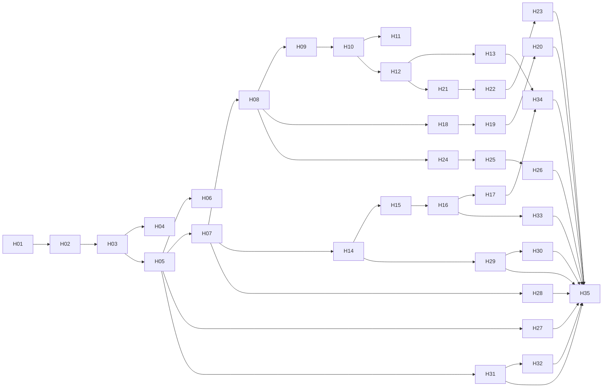

# Happy 统一 Agent 移动客户端 Implementation Plan

> **For agentic workers:** REQUIRED SUB-SKILL: Use superpowers:subagent-driven-development (recommended) or superpowers:executing-plans to implement this plan task-by-task. Steps use checkbox (`- [ ]`) syntax for tracking.

**Goal:** 保留 Happy 移动交互，通过共享契约、SDK 与领域逻辑接入 WeKnora，交付知识问答、通用 Agent、专业 Agent 的统一原生客户端。

**Architecture:** `apps/mobile` 从固定 Happy 提交引入原生壳与交互，以视图模型适配取代对全局 sync/store 的直接依赖。共享 contracts/api-client/domain 对接现有 Go REST/SSE；通知、语音和远程能力采用独立端口，不另建产品会话权威。

**Tech Stack:** Expo 55 / React Native 0.83.1 / React 19.2.0（Happy 基线声明，安装兼容性在 H01 核对）、TypeScript、pnpm 10.28.2 workspace、Vitest、Node test/tsx、Go/Gin/GORM、现有数据库。

**Spec:** [Happy 统一 Agent 移动规格](../specs/2026-09-10-happy-agent-mobile-design.md)；同时阅读 [React 多端规格](../specs/2026-09-10-react-multiclient-design.md) 和 [原迁移任务](2026-09-10-react-multiclient-migration.md)。用户已要求据规格编写详细计划；本文不是实现或验收报告。

## Global Constraints

- 移动不导入 DOM `ui/views` 或 Web `core`。
- REST/SSE/文件端点只在共享 SDK 定义；原生 transport 承担 POST、header、增量读取和取消。
- 目标目录沿用 `apps/mobile`；在引入 Happy 源文件时保留其内部组织与别名，避免同时进行无关重排。
- 不从相邻 Happy 路径加载生产依赖，不直接照抄整个 monorepo 或执行其发布脚本。
- 会话可跨轮切换 Agent。发送时记录实际 Agent；历史按消息的 Agent 标识展示，不能随当前选择回写旧消息。
- 前端能力声明用于展示，不授予权限。
- 旧链路没有稳定 Run ID 时不能伪造持久化 Run 实体。
- 不能将 `Last-Event-ID` 请求头存在视为后端重放保证；不能将网络超时解释为生成未发生。
- 未知状态先对账，禁止自动重复付费执行。
- 只有矩阵全部验收或用户明确变更范围，才能声称完整保留 Happy 移动能力。
- 保留现有 Go/API/数据/权限语义；不扩大为移动原生 Craft 首版、支付改造或全部 Runtime 替换。
- Happy 基线 `ac64b9b4677870f7b7a9eacfd0780959229717f1`；源码引入记录路径、SHA256 与许可。原始 Happy 凭证不充当 WeKnora Bearer。

---

## 1. 执行前须知

工作仓库 `/Users/wuyongjun/trea/WeKnora-fork01`，Happy 来源 `/Users/wuyongjun/trea/happy`。计划检查时共享客户端仅覆盖部分知识/认证基础，没有完整 Agent/session facade。不要根据名称猜测 API 已存在。源码权威入口：

| 对象 | 已存在的读取入口 | 约束 |
|---|---|---|
| HTTP/认证端口 | `packages/api-client/src/{client,ports,index}.ts`、`auth/refresh-coordinator.ts` | `request(ClientRequest): Promise<unknown>`；刷新响应用 `access_token`，登录用 `token` |
| 作用域 | `packages/domain/src/scope.ts` | `createScopeController`，旧 generation 失效 |
| SSE | `packages/api-client/src/chat/stream.ts` | 现有 parser 要补跨 chunk CRLF/UTF-8 测试，不能直接宣称原生可用 |
| Agent | `frontend/src/api/agent/index.ts`、`internal/router/routes_agent.go` | 复用 `custom`、`data-analysis` 等实际 preset，不伪造运行引擎 |
| 会话/消息 | `internal/router/routes_chat.go`、`internal/handler/session/{handler,types,stream,steer}.go` | 创建会话无需 KB；stop 要 `message_id`；continue-stream 是 GET |
| 工具人工交互 | `internal/router/routes_infra.go`、`internal/handler/mcp_service.go`、`mcp_oauth.go` | 执行前确认实际 handler 文件，按注册函数追踪，不猜 wire body |
| Happy 视图 | `packages/happy-app/sources/-session/SessionView.tsx`、`components/{AgentInput,ChatList}.tsx` | ChatList 目前内部读 store，AgentInput 是 ref 驱动的非受控输入 |
| Happy 服务 | `sources/sync/{apiSocket,apiVoice,ops}.ts`、Happy Server `sources/app/api/routes/{voiceRoutes,pushRoutes,machinesRoutes,sessionRoutes}.ts` | 语音依赖 provider/配额，远程是加密 RPC；不可视作普通 SSE |

开始执行前：运行 `git status --short`、`git diff --cached --name-only`，按 using-git-worktrees 创建隔离工作区；逐项带入本计划、规格和所需未提交共享改动，记录来源。不得提交其他任务的 Craft、计费、tRPC 或部署文件。若共享文件被其他实现者修改，先协调文件所有权，整合接口，不覆盖他人实现。

原 T20–T23 由本计划细分，不复制一套相互竞争的账本。执行时创建 `docs/superpowers/plans/happy-mobile-progress.md`，每行保存 Hxx、依赖、状态、实现提交、测试命令/退出码、原生/后端证据路径、阻塞原因与下一步；回写原账本只更新对应 T20–T23 的汇总，不把其余任务改成 accepted。

## 2. 子计划与顺序

通知、语音和远程控制是独立服务子系统，因此分别成册。每个子计划可在已满足依赖的核心客户端上单独发布和验证；子计划通过不等于全部移动能力完成。

| 子计划 | 任务 | 可独立演示的交付 |
|---|---|---|
| [01 原生壳与身份](2026-09-10-happy-mobile-01-foundation.md) | H01–H06 | Happy 原生壳、真实登录、切空间、移动 transport |
| [02 统一 Agent 会话](2026-09-10-happy-mobile-02-conversations.md) | H07–H13 | 无 KB Agent 的选择、会话、工具、审批、恢复 |
| [03 资源与专业展示](2026-09-10-happy-mobile-03-resources.md) | H14–H17 | 知识问答、附件、产物、data-analysis 展示 |
| [04 通知](2026-09-10-happy-mobile-04-notifications.md) | H18–H20 | 设备登记、可靠通知、授权深链 |
| [05 语音](2026-09-10-happy-mobile-05-voice.md) | H21–H23 | 语音授权、实时会话、用量与中断恢复 |
| [06 远程与高级交互](2026-09-10-happy-mobile-06-remote.md) | H24–H26 | 隔离远程连接、机器操作、目标/旁支等明确路由 |
| [07 管理与交付](2026-09-10-happy-mobile-07-delivery.md) | H27–H35 | 原生管理能力、跨端验证、安装升级与回退 |

H02 可用 fixture 演示，但真实登录依赖 H03。H10 还依赖 H06；H12 依赖现有 T12 共享审批契约；H14–H17 依赖 T07/T13 的相应资源接口。H28–H32 使用原 T08/T09/T15/T16/T17 的权威契约，若缺少 facade，就在所列共享模块实现一次，不从 Vue 直接导入。所有依赖指接口与证据，不要求等待全部 Web 页面。

## 3. 目录所有权

| 位置（均为目标仓库相对路径） | 责任 |
|---|---|
| `apps/mobile/sources/components/`、`sources/-session/`、`sources/app/` | 引入的 Happy 布局、输入、列表与路由；每次只改任务列出的文件 |
| `apps/mobile/sources/weknora/{platform,auth,agents,conversation,resources,notifications,voice,remote,management}/` | 移动专用适配与视图模型；业务端点不在这里定义 |
| `packages/contracts/src/mobile/` | 框架无关的归一化 DTO/能力与新服务接口 |
| `packages/api-client/src/{auth,agents,sessions,chat,mobile}/` | REST/SSE/二进制请求构造及响应校验 |
| `packages/domain/src/mobile/` | 纯状态机、去重、权限展示、深链选择 |
| `packages/happy-wire/` | H01 明确引入的原协议兼容包；不得把 Happy Session 当产品 DTO |
| `internal/mobile/{push,voice,remote}/` | 新服务的窄端口与核心实现；不重写现有 Agent runtime |
| `internal/handler/mobile_*.go`、`internal/router/routes_mobile.go` | 新服务 API；共享身份/资源归属规则 |
| `docs/migrations/happy/` | 来源、交互矩阵、wire fixtures、原生测试脚本说明及验收结果 |

实施新增接口统一从包 exports 导出；禁止后续任务绕过 exports 导入另一个包的私有源码。TypeScript 的示例签名是拟新增接口，不代表目前已存在。测试示例必须落到指定测试文件；不能只执行计划文档中的断言。

## 4. 测试与命令约定

当前共享测试使用 Node test：新增共享测试用 `node:test` 和 `node:assert/strict`，执行 `pnpm exec tsx --test <明确文件>`。H01 加入移动 workspace，H02 使用 Happy 已有 Vitest `environment: node` 运行纯适配测试：`pnpm --filter @weknora/mobile exec vitest run <明确文件>`。组件/手势不能由 Node adapter 测试替代，H02/H34/H35 还必须有原生行为证据。

每个任务按“失败用例 → 单文件 RED → 最小实现与接线 → GREEN → 任务验收 → 精确文件提交”执行。单个复选步骤为一次可检查动作；大型任务必须按其中列出的子行为逐次循环，不把整项塞入一个 commit。预期 RED 是业务断言失败或新增符号不存在；依赖未安装、设备缺失不是有效 RED。

新增共享测试目录必须在 `package.json` 的 test/typecheck 入口中显式纳入；不能因根脚本枚举旧目录而漏跑。移动 TS 保留基线 5.9.3 与独立 tsconfig，根共享层当前 TS 6.0.3；若新语法阻碍移动消费，修正共享语法/声明兼容，不强行升级整套 Expo。

后端任务使用标准 `testing`、httptest 与项目已有数据库测试基础设施；只跑指定包/测试。真实数据库集成必须使用隔离测试库，迁移不针对用户现有数据库运行。新迁移文件在任务中给出候选编号，执行前发现编号被并行任务占用时整体重新编号并同步计划/引用，禁止覆盖已有迁移。

## 5. 服务方案的执行门槛

本规格未定语音供应商合同、远程协议桥的部署与加密信任边界。H21/H24 给出可审查的默认实现候选、接口、验证代码及完整后续步骤；先冻结专项契约与实际集成证据再执行服务接线。该门槛只约束对应分支，不阻止 H01–H20。

- 语音候选：保留 Happy 已有 ElevenLabs 原生交互与 SDK，通过产品后端签发受会话授权的短期连接材料；不得照搬 Happy 的 RevenueCat 项目、免费额度或供应商配额策略。
- 远程候选：原 Happy 协议保持独立 remote provider，产品会话持有受授权的外部引用；不把普通产品 Bearer 发送给 Happy，原远程密钥只在设备安全存储。身份绑定证明和撤销必须先验；没有可信绑定时不启用桥。
- 如果要求不同供应商或同等级端到端加密覆盖所有 WeKnora 推理，调整专项规格与该子计划；禁止静默改信任边界或删掉能力。

## 6. 覆盖与完成判定

| 规格要求 | 实现任务 |
|---|---|
| 固定 Happy、完整交互清单、原生壳 | H01/H02/H27/H35 |
| 登录、邀请、OIDC、凭证与空间隔离 | H03–H05/H31 |
| 无 KB Agent、按轮归属、共享客户端 | H07–H10/H17 |
| 流式、停止、不重复执行、恢复 | H06/H10/H11/H34 |
| 工具、审批、OAuth、追加与建议 | H12/H13 |
| 知识/附件/文件/代码/Diff/产物 | H14–H17/H33 |
| 专业 Agent 表单/结果安全扩展 | H17/H28 |
| 通知与深链 | H18–H20 |
| 实时语音与用量 | H21–H23 |
| 远程机器、设备切换 | H24/H25 |
| 目标、fork/旁支、archive 等 | H26；普通产品会话缺失命令单独保留为未验收 |
| 配置、FAQ/Wiki/版本、数据源、组织/后台 | H28–H32，对照旧 T23 能力矩阵逐行签收 |
| 主题/语言/大字体/横屏/平板/读屏 | H27/H35 |
| 两条真实链、安装升级、回退 | H34/H35 |

H34 通过可称“核心移动闭环通过”，不能称“完整 Happy 移动能力交付”。H35 需要所有适用任务 accepted，任何语音/远程/管理缺口明确列出并保持未完成。计划不提供未经实际盘点的固定总工期。

## 7. 本次计划自审记录

覆盖检查按上表逐行执行；子计划均写明文件、消费/产出接口、失败测试、实现要点、命令与原生/真实后端验收。专项服务方案作为拟新增接口明确标记，不冒充现有 API。计划写作只检查路径、链接、任务引用、代码围栏及状态，不执行应用、安装依赖、迁移或测试。

参考核对日期 2026-09-10：[Expo 55 流式 fetch](https://docs.expo.dev/versions/v55.0.0/sdk/expo/)、[Expo 55 通知](https://docs.expo.dev/versions/v55.0.0/sdk/notifications/)。官方 API 支持说明不能代替本项目原生实测。
