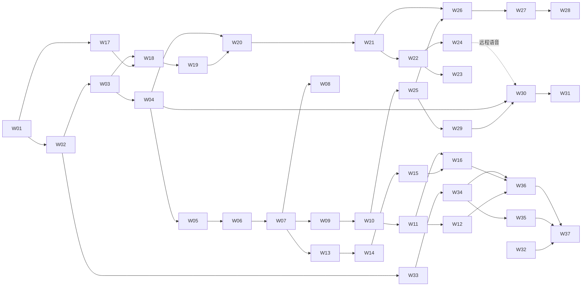

# 移动端 AI SaaS Agent 工作台 Implementation Plan

> **For agentic workers:** REQUIRED SUB-SKILL: Use superpowers:subagent-driven-development (recommended) or superpowers:executing-plans to implement this plan task-by-task. Steps use checkbox (`- [ ]`) syntax for tracking.

**Goal:** 在现有 WeKnora 中交付 Happy 原生工作台、持久 Agent 会话、可靠通知、Paseo 远程执行和受控多模态能力，形成可分阶段验收的 AI SaaS 产品。

**Architecture:** WeKnora 保持产品数据、权限、审批与预算权威；扩展现有 Run 而非另造移动任务系统。Happy 页面通过共享 SDK 和视图模型接入，Paseo 通过薄 Bridge 与受控节点执行；AWS 示例按独立交互能力移植。核心平台链、通知、远程、资源和语音按分册执行，原 Happy 交互保留计划继续追踪。

**Tech Stack:** Go 1.26.0 / Gin / GORM / PostgreSQL + SQLite；Expo 55 / React Native 0.83.1 / React 19.2.0 / TypeScript / pnpm 10.28.2；tsx/node:test、Go tests；Paseo SDK/Node 版本在 W17 固定；现有对象存储与商业服务。

**Spec:** [详细技术架构](../specs/2026-09-12-mobile-ai-saas-workbench-architecture.md)、[Happy 移动设计](../specs/2026-09-10-happy-agent-mobile-design.md)、[商业与 Connector 设计](../specs/2026-09-10-saas-billing-connectors-design.md)、[ADR-0001](../../adr/0001-open-connector-shared-runtime.md)、[CONTEXT](../../../CONTEXT.md)。执行者必须同时读取规格与相应分册。

## Global Constraints

- “采用 **Happy 移动底座 + WeKnora 产品与执行控制 + Paseo 远程编码执行接入 + AWS 示例多模态交互复用**。”
- “分批交付不取消原 Happy 交互保留要求，未交付能力继续保留在清单中。”
- “任何 Run、事件、附件、审批都通过服务端认证上下文和持久所有权解析空间。”
- “同一请求 ID 与相同参数重放返回原 Run；同 ID 不同参数返回冲突。”
- “取消、失败和超时不抹掉实际用量，也不意味着外部副作用已回滚。”
- “预算授权、工具操作批准和连接授权是三件独立的事。”
- “子 Run 共享父任务预算树，不能复制一份可消费余额；新增子执行仍需授权和准入。”
- 保持 Expo 55 / React Native 0.83.1 / React 19.2.0 与当前 pnpm 10.28.2 工作区；执行前验证锁文件。Go 1.26.0；SQLite 与 PostgreSQL 分别验收。
- 本册所有新增接口和文件是实施目标；缺少环境记 `blocked-env`，不能把静态代码、fixture 或测试跳过写为真实运行验收。
- 实施前创建隔离工作区并带入未提交规格；保留并行任务修改。只提交本任务文件；不得 `git add .`、擅自发布或改写旧台账通过状态。

---

## 0. 文档性质与范围

编写日期：2026-09-12。静态源码基线：`700ef41033a7d1b371abbc8cbac22ade25135ee0`。本轮只编写实施计划和自检材料，没有运行项目测试、安装依赖、建立执行环境或创建 GitHub Issue。台账初始状态全部 pending，不代表现有实现全部不存在或需要重写。

用户本轮授权将上一轮架构细化为实施计划。平台不可解密 E2EE、生产部署区域、具体商业模式/价格、公共自带节点发布和原生商店购买策略仍是架构已列出的独立决定；本计划不给未确认事项编造 accepted 状态。可先按核心平台链执行，相关外部能力到其任务门槛再配置和验证。

每个任务的测试片段是最小失败用例，Step 3 是关键实现接缝，Step 4 是必须完成的真实接线，Step 5 是额外必测矩阵。**仅让示例函数通过测试不构成任务完成。** 大任务中的数据库、服务、handler、UI 接线按列出的文件分成短编辑循环；一个循环只改一个可判定行为，随即运行相应测试。禁止一次批量实现整册再补测试。

## 1. 分册与独立交付

| 分册 | 任务 | 可交付结果 |
| --- | --- | --- |
| [01 共享契约与服务端执行](2026-09-12-mobile-workbench-01-core.md) | W01–W06 | 提供有租户与所有权约束、可重放、可幂等受理的统一 Run API。 |
| [02 产品身份与原生会话](2026-09-12-mobile-workbench-02-client.md) | W07–W12 | 让 Happy 页面真实消费 WeKnora 会话，支持安全登录、作用域隔离、原生流和杀进程恢复。 |
| [03 设备、可靠通知与深链](2026-09-12-mobile-workbench-03-notifications.md) | W13–W16 | 任务后台继续执行时，把待审批、完成、失败和预算不足通知可靠送达正确用户。 |
| [04 Paseo 与远程执行治理](2026-09-12-mobile-workbench-04-paseo.md) | W17–W24 | 通过受控Paseo节点运行一个Coding Agent，并具备身份隔离、启动对账、事件恢复、取消与可信用量边界。 |
| [05 文件、产物与语音](2026-09-12-mobile-workbench-05-resources-voice.md) | W25–W31 | 交付可授权上传、版本化导出、安全预览、专业结果与受预算约束的语音交互。 |
| [06 交互补齐、运行治理与发布验收](2026-09-12-mobile-workbench-06-delivery.md) | W32–W37 | 闭合交互追踪、删除与费用恢复、部署隔离和双平台发布证据，形成可分阶段发布的工作台。 |

目录只增加计划文件与 W 台账；不复制现有 H01–H35 台账。分册依赖原任务的部分必须重新验证实际代码和证据，不能从历史报告自动转为 accepted。

## 2. 执行前准备与环境约束

- [ ] 阅读本总计划、目标分册、架构对应章节、AGENTS、CONTEXT、相关 ADR；按 `docs/agents/issue-tracker.md` 用 gh 读取已关联 Issue 全文和评论。当前没有已确认本计划 Issue ID，不虚构链接；用户要求发布到追踪器时再创建并回写实际链接。
- [ ] 记录 `git status --short`、`git diff --cached --name-only`、`git rev-parse HEAD`。本轮已有 CONTEXT、商业/Connector 文档和架构等并行未提交改动，不能覆盖、清理或顺手提交。
- [ ] 执行阶段使用 using-git-worktrees 建隔离工作区或确认已隔离；默认分支前缀 codex/。将本架构、本计划和所需未提交依赖显式带入，记录内容hash；新worktree不会自动包含它们。
- [ ] 对已有实现先复验当前任务的行为测试；已满足的行为保留并补缺口，不人为破坏代码制造RED。缺失行为写失败测试，环境缺失不是有效RED。
- [ ] 禁止默认执行全仓初始化、数据库清空、种子脚本或生产API。PostgreSQL仅用隔离测试schema；原生构建在工作区明确生成目录，不删除用户设备数据。
- [ ] 每个任务的实际依赖要包含“可调用的实现”和“必要验收”；测试文件存在、Go编译成功、App启动不代表实际链路成立。

### 2.1 测试运行器

| 范围 | 命令与解释 |
| --- | --- |
| 纯TS/SDK/domain | 分册所列 `pnpm exec tsx --test exact-file.test.ts`；node:test不能交给Vitest后忽略no suite |
| Happy原有Vitest | `pnpm --filter @weknora/mobile exec vitest run <具体测试文件>`；仅用于实际采用Vitest的文件 |
| 原生组件 | 与React 19.2.0相同版本renderer或相容原生测试库；纯controller测试不代替挂载组件与UI接线 |
| Go | 分册精确package + -run；GREEN后再跑受影响包回归 |
| PostgreSQL | 使用已有 `TRPC_TEST_POSTGRES_DSN` 和 `openRunTestDB` 的 /postgres 子测试隔离schema；未设置导致SKIP必须记blocked-env |
| 全部共享层 | `pnpm run test:shared`；新增目录要加入原脚本，不只运行旧glob |
| 移动静态 | `pnpm --filter @weknora/mobile typecheck`，随后双平台export/原生构建分层验收 |

本计划中的源码代码块在相应目标文件中补齐列出的标准库/共享包 imports。新增生产模块不得从 _test.go 取helper；Go repository测试可复用现有 `openRunTestDB`、`testAdmission`，定义位置为 `internal/application/repository/agent_run_test.go`。新的helper签名必须随生产接口同步写进任务，不用“一个通用fixture”掩盖真实依赖。

### 2.2 数据库迁移序号与回退

编写时 versioned 最大序号120、sqlite最大序号040，以下为**计划保留值**。执行前若被并行任务占用，按两目录当前最大值各分配下一空闲值，并同时更新本表、分册Files和git add清单；禁止覆盖已有迁移或修改已部署旧迁移。

| 任务 | PostgreSQL / SQLite | 用途 |
| --- | --- | --- |
| W02 | 000121 / 000041 | driver、target、budget字段与engine CHECK迁移 |
| W04 | 000122 / 000042 | 请求协调、预算绑定与恢复 |
| W08 | 000123 / 000043 | 原生一次性认证交换 |
| W13 | 000124 / 000044 | 设备绑定 |
| W14 | 000125 / 000045 | 通知意图、投递和消费cursor |
| W18 | 000126 / 000046 | 目标、目录、授权引用 |
| W20 | 000127 / 000047 | 绑定、命令、回执和控制租约 |
| W21 | 000128 / 000048 | 来源事件与进程观察 |
| W23 | 000129 / 000049 | 节点注册挑战、凭据版本 |
| W26 | 000130 / 000050 | 产物版本与导入状态 |
| W30 | 000131 / 000051 | 语音会话与用量映射 |
| W33 | 000132 / 000052 | 删除墓碑与清理记录 |

每对迁移含up/down。SQLite父表重建必须保住所有引用子表，见W02；不可在开启FK级联时直接drop父表。生产回退首先关新准入并保持兼容代码，不把执行down作为默认回退。存在新driver数据的破坏性down拒绝执行，保留证据与可恢复状态。

## 3. 任务索引与依赖

| ID | 独立审查交付 | 依赖 |
| --- | --- | --- |
| [W01](2026-09-12-mobile-workbench-01-core.md) | 统一 DTO、事件和能力合同 | 无 |
| [W02](2026-09-12-mobile-workbench-01-core.md) | 持久 Run 驱动分流与所有权查询 | W01 |
| [W03](2026-09-12-mobile-workbench-01-core.md) | 所有权 facade、快照和标准 SSE | W02 |
| [W04](2026-09-12-mobile-workbench-01-core.md) | 请求幂等、预算绑定和平台执行入口 | W02、W03 |
| [W05](2026-09-12-mobile-workbench-01-core.md) | 有类型的命令与跨权限域交互 | W04 |
| [W06](2026-09-12-mobile-workbench-01-core.md) | 共享 SDK 与请求对账接口 | W01、W03–W05 |
| [W07](2026-09-12-mobile-workbench-02-client.md) | 产品会话作用域与刷新失效 | W06 |
| [W08](2026-09-12-mobile-workbench-02-client.md) | 原生 OIDC 一次性交换 | W07 |
| [W09](2026-09-12-mobile-workbench-02-client.md) | 原生流解码、持久投影与 cursor 提交 | W01、W03、W06、W07 |
| [W10](2026-09-12-mobile-workbench-02-client.md) | Happy 会话视图模型和产品导航 | W05–W07、W09 |
| [W11](2026-09-12-mobile-workbench-02-client.md) | 工作台列表、Agent 和空间入口 | W03、W07、W10 |
| [W12](2026-09-12-mobile-workbench-02-client.md) | 前后台恢复控制器与两条真实链路 | W09–W11；OIDC场景另外依赖W08 |
| [W13](2026-09-12-mobile-workbench-03-notifications.md) | 设备注册与账号切换撤销 | W07 |
| [W14](2026-09-12-mobile-workbench-03-notifications.md) | 事务事件到通知 Outbox | W03、W05、W13 |
| [W15](2026-09-12-mobile-workbench-03-notifications.md) | 供应商投递、回执与重试 | W14 |
| [W16](2026-09-12-mobile-workbench-03-notifications.md) | 安全深链与待处理卡 | W10、W11、W13–W15 |
| [W17](2026-09-12-mobile-workbench-04-paseo.md) | 固定上游与能力探针 | W01；执行前选定受控测试节点和单个provider |
| [W18](2026-09-12-mobile-workbench-04-paseo.md) | 执行目标、工作目录与当前授权 | W02、W03、W17 |
| [W19](2026-09-12-mobile-workbench-04-paseo.md) | 薄 SDK Bridge 与固定命令协议 | W17、W18 |
| [W20](2026-09-12-mobile-workbench-04-paseo.md) | 分发命令日志与不确定启动恢复 | W04、W19 |
| [W21](2026-09-12-mobile-workbench-04-paseo.md) | 远程事件去重和产品快照 | W03、W20 |
| [W22](2026-09-12-mobile-workbench-04-paseo.md) | 远程取消、审批和工作目录锁 | W05、W18、W20、W21 |
| [W23](2026-09-12-mobile-workbench-04-paseo.md) | 个人节点出站注册与撤销 | W18–W22；托管切片验收通过 |
| [W24](2026-09-12-mobile-workbench-04-paseo.md) | 受控工具、可信用量与预算树接线 | W04、W20–W22；open-connector实际调用另依赖其计划的受控dispatcher验收 |
| [W25](2026-09-12-mobile-workbench-05-resources-voice.md) | 会话附件上传、取消和校验 | W07、W10 |
| [W26](2026-09-12-mobile-workbench-05-resources-voice.md) | 远程文件导入与不可变产物版本 | W18、W21、W25 |
| [W27](2026-09-12-mobile-workbench-05-resources-voice.md) | 隔离预览与 AWS 组件来源 | W25、W26（远程版本场景） |
| [W28](2026-09-12-mobile-workbench-05-resources-voice.md) | 知识引用与专业结果注册器 | W10、W25、W27 |
| [W29](2026-09-12-mobile-workbench-05-resources-voice.md) | 按住说话、转写确认与文本提交 | W10、W25 |
| [W30](2026-09-12-mobile-workbench-05-resources-voice.md) | 语音会话授权、短期令牌和结算 | W04、W29；平台语音要求既有商业网关验证，远程绑定语音另需W24 |
| [W31](2026-09-12-mobile-workbench-05-resources-voice.md) | 实时语音、打断与后台进度展示 | W12、W15、W30 |
| [W32](2026-09-12-mobile-workbench-06-delivery.md) | 高级交互能力端口与保留清单闭合 | W10、W16、W22、W28、W31；原H24–H33按原计划分别满足 |
| [W33](2026-09-12-mobile-workbench-06-delivery.md) | 删除墓碑、远程停止和迟到用量 | W02、W04；远程停止与迟到费用部分另需W21、W22、W24，文件部分另需W26 |
| [W34](2026-09-12-mobile-workbench-06-delivery.md) | 安全部署、能力开关与可观测性 | W03、W07、W13–W15、W33；启用Paseo需W19–W24，启用语音需W30 |
| [W35](2026-09-12-mobile-workbench-06-delivery.md) | 事件保留、备份恢复与崩溃演练 | W03、W33、W34；远程故障场景需W20–W24 |
| [W36](2026-09-12-mobile-workbench-06-delivery.md) | 原生升级、兼容窗口与性能验收 | W12、W16、W34；产物需W27，语音需W31，高级能力需W32 |
| [W37](2026-09-12-mobile-workbench-06-delivery.md) | 完整验收门禁与分阶段交付报告 | 对应发布能力的全部W任务；完整Happy保留另外要求原H矩阵全部验收 |



图表示主干，分册Interfaces和任务依赖表包含额外交叉依赖，以后者为准。W33–W36按所发布能力验收：核心平台可先做平台路径；远程、语音启用前补齐对应故障与安全证据。不能因为任务有条件部分就把整行标accepted；台账分别记录core/remote/voice profile。

## 4. 首版、扩展版与完整保留的完成定义

| 发布能力 | 必要工作 | 不能替代的证据 |
| --- | --- | --- |
| 核心平台 | W01–W07、W09–W16，W33–W36适用平台部分，W37(core) | 数据库、真实无KB/知识Agent、双平台原生、权限/审批/重连、平台实际用量 |
| 原生OIDC | 核心平台 + W08 | 真实IdP冷/暖启动、一次性交换、Web兼容 |
| 托管远程 | 核心平台 + W17–W22、W24、W26及W33–W36远程部分 | 真实节点进程、丢回执故障、取消观察、隔离、可信结算 |
| 自带节点 | 托管远程契约 + W23 | 出站注册、撤销、凭据轮换、离线边界 |
| 多模态资源 | W25–W28及相关平台/远程前置 | 实际文件、授权引用、隔离预览 |
| 语音 | W29–W31、供应商/计价与原生音频证据 | 真实音频、短期授权、取消/打断区分、用量 |
| 完整Happy交互 | 上述适用能力 + W32及原H交互矩阵全部验收 | 每项真实操作与iOS/Android对应证据 |

未启用的扩展能力标 `not_in_release`，不得写为验收通过。原Happy清单中未实现的交互仍是未完成要求，不能用隐藏按钮或能力不可用提示删除它。首个可交付版本与“完整保留Happy移动能力”是两个完成口径。

## 5. 与原H计划和其他集成的关系

| 原任务 | 本增量计划 | 处理规则 |
| --- | --- | --- |
| H01–H04 | W01、W07、W08 | 保留引入/认证基础，重验缺口；不重新导入全部Happy |
| H05–H06 | W07、W09 | 作用域与原生transport补强 |
| H07–H13 | W03–W06、W10、W12 | 新Run facade与统一会话/审批 |
| H14–H17 | W25–W28 | 知识、附件、专业展示与产物 |
| H18–H20 | W13–W16 | 可靠通知和授权深链 |
| H21–H23 | W29–W31 | 转写与实时语音 |
| H24–H26 | W17–W24、W32 | 重新细化Paseo默认接入；旧Happy远程兼容要求不静默抹掉 |
| H27–H33 | W32与原子计划 | 管理、偏好、终端等原任务继续逐子行为执行 |
| H34–H35 | W35–W37 | 新工作台验收与旧矩阵验收合并报告，不共用未经验证的pass |

H27–H33具体子任务、文件与TDD代码在[原管理与交付分册](2026-09-10-happy-mobile-07-delivery.md)；高级交互在[原远程分册](2026-09-10-happy-mobile-06-remote.md)。它们是本计划完整交互目标的显式继承依赖，不是隐含“以后实现”。W32只负责新端口和逐项集成门，不能代替这些独立实现/审查单元。

open-connector沿[现有集成计划](2026-09-12-open-connector-integration.md)提供已授权Action能力。W24只接统一ActionService和同一ActionID，不重建连接OAuth、外部dispatcher或重复预算。若其实际调用未验收，远程Connector集成记blocked-env；平台已有受控工具仍可测试。商业账本与OpenMeter能力门槛沿原商业设计；不能将本计划的纯策略测试用作最终商业证据。

## 6. 文件所有权和契约协调

分册Files是实施所有权清单。共享高冲突文件 `package.json`、包index、`pnpm-lock.yaml`、`internal/router/router.go`、`internal/config/config.go`、`internal/container/container.go` 由当前任务串行整合。即使文件目录不同，存在接口依赖也不能同时抢跑。

数据模型只新增一个业务权威：现有agent_runs及配套记录。ExecutionDTO是投影，不新建可独立推进状态的移动任务表。budget_ref只引用已有预算，source_event_id只供去重，外部进程观察不复活终态Run。

分册中的Types必须在相应Create文件定义并导出；原生代码只导入公开package出口。Go跨目录代码使用本仓库module `github.com/Tencent/WeKnora`，不能编造 `internal/mobile` 下不存在的仓储helper。

### 6.1 补充签名冻结

为使后续任务独立读取，以下补齐分册中方法的具体返回值；更改时必须同步所有消费者与契约测试。

```go
// W11, package repository
type ExecutionListFilter struct { Status, AgentID, Cursor string; Limit int }
type ExecutionPage struct { Items []workbench.ExecutionDTO; NextCursor string }
func (s *AgentRunStore) ListOwnedExecutions(ctx context.Context, tenant uint64, owner string, filter ExecutionListFilter) (ExecutionPage, error)

// W14, package repository
type NotificationDelivery struct {
 ID string
 Intent NotificationIntent
 Attempt int
 Fence int64
}
func (s *NotificationStore) Ack(ctx context.Context, id, worker string, fence int64, receiptID string) error
func (s *NotificationStore) Retry(ctx context.Context, id, worker string, fence int64, next time.Time, reason string) error

// W18, package repository
func (s *ExecutionTargetStore) GetOwnedTarget(ctx context.Context, tenant uint64, actor, targetID string) (execution.Target, error)

// W33, package repository
type CleanupClaim struct { TenantID uint64; SessionID, Worker string; Epoch int64 }
func (s *ExecutionCleanupStore) TombstoneSession(ctx context.Context, tenant uint64, owner, sessionID string) error
func (s *ExecutionCleanupStore) ClaimCleanup(ctx context.Context, worker string, lease time.Duration) (CleanupClaim, error)
func (s *ExecutionCleanupStore) CompleteCleanup(ctx context.Context, claim CleanupClaim, facts execution.CleanupFacts) error
```

上述为签名清单，不是可直接编译的单文件源码；生产实现分别位于分册指定package中。所有store构造器统一接当前 `*gorm.DB`，设备store另外绑定environment。context中的tenant/actor必须经过产品认证与当前权限检查，不能让服务身份绕过目标所有权。

## 7. 台账、RED/GREEN和审查标准

[W台账](mobile-workbench-progress.md)是新增任务唯一状态源。每项保存：依赖、文件、实现提交、RED/GREEN命令与退出码、数据库/真实后端/模型/原生/外部服务证据、规格审查、质量审查、阻塞原因与下一步。

状态：pending → in_progress → implemented → review → accepted；也可转blocked-env/blocked-spec。accepted要求本任务对应发布profile所有必要证据通过。只通过unit时保留implemented或review，不升级accepted。原H台账只回写对应汇总，不替其他任务结项。

每任务执行顺序：

1. 阅读任务+依赖接口+架构章节，确认Files所有权和已有实现。
2. 逐个最小行为写失败测试，保存有效RED；修复环境与测试代码错误后重新取RED。
3. 实现最小行为，运行GREEN；再接通真实入口并验证关键反例。
4. 补数据库/原生/外部验证；没有条件就如实记录阻塞，继续不依赖该证据的计划工作。
5. 规格审查与质量审查分别给出结论；只修复发现并复验，未通过不进入依赖任务。
6. 显式git add本任务清单，检查暂存diff再范围提交。若使用Subagent-Driven，一个新实现者负责一个任务，独立两阶段review，不能让实现者报告替代审查。
7. 更新W台账与有关H汇总，保留真实命令、SHA和证据路径。

## 8. 架构覆盖检查

| 架构章节 | 实施任务 / 明确边界 |
| --- | --- |
| §1 架构结论与范围 | 全部分册；核心/扩展/完整保留profile |
| §2 现状与文档关系 | 执行前基线、W01、W32；原H与OC继承表 |
| §3 三项目取舍 | W10 Happy、W17–W24 Paseo、W27 AWS来源 |
| §4 权威与总体结构 | W02–W06、W20、W24 |
| §5 领域数据与不变量 | W01–W05、W18、W20–W24、W26、W33 |
| §6 移动模块与缓存 | W07、W09–W12、W28、W32 |
| §7 驱动与远程治理 | W02、W17–W24、W34 |
| §8 API/SSE/版本 | W01、W03–W06、W09、W21、W36 |
| §9 时序、后台、竞态 | W04、W05、W12、W14、W20、W22 |
| §10 身份与信任 | W07、W08、W13、W16、W18、W23、W24 |
| §11 商业与成本 | W04、W24、W30、W33、W36；账本实现沿原商业计划 |
| §12 资源与语音 | W25–W31 |
| §13 通知工作台 | W11、W13–W16、W31 |
| §14 部署/故障/保留 | W22、W33–W36 |
| §15 分阶段验收 | 本总计划§4、W37 |
| §16 决策门槛 | W17、W23、W27、W30、W32；私密E2EE/商店支付独立决定 |
| §17 来源与复核 | W17、W27、W32、W37 |

明确非目标：私密E2EE完整协议、动态Web应用对外发布、原生商店支付渠道改造、公共远程节点生产部署、多云自动调度。没有将这些内容隐含为本轮已设计/已交付；它们需独立规格。当前架构要求保留的其他Happy交互仍通过原计划逐项实施，不属于非目标。

## 9. 执行交接提示词

> 在隔离工作区按本总计划和六个分册执行。先核对基线、未提交依赖、迁移序号与当前任务的真实前置。使用W台账，以最小行为做RED→GREEN→数据库/真实服务/原生验证，再做规格和质量审查。所有新增代码必须接通真实入口；纯函数测试或mock不能替代功能验收。不要改变空间、商业、Connection或既有Happy保留边界。对结果不明的执行先核对，不能重发付费任务。每任务显式范围提交；未通过review不进入依赖任务。缺环境标blocked-env并给出具体下一步。结束时报告所选发布profile的已交付和未交付能力，不把计划完成、编译成功或模拟器启动写成生产验收。

## 10. 本轮自检与产物

自检记录见[计划自检](2026-09-12-mobile-workbench-plan-review.md)，机器可读任务关系见[任务索引](2026-09-12-mobile-workbench-task-index.json)。它们只验证计划结构、路径、依赖和覆盖，不是运行测试。

当前完成的是计划编写。实施尚未开始；37个增量任务均为pending。执行可选择Subagent-Driven逐任务两阶段审查，或本会话使用executing-plans逐项执行。
